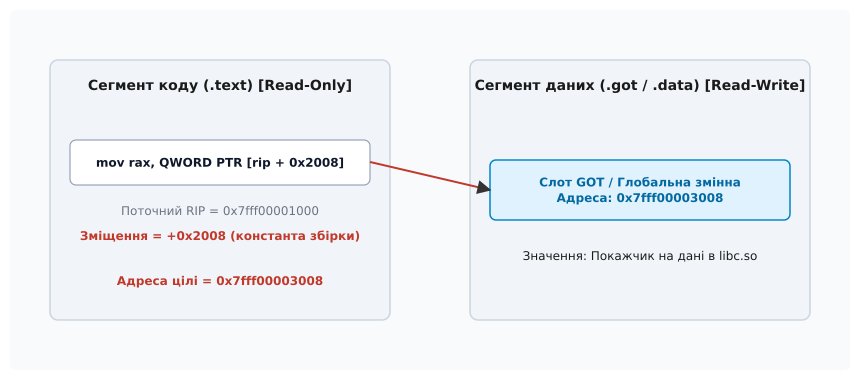
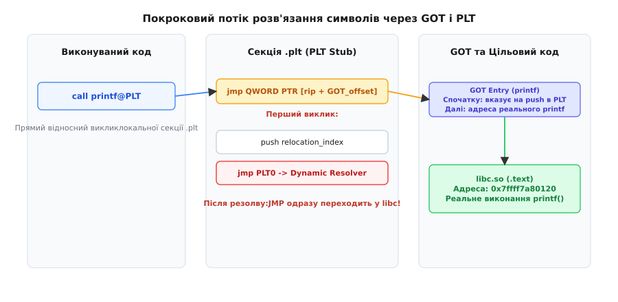
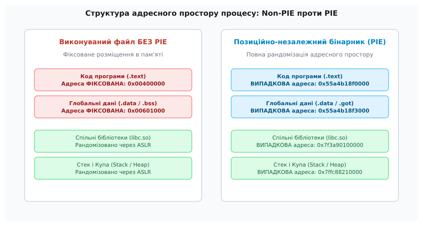

# Позиційно-незалежний код: PIC, PIE й ціна непрямості

<preknowlist>
- [Структура ELF](book:unix-linux/elf-structure) — розбиття бінарного файлу на заголовки, секції та сегменти.
- [Статичне та динамічне лінкування](book:unix-linux/static-and-dynamic-linking) — різниця між запіканням коду в бінарник та завантаженням бібліотек під час виконання.
- [Розв'язання символів](book:unix-linux/symbol-resolution) — таблиці символів, правила видимості та пошук функцій.
- [Динамічний завантажувач](book:unix-linux/dynamic-loader) — роль `ld-linux.so` при ініціалізації процесу.
</preknowlist>

Завантаження двох різних розділюваних бібліотек у пам'ять одного процесу створює колізію, якщо обидва модулі розраховують засунути свій машинний код за однією й тією ж віртуальною адресою. Якщо бібліотека `liba.so` під час компонування зібрана з розрахунком на базову адресу `0x7ffff7a00000`, а бібліотека `libb.so` вимагає для своїх інструкцій ту саму адресу `0x7ffff7a00000`, операційна система не зможе розмістити їх одночасно без виправлення машинного коду.

Спроба розв'язати цей конфлікт шляхом редагування адрес безпосередньо в сегменті коду під час завантаження призводить до скасування спільного використання пам'яті: кожна змінена сторінка коду стає унікальною для процесу. Щоб зберегти єдину копію коду у фізичній пам'яті для сотень процесів та забезпечити довільне розміщення програм, було розроблено **Позиційно-незалежний код (Position-Independent Code, PIC)** та **Позиційно-незалежні виконувані файли (Position-Independent Executable, PIE)**.

---

## 1. Конфлікт у віртуальному адресному просторі: чому абсолютні адреси ламають системне збирання

Компілятор та лінкувальник за замовчуванням генерують машинний код, розрахований на конкретне розташування у віртуальному адресному просторі (Virtual Address Space). Коли в програмі на C або C++ відбувається виклик функції або читання глобальної змінної, транслятор перетворює це звернення на інструкцію процесора з фіксованим 32-бітним або 64-бітним операндом:

```assembly
; Абсолютна адресація (Non-PIC)
mov eax, DWORD PTR [0x00601028]    ; Пряме читання з адреси 0x00601028
call 0x00401150                    ; Прямий виклик функції за адресою 0x00401150
```

Для автономного виконуваного файлу в ранніх операційних системах Unix це не створювало проблем: процесору виділявся передбачуваний діапазон адрес, і головна програма завжди завантажувалася за заздалегідь визначеним зміщенням (наприклад, `0x00400000` для x86_64).

Проблема виникає з появою динамічних бібліотек. Якщо операційна система має завантажити у віртуальну пам'ять процесу системну бібліотеку `libc.so`, а також додаткові бібліотеки `libssl.so`, `libcrypto.so` чи `libpng.so`, заздалегідь призначити кожній з них унікальну й неперетинну віртуальну адресу в масштабах усієї операційної системи стає неможливо. Кількість бібліотек у системі вимірюється тисячами, а їхні розміри змінюються з кожним оновленням чи виправленням помилок.

Якщо дві бібліотеки претендують на один і той самий діапазон віртуальних адрес, операційна система опиняється перед вибором: або змусити одну з бібліотек зміститися на іншу адресу в пам'яті, або відмовитися від завантаження програми. Якщо код бібліотеки закодовано з використанням абсолютних адрес, завантаження за іншою адресою вимагає фізичної модифікації кожного операнда в кожному виклику функції чи зверненні до змінної.

---

## 2. Ера TEXTREL та проблема знецінення спільної пам'яті (Copy-on-Write)

До винаходу справжньої позиційної незалежності операційні системи розв'язували колізію адрес за допомогою **модифікації коду під час завантаження (Load-Time Relocation)**, відомої як **TEXTREL (Text Relocations)**.

Під час збирання бібліотеки компонувальник залишав у сегменті коду `.text` спеціальні записи релокацій. Коли динамічний завантажувач (`ld-linux.so`) відображав бібліотеку в пам'ять за довільною віртуальною адресою `B`, він проходив по всіх машинописних інструкціях у секції `.text` і вручну додавав `B` до кожного абсолютного операнда.

Цей підхід працював функціонально, але повністю руйнував головну економічну перевагу розділюваних бібліотек:

1. **Скасування спільного використання сторінок:** Операційна система відображає файли бібліотек у пам'ять через системний виклик `mmap()` із прапорцем `MAP_PRIVATE`. Спочатку всі сторінки коду посилаються на ті самі фізичні фрейми пам'яті, що й для інших процесів. Проте щойно динамічний завантажувач перезаписував абсолютні адреси в машинного коду під час старту програми, ядро Linux обробляло це як спробу запису у приватну сторінку пам'яті. Через механізм **Copy-on-Write (COW)** ядро генерувало сторінковий фолт (Page Fault), перехоплювало операцію запису та створювало дублікат фізичної сторінки пам'яті, роблячи її унікальною для даного процесу. Якщо бібліотеку `libc.so` використовували 200 процесів у системі, замість однієї спільної копії коду в пам'яті виникало 200 модифікованих приватних копій. Перевага спільного використання оперативної пам'яті повністю зникала.
2. **Повільний запуск:** Обхід мільйонів інструкцій та патчинг коду при кожному запуску програми вимагав суттєвих витрат процесорного часу та активного дискового введення-виведення, оскільки всі сторінки коду доводилося зчитувати у пам'ять і модифікувати ще до початку виконання функції `main()`.
3. **Порушення захисту пам'яті:** Секція коду `.text` з міркувань безпеки має бути захищена від запису (права `PROT_READ | PROT_EXEC`). Для виконання TEXTREL завантажувачу доводилося тимчасово дозволяти запис у сторінки коду через системний виклик `mprotect(..., PROT_READ | PROT_WRITE | PROT_EXEC)`, що створювало критичне вікно уразливості для атак із модифікацією машинного коду під час виконання.

Детальну хронологію відмови від TEXTREL та переходу до сучасних ELF-стандартів висвітлено в документації [Історія позиційно-незалежного коду](book:unix-linux/position-independent-code/hist-pic-pie.md).

---

## 3. Фундаментальна архітектурна ідея: виокремлення чистих сторінок коду від процесного стану

Щоб зробити машинний код справді позиційно-незалежним, необхідно гарантувати, що **сегмент коду (`.text`) не містить жодної абсолютної адреси**. Сам машинний код мусить залишатися на 100% незмінним (Read-Only) незалежно від того, де саме в пам'яті розміщено модуль.

Рішення полягає в принциповому розділенні виконуваного модуля на дві частини:

* **Чиста інваріантна частина (Read-Only & Executable):** Сегмент коду `.text`, який залишається ідентичним для всіх процесів у системі й відображається в пам'ять як спільні сторінки (Shared Pages). Цей сегмент містить лише машинні інструкції та відносні зміщення.
* **Мутабельна частина стану (Read-Write):** Секції даних (`.data`, `.bss`, `.got`), які виділяються в окремих фізичних сторінках для кожного процесу та містять покажчики й глобальні змінні.

Оскільки код і дані в межах одного compiled-модуля (бібліотеки або бінарника) лінкуються як єдиний суцільний блок ELF-файлу, **відстань між секцією коду `.text` та секцією даних `.got` є фіксованою константою під час збирання**. Незалежно від того, за якою базовою адресою завантажено модуль під час виконання, відстань від будь-якої інструкції в `.text` до відповідної таблиці в `.got` залишається незмінною.

---

## 4. Апаратний фундамент x86_64: RIP-відносна адресація

На 32-бітній архітектурі x86 процес обчислення адреси даних вимагав складних трюків, оскільки процесор не мав інструкцій для відносної адресації даних відносно лічильника команд `EIP`. Компіляторам доводилося генерувати виклики спеціальних процедур (наприклад, `call __x86.get_pc_thunk.bx`), які витягували поточну адресу зі стека в регістр `EBX`.

З появою 64-бітної архітектури x86_64 (AMD64) апаратне забезпечення отримало пряму підтримку **RIP-відносної адресації (RIP-relative addressing)**.


*Принцип RIP-відносної адресації в x86_64: обчислення адреси даних через відносне зміщення від поточного регістра RIP.*

В архітектурі x86_64 регістр `RIP` (Instruction Pointer) завжди вказує на наступну машинну інструкцію. Процесор дозволяє виконувати завантаження та збереження даних за допомогою операнда `[rip + offset]`, де `offset` є 32-бітним числом зі знаком (діапазон від -2 ГБ до +2 ГБ):

```assembly
; Інструкція x86_64 з RIP-відносною адресацією
mov rax, QWORD PTR [rip + 0x2008]
```

Якщо ця інструкція знаходиться за віртуальною адресою `0x7fff00001000`, а її довжина становить 7 байт, то на момент обчислення адреси операнда значення `RIP` дорівнює `0x7fff00001007`. Процесор складає `0x7fff00001007` та `0x2008`, отримуючи точну віртуальну адресу цілі `0x7fff0000300f`. Якщо модуль буде завантажено за іншою базовою адресою, значення `RIP` зміниться відповідно, але зміщення `0x2008` залишиться сталим.

Завдяки RIP-відносній адресації локальні звернення до констант, статичних змінних та таблиць усередині того самого модуля стають повністю позиційно-незалежними без потреби в будь-яких додаткових регістрах чи проміжних обчисленнях.

---

## 5. Глобальна таблиця зміщень (GOT): механіка розіменування даних

Для доступу до глобальних та зовнішніх змінних (які можуть знаходитися в інших розділюваних бібліотеках) одного RIP-відносного зміщення недостатньо, оскільки відстань до іншого модуля невідома на етапі збирання і змінюється при кожному запуску програми.

Цю проблему вирішує **Глобальна таблиця зміщень (Global Offset Table, GOT)**.

GOT — це масив 64-бітних покажчиків, розташований у секції даних `.got` або `.got.plt` самого модуля. Кожен елемент цієї таблиці відповідає за один глобальний символ або функцію.

Коли машинний код у PIC-модулі намагається прочитати глобальну змінну, він виконує двоетапний доступ:

1. **Етап 1 (RIP-relative):** Інструкція читає 64-бітну адресу з відповідного слота в GOT за сталим відносним зміщенням від `RIP`.
2. **Етап 2 (Dereference):** Процесор розіменовує отриманий покажчик і читає значення самої змінної.

:::tabs
```c
/* Приклад на C: Звернення до глобальної змінної у PIC */
extern int external_symbol;

int get_symbol_value(void) {
    return external_symbol;
}
```
```cpp
// Приклад на C++: Звернення до зовнішнього об'єкта через покажчик у PIC
extern int external_symbol;

int get_symbol_value() {
    return external_symbol;
}
```
:::

У комбінованому дизасембльованому коді x86_64 це перетворюється на наступну послідовність інструкцій:

```assembly
get_symbol_value:
    endbr64
    mov    rax, QWORD PTR [rip + 0x2e15]    # Читаємо покажчик зі слота external_symbol@GOT
    mov    eax, DWORD PTR [rax]             # Розіменовуємо покажчик і отримуємо int
    ret
```

Динамічний завантажувач (`ld-linux.so`) під час станичного відображення бінарника в пам'ять знаходить потрібний символ у завантажених бібліотеках і записує його абсолютну віртуальну адресу в слот GOT. Сегмент коду при цьому залишається незмінним.

---

## 6. Таблиця зв'язування процедур (PLT) та Lazy Dynamic Binding

Для виклику зовнішніх функцій використання чистої GOT вимагало б, щоб динамічний завантажувач розв'язав адреси абсолютно всіх експортованих функцій з усіх залежних бібліотек ще до початку виконання програми. Для великих застосунків, які залежать від сотень бібліотек і тисяч функцій, це призвело б до недопустимих затримок при запуску.

Щоб оптимізувати запуск, використовується механізм **лінивого зв'язування (Lazy Binding)** за допомогою **Таблиці зв'язування процедур (Procedure Linkage Table, PLT)**.


*Покроковий потік розв'язання символів динамічним завантажувачем через GOT та PLT під час першого та наступних викликів.*

PLT — це секція коду (`.plt`), яка складається з невеличких заглушок (stubs). Для кожної зовнішньої функції компілятор створює індивідуальний PLT-стуб.

Замість прямого виклику зовнішньої функції машинний код здійснює відносний виклик відповідного PLT-стуба:

```assembly
call printf@PLT    ; Прямий відносний виклик у межах локальної секції .plt
```

### Покроковий механізм лінивого розв'язання:

1. **Початковий стан:** Під час ініціалізації програми динамічний завантажувач записує в слот `printf@GOT` адресу **другої інструкції всередині самого `printf@PLT`**. Перші три слоти GOT є резервованими:
   * `GOT[0]`: Зберігає віртуальну адресу динамічної секції `.dynamic`.
   * `GOT[1]`: Зберігає покажчик на внутрішню структуру завантажувача `link_map` (список завантажених об'єктів).
   * `GOT[2]`: Зберігає покажчик на функцію резолвера завантажувача (`_dl_runtime_resolve`).
2. **Перший виклик:**
   * Інструкція `call printf@PLT` передає управління на стуб PLT.
   * Перша інструкція стуба `jmp [rip + GOT_offset]` робить стрибок за адресою, записаною у відповідному слоті GOT.
   * Оскільки в GOT зараз лежить адреса наступного рядка PLT, процес "повертається" в PLT на інструкцію `push relocation_index`.
   * Далі виконується `jmp PLT0` — перехід на спільну нулеву секцію PLT, яка кладе на стек покажчик `link_map` із `GOT[1]` та здійснює стрибок `jmp GOT[2]`, що передає управління в `_dl_runtime_resolve`.
   * Резолвер знаходить функцію `printf` у завантаженій бібліотеці `libc.so`, **записує її справжню адресу в `printf@GOT`** і виконує первинний виклик функції.
3. **Наступні виклики:**
   * При кожному наступному виконанні `call printf@PLT` інструкція `jmp [rip + GOT_offset]` одразу здійснює прямий перехід за реальною адресою функції в `libc.so`. Спілкування з завантажувачем більше не відбувається.

---

## 7. Dynamic Linker та структури ELF-файлу (.rela.dyn, .rela.plt)

Щоб динамічний завантажувач робив точні записи у GOT, ELF-файл містить спеціалізовані службові секції:

* **`.dynamic`:** Секція-каталог, яка містить масив тегів `Elf64_Dyn` (включаючи посилання на таблицю символів, таблицю рядків та таблиці релокацій).
* **`.dynsym`:** Таблиця динамічних символів, необхідних під час виконання програми.
* **`.rela.dyn`:** Таблиця релокацій для глобальних даних та покажчиків (типи `R_X86_64_GLOB_DAT` та `R_X86_64_RELATIVE`).
* **`.rela.plt`:** Таблиця релокацій для процедурних слотів PLT (тип `R_X86_64_JUMP_SLOT`).

Динамічний завантажувач при старті аналізує заголовок `PT_DYNAMIC`, зчитує адреси цих секцій і готує структури `link_map` для кожного мапованого модуля.

Практичний огляд внутрішніх інструментів аналізу цих секцій через `readelf`, `objdump` та `gdb` детально описано у матеріалі [Дослідження PIC, PIE та релокацій на практиці](book:unix-linux/position-independent-code/proj-pic-pie-demo.md).

---

## 8. PIC проти PIE: чому головний бінарник програми відрізняється від бібліотеки

Технічна різниця між прапорцями компілятора `-fPIC` та `-fPIE` полягає у припущеннях щодо **перевизначення символів (Symbol Interposition)** та правилах видимості.

### Розділювані бібліотеки (`-fPIC`):
При компіляції динамічної бібліотеки (`.so`) компілятор змушений виходити з найгіршого сценарію: будь-яка глобальна функція або змінна бібліотеки може бути перевизначена головним виконуваним файлом або іншою бібліотекою через механізм `LD_PRELOAD`. Тому навіть якщо функція `A()` викликає функцію `B()` всередині того самого вихідного файлу `.c`, при збиранні з `-fPIC` компілятор змушений здійснювати виклик через PLT, щоб дозволити зовнішню заміну функції `B()`.

Для запобігання цьому розробники бібліотек застосовують атрибути видимості, такі як `__attribute__((visibility("hidden")))` або прапорець `-fvisibility=hidden`. Для прихованих символів компілятор знає, що вони не можуть бути перевизначені ззовні, і генерує прямі RIP-відносні виклики.

### Позиційно-незалежні бінарники (`-fPIE`):
Коли компілятор генерує код для **головного виконуваного файлу програми (PIE)**, він знає, що головний модуль знаходиться на верхівці ієрархії виконання процесу. Його внутрішні функції та глобальні змінні не можуть бути перевизначені зовнішніми бібліотеками.

Завдяки цьому компілятор застосовує важливі оптимізації:
* Локальні виклики функцій усередині бінарника виконуються через **прямі відносні інструкції `call`**, оминаючи PLT.
* Доступ до внутрішніх глобальних даних здійснюється за **прямими RIP-відносними зміщеннями**, оминаючи GOT.

Вичерпну специфікацію прапорців компілятора та системних опцій лінкувальника наведено в довіднику [Інтерфейс компілятора та типи релокацій ELF](book:unix-linux/position-independent-code/api-gcc-pic-flags.md).

---

## 9. Безпека системи: ASLR, ROP-атаки та роль PIE

Головним рушієм повного переходу сучасних операційних систем (Linux, macOS, Android) на збирання за замовчуванням у режимі PIE є кібербезпека.

**Address Space Layout Randomization (ASLR)** — це механізм ядра операційної системи, який під час кожного виклику `execve()` розміщує сегменти процесу за довільними віртуальними адресами.


*Порівняння структури адресного простору процесу під захистом ASLR для звичайного виконуваного файлу (Non-PIE) та позиційно-незалежного бінарника (PIE).*

Якщо програма скомпільована без підтримки PIE (Non-PIE):
1. Ядро Linux змушене завантажувати сегмент коду `.text` та секцію даних за статичною адресою (зазвичай `0x00400000` на x86_64).
2. Навіть якщо стек, купа та бібліотека `libc.so` рандомізовані, код самої програми залишається непорушним якорем у пам'яті.
3. Зловмисник, що експлуатує вразливість переповнення буфера, використовує техніку **Return-Oriented Programming (ROP)**. Він знаходить у незахищеному коді бінарника за фіксованими адресами фрагменти інструкцій (ROP-ґаджети, закінчувані на `ret`) і будує з них ланцюжок виконання довільного коду.

При використанні бінарника, скомпільованого з `-fPIE` та злінкованого з `-pie`, ядро завантажує весь модуль за повністю випадковою базовою адресою (ELF-тип `ET_DYN`). Жодна адреса інструкцій чи даних не є відомою заздалегідь, що робить конструювання ROP-ланцюжків практично неможливим.

---

## 10. Механізми гартування: Partial RELRO, Full RELRO та BIND_NOW

Використання GOT створює нову векторну вразливість: оскільки таблиця GOT містить покажчики на функції і за замовчуванням має залишатися доступною для запису (щоб працювало ліниве зв'язування), зловмисник із можливістю довільного запису в пам'ять (Arbitrary Memory Write) може перезаписати покажчик у GOT адресою власного шеллкоду.

Для захисту від таких атак у компонувальниках розроблено механізм **RELRO (ReLocation Read-Only)**:

### Partial RELRO (`-Wl,-z,relro`):
Компонувальник впорядковує секції ELF-файлу так, що внутрішні таблиці лінкувальника (наприклад, `.dynamic` та `.got`) розміщуються перед секцією даних `.data`. Після завершення первинних релокацій при старті завантажувач позначає ці секції як Read-Only за допомогою `mprotect()`. Однак секція `.got.plt` (яка відповідає за Lazy Binding) залишається відкритою для запису протягом усього часу виконання процесу.

### Full RELRO (`-Wl,-z,relro,-z,now`):
Примусово вимикає ліниве зв'язування. Динамічний завантажувач розв'язує **абсолютно всі функції в GOT під час запуску програми** (`BIND_NOW`). Після завершення розв'язання ядро закриває повністю доступ на запис до **всієї таблиці GOT** (`.got` та `.got.plt`) через `mprotect(..., PROT_READ)`. Будь-яка спроба перезаписати покажчик у GOT під час виконання негайно призводить до завершення процесу сигналом `SIGSEGV`.

---

## 11. Повний облік ціни непрямості: CPU cache, BTB та продуктивність

Створення позиційно-незалежного коду вимагає виваженого компромісу між безпекою, гнучкістю та швидкістю виконання.

Накладні витрати непрямості (Indirect Cost) складаються з п'яти елементів:

1. **Додаткове розіменування пам'яті:** Для доступу до зовнішніх глобальних даних процесор виконує дві інструкції `mov` замість однієї. Якщо покажчик у GOT відсутній у кеші L1/L2, це додає затримку вибірки з оперативної пам'яті (до 50–100 тактів CPU).
2. **Навантаження на передбачувач переходів (Branch Predictor / BTB):** Непрямі стрибки через PLT (`jmp [rip + GOT]`) вимагають від апаратного блоку Branch Target Buffer (BTB) збереження передбачених адрес переходів. При високій інтенсивності викликів між різними `.so` це збільшує колізії в кеші переходів.
3. **Неможливість міжмодульного вбудовування (Cross-Module Inlining):** Виклик функції через межу розділюваної бібліотеки не може бути вбудований (inlined) компілятором без використання Link-Time Optimization (LTO).
4. **Апаратний захист від непрямих атак (CET / IBT):** На сучасних процесорах Intel та AMD використання непрямих викликів через PLT вимагає виконання додаткових інструкцій `endbr64` для валідації повернень у рамках захисту Indirect Branch Tracking (IBT).
5. **Вплив захисту від побічних каналів (Retpoline):** У системах із застосуванням спекулятивних заплаток Retpoline непрямі виклики через покажчики у GOT вимагають заміни стандартних `call/jmp` на спеціальні послідовності викликів зі стековими трамплінами, що додатково збільшує затримку виклику на 10–20 тактів.

На сучасних 64-бітних процесорах x86_64 завдяки RIP-відносній адресації сумарне падіння продуктивності реальних застосунків при переході від Non-PIE до PIE становить від **0.5% до 2%**, що є цілком прийнятною платою за абсолютну рандомізацію адресного простору та гарантований захист системи.
