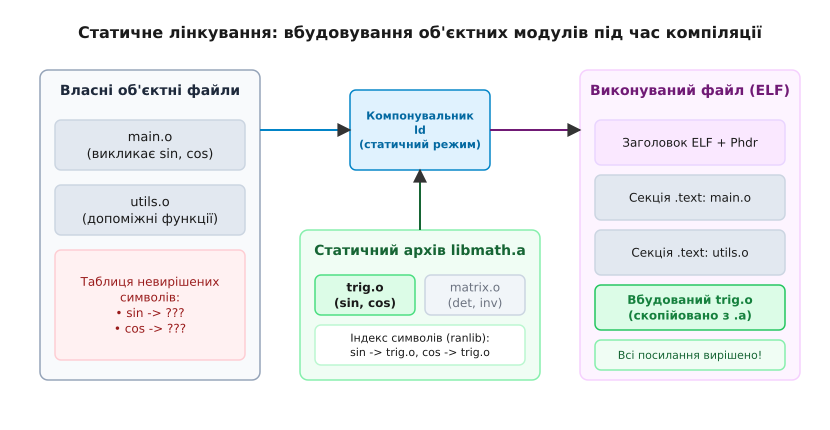
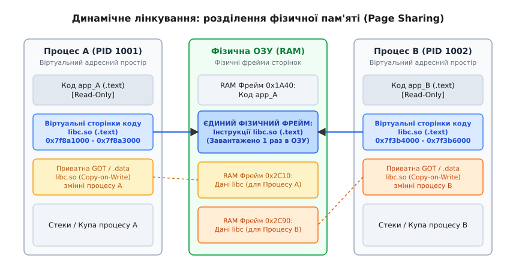
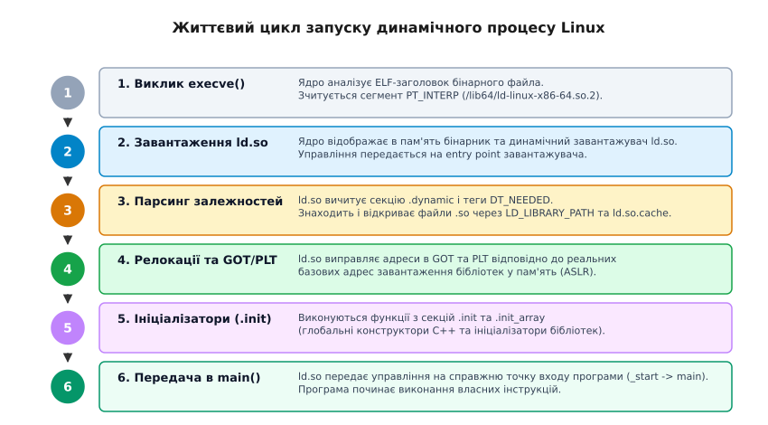

# Статичне й динамічне лінкування

<preknowlist>
- [Структура ELF](topic:unix-linux/elf-structure) — розділення коду та даних на секції, мапінг сегментів PT_LOAD у пам'ять.
- [PLT і GOT](topic:unix-linux/plt-and-got) — механізм непрямого виклику функцій через Global Offset Table та Procedure Linkage Table.
- [Позиційно-незалежний код (PIC)](topic:unix-linux/position-independent-code) — відносна адресація через RIP та прапорці компілятора -fPIC.
</preknowlist>

Коли ядро Linux виконує системний виклик `execve("/bin/ls", ...)` і зчитує 64-байтний заголовок ELF-файла, воно перш за все перевіряє наявність спеціального сегмента `PT_INTERP`. Якщо виконуваний файл зібрано статично (наприклад, за допомогою `musl-gcc -static`), цей сегмент відсутній: ядро відображає сегменти `PT_LOAD` безпосередньо у віртуальний адресний простір процесу і передає управління прямо на точку входу `_start`. Програма починає виконання миттєво — без відкриття додаткових файлів у файловій системі, без пошуку зовнішніх залежностей і без накладних витрат на релокацію адрес. Якщо ж бінарник злінкований динамічно, сегмент `PT_INTERP` містить текстовий шлях до динамічного завантажувача — `/lib64/ld-linux-x86-64.so.2`. У цьому разі ядро завантажує сам `ld.so`, і саме цей системний завантажувач, перш ніж передати управління у `main()`, відкриває десятки спільновживаних бібліотек `.so`, розраховує хеші символів, заповнює таблиці GOT/PLT та виконує ініціалізаційні конструктори коду.

Різниця між цими двома сценаріями — це не просто прапорець компілятора `-static`. Це фундаментальний розділ системної архітектури Unix, який визначає розмір бінарників на диску, споживання оперативної пам'яті (RAM), швидкість холодного старту процесів, безпеку операційної системи та методи розгортання програмного забезпечення.

---

## Чому існує етап лінкування

У мовах програмування C та C++ одиницею компіляції є окремий файл вихідного коду (`.c` або `.cpp`). Компілятор (наприклад, `gcc` або `clang`) обробляє кожен такий файл незалежно, перетворюючи його на об'єктний модуль (`.o`).

Під час компіляції `main.c` у машинний код транслятор бачить виклики функцій `printf()` або `sin()`. Оскільки визначення цих функцій у `main.c` відсутнє, компілятор не може сформувати точну адресу призначення для інструкції виклику `call`. Натомість він виконує три дії:
1. Залишає в машинного коді тимчасову порожнину (нульове зміщення в інструкції `call`).
2. Додає запис про символ `printf` до таблиці невирішених символів (unresolved symbols) об'єктного файла.
3. Створює запис у секції релокацій (`.rela.text`), який наказує: *"Після того, як з'ясується реальна адреса `printf`, впиши її за цим зміщенням"*.

Завдання об'єднання окремих об'єктних модулів та зв'язування символів з їхніми фактичними адресами покладено на **компонувальник** (linker), який у Unix-системах називається `ld`.

Залежно від того, *коли саме* і *як* відбувається вирішення цих символьних посилань, лінкування поділяється на статичне та динамічне.

---

## Статичне лінкування (Static Linking)

При статичному лінкуванні компонувальник `ld` збирає всі потрібні об'єктні файли розробника та об'єктні модулі із зовнішніх бібліотек і копіює їхній машинний код та дані безпосередньо в підсумковий виконуваний файл ELF.


*Компонувальник ld вбудовує вибрані об'єктні файли з архіву .a безпосередньо у підсумковий виконуваний файл.*

### Архітектура статичних архівів (.a)

У системному програмуванні статична бібліотека — це архів об'єктних файлів, створений за допомогою утиліти `ar` (Archive Utility). Такі файли мають розширення `.a`.

Формат `.a` за своєю суттю є простим контейнером (подібним до `.tar`), який містить послідовність бінарних файлів `.o` із заголовками фіксованої довжини. Щоб компонувальник `ld` не витрачав час на послідовний перебір усіх об'єктних файлів усередині архіву під час пошуку кожного символу, в архів вбудовується спеціальний індекс — таблиця символів (символьний заголовок `ranlib`).

Коли компонувальник обробляє командний рядок, наприклад:
```bash
gcc main.o utils.o -lmath -o my_app
```

`ld` виконує алгоритм вибіркового витягування:
1. Підтримує три списки символів: **E** (набір об'єктних файлів, які увійдуть до підсумкового бінарника), **U** (список невирішених символів) та **D** (список уже визначених символів).
2. Послідовно додає `main.o` та `utils.o` до списку **E**, оновлюючи списки **U** та **D**.
3. Коли черга доходить до архіву `libmath.a`, `ld` сканує його індекс і шукає лише ті об'єктні файли усередині архіву, які експортують символи, наявні в поточному списку **U**.
4. Знайдені об'єктні файли (наприклад, `trig.o`) витягуються з архіву і додаються до списку **E**. Об'єктні файли з архіву, які не містять потрібних для **U** символів (наприклад, `matrix.o`), **ігноруються і не копіюються** у бінарний файл.
5. Процес повторюється, доки список **U** не стане порожнім. Якщо після перевірки всіх бібліотек у списку **U** залишаються символи, `ld` видає помилку `undefined reference to ...`.

> ⚠️ **Важливість порядку аргументів `ld`:** Оскільки `ld` обробляє архіви послідовно зліва направо, порядок вказання бібліотек у командній строці компілятора є критичним. Якщо `libA.a` викликає функції з `libB.a`, то `-lA` має передувати `-lB`. Якщо вказати `-lB -lA`, на момент читання `libB.a` список **U** ще не міститиме символів з `libA.a`, і `ld` просто пропустить файл `libB.a`.

### Переваги статичного лінкування

1. **Повна автономність (Zero External Dependencies):** Виконуваний файл містить весь необхідний машинний код. Для його запуску на цільовій системі не потрібно встановлювати додаткові бібліотеки чи відстежувати їхні версії.
2. **Передбачуваність та стабільність:** Програма застрахована від ситуацій, коли системне оновлення бібліотеки на цільовій машині змінює її поведінку або вилучає потрібний символ.
3. **Максимальна продуктивність викликів (Direct Calls):** Усі виклики функцій виконуються через прямі інструкції `call offset` без непрямих стрибків через таблиці GOT/PLT.
4. **Оптимізація етапу лінкування (Link-Time Optimization, LTO):** Компонувальник бачить увесь машинний код програми одночасно. Це дозволяє здійснювати міжмодульний інлайнінг функцій (inlining), мертвий код вилучається на рівні окремих інструкцій (Dead Code Elimination), а регістри процесора розподіляються глобально.

### Недоліки статичного лінкування

1. **Дублювання коду в оперативній пам'яті (RAM):** Якщо у системі одночасно працює 50 процесів, зібраних статично з `glibc`, код системних функцій (`printf`, `malloc`, `memcpy`) завантажується в оперативну пам'ять 50 разів, марно витрачаючи сотні мегабайтів RAM.
2. **Роздуття файлів на диску:** Виконувані бінарники стають громіздкими, оскільки кожен із них тягне власну копію бібліотечного коду.
3. **Ускладнене усунення вразливостей (CVE Patching):** Якщо у криптографічній бібліотеці або у виклику `snprintf()` знайдено критичну вразливість безпеки, адміністратор не може просто оновити один системний файл. Доведеться перекомпільувати та перевидати абсолютно кожну статично злінковану програму в системі.

Детальніше про історичні причини виникнення статичних архівів та розвиток формату `ar` дивіться у вставці [📜 Еволюція лінкування](topic:unix-linux/static-and-dynamic-linking/hist-static-to-dynamic-evolution.md).

---

## Динамічне лінкування (Dynamic Linking)

При динамічному лінкуванні машинний код бібліотек **не копіюється** у виконуваний файл. Компонувальник `ld` лише перевіряє наявність потрібних символів у файлі `.so` під час компіляції і записує в заголовок ELF-файла метадані:
- Список необхідних спільновживаних бібліотек (теги `DT_NEEDED`).
- Таблицю динамічних символів (`.dynsym`).
- Посилання на динамічний завантажувач (сегмент `PT_INTERP`).

Фактичне об'єднання коду програми з кодом бібліотеки відбувається під час завантаження програми в пам'ять операційною системою.


*Фізична пам'ять із кодом бібліотеки .so відображається у віртуальний адресний простір кількох процесів, а дані копіюються за допомогою Copy-on-Write.*

### Механізм розділення сторінок пам'яті (Page Sharing)

Головний архітектурний тріумф динамічного лінкування — це **спільне використання сторінок фізичної оперативної пам'яті** (Memory Page Sharing).

Спільновживаний об'єкт (`.so`) скомпільовано як позиційно-незалежний код (Position Independent Code, PIC). Це означає, що його секція коду (`.text`) містить лише відносні інструкції адресації і не змінюється під час релокації.

Ядро Linux завантажує секцію `.text` бібліотеки `libc.so` у фізичну оперативну пам'ять **рівно один раз**. Коли в системі запускаються сотні різних динамічних процесів (наприклад, `bash`, `nginx`, `sshd`), підсистема віртуальної пам'яті ядра (VFS та MMU) відображає (map) ті самі фізичні фрейми сторінок у віртуальні адресні простори всіх цих процесів.

Аналіз використання оперативної пам'яті за допомогою системного файла `/proc/<pid>/smaps` показує розділення сторінок на чотири категорії:
- `Shared_Clean`: Програмний код бібліотек `.so` (`.text`), який є спільним для всіх процесів і не модифікувався.
- `Shared_Dirty`: Модифікована спільна пам'ять (використовується рідко, для IPC).
- `Private_Clean`: Немодифіковані сторінки, приватні для даного процесу.
- `Private_Dirty`: Змінні даних (`.data`, `.bss`, GOT), які були змінені даним процесом через механізм **Copy-on-Write (CoW)**.

З міркувань безпеки та ізоляції:
- **Секція коду (`.text`):** Позначена як Read-Only та Executable (`PROT_READ | PROT_EXEC`). Вона є єдиною і спільною для всіх процесів.
- **Секція даних (`.data`, `.bss`, GOT):** Містить глобальні змінні бібліотеки. Вона не може бути спільною. Операційна система використовує механізм **Copy-on-Write (CoW)**: кожен процес отримує власні приватні фізичні сторінки для даних бібліотеки лише тоді, коли починає змінювати глобальні змінні.

### Завантаження та зв'язування під час виконання (ld.so)

Коли ядро виконує динамічний бінарник, воно передає контроль динамічному завантажувачу `ld.so`.


*Послідовність дій ядра та динамічного завантажувача під час старту динамічно злінкованого процесу.*

Динамічний завантажувач виконує таку послідовність дій:

1. **Аналіз залежностей:** Зчитує секцію `.dynamic` виконуваного файла та формує граф залежностей на основі тегів `DT_NEEDED`.
2. **Пошук файлів .so:** Шукає бібліотеки у файловій системі за алгоритмом:
   `DT_RPATH` → `LD_LIBRARY_PATH` → `DT_RUNPATH` → `/etc/ld.so.cache` → `/lib64` → `/usr/lib64`.
3. **Відображення в пам'ять:** Викликає системні виклики `mmap()` для кожного файла `.so`, відображаючи сегменти `PT_LOAD` у віртуальний адресний простір.
4. **Вирішення символів та релокація:** Заповнює таблицю Global Offset Table (GOT) адресами завантажених функцій і змінних.
5. **Відкладене зв'язування (Lazy Binding):** За замовчуванням адреси функцій у PLT/GOT не обчислюються одразу при старті. Перший виклик функції передає управління резолверу `ld.so`, який знаходить адресу, записує її в GOT і виконує прямий перехід. Усі наступні виклики йдуть безпосередньо через GOT без участі `ld.so`. Якщо встановлено змінну `LD_BIND_NOW=1`, всі виклики релокуються одразу під час запуску.
6. **Виконання ініціалізаторів:** Послідовно викликає конструктори з секцій `.init_array` завантажених бібліотек.
7. **Передача управління:** Передає контроль на точку входу програми `_start`, яка викликає `main()`.

Повний список бінарних структур, прапорців `dlopen` та змінних оточення `ld.so` наведено у вставці [📋 Інтерфейс та структури динамічного лінкування](topic:unix-linux/static-and-dynamic-linking/api-linker-internals.md).

---

## Безпека та захист пам'яті: RELRO, PIE та ASLR

У сучасних дистрибутивах Linux динамічне лінкування щільно інтегровано з механізмами захисту операційної системи від експлойтів та атак на пам'ять.

### 1. ASLR (Address Space Layout Randomization)

ASLR рандомізує базові адреси завантаження стеку, купи та динамічних бібліотек у віртуальній пам'яті під час кожного запуску програми. Для того щоб програма могла використовувати ASLR у власному коді, її має бути скомпільовано як **PIE (Position Independent Executable)** з прапорцями `-fPIE -pie`.

### 2. RELRO (Relocation Read-Only)

Оскільки таблиця GOT містить покажчики на функції, вона є привабливою мішенню для атак типу GOT Overwrite (коли зловмисник перезаписує адресу функції в GOT адресою свого shell-коду).

Для захисту GOT використовується технологія RELRO:
- **Partial RELRO (`-Wl,-z,relro`):** Компоновальник розміщує внутрішні ELF-секції (`.got`, `.dynamic`) перед секцією коду і після завершення релокації динамічним завантажувачем позначає їх прапорцем Read-Only за допомогою системного виклику `mprotect()`. Проте секція `.got.plt` залишається доступною для запису для підтримки Lazy Binding.
- **Full RELRO (`-Wl,-z,relro,-z,now`):** Динамічний завантажувач примусово релокує абсолютно всі виклики функцій під час старту програми (до виклику `main()`), після чого робить **усю таблицю GOT повністю Read-Only** (`mprotect(..., PROT_READ)`). Будь-яка спроба перезаписати елемент GOT призводить до негайного падіння процесу з помилкою `Segmentation Fault`.

---

## Практичне порівняння створення та збірки бібліотек

Розглянемо практичний приклад створення власної математичної бібліотеки та її лінкування зі сторонньою програмою у статичному та динамічному режимах.

### Код бібліотеки та програми

:::tabs
```c
/* my_math.h — Заголовочний файл C */
#ifndef MY_MATH_H
#define MY_MATH_H

#ifdef __cplusplus
extern "C" {
#endif

int add(int a, int b);
int square(int x);

#ifdef __cplusplus
}
#endif

#endif
```
```cpp
// my_math.hpp — Заголовочний файл C++
#ifndef MY_MATH_HPP
#define MY_MATH_HPP

namespace math {
    int add(int a, int b) noexcept;
    int square(int x) noexcept;
}

#endif
```
:::

:::tabs
```c
/* my_math.c — Реалізація мовою C */
#include "my_math.h"

int add(int a, int b) {
    return a + b;
}

int square(int x) {
    return x * x;
}
```
```cpp
// my_math.cpp — Реалізація мовою C++
#include "my_math.hpp"

namespace math {
    int add(int a, int b) noexcept {
        return a + b;
    }

    int square(int x) noexcept {
        return x * x;
    }
}
```
:::

:::tabs
```c
/* app.c — Головний додаток C */
#include <stdio.h>
#include "my_math.h"

int main(void) {
    int res = square(add(3, 4));
    printf("Результат: %d\n", res);
    return 0;
}
```
```cpp
// app.cpp — Головний додаток C++
#include <iostream>
#include "my_math.hpp"

int main() {
    int res = math::square(math::add(3, 4));
    std::cout << "Результат: " << res << '\n';
    return 0;
}
```
:::

### Збірка та лінкування

:::tabs
```c
/* Команди збірки для C (GCC / Clang) */

/* === 1. СТА ТИЧНЕ ЛІНКУВАННЯ === */
/* Компіляція об'єктного файла бібліотеки */
gcc -c my_math.c -o my_math.o

/* Створення статичного архіву .a за допомогою ar */
ar rcs libmy_math.a my_math.o

/* Компіляція програми та статичне лінкування */
gcc app.c -L. -lmy_math -static -o app_static


/* === 2. ДИНАМІЧНЕ ЛІНКУВАННЯ === */
/* Компіляція об'єктного файла з прапорцем -fPIC (Position Independent Code) */
gcc -fPIC -c my_math.c -o my_math_pic.o

/* Створення спільновживаного об'єкта .so */
gcc -shared my_math_pic.o -o libmy_math.so

/* Компіляція програми з динамічним лінкуванням */
gcc app.c -L. -lmy_math -Wl,-rpath,'.' -o app_dynamic
```
```cpp
// Збірка та робота з динамічним завантаженням через C++ RAII
#include <iostream>
#include <memory>
#include <dlfcn.h>

// Оголошення сигнатури функції
using SquareFn = int(*)(int);

struct DlCloser {
    void operator()(void* h) const { if (h) dlclose(h); }
};

int main() {
    // Явне динамічне завантаження бібліотеки під час виконання
    std::unique_ptr<void, DlCloser> handle(dlopen("./libmy_math.so", RTLD_LAZY));
    if (!handle) {
        std::cerr << "Помилка відкриття .so: " << dlerror() << '\n';
        return 1;
    }

    // Отримання вказівника на функцію
    auto square_func = reinterpret_cast<SquareFn>(dlsym(handle.get(), "square"));
    if (!square_func) {
        std::cerr << "Помилка dlsym: " << dlerror() << '\n';
        return 1;
    }

    std::cout << "Динамічний виклик square(5): " << square_func(5) << '\n';
    return 0;
}
```
:::

Реалізацію власної системи плагінів та механізм перехоплення системних викликів за допомогою `LD_PRELOAD` детально розібрано у вставці [⚙️ Практика: перехоплення викликів та динамічне завантаження коду](topic:unix-linux/static-and-dynamic-linking/proj-custom-dynamic-loader-hooks.md).

---

## Архітектурне порівняння та компроміси

Вибір між статичним та динамічним лінкуванням — це інженерне рішення, яке залежить від середовища виконання програми.

| Характеристика | Статичне лінкування (`.a`) | Динамічне лінкування (`.so`) |
| :--- | :--- | :--- |
| **Розмір бінарного файла** | Великий (містить машинний код бібліотек) | Мінімальний (містить лише посилання та релокації) |
| **Використання RAM** | Високе (кожен процес має власну копію коду) | Оптимальне (сторінки коду спільно використовуються в RAM) |
| **Час запуску (Cold Start)** | Мінімальний (безпосередній перехід на `_start`) | Потрібен час для завантаження `.so` та роботи `ld.so` |
| **Продуктивність виконання**| Максимальна (прямі виклики `call`, LTO) | Невеликі накладні витрати (таблиці GOT/PLT, індирекція) |
| **Залежності середовища** | Абсолютно відсутні (автономний бінарник) | Потрібна наявність сумісних версій `.so` у системі |
| **Оновлення безпеки** | Складне (вимагає перезбірки всіх бінарників) | Просте (достатньо замінити один файл `.so` на диску) |
| **Сумісність з Docker** | Ідеальна для `scratch` та `alpine` контейнерів | Потребує наявності базового дистрибутива в контейнері |

> 🔧 **Навіщо це.**
> У сучасній системній розробці вибір підходу визначається вимогами до розгортання:
> - **Динамічне лінкування** залишається стандартом для загальносистемного ПЗ дистрибутивів Linux (Debian, Fedora, Ubuntu). Це дозволяє централізовано оновлювати бібліотеки безпеки (наприклад, `OpenSSL` або `glibc`) для всієї ОС одночасно.
> - **Статичне лінкування** переживає ренесанс у сфері хмарних мікросервісів та контейнеризації (Docker/Kubernetes). Бінарні файли, написані мовами Go або Rust і злінковані статично з `musl libc`, упаковуються в мінімалістичні контейнери `FROM scratch` розміром у кілька мегабайтів. Це повністю усуває проблему несумісності бібліотек між середовищами розробки та продакшену і зменшує поверхню потенційних атак.
