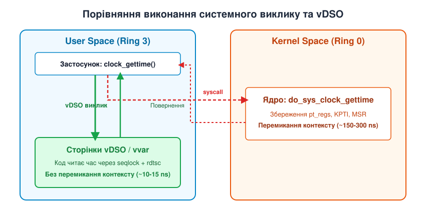
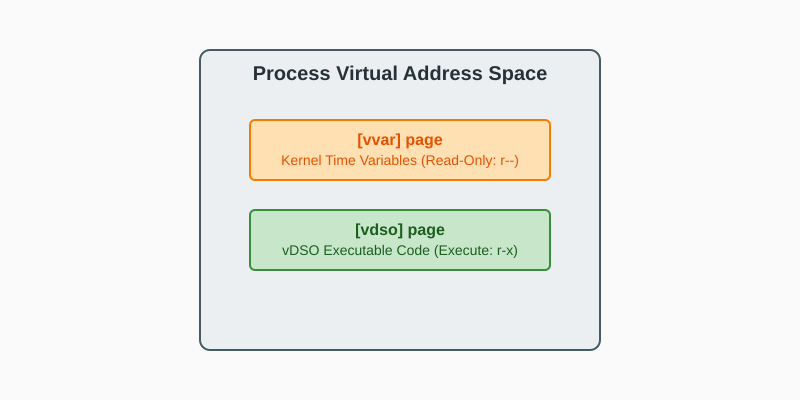
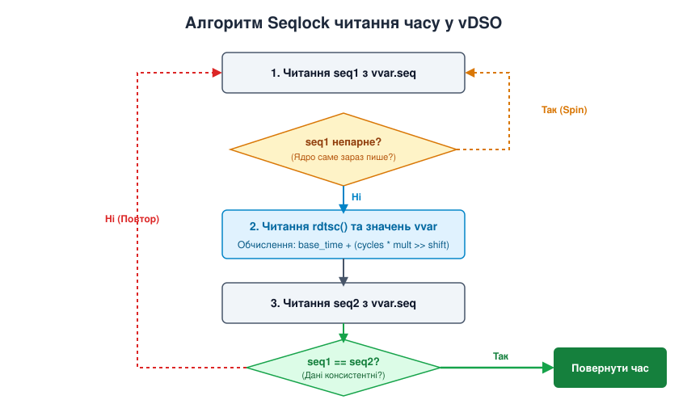

# vDSO: бібліотека від ядра в кожному процесі

<preknowlist>
- [Концепції ядра Linux](book:unix-linux/kernel-and-userspace) — перехід процесора між режимом користувача та режимом ядра через системні виклики.
- [Допоміжний вектор Auxiliary Vector](book:unix-linux/auxiliary-vector) — передача ядерних параметрів на стек процесу під час виконання `execve`.
- [Формат ELF-файлів](book:unix-linux/elf-structure) — заголовки, секції, сегменти завантаження та динамічна таблиця символів.
- [Динамічний лінкер](book:unix-linux/dynamic-loader) — завантаження shared-бібліотек, розв'язання символів та релокації.
</preknowlist>

Високонавантажений веб-сервер, база даних Redis або брокер повідомлень Kafka під час інтенсивної роботи можуть запитувати поточний час понад 10 мільйонів разів на секунду для логування, розрахунку таймаутів мережевих запитів та вимірювання затримок. Якщо кожен такий запит змушує процесор призупиняти виконання користувацького коду, виконувати апаратне перемикання кільця захисту з Ring 3 у Ring 0, змінювати вміст специфічних регістрів моделі (`MSR_LSTAR`), перезавантажувати покажчик стека з користувацького на ядерний та перезавантажувати таблиці сторінок через механізми захисту від атак Meltdown (KPTI — Kernel Page Table Isolation), сумарні накладні витрати стають катастрофічними. Один традиційний системний виклик витрачає від 150 до 300 наносекунд лише на механіку перемикання контексту, що поглинає понад 25% усіх обчислювальних ресурсів центрального процесора ще до того, як ядро встигне виконати бодай один рядок корисної логіки.

Для усунення цього архітектурного вузького місця розробники ядра Linux створили механізм **vDSO (virtual Dynamic Shared Object)**. Це спеціальна розділювана бібліотека у стандартному форматі ELF, яку ядро Linux автоматично формує у оперативній пам'яті та відображає (мапить) у віртуальний адресний простір кожного створеного процесу. Завдяки vDSO програма користувача може отримувати точний системний час, дізнаватися номер поточного процесорного ядра або ґенерувати випадкові числа шляхом звичайного виклику функції всередині власного адресного простору зі швидкістю близько 10–15 наносекунд — повністю минаючи режим ядра і не витрачаючи жодного такту процесора на перемикання контексту.

## Фізика системного виклику та ціна перемикання Ring 3 у Ring 0

Щоб зрозуміти, чому виникла потреба в vDSO, необхідно простежити покроковий шлях, який долає процесор під час виконання класичного системного виклику через інструкцію `syscall` на архітектурі x86_64.

Коли прикладний процес викликає операцію ядра, процесор виконує наступну послідовність апаратних та програмних дій:

1. **Збереження стану користувача**: Процесор копіює поточний лічильник інструкцій (`rip`) у регістр `rcx`, а регістр прапорців (`rflags`) — у регістр `r11`.
2. **Перехід у Ring 0**: Апаратний модуль CPU вилучає нову адресу виконання з системного регістра `MSR_LSTAR` (Model Specific Register Long System Target Address), куди ядро під час завантаження записало вказівник на свою функцію-обробник `entry_SYSCALL_64`. Рівень привілеїв процесора миттєво змінюється з Ring 3 (user space) на Ring 0 (kernel space).
3. **Заміна покажчика стека**: Процесор виконує спеціальну інструкцію `swapgs`, щоб вилучити вказівник на ядерну структуру даного потоку (`struct thread_info`), і замінює користувацький стек (`rsp`) на заздалегідь виділений ядерний стек даного процесу.
4. **Збереження регістрів у `pt_regs`**: Ядерний обробник push-інструкціями записує у новий стек усі 16 регістрів загального призначення процесора для формування структури `struct pt_regs`.
5. **Перемикання KPTI (Kernel Page Table Isolation)**: Якщо у системі активовано захист від апаратних вразливостей процесорів типу Meltdown, ядро змінює вміст регістра `CR3` для перемикання з користувацької таблиці сторінок на ядерну таблицю сторінок, що супроводжується частковим скиданням кешу трансляції адрес (TLB — Translation Lookaside Buffer).
6. **Диспетчеризація та виконання**: Ядро зчитує номер системного виклику з регістра `rax`, перевіряє межі таблиці системних викликів `sys_call_table`, викликає відповідну C-функцію (наприклад, `sys_clock_gettime`), вилучає результат і виконує зворотному послідовність дій для повернення через інструкцію `sysret`.

```
[User Space: clock_gettime()]
       │
       ▼ (інструкція syscall: 150-300 ns)
┌────────────────────────────────────────────────────────┐
│ 1. Збереження rip/rflags -> rcx/r11                    │
│ 2. MSR_LSTAR -> entry_SYSCALL_64 (Ring 3 -> Ring 0)    │
│ 3. swapgs + заміна rsp на ядерний стек                 │
│ 4. Збереження 16 регістрів у pt_regs                   │
│ 5. Перемикання CR3 (KPTI / TLB flush)                  │
│ 6. Пошук у sys_call_table -> виконання                 │
└────────────────────────────────────────────────────────┘
       │
       ▼ (інструкція sysret)
[User Space: Повернення значення]
```

Для важких операцій введення-виведення (таких як зчитування блоку даних обсягом 4 Мегабайти з NVMe-накопичувача `read()`), де фізичне читання або очікування переривання контролера займає десятки мікросекунд, накладні витрати у 200 наносекунд становлять частки відсотка від загального часу операції і є повністю виправданою ціною за ізоляцію та безпеку ядра.

Проте для операцій типу `clock_gettime(CLOCK_REALTIME, &ts)`, мета яких — прочитати пару чисел зі структури даних пам'яті, виконання 6 апаратних кроків перемикання контексту є надмірним. Якщо процес робить 10 мільйонів викликів на секунду, система витрачає:

```
10 000 000 × 200 ns = 2 000 000 000 ns = 2.0 секунди обчислювального часу
```

Це означає, що два повних процесорних ядра сервера будуть беззупинно зайняті лише збереженням та відновленням регістрів процесора.

## Фіксований механізм vsyscall та причини його занепаду

Перша спроба обійти ці накладні витрати з'явилася під час розробки 64-бітної версії Linux у 2001 році у вигляді механізму `vsyscall` (virtual system call). 

Ідея `vsyscall` полягала у тому, що ядро виділяло одну сторінку пам'яті (4 КБ) і мапило її у віртуальний адресний простір **кожного** процесу за жорстко зафіксованою у специфікації архітектури адресою: `0xffffffffff600000`. На цій сторінці ядро розміщувало код трьох функцій: `vgettimeofday`, `vtime` та `vgetcpu`. Програма могла виконати виклик за цією константною адресою як звичайну функцію C.

Проте механізм `vsyscall` швидко продемонстрував серйозні обмеження. Для детального розбору виникнення цього механізму, його апаратної специфіки та причин виведення з експлуатації див. [Історія vsyscall та vDSO](book:unix-linux/vdso/hist-vsyscall-to-vdso.md).

Критичними вадами `vsyscall` стали:
- **Обмеження обсягу**: Сторінка була жорстко обмежена розміром 4 КБ. Додати нові функції або розширити складність обчислень було неможливо.
- **Вразливість для ASLR**: Фіксована адреса `0xffffffffff600000` виявилася катастрофою для безпеки. Коли в операційних системах впровадили рандомізацію адресного простору (ASLR — Address Space Layout Randomization), сторінка `vsyscall` залишалася єдиним ділянкою пам'яті з відомими координатами, що дозволило зловмисникам використовувати її інструкції як ROP-гаджети (Return-Oriented Programming) для конструювання атак переповнення буфера.

На зміну застарілому `vsyscall` прийшла гнучка та динамічна концепція vDSO. На нижченаведеному малюнку проілюстровано кардинальну різницю між традиційним шляхом системного виклику та прямим виконанням через vDSO.


*Шлях виконання звичайного системного виклику через перемикання контексту та оптимальний виклик через упроваджену ядром бібліотеку vDSO.*

## Архітектура vDSO: динамічна ELF-бібліотека у пам'яті процесу

На відміну від `vsyscall`, **vDSO (virtual Dynamic Shared Object)** не є жорстко зафіксованою сторінкою і не є файлом, що фізично зберігається на диску (наприклад, у `/lib64/`). vDSO — це повноцінний бінарний образ розділюваної бібліотеки у форматі ELF, який компілюється безпосередньо разом із сирцевим кодом ядра Linux для конкретної апаратної архітектури.

Коли ядро виконує системний виклик `execve()` для запуску нової програми, воно робить наступне:

1. **Виділення пам'яті**: Ядро виділяє кілька сторінок у віртуальному адресному просторі нового процесу.
2. **Застосування ASLR**: Адреса відображення обирається випадковим чином за допомогою генератора псевдовипадкових чисел системи ASLR.
3. **Копіювання образу**: Ядро копіює підготовлений ELF-образ vDSO у виділені сторінки пам'яті.
4. **Передача адреси через Auxiliary Vector**: Ядро формує на стеку процесу масив параметрів Auxiliary Vector (`auxv`) і записує вказівник на ELF-заголовок завантаженого vDSO під ключем `AT_SYSINFO_EHDR` (значення `0x21`).

Коли динамічний лінкер (наприклад, `/lib64/ld-linux-x86-64.so.2` у випадку `glibc` або `ld-musl.so` у випадку `musl`) починає ініціалізацію процесу, він зчитує стек, знаходить тег `AT_SYSINFO_EHDR` і отримує базову адресу vDSO. Лінкер парсить ELF-таблицю символів (`.dynsym`) vDSO так само, як і для будь-якої іншої бібліотеки (`libc.so`, `libm.so`), знаходить адреси експортованих функцій (`__vdso_clock_gettime`, `__vdso_gettimeofday` тощо) і зв'язує з ними внутрішні вказівники C-бібліотеки.

Повний перелік типів Auxiliary Vector, констант та експортованих символів vDSO для різних архітектур наведено у [Довідник символів vDSO та AUXV](book:unix-linux/vdso/api-vdso-symbols-and-auxv.md).

Якщо запустити стандартну утиліту `ldd` для будь-якого виконуваного файлу в Linux, у списку залежностей завжди буде присутній vDSO:

```bash
$ ldd /bin/ls
    linux-vdso.so.1 (0x00007ffca7bfd000)
    libc.so.6 => /lib/x86_64-linux-gnu/libc.so.6 (0x00007f3b8a000000)
    /lib64/ld-linux-x86-64.so.2 (0x00007f3b8a385000)
```

Назва `linux-vdso.so.1` вказує на віртуальну бібліотеку, а адреса `0x00007ffca7bfd000` кожного разу змінюється при перезапуску програми завдяки ASLR.

## Внутрішня будова: розділення сторінок [vdso] та [vvar]

Для забезпечення функціонування викликів вимірювання часу без переходу в режим ядра одного лише коду vDSO недостатньо. Коду необхідний доступ до поточних даних системного годинника, які безперервно оновлюються ядром.

Для цього ядро відображає у простір процесу **дві суміжні, але строго розділені ділянки віртуальної пам'яті**:

1. **Сторінка коду `[vdso]`**: Містить виконуваний машинний код функцій vDSO. Секція пам'яті має прапорці доступу **Read та Execute (`r-xp`)**. Процес може читати та виконувати цей код, але спроба запису призведе до помилки `SIGSEGV`.
2. **Сторінка даних `[vvar]`**: Містить структуру даних `vdso_data` із поточними змінними часу ядра. Секція пам'яті має прапорці доступу **Read-Only (`r--p`)**.

На наступній схемі показано розміщення цих сторінок у віртуальному адресному просторі процесу та зв'язок із допоміжним вектором на стеку.


*Розміщення сторінки даних vvar (права r--) та сторінки коду vDSO (права r-x) в адресному просторі процесу.*

Чому сторінка `vvar` замаплена виключно у режимі `Read-Only`? Це фундаментальна вимога безпеки та стабільності системи. Ядро є єдиним володарем, який має право оновлювати системний час у `vvar` (через прямому мапування своїх фізичних сторінок). Якщо б прикладний процес мав права запису у `vvar`, будь-яка помилка у коді (наприклад, вихід за межі буфера) або цілеспрямований зловмисний вплив могли б спотворити системні змінні часу для всієї системи або спричинити збій у роботі алгоритмів синхронізації.

## Механіка Zero-Syscall Time Reading: Seqlock та rdtsc

Найважливішим завданням vDSO є забезпечення алгоритму отримання точного часу без системних викликів (**zero-syscall time reading**). 

Тут виникає складне інженерне питання: як ядро може оновлювати змінні часу на сторінці `vvar`, поки процес користувача одночасно зчитує їх у декількох паралельних потоках, **не використовуючи при цьому м'ютекси або спинблоки (spinlocks)**? Використовувати традиційні класичні блокування пам'яті неможливо: якщо потік користувача буде перервано або вбито сигналом `SIGKILL` у момент утримання блокування, ядро або інші процеси назавжди зависнуть у стані dead-lock.

### Неблокуючий алгоритм Seqlock (Sequential Lock)

Для розв'язання цієї проблеми розробники ядра застосували lock-free алгоритм під назвою **Seqlock** (послідовне блокування). 

В основі Seqlock лежить 32-бітний атомарний лічильник послідовності `seq`, розташований на початку структури `vdso_data` на сторінці `vvar`:

- **Якщо `seq` є непарним числом**: Ядро саме зараз перебуває у процесі модифікації даних `vvar` (під час обробки переривання апаратного таймера). Дані у цей момент є нестабільними та неконсистентними.
- **Якщо `seq` є парним числом**: Запис завершено, дані на сторінці `vvar` є стабільними та готовими для безпечного зчитання.

```
       ЯДРО (WRITER)                          USER SPACE vDSO (READER)
             │                                          │
    1. seq++ (стає непарним)                            │
             │                                 1. Зчитати seq1
             │                                 2. Якщо seq1 % 2 != 0 -> SPIN (повтор)
    2. Оновлення vvar даних                             │
       (basetime, mult, shift)                 3. Читання rdtsc() та vvar
             │                                          │
    3. seq++ (стає парним)                     4. Зчитати seq2
             │                                 5. Якщо seq1 != seq2 -> REPEAT (повтор)
             ▼                                          ▼
   [Дані оновлено]                             [Час обчислено консистентно]
```

На нижченаведеному діаграмі детально розписано послідовність дій коду vDSO під час виконання `clock_gettime()`.


*Послідовність виконання алгоритму seqlock у функції vDSO для гарантування консистентності даних без блокувань.*

### Математична модель дорахунку часу у користувацькому просторі

Код vDSO не просто зчитує готовий рядок часу з пам'яті — ядро оновлює сторінку `vvar` лише під час переривань системного таймера (наприклад, з частотою 250 Гц або 1000 Гц, тобто кожні 1–4 мілісекунди). Щоб отримати точний час з точністю до наносекунд між тиками таймера, vDSO поєднує дані з `vvar` з прямою апаратною інструкцією зчитування лічильника тактів процесора.

На архітектурі x86_64 цією інструкцією є `rdtsc` (Read Time-Stamp Counter) або її безпечна версія `rdtscp`, яка повертає 64-бітне значення кількості тактів CPU з моменту скидання процесора.

Формула обчислення поточного часу у vDSO описується наступним алгоритмом:

```
delta_cycles = tsc_current - vvar.cycle_last
ns_offset    = (delta_cycles · vvar.mult) >> vvar.shift
current_time = vvar.basetime_sec · 10⁹ + vvar.basetime_nsec + ns_offset
```

Де:
- `tsc_current` — поточне значення регістра TSC, отримане через інструкцію `rdtsc`.
- `vvar.cycle_last` — значення TSC на момент останнього оновлення даних ядром.
- `vvar.mult` та `vvar.shift` — колібрувальні коефіцієнти, обчислені ядром для переведення тактів процесора у наносекунди з урахуванням поточної тактової частоти CPU.
- `vvar.basetime` — базовий системний час на момент останнього тику таймера.

Оскільки всі ці операції виконуються виключно за допомогою кількох інструкцій зсуву, множення та додавання в регістрах користувача, функція `clock_gettime()` повертає результат всього за 10–15 наносекунд.

## Специфіка реалізації vDSO на різних апаратних архітектурах

Хоча загальний принцип vDSO та сторінок `vvar` залишається єдиним, реалізація на рівні апаратного коду та набору інструкцій суттєво відрізняється залежно від процесорної архітектури:

### 1. Архітектура x86_64 та i386

На 64-бітних системах x86_64 vDSO покладається на інструкції `rdtsc` або `rdtscp`. На 32-бітних процесорах i386 vDSO додатково надає символ `__kernel_vsyscall`, який динамічно обирає найшвидший метод виклику ядра (`sysenter` для Intel Pentium III+, `syscall` для AMD Athlon/K7 або програмне переривання `int 0x80` для старіших CPU).

Крім того, для запобігання переповненню 32-бітних таймерів у 2038 році на 32-бітних системах vDSO експортує символ `__vdso_clock_gettime64`, який обробляє 64-бітні секунди у структурі `timespec64`.

### 2. Архітектура ARM64 (AArch64)

На 64-бітних процесорах ARM vDSO замість `rdtsc` зчитує системний лічильник `cntvct_el0` (Counter-timer Virtual Count register) та системну частоту з `cntfrq_el0`. Оскільки інструкція зчитування регістра `mrs x0, cntvct_el0` доступна у режимі користувача EL0, обчислення часу виконується за 5–8 наносекунд.

Додатково vDSO на ARM64 експортує символ `__kernel_rt_sigreturn`. Це точка відновлення після обробника сигналів: коли ядро викликає користувацьку функцію обробки сигналу, воно записує адресу `__kernel_rt_sigreturn` у регістр повернення `x30` (Link Register). Після завершення обробника процесор автоматично повертається у vDSO, де виконується системний виклик `rt_sigreturn` для очищення сигнального кадру у стеку.

### 3. Архітектура RISC-V (RV64)

У процесорах з архітектурою RISC-V vDSO зчитує 64-бітний регістр часу через псевдоінструкцію `rdtime` (або `csrr rd, time`). Для підтримки JIT-компіляторів vDSO на RISC-V експортує символ `__vdso_flush_icache`, який виконує атомарне очищення кешу інструкцій процесора (інструкція `fence.i`) без накладних витрат повноцінного перемикання контексту ядра.

## Взаємодія vDSO з гіпервізорами та віртуалізацією

У віртуалізованих середовищах (KVM, QEMU, VMware, Hyper-V) апаратне зчитування лічильника `rdtsc` у гостьовій операційній системі (Guest OS) може вимагати перехоплення гіпервізором (так званий **VM Exit**). Перехоплення VM Exit є надзвичайно дорогою операцією, яка виконується за 1000–3000 наносекунд, що повністю знецінює використання vDSO.

Щоб запобігти перехопленням VM Exit, сучасні гіпервізори підтримують паравіртуалізовані таймери:

- **KVM PV Clock (`VDSO_CLOCKMODE_PVCLOCK`)**: Гіпервізор KVM відображає спеціальну сторінку часу у пам'ять гостьового ядра. Ядро Linux передає ці коефіцієнти у сторінку `vvar` vDSO, що дозволяє гостьовим процесам читати точний час фізичного хоста без жодного перехоплення VM Exit.
- **Hyper-V Clock (`VDSO_CLOCKMODE_HVCLOCK`)**: Гіпервізор Microsoft Hyper-V надає аналоги відображення лічильника через сторінку `tsc_page`.

Якщо ж віртуалізований процесор не підтримує стабільний інваріантний годинник (`Invariant TSC`), ядро Linux у гостьовій системі встановлює `clock_mode = VDSO_CLOCKMODE_NONE`. У цьому разі vDSO виконує прозорий фолбек на стандартний системний виклик `syscall`, гарантуючи точність часу ціною зниження швидкодії.

## Сучасне розширення: vDSO getrandom (Linux 6.11+)

Протягом багатьох років vDSO використовувався переважно для функцій часу (`clock_gettime`, `gettimeofday`, `time`) та отримання номера ядра (`getcpu`). Однак у ядрі Linux 6.11 (випущеному восени 2024 року) розробники під керівництвом Джейсона Доненфельда (Jason A. Donenfeld, автора WireGuard) розширили vDSO для вирішення ще однієї давної проблеми — криптографічно стійкої генерації випадкових чисел.

Традиційний системний виклик `getrandom()` гарантує високу криптографічну стійкість, але через накладні витрати системного виклику розробники часто використовували небезпечні генератори у просторі користувача (наприклад, `rand()`).

Новий механізм **vDSO getrandom** реалізує генератор псевдовипадкових чисел на основі шифру ChaCha20 безпосередньо у користувацькому просторі. Ядро виділяє пер-потоковий стан (per-thread state) у пам'яті процесу, а vDSO виконує обчислення гами ChaCha20 без переходу в режим ядра. Періодично (або при виклику `fork()`) vDSO робить справжній системний виклик для оновлення секретного ключа (reseeding). Це дозволило прискорити генерацію випадкових чисел у 15–20 разів без втрати криптографічної стійкості.

## Практична інспекція vDSO у діючій системі

Для того щоб дослідити vDSO на реальному Linux-сервері, можна використати інструменти опитування псевдо-файлової системи `/proc`.

### 1. Перегляд мапування у `/proc/self/maps`

Команда перегляду карти віртуальної пам'яті власного процесу демонструє розміщення сторінок `[vvar]` та `[vdso]`:

```bash
$ cat /proc/self/maps | grep -E "vdso|vvar"
7ffd151e3000-7ffd151e7000 r--p 00000000 00:00 0                          [vvar]
7ffd151e7000-7ffd151e9000 r-xp 00000000 00:00 0                          [vdso]
```

Права доступу підтверджують теорію: `[vvar]` є доступним лише для читання (`r--p`), а `[vdso]` — для читання та виконання (`r-xp`).

### 2. Дамп бінарного образу vDSO через gdb

Оскільки vDSO знаходиться у пам'яті процесу, його можна зберегти у файл за допомогою відлагоджувача `gdb` та проаналізувати утилітами розробника:

```bash
$ gdb --batch --eval-command="dump memory vdso.so 0x7ffd151e7000 0x7ffd151e9000" /bin/ls
$ file vdso.so
vdso.so: ELF 64-bit LSB shared object, x86-64, version 1 (SYSV), dynamically linked, stripped
```

### 3. Аналіз таблиці символів через `readelf`

Запуск `readelf -s` на збереженому дампі виявляє експортовані символи vDSO:

```bash
$ readelf -s vdso.so | grep __vdso
    12: 0000000000000c00   358 FUNC    GLOBAL DEFAULT   13 __vdso_clock_gettime@@LINUX_2.6
    14: 0000000000000e00   280 FUNC    GLOBAL DEFAULT   13 __vdso_gettimeofday@@LINUX_2.6
    16: 0000000000000f30    25 FUNC    GLOBAL DEFAULT   13 __vdso_time@@LINUX_2.6
    18: 0000000000000f50    61 FUNC    GLOBAL DEFAULT   13 __vdso_getcpu@@LINUX_2.6
```

Для створення власного парсера vDSO на мовах C та C++, який зчитує `AT_SYSINFO_EHDR`, обходить динамічні таблиці ELF та виконує вимірювання прискорення vDSO порівняно з `syscall`, див. [Практичний аналізатор vDSO у пам'яті](book:unix-linux/vdso/proj-vdso-dump-and-symbol-resolution.md).

## Висновки

Механізм **vDSO** — це фундаментальна архітектурна знахідка ядра Linux, яка демонструє, як можна досягти максимальної продуктивності без порушення ізоляції та безпеки операційної системи.

Поєднуючи стандартні інструменти ELF ABI, динамічну рандомізацію адрес ASLR, розділені за правами сторінки коду `[vdso]` та даних `[vvar]`, а також lock-free алгоритми Seqlock з апаратними інструкціями процесора (`rdtsc`), ядро Linux надає програмам користувача можливість виконувати критичні системні операції за лічені наносекунди.
