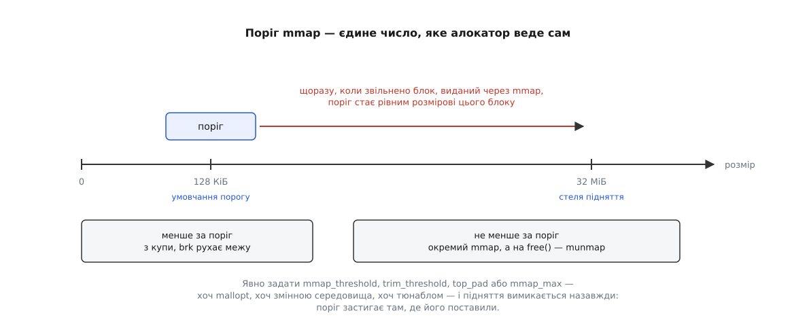

# 📋 Важелі glibc-алокатора: `mallopt`, `MALLOC_*`, `glibc.malloc.*`

Це повний перелік чисел, якими в glibc зміщують межу між купою й окремими відображеннями, разом із функціями, що показують стан алокатора зсередини самої програми. Морока тут не в складності, а в іменах: кожне число має до трьох різних імен — константу `mallopt`, змінну середовища й тюнабл, — а частина умовчань помінялася у свіжих версіях. Нижче все зведено з одиницями, умовчаннями й версіями, у яких воно з'явилося або змінилося.

## Три двері до тих самих змінних

Найпряміший шлях — виклик усередині програми:

```c
#include <malloc.h>

int mallopt(int param, int value);   /* 1 — успіх, 0 — помилка */
```

Тип `value` тут — `int`. На 64-бітовій системі це означає, що через `mallopt` не задати величини понад `INT_MAX` (≈ 2 ГіБ), тоді як той самий параметр у вигляді тюнабла має тип `size_t`. Для порогів це впирається рідко, але коли впирається — обхід лишається один: середовище або тюнабл.

Змінні середовища алокатор читає рівно раз — коли ініціалізується, тобто на першому виділенні в процесі. Тому виставляти їх самому собі через `setenv` у `main` марно: libc устигає щось виділити раніше за ваш перший рядок. Пастка в самих іменах: у частини змінних є хвостовий підкреслювач (`MALLOC_TOP_PAD_`), а в обох ареневих — немає (`MALLOC_ARENA_MAX`). Забутий підкреслювач не дає ні помилки, ні попередження — змінну просто ніхто не прочитає.

У програмах із бітами set-user-ID чи set-group-ID усі ці змінні ігноруються: [привілейований запуск](topic:unix-linux/setuid-and-privilege) відсікає вплив чужого середовища на процес, який виконується з правами не того, хто його запустив.

Третій шлях — тюнабли. Це рядок пар «ім'я=значення» через двокрапку, який розбирає [динамічний завантажувач](topic:unix-linux/dynamic-loader) ще до того, як програма почне виконуватися:

```
$ GLIBC_TUNABLES=glibc.malloc.arena_max=2:glibc.malloc.mmap_threshold=262144 ./app
```

Тюнабли з'явилися в glibc 2.25, і тоді ж старі `MALLOC_*` стали просто їхніми псевдонімами — обидва шляхи пишуть в ту саму внутрішню змінну. Тому задавати одне число двома способами не варто: котре з них виграє, вирішує порядок змінних в оточенні, а покладатися на цей порядок не можна.

Подивитися, що взагалі підтримує ваша libc і в яких межах:

```
$ /lib64/ld-linux-x86-64.so.2 --list-tunables | grep malloc
glibc.malloc.trim_threshold: 0x20000 (min: 0x0, max: 0xffffffffffffffff)
glibc.malloc.top_pad: 0x20000 (min: 0x0, max: 0xffffffffffffffff)
glibc.malloc.perturb: 0 (min: 0, max: 255)
glibc.malloc.arena_max: 0x0 (min: 0x1, max: 0xffffffffffffffff)
```

Ключ `--list-tunables` є з glibc 2.33. Величини типу `size_t` друкуються шістнадцятково: `0x20000` — це ті самі 131072 байти умовчання. Там, де в бібліотеці умовчання не записано числом (як в `arena_max`, у якого нижня межа взагалі `0x1`), друкується `0x0` — і це означає не «нуль», а «рахувати за вбудованим правилом». З glibc 2.44 ті самі тюнабли можна задати на всю систему файлом `/etc/tunables.conf` із наступним `ldconfig`.

Числа скрізь плоскі, у байтах або штуках: суфіксів на кшталт `256K` жоден із трьох інтерфейсів не розуміє.

## Важелі межі з ядром

| `mallopt` | Змінна середовища | Тюнабл | Одиниця | Умовчання | Що робить |
|---|---|---|---|---|---|
| `M_MMAP_THRESHOLD` | `MALLOC_MMAP_THRESHOLD_` | `glibc.malloc.mmap_threshold` | байти | 131072 (128 КіБ), далі рухається сам | запит, не задоволений зі списків вільних блоків і не менший за це число, іде окремим `mmap` |
| `M_TRIM_THRESHOLD` | `MALLOC_TRIM_THRESHOLD_` | `glibc.malloc.trim_threshold` | байти | 131072, далі рухається сам | скільки суцільного вільного має набратися зверху арени, щоб `free` покликав `brk` униз; `-1` вимикає обрізання зовсім |
| `M_TOP_PAD` | `MALLOC_TOP_PAD_` | `glibc.malloc.top_pad` | байти | 131072 | скільки просити в ядра понад потрібне, розширюючи арену, і скільки лишити, обрізаючи її |
| `M_MMAP_MAX` | `MALLOC_MMAP_MAX_` | `glibc.malloc.mmap_max` | штуки | 65536 | скільки блоків одночасно може жити окремими відображеннями; `0` забороняє `mmap` для великих блоків узагалі |
| `M_ARENA_TEST` | `MALLOC_ARENA_TEST` | `glibc.malloc.arena_test` | штуки | 8 (64 біти), 2 (32 біти) | скільки арен завести, не звіряючись зі стелею; ігнорується, якщо задано `arena_max` |
| `M_ARENA_MAX` | `MALLOC_ARENA_MAX` | `glibc.malloc.arena_max` | штуки | 0 — рахувати з кількості ядер | тверда стеля кількості арен |
| `M_PERTURB` | `MALLOC_PERTURB_` | `glibc.malloc.perturb` | байт 0–255 | 0 | видана пам'ять забивається доповненням цього байта, звільнена — самим байтом |
| `M_MXFAST` | — | `glibc.malloc.mxfast` | байти | 128 (64 біти) | стеля розміру для fastbin-ів; з glibc 2.43 не робить нічого |

Кілька уточнень, які з таблиці не видно.

**Стеля порогу `mmap`.** Поки поріг рухається сам, вище за `DEFAULT_MMAP_THRESHOLD_MAX` він не піднімається: це 512 КіБ на 32-бітових системах і `4·1024·1024·sizeof(long)`, себто 32 МіБ, на 64-бітових. Задати руками більше — можна, стеля стосується лише автоматики.

**`M_PERTURB` — інструмент відлагодження, а не безпеки.** Він робить видимими дві типові помилки: читання неініціалізованої пам'яті (у блоці не нулі, а сміття з певним візерунком) і використання блоку після `free` (там раптом однакові байти). Ціна — прохід по кожному блоку на кожній операції, тож у робочому запуску його не тримають. Пам'ять від `calloc` не чіпається, бо вона зобов'язана бути нульовою.

**`M_MMAP_MAX=0` — не оптимізація.** Він не лише забороняє окремі відображення для великих блоків, а й позбавляє процес єдиного способу віддати велику пам'ять назад точно й одразу. Усе піде через купу з її однією межею.

## Пастка: чотири параметри, які вимикають самонавчання порогу

Динамічне підняття порогу `mmap` вимикається, щойно задано **бодай один** із чотирьох параметрів: `M_MMAP_THRESHOLD`, `M_TRIM_THRESHOLD`, `M_TOP_PAD` або `M_MMAP_MAX`. Байдуже, яким із трьох інтерфейсів — усередині вони ведуть до тих самих чотирьох функцій, і кожна з них, крім свого числа, ставить прапорець «більше поріг не чіпати».



*Задати будь-який із чотирьох параметрів — означає замінити механізм, що підлаштовується під програму, сталим числом.*

Найпідступніша форма цієї пастки — задати параметрові його ж власне умовчання. Рядок `GLIBC_TUNABLES=glibc.malloc.trim_threshold=131072` не міняє жодного числа: 131072 там і було. Але прапорець він ставить, і поріг `mmap` після цього застигає на 128 КіБ назавжди. Те саме зробить `mallopt(M_TOP_PAD, 131072)`, який на око взагалі не про `mmap`.

Звідси практичне правило: якщо ви не готові тримати сталий поріг свідомо й міряти наслідки, до цих чотирьох параметрів краще не торкатися зовсім. Решта важелів — `arena_max`, `arena_test`, `perturb`, `tcache_*` — прапорця не ставлять і механізм не ламають.

## Арени: як із двох чисел виходить кількість

`arena_test` і `arena_max` працюють у парі, і плутають їх часто.

```
доки арен ≤ arena_test        → кожен новий потік дістає власну арену, стеля не рахується
щойно арен більше             → рахується стеля з кількості ядер:
                                8 × ядер на 64 бітах, 2 × ядер на 32   (по glibc 2.43)
                                рівно стільки, скільки ядер            (з glibc 2.44)
коли стелю досягнуто          → нові потоки починають ділити наявні арени
якщо arena_max задано (≠ 0)   → це і є стеля, arena_test не дивляться взагалі
```

Восьмикратний множник тримався від появи арен і зник у glibc 2.44: тепер стеля дорівнює просто кількості ядер, але ніколи не опускається нижче за `arena_test`. На старших бібліотеках очікуйте саме восьмикратну.

Кількість ядер алокатор бере з `__get_nprocs_sched()` — це те, що бачить процес у планувальнику. **Квота cgroup на процесорний час у цьому розрахунку не бере участі жодним боком.** Тому контейнер, якому [cgroup](topic:unix-linux/cgroups) виділила пів'ядра на 64-ядерній машині, усе одно отримає стелю в сотні арен — і кожна з них здатна тримати свій запас вільних блоків. Саме тому `MALLOC_ARENA_MAX=2` так часто рятує пам'ять контейнеризованих сервісів. Число ядер обмежує ще й [маска спорідненості процесора](topic:unix-linux/cpu-affinity), якщо процес прив'язаний до підмножини ядер — але це вже інша величина, ніж квота.

Через тюнабл `arena_max` менше за 1 не задати; нуль як «рахувати автоматично» лишається доступним тільки через `mallopt`.

## Тюнабли поза межею з ядром

Ці важелі впливають на те, як алокатор роздає вже свою пам'ять, а не на розмову з ядром. Змінних середовища для них немає (єдиний виняток — `check`).

| Тюнабл | Умовчання | Що робить |
|---|---|---|
| `glibc.malloc.tcache_max` | 1032 байти (64 біти), 516 (32 біти) | найбільший запит, який ще можна віддати з [кешу потоку](topic:programming/memory-allocator-internals) без замка |
| `glibc.malloc.tcache_count` | 7 до glibc 2.42, 16 з 2.43; стеля 65535 | скільки блоків кожного розміру тримати в кеші потоку; `0` вимикає кеш |
| `glibc.malloc.tcache_unsorted_limit` | 0 — без обмеження; тюнабл прибрано в glibc 2.44 | скільки блоків переглядати в невідсортованому списку, наповнюючи кеш |
| `glibc.malloc.mxfast` | — | з glibc 2.43 не робить нічого: шар fastbin прибрано, бо тим самим займається кеш потоку, тільки без замків |
| `glibc.malloc.hugetlb` | 0 | `1` — після `mmap` і `sbrk` кликати `madvise(MADV_HUGEPAGE)`; `2` — брати сторінки одразу з `MAP_HUGETLB`; більші значення задають конкретний розмір [великої сторінки](topic:unix-linux/huge-pages) |
| `glibc.malloc.check` | 0 | перевірки цілісності купи; з glibc 2.34 працює лише з `LD_PRELOAD=libc_malloc_debug.so.0` |

Дві версійні дрібниці, що впливають на очікування. З glibc 2.43 на AArch64 двомегабайтні прозорі великі сторінки в `malloc` увімкнено за умовчанням — тобто так, ніби виставлено `hugetlb=1`. Тією ж версією `tcache_count` за умовчанням піднявся з 7 до 16 — як компенсація за прибраний fastbin: без неї заміна одного шару іншим давала близько піввідсотка втрати швидкості.

## Функції огляду й керування

```c
#include <malloc.h>
#include <stdio.h>

int              malloc_trim(size_t pad);
void             malloc_stats(void);
struct mallinfo2 mallinfo2(void);                        /* glibc 2.33+ */
int              malloc_info(int options, FILE *stream); /* options мусить бути 0 */
size_t           malloc_usable_size(void *ptr);
```

**`malloc_trim(pad)`** — єдина з них, що щось міняє. Аргумент `pad` каже, скільки вільного лишити зверху арени; `0` означає «лишити щонайменше». Повертає `1`, якщо пам'ять справді віддано ядру, і `0`, якщо віддавати не було чого. З glibc 2.8 він проходить **усі** арени й віддає всі цілі вільні сторінки, а не тільки хвіст головної купи. Коштує це обходу структур алокатора під замками, тож місце йому — після великої разової роботи, а не в гарячому циклі. У glibc 2.44 полагодили давню ваду, через яку на аренах, крім головної, він працював неправильно, — на старих бібліотеках результат для багатопотокової програми може бути гіршим за очікуваний.

**`malloc_stats()`** друкує в стандартний потік помилок коротке зведення по кожній арені й підсумок:

```
Arena 0:
system bytes     =     135168
in use bytes     =       1616
Total (incl. mmap):
system bytes     =     135168
in use bytes     =       1616
max mmap regions =          0
max mmap bytes   =          0
```

`system bytes` — скільки взято в системи, `in use bytes` — скільки з цього зайнято блоками програми; різниця між ними і є той запас, який алокатор тримає в себе. Два останні рядки — рекорди за весь час життя процесу: скільки окремих відображень і скільки байтів у них існувало одночасно найбільше. Формат розрахований на очі, не на розбір програмою.

**`mallinfo2()`** повертає структуру з тими самими числами, але придатну для коду:

```c
struct mallinfo2 {
    size_t arena;     /* узято в системи не через mmap, байтів */
    size_t ordblks;   /* вільних блоків, штук                  */
    size_t smblks;    /* вільних fastbin-блоків                */
    size_t hblks;     /* окремих mmap-ділянок, штук            */
    size_t hblkhd;    /* байтів у окремих mmap-ділянках        */
    size_t usmblks;   /* не використовується, завжди 0         */
    size_t fsmblks;   /* байтів у вільних fastbin-блоках       */
    size_t uordblks;  /* зайнято блоками програми, байтів      */
    size_t fordblks;  /* вільно всередині алокатора, байтів    */
    size_t keepcost;  /* скільки можна віддати зверху, байтів  */
};
```

Два поля тут найкорисніші. `fordblks` — це і є та сама «незвільнена» пам'ять, через яку виникають хибні діагнози витоку: вона вільна для алокатора, але записана за процесом. `keepcost` показує, скільки з неї зріже `malloc_trim(0)` у головній арені.

І два застереження. Перше й головне: **`mallinfo2` бачить лише головну арену** — виділене в аренах потоків у ці числа не входить узагалі, що для багатопотокової програми робить картину не просто неповною, а оманливою. Друге: попередниця `mallinfo` тримала ті самі поля в `int`, тож на купі понад 2 ГіБ числа в ній перекручувалися через переповнення; на glibc 2.33 і новіших користуватися нею немає причин. Поля `smblks` і `fsmblks` з glibc 2.43 нецікаві — fastbin-ів більше немає.

**`malloc_info(0, stream)`** — єдиний спосіб дістати числа по **всіх** аренах машинно. Він друкує XML; `options` мусить бути нулем, інакше повернеться `-1` і `errno = EINVAL`.

```xml
<malloc version="1">
<heap nr="0">
<sizes>
</sizes>
<total type="fast" count="0" size="0"/>
<total type="rest" count="12" size="132096"/>
<system type="current" size="135168"/>
<system type="max" size="135168"/>
<aspace type="total" size="135168"/>
<aspace type="mprotect" size="135168"/>
</heap>
<total type="fast" count="0" size="0"/>
<total type="rest" count="12" size="132096"/>
<total type="mmap" count="0" size="0"/>
<system type="current" size="135168"/>
<system type="max" size="135168"/>
</malloc>
```

По елементу `<heap nr="…">` на арену, потім підсумок по процесу. `system current` — узяте в системи зараз, `system max` — рекорд, `aspace mprotect` — скільки адрес арені відкрито насправді (для арен потоків, що резервують простір наперед, це число менше за `aspace total`). Формат навмисно версійований і нестабільний: він для знімків стану в часі, а не для парсера, написаного раз назавжди.

**`malloc_usable_size(p)`** повертає, скільки байтів у блоці придатні насправді; це число не менше за замовлене, бо алокатор округлює розміри вгору. Писати в цей надлишок не можна — попри те, що він фізично є, це невизначена поведінка, і `realloc` його не збереже. Функція існує для діагностики й обліку, а не для «безкоштовного» розширення блоку.

| Питання | Чим дивитися |
|---|---|
| скільки пам'яті алокатор тримає в собі, а не віддав ядру | `mallinfo2().fordblks` (лише головна арена) або `malloc_info` |
| яка з арен розжиріла | `malloc_info`, елементи `<heap nr>` |
| чи є сенс кликати обрізання зараз | `mallinfo2().keepcost` |
| скільки насправді коштує блок | `malloc_usable_size` |
| швидко глянути очима, без коду | `malloc_stats()` |
| віддати вільне ядру просто зараз | `malloc_trim(0)` |

## Мінімальний робочий виклик

```c
#define _GNU_SOURCE
#include <malloc.h>
#include <stdio.h>

int main(void) {
    /* Має сенс до того, як програма розгалузиться на потоки:
       вже створені арени це не прибирає.                     */
    if (!mallopt(M_ARENA_MAX, 2))
        fprintf(stderr, "mallopt(M_ARENA_MAX) не вдався\n");

    void *p = malloc(100);
    printf("просив 100, придатних %zu\n", malloc_usable_size(p));

    void **v = malloc(200000 * sizeof *v);
    for (int i = 0; i < 200000; i++) v[i] = malloc(512);
    for (int i = 0; i < 200000; i++) free(v[i]);
    free(v);

    struct mallinfo2 m = mallinfo2();
    printf("узято %zu, зайнято %zu, вільно всередині %zu, можна віддати %zu\n",
           m.arena, m.uordblks, m.fordblks, m.keepcost);

    printf("malloc_trim → %d\n", malloc_trim(0));
    malloc_stats();            /* у stderr */
    malloc_info(0, stdout);    /* XML у stdout */
    free(p);
    return 0;
}
```

```
$ gcc -O2 -o probe probe.c
$ ./probe
$ MALLOC_ARENA_MAX=1 ./probe
$ GLIBC_TUNABLES=glibc.malloc.tcache_count=0 ./probe
```

`mallinfo2` потребує glibc 2.33 або новішої; на старших бібліотеках є `mallinfo` з тими самими полями типу `int`.

## Що коли з'явилося

| Версія glibc | Зміна |
|---|---|
| 2.10 | `malloc_info`; арени й `M_ARENA_MAX`/`M_ARENA_TEST` — за окремим ключем збирання |
| 2.15 | арени та обидва ареневі параметри доступні за умовчанням |
| 2.25 | тюнабли й `GLIBC_TUNABLES`; змінні `MALLOC_*` стають їхніми псевдонімами |
| 2.33 | `mallinfo2`; ключ `ld.so --list-tunables` |
| 2.34 | `MALLOC_CHECK_`, `mcheck`, `mtrace` працюють лише з `LD_PRELOAD=libc_malloc_debug.so.0` |
| 2.35 | тюнабл `glibc.malloc.hugetlb` |
| 2.43 | шар fastbin прибрано, `mxfast` — заглушка; `tcache_count` за умовчанням 16; на AArch64 двомегабайтні прозорі великі сторінки в `malloc` увімкнено за умовчанням |
| 2.44 | полагоджено `malloc_trim` для арен, крім головної; тюнабли на всю систему через `/etc/tunables.conf`; тюнабл `tcache_unsorted_limit` прибрано; стеля арен опущена до одної на ядро |
