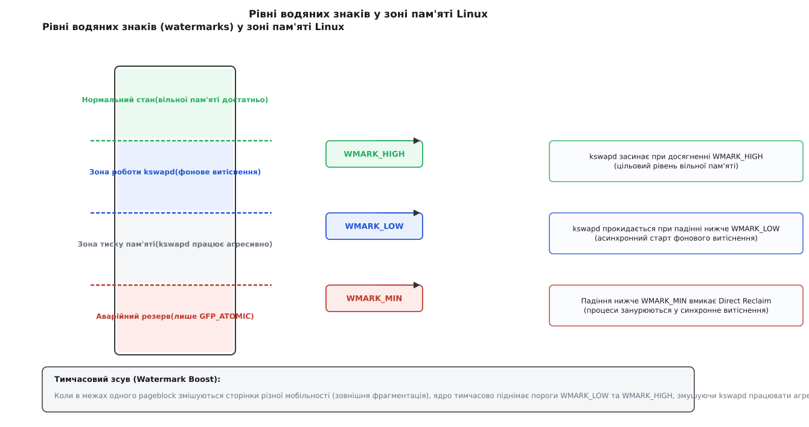
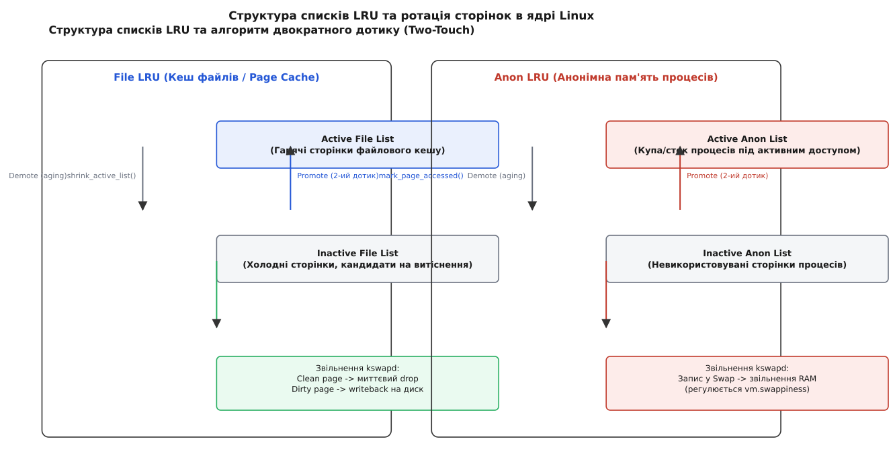
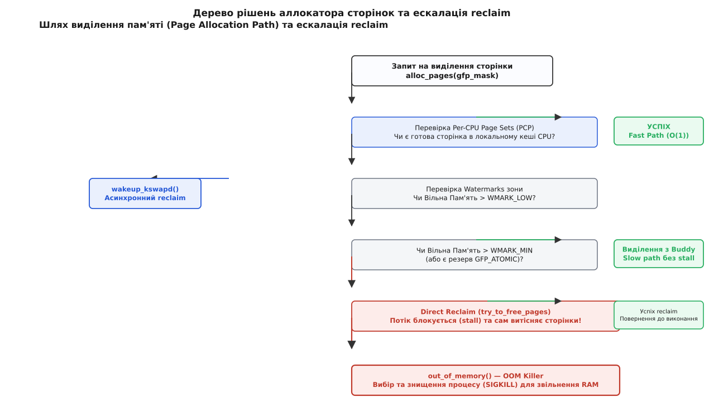

# Асинхронне витіснення сторінок: kswapd та watermarks

<preknowlist>
- [Віртуальний адресний простір](topic:unix-linux/virtual-address-space) — відображення віртуальних адрес на фізичні сторінки DRAM через таблиці сторінок.
- [Фізичний аллокатор сторінок](topic:unix-linux/physical-page-allocator) — механізм виділення неперервних блоків фізичних сторінок порядків 2^n через Buddy Allocator.
- [Свопінг і витіснення сторінок](topic:unix-linux/swap-and-reclaim) — загальні поняття вивантаження анонімної пам'яті та кешу на диск.
- [cgroups: облік і обмеження ресурсів](topic:unix-linux/cgroups) — контролер `memory` та підсистема лімітів споживання RAM.
</preknowlist>

## Лавина затримок, коли витіснення починається запізно

Високонавантажена база даних розширює свій кеш запитів, просячи в операційної системи нову ділянку адресного простору через `mmap()` або `brk()`. Самі ці виклики фізичної пам'яті ще не видають: сторінка приходить пізніше, при першому дотику до нової адреси, в обробнику page fault. У нормальному стані ядро дістає її з локального per-CPU кешу сторінок за сотні наносекунд: таблиця сторінок оновлюється, і потік продовжує виконання без помітної затримки.

Але якщо вільна фізична пам'ять у системі вичерпана, виклики виділення сторінок перестають бути безкоштовними. Замість швидкої видачі з готового пулу аллокатор змушений зупинити потік користувача й відправити його шукати пам'яті самостійно. У коді ядра відбувається перехід із швидкого шляху (`get_page_from_freelist()`) у повільний шлях (`__alloc_pages_slowpath()`), де потік входить у синхронне витіснення (Direct Reclaim). Він сканує списки пам'яті, чекає запису брудних сторінок на диск і намагається вивантажити вміст анонімної пам'яті у swap. Затримка окремої аллокації миттєво зростає з часток мікросекунди до десятків або сотень мілісекунд. Для бази даних це означає раптовий сплеск затримок (latency spike), пропущені таймаути та падіння продуктивності всієї системи.

Причина цього падіння полягає у тому, що синхронний reclaim перекладає важку дискову роботу зі звільнення пам'яті на той самий потік додатку, який зробив звичайний запит на аллокацію. Процес користувача блокується на вводі-виводі в той момент, коли від нього очікують миттєвої відповіді.

Щоб запобігти таким катастрофічним падінням продуктивності, ядро Linux розмежовує процес виділення та процес звільнення пам'яті за часом. Воно намагається **ніколи не доводити рівень вільної пам'яті до нуля**. Для цього в ядрі працює асинхронний механізм витіснення сторінок (asynchronous page reclaim), головою якого є фоновий потік `kswapd`. Мета `kswapd` — діяти на випередження: завчасно вивільняти холодні сторінки й підтримувати постійний подушковий резерв вільної пам'яті до того, як процеси користувача зіткнуться із жорстким дефіцитом.

## Три пороги вільної пам'яті: Анатомія watermarks

Для того щоб асинхронний демон знав, коли саме йому потрібно починати роботу, а коли спинятися, ядро Linux підтримує систему **водяних знаків (watermarks)**. Водяні знаки розраховуються окремо для кожної зони пам'яті (`ZONE_DMA`, `ZONE_DMA32`, `ZONE_NORMAL`, `ZONE_MOVABLE`) на кожному вузлі NUMA.

У кожній зоні визначено три фундаментальні пороги вільної пам'яті:

1. **`WMARK_MIN` (Мінімальний рівень):** Жорстка підлога вільної пам'яті зони. Якщо кількість вільних сторінок падає нижче `WMARK_MIN`, звичайні процеси більше не мають права отримувати пам'ять. Будь-яка спроба аллокації з прапорцями `GFP_KERNEL` або `GFP_USER` блокується і відправляється в синхронний Direct Reclaim. Резерв пам'яті нижче `WMARK_MIN` залишається виключно для критичних ядерних запитів `GFP_ATOMIC` (наприклад, обробників мережевих переривань або контексту переривань), які не можуть заснути.
2. **`WMARK_LOW` (Низький рівень):** Поріг пробудження демона `kswapd`. Коли рівень вільної пам'яті падає нижче `WMARK_LOW`, підсистема аллокації викликає функцію `wakeup_kswapd()`. Фоновий демон прокидається й починає асинхронно вивільняти сторінки у фоновому режимі, поки процеси користувача продовжують безперешкодно отримувати пам'ять з наявного запасу.
3. **`WMARK_HIGH` (Високий рівень):** Поріг спокою. Це цільовий рівень вільної пам'яті, до якого `kswapd` прагне відновити зону. Досягнувши `WMARK_HIGH`, демон перериває свій цикл сканування й знову засинає.



*Три водяні знаки зони пам'яті: kswapd стартує при падінні вільної пам'яті нижче LOW, працює до HIGH і запобігає падінню нижче MIN.*

### Математика та розрахунок watermarks

Базовою величиною для обчислення всіх водяних знаків у системі є глобальний параметр `vm.min_free_kbytes`. За замовчуванням ядро обчислює його під час завантаження на основі обсягу придатної пам'яті (managed pages):

```
min_free_kbytes = 4 · √managed_pages_kB
```

Отриманий обсяг `min_free_kbytes` розподіляється між усіма зонами пропорційно їхньому розміру. Для кожної конкретної зони значення `WMARK_MIN` (у сторінках) дорівнює її частці від `min_free_kbytes`.

Крім того, для запобігання ситуації, коли виділення пам'яті в нижчих зонах (наприклад, `ZONE_DMA32`) виснажують резерви вищих зон (`ZONE_NORMAL`), ядро обраховує масив `lowmem_reserve`. Цей захисний зазор гарантує, що запити, які можуть працювати з будь-якою пам'яттю, не забиратимуть обмежені сторінки нижніх 4 ГБ RAM.

Інші два водяні знаки обчислюються як додатки до `WMARK_MIN`:

```
WMARK_LOW  = WMARK_MIN + (zone_managed_pages · watermark_scale_factor / 10000)
WMARK_HIGH = WMARK_MIN + 2 · (zone_managed_pages · watermark_scale_factor / 10000)
```

За замовчуванням значення `vm.watermark_scale_factor` дорівнює 10 (що відповідає 0.1% від обсягу зони). Тобто за замовчуванням відстань між `WMARK_MIN` та `WMARK_LOW` становить мінімум 0.1% від пам'яті зони (або чверть від `WMARK_MIN`, залежно від того, яке значення більше).

Якщо `watermark_scale_factor` занадто малий, буферна зона між `WMARK_LOW` та `WMARK_MIN` стає вузькою. Під час раптового сплеску навантаження процеси користувача з'їдають цей проміжок швидше, ніж демон `kswapd` встигає прокинутися й розігнати дисковий ввід-вивід. У результаті система провалюється у Direct Reclaim.

### Механізм Watermark Boosting

У ядрі Linux 5.0 з'явилося розширення цього механізму — **Watermark Boosting**. Його було розроблено для вирішення проблеми фрагментації при запитах на виділення високих порядків (high-order allocations, наприклад, 2 МБ сторінок для THP або великих мережевих буферів).

Коли аллокатор, не знайшовши вільного блоку потрібного типу міграції, змушений забрати pageblock іншого типу — тобто змішати в межах одного блоку сторінки різної мобільності, — він викликає функцію `boost_watermark()`. Вона тимчасово додає до значень `WMARK_LOW` та `WMARK_HIGH` додаткове зміщення `watermark_boost`:

```
WMARK_LOW_effective  = WMARK_LOW  + watermark_boost
WMARK_HIGH_effective = WMARK_HIGH + watermark_boost
```

Це змушує `kswapd` прокинутися раніше й розчистити значно більший обсяг пам'яті, розвантажуючи зону для подальшої роботи алгоритму ущільнення. Як тільки `kswapd` досягає підвищеного рівня `WMARK_HIGH`, значення `watermark_boost` поступово обнуляється.

## Життєвий цикл фонового потоку kswapd

На кожному вузлі NUMA ядро створює свій власний екземпляр фонового потоку — `kswapd0`, `kswapd1` тощо. Локалізація витіснення по вузлах є критичною: якщо дефіцит пам'яті виник на першому NUMA-вузлі, `kswapd0` має вивільняти пам'ять саме з локальних модулів DRAM цього вузла, не чіпаючи віддалену пам'ять інших сокетів, доступ до якої по міжпроцесорній шині є повільнішим.

Детальний аналіз історичної еволюції цього механізму — від 1-секундних опитувань у Linux 2.0 до сучасного MGLRU — розібрано у [історичній вставці про kswapd](topic:unix-linux/asynchronous-page-reclaim/hist-kswapd-evolution.md).

### Алгоритм роботи kswapd

Життєвий цикл потоку `kswapd` описується нескінченним циклом у функції ядра `kswapd()`:

1. **Сон у черзі очікування:** Коли вільна пам'ять усіх зон вузла перебуває вище `WMARK_HIGH`, `kswapd` переходить у глибокий сон у черзі очікування `pgdat->kswapd_wait`, не споживаючи ресурсів процесора.
2. **Сигнал пробудження:** Під час спроби виділення сторінки у системному виклику аллокатор викликає `zone_watermark_ok()`. Якщо перевірка не проходить (вільна пам'ять < `WMARK_LOW`), викликається `wakeup_kswapd()`, який переводить потік `kswapd` у стан `TASK_RUNNING`.
3. **Балансування вузла (`balance_pgdat()`):** `kswapd` починає обходити зони даного NUMA-вузла, починаючи від найвищої зони (`ZONE_NORMAL` або `ZONE_MOVABLE`) до найнижчої (`ZONE_DMA`). Для кожної зони, де вільна пам'ять не досягла `WMARK_HIGH`, викликається функція `shrink_node()`.
4. **Витіснення та ущільнення:** `kswapd` сканує списки LRU, звільняючи чисті сторінки файлового кешу та скидаючи анонімні сторінки у swap. Якщо запит мав високий порядок (order > 0), `kswapd` також будить потік `kcompactd` для паралельного ущільнення пам'яті.
5. **Завершення циклу:** Коли рівень вільної пам'яті в усіх зонах вузла досягає цільового `WMARK_HIGH`, `kswapd` перевіряє, чи не з'явилися нові запити, і знову засинає на `kswapd_wait`.

```
[ Сон у kswapd_wait ] ──(вільна RAM < WMARK_LOW)──► [ Пробудження wakeup_kswapd() ]
        ▲                                                      │
        │                                                      ▼
[ Засинання ] ◄──(вільна RAM >= WMARK_HIGH)─── [ Обхід зон balance_pgdat() ]
                                                               │
                                                               ▼
                                                  [ Сканування списків LRU ]
```

## Двоярусні списки LRU: Активні, неактивні та старіння сторінок

Для того щоб витіснення сторінок не перетворювалося на випадкове вимивання корисних даних, ядро повинно точно відрізняти «гарячі» сторінки (до яких процеси звертаються постійно) від «холодних» (які були зчитані один раз і більше не потрібні).

Для цього ядро Linux організовує всі придатні до витіснення сторінки у двоярусні списки **LRU (Least Recently Used)**.

### П'ять списків LRU

Кожен NUMA-вузол (або зона в старих ядрах) утримує п'ять окремих списків сторінок (`struct lruvec`):
1. **`Active File`**: сторінки файлового кешу, до яких активно звертаються процеси.
2. **`Inactive File`**: сторінки файлового кешу, до яких давно не було звернень.
3. **`Active Anon`**: анонімна пам'ять процесів (купа, стек, `mmap`), до якої йде активний доступ.
4. **`Inactive Anon`**: анонімна пам'ять, яка давно не використовувалася.
5. **`Unevictable`**: заблоковані сторінки (наприклад, через виклики `mlock()`), які ядро не має права витісняти ні за яких умов.



*Ротація сторінок між Active та Inactive списками: другий дотик просуває сторінку в Active, старіння повертає її в Inactive, а kswapd витісняє лише з хвоста Inactive.*

### Алгоритм Two-Touch та прапорці PG_referenced / PG_active

Перехід сторінки між активним та неактивним списками регулюється алгоритмом **Two-Touch (двократного дотику)** та двома прапорцями у структурі `struct page`: `PG_referenced` та `PG_active`.

Коли сторінка вперше виділяється або зчитується з диска, вона потрапляє в хвіст **`Inactive List`**.
- **Перший дотик:** Якщо процес здійснює доступ до сторінки в неактивному списку, ядро (через обробник page fault або при виклику `read()`) виставляє прапорець `PG_referenced = 1`.
- **Другий дотик:** Якщо до сторінки відбувається повторне звернення, поки прапорець `PG_referenced` ще встановлений, викликається функція `mark_page_accessed()`. Вона знімає `PG_referenced`, виставляє `PG_active = 1` і переміщує сторінку з неактивного списку в **`Active List`** (Promotion).

### Старіння (Aging) та витіснення

`kswapd` **ніколи не витісняє сторінки безпосередньо з активного списку**. Замість цього виконується двоетапна процедура:

1. **Деградація активних сторінок (`shrink_active_list()`):** Якщо неактивний список виснажується, `kswapd` сканує хвости `Active List`. Для кожної сторінки ядро перевіряє біт доступу в таблицях сторінок процесів (PTE Young bit). Якщо біт доступу скинуто (до сторінки не зверталися протягом останнього інтервалу старіння), прапорець `PG_active` знімається, і сторінка переводиться в `Inactive List` (Demotion).
2. **Звільнення неактивних сторінок (`shrink_inactive_list()`):** `kswapd` бере сторінки з хвоста `Inactive List`:
   - Якщо це **чиста сторінка файлового кешу** (`clean file page`), її табличний запис анулюється, а фізична сторінка миттєво повертається в Buddy Allocator (найдешевший reclaim).
   - Якщо це **брудна сторінка файлового кешу** (`dirty file page`), її позначають прапорцем `PG_reclaim` і передають підсистемі writeback для скидання на диск.
   - Якщо це **анонімна сторінка** (`anon page`), ядро виділяє для неї блок у swap-просторі, ініціює асинхронний запис у swap, після чого відв'язує її від таблиць сторінок процесу.

### Сучасна альтернатива: Multi-Generational LRU (MGLRU)

У ядрі Linux 6.1 з'явився новий механізм витіснення — **MGLRU**. Замість двох двоярусних списків MGLRU організовує сторінки у вектор поколінь. Нові сторінки потрапляють у найновіше покоління, а `kswapd` витісняє лише сторінки з найстарішого покоління. MGLRU суттєво знижує навантаження на CPU при скануванні таблиць сторінок і підтримує точний облік гарячих даних на масштабах серверів із терабайтами RAM.

## Баланс між файлами та swap: Swappiness і вимірювання refaults

Коли `kswapd` починає процес витіснення у `shrink_node()`, перед ним постає фундаментальне питання: **з якого саме списку вивільняти сторінки — з файлового кешу чи з анонімної пам'яті процесів?**

Цей баланс обчислюється у функції `get_scan_count()`, яка визначає кількість сторінок для сканування у File LRU (`scan_file`) та Anon LRU (`scan_anon`).

### Роль параметра vm.swappiness

Параметр `vm.swappiness` (значення від 0 до 200, за замовчуванням 60) задає відносну вагу витіснення анонімної пам'яті порівняно з файловою.

Математично в класичному алгоритмі ядра вага сканування обчислюється наступним чином:

```
anon_prio = swappiness
file_prio = 200 - swappiness
```

- Якщо `swappiness = 60`, пріоритет файлового кешу становить `140`, а пріоритет swap — `60`. Це означає, що ядро віддаватиме перевагу вивільненню чистих файлових сторінок, уникаючи дискового вводу-виводу для swap.
- Якщо `swappiness = 100`, пріоритети вирівнюються (`100` і `100`), і ядро сканує обидва списки рівномірно.
- Якщо `swappiness = 0`, ядро уникатиме вивантаження анонімних сторінок у swap доти, доки кількість вільної пам'яті й чистих файлових сторінок не впаде нижче критичного порогу `WMARK_MIN`.

### Зворотний зв'язок через Refault Distance (workingset.c)

Починаючи з Linux 3.14, ядро більше не спирається виключно на статичне значення `swappiness`. Доданий Йоханнесом Вайнером (Johannes Weiner) механізм `workingset.c` реалізує зворотний зв'язок за вимушеними повторними зчитуваннями (**refaults**).

Коли сторінка файлового кешу витісняється, ядро лишає на її місці в дереві сторінкового кешу (XArray) компактну тіньову мітку (shadow entry). Вона фіксує номер покоління витіснення. Якщо процес знову звертається до цього файлу і виникає page fault, ядро зчитує тіньову мітку й обчислює **Refault Distance** — скільки сторінок було витіснено з моменту видалення цієї сторінки.

Якщо Refault Distance менше за загальний розмір активного робочого набору (workingset), це означає, що ядро помилилося: воно витіснило **гарячу файлову сторінку**, спричинивши трешинг (thrashing). У відповідь ядро автоматично підвищує тиск на анонімну пам'ять (ігноруючи низький `swappiness`), щоб захистити активний файловий кеш від вимивання.

## Коли асинхронність не справляється: Direct Reclaim, Watermark Boost та OOM Killer

Асинхронне витіснення працює ідеально доти, доки швидкість виділення пам'яті процесами нижча за швидкість, з якою `kswapd` сканує та вивільняє сторінки.

Якщо ж додаток здійснює масове виділення пам'яті (наприклад, виконання агресивного `SELECT` у СУБД або масове створення потоків), вільна пам'ять зони пробиває поріг `WMARK_LOW` і падає нижче `WMARK_MIN`.



*Повний шлях аллокатора сторінок: успішний fast-path з PCP, асинхронний kswapd, зупинка у Direct Reclaim та крайня ескалація до OOM Killer.*

### Перехід у Direct Reclaim

Коли вільна пам'ять нижча за `WMARK_MIN`, аллокатор сторінок відмовляє у видачі пам'яті з fast-path і переводить процес у **Direct Reclaim** (функція `try_to_free_pages()`):

1. **Блокування процесу (Allocation Stall):** Потік користувача занурюється у стан очікування. У системних моніторах (`top`, `htop`) це відображається зростанням показників `%sys` та `%wa` (iowait).
2. **Синхронне сканування:** Процес сам стає "виконавцем витіснення". Він бере на себе роботу `kswapd`: проходить по LRU-списках своєї cgroup та зони, самостійно вивільняючи сторінки.
3. **Синхронний writeback:** Якщо в неактивному списку залишилися лише брудні сторінки, процес користувача змушений чекати на завершення їх фізичного запису на диск.

Повний перелік параметрів sysctl, формат полів `/proc/zoneinfo` та метрик `/proc/vmstat` наведено у [довідникові з інтерфейсів витіснення](topic:unix-linux/asynchronous-page-reclaim/api-watermark-tunables.md).

Практичний інструмент моніторингу затримок та зчитування лічильників `allocstall` наведено у [проєктній вставці з моніторингу reclaim](topic:unix-linux/asynchronous-page-reclaim/proj-reclaim-monitor.md).

### Крайня межа: OOM Killer

Якщо Direct Reclaim та алгоритм ущільнення пам'яті (`compaction`) просканували всі списки LRU, але не змогли вивільнити жодної сторінки (наприклад, вся пам'ять зайнята анонімними сторінками, а swap відсутній або заповнений на 100%), ядро опиняється на межі краху.

У цій точці викликається остання лінія захисту — **OOM Killer** (Out-Of-Memory Killer, функція `out_of_memory()`). Механізм розраховує бали `badness` для всіх процесів у системі й надсилає сигнал `SIGKILL` процесові з найвищим балом, примусово звільняючи його адресний простір для порятунку операційної системи від kernel panic.

> 🔧 **Навіщо це.** Головне правило налаштування пам'яті для серверів із низькими вимогами до затримок (low-latency) — **не допускати виходу системи у Direct Reclaim**. Падіння у Direct Reclaim означає затримку виділення пам'яті на десятки мілісекунд.
> 
> За замовчуванням `vm.min_free_kbytes` лишається відносно малим: формула квадратного кореня дає на системі з 16 ГБ RAM лише десятки мегабайтів резерву на всю машину. На високонавантажених серверах СУБД або веб-вузлах це призводить до того, що проміжок між `WMARK_LOW` та `WMARK_MIN` становить лише кілька мегабайтів. Спалах трафіку з'їдає цей резерв за частки мілісекунди, і процеси миттєво потрапляють у `allocstall`.
> 
> Для усунення затримок рекомендується:
> 1. Збільшувати `vm.min_free_kbytes` до 1–4 ГБ на серверах із великим обсягом RAM (наприклад, `sysctl -w vm.min_free_kbytes=2097152`).
> 2. Збільшувати `vm.watermark_scale_factor` з 10 до 50 або 100. Це розширює зазор між `WMARK_MIN` та `WMARK_LOW`, надаючи `kswapd` значний часовий запас для асинхронного розгону витіснення до того, як додаткові аллокації вдаряться об `WMARK_MIN`.
