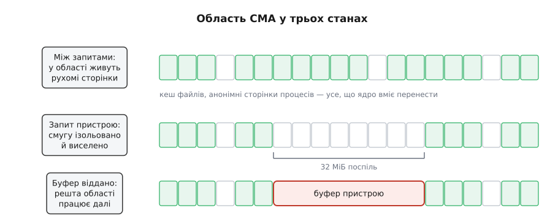
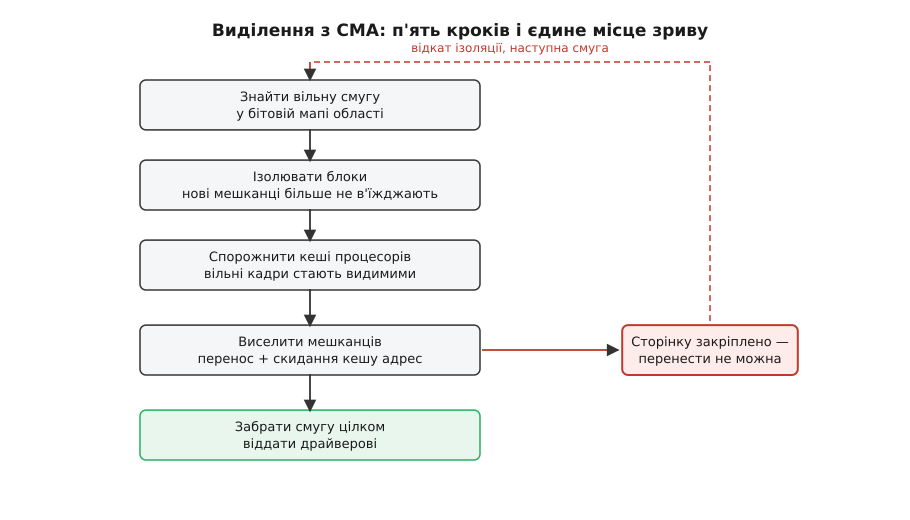
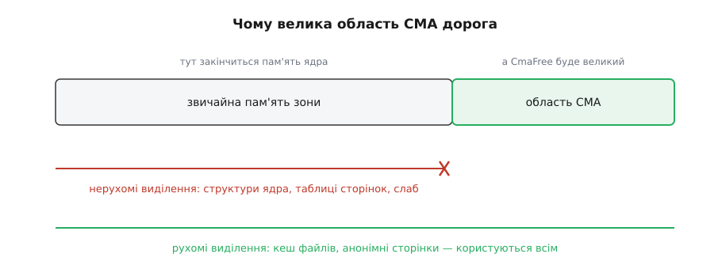

# CMA: резерв суцільної фізичної пам'яті для пристроїв

<preknowlist>
- [Фізичні сторінки в ядрі](book:unix-linux/physical-page-allocator) — у вільної пам'яті є форма; блоки сторінок носять позначку рухомості, а ущільнення переносить рухомі сторінки, щоб зібрати суцільне.
- [Сторінки, таблиці сторінок і MMU](book:unix-linux/paging-and-mmu) — пам'ять нарізана на сторінки, їхні фізичні двійники звуть кадрами, а зв'язок між ними тримає таблиця.
- [DMA і відображення буферів у ядрі](book:unix-linux/dma-and-buffers) — пристрій кладе байти в пам'ять сам і мусить дістати адресу, зрозумілу шині.
- [IOMMU](book:programming/iommu) — таблиця сторінок для пристроїв: там, де вона є, розкидані кадри виглядають для пристрою суцільним діапазоном.
- [Scatter-gather DMA](book:algorithms/scatter-gather) — пристрій, який уміє йти списком розрізнених шматків замість одного суцільного.
- [Закріплення сторінок для пристрою](book:unix-linux/page-pinning-gup) — сторінка, взята через `get_user_pages`, тимчасово стає непереносною.
</preknowlist>

Телефон із двома гігабайтами пам'яті відтворює відео. Апаратний декодер, який цим займається, ходить по кадру сам і бачить пам'ять як рівну смугу адрес — йому потрібні тридцять два мегабайти фізично суцільної пам'яті. Відео на такому телефоні дивляться хвилин двадцять на день.

З цих двох чисел випливає незручна арифметика. Тридцять два мегабайти — це півтора відсотка пам'яті машини, і потрібні вони приблизно півтора відсотка часу. Способів їх дістати рівно два, і обидва погані.

**Відрізати наперед.** Область відкроюють при завантаженні, і вона належить декодерові назавжди. Драйвер ніколи не почує «немає». Але ці тридцять два мегабайти лежать мертвими решту доби: система їх не бачить, у неї їх просто немає. На настільній машині це дрібниця, на телефоні — десяток застосунків, які інакше жили б у тлі й не перезапускалися б щоразу.

**Просити тоді, коли треба.** Нічого не відрізаємо, драйвер звертається до загального розподільника кадрів. На щойно завантаженій машині це спрацює. Через дві години роботи — ні: вільної пам'яті буде вдосталь, а суцільної смуги на тридцять два мегабайти в ній не знайдеться, бо вільні кадри до того часу розсипані між зайнятими. Кількість є, форми немає.

Отже, потрібна третя відповідь: пам'ять, яка водночас зарезервована й у вжитку. Звучить як суперечність, але суперечності немає — якщо «зарезервована» означає не «нікому», а «нікому такому, кого не можна виселити».

## Мешканець, якого можна виселити

Виселити сторінку процесу — річ цілком буденна. Ядро копіює її вміст в інший кадр, переписує всі записи таблиць сторінок, які на неї вказували, і процес нічого не помічає: він знає лише віртуальну адресу, а вона не змінилася. Так само переносяться сторінки кешу файлів. Такі сторінки звуть **рухомими** (англ. *movable*).

Є й протилежний рід сторінок. Структура ядра, на яку хтось тримає звичайний вказівник, кадр, у який зараз пише пристрій, таблиця сторінок — усе це прив'язане до конкретного фізичного місця, бо про це місце знає хтось, кого ядро не може опитати й переконати. Один такий кадр, покладений посеред області, псує її назавжди: обійти його неможливо, а решта навколо перестає бути суцільною.

Звідси й береться правило, на якому все тримається: **область резервують не від усіх, а від нерухомих**. Доки декодер мовчить, у неї селять звичайні рухомі виділення — кеш файлів, анонімні сторінки процесів. Пам'ять не пропадає ані на хвилину. Щойно декодер попросив — усіх, хто там живе, виселяють переносом, і область віддають цілком.

Це й є **CMA** — розподільник суцільної пам'яті (англ. *contiguous memory allocator*). Він з'явився в ядрі 3.5 у 2012 році й [народився з дуже конкретного болю мобільних систем](book:unix-linux/cma-contiguous-allocator/hist-cma-birth.md): камера, дисплей і відеокодек вимагали суцільних буферів на пристроях, де пам'яті було два гігабайти, а IOMMU не було зовсім.

*Область CMA не простоює: між запитами пристрою в ній живуть звичайні рухомі сторінки. Запит виселяє переносом лише потрібну смугу, решта області працює далі; звільнення пускає мешканців назад.*

Механізм, яким ядро домагається цього правила, уже є в розподільнику кадрів: **позначка рухомості на блоці сторінок**. Кожен суміжний шматок пам'яті завбільшки з велику сторінку носить позначку — сюди кладемо рухоме, сюди нерухоме. CMA додає до наявних позначок ще одну, `MIGRATE_CMA`, і вона працює асиметрично: із блоку з цією позначкою кадри видають **тільки** тим, хто попросив рухому пам'ять. Прохання про нерухому в такий блок не пускають узагалі — навіть коли більше взяти нізвідки й альтернатива — відмова.

Ця асиметрія — усе, що потрібно. Раз нерухомих мешканців в області немає за побудовою, кожен її кадр у принципі звільнюваний.

## Чому область доводиться різати до старту системи

Область CMA мусить бути вирівняна по межі блоку сторінок і цілком лежати в одній зоні пам'яті — інакше позначку рухомості на неї просто не поставити. Знайти такий шматок на працюючій системі — задача рівно тієї ж складності, яку CMA й покликаний розв'язати. Тому область відрізають тоді, коли конкуренції ще немає: на самому початку завантаження, коли розподільника кадрів ще не існує, а пам'яттю відає [ранній завантажувальний розподільник](book:unix-linux/memblock-early-memory), що працює простими списками діапазонів. Він відкладає діапазон убік, і вже потім, коли ядро будує звичайні структури пам'яті, цей діапазон входить у них із позначкою `MIGRATE_CMA`.

Звідки ядро дізнається, який діапазон і якого розміру, — залежить від машини. На універсальному ядрі це параметр командного рядка `cma=`, який дає [завантажувач](book:unix-linux/bootloader-and-cmdline). На системі-на-кристалі опис лежить у [дереві пристроїв](book:unix-linux/device-tree): вузол `reserved-memory` з властивістю `reusable` — саме вона й відрізняє область CMA від глухого резерву, який нікому не позичають. Там же можна прив'язати окрему область до конкретного пристрою, і тоді камера не змагатиметься за місце з декодером. Повний перелік важелів — розмір, вирівнювання, обмеження на діапазон фізичних адрес, зв'язок пристрою з областю, виклики ядра — зібрано в [окремому описі інтерфейсів CMA](book:unix-linux/cma-contiguous-allocator/api-cma-interfaces.md).

## Два обліковці над одною пам'яттю

Тут криється тонкість, яку легко проґавити: ті самі кадри рахують двічі, двома незалежними структурами.

З боку системи область — звичайна частина розподільника кадрів: вільні кадри лежать у його списках, у рядку `MIGRATE_CMA`, і видаються рухомим виділенням за загальними правилами.

З боку пристроїв над областю стоїть окремий облік — **бітова мапа**, де один біт відповідає за фіксований шматок пам'яті: на звичайному шляху DMA це рівно одна сторінка, а області під великі сторінки задають грубіше зерно. Одиниця означає «цей шматок віддано пристроєві». Мапу переглядають лінійно, шукаючи першу вільну смугу потрібної довжини.

Навіщо другий облік, коли перший уже є? Бо питання різні. Розподільник кадрів мислить блоками розміру «два в степені» — він уміє видати 1, 2, 4, 8 кадрів поспіль, і запит на 8193 кадри для нього неприродний. Пристрій же просить довільне число кадрів із довільним вирівнюванням: кадр відео — це ширина на висоту на байти пікселя, і ніякий степінь двійки з цього не виходить. Бітова мапа з лінійним пошуком відповідає саме на це питання, і саме тому вона проста: розподіляє вона не пам'ять, а **місце в області**.

## Що відбувається на запит

Драйвер майже ніколи не кличе CMA прямо: він просить буфер через звичайний інтерфейс DMA, і той сам вирішує, що суцільність доведеться діставати саме звідси. Далі йде послідовність, кожен крок якої існує через конкретну загрозу.

**Знайти місце.** У бітовій мапі шукають вільну смугу потрібної довжини й одразу позначають її зайнятою. Це робиться під замком: інакше два драйвери вибрали б одну смугу.

**Ізолювати.** Блокам сторінок під цією смугою тимчасово ставлять позначку `MIGRATE_ISOLATE`. Відтепер розподільник кадрів у цю ділянку нічого нового не поселяє. Без цього кроку робота була б безнадійною: поки ми виселяємо мешканців з одного краю смуги, у другий встигали б в'їхати нові.

**Спорожнити локальні запаси.** У кожного процесора є власний кеш вільних кадрів, у який звільнені кадри осідають, не повертаючись одразу в спільні списки. Кадр із нашої смуги, що лежить у такому кеші, формально вільний, але з погляду спільної структури — невидимий. Тому кеші всіх процесорів спорожняють у спільні списки.

**Виселити.** Смугу проходять кадр за кадром. Вільні забирають із списків розподільника. Зайняті рухомі переносять — тією самою машинерією, що й ущільнення: знайти за [зворотним покажчиком](book:unix-linux/reverse-mapping) усіх, хто відображає сторінку, зняти їхні записи в таблицях, скинути кеш перекладу адрес на всіх процесорах, скопіювати вміст у новий кадр, поставити записи назад.

**Забрати.** Коли в смузі не лишилося мешканців, вона вся вільна й суцільна — її дістають із розподільника одним шматком і віддають драйверові.

Зворотний шлях коротший: кадри повертають у списки розподільника з позначкою `MIGRATE_CMA`, біти в мапі гасять. Пам'ять знову доступна рухомим виділенням.

*Кожен крок закриває свою загрозу. Обірватися послідовність може лише на одному — на мешканцеві, якого не вдалося перенести.*

## Обіцянка, міцна рівно настільки, наскільки міцний найгірший мешканець

Уся конструкція стоїть на твердженні «рухому сторінку завжди можна перенести». Твердження це майже правдиве — і кожен виняток із нього обертається відмовою у виділенні.

Головний виняток — **закріплення**. Коли ядро бере адресу сторінки, щоб дати її пристроєві надовго, воно піднімає лічильник посилань і тим самим забороняє переносити сторінку: пристрій запам'ятав фізичне число, і повідомити йому нове вже ніяк. Найгірший випадок — довготривале закріплення сторінки процесу, яка випадково лежить в області CMA. Ядро навчилося з цим боротися на випередження: закріплення з ознакою «надовго» спершу **переносить** сторінку геть з області CMA, а закріплює вже копію. Але короткі закріплення — сторінка, у яку саме зараз іде читання з диска, — лишаються, і поки таке закріплення живе, смуга не звільниться.

Тому виділення влаштоване як **пошук із поверненням**: не вдалося очистити цю смугу — ізоляцію знімають, біти в мапі гасять, беруть наступну вільну смугу й пробують знову. Область на двісті п'ятдесят шість мегабайтів дає кілька десятків спроб для запиту на тридцять два. Відмова означає, що жодна смуга не очистилася.

Друга причина відмов інша й підступніша — **фрагментація всередині області**. Драйвери беруть з неї шматки різного розміру й тримають різний час. Сім буферів по мегабайту, розставлених приблизно через кожні тридцять один, займають сім мегабайтів із двохсот п'ятдесяти шести — і не лишають жодної вільної смуги на тридцять два. Лічильник «вільно» скаже двісті сорок дев'ять мегабайтів, а виділення провалиться. Саме тому в діагностиці CMA поруч із «використано» завжди стоїть **найбільший вільний шматок**: перше число відповідає на питання «скільки», друге — на єдине питання, яке насправді має значення.

Третя властивість — не відмова, а **ціна**. Виділення з CMA переносить сторінки, а перенос — це скидання кешу перекладу адрес на всіх процесорах і очікування підтверджень. Під навантаженням запит легко з'їдає десятки й сотні мілісекунд. Це не помилка й не привід оптимізувати: це природа операції. З неї випливає єдине правило вжитку — буфер беруть **раз**, коли пристрій відкривають, і тримають до закриття. Виділяти буфер на кожен кадр відео означає платити цю ціну шістдесят разів на секунду.

> 🔧 **Навіщо це.** Коли виділення з CMA почало провалюватися, порядок дій такий. Спершу подивитися на найбільший вільний шматок області, а не на «вільно»: якщо шматок малий при великому «вільно» — це фрагментація області, і лікують її не збільшенням розміру, а вирівнюванням розмірів і часів життя буферів (узяти один великий буфер на старті замість десятка дрібних на вимогу). Якщо ж найбільший шматок великий, а виділення все одно падає — заважає мешканець, і треба дивитися, хто тримає сторінки закріпленими. І лише коли жодне з двох — збільшувати область; це найгрубіший важіль, і в нього є власна ціна.

## Ціна великої області

Спокуса очевидна: якщо виділення інколи падають, дамо CMA більше. Ціна цього рішення непропорційна й проявляється не там, де її шукають.

Пам'ять із позначкою `MIGRATE_CMA` закрита для нерухомих виділень **назавжди**, а не лише поки пристрій її тримає. Структури ядра, таблиці сторінок, буфери мережевих черг — усе це нерухоме й в область CMA не потрапить за жодних обставин. Отже, машина з двома гігабайтами й гігабайтом CMA має для ядра рівно гігабайт. Коли він скінчиться, прокинеться [OOM-killer](book:unix-linux/overcommit-and-oom) — а `CmaFree` показуватиме при цьому вісімсот вільних мегабайтів. Картина виглядає як помилка ядра, хоч це рівно те, що просили.

*Межа проходить не за часом, а за родом виділення: нерухомі не потрапляють в область CMA ніколи, тож ядру дістається лише те, що ліворуч від межі.*

Є й тонший ефект, з протилежного боку. Область CMA — резерв на крайній випадок для рухомих виділень: беруть з неї в останню чергу. Якби правило лишилося таким буквально, звичайна пам'ять вичерпувалася б першою, витіснення прокидалося б раніше, ніж треба, — і все це при незайманій області CMA. Тому розподільник тримає баланс: коли більш ніж половина всієї вільної пам'яті зони припадає на CMA, рухомі виділення починають брати саме звідти. Два запаси спорожняються приблизно разом.

Практичний висновок звідси один: область CMA міряють **найбільшим одночасним запитом плюс тим, що беруть паралельно**, а не «з запасом на всяк випадок». Запас у цій задачі коштує дорожче за відмову, яку він мав би відвернути.

## Коли CMA не потрібен зовсім

Вимога суцільності — не властивість пристрою, а властивість шляху, яким пристрій дістається до пам'яті.

Якщо між пристроєм і пам'яттю стоїть [IOMMU](book:programming/iommu), суцільність зникає як питання: пристроєві дають рівний діапазон **його** адрес, а таблиця IOMMU зшиває за ним будь-які розкидані кадри — рівно так, як MMU робить це для процесу. Якщо пристрій уміє [йти списком шматків](book:algorithms/scatter-gather), суцільність не потрібна й поготів: драйвер віддає список, і контролер сам переходить з одного шматка на наступний.

CMA лишається відповіддю рівно для третього випадку: пристрій виставляє фізичні адреси напряму й іде по буферу лінійно. Таких пристроїв меншає — IOMMU дійшли до дешевих систем-на-кристалі, — але не зникають: апаратні кодеки, контролери дисплеїв і давніші камери досі просять суцільне. Тому в порядку рішень CMA стоїть **останнім**: спершу перевірити, чи є IOMMU, потім — чи вміє пристрій список, і лише тоді різати область.

Різниця між CMA й глухим резервом при цьому не в розмірі й не в складності, а в характері обіцянки. Глухий резерв дає **тверду** гарантію за тверду ціну: пам'ять є завжди, і в системи її немає теж завжди. CMA міняє тверду гарантію на **умовну** — виділення вдасться, якщо всіх мешканців вдасться виселити, — і за це повертає системі всю пам'ять на весь час між запитами. Вибір між ними — це відповідь на єдине питання: чи має ця машина право один раз сказати «не можу»? Плеєр — має, і CMA для нього вигідний. Гальмівний контролер — не має, і йому ріжуть глухий резерв, хай і мертвий.

Як цей вибір виглядає в коді — від опису області в дереві пристроїв до драйвера, який бере суцільний буфер, віддає його в простір користувача й правильно поводиться з відмовою, — розібрано [на прикладі невеликого модуля ядра](book:unix-linux/cma-contiguous-allocator/proj-cma-driver.md).
