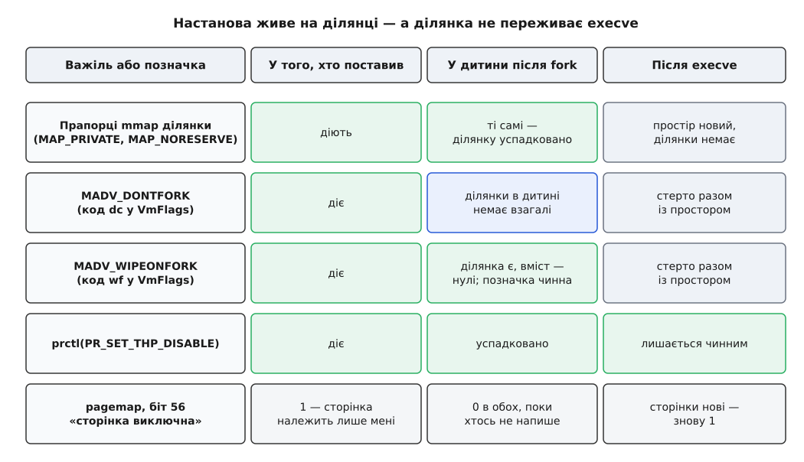

# 📋 Чим керують копіюванням при записі

Копіювання при записі не має в Linux ані власного системного виклику, ані власного перемикача: ним керують збоку — прапорцями при створенні ділянки, порадами про вже створену ділянку й системними налаштуваннями, — а його стан читають із `/proc`. Тут зібрано весь цей контракт: що саме можна попросити, якими помилками ядро відповідає на неправильне прохання, за якими полями видно стан і де перелік закінчується.

## Чотири поверхи, на яких стоять важелі

Кожен важіль має свою одиницю дії, і плутати їх дорого — те, що поставлено на ділянку, не стосується процесу, а те, що поставлено на систему, не питає жодної ділянки.

| Одиниця | Чим керують | Чим дивляться |
|---|---|---|
| Сторінка | нічим — окремою сторінкою керувати не можна | `/proc/<pid>/pagemap` |
| Ділянка (VMA) | прапорці `mmap` при створенні, `madvise` потім | `/proc/<pid>/smaps`, поле `VmFlags` |
| Процес | `prctl(PR_SET_THP_DISABLE, …)`, `/proc/<pid>/clear_refs` | `/proc/<pid>/smaps_rollup`, `/proc/<pid>/stat`, `getrusage` |
| Система | `/proc/sys/vm/*`, `/sys/kernel/mm/transparent_hugepage/*` | `/proc/meminfo` |

Із поверху випливає й час життя настанови, і це найчастіше джерело хибних очікувань.


*Прапорці ділянки й поради `madvise` живуть на самій ділянці, тому `fork` переносить їх до дитини разом із описом ділянки. Після `execve` їх немає — не тому, що хтось їх стирає, а тому, що [заміна образу](topic:unix-linux/exec-semantics) будує адресний простір із нуля, і старих ділянок більше не існує. Настанова `prctl` тут одна така: вона живе на процесі, а не на ділянці, тому переживає й `fork`, і `execve`.*

## Створення ділянки: прапорці mmap

```c
#include <sys/mman.h>

void *mmap(void *addr, size_t length, int prot, int flags, int fd, off_t offset);
```

Рівно один прапорець із трійки `MAP_PRIVATE` / `MAP_SHARED` / `MAP_SHARED_VALIDATE` обов'язковий; без жодного з них виклик повертає `EINVAL`. Саме цей вибір і вирішує, чи копіювання при записі взагалі стосується ділянки — [приватне й спільне відображення](topic:unix-linux/mmap-model) відрізняються тим, куди йдуть записи: у приватному вони лишаються при процесі, у спільному видні всім, хто відобразив те саме.

| Прапорець | Що означає для роздвоєння |
|---|---|
| `MAP_PRIVATE` | ділянка приватна: записи не видні іншим і не доходять до файлу. Це єдиний режим, у якому механізм працює |
| `MAP_SHARED` | ділянку не роздвоюють ніколи; записи видні всім і йдуть у файл. Механізм її не торкається |
| `MAP_SHARED_VALIDATE` | те саме, що `MAP_SHARED`, але невідомі прапорці не ігноруються мовчки, а дають `EOPNOTSUPP` (з 4.15) |
| `MAP_ANONYMOUS` | за ділянкою немає файлу, вміст — нулі; `fd` слід передавати `-1`, `offset` — `0` |
| `MAP_NORESERVE` | не резервувати місце під обіцянку кадру. Діє не завжди — див. розділ про overcommit |
| `MAP_POPULATE` | заповнити таблиці наперед, але без обіцянки, у якому саме режимі; щоб напевно розколоти приватні сторінки, є `MADV_POPULATE_WRITE` |
| `MAP_HUGETLB` | одиницею відображення стає велика сторінка з окремого пулу |
| `MAP_LOCKED` | сторінки не витісняються — але це не робить їх приватними: після `fork` вони так само спільні |

Відображення переживає `fork` із тими самими атрибутами — це прямо сказано в описі виклику. Ділянок у процесу не безмежно багато: стеля стоїть у `/proc/sys/vm/max_map_count`, і при спробі її перетнути `mmap` повертає `ENOMEM`. Це важить більше, ніж здається, бо поради `madvise` теж множать ділянки.

## Поради madvise

```c
#include <sys/mman.h>

int madvise(void *addr, size_t length, int advice);
```

Адреса має бути вирівняна на сторінку. Порада лягає не на байти, а на ділянки, і якщо діапазон накриває ділянку частково, ядро розрізає її надвоє чи натроє — саме звідси береться зростання числа ділянок у процесів, які щедро розсипають `madvise` по дрібних діапазонах.

| Порада | З ядра | Що робить | Обмеження |
|---|---|---|---|
| `MADV_DONTFORK` | 2.6.16 | ставить `VM_DONTCOPY`: у дитини ділянки не буде взагалі | будь-яка ділянка |
| `MADV_DOFORK` | 2.6.16 | знімає `VM_DONTCOPY`, повертаючи типове успадкування | `EINVAL` на ділянці з `VM_IO` — відображення пристрою назад у дитину не повертають |
| `MADV_WIPEONFORK` | 4.14 | ставить `VM_WIPEONFORK`: у дитини ділянка буде на місці, але заповнена нулями | лише приватна анонімна; `EINVAL`, якщо за ділянкою є файл або стоїть `MAP_SHARED` |
| `MADV_KEEPONFORK` | 4.14 | знімає `VM_WIPEONFORK` | `EINVAL` на «викидній» ділянці (`MAP_DROPPABLE`, з 6.11): така обнуляється в дитини завжди, і скасувати це не можна |
| `MADV_HUGEPAGE` | 2.6.38 | дозволяє прозорі великі сторінки на ділянці — тобто піднімає одиницю розколювання до 2 МіБ | |
| `MADV_NOHUGEPAGE` | 2.6.38 | забороняє їх — тримає одиницю розколювання на 4 КіБ | |
| `MADV_COLLAPSE` | 6.1 | синхронно збирає діапазон у великі сторінки, не питаючи налаштувань у `sysfs` | |
| `MADV_POPULATE_WRITE` | 5.14 | проходить діапазон так, наче в кожну сторінку записали, — але нічого не записує | лише на ділянці з правом на запис; не на `VM_PFNMAP` і `VM_IO` |
| `MADV_POPULATE_READ` | 5.14 | те саме на читання: сторінки з'являться, спільність лишиться | лише на ділянці з правом на читання |
| `MADV_FREE` | 4.5 | дозволяє ядру викинути сторінки; наступний запис скасовує дозвіл, але вміст може бути вже втрачено | ті самі обмеження, що й у `MADV_WIPEONFORK` |

Коди помилок на весь виклик спільні, окремих у порад про роздвоєння немає:

| errno | Коли |
|---|---|
| `EINVAL` | адреса не вирівняна на сторінку; довжина від'ємна; порада невідома; порада не годиться для цієї ділянки |
| `ENOMEM` | частина діапазону не відображена або лежить поза адресним простором процесу |
| `EAGAIN` | ресурс ядра тимчасово недоступний — виклик має сенс повторити |
| `EACCES` | `MADV_REMOVE` на відображенні, яке не є спільним і записуваним |
| `EPERM` | `MADV_HWPOISON` без `CAP_SYS_ADMIN` |
| `EBADF` | ділянка є, але відображає не файл |

Практичний наслідок із цієї бідності: повернене значення перевіряти обов'язково. `MADV_WIPEONFORK`, поставлений на ділянку, яка виявилася файловою, не спрацює тихо — він поверне `EINVAL`, і якщо цю відповідь викинути, програма спокійно передасть дитині ті самі таємниці, від яких захищалася.

```c
#include <sys/mman.h>
#include <errno.h>
#include <stdio.h>

/* Стан генератора випадкових чисел дитині не потрібен і шкідливий. */
int wipe_on_fork(void *area, size_t len)
{
        if (madvise(area, len, MADV_WIPEONFORK) == 0)
                return 0;
        if (errno == EINVAL) {
                /* Ділянка не приватна анонімна — цієї поради тут не буде НІКОЛИ.
                   Отже, або перевідображати, або обнуляти стан вручну після fork. */
                return -1;
        }
        perror("madvise(MADV_WIPEONFORK)");
        return -1;
}
```

Скасувати пораду можна лише парною до неї: `MADV_DOFORK` для `MADV_DONTFORK`, `MADV_KEEPONFORK` для `MADV_WIPEONFORK`. `MADV_NORMAL` тут не помічник — він скидає поради про порядок доступу, а не прапорці успадкування.

## Що видно у smaps

`/proc/<pid>/smaps` (з 2.6.14) дає по запису на кожну ділянку; `/proc/<pid>/smaps_rollup` (з 4.14) — ті самі поля, підсумовані по всьому процесу, плюс окремі `Pss_Anon`, `Pss_File`, `Pss_Shmem`. Обидва файли — частина [файлової системи процесів](topic:unix-linux/proc-filesystem), тобто читаються звичайним читанням тексту, але формуються в момент читання й тому не безкоштовні.

| Поле | Що лічить (числові — у кібібайтах) |
|---|---|
| `Rss` | скільки з ділянки зараз у фізичній пам'яті |
| `Pss` | частка процесу: кожну сторінку поділено на кількість тих, хто її бачить |
| `Pss_Dirty` | та сама частка, але лише по змінених сторінках |
| `Shared_Clean` | сторінки, які бачить ще хтось і які не змінені |
| `Shared_Dirty` | сторінки, які бачить ще хтось і які змінені — одразу після `fork` уся змінена анонімна пам'ять батька саме тут |
| `Private_Clean` | сторінки лише цього процесу, не змінені |
| `Private_Dirty` | сторінки лише цього процесу, змінені — сюди по одній переходять розколоті |
| `Anonymous` | скільки з `Rss` не належить жодному файлу; приватна копія сторінки файлу потрапляє сюди |
| `AnonHugePages` | скільки з анонімного лежить у прозорих великих сторінках |
| `Referenced` | скільки позначено як недавно вживані |
| `Swap`, `SwapPss` | скільки витіснено й пропорційна частка витісненого |
| `THPeligible` | чи ділянка взагалі придатна під прозорі великі сторінки |
| `VmFlags` | прапорці ділянки двобуквеними кодами |

П'ять із цих полів пов'язані тотожністю, і на ній тримається все читання стану:

```
Rss = Shared_Clean + Shared_Dirty + Private_Clean + Private_Dirty
```

**Умова.** Батько тримає 8 ГіБ анонімної пам'яті й розгалужується; поки дитина жива, батько пише у 12 000 своїх сторінок по 4 КіБ.

```
одразу після fork, ділянка батька:
  Rss             8388608
  Shared_Dirty    8388608
  Private_Dirty         0
  Pss             4194304      = 8388608 / 2   (кожну сторінку бачать двоє)

після 12 000 записів:
  Rss             8388608      ← не змінився: кадр замінили на кадр
  Shared_Dirty    8340608      = 8388608 − 12000·4
  Private_Dirty     48000      = 12000·4
  Pss             4218304      = 8340608/2 + 48000
```

Головне тут — нерухомий `Rss`. Розколювання не додає процесові сторінок, воно замінює спільний кадр на власний, тож за резидентним обсягом прогрес не видно взагалі. Видно його за перетіканням `Shared_Dirty` → `Private_Dirty`, а ціну для системи — за `Pss`: він виріс на 24 000 КіБ, рівно на половину скопійованого, бо друга половина лишилася на дитині. Фізично витрачено всі 48 000 КіБ, і це число з'являється тільки як сума `Pss` обох процесів. Чим `Rss`, `Pss` і `VSZ` різняться взагалі — [окрема розмова](topic:unix-linux/memory-accounting).

Ціна виміру: обидва файли обходять сторінки всіх ділянок процесу. `smaps_rollup` дешевший тим, що не друкує запис на кожну ділянку, — на процесі з тисячами ділянок різниця помітна, але сам обхід нікуди не зникає. На процесі в десятки гігабайтів опитувати `smaps` у циклі не варто.

Поле `VmFlags` — єдиний спосіб переконатися, що порада справді лягла:

| Код | Прапорець | Що означає |
|---|---|---|
| `sh` | `VM_SHARED` | ділянка спільна: копіювання при записі її не стосується |
| `dc` | `VM_DONTCOPY` | `MADV_DONTFORK` ліг: у дитини ділянки не буде |
| `wf` | `VM_WIPEONFORK` | `MADV_WIPEONFORK` ліг: у дитини ділянка буде порожня |
| `nr` | `VM_NORESERVE` | `MAP_NORESERVE` ліг |
| `ac` | `VM_ACCOUNT` | ділянку зараховано до `Committed_AS` |
| `hg`, `nh` | `VM_HUGEPAGE`, `VM_NOHUGEPAGE` | лягли `MADV_HUGEPAGE` чи `MADV_NOHUGEPAGE` |
| `ht` | `VM_HUGETLB` | ділянка на великих сторінках із пулу |
| `sd` | `VM_SOFTDIRTY` | ділянку вважають зміненою від останнього скидання soft-dirty |
| `io` | `VM_IO` | відображення пристрою — саме на такій `MADV_DOFORK` дасть `EINVAL` |
| `lo` | `VM_LOCKED` | сторінки закріплено в пам'яті |
| `um`, `uw` | `VM_UFFD_MISSING`, `VM_UFFD_WP` | ділянку обслуговує `userfaultfd`: стеження за відсутніми сторінками й за записами |

```sh
# Чи справді лягли поради про роздвоєння: шукаємо коди dc і wf
awk '/^[0-9a-f]/ { a = $1 } /^VmFlags/ && ($0 ~ / dc/ || $0 ~ / wf/) { print a, $0 }' \
    /proc/$PID/smaps
```

## Посторінково: pagemap

`/proc/<pid>/pagemap` — двійковий файл: вісім байтів на кожну віртуальну сторінку, зміщення дорівнює номеру сторінки, помноженому на вісім. Читати треба цілими восьмибайтовими записами.

| Біт | Значення |
|---|---|
| 63 | сторінка присутня у фізичній пам'яті |
| 62 | сторінка витіснена у своп |
| 61 | сторінка файлова або спільна анонімна (з 3.5) |
| 58 | запис таблиці належить до захисної ділянки (з 6.15) |
| 57 | запис таблиці захищено від запису через `userfaultfd` (з 5.13) |
| 56 | сторінка відображена виключно (з 4.2) |
| 55 | у записі таблиці стоїть позначка soft-dirty |
| 0–54 | номер фізичного кадру |

Біт 56 — це і є пряма, видима ззовні відповідь на питання, від якого залежить усе: чи цю сторінку бачить ще хтось. З ядра 4.0 номер кадру доступний лише з `CAP_SYS_ADMIN`, а з 4.2 непривілейований читач дістає в цих бітах нулі — але старші біти лишаються видні. Тобто дізнатися, що сторінка виключна, можна без жодних привілеїв; дізнатися, де вона лежить, — ні.

```c
#include <fcntl.h>
#include <stdint.h>
#include <unistd.h>

#define PM_SOFT_DIRTY  (1ULL << 55)
#define PM_EXCLUSIVE   (1ULL << 56)
#define PM_PRESENT     (1ULL << 63)

/* Стан однієї сторінки: чи вона належить процесові одноосібно
   й чи в неї писали від останнього скидання soft-dirty. */
int page_state(int pagemap_fd, const void *addr, long page_size,
               int *exclusive, int *soft_dirty)
{
        uint64_t entry;
        off_t off = (off_t)((uintptr_t)addr / page_size) * (off_t)sizeof(entry);

        if (pread(pagemap_fd, &entry, sizeof(entry), off) != (ssize_t)sizeof(entry))
                return -1;

        if (!(entry & PM_PRESENT)) {
                *exclusive = *soft_dirty = 0;   /* кадру ще немає взагалі */
                return 0;
        }
        *exclusive  = (entry & PM_EXCLUSIVE)  ? 1 : 0;
        *soft_dirty = (entry & PM_SOFT_DIRTY) ? 1 : 0;
        return 0;
}

/* Відкривати так: open("/proc/self/pagemap", O_RDONLY),
   page_size брати з sysconf(_SC_PAGESIZE). */
```

## clear_refs і позначка soft-dirty

`/proc/<pid>/clear_refs` — файл лише на запис, доступний власникові процесу; потрібен `CONFIG_PROC_PAGE_MONITOR`. Значення поза переліком не роблять нічого.

| Значення | З ядра | Дія |
|---|---|---|
| `1` | 2.6.22 | скинути біти «недавно вживана» на всіх сторінках процесу |
| `2` | 2.6.32 | те саме лише на анонімних |
| `3` | 2.6.32 | те саме лише на файлових |
| `4` | 3.11 | зняти позначку soft-dirty з усіх сторінок процесу |
| `5` | 4.0 | скинути пікове значення резидентного обсягу до поточного |

Стеження за змінами будують так: записати `4`, дати процесові попрацювати, прочитати `pagemap` і зібрати сторінки з бітом 55. На ділянках при цьому з'явиться код `sd` у `VmFlags`.

Ціна цього виміру принципова, і вона з тієї самої монети, з якої зроблено сам механізм: щоб позначка з'явилася при наступному записі, ядро мусить забрати дозвіл на запис у записах таблиці — тим самим способом. Отже, вмикання стеження саме собою спричиняє хвилю збоїв запису на всіх сторінках процесу. На ядрах, де рішення «копіювати чи привласнити» ухвалювали за лічильником посилань, воно ще й породжувало зайві копії на сторінках, з якими саме працював пристрій. Спостерігач тут не безкоштовний і не безневинний.

Сплутати `1` і `4` легко, а наслідки різні: перше псує статистику витіснення на всьому процесі, друге вмикає стеження.

## Лічильники збоїв

Розколювання сторінки — це [сторінковий збій](topic:unix-linux/page-fault), тобто зупинка інструкції з переходом у ядро, і то збій **малий**: диск у ньому не бере участі. Тому шукати його слід у лічильниках малих збоїв.

`/proc/<pid>/stat`, поля лічать від одиниці:

| № | Поле | Що лічить |
|---|---|---|
| 10 | `minflt` | малі збої процесу — сюди падають усі розколювання |
| 11 | `cminflt` | те саме, підсумоване по дітях, яких уже дочекалися |
| 12 | `majflt` | великі збої, тобто з дисковим вводом-виводом |
| 13 | `cmajflt` | те саме по дітях |
| 23 | `vsize` | віртуальний обсяг у байтах |
| 24 | `rss` | сторінки у фізичній пам'яті; документація сама називає це значення неточним |

```c
#include <sys/resource.h>

int getrusage(int who, struct rusage *usage);
```

`who` — це `RUSAGE_SELF` (усі потоки процесу), `RUSAGE_CHILDREN` (лише ті діти, яких уже дочекалися) або `RUSAGE_THREAD` (з 2.6.26, потребує `_GNU_SOURCE`). Потрібні поля — `ru_minflt` («збої, обслужені без вводу-виводу»), `ru_majflt` («збої, що вимагали вводу-виводу») і `ru_maxrss` (пік резидентного обсягу в КіБ, з 2.6.32).

```c
struct rusage before, after;

getrusage(RUSAGE_SELF, &before);
/* … робота, під час якої розколюються успадковані сторінки … */
getrusage(RUSAGE_SELF, &after);

printf("малих збоїв: %ld\n", after.ru_minflt - before.ru_minflt);
```

Дві межі цього виміру варто знати наперед. По-перше, Linux заповнює зі структури `rusage` тільки `ru_utime`, `ru_stime`, `ru_maxrss`, `ru_minflt`, `ru_majflt`, `ru_inblock`, `ru_oublock`, `ru_nvcsw` і `ru_nivcsw`; решта завжди нулі. Зокрема, `ru_ixrss` та `ru_idrss`, які за назвою обіцяють «спільну» й «власну» пам'ять, для оцінки спільності не годяться взагалі. По-друге, `minflt` не розрізняє видів малого збою: перше торкання свіжої анонімної сторінки, розколювання після `fork` і повернення сторінки з кешу лічаться однаково. Відокремити розколювання можна лише зіставленням із `Private_Dirty` у `smaps` до й після.

## Одиниця розколювання: великі сторінки

Одиниця розколювання дорівнює одиниці відображення, тож [прозорі великі сторінки](topic:unix-linux/huge-pages) — у яких ділянка відображається кадром на 2 МіБ замість 4 КіБ — прямо помножують ціну першого запису.

| Файл у `/sys/kernel/mm/transparent_hugepage/` | Значення | Що змінює |
|---|---|---|
| `enabled` | `always`, `madvise`, `never` | чи ядро взагалі збирає прозорі великі сторінки |
| `defrag` | `always`, `defer`, `defer+madvise`, `madvise`, `never` | чи чекати на ущільнення пам'яті заради великої сторінки |
| `hpage_pmd_size` | лише читання, байти | розмір великої сторінки на рівні PMD, зазвичай 2 МіБ |
| `use_zero_page` | `0`, `1` | чи є великий спільний кадр нулів під читання |
| `shmem_enabled` | `always`, `never`, `deny`, `force` та інші | політика для tmpfs і спільної анонімної пам'яті |
| `hugepages-<розмір>kB/enabled` | `always`, `madvise`, `never`, `inherit` | те саме для конкретного розміру сторінки |
| `khugepaged/max_ptes_shared` | число | скільки спільних сторінок збирач готовий стерпіти, збираючи ділянку |
| `khugepaged/pages_to_scan`, `scan_sleep_millisecs` | числа | темп фонового збирання |

Ділянку можна вилучити з цієї політики зсередини процесу:

```c
#include <sys/prctl.h>

prctl(PR_SET_THP_DISABLE, 1, 0, 0, 0);   /* з 3.15: вимкнути THP для процесу */
prctl(PR_GET_THP_DISABLE, 0, 0, 0, 0);   /* з 3.15: повертає 0 або 1 */

/* Вимкнути скрізь, окрім явно порадженого через madvise.
   УВАГА: прапорець набагато молодший за сам PR_SET_THP_DISABLE —
   він з'явився аж у ядрах кінця 2025 року. На всіх чинних LTS
   цей виклик поверне EINVAL. */
prctl(PR_SET_THP_DISABLE, 1, PR_THP_DISABLE_EXCEPT_ADVISED, 0, 0);
```

Значення, яке віддає `PR_GET_THP_DISABLE`, — це бітова маска: `0` — не вимкнено, `1` — вимкнено повністю, `3` — вимкнено скрізь, окрім порадженого через `madvise`. Третє значення можливе лише на ядрах, які знають `PR_THP_DISABLE_EXCEPT_ADVISED`; розбирач, написаний під `0`/`1`, на старому ядрі працюватиме правильно й далі.

Ця настанова успадковується дитиною після `fork` **і зберігається після** `execve` — єдина у всьому переліку, бо єдина стоїть на процесі, а не на ділянці. Тому саме нею загортають чужу програму, якій великі сторінки шкодять: у її код `madvise` не вставиш, а обгортка, що виставляє `prctl` і аж тоді кличе `execve`, спрацює.

Стан читають із `AnonHugePages` і `THPeligible` у `smaps`, рядка `AnonHugePages` у `/proc/meminfo` та лічильників у `hugepages-2048kB/stats`.

## Обіцянка пам'яті: overcommit

Знявши біт запису, ядро видало обіцянку: коли сюди напишуть, кадр знайдеться. Чи перевіряють цю обіцянку наперед — вирішує режим обліку. Що відбувається, коли обіцянку не вдається виконати, описано в статті про [overcommit і OOM-killer](topic:unix-linux/overcommit-and-oom).

| Файл у `/proc/sys/vm/` | Значення | Дія |
|---|---|---|
| `overcommit_memory` | `0` | евристика, типове: відхиляють лише явно безглузді запити |
| | `1` | не перевіряти взагалі |
| | `2` | сувора перевірка: сума обіцянок не перевищує `CommitLimit` |
| `overcommit_ratio` | відсоток, типово `50` | частка оперативної пам'яті, що входить у `CommitLimit` |
| `overcommit_kbytes` | абсолютне значення в КБ, з 3.14 | заміна для `overcommit_ratio`; ненульовим може бути лише одне з двох |
| `admin_reserve_kbytes` | типово `min(3 % вільних, 8 МіБ)` | запас, щоб адміністратор устиг увійти й вбити процес |
| `user_reserve_kbytes` | типово `min(3 % вільних, 128 МіБ)` | запас, щоб один процес користувача не з'їв усе |
| `max_map_count` | типово `65530` | стеля числа ділянок; при перетині `mmap` і `madvise` дають `ENOMEM` |

```
CommitLimit = (total_RAM − total_huge_TLB) · overcommit_ratio / 100 + total_swap

а якщо overcommit_kbytes ненульове (з 3.14):
CommitLimit = overcommit_kbytes + total_swap
```

Обидва числа видно в `/proc/meminfo`: `CommitLimit` — стеля, `Committed_AS` — сума вже виданих обіцянок.

`MAP_NORESERVE` поводиться в трьох режимах по-різному, і це найчастіша пастка. У режимі `0` прапорець діє: таке відображення евристикою не перевіряють узагалі. У режимі `1` він не має значення, бо не перевіряють нічого. У режимі `2` його **ігнорують** — ділянку однаково зараховують до `CommitLimit`. Побачити результат можна за кодом `ac` у `VmFlags`: він стоїть саме тоді, коли ділянку зараховано.

Для `fork` із цього випливає різка зміна поведінки. У режимах `0` і `1` розгалуження процесу на 24 ГіБ приватної пам'яті просто вдасться, а платіж настане пізніше й у найгіршому місці — на звичайному присвоєнні всередині програми. У режимі `2` обіцянку копії треба зарахувати наперед, тож той самий `fork` додасть до `Committed_AS` ще 24 ГіБ і, не вмістившись у стелю, поверне `ENOMEM` одразу. Друге чесніше, але програми, написані під перше, до такої відповіді часто не готові.

## Чого в цьому контракті немає

**Немає виклику «розколи це зараз».** Найближче до нього — `MADV_POPULATE_WRITE` (з 5.14): він проходить діапазон так, наче в кожну сторінку записали, але нічого не записує, тож усі приватні сторінки розколюються заздалегідь і без псування вмісту. До 5.14 цього доводилося досягати вручну — читати з кожної сторінки байт і записувати той самий байт назад.

**Немає сповіщення «цю сторінку щойно розкололи».** Дізнатися про запис у мить запису можна тільки самому забравши дозвіл: або через soft-dirty (постфактум і оптом), або через [обробку збоїв у просторі користувача](topic:unix-linux/userfaultfd) із захистом від запису — тоді подія приходить одразу, але ділянку доводиться обслуговувати власноруч.

**Немає дешевого проміжного питання.** `smaps_rollup` дає підсумок по всьому процесу, `pagemap` — відповідь про одну сторінку. Спитати «скільки сторінок у цьому діапазоні ще спільні», не пройшовши діапазон посторінково, нічим.

**Немає окремого лічильника розколювань.** `minflt` змішує їх з усіма іншими малими збоями, і розділити їх інтерфейс не пропонує.

**Немає обіцянки, що поля лишаться.** Документація ядра прямо застерігає: набір мнемонік `VmFlags` не гарантовано зберігається в наступних випусках. Правило [сталості ABI](topic:unix-linux/userspace-abi-stability) на `/proc` поширюється не так суворо, як на системні виклики, тому розбирач має мовчки пропускати незнайомі рядки й коди, а не падати на них.

**І нічого з переліку не працює на спільних ділянках.** `MAP_SHARED` — це не варіант приватного відображення з іншими правами, а інший механізм; жоден із наведених важелів його не стосується.
