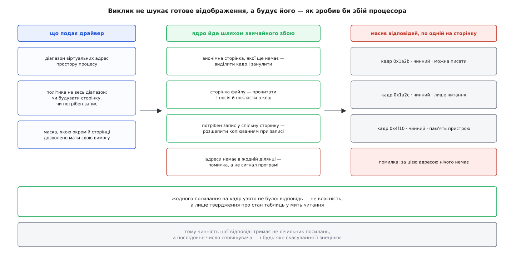
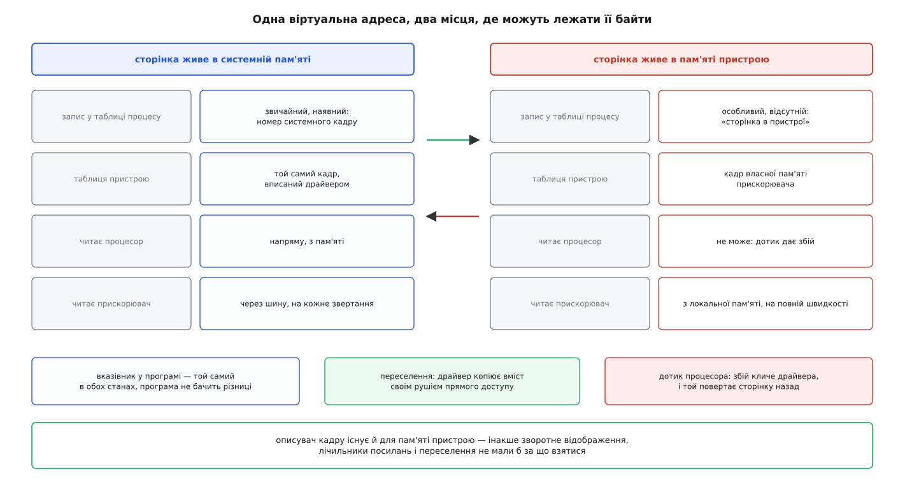
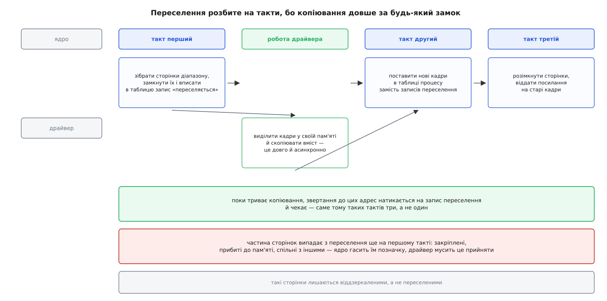

# HMM: дзеркалення адресного простору процесу в пам'яті прискорювача

<preknowlist>
- [Віртуальний адресний простір процесу](book:unix-linux/virtual-address-space) — адреса в програмі не є номером комірки в мікросхемі; кожен процес має власний набір відповідностей.
- [Сторінки, таблиці сторінок і MMU](book:unix-linux/paging-and-mmu) — відповідність «віртуальна сторінка → фізичний кадр» лежить у таблицях, і апаратура читає їх на кожне звертання.
- [Сторінковий збій](book:unix-linux/page-fault) — запису в таблиці може не бути, і тоді сторінку добудовує ядро в мить першого дотику.
- [Копіювання при записі](book:unix-linux/copy-on-write) — спільну сторінку розщеплюють лише тоді, коли в неї хтось пише.
- [Свопінг і витіснення сторінок](book:unix-linux/swap-and-reclaim) — забрана сторінка лишає в таблиці особливий «відсутній» запис, за яким її вміють повернути.
- [Сповіщувачі MMU](book:unix-linux/mmu-notifiers) — угода, за якою ядро попереджає власника другої таблиці про кожну зміну відображень.
- [Закріплення сторінок для пристрою](book:unix-linux/page-pinning-gup) — протилежний підхід: узяти на кадр посилання й заборонити ядру його рухати.
- [Зворотне відображення сторінки](book:unix-linux/reverse-mapping) — за фізичним кадром ядро вміє знайти всі записи таблиць, що на нього вказують.
- [Модель фізичної пам'яті](book:unix-linux/sparsemem-and-vmemmap) — на кожен кадр існує описувач, і саме за нього чіпляється вся робота підсистеми пам'яті.
- [DMA і відображення буферів у ядрі](book:unix-linux/dma-and-buffers) — пристрій ходить у пам'ять повз процесор і за своєю власною адресою.
- [IOMMU](book:programming/iommu) — окремий перекладач адрес на шляху пристрою до пам'яті.
</preknowlist>

Програма зібрала в пам'яті дерево: вузли роздані звичайним розподільником, кожен тримає адреси своїх нащадків. Тепер її автор хоче віддати обхід цього дерева прискорювачеві — платі, яка перемелює такі обходи вдесятеро швидше.

Класичний шлях виглядає так: виділити буфер у пам'яті плати, перекласти туди дані, запустити обчислення, забрати результат. Для масиву чисел це працює. Для дерева — ні, і причина не в розмірі. Кожна адреса, записана всередині вузла, має сенс лише в тому просторі, де її отримали. У пам'яті плати ті самі байти лежать за іншими адресами, тож усі внутрішні вказівники доведеться переписати — а щоб їх переписати, треба обійти дерево. Обійти на процесорі. Тобто зробити рівно ту роботу, яку хотіли віддати. І потім зробити її ще раз у зворотний бік.

Отже, копіювання не рятує: потрібно, щоб прискорювач розумів **ті самі числа**. Не «мав копію даних», а читав за адресою `0x7f2a…` те саме, що читає за нею процес.

## Що для цього має статися

Число стає пам'яттю через переклад. У процесора переклад робить MMU за таблицями сторінок процесу; у прискорювача є власний перекладач і власні таблиці. Щоб одна адреса означала одну пам'ять, ці таблиці мають нести ті самі відповідності.

Способів заповнити їх рівно два. Або пристрій сам ходить у таблиці процесу — так уміє апаратура зі спільною адресацією, де запити з плати проходять через [IOMMU](book:programming/iommu) з номером адресного простору. Або таблиці пристрою тримає драйвер, копіюючи в них те, що прочитав у процесі. Другий шлях називають **дзеркаленням** — і саме він потрібен апаратурі, яка не вміє першого, а також усім, хто хоче не лише бачити пам'ять процесу, а й переселяти її до себе.

HMM (англ. *heterogeneous memory management* — керування пам'яттю в різнорідній системі) — це той набір ядерних механізмів, що робить дзеркалення можливим. Він складається з двох частин, і вони відповідають на два різні питання: «яка сторінка стоїть за цією адресою просто зараз» і «як зробити, щоб байти за цією адресою фізично переїхали в пам'ять плати». Обидві частини писалися важко й довго: перші латки з'явилися 2014 року, а в ядро вони потрапили аж 2017-го, у версії 4.14, після понад двох десятків переробок — [чому це зайняло три роки](book:unix-linux/hmm-address-space-mirroring/hist-hmm-birth.md).

## Відповідь, чинна лише мить

Перше, у що впирається дзеркалення: таблиця драйвера — це кеш чужих даних, які змінюються без його відома. Ядро витісняє сторінки, ущільнює пам'ять, розщеплює спільні сторінки при записі, звільняє ділянки на `munmap`. Щоразу воно править свої таблиці, скидає кеш перекладів процесора — і нічого не знає про другу табличку з тим самим номером кадру.

Ця тріщина закрита окремою угодою: [сповіщувачі MMU](book:unix-linux/mmu-notifiers) дають драйверові пару викликів, що огороджує весь час зміни, і послідовне число, за яким він звіряє свій прочитаний знімок перед тим, як записати його в апаратуру. Тут важливий лише наслідок: **будь-яка відповідь про стан таблиць чинна доти, доки не прийшло скасування**, і драйвер зобов'язаний уміти почати спочатку.

З цього одразу випливає, чим дзеркалення не є. Воно не бере на сторінки посилань. [Закріплення](book:unix-linux/page-pinning-gup) — протилежна угода: узяти лічильник, заморозити кадр, працювати з ним скільки треба. Вона добра для буфера на кілька мегабайтів і на кілька мілісекунд. Прискорювач же дзеркалить десятки гігабайтів на весь час життя програми, і заморозити стільки — значить викреслити із системи витіснення й ущільнення.

## Збій, зроблений замість процесора

Тепер друга тріщина, менш очевидна. Прискорювач звертається за адресою, якої процес ще жодного разу не торкався: пам'ять виділено `malloc`, але жодного запису в неї не було. У таблицях процесу за цією адресою немає нічого, бо сторінка з'являється лише під час першого дотику. Драйвер, який просто **дивиться** в таблиці, не знайде там нічого — і не матиме що покласти в апаратуру.

Вимагати від програми «доторкнися сама, а тоді запускай обчислення» безглуздо: це те саме зайве проходження всієї пам'яті, від якого тікали на початку. Отже, драйверові потрібен не пошук, а **збій, зроблений за пристрій**: пройти той самий шлях, який пройшло б ядро, якби за цією адресою читав процесор.

Саме це робить `hmm_range_fault()`. Драйвер подає діапазон віртуальних адрес і політику, а дістає масив відповідей — по одній на сторінку.

```c
struct hmm_range range = {
        .notifier      = &mirror->sub,          /* вузол сповіщувача на цей діапазон */
        .start         = addr,
        .end           = addr + len,
        .hmm_pfns      = pfns,                  /* сюди ляжуть відповіді */
        .default_flags = HMM_PFN_REQ_FAULT,     /* політика на весь діапазон */
        .pfn_flags_mask = 0,                    /* окремі сторінки своїх вимог не мають */
};

mmap_read_lock(mm);
ret = hmm_range_fault(&range);
mmap_read_unlock(mm);
```

`HMM_PFN_REQ_FAULT` означає «якщо сторінки немає — побудуй її». Ядро виконає рівно те, що зробило б для процесора: анонімній сторінці виділить кадр і занулить його, сторінку файлу підвантажить з носія в сторінковий кеш. Додати `HMM_PFN_REQ_WRITE` — значить попросити ще й право запису, а це тягне [розщеплення спільної сторінки](book:unix-linux/copy-on-write): ядро зробить приватну копію, і в масив ляже вже її кадр. Без цього прапорця драйвер отримав би сторінку, спільну з іншим процесом, і запис прискорювача пішов би в чужі дані.

Обнулити обидва поля — значить перейти в інший режим: не будувати нічого, а лише зняти знімок того, що вже є. Так драйвер дізнається, які сторінки вже в пам'яті, не змушуючи ядро добудовувати решту. А `pfn_flags_mask` разом із позначками, проставленими в самому масиві до виклику, служить іншому: зажадати збою не для всього діапазону, а лише для тих сторінок, які справді потрібні.

Відповідь на кожну сторінку — не голий номер кадру, а номер із позначками: чинний він чи ні, дозволено писати чи лише читати, і якого розміру сторінка стоїть за цією адресою (велика сторінка все одно займає в масиві стільки місць, скільки в ній звичайних сторінок, але кожна відповідь несе позначку порядку — за нею драйвер впізнає суцільний шматок і вписує в апаратуру одне велике відображення замість купи дрібних). Окремо стоїть відповідь «за цією адресою нічого немає»: коли діапазон зачепив діру між ділянками пам'яті, ядро не вбиває процес сигналом — воно позначає ці сторінки помилковими й лишає рішення драйверові. Той зазвичай повідомляє пристрою про хибне звертання, і вже прошивка вирішує, чи це помилка обчислення.



*Ніякого посилання на кадри не взято: відповідь — це твердження про стан таблиць у мить читання, і воно знецінюється першим же скасуванням.*

> 🔧 **Навіщо це.** З цієї властивості ростуть усі вимоги до драйвера прискорювача: між отриманням масиву й записом його в апаратуру не можна робити нічого, що спить надовго, а між ними обов'язково має бути звірка послідовного числа під власним замком. Порушите порядок — дістанете пристрій, який пише за номером кадру, уже виданого іншому процесу; і воно не впаде одразу, а тихо псуватиме чужі дані під навантаженням.

## Швидкість, якої дзеркало не дає

Дзеркалення робить пам'ять процесу **правильно видимою** — і на цьому зупиняється. Кожне звертання прискорювача все одно йде через шину: сотні наносекунд затримки й пропускна здатність, у рази менша за локальну пам'ять плати. Обчислення, що тримається на випадкових звертаннях у велике дерево, від такої видимості не пришвидшиться.

Виправляє це лише фізичний переїзд: байти мають лягти в пам'ять самої плати. Але переїхати вони мусять так, щоб **вказівник у програмі лишився чинним** — інакше ми повернулися до переписування вказівників, з якого починали.

## Кадр, до якого процесор не дотягнеться

Пам'ять прискорювача для процесора здебільшого недосяжна. Вона схована за вікном на шині, яке часто менше за неї саму, а до того ж не когерентна з кешами процесора. Читати з неї звичайною інструкцією не можна.

А підсистема пам'яті ядра вміє працювати лише з тим, у чого є **описувач кадру**: зворотне відображення, лічильники посилань, переселення, облік — усе чіпляється саме за нього. Кадр без описувача для ядра не існує.

Звідси хід, на якому все тримається: заводимо описувачі й для пам'яті пристрою. Ядро дозволяє драйверові зареєструвати діапазон [моделі фізичної пам'яті](book:unix-linux/sparsemem-and-vmemmap) з позначкою «приватна пам'ять пристрою» — на кожен кадр плати з'являється звичайний описувач, з яким решта підсистеми поводиться як завжди. Той самий каркас, до речі, обслуговує й [постійну пам'ять](book:unix-linux/dax-direct-access), тільки там кадри процесорові якраз доступні.

Лишається сказати таблицям процесу правду: сторінка є, але процесор її не дістане. Тут стає в пригоді форма, придумана колись для свопу. Витіснена сторінка лишає в таблиці **особливий відсутній запис** — не порожнечу, а закодоване «шукай її ось там». Приватна сторінка пристрою користується тим самим прийомом: у таблиці процесу стоїть відсутній запис, який вказує на описувач кадру плати. Для апаратури це просто «сторінки немає» — будь-який дотик дає збій. Для ядра це достатньо повна інформація, щоб знайти власника.



*Вказівник у програмі однаковий в обох станах — уся різниця схована в записі таблиці й в описувачі кадру.*

## Дотик процесора як подія

Тепер ясно, що станеться, коли програма таки прочитає своє дерево, поки воно живе на платі. Процесор дає збій. Ядро дивиться на запис у таблиці, бачить приватну сторінку пристрою, за описувачем знаходить драйвера-власника й кличе його зворотний виклик «поверни в оперативну пам'ять». Драйвер бере системний кадр, копіює туди вміст своїм рушієм прямого доступу, ставить у таблицю звичайний запис. Збій завершується, інструкція повторюється, програма нічого не помічає.

Ілюзія «усе просто працює» — це обробник збою, і коштує вона рівно стільки: перехід у ядро, копіювання сторінки через шину, скидання кешу перекладів. Одиниці мікросекунд. Один раз — дрібниця; у циклі, де процесор і плата по черзі торкаються тих самих сторінок, це перетворюється на безперервне перекидання сторінки туди-сюди, і обчислення стає повільнішим, ніж було б без жодного переселення. Тому драйвери переселяють не окремі сторінки, а великі діапазони, і роблять це за підказками програми: обидва прикладні інтерфейси, побудовані на HMM, мають виклики на кшталт «ця ділянка мені знадобиться на пристрої».

## Три такти переселення

Переселення сторінки в пам'ять плати — окремий випадок загального механізму [міграції сторінок](book:unix-linux/page-migration), але з однією особливістю, яка ламає звичну схему: копіює не ядро, а драйвер, своїм рушієм, і робить це довго й асинхронно. Тримати весь цей час замки на таблицях не можна. Тому переселення розбите на такти, між якими керування повертається драйверові.

```c
struct migrate_vma args = {
        .vma    = vma,
        .start  = addr,
        .end    = addr + len,
        .src    = src_pfns,     /* що знайшлося й чи можна його рухати */
        .dst    = dst_pfns,     /* куди драйвер його кладе */
        .flags  = MIGRATE_VMA_SELECT_SYSTEM,
};

migrate_vma_setup(&args);       /* такт перший */
device_alloc_and_copy(&args);   /* робота драйвера: свої кадри й копіювання */
migrate_vma_pages(&args);       /* такт другий */
device_install_entries(&args);
migrate_vma_finalize(&args);    /* такт третій */
```

Перший такт збирає сторінки діапазону, замикає їх і ставить у таблицю процесу **запис переселення** — ще один різновид відсутнього запису, який означає «сторінка саме зараз їде». Будь-хто, хто торкнеться цих адрес під час копіювання, натрапить на нього й почекає. Другий такт замінює ці записи на нові — ті, що вказують на кадри пристрою. Третій розмикає сторінки й віддає посилання на старі кадри, після чого ті йдуть у вільний пул.

Найважливіше в цьому інтерфейсі — те, що частина сторінок **не переселиться**, і драйвер мусить це прийняти. На першому такті ядро гасить позначку «рухається» кожній сторінці, яку зрушити не можна: [закріпленій](book:unix-linux/page-pinning-gup) під ввід-вивід, прибитій `mlock`, спільній із файлом чи з іншим процесом. Драйвер, який мовчки перепише вміст усього діапазону, зіпсує дані. Правильна поведінка — переселити те, що дозволено, а решту лишити віддзеркаленою через `hmm_range_fault`. Через це в одному діапазоні звичайно живуть сторінки обох родів, і таблиця пристрою вказує частково на власну пам'ять, частково на системну.



*Сторінки, яким ядро погасило позначку переселення, лишаються віддзеркаленими — це нормальний, а не винятковий стан.*

Як це виглядає повністю — від виділення кадрів пристрою до обробника «поверни в оперативну пам'ять» і до пасток, на яких найчастіше горять, — зібрано окремо: [переселити діапазон у пам'ять пристрою й повернути назад](book:unix-linux/hmm-address-space-mirroring/proj-migrate-to-device.md).

## Коли переселяти не треба

Уся конструкція з відсутніми записами й збоями потрібна через одне: процесор не може прочитати пам'ять плати. Якщо може — потреба відпадає. Для апаратури зі зв'язком, когерентним із кешами процесора, 2022 року з'явився другий різновид описувачів: кадри пам'яті пристрою, які процесор читає й пише звичайними інструкціями. Запис у таблиці процесу тоді звичайний, наявний, дотик збою не дає, переселення перестає бути механізмом правильності й стає лише питанням розміщення — де вигідніше тримати сторінку.

Один випадок, утім, лишається. Довге [закріплення](book:unix-linux/page-pinning-gup) такої сторінки ядро не дозволяє: закріплений кадр не зрушити, а розподільник пам'яті плати мусить мати право перекладати свої кадри. Тому сторінку, яку хтось закріплює надовго, ядро переселяє назад у системну пам'ять — і вже там її морозить.

## Де проходить межа

Дзеркалення — не єдиний спосіб дати прискорювачеві адреси процесу, і не завжди найкращий. Апаратура зі спільною адресацією ходить у таблиці процесу сама: запити з плати несуть номер адресного простору, [IOMMU](book:programming/iommu) перекладає їх за тими самими таблицями, а невдалий переклад плата вміє відкласти й повторити, отримавши від ядра відповідь на запит сторінки. Другої таблиці тут просто немає, тож немає й чого узгоджувати — лишається тільки розсилати скасування перекладів.

HMM потрібен там, де цього не вистачає: апаратура старша або простіша, шина не має протоколу запиту сторінок, а головне — коли пам'ять треба не лише бачити, а й тримати в себе. Обидва відомі користувачі в ядрі — драйвери графічних плат, які дають обчисленням ходити просто в пам'ять програми, — стоять саме на цьому.

І тоді видно, чим насправді є вказівник у такій системі. Це не адреса й навіть не обіцянка адреси. Це ім'я, за яким у кожен момент стоїть чиясь чинна відповідь: зараз — системний кадр, за мить — кадр на платі, ще за мить — знову системний, і кожен перехід починається зі збою, якого програма не бачить. Підсистема пам'яті ядра при цьому робить одне: стежить, щоб усі, хто цим іменем користується, мали однакову відповідь — або чесно не мали жодної.
