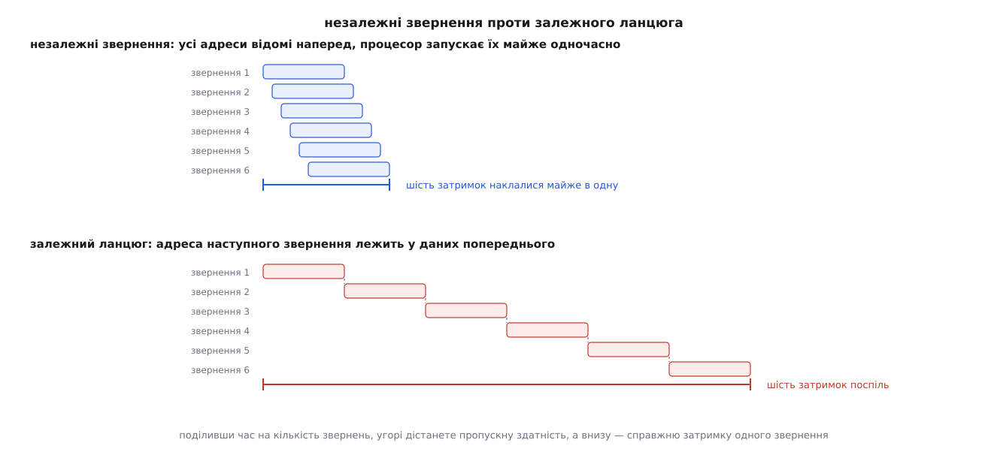
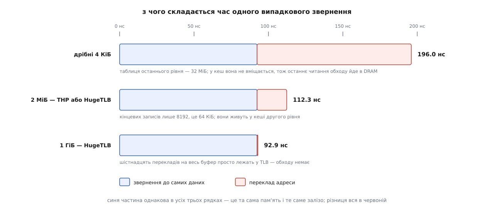

# ⚙️ Прилад: скільки наносекунд коштує переклад адреси

Одна програма на C бере той самий буфер трьома способами — звичайними сторінками, прозорими великими й сторінками з пулу — і друкує ціну одного випадкового звернення в наносекундах, щоб податок на переклад адрес перестав бути розмазаною по профілю невидимкою й став числом, яке ви бачили самі.

Податок цей має неприємну властивість: у профілі він не має власного рядка. Немає функції «переклад адреси», немає системного виклику, немає сходинки на полум'яному графіку. Є тільки загальне відчуття, що пам'ять чомусь повільна. Єдиний спосіб побачити його окремо — поставити поряд два прогони, у яких **усе однакове, крім розміру сторінки**, і відняти одне число від другого.

## Чому наївний вимір покаже не те

Перша спокуса — узяти масив індексів, перемішати його й у циклі читати `buf[idx[i]]`. Такий цикл виглядає цілком випадковим, а міряє геть не те, що потрібно.

Річ у тім, що процесор бачить усі адреси наперед: `idx[i]`, `idx[i+1]`, `idx[i+2]` лежать поруч і читаються послідовно, тож наступні звернення можна запустити, не чекаючи на попередні. А запустити їх є куди: сучасне процесорне ядро тримає в польоті півтора десятка незакритих промахів [кеша](book:programming/cache) — швидкої пам'яті, що стоїть між процесором і DRAM. Промахи накладаються один на одного, і за час однієї затримки встигає завершитися десяток звернень. Поділивши час на кількість звернень, ви дістанете не затримку, а пропускну здатність — число вп'ятеро-вдесятеро менше й до нашого питання геть непричетне.

Просто пройти масив по порядку не допоможе й поготів. Там працює передвибірка: побачивши рівний крок, процесор тягне наступні рядки ще до того, як по них прийдуть, — а сторінка при обході масиву байтів змінюється раз на чотири тисячі звернень, тож переклад майже нічого не коштує навіть на дрібних сторінках. Послідовний обхід — саме той випадок, де великі сторінки не дають нічого, і міряти ним їхню користь безглуздо.



*Один і той самий обсяг роботи. Тільки в другому випадку поділ часу на кількість звернень дає затримку одного звернення.*

Лікування одне: зробити так, щоб **адреса наступного звернення була результатом попереднього**. Тоді процесор не може почати друге, поки не закінчив перше, — і час чесно ділиться. Це називають обходом за покажчиками (англ. *pointer chasing*), і весь вимірювальний цикл зводиться до одного рядка:

```c
p = *(uintptr_t *)p;
```

Заразом зникає і другий недолік наївного варіанта: масив індексів на чотири мільйони елементів — це ще 32 МіБ трафіку, власні промахи кеша й власні промахи TLB. Ланцюг покажчиків живе **всередині самого буфера** й нічого зайвого не чіпає.

## Рахунок до виміру

Перш ніж запускати, варто передбачити результат — інакше не буде з чим звіряти. Візьмімо буфер на 16 ГіБ і один вузол на кожну сторінку.

```
16 ГіБ ÷ 4 КіБ = 4 194 304 сторінки → 4194304 · 8 Б = 32 МіБ таблиць останнього рівня
16 ГіБ ÷ 2 МіБ =     8 192 сторінки →    8192 · 8 Б = 64 КіБ кінцевих записів
16 ГіБ ÷ 1 ГіБ =        16 сторінок →      16 · 8 Б =  128 Б кінцевих записів
```

Тут і сховано все пояснення наперед. Таблиця сторінок — це такі самі дані в такій самій пам'яті, і вона так само живе в кешах. Тридцять два мегабайти не вміщаються в кеш останнього рівня, тож на дрібних сторінках останнє читання обходу майже завжди йде в DRAM: одне випадкове звернення до даних коштує **двох походів у DRAM**, а не одного. Шістдесят чотири кілобайти спокійно лежать у кеші другого рівня, і обхід коштує одиниць наносекунд. Сто двадцять вісім байтів — це шістнадцять перекладів, які просто поміщаються в [TLB](book:programming/tlb), маленькому кеші готових перекладів усередині процесора; обходу не буде взагалі.

Друга половина передбачення — частка промахів. Якщо в TLB другого рівня дві тисячі записів, а звернення випадкові, частка влучань дорівнює просто частці збережених перекладів від усіх потрібних:

```
дрібні 4 КіБ:  2048 / 4194304 = 0.05 %  → промах майже на кожному зверненні
       2 МіБ:  2048 /    8192 =   25 %  → промах на трьох зверненнях із чотирьох
       1 ГіБ:    16 /      16 =  100 %  → промахів немає
```

Зверніть увагу на середній рядок: на двомегабайтових сторінках промахи TLB **нікуди не діваються**, їх лишається три чверті. Дешевшає не кількість промахів, а ціна кожного. Це найчастіше непорозуміння всієї теми, і зараз ми його поміряємо.

## Пам'ять, узята трьома способами

```c
/* tlbwalk.c — ціна перекладу адрес на трьох видах сторінок.
   Збірка:  cc -O2 -std=gnu11 -o tlbwalk tlbwalk.c
   Запуск:  ./tlbwalk all 16 20        # режим · ГіБ · мільйонів кроків     */
#define _GNU_SOURCE
#include <errno.h>
#include <stdint.h>
#include <stdio.h>
#include <stdlib.h>
#include <string.h>
#include <time.h>
#include <sys/mman.h>

#define PAGE  4096UL
#define HUGE  (2UL << 20)
#define LINE  64UL

#ifndef MAP_HUGE_SHIFT
#define MAP_HUGE_SHIFT 26
#endif
#ifndef MADV_COLLAPSE
#define MADV_COLLAPSE 25                 /* з'явилося в Linux 6.1 */
#endif
```

Вирівнювання — перше, з чого починається робочий код. Велика сторінка існує тільки на межі, кратній двом мегабайтам, тож ділянка, віддана `mmap` за довільною адресою, майже напевно перетинає таку межу навпіл, і крайні блоки великими не стануть ніколи. Просимо на `align` більше й відрізаємо зайве з обох боків — обидва хвости повертаються системі окремими `munmap`, тож нічого не марнується.

```c
/* Ділянка, початок якої вирівняний на align (степінь двійки, кратна PAGE). */
static char *mmap_aligned(size_t len, size_t align)
{
        size_t total = len + align;
        char *raw = mmap(NULL, total, PROT_READ | PROT_WRITE,
                         MAP_PRIVATE | MAP_ANONYMOUS, -1, 0);
        if (raw == MAP_FAILED)
                return MAP_FAILED;

        uintptr_t start = ((uintptr_t)raw + align - 1) & ~(uintptr_t)(align - 1);
        size_t head = start - (uintptr_t)raw;
        if (head)
                munmap(raw, head);
        if (total - head - len)
                munmap((char *)start + len, total - head - len);
        return (char *)start;
}
```

Тепер самі три способи. Контрольний режим потребує окремої обережності: на машині з `enabled=always` система підсуне великі сторінки й туди, і «дрібний» вимір буде не дрібним. Тому в ньому стоїть явна заборона.

```c
enum mode { M_SMALL, M_THP, M_HUGETLB };

static char *take(enum mode m, size_t len, int huge_log2)
{
        char *p;

        switch (m) {
        case M_SMALL:
                p = mmap(NULL, len, PROT_READ | PROT_WRITE,
                         MAP_PRIVATE | MAP_ANONYMOUS, -1, 0);
                if (p != MAP_FAILED)
                        madvise(p, len, MADV_NOHUGEPAGE);   /* інакше не контроль */
                return p;

        case M_THP:
                p = mmap_aligned(len, HUGE);
                if (p == MAP_FAILED)
                        return p;
                /* ПОРАДА МУСИТЬ ЛЯГТИ ДО ПЕРШОГО ДОТИКУ: після нього
                   сторінки вже дрібні, і лишається тільки згортання. */
                if (madvise(p, len, MADV_HUGEPAGE) != 0) {
                        perror("madvise(MADV_HUGEPAGE)");
                        munmap(p, len);
                        return MAP_FAILED;
                }
                return p;

        case M_HUGETLB:
                /* ENOMEM тут означає порожній пул, а не брак пам'яті. */
                return mmap(NULL, len, PROT_READ | PROT_WRITE,
                            MAP_PRIVATE | MAP_ANONYMOUS | MAP_HUGETLB |
                            (huge_log2 << MAP_HUGE_SHIFT), -1, 0);
        }
        return MAP_FAILED;
}
```

## Один цикл на весь буфер

Вузол кладемо по одному на сторінку — так кожне звернення чесно платить за окремий переклад. Але покласти їх усі на нульове зміщення сторінки не можна: тоді молодші біти адреси в усіх однакові, усі вузли лягають в один і той самий набір кеша й ви поміряєте конфлікти в кеші замість перекладу. Зсуваємо позицію всередині сторінки на один рядок кеша щоразу:

```c
/* Вузол k: своя сторінка, але позиція в ній повзе по 64 байти. */
static inline size_t node_off(size_t k)
{
        return k * PAGE + (k & 63u) * LINE;
}

static inline uintptr_t *slot(char *buf, size_t k)
{
        return (uintptr_t *)(buf + node_off(k));
}
```

Ланцюг мусить бути **одним** циклом на всі `n` вузлів. Якби перестановка розпалася на кілька коротких циклів, обхід крутився б в одному з них і насправді ходив би по крихітній підмножині буфера — а вивід виглядав би цілком правдоподібно. Гарантію дає перемішування Саттоло: від звичного перемішування Фішера — Єйтса воно відрізняється однією межею (`j < i`, а не `j ≤ i`), і саме ця межа робить результат [перестановкою](book:math/permutations) рівно з одним циклом довжини `n`. Опублікувала його Сандра Саттоло в *Information Processing Letters* 1986 року — це доведений результат, а не емпіричне спостереження.

```c
static uint64_t rng = 0x2545F4914F6CDD1DULL;

static inline uint64_t rnd64(void)          /* splitmix64 */
{
        uint64_t z = (rng += 0x9E3779B97F4A7C15ULL);
        z = (z ^ (z >> 30)) * 0xBF58476D1CE4E5B9ULL;
        z = (z ^ (z >> 27)) * 0x94D049BB133111EBULL;
        return z ^ (z >> 31);
}

/* Один цикл довжини n, побудований ПРЯМО В БУФЕРІ: масив, який
   перемішують, і є ланцюгом, тому зайвої пам'яті не треба. */
static void build_cycle(char *buf, size_t n)
{
        for (size_t k = 0; k < n; k++)              /* тотожність */
                *slot(buf, k) = k;

        for (size_t i = n - 1; i > 0; i--) {        /* Саттоло: 0 ≤ j < i */
                size_t j = (size_t)(rnd64() % (uint64_t)i);
                uintptr_t t = *slot(buf, i);
                *slot(buf, i) = *slot(buf, j);
                *slot(buf, j) = t;
        }

        for (size_t k = 0; k < n; k++) {            /* індекс → адреса */
                size_t nxt = (size_t)*slot(buf, k);
                *slot(buf, k) = (uintptr_t)(buf + node_off(nxt));
        }
}
```

Ця функція заразом робить прогрів: перший прохід торкається кожної сторінки по порядку, тобто саме там і народжуються великі сторінки, якщо ділянка вирівняна й порада вже стоїть.

## Вимірювальний цикл і докази

Сам вимір — п'ять рядків. Єдина тонкість: результат ланцюга треба комусь віддати, інакше [оптимізатор](book:programming/microbenchmarking) має повне право викинути весь цикл, бо той нічого не змінює.

```c
static void *volatile sink;

static double chase(char *buf, size_t steps)
{
        uintptr_t p = (uintptr_t)(buf + node_off(0));
        struct timespec a, b;

        clock_gettime(CLOCK_MONOTONIC, &a);
        for (size_t i = 0; i < steps; i++)
                p = *(uintptr_t *)p;
        clock_gettime(CLOCK_MONOTONIC, &b);

        sink = (void *)p;               /* без цього рядка циклу не буде */
        return ((b.tv_sec - a.tv_sec) * 1e9 + (b.tv_nsec - a.tv_nsec))
               / (double)steps;
}
```

Далі — дві перевірки, без яких увесь дослід не вартий нічого. Числа завжди якісь виходять; питання в тому, чи ви справді дістали те, що просили. Ділянка процесу описана в `/proc/self/smaps`, і в кожної є два потрібні рядки: `AnonHugePages` показує роботу прозорих сторінок, `KernelPageSize` — розмір сторінки для ділянок із пулу.

```c
/* Знаходимо ділянку, що містить addr, і беремо з неї два числа. */
static void vma_pages(const void *addr, long *anon_kb, long *page_kb)
{
        FILE *f = fopen("/proc/self/smaps", "r");
        char line[512], perms[8];
        unsigned long lo, hi;
        int inside = 0;

        *anon_kb = *page_kb = -1;
        if (!f)
                return;
        while (fgets(line, sizeof line, f)) {
                if (sscanf(line, "%lx-%lx %7s", &lo, &hi, perms) == 3) {
                        inside = ((uintptr_t)addr >= lo && (uintptr_t)addr < hi);
                        continue;               /* заголовок ділянки */
                }
                if (!inside)
                        continue;
                if (!strncmp(line, "AnonHugePages:", 14))
                        sscanf(line + 14, "%ld", anon_kb);
                else if (!strncmp(line, "KernelPageSize:", 15))
                        sscanf(line + 15, "%ld", page_kb);
        }
        fclose(f);
}

/* Скільки разів ядро хотіло велику сторінку й не знайшло суцільного блоку. */
static unsigned long vmstat(const char *key)
{
        FILE *f = fopen("/proc/vmstat", "r");
        char name[64];
        unsigned long v, out = 0;

        if (!f)
                return 0;
        while (fscanf(f, "%63s %lu", name, &v) == 2)
                if (!strcmp(name, key)) { out = v; break; }
        fclose(f);
        return out;
}
```

Розбір `smaps` має підступність, через яку легко помилитися: рядок заголовка ділянки й рядок значення розрізняють не за номером, а за формою. `sscanf` із трьома полями `%lx-%lx %7s` збігається тільки на заголовку — на рядку `AnonHugePages: 0 kB` він читає `A` як шістнадцяткове число, не знаходить дефіса й повертає одиницю.

Тепер усе разом. Прогрів окремим коротким прогоном, три вимірювальні кола, беремо найкраще — найменше число найчистіше, бо всі перешкоди тільки додають час.

```c
static void run(enum mode m, const char *label, size_t len,
                int huge_log2, size_t steps)
{
        unsigned long fb0, fb1;
        long anon_kb, page_kb;
        double best = 1e18;
        char *buf = take(m, len, huge_log2);

        if (buf == MAP_FAILED) {
                printf("%-13s пропущено: %s\n", label, strerror(errno));
                return;
        }

        fb0 = vmstat("thp_fault_fallback");
        build_cycle(buf, len / PAGE);           /* заразом населює ділянку */
        fb1 = vmstat("thp_fault_fallback");

        vma_pages(buf, &anon_kb, &page_kb);
        if (m == M_THP && anon_kb >= 0 &&
            (size_t)anon_kb * 1024 < len - len / 10) {
                /* дали менше дев'яти десятих — просимо згорнути решту негайно */
                if (madvise(buf, len, MADV_COLLAPSE) != 0)
                        perror("madvise(MADV_COLLAPSE)");
                vma_pages(buf, &anon_kb, &page_kb);
        }

        chase(buf, 2000000);                    /* прогрів */
        for (int r = 0; r < 3; r++) {
                double ns = chase(buf, steps);
                if (ns < best)
                        best = ns;
        }

        printf("%-13s %6.1f нс   AnonHugePages %9ld кБ з %zu   "
               "KernelPageSize %7ld кБ   thp_fault_fallback +%lu\n",
               label, best, anon_kb, len / 1024, page_kb, fb1 - fb0);
        munmap(buf, len);
}

int main(int argc, char **argv)
{
        const char *what = argc > 1 ? argv[1] : "all";
        size_t gib     = argc > 2 ? strtoul(argv[2], NULL, 10) : 16;
        size_t steps   = (argc > 3 ? strtoul(argv[3], NULL, 10) : 20) * 1000000;
        size_t len     = gib << 30;

        printf("буфер %zu ГіБ, %zu вузлів, %zu кроків у колі\n\n",
               gib, len / PAGE, steps);

        if (!strcmp(what, "small")   || !strcmp(what, "all"))
                run(M_SMALL,   "4KiB",         len,  0, steps);
        if (!strcmp(what, "thp")     || !strcmp(what, "all"))
                run(M_THP,     "THP-2MiB",     len,  0, steps);
        if (!strcmp(what, "hugetlb") || !strcmp(what, "all"))
                run(M_HUGETLB, "HUGETLB-2MiB", len, 21, steps);
        if (!strcmp(what, "hugetlb1g"))
                run(M_HUGETLB, "HUGETLB-1GiB", len, 30, steps);
        return 0;
}
```

Розмір задається цілим числом гігабайтів навмисно: тоді довжина кратна і двом мегабайтам, і гігабайту, а `munmap` для ділянки з пулу вимагає саме кратності розміру сторінки.

## Що виходить

Пул треба відрізати заздалегідь, інакше програма просто пропустить режим `hugetlb`:

```sh
$ sudo sysctl -w vm.nr_hugepages=8192          # 8192 · 2 МіБ = 16 ГіБ
$ grep -E 'HugePages_(Total|Free)' /proc/meminfo
HugePages_Total:    8192
HugePages_Free:     8192
```

Гігабайтні сторінки в роботі так надійно не дістати — гігабайт більший за найбільший блок, який ядро вміє скласти, тож їх просять у рядку завантаження: `default_hugepagesz=1G hugepagesz=1G hugepages=16`.

```
$ ./tlbwalk all 16 20
буфер 16 ГіБ, 4194304 вузлів, 20000000 кроків у колі

4KiB           196.0 нс   AnonHugePages         0 кБ з 16777216   KernelPageSize       4 кБ   thp_fault_fallback +0
THP-2MiB       112.3 нс   AnonHugePages  16752640 кБ з 16777216   KernelPageSize       4 кБ   thp_fault_fallback +12
HUGETLB-2MiB   110.8 нс   AnonHugePages         0 кБ з 16777216   KernelPageSize    2048 кБ   thp_fault_fallback +0

$ ./tlbwalk hugetlb1g 16 20
буфер 16 ГіБ, 4194304 вузлів, 20000000 кроків у колі

HUGETLB-1GiB    92.4 нс   AnonHugePages         0 кБ з 16777216   KernelPageSize 1048576 кБ   thp_fault_fallback +0
```

Числа з Xeon на Ice Lake-SP (3.2 ГГц під навантаженням, DDR4-3200, ядро 6.8; у TLB другого рівня 2048 записів). У вас будуть інші — але співвідношення й арифметика під ними мусять зійтися.

Читається це так. Останній рядок — 92.4 нс — це **чиста ціна випадкового звернення до DRAM** без жодного перекладу: шістнадцять перекладів на весь буфер лежать у TLB назавжди. Отже, все, що понад 92.4, і є податок:

```
196.0 − 92.4 = 103.6 нс   —  переклад на дрібних сторінках
112.3 − 92.4 =  19.9 нс   —  переклад на двомегабайтових
```

Сто три наносекунди — це майже рівно ще одне звернення до DRAM. Саме те, що передбачив рахунок: таблиця на 32 МіБ у кеш не влазить, тож обхід іде в пам'ять окремо від даних. А двадцять наносекунд — це три чверті промахів TLB, помножені на дешевий обхід по 64 КіБ, які лежать у кеші другого рівня.



*Дані ті самі й залізо те саме — різниця вся в тому, скільки коштує довідатися, де вони лежать.*

Два рядки посередині майже збігаються, і це теж відповідь: **THP і HugeTLB дають однакову швидкість**, бо кінцевий запис у таблиці в них однаковий. Різниця між ними не в наносекундах, а в тому, чи гарантовано ви їх дістанете, — і `thp_fault_fallback +12` у другому рядку саме про це: дванадцять разів ядро хотіло суцільний блок і не знайшло, тож дванадцять вікон лишилися на дрібних сторінках. На фрагментованій машині це число буває в тисячах, і тоді «прозорий» режим тихо перетворюється на дрібносторінковий. Звідки беруться суцільні блоки й чому вони закінчуються — [окрема тема про роздачу фізичних кадрів](book:unix-linux/physical-page-allocator).

> 🔧 **Навіщо це.** Перш ніж ставити пул під базу чи вмикати великі сторінки службі, варто прогнати цю програму на **її** робочому розмірі. Вона відповідає на єдине питання, яке має значення: чи є в цієї задачі що вигравати. Якщо різниця між першим і третім рядком п'ять відсотків — вашій робочій множині вистачає обхвату TLB, і жодне налаштування пам'яті нічого не дасть, шукайте вузьке місце деінде. Якщо різниця вдвічі — ви знайшли верхню межу виграшу, і далі лишається питання, якою ціною його брати.

## Той самий вимір лічильниками процесора

Програма показує час, а [підсистема perf](book:unix-linux/perf-events) — причину. Узяти лічильники напряму заважає одне: побудова циклу теж робить мільйони звернень і забруднює рахунок. Прибирається це відніманням двох прогонів із різною кількістю кроків — усе, що не залежить від `steps`, скорочується само.

```sh
$ perf stat -e cycles,dTLB-loads,dTLB-load-misses,dtlb_load_misses.walk_active \
      ./tlbwalk small 16 20
$ perf stat -e cycles,dTLB-loads,dTLB-load-misses,dtlb_load_misses.walk_active \
      ./tlbwalk small 16 40
```

Кожен прогін робить `2 000 000 + 3 · steps` ланок ланцюга, тож різниця між прогонами — рівно `3 · (40 − 20) = 60` мільйонів ланок:

```
                                  steps = 20 млн    steps = 40 млн    різниця ÷ 60 млн
cycles                            47 812 006 118    85 434 124 122        627.0
dTLB-loads                            92 141 006       152 153 350          1.0
dTLB-load-misses                      65 903 774       125 784 780          0.998
dtlb_load_misses.walk_active      21 918 440 662    41 780 214 780        331.0
```

Те саме для двох інших режимів дає повну картину:

```
                          такти   промахів TLB   тактів в обході таблиць
дрібні 4 КіБ                627          0.998                       331
2 МіБ (THP або HugeTLB)     359          0.740                        64
1 ГіБ (HugeTLB)             296          0.002                       0.6
```

Тепер найважливіше в усій таблиці. Стовпчик промахів для двомегабайтових сторінок — 0.74, а не нуль: промахи TLB **лишилися**, три з чотирьох звернень і далі змушують процесор іти в таблиці. Рівно як передбачив рахунок (2048 із 8192). Виграш дав не TLB, а третій стовпчик: обхід подешевшав з 331 такту до 64.

Звірка замикається сама собою. Поділіть такти обходу на частоту:

```
331 такт  ÷ 3.2 ГГц = 103.4 нс   ≈  196.0 − 92.4 = 103.6 нс
 64 такти ÷ 3.2 ГГц =  20.0 нс   ≈  112.3 −  92.4 =  19.9 нс
```

Два незалежні прилади — секундомір у програмі й лічильник усередині процесора — зійшлися до десятих. Це і є ознака того, що вимір справжній, а не набір правдоподібних чисел.

Назви подій вендорські: `dtlb_load_misses.walk_active` — Intel; на AMD відповідники живуть у родинах `ls_l1_d_tlb_miss.*` і `ls_tablewalker.*`, причому повне ім'я події обходу таблиць різниться від покоління Zen до покоління, тож точний перелік дає лише `perf list` на самій машині. Узагальнені `dTLB-loads` і `dTLB-load-misses` є скрізь.

## Складність і пастки

Обчислювальна складність тут нецікава: побудова циклу — `Θ(n)` звернень до пам'яті, вимір — `Θ(steps)`. Цікава ціна: перемішування чіпає буфер **урозкид**, тож для 16 ГіБ це близько восьми мільйонів випадкових звернень (на кожен із чотирьох мільйонів обмінів — читання й запис у випадкове місце; другий бік обміну йде по порядку) плюс чотири мільйони сторінкових збоїв — секунд п'ять до першого числа. Пам'яті понад буфер програма не бере зовсім, і це не дрібниця: масив індексів на ті самі 16 ГіБ важив би ще 32 МіБ і сам псував би вимір.

**Буфер замалий.** Найпоширеніша причина побачити «великі сторінки не працюють». Меж тут дві, і обидві треба перейти. Перша — обхват TLB: на 256 МіБ усі двомегабайтові сторінки вміщаються в TLB, тож на них промахів немає взагалі, і виграшу нема звідки взятися. Друга, підступніша, — розмір таблиці сторінок: на дрібних сторінках промахи є завжди, але коштують вони рівно стільки, скільки коштує читання таблиці, а таблиця останнього рівня для 256 МіБ важить усього 512 КіБ і вся лежить у кеші. На 8 ГіБ таблиці важать уже 16 МіБ, і на машині з великим кешем останнього рівня вони теж можуть у нього поміститися. Тоді обхід дешевий навіть на дрібних сторінках, і виграш зменшиться вдвічі-втричі проти справжнього. Беріть буфер, при якому таблиці свідомо більші за кеш: від 16 ГіБ і вище.

**Порада спізнилася.** `madvise(MADV_HUGEPAGE)` після першого дотику вже нічого не змінить: сторінки дрібні, і залишається або чекати на `khugepaged`, або згортати руками через `MADV_COLLAPSE` (Linux 6.1 і новіші). У програмі порада стоїть до `build_cycle` саме тому. Перевірка `AnonHugePages` у виводі — не прикраса: якщо там нуль, ви поміряли дрібні сторінки двічі.

**Пул порожній.** `mmap` із `MAP_HUGETLB` при недостатньому пулі повертає `MAP_FAILED` з `ENOMEM` — це не брак пам'яті в системі, це брак саме великих сторінок. Хибний висновок «мало пам'яті» тут коштує години. А якщо резервування якимось шляхом обійти, брак прийде пізніше й грубіше — сигналом `SIGBUS` у мить звернення до цілком законної адреси.

**Вирівнювання тільки початку недосить.** Довжина теж мусить бути кратна двом мегабайтам, інакше хвіст лишиться на дрібних сторінках. Новіші ядра часто вирівнюють великі анонімні відображення самі, але це залежить від версії й налаштувань, тож `mmap_aligned` лишається на місці: явне вирівнювання коштує одного зайвого `munmap` і знімає цілий клас загадкових результатів.

**Фрагментація змінює вимір між прогонами.** Той самий код на тій самій машині дає різні числа зранку й після доби роботи, бо суцільних блоків меншає. Тому `thp_fault_fallback` знімається до й після побудови, а не десь потім: тільки різниця показує, скільки блоків не знайшлося **цього разу**.

**Буфер розповз по вузлах NUMA.** На машині з кількома процесорними вузлами 16 ГіБ анонімної пам'яті майже напевно ляжуть частково на чужий вузол, а звернення туди коштує помітно дорожче за звернення до свого. Різниця між режимами при цьому зберігається, але база (ті самі 92.4 нс) попливе, і порівняння двох прогонів утратить сенс. Прибивайте прогін до одного вузла — `numactl --cpunodebind=0 --membind=0 ./tlbwalk …` — або принаймні знайте, що [нерівномірний доступ](book:programming/numa) уже в грі.

**Частота гуляє.** Усі перерахунки в такти виходять із того, що частота стала. Під час обходу за покажчиками процесор майже весь час чекає на пам'ять, а не рахує, тож керування живленням легко зсуне частоту вниз — і звірка з `perf` розійдеться на десятки відсотків без жодної помилки у вимірі. Найпростіша перевірка: `cycles ÷ task-clock` у виводі `perf stat` — це і є фактична частота прогону, беріть у формулу саме її.
