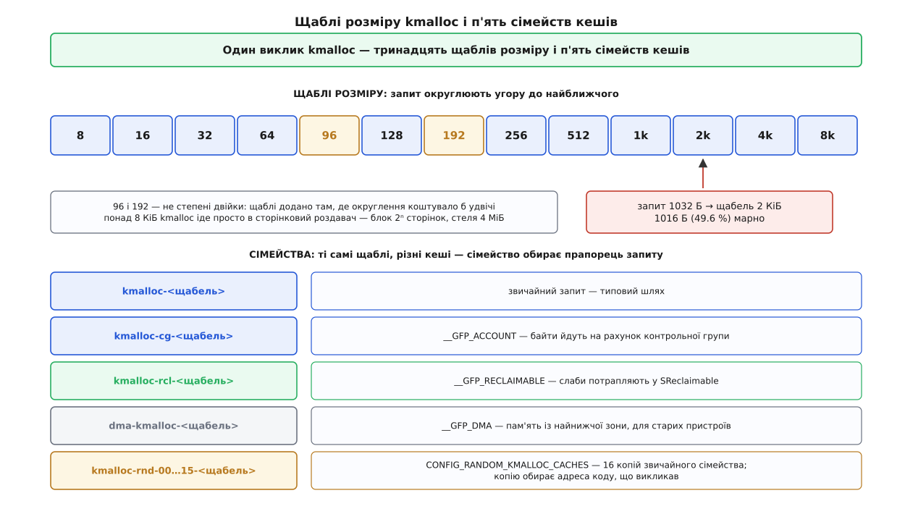

# 📋 Інтерфейси пам'яті ядра: кеші, запити й зменшувачі

Це перелік того, чим у Linux оперують пам'яттю ядра: якою функцією просять байти, яким прапорцем описують контекст запиту, як заводять власний кеш об'єктів, як реєструють зменшувач і в яких файлах потім читають результат. Довідка потрібна тому, що тут ціна помилки в одному прапорці — не повільність, а зупинка машини: запит, який дозволив собі заснути в обробнику переривання, це не витік пам'яті, це заклинена машина.

Усе нижче описує ядро з розподілювачем SLUB — єдиним, що лишився в дереві. Версії ядра вказано там, де інтерфейс змінювався недавно й старі приклади з мережі ще працюють по-старому.

## Точки входу

```c
/* безтипові запити за розміром */
void  *kmalloc(size_t size, gfp_t flags);
void  *kzalloc(size_t size, gfp_t flags);                    /* + __GFP_ZERO */
void  *kmalloc_array(size_t n, size_t size, gfp_t flags);    /* ловить переповнення n·size */
void  *kcalloc(size_t n, size_t size, gfp_t flags);          /* те саме + нуль */
void  *krealloc(const void *p, size_t new_size, gfp_t flags);
void   kfree(const void *object);
void   kfree_sensitive(const void *object);                  /* затерти нулями, тоді звільнити */
size_t kmalloc_size_roundup(size_t size);                    /* скільки насправді дадуть */

/* запити з іменованого кеша */
void  *kmem_cache_alloc(struct kmem_cache *s, gfp_t flags);
void  *kmem_cache_zalloc(struct kmem_cache *s, gfp_t flags);
void   kmem_cache_free(struct kmem_cache *s, void *x);

/* «дай як вийде»: спершу суцільно, при невдачі — розрізнено */
void  *kvmalloc(size_t size, gfp_t flags);
void  *kvmalloc_node(size_t size, gfp_t flags, int node);
void   kvfree(const void *addr);
```

| Виклик | Що дає | Фізично суцільне | Стеля | Контекст |
| --- | --- | --- | --- | --- |
| `kmalloc` | слот із кеша `kmalloc-N`, а понад `KMALLOC_MAX_CACHE_SIZE` — блок сторінок напряму | **так** | `KMALLOC_MAX_SIZE` | будь-який, якщо прапорець дозволяє |
| `kmem_cache_alloc` | слот із **вашого** кеша, розмір фіксований при створенні | **так** | розмір об'єкта кеша | будь-який, якщо прапорець дозволяє |
| `kvmalloc` | спробує `kmalloc` із пом'якшеними умовами, при невдачі відкотиться на `vmalloc` | **не гарантовано** | простір `vmalloc` | лише той, де можна спати |

Три числа, що задають межі:

```
KMALLOC_MIN_SIZE       = 1 << KMALLOC_SHIFT_LOW           = 8 Б
KMALLOC_MAX_CACHE_SIZE = 1 << (PAGE_SHIFT + 1)            = 8 КіБ   (сторінка 4 КіБ)
KMALLOC_MAX_SIZE       = 1 << (MAX_PAGE_ORDER + PAGE_SHIFT) = 4 МіБ (MAX_PAGE_ORDER = 10)
```

Перше може вирости: архітектура задає `ARCH_KMALLOC_MINALIGN`, і якщо він більший за вісім байтів, найдрібніші щаблі просто зникають. Друге — межа, за якою кешів уже немає й `kmalloc` звертається просто до [роздавача фізичних сторінок](topic:unix-linux/physical-page-allocator). Третє — межа самого роздавача.

`kvmalloc` вимагає прапорців, сумісних із `GFP_KERNEL`: відкат на [віртуально суцільну пам'ять](topic:unix-linux/vmalloc-kernel-mappings) означає побудову таблиць сторінок, а це шлях, де можна спати. І `kvfree` теж може заснути, якщо звільняє саме таку ділянку.

> 🔧 **Навіщо це.** `kvmalloc` виглядає безкоштовним компромісом, але одну властивість він забирає мовчки: результат може виявитися не суцільним фізично. Буфер, який колись віддадуть пристрою для [прямого доступу до пам'яті](topic:unix-linux/dma-and-buffers), брати звідти не можна — на невеликих розмірах воно працюватиме роками, бо `kmalloc` майже завжди встигає, а зламається під тиском на завантаженій машині.

## Власний кеш об'єктів

```c
/* єдина форма до 6.12 — працює й далі */
struct kmem_cache *kmem_cache_create(const char *name, unsigned int size,
                                     unsigned int align, slab_flags_t flags,
                                     void (*ctor)(void *));

/* від 6.12 kmem_cache_create() — макрос із _Generic, тож приймає ще й таке */
struct kmem_cache *kmem_cache_create(const char *name, unsigned int object_size,
                                     struct kmem_cache_args *args,
                                     slab_flags_t flags);

void         kmem_cache_destroy(struct kmem_cache *s);
int          kmem_cache_shrink(struct kmem_cache *s);
unsigned int kmem_cache_size(struct kmem_cache *s);

#define KMEM_CACHE(__struct, __flags)   /* ім'я, розмір і вирівнювання — з типу */
```

| Аргумент | Що задає |
| --- | --- |
| `name` | ім'я, під яким кеш видно в `/proc/slabinfo` і `/sys/kernel/slab/`; має бути унікальним |
| `size` · `object_size` | розмір одного об'єкта в байтах |
| `align` | вимога до вирівнювання адреси об'єкта; `0` означає «як вийде» |
| `flags` | прапорці `SLAB_*` з таблиці нижче |
| `ctor` | конструктор, який викликають раз на слот при нарізанні слаба; у сучасному коді майже завжди `NULL` |

Поля `struct kmem_cache_args` — та сама п'ятірка, розкладена по імені, плюс дві пари для окремих потреб:

| Поле | Що задає |
| --- | --- |
| `align` | вирівнювання |
| `ctor` | конструктор |
| `useroffset` · `usersize` | вікно всередині об'єкта, яке дозволено копіювати в простір користувача; решта під захистом `hardened usercopy` |
| `freeptr_offset` · `use_freeptr_offset` | де саме у вільному слоті класти вказівник на наступний вільний — потрібно тим, хто вимагає, щоб частина об'єкта пережила звільнення |

Мінімальний робочий модуль:

```c
struct conn_state {
    struct list_head node;
    spinlock_t       lock;
    u64              id;
    u8               payload[96];
};

static struct kmem_cache *conn_cache;

static int __init conn_init(void)
{
    conn_cache = kmem_cache_create("conn_state", sizeof(struct conn_state),
                                   0, SLAB_HWCACHE_ALIGN | SLAB_ACCOUNT, NULL);
    return conn_cache ? 0 : -ENOMEM;
}

static void __exit conn_exit(void)
{
    kmem_cache_destroy(conn_cache);   /* усі об'єкти мають бути вже звільнені */
}

struct conn_state *conn_get(void)
{
    struct conn_state *c = kmem_cache_alloc(conn_cache, GFP_KERNEL | __GFP_ZERO);

    if (!c)
        return NULL;
    INIT_LIST_HEAD(&c->node);
    spin_lock_init(&c->lock);
    return c;
}
```

`kmem_cache_destroy` із живими об'єктами не мовчить: ядро друкує попередження й **не звільняє** кеш — сторінки лишаються зайнятими до перезавантаження. Це найчастіший спосіб перетворити помилку в [модулі](topic:unix-linux/kernel-modules) на постійний витік.

## Прапорці кеша: SLAB_*

| Прапорець | Що змінює |
| --- | --- |
| `SLAB_HWCACHE_ALIGN` | вирівнює об'єкти на межу рядка кеша процесора; об'єкт при цьому може підрости |
| `SLAB_ACCOUNT` | байти записують на рахунок [контрольної групи](topic:unix-linux/cgroups) того, хто попросив |
| `SLAB_RECLAIM_ACCOUNT` | оголошує об'єкти придатними до звільнення: сторінки кеша йдуть у `SReclaimable`, а самі сторінки беруть із `__GFP_RECLAIMABLE` |
| `SLAB_TEMPORARY` | те саме значення, інше ім'я — «об'єкти короткоживучі» |
| `SLAB_TYPESAFE_BY_RCU` | слаб (не об'єкт!) віддають лише після пільгового періоду [RCU](topic:unix-linux/rcu-read-copy-update); сам слот перевикористовують одразу, тому читач без замка мусить перевіряти, що об'єкт іще той самий |
| `SLAB_CACHE_DMA` · `SLAB_CACHE_DMA32` | брати сторінки з `ZONE_DMA` / `ZONE_DMA32` |
| `SLAB_PANIC` | якщо створити кеш не вдалося — паніка, а не `NULL` |
| `SLAB_NO_MERGE` | заборонити злиття з іншими кешами |
| `SLAB_RED_ZONE` · `SLAB_POISON` · `SLAB_STORE_USER` · `SLAB_CONSISTENCY_CHECKS` | налагоджувальні: сторожові смуги, отруєння звільненого, запам'ятовування адреси того, хто виділив і звільнив, дорогі перевірки на кожній операції |
| `SLAB_TRACE` | друкувати кожне виділення й звільнення з цього кеша |
| `SLAB_NOLEAKTRACE` · `SLAB_SKIP_KFENCE` · `SLAB_NO_USER_FLAGS` · `SLAB_FAILSLAB` | вивести кеш із-під `kmemleak`, `KFENCE`, налагоджувальних прапорців із командного рядка, увімкнути навмисне вкидання відмов |

**Злиття — головна пастка цього переліку.** Якщо збірку не зібрано з `CONFIG_SLAB_MERGE_DEFAULT=n`, ядро зливає кеші зі сумісним розміром, вирівнюванням і набором прапорців в один: `kmem_cache_create` просто повертає вже наявний кеш, збільшивши лічильник посилань. Наслідки видно неозброєним оком:

- у `/proc/slabinfo` **вашого імені може не бути взагалі** — його з'їв кеш, створений раніше;
- у `/sys/kernel/slab/` спільний каталог має службове ім'я, що починається з двокрапки, а всі справжні імена — символьні посилання на нього; скільки їх, каже файл `aliases`;
- об'єкти різних підсистем лежать упереміш в одному слабі, що зручно для нападника й незручно для того, хто шукає витік.

Вимкнути на час розбору: параметр завантаження `slab_nomerge` (див. [командний рядок ядра](topic:unix-linux/bootloader-and-cmdline)). Наявність `SLAB_ACCOUNT`, `SLAB_RECLAIM_ACCOUNT` чи конструктора вже сама по собі звужує коло кандидатів на злиття, а `SLAB_NO_MERGE` закриває його остаточно.

Налагоджувальні прапорці зручніше вмикати не в коді, а з командного рядка: `slub_debug=FZPU` вмикає перевірки для всіх кешів, `slub_debug=U,conn_state` — лише для одного.

## Готові кеші kmalloc



*Ім'я кеша в `/proc/slabinfo` читається однозначно: префікс каже, який прапорець спрацював, суфікс — на який щабель округлили.*

Щаблі за зростанням: **8, 16, 32, 64, 96, 128, 192, 256, 512, 1k, 2k, 4k, 8k**. Два з них — 96 і 192 — навмисно вибиваються зі степенів двійки: розміри трохи за 64 і трохи за 128 трапляються особливо часто, і без цих щаблів вони округлювалися б удвічі дорожче. На архітектурах із великим `ARCH_KMALLOC_MINALIGN` ці два щаблі зникають разом із найдрібнішими.

| Сімейство | Що його вмикає | Куди потрапляє в обліку |
| --- | --- | --- |
| `kmalloc-<N>` | звичайний запит | `SUnreclaim` |
| `kmalloc-cg-<N>` | `__GFP_ACCOUNT` (або `GFP_KERNEL_ACCOUNT`) | `SUnreclaim` + рахунок групи |
| `kmalloc-rcl-<N>` | `__GFP_RECLAIMABLE` | `SReclaimable` |
| `dma-kmalloc-<N>` | `__GFP_DMA` | `SUnreclaim` |
| `kmalloc-rnd-<00…15>-<N>` | `CONFIG_RANDOM_KMALLOC_CACHES` | `SUnreclaim` |

Останнє сімейство — захисне. Увімкнена опція створює **шістнадцять** копій звичайного набору, і `kmalloc` вибирає копію за адресою коду, що викликав. Мета — щоб об'єкти різних підсистем не сусідили в одному слабі, і нападник не міг передбачувано покласти свій буфер поруч із вразливою структурою. Плата — помірна перевитрата пам'яті й процесора.

**Умова.** Структура на 1032 байти проти тієї самої, ужатої в 1024.

```
1032 Б → щабель 2048 Б:   марно 2048 − 1032 = 1016 Б   = 49.6 %
1024 Б → щабель 1024 Б:   марно 1024 − 1024 =    0 Б   =  0.0 %

на мільйон об'єктів різниця = 1000000 × 1016 Б ≈ 969 МіБ
```

Вісім байтів у структурі коштують гігабайт на живій машині — саме тому в ядрі так уперто рахують поля. Дізнатися розмір щабля наперед, не гадаючи, дає `kmalloc_size_roundup(size)`: він повертає те число, яке `kmalloc` справді виділить, і масив можна одразу планувати під нього.

## Прапорці запиту: GFP

Прапорець `gfp_t` описує не пам'ять, а **контекст**: що роздавачеві дозволено робити, поки він шукає вільне місце.

| Маска | Спати | Прямий відбір | Ввід-вивід | Файлова система | Аварійні запаси |
| --- | --- | --- | --- | --- | --- |
| `GFP_KERNEL` | так | так | так | так | ні |
| `GFP_USER` | так | так | так | так | ні |
| `GFP_NOFS` | так | так | так | **ні** | ні |
| `GFP_NOIO` | так | так | **ні** | **ні** | ні |
| `GFP_NOWAIT` | **ні** | **ні** | ні | ні | ні |
| `GFP_ATOMIC` | **ні** | **ні** | ні | ні | **так** |

Складено їх із дрібніших прапорців так:

```
__GFP_RECLAIM      = __GFP_DIRECT_RECLAIM | __GFP_KSWAPD_RECLAIM

GFP_KERNEL         = __GFP_RECLAIM | __GFP_IO | __GFP_FS
GFP_KERNEL_ACCOUNT = GFP_KERNEL | __GFP_ACCOUNT
GFP_USER           = __GFP_RECLAIM | __GFP_IO | __GFP_FS | __GFP_HARDWALL
GFP_NOFS           = __GFP_RECLAIM | __GFP_IO
GFP_NOIO           = __GFP_RECLAIM
GFP_NOWAIT         = __GFP_KSWAPD_RECLAIM | __GFP_NOWARN
GFP_ATOMIC         = __GFP_HIGH | __GFP_KSWAPD_RECLAIM
GFP_DMA            = __GFP_DMA
GFP_DMA32          = __GFP_DMA32
```

Звідси видно те, що з імен не читається. `GFP_NOWAIT` і `GFP_ATOMIC` **однаково** не мають права спати: жоден із них не містить `__GFP_DIRECT_RECLAIM`. Різниця між ними одна — `__GFP_HIGH`, тобто доступ до аварійного запасу. Тому документація ядра каже прямо: в [атомарному контексті](topic:unix-linux/kernel-locking) типовий вибір — `GFP_NOWAIT`, а `GFP_ATOMIC` беруть лише тоді, коли витрата запасу справді виправдана й невдача зупинить систему. Обидва повертають `NULL` частіше за `GFP_KERNEL`, і перевіряти результат обов'язково.

Друга неочевидність — `GFP_NOIO` суворіший за `GFP_NOFS`, хоч за іменем здається навпаки: заборона на ввід-вивід автоматично забороняє й файлову систему.

Модифікатори, що додаються до маски через `|`:

| Модифікатор | Дія |
| --- | --- |
| `__GFP_ZERO` | віддати пам'ять уже занулену |
| `__GFP_ACCOUNT` | записати байти на рахунок контрольної групи (веде в `kmalloc-cg-N`) |
| `__GFP_RECLAIMABLE` | оголосити вміст відтворюваним (веде в `kmalloc-rcl-N`) |
| `__GFP_NOWARN` | не друкувати попередження при невдачі |
| `__GFP_NORETRY` | одна легка спроба, далі здатися |
| `__GFP_RETRY_MAYFAIL` | старатися довше, але не доводити до вбивці за браком пам'яті |
| `__GFP_NOFAIL` | не мати права відмовити: крутитися нескінченно, доки пам'ять не з'явиться |
| `__GFP_HIGH` | пустити в аварійний запас |
| `__GFP_MEMALLOC` | пустити в **увесь** запас; лише для тих, хто цією пам'яттю пам'ять і звільнить |
| `__GFP_THISNODE` | лише з названого вузла, без переходу на сусідній |

Замість того щоб тягнути `GFP_NOFS` через десяток рівнів викликів, сучасний код позначає **ділянку**:

```c
unsigned int flags = memalloc_nofs_save();
/* усе, що виділяється звідси й глибше, автоматично втрачає __GFP_FS */
memalloc_nofs_restore(flags);

unsigned int flags = memalloc_noio_save();
/* те саме для вводу-виводу */
memalloc_noio_restore(flags);
```

Причина саме така: прапорець у виклику вкриває лише сам виклик, а не бібліотечний код, який той викликає далі. Документація ядра рекомендує парний варіант і залишає `GFP_NOFS` у виклику як спадщину.

## Реєстрація зменшувача

**Від 6.7** структуру `struct shrinker` виділяє саме ядро, а не викликач: так відбір може ходити переліком зменшувачів без замка, під RCU, і при знятті реєстрації нікого не чекати посеред гарячого шляху.

```c
struct shrinker *shrinker_alloc(unsigned int flags, const char *fmt, ...);
void             shrinker_register(struct shrinker *shrinker);
void             shrinker_free(struct shrinker *shrinker);
```

| Прапорець `shrinker_alloc` | Що вмикає |
| --- | --- |
| `SHRINKER_NUMA_AWARE` | зменшувач розрізняє вузли пам'яті й отримує `sc->nid` |
| `SHRINKER_MEMCG_AWARE` | розрізняє контрольні групи й отримує `sc->memcg` |
| `SHRINKER_NONSLAB` | об'єкти не слабові (наприклад, великі сторінки, що чекають розділення) |

Поля, які викликач заповнює **між** `shrinker_alloc` і `shrinker_register`:

| Поле | Зміст |
| --- | --- |
| `count_objects` | «скільки об'єктів ти міг би зараз звільнити» |
| `scan_objects` | «звільни приблизно стільки; скажи, скільки звільнив» |
| `seeks` | ціна відтворення одного об'єкта в умовних пошуках на диску; `DEFAULT_SEEKS` = 2 |
| `batch` | мінімальна порція для одного заходу; `0` означає типову — 128 |
| `private_data` | що завгодно ваше, зазвичай вказівник на `struct list_lru` |

`struct shrink_control` — те, що зменшувач отримує на вході:

| Поле | Зміст |
| --- | --- |
| `gfp_mask` | прапорці того виділення, яке спричинило відбір: саме тут читають, чи можна чіпати файлову систему |
| `nid` | вузол пам'яті, якому бракує (`SHRINKER_NUMA_AWARE`) |
| `memcg` | група, у межах якої тиснуть (`SHRINKER_MEMCG_AWARE`) |
| `nr_to_scan` | скільки об'єктів просять переглянути цього разу |
| `nr_scanned` | скільки переглянуто — заповнює зменшувач |

Особливі значення повернення:

| Значення | Хто повертає | Що означає |
| --- | --- | --- |
| `SHRINK_EMPTY` (`~0UL − 1`) | `count_objects` | «зараз порожньо» — кеш живий, просто нічого немає; для групових зменшувачів це не те саме, що `0` |
| `0` | `count_objects` | «мене можна не питати»; `scan_objects` не викличуть узагалі |
| `SHRINK_STOP` (`~0UL`) | `scan_objects` | «у цьому контексті нічого зробити не можу»: недоотримане не пропадає, а відкладається на наступний захід |
| число | `scan_objects` | скільки об'єктів звільнено насправді |

Робочий кістяк:

```c
static struct list_lru  conn_lru;
static struct shrinker *conn_shrinker;

static unsigned long conn_count(struct shrinker *sh, struct shrink_control *sc)
{
    unsigned long n = list_lru_shrink_count(&conn_lru, sc);

    return n ? n : SHRINK_EMPTY;
}

static enum lru_status conn_isolate(struct list_head *item,
                                    struct list_lru_one *lru,
                                    spinlock_t *lock, void *arg)
{
    struct conn_state *c = container_of(item, struct conn_state, node);
    struct list_head *freeable = arg;

    if (!spin_trylock(&c->lock))
        return LRU_SKIP;               /* зайнято — не чекаємо, беремо наступний */
    list_lru_isolate_move(lru, item, freeable);
    spin_unlock(&c->lock);
    return LRU_REMOVED;
}

static unsigned long conn_scan(struct shrinker *sh, struct shrink_control *sc)
{
    struct conn_state *c, *tmp;
    LIST_HEAD(freeable);
    unsigned long freed;

    if (!(sc->gfp_mask & __GFP_FS))
        return SHRINK_STOP;            /* нас покликала сама файлова система */

    freed = list_lru_shrink_walk(&conn_lru, sc, conn_isolate, &freeable);

    list_for_each_entry_safe(c, tmp, &freeable, node) {
        list_del(&c->node);
        kmem_cache_free(conn_cache, c);
    }
    return freed;
}

static int conn_shrinker_init(void)
{
    conn_shrinker = shrinker_alloc(SHRINKER_NUMA_AWARE | SHRINKER_MEMCG_AWARE,
                                   "conn-state");
    if (!conn_shrinker)
        return -ENOMEM;

    if (list_lru_init_memcg(&conn_lru, conn_shrinker)) {
        shrinker_free(conn_shrinker);  /* до реєстрації — просто звільнити */
        return -ENOMEM;
    }

    conn_shrinker->count_objects = conn_count;
    conn_shrinker->scan_objects  = conn_scan;
    conn_shrinker->seeks         = DEFAULT_SEEKS;
    conn_shrinker->private_data  = &conn_lru;

    shrinker_register(conn_shrinker);
    return 0;
}
```

Порядок тут не декоративний: `list_lru_init_memcg` потребує вже виділеного зменшувача, бо бере з нього ідентифікатор, а `shrinker_register` має бути **після** того, як заповнено зворотні виклики — інакше відбір покличе порожні вказівники. Знімають реєстрацію тим самим `shrinker_free`.

**До 6.7** інтерфейс був іншим: структуру тримав викликач (зазвичай статично, всередині своєї), а функції звалися `register_shrinker` / `unregister_shrinker`, з окремою парою `prealloc_shrinker` + `register_shrinker_prepared` для тих, кому треба було розвести виділення й реєстрацію в часі. Приклади з мережі старші за 6.7 не зберуться дослівно.

## list_lru: списки по вузлах і групах

Просте `struct list_head` для зменшувача не годиться: відбір питає «скільки в тебе на **цьому вузлі** й у **цій групі**», а плаский список такого не знає. `list_lru` — це двовимірна сітка списків, окремий на кожну пару «вузол × група», прихована за звичайним інтерфейсом. Причина, чому вузли рахують окремо, — у [нерівномірному доступі до пам'яті](topic:programming/numa): звільнене на чужому вузлі не допомагає тому, кому бракує.

```c
#define list_lru_init(lru)                 __list_lru_init((lru), false, NULL, NULL)
#define list_lru_init_memcg(lru, shrinker) __list_lru_init((lru), true,  NULL, shrinker)
void list_lru_destroy(struct list_lru *lru);

bool list_lru_add_obj(struct list_lru *lru, struct list_head *item);
bool list_lru_del_obj(struct list_lru *lru, struct list_head *item);

unsigned long list_lru_count_one(struct list_lru *lru, int nid, struct mem_cgroup *memcg);
unsigned long list_lru_count_node(struct list_lru *lru, int nid);
unsigned long list_lru_shrink_count(struct list_lru *lru, struct shrink_control *sc);
unsigned long list_lru_shrink_walk(struct list_lru *lru, struct shrink_control *sc,
                                   list_lru_walk_cb isolate, void *cb_arg);

typedef enum lru_status (*list_lru_walk_cb)(struct list_head *item,
                                            struct list_lru_one *list,
                                            spinlock_t *lock, void *cb_arg);
```

Пари `list_lru_shrink_count` / `list_lru_shrink_walk` вистачає на весь звичайний зменшувач: вони самі дістають `nid` і `memcg` зі `shrink_control`.

| Повернення `isolate` | Що робить обхід |
| --- | --- |
| `LRU_REMOVED` | об'єкт знято зі списку — лічильник зменшено |
| `LRU_REMOVED_RETRY` | знято, але замок відпускали й брали знову |
| `LRU_ROTATE` | до об'єкта нещодавно зверталися: у хвіст, дати ще один шанс |
| `LRU_SKIP` | не вдалося взяти замок — пропустити, не чекаючи |
| `LRU_RETRY` | звільнити не можна; замок могли відпустити всередині, повернути взятим |
| `LRU_STOP` | припинити обхід узагалі |

Усередині `isolate` викликають `list_lru_isolate(list, item)` або `list_lru_isolate_move(list, item, head)` — перше просто знімає, друге переносить у ваш тимчасовий список, який ви обробите вже поза замком. Підпис зворотного виклику — одне з місць, що змінювалося разом із переходом на нову реєстрацію; перед складанням модуля звіряйте його з тим ядром, під яке збираєте.

## Що читати: /proc/slabinfo

```
slabinfo - version: 2.1
# name            <active_objs> <num_objs> <objsize> <objperslab> <pagesperslab> : tunables <limit> <batchcount> <sharedfactor> : slabdata <active_slabs> <num_slabs> <sharedavail>
dentry              411642  411642    192   21    1 : tunables    0    0    0 : slabdata  19602  19602      0
ext4_inode_cache    190455  190472   1096   29    8 : tunables    0    0    0 : slabdata   6568   6568      0
```

| Стовпець | Зміст |
| --- | --- |
| `active_objs` | об'єктів зайнято |
| `num_objs` | об'єктів усього — і зайнятих, і вільних |
| `objsize` | розмір одного об'єкта в байтах, уже з вирівнюванням |
| `objperslab` | скільки об'єктів вміщається в один слаб |
| `pagesperslab` | зі скількох сторінок складається слаб |
| `tunables` · `sharedavail` | під SLUB завжди нулі: налаштовувати нема чого, файл не приймає запису |
| `active_slabs` · `num_slabs` | слабів у роботі та всього |

Файл читає лише суперкористувач. Числа під SLUB наближені: об'єкти в активних слабах процесорів рахуються зайнятими, навіть якщо в тих слабах є вільні слоти.

**Умова.** Рядок `ext4_inode_cache` з прикладу вище; сторінка 4096 байтів.

```
слаб              = 8 × 4096              = 32768 Б
корисне у слабі   = 29 × 1096             = 31784 Б
хвіст             = 32768 − 31784         =   984 Б   = 3.0 %

усього зайнято    = 6568 × 32768          ≈ 205.2 МіБ
з них корисне     = 190472 × 1096         ≈ 199.1 МіБ
з них хвости      = 6568 × 984            ≈   6.2 МіБ
```

Головне, що дає ця арифметика: **зайняте — це `num_slabs × pagesperslab × 4096`, а не `num_objs × objsize`**. Панелі моніторингу, що множать друге, недораховують і хвости, і повністю порожні слоти в майже вільних слабах.

`slabtop` показує ті самі числа, відсортовані й перераховані: стовпці `OBJS`, `ACTIVE`, `USE` (відсоток зайнятих), `OBJ SIZE`, `SLABS`, `OBJ/SLAB`, `CACHE SIZE`, `NAME`. Ключ `-s c` сортує за розміром кеша, `-s a` — за активними об'єктами, `-o` друкує один знімок і виходить.

## Що читати: підсумки по машині

```
$ grep -E '^(Slab|SReclaimable|SUnreclaim|KernelStack|PageTables|Percpu)' /proc/meminfo
Slab:            1258432 kB
SReclaimable:    1041920 kB
SUnreclaim:       216512 kB
KernelStack:       18432 kB
PageTables:        94208 kB
Percpu:            12288 kB
```

| Рядок | Зміст |
| --- | --- |
| `Slab` | усе, що займають слаби; **точно** `SReclaimable + SUnreclaim` |
| `SReclaimable` | кеші з `SLAB_RECLAIM_ACCOUNT` плюс `kmalloc-rcl-N` — те, що зменшувачі можуть віддати на прохання |
| `SUnreclaim` | живі об'єкти; не віддадуться, скільки не проси |
| `KernelStack` · `PageTables` · `Percpu` | пам'ять ядра **поза** слабами — у `Slab` їх немає |

Останній рядок таблиці — те, чого найчастіше не помічають: `Slab` не є повним обліком пам'яті ядра. Стеки задач, таблиці сторінок і подушки на процесор мають власні рядки, а ділянки `vmalloc` не мають узагалі. Про решту способів рахувати ту саму пам'ять — [як міряти пам'ять](topic:unix-linux/memory-accounting).

У `/proc/vmstat` ті самі два числа лежать як `nr_slab_reclaimable` і `nr_slab_unreclaimable`, у сторінках. У [контрольних групах](topic:unix-linux/cgroups) другого покоління `memory.stat` дає `slab`, `slab_reclaimable` і `slab_unreclaimable` у байтах — але лише для кешів із `SLAB_ACCOUNT` і виділень із `__GFP_ACCOUNT`; решта пам'яті ядра нічия й у групу не потрапляє.

## Що читати: окремий кеш

```
$ cd /sys/kernel/slab/dentry
$ cat object_size objs_per_slab order aliases
192
21
0
6
$ echo 1 > shrink          # спробувати зібрати часткові слаби й віддати порожні
```

| Файл | Зміст |
| --- | --- |
| `object_size` | розмір об'єкта без службових полів |
| `slab_size` | розмір із вирівнюванням і налагоджувальними полями |
| `objs_per_slab` · `order` | скільки об'єктів у слабі й порядок блоку сторінок під нього |
| `slabs` · `partial` · `cpu_slabs` | скільки слабів усього, скільки часткових, скільки тримають процесори |
| `objects` · `total_objects` | зайнятих і всього, з розкладкою за вузлами |
| `aliases` | скільки кешів злилося в цей |
| `shrink` | запис `1` викликає `kmem_cache_shrink` саме для нього |
| `reclaim_account` · `destroy_by_rcu` · `cache_dma` · `hwcache_align` | які прапорці стоять на кеші |
| `red_zone` · `poison` · `store_user` · `validate` | стан налагоджувальних засобів; запис у `validate` змушує обійти всі об'єкти й перевірити службові поля |
| `alloc_calls` · `free_calls` | місця в коді, звідки виділяли й звільняли — доступні лише при `store_user` |
| `min_partial` · `cpu_partial` | скільки порожніх і часткових слабів дозволено притримувати про запас |

Пара `alloc_calls` + `slub_debug=U,<ім'я>` — найкоротший шлях від «росте `SUnreclaim`» до імені функції, що тече.

## Що читати: окремий зменшувач

Каталог `/sys/kernel/debug/shrinker` (потрібні `CONFIG_SHRINKER_DEBUG` і змонтований [debugfs](topic:unix-linux/pseudo-filesystems)) дає по каталогу на кожен зареєстрований зменшувач; ім'я складається з імені зменшувача та унікального номера — `kfree_rcu-0`, `sb-ext4:nvme0n1p2-28`.

```
$ cat /sys/kernel/debug/shrinker/sb-ext4:nvme0n1p2-28/count
1 128054 0
2843 11290 0

$ echo "2843 0 500" > /sys/kernel/debug/shrinker/sb-ext4:nvme0n1p2-28/scan
```

- рядок `count`: `<номер inode групи> <об'єктів на вузлі 0> <на вузлі 1> …`; рядки з самими нулями пропускають, `1` — коренева група;
- запис у `scan`: `<номер inode групи> <номер вузла> <скільки об'єктів переглянути>`;
- для зменшувачів без підтримки груп чи вузлів у відповідних полях стоїть `0`.

Цінність цих двох файлів у тому, що вони єдині дають **адресний** запит: спитати один зменшувач однієї групи на одному вузлі й побачити, скільки він насправді віддасть. Усе інше в цьому переліку діє по всій машині одразу.

## Ручки

| Ручка | Значення | Дія |
| --- | --- | --- |
| `vm.vfs_cache_pressure` | типово `100` | множник тиску **саме** на кеші записів каталогів та inode: `0` — не забирати їх ніколи (прямий шлях до браку пам'яті), нижче `100` — берегти, вище — худнути охочіше; сильно вище `100` шкодить, бо змушує брати замки намарне |
| `vm.drop_caches` | `1` · `2` · `3` | `1` — викинути чистий сторінковий кеш, `2` — придатні до звільнення слабові об'єкти (записи каталогів та inode), `3` — обидва |

```
sync                                 # без цього брудні об'єкти лишаться
echo 2 > /proc/sys/vm/drop_caches    # лише слаб
echo 3 > /proc/sys/vm/drop_caches    # слаб і сторінковий кеш
```

`drop_caches` не руйнівний і не постійний: він не звільняє брудних об'єктів, значення не запам'ятовується, а вплив закінчується разом із записом. Документація ядра прямо радить не вживати його поза випробуваннями й налагодженням — після скидання система хвилинами перечитує з диска те, що щойно мала.

## Питання → де відповідь

| Питання | Джерело |
| --- | --- |
| скільки всього займають слаби | `/proc/meminfo`: `Slab` |
| скільки з того віддадуть на прохання | `/proc/meminfo`: `SReclaimable` проти `SUnreclaim` |
| який саме кеш росте | `/proc/slabinfo`, `slabtop -s c` |
| скільки на цьому кеші марнується | `num_slabs × pagesperslab × 4096` мінус `num_objs × objsize` |
| чому мого кеша немає у списку | він злився з чужим; `slab_nomerge`, `aliases` |
| хто саме виділив ці об'єкти | `slub_debug=U,<ім'я>` і далі `/sys/kernel/slab/<ім'я>/alloc_calls` |
| скільки віддасть конкретний зменшувач | `/sys/kernel/debug/shrinker/<ім'я>/count` |
| чи справді ця пам'ять забиральна | `echo 2 > /proc/sys/vm/drop_caches` після `sync` |
| скільки пам'яті ядра з'їв контейнер | `memory.stat`: `slab`, `slab_reclaimable`, `slab_unreclaimable` |
