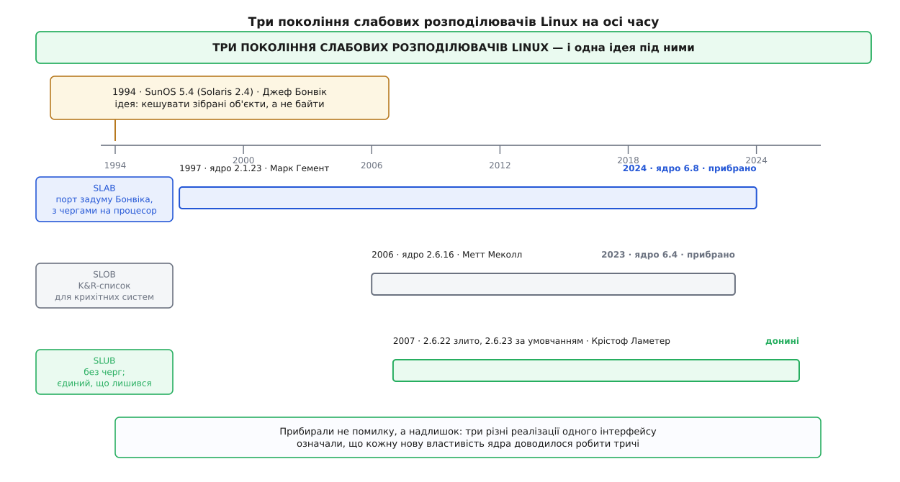

# 📜 Історія слаба: від Solaris до єдиного розподілювача Linux

Думку «кешувати не байти, а зібрані об'єкти» вигадали не в Linux: її сформулював Джеф Бонвік у Sun Microsystems 1994 року, і поки вона дійшла до сьогоднішнього Linux, у ньому змінилося три різні реалізації — дві з яких довелося прибрати руками.

## Чим не влаштовував розподілювач кінця вісімдесятих

Ядра тієї доби роздавали пам'ять приблизно так само, як її роздають у програмах: [загальний розподілювач за розмірами](topic:programming/memory-allocator-internals) — набір кошиків зі степенями двійки, округлення запиту вгору, службовий заголовок біля кожного шматка. Механізм працював, але кожна його властивість оберталася втратою саме тоді, коли просити почали часто й дрібно.

Округлення до степеня двійки марнує пам'ять тим більше, чим менш вдало розмір структури лягає в кошик. Заголовок біля кожного шматка — це кілька байтів на об'єкт, а об'єктів мільйони. Але найдорожче коштувало те, чого в такому розподілювачі немає взагалі: **знання про тип**. Розподілювачеві однаково, що саме він видає, тож він видає сирі байти, і кожен, хто їх узяв, мусить зібрати з них об'єкт наново — ініціалізувати замок, зв'язати голови списків, виставити лічильники. Ця робота повторюється при кожному створенні, хоча її результат після звільнення об'єкта нікуди не дівається: справний замок лишається справним замком, порожній список — порожнім списком.

## Що саме було новим

Нарізання суцільного блоку на однакові слоти з переліком вільних місць усередині них новиною не було: пули фіксованого розміру існували задовго до 1994 року — від «зон» у ядрі Mach до найпростіших списків вільних елементів у будь-якій системній програмі. Новим у праці Бонвіка було інше, і це «інше» видно вже з назви: **об'єктно-кешувальний** розподілювач.

Кеш прив'язано до типу, а тип має конструктор і деструктор. Слот віддають користувачеві **уже зібраним**: конструктор пробігає по об'єкту один раз при нарізанні слаба, а не при кожному виділенні. Звільнення тоді означає не «зруйнувати», а «повернути в пул у придатному стані». Деструктор кличуть лише тоді, коли слаб цілком віддають назад [роздавачеві сторінок](topic:unix-linux/physical-page-allocator). Із цього випливають три наслідки, які й зробили ідею живучою: зникає повторна ініціалізація, зникає окремий заголовок при кожному шматку (розмір і тип знає кеш), і з'являється те, чого раніше не було в жодному ядрі, — **облік у розрізі типів**: скільки в системі записів каталогів, скільки inode-ів, скільки буферів сокетів, кожен зі своїм іменем і своїм лічильником.

Була в тій праці й четверта річ, менш відома. Слаби одного кеша не однакові: кожен наступний зсуває свої об'єкти на невеликий крок відносно початку блоку.

```
зсув k-го слаба = (k mod кількість_кольорів) × крок_вирівнювання
крок_вирівнювання — розмір рядка кеша процесора (типово 64 Б)
```

Без цього зсуву перші поля всіх об'єктів у всіх слабах лягають на однакову відстань від початку сторінки, а отже, змагаються за ті самі набори в кеші процесора. Зсув — його назвали «розфарбовуванням» слабів — розкидає їх по різних наборах задарма: він займає той самий залишок, який усе одно пропадав би в хвості слаба.

## Ідея, реалізація, версія

Ці три речі варто розрізняти, бо саме на їхньому змішуванні тримається більшість плутанини в переказах.

**Ідея** — кешування зібраних об'єктів разом зі словом «слаб» (англ. *slab* — «плита, брус») — належить Джефові Бонвіку. **Реалізація** — розподілювач пам'яті ядра SunOS 5.x. **Версія**, у якій він поїхав до користувачів, — SunOS 5.4, вона ж Solaris 2.4. Праця «The Slab Allocator: An Object-Caching Kernel Memory Allocator» прозвучала на літній технічній конференції USENIX 1994 року — тобто описувала не задум, а систему, що вже працювала: це важливо, бо в ній наведено виміри, а не сподівання.

Чому саме тоді? Бо саме тоді збіглися дві обставини. Solaris 2.x був для Sun великим переписуванням ядра під багатопроцесорність, а багато процесорів означає багато замків, а замки живуть в об'єктах, які хтось мусить створювати. І друга: пам'ять машин перевалила за сотні мегабайтів, тож кількість об'єктів ядра — кешованих імен, inode-ів, мережевих буферів — почала рахуватися мільйонами. Робота, яка при тисячі створень непомітна, при мільйоні стає рядком у профілі.

## Дорога в Linux

У Linux слабовий розподілювач приніс не Бонвік і не Sun. Його написав **Марк Гемент** у 1996–97 роках, і заголовок файла `mm/slab.c` усі наступні двадцять сім років чесно називав обидва джерела задуму: книжку Уреша Вахалії «UNIX Internals: The New Frontiers» і працю Бонвіка з USENIX 1994. Тобто це був порт **ідеї**, а не коду. У ядро він увійшов у версії 2.1.23.

Далі його довго добудовували. Манфред Шпрауль коло 2000 року додав масиви на кожен процесор — ті самі черги готових об'єктів, які знімають замок із гарячого шляху. 2005 року з'явилися окремі списки слабів на кожен вузол пам'яті — робота Шая Фултгайма, Шобгіта Даяла, Алока Катарії та Крістофа Ламетера; без цього на машині з [нерівномірним доступом до пам'яті](topic:programming/numa) об'єкт легко діставався з чужого вузла, а це десятки зайвих наносекунд на кожне звертання до нього все подальше життя.



*Ідея одна, реалізацій було три — і кожна з'явилася як відповідь на цілком конкретну ваду попередньої.*

## SLOB: не слаб, а список

2006 року, у версії 2.6.16, Метт Меколл додав те, що всупереч назві слабовим розподілювачем не було зовсім. SLOB (Simple List Of Blocks) — це традиційний алокатор у дусі K&R, звичайний список блоків, поверх якого начеплено тонкий шар, що вдає інтерфейс кешів об'єктів. Сенс був єдиний і чесно названий у самому патчі: **обсяг**. Коду в рази менше, службової пам'яті майже немає — на крихітній системі, де рахунок іде на сотні кілобайтів, це відчутно. Ціна теж названа одразу: погана масштабованість і сильніша фрагментація, «тільки для малих систем».

Тож із 2006 року в дереві жили дві реалізації одного інтерфейсу. За рік їх стало три.

## SLUB: черги були відповіддю на замок, але стали своєю проблемою

Заперечення Крістофа Ламетера навесні 2007 року стосувалося саме черг — тієї самої вигадки, яка колись прибрала замок із гарячого шляху. Черга є на кожну пару «кеш × процесор», а на машині з багатьма вузлами ще й на кожен вузол; помножте кількасот кешів на кількадесят процесорів — і побачите, скільки об'єктів осідає по чергах, не належачи нікому: вони не зайняті, але й не вільні. Додайте до цього, що складність черг доводиться враховувати в кожній діагностичній надбудові.

SLUB прибрав черги й переніс облік у службову структуру самої сторінки, а голову списку вільних слотів поклав усередину об'єктів. У дерево його злили у версії 2.6.22, а розподілювачем за умовчанням він став у 2.6.23 восени 2007 року. Обіцяно було менше кешів у системі, менше фрагментації й кілька відсотків швидкості; головним же виявилося те, про що в анонсі майже не йшлося, — простота, з якою до нього прикручується діагностика.

## Чому три стали тягарем

Далі почалася повільна арифметика супроводу, і вона неприємна. Кожна наскрізна властивість, яку ядро додавало до пам'яті, стосується всіх трьох розподілювачів одразу: облік пам'яті ядра за [контрольними групами](topic:unix-linux/cgroups), санітар звертань до пам'яті, перевірки копіювання між ядром і користувачем, перемішування списку вільних слотів проти передбачуваності адрес. Кожну з них треба було зробити тричі — а в SLOB часто не можна було зробити взагалі, бо він не тримав потрібного обліку. Через це в самому інтерфейсі ядра роками жили обмеження, потрібні лише через найслабшого з трьох: наприклад, звільнити функцією `kfree` об'єкт, узятий із іменованого кеша, було не можна — і саме це дозволили одразу після усунення SLOB.

Прибирали в два заходи, обидва — руками Властимила Бабки. **SLOB** пішов у версії 6.4 (2023), і в тому самому наборі змін `kfree` навчився працювати з об'єктами іменованих кешів. **SLAB** — той самий, що вів родовід від Марка Гемента й Бонвіка, — пішов у версії 6.8 (2024). Лишився один розподілювач, і про нього більше не треба питати «а який у вас зібрано».

Варто назвати це своїм ім'ям: прибрали не помилку. SLAB працював і був правильний; SLOB робив рівно те, для чого його писали. Прибрали **надлишок вибору**, за який платили не ті, хто його зробив, а кожен, хто потім додавав до пам'яті ядра будь-що нове.

## Що з ідеї Бонвіка лишилося — і що повернулося

Із двох половин початкового задуму Linux зберіг переважно другу. Явні конструктори майже вийшли з ужитку: виявилося, що ініціалізувати об'єкт наново дешевше, ніж стежити, щоб звільнений слот лишався в чистому стані. А от друга вигода — та, що свіжозвільнений слот ще лежить у кеші процесора, — нікуди не поділася й на сучасному залізі важить більше за першу.

Найцікавіше сталося з чергами. Їх прибрали 2007 року як зайвий тягар, а в теперішньому ядрі вони повернулися — під іншою назвою («снопи»), із запасником на кожен вузол пам'яті, звідки процесор бере повний сніп замість порожнього. Але повернулися вони на принципово інших умовах: не як влаштування розподілювача загалом, а як **властивість окремого кеша**, яку його власник вмикає явно й лише там, де вимірами показано вигоду. Суперечка, отже, ніколи не була про те, черги це добре чи погано. Вона була про те, хто за них платить — і скільки коштує вибір, зроблений раз і за всіх.
