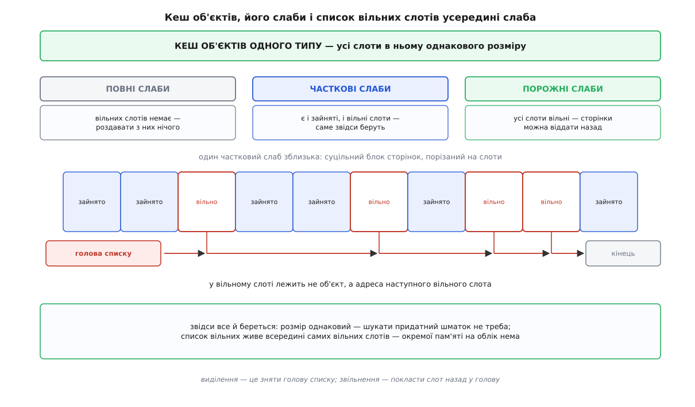
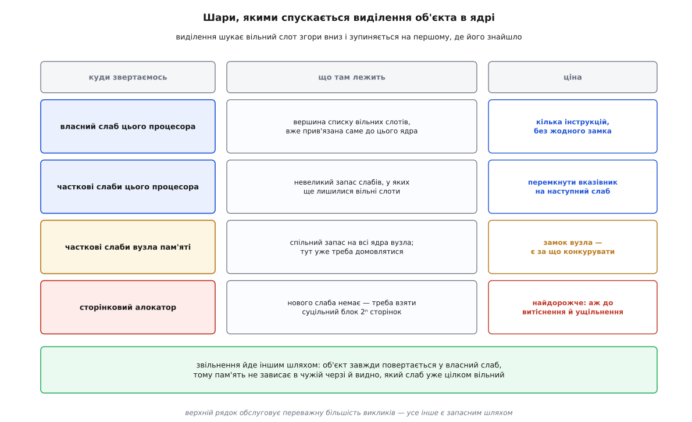
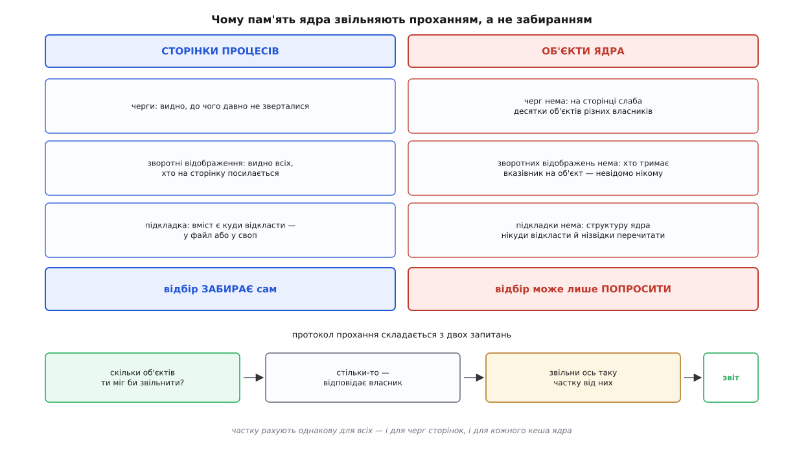
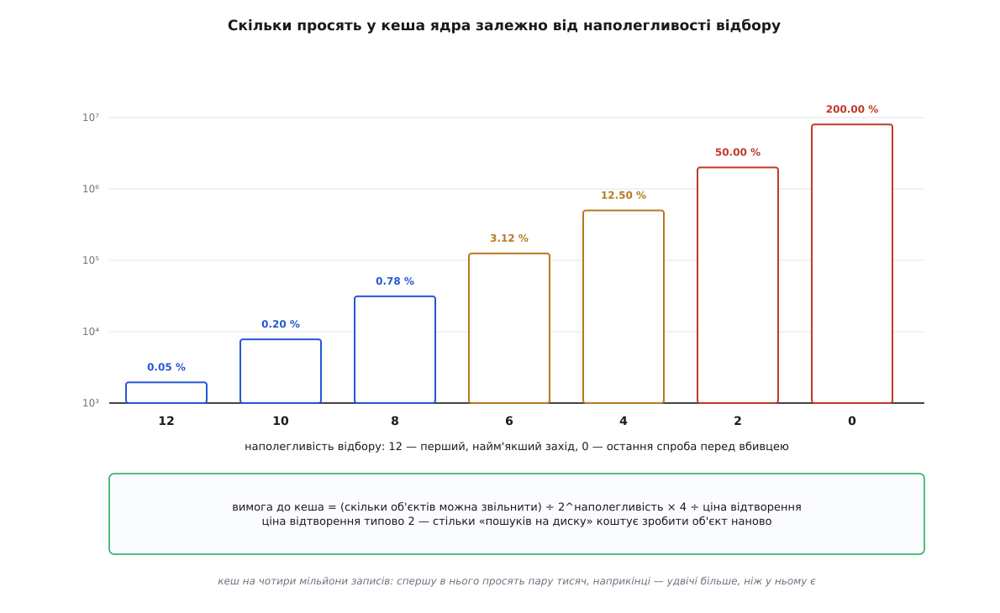

# Пам'ять ядра: slab і зменшувачі кешів

<preknowlist>
- [Ядро й простір користувача](topic:unix-linux/kernel-and-userspace) — ядро працює у привілейованому режимі й має власний шматок адресного простору, спільний для всіх процесів.
- [Сторінки, таблиці сторінок і MMU](topic:unix-linux/paging-and-mmu) — пам'ять роздають однаковими сторінками, типово по 4 КіБ, і саме сторінка є неподільною одиницею для апаратури.
- [Фізичні сторінки в ядрі: зони, блоки за порядками й ущільнення](topic:unix-linux/physical-page-allocator) — під усім у ядрі лежить роздавач фізичних сторінок, який видає суцільні блоки розміром 2ⁿ сторінок.
- [Свопінг і витіснення сторінок](topic:unix-linux/swap-and-reclaim) — коли пам'яті бракує, ядро забирає сторінки в тих, кому їх уже віддало; забрати можна лише те, чий вміст можна відтворити на вимогу.
- [Замки в ядрі й атомарний контекст: де спати не можна](topic:unix-linux/kernel-locking) — частину коду ядра виконують там, де задачу не можна приспати, і це різко звужує вибір дій.
- [Розбір шляху](topic:unix-linux/path-resolution) — щоб перетворити шлях на файл, ядро тримає в пам'яті кеш записів каталогів.
- [Внутрішня будова алокатора](topic:programming/memory-allocator-internals) — як влаштований звичайний розподілювач пам'яті: кошики за розмірами, пошук придатного блоку, фрагментація.
- [Кеш](topic:programming/cache) — дані, до яких щойно зверталися, лежать у швидкій пам'яті процесора, і повторне звертання до них у десятки разів дешевше.
</preknowlist>

## Хто ще просить пам'ять

Розмова про пам'ять зазвичай крутиться навколо процесів: скільки хто попросив, скільки доторкався, кого витіснили. Але кожен із тих механізмів сам із чогось зроблений. Процес відкриває файл — і в ядрі з'являється структура відкритого файлу, запис каталогу з іменем, а може, і структура самого inode. Приходить мережевий пакет — з'являється буфер сокета. Запускається потік — з'являється структура задачі та стек ядра до неї. Це не метафора обліку: це реальні байти, які хтось мусить видати.

Видати їх може лише одне місце. Під усім у ядрі лежить [роздавач фізичних сторінок](topic:unix-linux/physical-page-allocator), і він оперує сторінками: 4 КіБ або суцільний блок із кількох сторінок. Іншого джерела просто немає — все, що в системі взагалі має пам'ять, отримало її звідти.

А тепер порівняймо масштаби. Запис каталогу на типовому 64-бітному ядрі важить близько 192 байтів. Якщо на кожен такий запис брати сторінку, то з 4096 байтів у справу піде 192, а 3904 пропаде — 95 % викинуто. І це не рідкісний випадок: один обхід дерева файлів командою `find /` лишає по собі мільйони таких записів. Чотири мільйони по 192 байти — це 768 мегабайтів корисних даних; ті самі чотири мільйони по сторінці — понад шістнадцять гігабайтів, тобто вся пам'ять машини на самий лише кеш імен.

Отже, ядру потрібен власний спосіб ділити сторінку на дрібніше. Питання лише в тому, чому не взяти готову відповідь — ту саму, яку в просторі користувача дає `malloc`.

## Три стіни, об які розбивається звичний алокатор

Звичайний розподілювач у програмі влаштований як набір кошиків за розмірами: приходить запит, шукається придатний вільний шматок, за потреби більший ріжеться навпіл, сусідні вільні зливаються назад. Механізм відомий і працює добре. У ядрі він не працює, і причин рівно три — кожна сама по собі достатня.

**Пам'ять ядра не можна пообіцяти.** У просторі користувача виділення — це обіцянка: `malloc` розсуває адресний простір, а справжній фізичний фрейм процес отримує аж тоді, коли вперше торкнеться сторінки й дістане [сторінковий збій](topic:unix-linux/page-fault). Із пам'яттю ядра так не можна. Звертання до адреси ядра, за якою немає сторінки, — це не лінива видача, це помилка: обробник збою не має чим її закрити й лишається тільки повідомити про поламане ядро. Тому виділення в ядрі або дає справжню фізичну пам'ять просто зараз, або чесно каже «немає» — третього стану немає.

**Просити доводиться звідти, звідки не можна чекати.** Частину коду ядра виконують у контексті, де задачу не можна приспати: обробник переривання, ділянка під спін-замком. Заснути в очікуванні звільненої пам'яті там неможливо з двох різних причин: обробник переривання взагалі не є задачею, яку планувальник уміє відкласти й повернути, а сплячий власник спін-замка заморозив би всіх, хто на той замок чекає. Отже, має існувати шлях, який або знаходить вільне місце за кілька інструкцій, або одразу відмовляє. Це і є практична різниця між двома найпоширенішими режимами запиту: звичайний дозволяє при потребі поспати, «атомарний» — ні, і тому черпає з невеликого аварійного запасу.

**Під ядром нікого немає.** Коли розподілювачеві в програмі бракує пам'яті, він просить її в ядра. Коли її бракує ядру, просити нема в кого — воно і є дном. Гірше: механізм, який звільняє пам'ять, сам потребує пам'яті на свою роботу — на заголовки запитів вводу-виводу, на буфери. Розподілювач ядра мусить бути таким, щоб віддати пам'ять можна було, не витрачаючи пам'яті.

> 🔧 **Навіщо це.** Із цих трьох стін випливає практична річ, яка щоразу дивує при розгляді випадків: витік пам'яті в ядрі поводиться інакше, ніж витік у програмі. Його не видно в жодному процесі, бо він нічий; його не вилікує вбивця за браком пам'яті, бо вбивати нема кого; його не сховає своп, бо цієї пам'яті своп не бере. Машина просто повільно втрачає вільну пам'ять, і єдиний слід — рядки `Slab` у `/proc/meminfo`, які ростуть і не спадають.

## Однаковий розмір купує все одразу

Візьмімо обмеження, якого в загальному розподілювачі немає: **усі шматки в пулі однакового розміру**. Воно змінює все відразу.

Зникає пошук придатного блоку — придатний будь-який. Зникає різання й зливання — нема чого різати. Зникає заголовок при кожному шматку із записаним розміром — розмір той самий у всіх, його достатньо знати одному разу на весь пул. Зникає внутрішня фрагментація від округлення — округлювати нема до чого.

Лишається одне питання: як знайти вільне місце. І тут теж вигода. Список вільних місць не треба зберігати окремо — його кладуть **усередину самих вільних місць**: у вільному слоті перші вісім байтів займає адреса наступного вільного слота. Зайнятий слот тримає об'єкт, вільний — вказівник; двох одночасно не буває, тож пам'ять на облік не витрачається взагалі. Виділення при цьому зводиться до трьох дій: узяти голову списку, прочитати з неї адресу наступного, записати її як нову голову. Ні циклу, ні порівнянь, ні розгалужень.

Із цих міркувань виростає вся конструкція, і в неї три рівні. **Кеш об'єктів** — пул під один конкретний тип; на живій машині їх кількасот, окремо під записи каталогів, окремо під inode кожної файлової системи, окремо під буфери сокетів. **Слаб** (англ. *slab* — «плита, брус») — суцільний блок сторінок, узятий у сторінкового роздавача й порізаний на слоти. **Слот** — місце під один об'єкт. Слаби кеш тримає розсортованими за станом: повні, часткові, порожні. Роздають завжди з часткових — там гарантовано є і місце, і вже нарізана структура.



*Обмеження «всі слоти однакові» не забирає гнучкості даремно — воно оплачує і швидкість виділення, і відсутність окремої пам'яті на облік.*

## Скільки коштує залишок

Одна річ у цій схемі лишилася без відповіді: сторінка рідко ділиться на розмір об'єкта націло. Хвостик, що не вмістився, пропадає — і його ціна залежить від того, наскільки невдало розмір об'єкта відноситься до розміру слаба.

Для записів каталогів усе добре: у 4096 байтів вміщається 21 запис по 192, лишається 64 байти — півтора відсотка. А от структура inode файлової системи ext4 виросла приблизно до 1072 байтів (точне число залежить від збірки ядра), і тут арифметика стає неприємною.

**Умова.** Об'єкт розміром 1072 байти; слаб — блок із 2ⁿ сторінок по 4096 байтів.

```
слаб 4096 Б (1 сторінка):   4096 ÷ 1072 = 3.82  → 3 об'єкти
                            залишок  = 4096 − 3·1072 = 880 Б   = 21.5 %

слаб 8192 Б (2 сторінки):   8192 ÷ 1072 = 7.64  → 7 об'єктів
                            залишок  = 8192 − 7·1072 = 688 Б   = 8.4 %

слаб 16384 Б (4 сторінки): 16384 ÷ 1072 = 15.28 → 15 об'єктів
                            залишок = 16384 − 15·1072 = 304 Б  = 1.9 %
```

Один-єдиний параметр — скільки сторінок брати під слаб — тягне втрату з двадцяти відсотків до двох. Це не вигадана вправа: саме через цю арифметику на машині з мільйоном закешованих inode ext4 марно займалося близько 290 мегабайтів — залишків по 880 байтів у кожному з трьохсот з гаком тисяч слабів. Але й безкоштовно більший слаб не дається. Блок із чотирьох сторінок має бути **фізично суцільним**, а суцільні блоки в системі, що довго працює, стають дефіцитом; за них доводиться платити витісненням і ущільненням пам'яті. І друге: слаб повертають сторінковому роздавачу лише тоді, коли **всі** його слоти вільні, а що більше слотів, то менша ймовірність, що всі вони спорожніють одночасно.

## Об'єкт, який не вмирає до кінця

Місце — не єдине, що заощаджує однаковий розмір. Початковий поштовх до всієї конструкції був про інше, про час.

Складний об'єкт ядра не зводиться до купки байтів. Перед першим використанням у ньому треба ініціалізувати замок, зв'язати голови списків, виставити лічильники. Робота невелика, але вона повторюється при кожному створенні — а створюють такі об'єкти мільйонами. Спостереження, з якого все почалося, звучить так: **більшість цієї ініціалізації не залежить від конкретного вжитку**. Замок після звільнення об'єкта лишається справним замком; порожній список лишається порожнім списком. Якщо слот усе одно повертається в той самий пул і піде під той самий тип, то й ініціалізацію можна не скасовувати й не повторювати — вона переживає звільнення.

Звідси й назва підходу — кешування об'єктів, а не байтів. Ідею разом із самим словом «слаб» ввів Джеф Бонвік у розподілювачі пам'яті ядра SunOS 5.4 (тобто Solaris 2.4) і описав у праці на конференції USENIX улітку 1994 року; звідти вона розійшлася по Linux, FreeBSD й illumos. Як вона діставалася до Linux і чому в самому Linux змінилося три покоління таких розподілювачів, поки не лишилося одне, — [історія слаба: від Solaris до єдиного розподілювача Linux](topic:unix-linux/kernel-memory-slab/hist-slab-birth.md).

У сучасному Linux явні конструктори майже не вживають — виявилося, що ініціалізувати заново дешевше, ніж стежити за чистотою стану. А от друга половина вигоди лишилася, і вона більша за першу. Слот, який щойно звільнили, ще лежить у [кеші процесора](topic:programming/cache): наступне виділення з великою ймовірністю віддасть саме його, і запис у свіжий об'єкт піде в найшвидшу пам'ять замість походу в оперативну. Той самий прийом добре відомий і в прикладному коді — там він зветься [пулом об'єктів](topic:programming/object-pool), і працює з тієї самої причини.

## Черга, яка коштувала дорожче за замок

Поки процесор один, описаного вистачає. З появою багатьох ядер додається задача, яку не обійти: кеш об'єктів спільний, а звертаються до нього звідусіль одночасно. Один замок на кеш перетворює найгарячіший шлях у ядрі на вузьке місце.

Перша відповідь напрошується: дати кожному процесорові власну маленьку чергу вже готових об'єктів. Свою чергу процесор обслуговує без замка; по-справжньому домовлятися доводиться лише тоді, коли черга спорожніла або переповнилася. Саме так було влаштовано першу реалізацію в Linux, успадковану від задуму Бонвіка.

Вигода була, але з нею прийшла й вада, яку помічають не одразу. Черги — це пам'ять, і її треба помножити на кількість кешів, на кількість процесорів і на кількість вузлів пам'яті. Що більше ядер, то більше об'єктів осідає в чергах, нікому не належачи й нікому не служачи: вони не зайняті, але й не вільні — вони «про запас у сусіда». Цієї пам'яті не видно звичайним лічильником, і забрати її під тиском важко.

Нинішній розподілювач Linux (його автор — Крістоф Ламетер; у дерево він увійшов 2007 року у версії 2.6.22, а за умовчанням став у 2.6.23) від початку побудований на протилежному рішенні: **черг немає взагалі**. Замість запасу об'єктів кожен процесор тримає один активний слаб і вказівник на голову списку вільних слотів у ньому. Виділення — це зняти голову; поки в активному слабі є місце, ніхто ні з ким не перетинається. Коли місце скінчилося, беруть наступний слаб — спершу з невеликого власного набору часткових, далі зі спільного набору вузла пам'яті, і аж наприкінці йдуть по нові сторінки.



*Дороге тут лише те, що трапляється рідко; типовий виклик закінчується на першому рядку.*

Головна різниця не в швидкості, а в тому, куди повертається звільнений об'єкт. Він завжди лягає у **власний** слаб — той, з якого його колись видали. Тому пам'ять не зависає в чужій черзі, а стан «цей слаб уже цілком вільний» видно одразу й локально. Саме це й робить наступний розділ можливим.

## Забрати ззовні не можна

Виділяти навчилися дешево. Лишається звільняти — і ось тут звичний механізм [витіснення](topic:unix-linux/swap-and-reclaim) до цієї пам'яті не пасує зовсім, причому в кожній своїй частині.

Витіснення сторінок процесів стоїть на трьох підпорах. Черги — щоб бачити, до чого давно не зверталися. Зворотні відображення — щоб знайти всіх, хто на сторінку посилається, і зняти в них записи в таблицях. Підкладка — файл або своп, куди вміст можна відкласти, щоб потім відтворити.

Слабова сторінка не має жодної з трьох. На ній лежать десятки об'єктів різних власників, тож черга «як давно зверталися» до неї не ліпиться: до половини об'єктів зверталися щойно, до половини — ніколи. Зворотного відображення немає й бути не може: на об'єкт ядра посилаються звичайні вказівники в довільних структурах, і ніхто у світі не веде обліку, хто саме їх тримає. Підкладки немає теж: структуру ядра нікуди відкласти й нізвідки перечитати. А головне — щоб віддати сторінку, вільними мають стати **всі** її слоти; один живий об'єкт тримає весь слаб.

Отже, ззовні цю пам'ять не забрати. Ніяк.

Але велика її частина — це **кеші**. Записи каталогів, inode-и, метадані файлових систем: усе те, що можна відтворити з диска, просто дорого. А кеш за своєю природою росте, доки його не спинять: ніхто не викидає з нього записи добровільно, бо кожен запис колись може знадобитися. Тож після обходу великого дерева файлів у пам'яті сидить мільйон записів каталогів, які ніколи більше не знадобляться, і ніщо в конструкції кеша не змусить його з ними розпрощатися.

Із двох тверджень — «забрати не можна» і «звільнити потрібно» — випливає єдино можливий вихід. Якщо звільнити може лише власник, то відбір мусить **просити**, а не забирати. Це й називають зменшувачем (англ. *shrinker* — «той, що стискає»).



*Прохання — не ввічливість, а єдина форма, у якій це взагалі можна зробити: знання про те, що звільнити можна, є лише у власника.*

## Протокол із двох запитань

Зменшувач — це пара функцій, які підсистема реєструє в ядрі:

```c
struct shrinker {
    unsigned long (*count_objects)(struct shrinker *, struct shrink_control *);
    unsigned long (*scan_objects)(struct shrinker *, struct shrink_control *);
    int seeks;
    long batch;
};
```

Перша відповідає на питання «скільки об'єктів ти міг би зараз звільнити». Друга отримує число й звільняє приблизно стільки, повертаючи, скільки звільнила насправді; якщо в цьому контексті вона не може зробити нічого, вона так і каже окремим значенням.

Чому запитань саме два, а не одне. Відбір не може просто наказати «звільни половину» — він **балансує**. Йому потрібно розподілити тиск між чергами сторінок і всіма зареєстрованими кешами так, щоб ніхто не постраждав більше за інших. А для цього спершу треба дізнатися розміри, і лише потім рахувати частки.

Частку рахують так. Відбір працює з рівнем наполегливості: він починається з найм'якшого й наростає, поки пам'ять не знайшлася. Із цього рівня й розміру кеша виходить вимога:

```
вимога = (скільки об'єктів можна звільнити) ÷ 2^наполегливість × 4 ÷ ціна_відтворення
```

`ціна_відтворення` — це паспортна характеристика самого кеша: скільки звертань до диска коштує зробити один такий об'єкт наново. Типове значення — 2: за одиницю взято вартість повернення однієї витісненої сторінки — один пошук на диску, а звичайний кешований об'єкт умовно коштує двох таких пошуків. Що дорожче відтворити об'єкт, то менше в його кеша просять.

**Умова.** Кеш записів каталогів, у якому зараз 4 000 000 об'єктів, придатних до звільнення; ціна відтворення — 2.

```
наполегливість 12 — перший, найм'якший захід:
    4 000 000 ÷ 2¹²   =       976
    976 × 4 ÷ 2       =     1 952 об'єкти     це 0.05 % кеша

наполегливість 6 — пам'ять усе ще не знаходиться:
    4 000 000 ÷ 2⁶    =    62 500
    62 500 × 4 ÷ 2    =   125 000 об'єктів    це 3.1 % кеша

наполегливість 0 — остання спроба перед вбивцею:
    4 000 000 ÷ 2⁰    = 4 000 000
    4 000 000 × 4 ÷ 2 = 8 000 000 об'єктів    це 200 % кеша
```



*Двісті відсотків — не описка: наприкінці в кеша просять більше, ніж у ньому є, бо звільнити вдається далеко не все пораховане.*

Видно головне: під легким тиском кеші майже не чіпають, і це правильно — вони корисні. Різкість наростання теж не випадкова: вона повторює те, як наростає тиск на черги сторінок, тому кеші ядра худнуть у тому самому темпі, у якому процеси втрачають свої сторінки.

Із цієї формули випливає й пастка. Якщо кеш маленький — скажімо, тисяча об'єктів, — то на найм'якшому рівні зсув обертає вимогу на нуль, і кеш не чіпають узагалі: він почне віддавати лише тоді, коли наполегливість зросте настільки, що ділення перестане обнуляти число. Друга межа того самого роду — порція: за один захід зазвичай не переглядають менш як сто двадцять вісім об'єктів, і щоб кеші, менші за порцію, не застрягли назавжди, для них зроблено виняток — під справжнім тиском їх переглядають цілком.

## Чому зменшувач не завжди може

Зменшувач працює в чужому контексті — його викликають зсередини відбору, тобто в ту мить, коли пам'яті вже бракує. Звідси два обмеження, які роблять цю роботу тоншою, ніж «видали зайве».

Перше: звільнення об'єкта не завжди дешеве й не завжди безпечне. Викинути запис каталогу — просто. Викинути inode, у якому є незаписані зміни, означає спершу записати їх на диск, а це звертання до файлової системи. Але ж відбір міг бути запущений саме файловою системою, яка просить пам'ять під свій запис. Вийде замкнене коло: щоб звільнити пам'ять, треба записати, щоб записати — треба пам'ять. Тому в запиті на виділення є ознака «файлову систему чіпати не можна», і зменшувач, побачивши її, чесно відмовляється.

Друге випливає з першого: відмова не має пропадати даремно. Незроблена робота не викидається, а накопичується — недоотримана вимога додається до наступного разу. Тож коли відбір нарешті прийде з контексту, де файлову систему чіпати можна, кеш заплатить і за той раз теж.

Є й третя тонкість, і вона про те, **що саме** звільняти. Спільний лічильник «у кеші чотири мільйони записів» недостатній у двох випадках. На машині з кількома вузлами пам'яті звільнення об'єктів на чужому вузлі не допомагає тому вузлу, якому бракує; звідси потреба вести списки окремо по вузлах — про причину цієї асиметрії йдеться в [нерівномірному доступі до пам'яті](topic:programming/numa). А в системі з [контрольними групами](topic:unix-linux/cgroups) тиск усередині одного контейнера не має викидати кеші сусіднього. Тому кожен кеш ядра, який має що зменшувати, веде свої списки як двовимірну сітку: окремий список на кожну пару «вузол пам'яті × група». Цю інфраструктуру збудували 2013 року у версії 3.12 — списки по вузлах разом із самим переходом на пару «порахуй / звільни» зробив Дейв Чиннер, а Ґлаубер Коста готував під це облік пам'яті ядра за групами; прив'язку самих списків до груп добудували аж 2015 року, у ядрах 3.19–4.0.

## kmalloc: той самий механізм, тільки без типу

Не всяке виділення в ядрі має тип. Драйверові треба буфер на 300 байтів, і заводити під нього окремий іменований кеш безглуздо. Для таких випадків є загальний запит за розміром — і влаштований він через ті самі кеші об'єктів.

Ядро тримає готовий набір кешів за розмірами — здебільшого степенями двійки: 8, 16, 32 і далі до кількох кілобайтів. Запит округлюють угору до найближчого розміру в наборі й видають слот звідти. Механізм цілком той самий, обмеження «однаковий розмір» збережене — просто типом тут виступає сам розмір.

Плата за універсальність — округлення. Запит на 257 байтів отримує слот на 512, тобто марно пропадає майже половина. Це одна з причин, чому в ядрі так уважно рахують байти в структурах: структура на 1032 байти займе слот на 2048 і вдвічі перевитратить пам'ять, а вкладена в 1024 — рівно стільки, скільки треба.

Друга особливість цієї пам'яті помітна не одразу, але важлива: вона **фізично суцільна**. Слот вирізано зі слаба, а слаб — це суцільний блок сторінок; отже, отриманий буфер лежить у фізичній пам'яті одним шматком і придатний для передавання пристроям, які працюють без участі процесора. Коли суцільність не потрібна, а розмір великий, у ядра є інший шлях — зібрати ділянку з розрізнених сторінок і зшити її таблицями сторінок у суцільну лише з погляду адрес: [віртуально суцільна пам'ять ядра](topic:unix-linux/vmalloc-kernel-mappings). Вона дешевша щодо дефіцитних суцільних блоків, але дорожча в доступі й непридатна для пристроїв.

Точні назви кешів, поля, які показує система про кожен із них, підпис функції створення власного кеша й розбір ознак запиту зібрано окремо: [інтерфейси пам'яті ядра: кеші, запити й зменшувачі](topic:unix-linux/kernel-memory-slab/api-slab-interfaces.md).

## Що з цього видно й що з цим роблять

Уся ця пам'ять зведена до двох чисел у загальному звіті системи, і різниця між ними — головне, на що варто дивитися. Одне показує, скільки ядро тримає в кешах, які **можуть** зменшитися на прохання; друге — скільки зайнято тим, що не зменшиться ніколи, бо це живі об'єкти, а не кеш. Перше число саме по собі не є хворобою: великий кеш імен на файловому сервері — це здоров'я. Друге, коли воно росте без упину, — це або справді велике навантаження, або витік у ядрі чи в модулі.

Звідси кілька практичних наслідків, які варто розрізняти.

**Примусове скидання кешів** — засіб діагностичний, а не лікувальний. Воно доводить, що пам'ять справді можна було звільнити, але заразом викидає й корисне, і машина відпрацьовує це вводом-виводом наступні хвилини. Як постійний захід воно означає рівно те, що причину не знайшли.

**Ручка, що змінює наполегливість** до кешів імен і inode, робить одну річ: множить вимогу до цих двох зменшувачів. Більше за типове значення — кеші худнуть охочіше й пам'ять швидше йде процесам; менше — навпаки. Це не «більше пам'яті», а зсув межі між двома видами користі.

**Контейнер може загинути через пам'ять ядра**, і це найнеочевидніший із наслідків. Об'єкти ядра, створені на прохання процесу, записують на рахунок його групи; тож служба, яка відкриває мільйони файлів, упирається в свою межу не власними даними, а кешем записів каталогів. У переліку її процесів при цьому нічого підозрілого не видно — про те, чому число «скільки пам'яті займає процес» узагалі не має однієї правильної відповіді, йдеться в [способах міряти пам'ять](topic:unix-linux/memory-accounting).

**Кеш може не худнути, хоч і зменшується.** Зменшувач звільняє об'єкти, а віддати сторінки можна лише слабами цілком; якщо живі об'єкти розсіяні по слабах по одному, звільнення тисячі об'єктів не поверне жодної сторінки. Це чесна межа всієї конструкції, а не помилка: та сама властивість, яка робить виділення таким дешевим, робить повернення пам'яті нерівномірним.

Побачити ці числа на власній машині — і те, як кеш імен росте від обходу дерева каталогів, худне під тиском і не худне при фрагментації, — дає [дослід із кешами ядра](topic:unix-linux/kernel-memory-slab/proj-slab-watch.md).

Уся ця конструкція тримається на одному факті. Пам'ять ядра — єдина пам'ять у системі, яку не можна відібрати силою: її не відкладеш у своп, не позначиш відсутньою в таблиці сторінок, не звільниш, убивши власника. Розподілювач тому такий, що вміє віддавати пам'ять, не витрачаючи пам'яті; звільнення тому влаштоване як прохання, а не як вилучення. І питання, яке про цю пам'ять має сенс ставити, теж інше, ніж звикли: не скільки її зайнято, а скільки з неї піде, якщо попросити.
