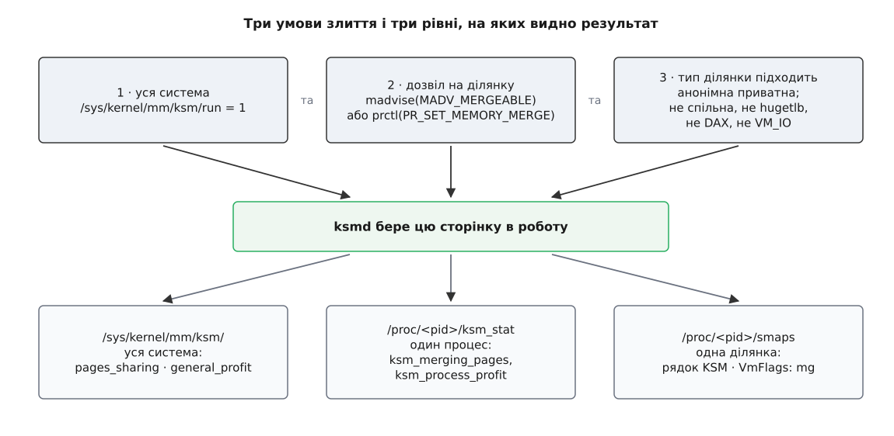

# 📋 Керування KSM: файли, виклики, лічильники

Це повна довідка з інтерфейсу злиття однакових сторінок: усі файли `/sys/kernel/mm/ksm/` з типовими значеннями, два системні виклики, якими пам'ять віддають під злиття, і три рівні, на яких видно результат. Потрібна вона тому, що інтерфейс розкладено між трьома різними місцями ядра, і кожне з них відповідає лише за свою частину рішення.

## Три згоди, без яких злиття не станеться

Найчастіша помилка при вмиканні — вважати, що `run = 1` уже щось робить. Не робить: демон `ksmd` ходить **тільки** по тих ділянках, які власник явно віддав під злиття, і тільки по тих із них, чий тип механізм узагалі підтримує. Три умови множаться, а не додаються; жодна з них не покриває інших.


*Ліворуч і вгорі — те, що вмикають; унизу — те, що читають. Системний вимикач вмикає демон, `madvise` або `prctl` дає йому дозвіл на конкретну пам'ять, а сумісність типу ділянки ядро перевіряє саме й мовчки. Результат видно на трьох різних масштабах, і числа на них рахуються по-різному.*

## Вимикачі: `/sys/kernel/mm/ksm/`

Усі файли читаються й пишуться як звичайний десятковий текст: `cat` віддає число з переводом рядка, запис приймає число (`echo 1 > …`). Тека з'являється тільки в ядрі з `CONFIG_KSM=y`; окремого модуля тут немає — або зібрано, або ні.

| Файл | Типово | Що робить |
|---|---|---|
| `run` | `0` | `0` — спинити `ksmd`, злите лишити як є; `1` — працювати; `2` — спинити **і розвести назад геть усе злите**. Після запису `2` файл так і читається як `2`, тобто це стійкий стан «вимкнено з розлученням», а не разова дія |
| `pages_to_scan` | `100` | Скільки сторінок оглянути за один захід, перш ніж заснути |
| `sleep_millisecs` | `20` | Скільки мілісекунд спати між заходами. Разом із попереднім задає всю швидкість: `pages_to_scan / sleep_millisecs` сторінок за мілісекунду |
| `merge_across_nodes` | `1` | `0` забороняє зводити сторінки з різних [вузлів NUMA](topic:programming/numa) — на кожному вузлі буде своя копія того самого вмісту. Змінити можна, **лише коли в системі немає жодної злитої сторінки**, інакше запис вертає `EBUSY`; на практиці це означає спершу `run = 2`, дочекатися нуля в `pages_shared`, і лише тоді писати |
| `use_zero_pages` | `0` | `1` велить відображати знайдені нульові сторінки на спільну нульову сторінку ядра замість того, щоб робити з них звичайну злиту сторінку |
| `max_page_sharing` | `256` | Стеля користувачів одного злитого кадру. Мінімум — `2`. Змінюється з тим самим обмеженням і тією ж помилкою `EBUSY`, що й `merge_across_nodes` |
| `stable_node_chains_prune_millisecs` | `2000` | Як часто обходити ланцюжки двійників, що вперлися в стелю, і викидати з них застарілі записи |
| `smart_scan` | `1` (з 6.7) | Сторінки, яким кілька проходів поспіль не знайшлося пари, починають пропускати — і що довше вони самотні, то рідше на них дивляться |

Окремо варто затямити асиметрію `run`. Одиниця вмикає повільний приплив: економія накопичуватиметься десятками хвилин. Двійка — миттєвий і повний відкат: усі злиті сторінки розводять назад, і кожній потрібен свій кадр **зараз**. Якщо машину доведено до краю саме завдяки злиттю, запис двійки — це найшвидший спосіб дістати нестачу пам'яті на рівному місці.

Періодичне прибирання ланцюжків двійників через `stable_node_chains_prune_millisecs` є зворотним боком обмеження `max_page_sharing`. Коли процес завершує роботу або викликом `madvise` розколює злиту сторінку, відповідний `rmap_item` видаляється, але сам вузол стабільного дерева може залишатися в ланцюжку. Таймер прибирання фоново проходить ланцюжки двійників, вичищає з них порожні кадри та об'єднує короткі залишки, щоб запобігти витоку службових структур при тривалій роботі системи.

## Порадник: коли `pages_to_scan` підбирає ядро

Пара «скільки сторінок / скільки спати» задає **сталу** швидкість, а кількість кандидатів стала не буває: на старті програм її багато, потім вона осідає. З ядра 6.8 є порадник, який крутить `pages_to_scan` сам, під задану ціль за часом і стелю за процесором.

| Файл | Типово | Що робить |
|---|---|---|
| `advisor_mode` | `none` | `none` — порадника немає, діє те, що записано в `pages_to_scan`; `scan-time` — вмикає підбір за часом проходу |
| `advisor_target_scan_time` | `200` | Ціль: за скільки секунд треба встигати проходити всі сторінки-кандидати. Головне число всієї настройки — менше значення робить сканування агресивнішим |
| `advisor_max_cpu` | `70` | Стеля частки процесора (у відсотках), яку дозволено з'їдати потоку `ksmd` |
| `advisor_min_pages_to_scan` | `500` | Нижня межа, у яку порадник має право опустити `pages_to_scan` |
| `advisor_max_pages_to_scan` | `30000` | Верхня межа того самого |

`pages_to_scan` перераховується щоразу після завершення повного проходу — тобто порадник реагує з затримкою в один прохід, а не миттєво.

## Лічильники: як читати кожне число

Ці файли лише читаються. Одиниця виміру всюди — **сторінка**, не байт; щоб дістати байти, множте на розмір базової сторінки (`getconf PAGESIZE`, зазвичай 4096).

| Файл | Що показує | Як читати |
|---|---|---|
| `pages_shared` | Скільки **кадрів** механізм тримає як спільні | Це витрата, а не здобич: стільки фізичної пам'яті зайнято під спільні сторінки |
| `pages_sharing` | Скільки відображень указує на ці кадри **понад один** | А ось це здобич: рівно стільки сторінок не довелося виділяти. `pages_sharing / pages_shared` — середня кількість охочих на кадр |
| `pages_unshared` | Скільки сторінок регулярно перевіряють і не знаходять їм пари | Чиста витрата процесора. Велике число поруч із малим `pages_sharing` — привід вимкнути KSM для цього навантаження |
| `pages_volatile` | Скільки сторінок міняються надто швидко, щоб їх узагалі класти в дерево | Показує, наскільки навантаження взагалі придатне для дедуплікації |
| `full_scans` | Скільки разів усі придатні ділянки пройдено від початку до кінця | Основна одиниця часу в KSM: до першого повного проходу судити про економію немає сенсу |
| `stable_node_chains` | Скільки злитих сторінок уперлися в стелю `max_page_sharing` | Ненульове значення означає, що почали заводитися двійники |
| `stable_node_dups` | Скільки всього таких двійників | Ціна стелі в кадрах: стільки зайвих копій ядро тримає свідомо |
| `pages_scanned` (з 6.6) | Скільки сторінок оглянуто | Разом із `pages_skipped` показує, скільки роботи справді робиться |
| `pages_skipped` (з 6.7) | Скільки сторінок пропустило «розумне сканування» | Виміряна користь від `smart_scan` |
| `ksm_zero_pages` (з 6.6) | Скільки нульових сторінок, відображених на спільну нульову, поставив саме KSM | Має сенс лише при `use_zero_pages = 1` |
| `general_profit` (з 6.4) | Оцінка чистої користі в **байтах** | Єдине число тут не в сторінках і єдине, з якого вже відняли службові дані |

> 🔧 **Навіщо це.** `pages_shared` і `pages_sharing` — найлегша пастка всього інтерфейсу: назви майже однакові, а значать вони протилежні речі. Число, яке хочеться поставити у звіт про економію, — це `pages_sharing`. Число, яке показує, скільки пам'яті KSM **зайняв**, — `pages_shared`. Переплутати їх означає відрапортувати про економію рівно тієї величини, якою ви заплатили.

## Скільки насправді зекономлено

Просте множення `pages_sharing` на розмір сторінки перебільшує здобич: на кожну відстежувану сторінку KSM тримає власну структуру `struct ksm_rmap_item`, і цих структур набагато більше, ніж злитих сторінок, — вони заводяться на кожного кандидата, зокрема й на тих, кому пари так і не знайшлося. Саме тому в ядрі й рахують «прибуток» окремим числом. У документації формула подана як наближення:

```
general_profit  ≈  pages_sharing · PAGE_SIZE  −  усі_rmap_items · sizeof(struct ksm_rmap_item)
process_profit  ≈  (ksm_merging_pages + ksm_zero_pages) · PAGE_SIZE
                   −  ksm_rmap_items · sizeof(struct ksm_rmap_item)
```

Точний розмір `struct ksm_rmap_item` не є частиною ABI й залежить від конфігурації ядра; на 64-бітній машині це кілька десятків байтів, орієнтовно 64. *(Доказовий статус: формули — з `Documentation/admin-guide/mm/ksm.rst`; розмір структури — оцінка з вихідного коду, а не гарантія.)*

**Умова.** Процес із `/proc/<pid>/ksm_stat`: `ksm_merging_pages` = 120 000, `ksm_zero_pages` = 4 000, `ksm_rmap_items` = 900 000; сторінка 4096 байтів, структура 64 байти.

```
збережено сторінками  =  (120 000 + 4 000) · 4096 Б  =  507 904 000 Б  ≈  484.4 МіБ
службові структури    =  900 000 · 64 Б              =   57 600 000 Б  ≈   54.9 МіБ
ksm_process_profit    ≈  484.4 − 54.9 МіБ                              ≈  429.4 МіБ
кандидатів на злиту   =  900 000 / 120 000                             =  7.5
```
Останній рядок і є справжня оцінка якості: сім із половиною оглянутих сторінок на одну злиту. Поки прибуток додатний, це терпимо; коли він піде в мінус — а таке буває на навантаженнях без повторів, — ядро чесно покаже від'ємне число.

## `madvise()`: дозвіл на одну ділянку

```c
#include <sys/mman.h>

int madvise(void *addr, size_t length, int advice);

/* MADV_MERGEABLE    == 12  — віддати ділянку під злиття
   MADV_UNMERGEABLE  == 13  — забрати назад і негайно розвести все злите в ній */
```

`addr` мусить бути вирівняний на межу сторінки. Обидва прапорці існують з ядра 2.6.32 і доступні лише при `CONFIG_KSM`; без нього виклик вертає `EINVAL`. Ділянка створюється звичайним `mmap` — про правила самих відображень є [окрема стаття](topic:unix-linux/mmap-model): злиття не додає до них нічого, воно лише позначає вже наявну ділянку.

Придатною ділянка є, тільки якщо вона анонімна й приватна. Ядро відкидає: спільні відображення (`VM_SHARED`, `VM_MAYSHARE`), файлові, [великі сторінки hugetlb](topic:unix-linux/huge-pages), відображення пристроїв і фізичної пам'яті (`VM_IO`, `VM_PFNMAP`), файлові відображення DAX, а також кілька архітектурних режимів пам'яті на PowerPC і SPARC.

І тут головна пастка всього інтерфейсу:

> Несумісну ділянку `madvise(MADV_MERGEABLE)` **не відхиляє**. Вона повертає `0` — і мовчки нічого не робить.

Нуль тут означає «пораду прийнято до відома», а не «ділянку взято в роботу». Порада на те й порада: ядро вільне нею знехтувати. Тому програма, яка перевіряє тільки код повернення, не має жодного способу дізнатися, що весь її файловий буфер лишився поза злиттям. Єдина надійна перевірка — подивитися, чи з'явилася на ділянці позначка `mg` у `smaps` (див. нижче).

| Помилка | Коли |
|---|---|
| `EINVAL` | ядро без `CONFIG_KSM`; `addr` не вирівняно на сторінку; `length` від'ємна після приведення |
| `ENOMEM` | у діапазоні `[addr, addr+length)` є невідображені проміжки, або бракує пам'яті на службові структури |
| `EAGAIN` | тимчасова нестача внутрішніх ресурсів ядра, можна повторити |

`MADV_UNMERGEABLE` — операція протилежна й **синхронна**: вона не просто знімає позначку, а тут-таки розводить усі злиті сторінки ділянки, кожній виділяючи власний кадр. На великій ділянці це і повільно, і може впертися в брак пам'яті.

## `prctl()`: дозвіл на весь процес

Позначати ділянки викликом мусить сама програма — а той, хто запускає чужі контейнери, керує не програмою, а процесом. Тому в ядрі 6.4 з'явилася пара операцій, що вмикає злиття на весь адресний простір одразу: і на наявні ділянки, і на всі майбутні.

```c
#include <sys/prctl.h>

/* PR_SET_MEMORY_MERGE == 67, PR_GET_MEMORY_MERGE == 68 */

prctl(PR_SET_MEMORY_MERGE, 1, 0, 0, 0);   /* увімкнути для всього процесу */
prctl(PR_SET_MEMORY_MERGE, 0, 0, 0, 0);   /* вимкнути і розвести все злите */

int on = prctl(PR_GET_MEMORY_MERGE, 0, 0, 0, 0);   /* відповідь — у коді повернення */
```

Тонкощі, у яких легко помилитися:

- **Відповідь `PR_GET_MEMORY_MERGE` повертається кодом повернення**, а не через покажчик. Усі аргументи, крім першого, мусять бути нулями — інакше `EINVAL`. Це рідкість серед `prctl`-операцій, більшість яких пишуть результат за адресою.
- Аргументи `arg3`, `arg4`, `arg5` в обох операціях мусять бути нулями: `EINVAL` інакше.
- Виклик бере запис на замок адресного простору й може бути перерваний сигналом убивства — тоді це `EINTR`.
- Ядро без `CONFIG_KSM` не знає цих номерів узагалі й відповідає `EINVAL`.
- Позначка діє на **сумісні** ділянки. Несумісні (файлові, спільні, hugetlb) лишаються поза злиттям так само мовчки, як і при `madvise`.

**Спадкування.** Прапорець `MMF_VM_MERGE_ANY` входить у ту маску прапорців пам'яті, з якою ядро заводить новий адресний простір від наявного, — тож він переживає і `fork`, і `execve`. Це рівно те, що потрібно наглядачеві контейнерів: увімкнути злиття один раз у процесі-запускачі, а далі просто виконати корисне навантаження, яке про KSM нічого не знає. *(Доказовий статус: спадкування через `fork` описане в супровідному листі до 6.4; збереження через `execve` випливає з того, що прапорець стоїть у спільній масці ініціалізації в коді ядра.)*

## `/proc/<pid>/ksm_stat`: один процес зблизька

Загальносистемні лічильники не кажуть **хто** саме зливається. Цей файл каже — і читається як звичайний текст із [файлової системи процесів](topic:unix-linux/proc-filesystem).

```
ksm_rmap_items 900000
ksm_zero_pages 4000
ksm_merging_pages 120000
ksm_process_profit 450304000
ksm_merge_any: yes
ksm_mergeable: yes
```

| Поле | З ядра | Що означає |
|---|---|---|
| `ksm_rmap_items` | 6.1 | Скільки службових структур заведено на цей процес — тобто скільки його сторінок узагалі потрапило в роботу |
| `ksm_zero_pages` | 6.6 | Скільки його нульових сторінок відображено на спільну нульову сторінку ядра |
| `ksm_merging_pages` | 5.19 | Скільки його сторінок зараз злито (спочатку цей лічильник жив окремим файлом `/proc/<pid>/ksm_merging_pages`) |
| `ksm_process_profit` | 6.4 | Прибуток у **байтах** за формулою вище; буває від'ємним |
| `ksm_merge_any` | новіші | Чи стоїть на процесі позначка від `PR_SET_MEMORY_MERGE` |
| `ksm_mergeable` | новіші | Чи є в процесі бодай одна ділянка, віддана під злиття, — хоч через `prctl`, хоч через `madvise` |

Два останні рядки — єдині в цьому переліку, яких немає в `Documentation/admin-guide/mm/ksm.rst`, і додано їх помітно пізніше за решту. Прив'язувати їх до конкретного номера випуску не варто: надійніша перевірка — просто прочитати `ksm_stat` і подивитися, чи є в ньому ці рядки. Помітна й друга дрібниця: у цих двох полів, на відміну від чотирьох попередніх, після назви стоїть двокрапка — розбирач, який ріже рядок по пробілу, спіткнеться саме тут.

Пара останніх полів існує саме тому, що між «дозволив» і «щось справді зливається» є проміжок: `ksm_merge_any: yes` при `ksm_merging_pages 0` означає, що дозвіл є, а користі з нього поки жодної.

## `smaps`: одна ділянка зблизька

Найдрібніший масштаб — окреме відображення. Два різних місця в записі `/proc/<pid>/smaps` відповідають на два різних питання.

**Чи взяли ділянку в роботу** — позначка `mg` («mergeable advise flag») у рядку `VmFlags`. Це єдиний спосіб переконатися, що `madvise` не було знехтувано мовчки.

**Скільки в ділянці злитого** — рядок `KSM:` (з ядра 6.6), у кілобайтах. Важлива обмовка з документації: нульові сторінки, розставлені механізмом, у це число **не входять** — тільки справжні злиті сторінки.

```bash
# усі ділянки процесу, віддані під злиття, і скільки в кожній злитого
awk '/^[0-9a-f]+-[0-9a-f]+ /{hdr=$0; ksm=0}
     /^KSM:/{ksm=$2}
     /^VmFlags:/{ if ($0 ~ / mg( |$)/) printf "%-40s KSM %s kB\n", hdr, ksm }' \
    /proc/$PID/smaps
```

Тримати в голові варто, що `KSM:` не додається до `Rss` і не віднімається від нього — це зріз тієї ж пам'яті під іншим кутом. Чому три різні числа про «скільки займає процес» не сходяться між собою, розібрано [окремо](topic:unix-linux/memory-accounting).

## Мінімальний робочий виклик

Приклад підключення ділянки та процесу показано двома мовами — C та ідіоматичним C++ з RAII-обгорткою пам'яті.

:::tabs
```c
#define _GNU_SOURCE
#include <stdio.h>
#include <string.h>
#include <unistd.h>
#include <sys/mman.h>
#include <sys/prctl.h>

#ifndef PR_SET_MEMORY_MERGE
#define PR_SET_MEMORY_MERGE 67
#define PR_GET_MEMORY_MERGE 68
#endif

int main(void)
{
    const size_t len = 64u << 20;   /* 64 МіБ */

    /* Анонімна приватна ділянка — єдиний тип, який KSM бере. */
    void *p = mmap(NULL, len, PROT_READ | PROT_WRITE,
                   MAP_PRIVATE | MAP_ANONYMOUS, -1, 0);
    if (p == MAP_FAILED) { perror("mmap"); return 1; }
    memset(p, 0xA5, len);           /* однаковий вміст у всіх сторінках */

    /* Дозвіл на цю ділянку. Нуль НЕ означає «взято в роботу». */
    if (madvise(p, len, MADV_MERGEABLE) != 0) { perror("madvise"); return 1; }

    /* Або дозвіл на весь процес одразу (ядро 6.4+), зі спадкуванням. */
    if (prctl(PR_SET_MEMORY_MERGE, 1, 0, 0, 0) != 0)
        perror("prctl");            /* не смертельно: старе ядро або без CONFIG_KSM */

    printf("pid=%d addr=%p\n", getpid(), p);
    pause();                        /* тримаємо пам'ять, щоб було що сканувати */
    return 0;
}
```
```cpp
#define _GNU_SOURCE
#include <iostream>
#include <cstring>
#include <memory>
#include <unistd.h>
#include <sys/mman.h>
#include <sys/prctl.h>

#ifndef PR_SET_MEMORY_MERGE
#define PR_SET_MEMORY_MERGE 67
#define PR_GET_MEMORY_MERGE 68
#endif

class MmapRegion {
    void *addr_{MAP_FAILED};
    size_t len_{0};
public:
    explicit MmapRegion(size_t len) : len_(len) {
        addr_ = mmap(nullptr, len_, PROT_READ | PROT_WRITE,
                     MAP_PRIVATE | MAP_ANONYMOUS, -1, 0);
    }
    ~MmapRegion() {
        if (addr_ != MAP_FAILED) munmap(addr_, len_);
    }
    MmapRegion(const MmapRegion&) = delete;
    MmapRegion& operator=(const MmapRegion&) = delete;

    void* get() const { return addr_; }
    size_t size() const { return len_; }
    bool valid() const { return addr_ != MAP_FAILED; }
};

int main() {
    constexpr size_t len = 64u << 20;   // 64 МіБ
    MmapRegion region(len);
    if (!region.valid()) {
        std::perror("mmap");
        return 1;
    }

    std::memset(region.get(), 0xA5, region.size());

    if (madvise(region.get(), region.size(), MADV_MERGEABLE) != 0) {
        std::perror("madvise");
        return 1;
    }

    if (prctl(PR_SET_MEMORY_MERGE, 1, 0, 0, 0) != 0) {
        std::perror("prctl");
    }

    std::cout << "pid=" << getpid() << " addr=" << region.get() << std::endl;
    pause();
    return 0;
}
```
:::

Далі з другого термінала — увімкнути демон і подивитися, чи щось із цього вийшло:

```bash
echo 1 | sudo tee /sys/kernel/mm/ksm/run

# рушило чи ні: full_scans мусить рости, pages_sharing — теж
grep -H '' /sys/kernel/mm/ksm/{run,full_scans,pages_shared,pages_sharing,general_profit}

# що дісталося саме нашому процесу
cat /proc/$PID/ksm_stat

# і чи справді ядро взяло ділянку — позначка mg
grep -A24 "^$(printf %x $ADDR)" /proc/$PID/smaps | grep -E '^(KSM|VmFlags):'
```

Судити про результат раніше, ніж `full_scans` збільшиться хоча б на одиницю, немає сенсу: до першого повного проходу лічильники показують не стан пам'яті, а те, докуди демон устиг дійти. Утиліти автоматизації та моніторингу зазвичай відстежують динаміку `pages_sharing` разом із CPU-навантаженням потоку `ksmd`, щоб оцінювати доцільність підтримання дедуплікації на конфігурації системи.
