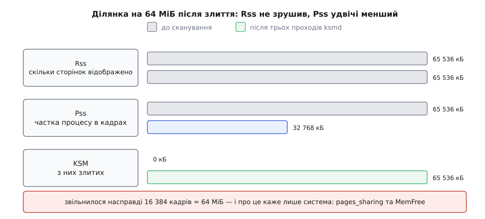
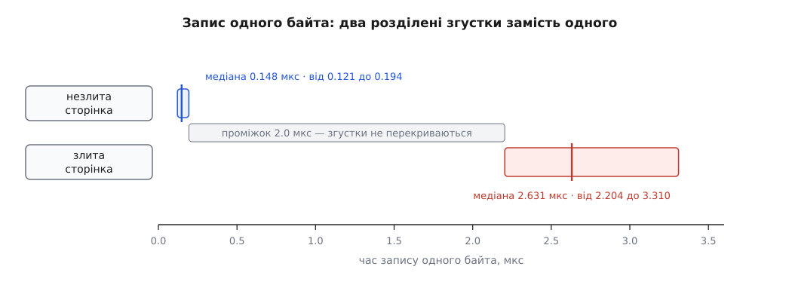

# ⚙️ Лабораторія KSM: змусити ядро злити ваші сторінки й побачити, у яких числах це видно

Ця програма на C робить дві однакові ділянки анонімної пам'яті, віддає їх під злиття, дочікується сканера ядра й читає ті самі лічильники, за якими зазвичай судять про користь механізму, — а потім міряє, наскільки довшим став запис одного байта в злиту сторінку. Перше, що вона доводить, неприємне: **`Rss` після злиття не змінюється взагалі**, і порада «увімкніть KSM і подивіться, як упаде `Rss`» міряє не те. Друге: власний звіт ядра про вигоду процесу за нашої постановки завищений рівно вдвічі, і програма показує, звідки береться множник. Третє: різниця в часі запису виявляється настільки чистою, що одного заміру досить для відповіді «так чи ні» — і саме на цьому стоїть уся неприємна половина теми.

## Що програма має довести числами

Питань чотири, і в кожного конкретна числова відповідь, яку не треба брати на віру.

**Перше: чи злилося взагалі.** Відповідь дають системні лічильники `pages_shared` (скільки кадрів механізм тримає спільними) і `pages_sharing` (скільки відображень указує на них понад одне — тобто скільки сторінок не довелося виділяти).

**Друге: як це видно з боку процесу.** У `/proc/self/smaps` кожна ділянка має рядки `Rss`, `Pss`, `KSM` і `Swap`, а в `/proc/self/ksm_stat` — чотири числа про весь процес. Питання не «скільки», а **яке з цих чисел зрушить, а яке ні**.

**Третє: скільки пам'яті звільнилося насправді.** Єдина зовнішня перевірка — `MemFree` у `/proc/meminfo` до й після. Вона й ловить розбіжність із тим, що каже про себе процес.

**Четверте: скільки коштує запис у злиту сторінку.** Один байт у кожну з тисяч сторінок — і поруч той самий запис у сторінку, яка не злилася.

Усе, звідки програма це читає, — [псевдофайлові системи](topic:unix-linux/pseudo-filesystems): ядро віддає свій внутрішній стан звичайними файлами, тож увесь інструментарій досліду — це `open` і `sscanf`.

## Три ділянки замість двох

Спокуса — зробити дві однакові ділянки й на цьому спинитися. Але тоді порівнювати час запису буде ні з чим: усе, що ми маємо, злилося, а зовнішня «звичайна» пам'ять програми має інший вік, інші права й інше розташування в кешах.

Тому ділянок три, і всі три однакові в усьому, крім вмісту:

- **A** і **B** — близнюки: сторінка з номером *i* в A побайтово збігається зі сторінкою *i* в B, але сторінки з різними номерами різні. Кожна пара зіллється сама з собою — і ні з ким більше.
- **C** — контроль: та сама довжина, той самий `mmap`, той самий `madvise`, ті самі заборони, але вміст кожної сторінки унікальний. Тут не зіллється нічого.

C потрібен не для симетрії. Він єдиний дає чесний контрольний вимір: сторінка того ж віку, тієї ж ділянки, під тим самим наглядом `ksmd`, з тими самими правами — **різниця лише в тому, що ця злилася, а та ні**. Усе інше, що могло б зіпсувати вимір, є в обох.

Заповнювати нулями не можна: нульові сторінки ядро обробляє окремою дорогою (вимикач `use_zero_pages`), і дослід став би про інше. Тому вміст — детермінований шум від заданого зерна: однакове зерно для A і B, далеке для C.

## Чому чекати треба три проходи, а не один

`ksmd` не зіллє наші сторінки за перший же огляд, і це не затримка, а сама конструкція.

Побачивши сторінку вперше, сканер рахує контрольну суму її вмісту й **тільки записує її** — у дерево кандидатів сторінка не потрапляє. Причина проста: дерево, ключем якого є вміст, зіпсується від першого ж запису процесу, тож туди беруть лише те, що вже довело свою нерухомість. Довести її можна єдиним способом — пережити ще один прохід із тією самою контрольною сумою.

Отже, найраніший можливий сценарій такий: на першому проході обидва близнюки отримують свої контрольні суми; на другому — той із них, кого сканер зустріне першим, потрапляє в дерево кандидатів, а другий одразу знаходить його там і зливається з ним. Але межа проходу може лягти між цими двома зустрічами, і тоді пара дочекається злиття лише на третьому. Додайте, що позначку `MADV_MERGEABLE` ми ставимо посеред уже розпочатого проходу, — і стає ясно, чому програма чекає, доки `full_scans` виросте **на три**. Це не запас на всяк випадок, а найкоротший строк, після якого можна щось стверджувати.

Скільки це в секундах — питання арифметики, і саме воно робить дослід нестерпним за типових налаштувань:

```
сторінок під наглядом      =  3 · 16 384                   =  49 152
типова швидкість ksmd      =  100 сторінок / 0.020 с       =  5 000 сторінок/с
один прохід за типової     =  49 152 / 5 000               =  9.8 с   → три проходи ≈ 30 с
на час досліду             =  4 000 / 0.020 с              =  200 000 сторінок/с
один прохід                =  49 152 / 200 000             =  0.25 с  → три проходи ≈ 0.8 с
```

Тридцять секунд ще стерпно, але на машині, де під наглядом справді багато пам'яті, типова швидкість перетворює дослід на очікування: 16 ГіБ — це 4 194 304 сторінки, тобто **14 хвилин на один прохід** і понад сорок хвилин на три. Тому програма на час роботи піднімає `pages_to_scan` — і мусить повернути його назад.

## Ручки, які треба взяти й обов'язково повернути

Дві речі, які програма змінює в системі: вмикає механізм (`run = 1` — типово він вимкнений) і прискорює сканер. Обидві — глобальні, обидві потребують root, обидві треба повернути навіть тоді, коли програму вб'ють на півдорозі. Тому рядки для відновлення готуються **заздалегідь**: обробник сигналу має право лише на `open`/`write`/`close`, і форматувати числа в ньому вже пізно.

```c
/* ksmlab.c — чи справді ядро злило ваші сторінки і в яких числах це видно.
   Складання: cc -O2 -Wall -Wextra -o ksmlab ksmlab.c
   Запуск:    sudo ./ksmlab      (root: KSM вмикається на рівні всієї системи)
   Потрібно:  CONFIG_KSM; поле ksm_process_profit у ksm_stat — з ядра 6.4,
              рядок KSM у smaps — з 6.6. */

#define _GNU_SOURCE
#include <stdio.h>
#include <stdlib.h>
#include <string.h>
#include <stdint.h>
#include <errno.h>
#include <fcntl.h>
#include <time.h>
#include <sched.h>
#include <signal.h>
#include <unistd.h>
#include <sys/mman.h>

#define KSM       "/sys/kernel/mm/ksm/"
#define PAGE      4096UL
#define NPAGES    16384UL            /* 64 МіБ на ділянку */
#define BYTES     (NPAGES * PAGE)
#define NPROBE    4096UL             /* скільки сторінок протикаємо на вимірі */
#define STRIDE    4099UL             /* просте, взаємно просте з 16384 —
                                        NPROBE різних сторінок без повторів */
#define SCAN_FAST 4000               /* pages_to_scan на час досліду */

/* На випадок старих заголовків: значення з asm-generic (x86-64, arm64…). */
#ifndef MADV_MERGEABLE
#define MADV_MERGEABLE   12
#endif
#ifndef MADV_NOHUGEPAGE
#define MADV_NOHUGEPAGE  15
#endif

static long ksm_get(const char *name)
{
    char path[128], buf[64];
    int fd;
    ssize_t n;

    snprintf(path, sizeof path, KSM "%s", name);
    if ((fd = open(path, O_RDONLY)) < 0) return -1;
    n = read(fd, buf, sizeof buf - 1);
    close(fd);
    if (n <= 0) return -1;
    buf[n] = '\0';
    return strtol(buf, NULL, 10);
}

static int put_raw(const char *path, const char *s, size_t len)
{
    int fd = open(path, O_WRONLY);
    ssize_t n;

    if (fd < 0) return -1;
    n = write(fd, s, len);
    close(fd);
    return n == (ssize_t)len ? 0 : -1;
}

static char run_back[24], scan_back[24];
static size_t run_len, scan_len;
static volatile sig_atomic_t knobs_taken;

static void restore_knobs(void)
{
    if (!knobs_taken) return;
    knobs_taken = 0;
    put_raw(KSM "pages_to_scan", scan_back, scan_len);
    put_raw(KSM "run", run_back, run_len);
}

static void on_signal(int sig)
{
    restore_knobs();          /* тільки open/write/close — безпечно в обробнику */
    _exit(128 + sig);
}

static void take_knobs(void)
{
    long run = ksm_get("run"), scan = ksm_get("pages_to_scan");
    char fast[24];
    int len;

    run_len  = (size_t)snprintf(run_back,  sizeof run_back,  "%ld\n", run);
    scan_len = (size_t)snprintf(scan_back, sizeof scan_back, "%ld\n", scan);
    len      = snprintf(fast, sizeof fast, "%d\n", SCAN_FAST);

    if (put_raw(KSM "run", "1\n", 2) != 0 ||
        put_raw(KSM "pages_to_scan", fast, (size_t)len) != 0) {
        fprintf(stderr, "не вдалося записати в " KSM ": %s\n"
                        "ці ручки належать root — спробуйте sudo\n", strerror(errno));
        exit(1);
    }
    knobs_taken = 1;
    atexit(restore_knobs);
    signal(SIGINT,  on_signal);
    signal(SIGTERM, on_signal);

    printf("run             : %ld → 1       (повернемо %ld)\n", run, run);
    printf("pages_to_scan   : %ld → %d    (повернемо %ld)\n", scan, SCAN_FAST, scan);
    printf("sleep_millisecs : %ld\n", ksm_get("sleep_millisecs"));
}
```

> 🔧 **Навіщо це.** `run = 1` — вимикач не для одного процесу, а для всієї машини: після нього злиття вмикається для **кожного**, хто колись попросив `MADV_MERGEABLE`, разом із чужими. Тому програма й возиться з відновленням: лишити ввімкненим механізм, який ви ввімкнули на п'ять секунд заради досліду, — це змінити властивості системи, а не свої власні.

## Ділянки: дозвіл, якого могло й не бути

Тут криється пастка, від якої не рятує перевірка коду повернення. `madvise(MADV_MERGEABLE)` на ділянці, яка механізмові не підходить — спільній, файловій із `MAP_SHARED`, hugetlb, — **повертає нуль і не робить нічого**. Виклик успішний, злиття немає, і шукати причину можна довго.

Єдиний спосіб переконатися — подивитися, чи з'явився в `VmFlags` ділянки прапорець `mg`. Заразом варто перевірити й `nh`: без заборони прозорих великих сторінок ділянку можуть підмінити двомегабайтовими шматками, які `ksmd` муситиме розбивати назад, — [великі сторінки](topic:unix-linux/huge-pages) й дедуплікація тягнуть у різні боки, і в лабораторії другого гравця краще прибрати з поля.

```c
static uint64_t splitmix64(uint64_t *s)
{
    uint64_t z = (*s += 0x9E3779B97F4A7C15ULL);
    z = (z ^ (z >> 30)) * 0xBF58476D1CE4E5B9ULL;
    z = (z ^ (z >> 27)) * 0x94D049BB133111EBULL;
    return z ^ (z >> 31);
}

/* Кожна сторінка — власний детермінований шум від зерна (salt + номер сторінки).
   Однакове зерно для A і B робить їх побайтовими близнюками; далеке зерно для C
   робить кожну його сторінку унікальною. Нулями не заповнюємо: нульові сторінки
   ядро веде окремою дорогою (use_zero_pages), і дослід став би про інше. */
static void fill(unsigned char *base, uint64_t salt)
{
    unsigned long p, i;

    for (p = 0; p < NPAGES; p++) {
        uint64_t seed = salt + p;
        uint64_t *q = (uint64_t *)(base + p * PAGE);

        for (i = 0; i < PAGE / sizeof *q; i++)
            q[i] = splitmix64(&seed);
    }
}

static unsigned char *new_region(void)
{
    unsigned char *p = mmap(NULL, BYTES, PROT_READ | PROT_WRITE,
                            MAP_PRIVATE | MAP_ANONYMOUS, -1, 0);

    if (p == MAP_FAILED) { perror("mmap"); exit(1); }

    if (madvise(p, BYTES, MADV_NOHUGEPAGE) != 0)
        fprintf(stderr, "MADV_NOHUGEPAGE: %s\n", strerror(errno));
    if (madvise(p, BYTES, MADV_MERGEABLE) != 0) {
        fprintf(stderr, "MADV_MERGEABLE: %s\n", strerror(errno));
        exit(1);
    }
    return p;                 /* успіх виклику ще НЕ означає, що злиття дозволено —
                                 перевіряємо це за прапорцем mg у smaps */
}
```

Сам `mmap` пам'яті не виділяє — він лише креслить ділянку в [адресному просторі](topic:unix-linux/mmap-model). Доки в сторінку не написали, фізичного кадру за нею немає, і `ksmd` її просто не побачить: зливати нема чого. Тому заповнення тут — не підготовка даних, а єдиний спосіб зробити пам'ять справжньою.

## Три рівні, на яких видно результат

Один і той самий факт видно з трьох різних місць, і кожне відповідає на своє питання: `smaps` — про ділянку, `ksm_stat` — про процес, `/sys/kernel/mm/ksm/` — про машину. Програма друкує всі три поруч саме тому, що вони не збігаються.

```c
struct vma_stat {
    unsigned long rss, pss, ksm, swap;
    int mergeable, nohuge, found;
};

static void smaps_of(const void *addr, struct vma_stat *v)
{
    char line[512], perm[8];
    unsigned long lo, hi;
    int inside = 0;
    FILE *f;

    memset(v, 0, sizeof *v);
    if ((f = fopen("/proc/self/smaps", "r")) == NULL) return;

    while (fgets(line, sizeof line, f)) {
        /* Заголовок ділянки — єдиний рядок, де є ТРИ поля: межі й права.
           Рядки-значення на цей взірець не сідають. */
        if (sscanf(line, "%lx-%lx %7s", &lo, &hi, perm) == 3) {
            inside = (lo == (unsigned long)addr);
            v->found |= inside;
            continue;
        }
        if (!inside) continue;

        sscanf(line, "Rss: %lu kB",  &v->rss);
        sscanf(line, "Pss: %lu kB",  &v->pss);
        sscanf(line, "KSM: %lu kB",  &v->ksm);
        sscanf(line, "Swap: %lu kB", &v->swap);
        if (strncmp(line, "VmFlags:", 8) == 0) {
            v->mergeable = strstr(line, " mg") != NULL;
            v->nohuge    = strstr(line, " nh") != NULL;
        }
    }
    fclose(f);
}

struct proc_ksm {
    unsigned long rmap_items, merging_pages;
    long zero_pages, profit;
};

static int proc_ksm_read(struct proc_ksm *k)
{
    char line[128], name[64];
    long long val;
    FILE *f;

    memset(k, 0, sizeof *k);
    if ((f = fopen("/proc/self/ksm_stat", "r")) == NULL) return -1;

    while (fgets(line, sizeof line, f)) {
        if (sscanf(line, "%63s %lld", name, &val) != 2) continue;
        if      (!strcmp(name, "ksm_rmap_items"))     k->rmap_items    = (unsigned long)val;
        else if (!strcmp(name, "ksm_merging_pages"))  k->merging_pages = (unsigned long)val;
        else if (!strcmp(name, "ksm_zero_pages"))     k->zero_pages    = (long)val;
        else if (!strcmp(name, "ksm_process_profit")) k->profit        = (long)val;
    }
    fclose(f);
    return 0;
}

static unsigned long meminfo(const char *key)
{
    char line[256];
    unsigned long v = 0;
    size_t klen = strlen(key);
    FILE *f = fopen("/proc/meminfo", "r");

    if (!f) return 0;
    while (fgets(line, sizeof line, f))
        if (strncmp(line, key, klen) == 0 && line[klen] == ':') {
            sscanf(line + klen + 1, "%lu", &v);
            break;
        }
    fclose(f);
    return v;
}

/* «1234567» → «1 234 567». Вісім буферів по колу — стільки, скільки найбільше
   викликів трапляється в одному printf. */
static const char *sp(unsigned long v)
{
    static char ring[8][32];
    static int slot;
    char raw[24], *out = ring[slot = (slot + 1) % 8];
    int n = snprintf(raw, sizeof raw, "%lu", v), i, j = 0;

    for (i = 0; i < n; i++) {
        if (i && (n - i) % 3 == 0) out[j++] = ' ';
        out[j++] = raw[i];
    }
    out[j] = '\0';
    return out;
}

static void snapshot(const char *when, unsigned char *r[3])
{
    struct proc_ksm k;
    int i;

    printf("\n── %s ──\n", when);
    /* Колонки підписані латиницею навмисно: %-10s рівняє за БАЙТАМИ,
       а кирилична літера в UTF-8 займає два — заголовок би поїхав. */
    puts("        Rss          Pss          KSM        Swap      VmFlags");
    for (i = 0; i < 3; i++) {
        struct vma_stat v;

        smaps_of(r[i], &v);
        printf("%c %9s кБ %9s кБ %9s кБ %8s кБ   %s%s\n", "ABC"[i],
               sp(v.rss), sp(v.pss), sp(v.ksm), sp(v.swap),
               v.mergeable ? "mg " : "БЕЗ mg ", v.nohuge ? "nh" : "");
    }

    proc_ksm_read(&k);
    printf("ksm_stat: rmap_items %s  merging_pages %s  zero_pages %ld  "
           "process_profit %ld Б (%.1f МіБ)\n",
           sp(k.rmap_items), sp(k.merging_pages), k.zero_pages,
           k.profit, k.profit / 1048576.0);
    if (k.rmap_items && k.merging_pages) {
        double item = ((double)(k.merging_pages + k.zero_pages) * PAGE - k.profit)
                      / k.rmap_items;
        printf("          звідси розмір службової структури: %.1f Б "
               "на відстежувану сторінку\n", item);
    }

    printf("система : pages_shared %ld  pages_sharing %ld  pages_unshared %ld  "
           "pages_volatile %ld  full_scans %ld\n",
           ksm_get("pages_shared"), ksm_get("pages_sharing"),
           ksm_get("pages_unshared"), ksm_get("pages_volatile"),
           ksm_get("full_scans"));
    printf("MemFree : %s кБ\n", sp(meminfo("MemFree")));
}

static void wait_scans(long n)
{
    long start = ksm_get("full_scans"), now = start;
    struct timespec t0, t1, nap = { 0, 100L * 1000 * 1000 };

    clock_gettime(CLOCK_MONOTONIC, &t0);
    printf("\nчекаємо %ld повних проходів ksmd (full_scans зараз %ld)", n, start);
    fflush(stdout);

    while (now - start < n) {
        nanosleep(&nap, NULL);
        if ((now = ksm_get("full_scans")) < 0) { puts(" — ksmd зник?"); return; }
        putchar('.');
        fflush(stdout);
    }
    clock_gettime(CLOCK_MONOTONIC, &t1);
    printf(" готово за %.1f с\n",
           (t1.tv_sec - t0.tv_sec) + (t1.tv_nsec - t0.tv_nsec) / 1e9);
}
```

## Ціна одного байта

Тут вимір крихкий одразу з трьох боків, і кожен бік має свої ліки.

**Запис нікому не потрібен, отже, компілятор має право його не робити.** [Правило «ніби»](topic:programming/as-if-rule) дозволяє будь-яке перетворення, від якого не змінюється спостережувана поведінка, — а зміна байта, який більше ніхто не прочитає, спостережуваною не є. Рятує `volatile`: звернення через такий покажчик є спостережуваною дією за визначенням, і викинути його не можна.

**Кожну злиту сторінку можна зміряти лише один раз.** Після першого ж запису вона розколюється й далі поводиться як звичайна. Тому цикл не б'є в ту саму сторінку тисячу разів, а проходить тисячі різних сторінок — по одному запису в кожну. Це, до речі, і є причина, чому тут не спрацював би звичайний прийом [мікробенчмарку](topic:programming/microbenchmarking) «повторити мільйон разів і поділити»: у цьому вимірі кожна проба **знищує свій предмет**.

**Годинник коштує більше, ніж сам контрольний запис.** Два виклики `clock_gettime` — це десятки наносекунд, а звичайний запис у присутню сторінку — одиниці. Виправляти це відніманням не треба: ціна годинника **однакова в обох вимірах** і зникає в різниці, заради якої все й затіяно. Головне — не читати абсолютне число контрольного рядка як «стільки коштує запис у пам'ять»: там сидить іще й ціна двох звернень до годинника.

Лишається шум: переривання, витіснення, міграція на інше ядро. Він завжди тільки **додає** час, ніколи не віднімає, тож середнє тут брехало б у бік більшого. Медіана до одинокого викиду байдужа, тому програма друкує медіану, мінімум і дев'яностий відсоток — за розкидом одразу видно, чи вимір узагалі вартий довіри. А щоб потурбувань було менше, вимір [прив'язують до одного ядра](topic:unix-linux/cpu-affinity).

```c
static uint64_t now_ns(void)
{
    struct timespec t;

    clock_gettime(CLOCK_MONOTONIC, &t);
    return (uint64_t)t.tv_sec * 1000000000ULL + (uint64_t)t.tv_nsec;
}

/* Один байт у задану сторінку разом із двома читаннями годинника.
   volatile — щоб запис не викинули; бар'єри — щоб його не переставили
   за межі виміру. */
static uint64_t poke(unsigned char *base, unsigned long page_idx)
{
    volatile unsigned char *p = base + page_idx * PAGE + 64;
    uint64_t t0, t1;

    __asm__ __volatile__("" ::: "memory");
    t0 = now_ns();
    *p ^= 0x5A;
    t1 = now_ns();
    __asm__ __volatile__("" ::: "memory");
    return t1 - t0;
}

static unsigned long minflt(void)
{
    char buf[1024], *p;
    unsigned long v = 0;
    ssize_t n;
    int fd = open("/proc/self/stat", O_RDONLY);

    if (fd < 0) return 0;
    n = read(fd, buf, sizeof buf - 1);
    close(fd);
    if (n <= 0) return 0;
    buf[n] = '\0';

    /* Друге поле — ім'я програми в дужках, і в ньому бувають і пробіли,
       і самі дужки. Тому шукаємо ОСТАННЮ ')', а не рахуємо поля зліва.
       Далі: state ppid pgrp session tty_nr tpgid flags minflt. */
    if ((p = strrchr(buf, ')')) == NULL) return 0;
    sscanf(p + 1, " %*c %*d %*d %*d %*d %*d %*u %lu", &v);
    return v;
}

static int cmp_u64(const void *a, const void *b)
{
    uint64_t x = *(const uint64_t *)a, y = *(const uint64_t *)b;

    return (x > y) - (x < y);
}

static void report(const char *name, uint64_t *v, size_t n)
{
    qsort(v, n, sizeof *v, cmp_u64);
    printf("%s  %8.3f мкс %8.3f мкс %8.3f мкс\n", name,
           v[n / 2] / 1000.0, v[0] / 1000.0, v[(size_t)(n * 0.9)] / 1000.0);
}

static void pin_to_current_cpu(void)
{
    cpu_set_t set;
    int cpu = sched_getcpu();

    if (cpu < 0) return;
    CPU_ZERO(&set);
    CPU_SET(cpu, &set);
    if (sched_setaffinity(0, sizeof set, &set) == 0)
        printf("вимір прив'язано до ядра %d\n", cpu);
}

static void measure(unsigned char *merged, unsigned char *plain)
{
    uint64_t *tm = malloc(NPROBE * sizeof *tm);
    uint64_t *tp = malloc(NPROBE * sizeof *tp);
    unsigned long i, before, after;
    double med_m, med_p;

    if (!tm || !tp) { perror("malloc"); exit(1); }
    before = minflt();

    for (i = 0; i < NPROBE; i++) {
        unsigned long idx = (i * STRIDE) % NPAGES;   /* однаковий порядок обходу
                                                        для обох ділянок */
        tp[i] = poke(plain,  idx);
        tm[i] = poke(merged, idx);
    }
    after = minflt();

    printf("\n── ціна одного байта (%lu сторінок кожного роду) ──\n", NPROBE);
    puts("                медіана    мінімум     90-й %");
    report("незлита (C)", tp, NPROBE);
    report("злита   (A)", tm, NPROBE);

    med_p = tp[NPROBE / 2] / 1000.0;
    med_m = tm[NPROBE / 2] / 1000.0;
    printf("різниця      %8.3f мкс  (у %.1f раза)\n", med_m - med_p, med_m / med_p);
    printf("малих збоїв: %s → %s  (+%lu на %lu записів у злиті сторінки)\n",
           sp(before), sp(after), after - before, NPROBE);

    free(tm);
    free(tp);
}

int main(void)
{
    unsigned char *r[3];

    if (ksm_get("run") < 0) {
        fprintf(stderr, "немає " KSM " — ядро зібране без CONFIG_KSM\n");
        return 1;
    }
    take_knobs();
    pin_to_current_cpu();

    r[0] = new_region();  fill(r[0], 0x51ab000000000001ULL);   /* A — близнюк */
    r[1] = new_region();  fill(r[1], 0x51ab000000000001ULL);   /* B — близнюк */
    r[2] = new_region();  fill(r[2], 0x9e0c000000000001ULL);   /* C — контроль */

    snapshot("до сканування", r);
    wait_scans(3);
    snapshot("після трьох повних проходів", r);

    measure(r[0], r[2]);

    wait_scans(1);
    snapshot("після виміру й ще одного проходу", r);
    return 0;
}
```

## Що вона каже

Прогін на ноутбуку з ядром 6.12; на машині більше нічого під злиття зареєстровано не було — це видно з нульових системних лічильників на початку, і без цієї умови всі числа були б чужі впереміш зі своїми.

```
run             : 0 → 1       (повернемо 0)
pages_to_scan   : 100 → 4000  (повернемо 100)
sleep_millisecs : 20
вимір прив'язано до ядра 3

── до сканування ──
        Rss          Pss          KSM        Swap      VmFlags
A    65 536 кБ    65 536 кБ         0 кБ        0 кБ   mg nh
B    65 536 кБ    65 536 кБ         0 кБ        0 кБ   mg nh
C    65 536 кБ    65 536 кБ         0 кБ        0 кБ   mg nh
ksm_stat: rmap_items 0  merging_pages 0  zero_pages 0  process_profit 0 Б (0.0 МіБ)
система : pages_shared 0  pages_sharing 0  pages_unshared 0  pages_volatile 0  full_scans 0
MemFree : 22 431 692 кБ

чекаємо 3 повних проходів ksmd (full_scans зараз 0)......... готово за 0.9 с

── після трьох повних проходів ──
        Rss          Pss          KSM        Swap      VmFlags
A    65 536 кБ    32 768 кБ    65 536 кБ        0 кБ   mg nh
B    65 536 кБ    32 768 кБ    65 536 кБ        0 кБ   mg nh
C    65 536 кБ    65 536 кБ         0 кБ        0 кБ   mg nh
ksm_stat: rmap_items 49 152  merging_pages 32 768  zero_pages 0  process_profit 131072000 Б (125.0 МіБ)
          звідси розмір службової структури: 64.0 Б на відстежувану сторінку
система : pages_shared 16384  pages_sharing 16384  pages_unshared 16384  pages_volatile 0  full_scans 3
MemFree : 22 493 108 кБ
```

Головне тут — не те, що змінилося, а те, що не змінилося.


*Три числа про ту саму пам'ять зрушили по-різному, і жодне з них не бреше — просто вони відповідають на різні питання. Скільки пам'яті звільнилося насправді, не каже жодне з трьох: це видно тільки системному лічильникові й `MemFree`.*

**`Rss` не зрушив, і не мав.** Він рахує **відображення**, а не кадри: сторінка A[i] як була відображена, так і лишилася — просто тепер вона показує на той самий кадр, що й B[i]. Ядро в цьому місці навіть не чіпає лічильника: у коді заміни сторінки зменшення `MM_ANONPAGES` стоїть лише в гілці нульової сторінки, для звичайного злиття його немає. Отже, будь-яка перевірка користі від KSM за `Rss` показуватиме рівний нуль незалежно від того, скільки пам'яті насправді звільнилося. Про те, чому на питання «скільки пам'яті займає процес» узагалі є [кілька різних правильних відповідей](topic:unix-linux/memory-accounting), варто прочитати окремо — але цей дослід дає найкоротший доказ, що вони справді різні.

**`Pss` упав удвічі**, і саме він каже правду з боку процесу: частка процесу в кадрі ділиться на кількість охочих, а їх стало двоє.

**Рядок `KSM` виріс від нуля до всієї ділянки.** Він рахує не економію, а походження: скільки байтів ділянки лежить на злитих кадрах. Плутати його з економією не варто — далі буде видно, чому.

**Контрольна ділянка C не зрушила ніде** — і це підтверджує, що зрушення A і B не є побічним ефектом того, що ми взагалі щось увімкнули.

Системні лічильники сходяться з арифметикою до одиниці. `pages_shared` = 16 384 — стільки залишилося кадрів; `pages_sharing` = 16 384 — стільки сторінок не довелося виділяти; `pages_unshared` = 16 384 — це рівно ділянка C, яку сканер перевіряє й нічого не знаходить. А `pages_volatile` ядро не тримає окремо, а рахує відніманням, і в нашому досліді результат виходить показово рівним:

```
pages_volatile = rmap_items − pages_shared − pages_sharing − pages_unshared
               = 49 152 − 16 384 − 16 384 − 16 384
               = 0
```

Нуль означає, що жодна сторінка не змінилася під час спостереження, тобто дослід чистий: усе, що ми поклали, лежало нерухомо.

## Число, яке бреше вдвічі

`ksm_process_profit` каже 125.0 МіБ. `MemFree` виріс на 61 416 кБ — навіть менше за половину цього. Одне з двох чисел неправильне, і неправильне саме те, яке лестить.

Ядро рахує вигоду процесу так: беруть `ksm_merging_pages` (скільки сторінок процесу лежить на злитих кадрах), множать на розмір сторінки й віднімають службові структури. У нашому досліді `ksm_merging_pages` = 32 768 — це **обидва** близнюки з кожної пари. Але пара з двох сторінок звільняє **один** кадр, а не два: один мусить лишитися, щоб було на що дивитися.

```
злитих відображень   =  32 768          → у звіті: 32 768 · 4 КіБ − 3 МіБ = 125 МіБ
кадрів звільнено     =  16 384          → насправді:  16 384 · 4 КіБ      =  64 МіБ

службові структури   =  49 152 · 64 Б   =   3 072 кБ
очікуваний приріст   =  65 536 − 3 072  =  62 464 кБ
видно в MemFree      =                     61 416 кБ
```

Розбіжність, що лишилася, — приблизно мегабайт — припадає на вузли стабільного дерева: по одному на кожен із 16 384 спільних кадрів, теж по кілька десятків байтів. І звідси, до речі, береться рядок «розмір службової структури: 64.0 Б»: програма не вгадує його, а виводить із самої формули ядра, підставивши в неї числа з `ksm_stat`.

Системний лічильник `general_profit` цієї вади не має: він рахує від `pages_sharing`, тобто від кількості **зайвих** відображень, і одиниця на групу з нього вже відкинута. А `ksm_process_profit` рахує від `ksm_merging_pages` — і завищує рівно на кількість кадрів, чиї «перші» власники сидять у цьому процесі. У нашому досліді обидва близнюки в одному процесі, тому похибка максимальна — рівно вдвічі. У житті близнюки живуть у різних процесах, і кожен з них завищить трохи, а сума по всіх процесах флоту завищить рівно на `pages_shared`.

Практичне правило коротке: питання «скільки я зекономив» має рівно одну чесну відповідь — `pages_sharing` (або `general_profit`, якщо потрібно вже за відрахуванням службових структур). `ksm_process_profit` відповідає на інше питання — «скільки моїх сторінок лежить на спільних кадрах», — і як оцінка економії є верхньою межею, а не числом.

## Проміжок, на якому стоїть оракул

```
── ціна одного байта (4096 сторінок кожного роду) ──
                медіана    мінімум     90-й %
незлита (C)     0.148 мкс    0.121 мкс    0.194 мкс
злита   (A)     2.631 мкс    2.204 мкс    3.310 мкс
різниця         2.483 мкс  (у 17.8 раза)
малих збоїв: 3 148 → 7 261  (+4 113 на 4096 записів у злиті сторінки)
```

Лічильник збоїв тут важить не менше за самі часи. Він виріс на 4 113 при 8 192 записах — тобто збій стався рівно там, де ми його чекали (4096 злитих сторінок), і не стався у контрольній ділянці. Це знімає останню підозру, що ми зміряли не те: різниця в часі — це не кеш, не TLB і не збіг обставин, а буквально [сторінковий збій](topic:unix-linux/page-fault) і [копіювання при записі](topic:unix-linux/copy-on-write) — вихід у ядро, виділення кадру, перенесення 4096 байтів, підміна запису таблиці й скидання кеша перекладу адрес.

Але найважливіше в цих числах — не медіани, а **порожнеча між ними**.


*Дев'яносто відсотків незлитих записів укладаються нижче за 0.2 мкс, а найшвидший запис у злиту сторінку — 2.2 мкс. На 8192 замірах жоден не впав у проміжок між цими двома числами.*

Розкид усередині кожного згустка (від 0.121 до 0.194 і від 2.204 до 3.310) у рази менший за відстань між згустками. Це означає, що класифікувати можна **за одним заміром**: будь-який поріг у проміжку — скажімо, одна мікросекунда — розділить проби без жодної помилки. Не «в середньому», не «на великій вибірці», а з першого разу.

Ось чому питання «чи є зараз у цій машині сторінка з ось таким вмістом» узагалі можна ставити: відповідь не потребує статистики, вона зчитується з одного запису. Усі складнощі відомих атак на дедуплікацію починаються далі — коли міряти доводиться не звідси, а з іншої машини, де до цих двох мікросекунд додається мережа з її мілісекундним тремтінням, і згустки, що тут не перекриваються, доводиться розділяти вже усередненням тисяч запитів.

## Лічильники повертаються не одразу

Останній знімок показує річ, яку легко проґавити, а вона багато пояснює про механізм.

```
── після виміру й ще одного проходу ──
        Rss          Pss          KSM        Swap      VmFlags
A    65 536 кБ    40 960 кБ    49 152 кБ        0 кБ   mg nh
B    65 536 кБ    40 960 кБ    65 536 кБ        0 кБ   mg nh
C    65 536 кБ    65 536 кБ         0 кБ        0 кБ   mg nh
ksm_stat: rmap_items 49 152  merging_pages 28 672  zero_pages 0  process_profit 114294784 Б (109.0 МіБ)
          звідси розмір службової структури: 64.0 Б на відстежувану сторінку
система : pages_shared 16384  pages_sharing 12288  pages_unshared 16384  pages_volatile 4096  full_scans 4
MemFree : 22 476 592 кБ
```

`ksm_merging_pages` упало з 32 768 до 28 672 — рівно на 4096, тобто на кількість сторінок, у які ми написали. `pages_sharing` упало з 16 384 до 12 288 — на стільки ж. `MemFree` зменшився приблизно на 16 МіБ: ті самі 4096 кадрів довелося виділити знову. Пам'ять, зекономлена злиттям, повернулася до попереднього власника рівно тоді, коли він нею скористався.

Але важливе тут слово «після ще одного проходу». Обробник збою, який розколює сторінку, лічильників KSM **не чіпає**: він виділяє кадр, копіює байти й іде далі. Прибирає службовий запис і поправляє лічильники наступний прохід `ksmd` — коли він знову дійде до цієї сторінки й побачить, що вона вже не та. Тобто числа в `/sys/kernel/mm/ksm/` і `/proc/<pid>/ksm_stat` завжди показують стан не «зараз», а «на момент останнього огляду» — і на машині з типовими налаштуваннями це відставання вимірюється хвилинами.

Ті самі 4096 сторінок пояснюють і нове значення `pages_volatile`: 49 152 − 16 384 − 12 288 − 16 384 = 4096. Для сканера це сторінки, вміст яких щойно змінився, — тобто, за його правилами, летючі, і в дерево кандидатів він їх цього разу не візьме взагалі.

І ще одна дрібниця, що коштує уваги: рядок `KSM` для ділянки B лишився повним — 65 536 кБ, — хоча чверть її кадрів більше ні з ким не спільна. Сторінка, яку колись злили, лишається злитою сторінкою навіть тоді, коли на неї дивиться один-єдиний охочий. Рядок `KSM` розповідає про походження кадру, а не про те, чи він досі щось економить; про економію тут чесно каже лише `Pss`, який у B піднявся з 32 768 до 40 960 кБ.

## Пастки

**Потрібен root, і не для процесу, а для машини.** `run` типово дорівнює нулю, і без запису в `/sys/kernel/mm/ksm/run` не станеться нічого: `madvise` спрацює, ділянку зареєструють, `ksmd` спатиме. Якщо програма запускається без `sudo`, вона про це скаже й вийде — мовчазний прогін, у якому все нібито добре, а лічильники нульові, гірший за помилку.

**Дозвіл на злиття можна отримати й не отримати одночасно.** `madvise(MADV_MERGEABLE)` на невідповідній ділянці — спільній, hugetlb, `MAP_SHARED` — повертає нуль і не робить нічого. Єдина перевірка — прапорець `mg` у `VmFlags` тієї ділянки в `/proc/self/smaps`; програма друкує його в кожному знімку саме тому.

**Ділянка мусить бути анонімна й приватна.** Файловий кеш KSM не чіпає з міркувань доцільності: ті сторінки й так спільні за походженням.

**Прозорі великі сторінки заважають.** Без `MADV_NOHUGEPAGE` на системі з `transparent_hugepage = always` ділянку підіпруть двомегабайтовими сторінками, які `ksmd` муситиме розбивати назад. Дослід від цього не зламається, але перестане бути коротким і повторюваним.

**Без `volatile` вимірювати нічого.** Запис байта, якого ніхто не прочитає, компілятор має повне право не робити — і тоді «злита» проба покаже той самий час, що й контрольна. Ознака легко впізнавана: різниця між рядками зникає, а лічильник малих збоїв не росте. Якщо `minflt` не виріс на кількість проб — вимірювали порожнечу.

**Чекати доводиться довго, і прискорення не безкоштовне.** `pages_to_scan = 4000` при `sleep_millisecs = 20` — це 200 тисяч сторінок за секунду: хешування, обходи дерев і повні порівняння по 4 КіБ. На час досліду `ksmd` з'їдає майже ціле ядро. Тому ручку треба і піднімати, і повертати — програма робить це через `atexit` і обробник сигналу, бо `Ctrl-C` посеред очікування інакше лишив би систему з чужими налаштуваннями.

**`MemFree` — шумний свідок.** Він міряє всю машину, а не наш процес, тож на завантаженій системі його приріст потоне в чужій активності. Він тут потрібен лише як зовнішня перевірка порядку величини; точна відповідь — у `pages_sharing`.

**Числа чужі, якщо в системі є інші користувачі KSM.** Усі системні лічильники спільні на машину. Перед прогоном варто переконатися, що `pages_shared` дорівнює нулю; інакше ваші 16 384 доведеться виловлювати з чужих.

**Витіснення все зіпсує.** Якщо машині бракує пам'яті, контрольна сторінка може виявитися викинутою у своп, і замість малого збою в мікросекунди ви зміряєте великий у мілісекунди. Колонка `Swap` у знімках стоїть саме для цього: доки в ній нулі, вимір чистий.

**Старі ядра просто мовчать.** Сам файл `/proc/<pid>/ksm_stat` є з 6.1, але поле `ksm_process_profit` у ньому — лише з 6.4; рядок `KSM` у `smaps` і поле `ksm_zero_pages` — з 6.6. На давнішому ядрі відповідні колонки будуть нульові, і працювати доведеться самими системними лічильниками.

**Не на чужій машині.** Цей дослід вмикає механізм для всієї системи й наприкінці демонструє робочий часовий сигнал — той самий, на якому будуються атаки на дедуплікацію. Місце для нього — власна тестова машина, а не спільний або робочий сервер.
