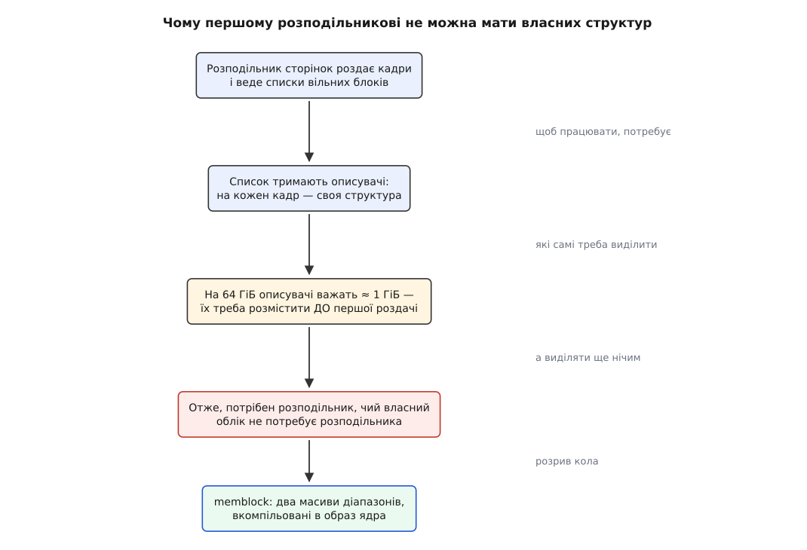
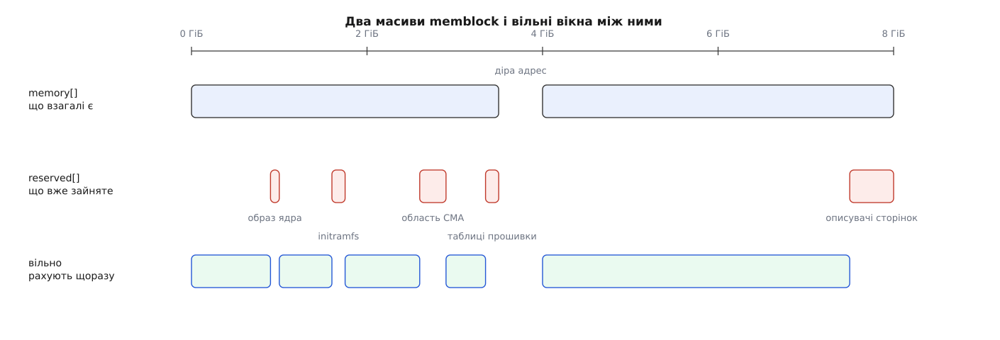
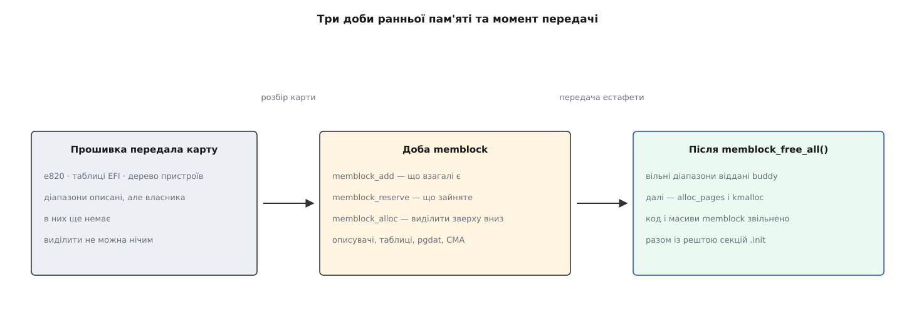

# memblock: пам'ять до того, як з'явився розподільник сторінок

<preknowlist>
- [Сторінки, таблиці сторінок і MMU](topic:unix-linux/paging-and-mmu) — фізична пам'ять нарізана на кадри однакового розміру, звично по 4 КіБ.
- [Фізичні сторінки в ядрі](topic:unix-linux/physical-page-allocator) — головний розподільник кадрів: зони, блоки за порядками, списки вільного.
- [Ланцюг завантаження](topic:unix-linux/boot-chain) — хто передає ядру керування й що встигає покласти в пам'ять до того.
- [Завантажувач і командний рядок ядра](topic:unix-linux/bootloader-and-cmdline) — як у пам'яті опиняються образ ядра, initramfs і рядок параметрів.
</preknowlist>

Ядро розпакувалося й виконує свої перші інструкції. У машині 64 гігабайти пам'яті, і ядро про це навіть знає — прошивка залишила опис. Найперше, що йому треба зробити, — виділити трохи пам'яті під власні таблиці. І тут з'ясовується незручне: виділяти нічим.

Річ не в тім, що потрібну функцію ще не встигли викликати. Річ у тім, що розподільник сторінок веде облік у структурах, які самі лежать у пам'яті. На кожен кадр — свій описувач (`struct page`), і в ньому тримаються лічильник посилань, прапорці стану й місце в списках. Описувач важить близько 64 байтів, кадр — 4096; отже, описувачі з'їдають рівно одну шістдесят четверту всієї пам'яті. Для 64 ГіБ це 16.8 мільйона кадрів і **гігабайт** описувачів. Щоб покласти кудись гігабайт, потрібен розподільник. Щоб запрацював розподільник, потрібен цей гігабайт.



*Коло замикається на описувачах кадрів; розірвати його може лише розподільник, чиї власні структури не треба нізвідки брати.*

Вихід один: перший розподільник мусить обходитися майже без власного обліку — таким, чиї структури вміщаються в самому образі ядра, вже завантаженому в пам'ять кимось іншим. Саме таким є `memblock`.

## Що ядро знає про пам'ять у цю мить

Знання приходить ззовні й має форму списку діапазонів. На x86 це карта `e820`, успадкована ще від переривання BIOS і нині заповнювана з таблиць [UEFI](topic:unix-linux/uefi-firmware); на ARM і RISC-V — вузли `/memory` у [дереві пристроїв](topic:unix-linux/device-tree). Формати різні, суть однакова: перелік «від такої фізичної адреси стільки байтів, тип такий-то». Типи важать: придатна пам'ять, зайнята прошивкою, таблиці ACPI, збійна.

Пам'ять у цій карті не суцільна. Між банками зяють діри: діапазони адрес, віддані під вікна пристроїв на шині, під саму прошивку, під нічого. Тому «скільки пам'яті» і «до якої адреси вона тягнеться» — різні числа, і друге може бути вдесятеро більше за перше.

Але карта каже лише, яка пам'ять **придатна**. Вона не каже, яка з неї **порожня**, — а порожня далеко не вся. У пам'яті вже лежить образ самого ядра. Поруч лежить [initramfs](topic:unix-linux/initramfs), який завантажувач приніс окремим шматком. Лежить дерево пристроїв або таблиці ACPI. Лежать перші таблиці сторінок, які склав розпакувальник, щоб узагалі виконати ядро. Кожне з цього — придатна пам'ять за картою прошивки й смертельно зайнята за суттю.

Отже, облік мусить розрізняти дві незалежні речі: що взагалі існує і що з цього вже комусь належить.

## Найпростіший облік, який ще годиться

`memblock` тримає рівно два масиви діапазонів. У `memblock.memory` потрапляє все, що існує; у `memblock.reserved` — усе, що зайняте. Обидва масиви впорядковані за адресою, сусідні діапазони з однаковими властивостями зливаються. Кожен запис — чотири поля: початкова фізична адреса, розмір, прапорці й номер вузла [NUMA](topic:programming/numa).

Вільна пам'ять у цій схемі не зберігається ніде. Вона обчислюється: одночасний прохід двома впорядкованими масивами дає вікна, які є в першому й не перекриті другим. Виділення — це дописування діапазону в `reserved`. Звільнення — вирізання дірки з нього.



*Вільного списку немає взагалі — вільне щоразу народжується як різниця двох упорядкованих масивів.*

Головне тут — на що припадає вартість. Обидва масиви ростуть не від кількості кадрів, а від кількості **діапазонів**, а діапазонів у типовій машині кілька десятків: банки пам'яті, образ ядра, initramfs, кілька ділянок прошивки. Мільйони кадрів у цих числах не з'являються ніде.

Природна альтернатива — бітова карта, по одному біту на кадр: одиниця означає «зайнято». Для 64 ГіБ це лише два мегабайти, і сама по собі така карта дешева. Дорого інше. По-перше, ці два мегабайти теж треба десь розмістити — тобто задачу з розміщення хтось мусить розв'язати руками ще до появи розподільника. По-друге, карта покриває **проміжок адрес**, а не наявну пам'ять: там, де банки рознесені по адресному простору далеко, більша частина бітів описує діри. По-третє, її треба ініціалізувати — пройтися й записати, перш ніж стане можливим бодай одне виділення. Саме так і працював попередник `memblock`, розподільник `bootmem`; шлях від бітової карти до масивів діапазонів зайняв майже двадцять років і закінчився повним видаленням старого коду — [як це відбувалося](topic:unix-linux/memblock-early-memory/hist-bootmem-to-memblock.md).

## Резервування — єдиний захист

Варто зупинитися на тому, що означає запис у `reserved`. Нічого в залізі не боронить ядру записати нулі поверх initramfs: це звичайна пам'ять за звичайними адресами, і MMU її не стереже. Єдине, що її захищає, — присутність відповідного діапазону в масиві `reserved`, бо саме туди дивиться пошук вільного вікна.

Тому робота раннього коду зводиться до одного: назвати вголос усе, що вже зайняте. Образ ядра резервують за межами `_text`…`_end`, відомими з таблиці символів. `initramfs` — за адресою й довжиною, які передав завантажувач. Таблиці прошивки — за їхнім описом у карті. Ділянку під аварійне ядро — за параметром `crashkernel=`. Вузли `reserved-memory` в дереві пристроїв — бо туди виробник плати поклав буфери, до яких ходить відеокодер або радіомодем. Забуте резервування не падає одразу: воно тихо стає псуванням чужих даних через півхвилини роботи, коли ту саму пам'ять уже роздали комусь ще.

> 🔧 **Навіщо це.** Коли на вбудованій платі відео «розсипається» після кількох секунд роботи, а той самий образ на іншій платі живе нормально, першим ділом дивляться на резервування. Буфер, який виробник описав вузлом `reserved-memory` в дереві пристроїв цієї плати, у вашому дереві може бути відсутній — тоді ядро вважає цю пам'ять вільною, роздає її під сторінковий кеш, і кодер пише поверх нього. Виправлення тут — не в драйвері, а в описі пам'яті, і зробити його можна лише до передачі естафети.

Крім самого факту зайнятості, діапазон несе прапорці. Найцікавіший — `MEMBLOCK_NOMAP`: пам'ять існує, але не має потрапити в пряме відображення ядра. Так позначають ділянки, якими розпоряджається прошивка, або захищені області довіреного середовища. Наслідок далекосяжний: такі кадри не потрапляють у пряме відображення, тож звичайний шлях звернення до них просто не існує; розподільникові сторінок їх не віддають, а драйвер, якому вони потрібні, мусить відображати їх окремо, як вікно пристрою. Питання «чи це відображена пам'ять» стає окремим і перестає збігатися з питанням «чи існує описувач для цієї адреси» — на arm64 для нього тримають окрему перевірку.

## Як вибирається місце

Виділення — це пошук вікна потрібного розміру серед різниці двох масивів. Але серед кількох придатних вікон треба вибрати одне, і вибір тут не байдужий.

Типово `memblock` шукає **згори вниз**, від найвищих адрес. Причина в дефіциті: низькі адреси — рідкісний ресурс. Старі пристрої вміють адресувати лише перші 16 МіБ або перші 4 ГіБ, і пам'ять під них колись доведеться брати саме звідти. Рання ж пам'ять потрібна ядру назавжди — описувачі й таблиці ніхто не поверне. Класти вічне в дефіцитне було б марнотратством, тому вічне кладуть якнайвище.

Другий обмежувач — `current_limit`. На самому початку ядро бачить не всю пам'ять: пряме відображення ще не побудоване, і звернутися можна лише до перших кількох сотень мегабайтів. Виділяти вище за цю межу безглуздо — до результату не дотягнутися. Спочатку стелі формально немає взагалі, але архітектурний код одразу опускає її до реально відображеної пам'яті й піднімає далі в міру того, як таблиці прямого відображення розростаються.

**Запит: 2 МіБ із вирівнюванням на 2 МіБ у вікні 4.00–7.50 ГіБ, згори вниз**

```
вікно     = [0x1_0000_0000 … 0x1_E000_0000)
size      = 0x20_0000                       (2 МіБ)
align     = 0x20_0000
кандидат  = (кінець − size) & ~(align − 1)
          = (0x1_E000_0000 − 0x20_0000) & ~0x1F_FFFF
          = 0x1_DFE0_0000
кандидат ≥ початку вікна  →  так
memblock_reserve(0x1_DFE0_0000, 0x20_0000)
```

Результат такого пошуку — фізична адреса. Варіант `memblock_alloc()` додатково перекладає її у віртуальну адресу прямого відображення й занулює ділянку, щоб виклик поводився як звичний `malloc`; варіант `memblock_phys_alloc()` віддає фізичну адресу як є — саме її чекають ті, хто далі будуватиме таблиці сторінок.

Третій вимір вибору — вузол NUMA. Кожен діапазон знає свій вузол, і виділення можна попросити з конкретного: структури, що описують вузол, мають лежати на ньому самому, інакше кожне звернення до них ходитиме через міжпроцесорний зв'язок усе життя системи. Якщо на потрібному вузлі місця немає, пошук розширюється на решту.

Зворотний режим, **знизу вгору**, вмикають там, де вічне не можна класти високо: коли верхні вузли пам'яті мають лишитися придатними до від'єднання на ходу, ранні виділення туди зіпсували б усю затію, бо їх ніколи не пересунути. Тоді `memblock` тулить виділення до образу ядра знизу.

## Коли масивів не вистачає

Масиви статичні, вкомпільовані в образ; типово в кожному 128 записів. Діапазонів звично менше, але не завжди: машина з десятками вузлів NUMA, платою з довгим списком `reserved-memory` або сильно порізаною картою прошивки може вийти за межу.

Розв'язок гарний своєю нахабністю. Коли масив заповнюється, `memblock` виділяє **сам собі** вдвічі більший масив — звичайним своїм пошуком вільного вікна, — копіює туди записи й резервує нове місце. Старий масив після першого подвоєння просто кидають: він лежить у даних образу, які й так звільнять разом із рештою коду ініціалізації. Кожен наступний масив memblock виділив уже сам собі, тож його, навпаки, повертає звичайним звільненням.

Працює це не завжди, і межа чітка. Поки пряме відображення ще не покриває достатньо пам'яті, нового масиву нікуди покласти — тож зростання дозволено лише після окремого виклику, яким архітектурний код заявляє, що момент настав. До цієї миті ранній код зобов'язаний уміститися в статичну межу; перевищення тут — не збій виділення, а негайна зупинка з повідомленням про переповнення.

## Хто споживає ранню пам'ять

Найбільший споживач уже названий — масив описувачів кадрів. Він же й найхитріший: у сучасних ядрах його не кладуть одним шматком, а розбивають на секції та проєктують в окремий діапазон віртуальних адрес, щоб діри у фізичній пам'яті не коштували описувачів; ця [модель фізичної пам'яті](topic:unix-linux/sparsemem-and-vmemmap) сама будується через `memblock`.

Решта черги приблизно така: таблиці сторінок прямого відображення; структури, що описують вузли й [зони](topic:unix-linux/physical-page-allocator); ранні ділянки на кожен процесор; копії таблиць прошивки, які треба зберегти до того, як їхню пам'ять перевикористають; області [CMA](topic:unix-linux/cma-contiguous-allocator); [великі сторінки](topic:unix-linux/huge-pages), замовлені параметром командного рядка. Спільне в усіх: вони потрібні або самому розподільникові сторінок, або вимагають суцільності, якої після його запуску вже не дістати.

## Передача естафети

Коли описувачі створені й зони описані, архітектурний код викликає `memblock_free_all()`. Виклик проходить різницю двох масивів і кожен вільний діапазон віддає розподільникові сторінок — не по одному кадру, а найбільшими вирівняними блоками, які з нього виходять, щоб у списках вільного одразу були високі порядки. Це буквально та мить, коли списки вільного вперше наповнюються: доти вони порожні.



*До передачі виділяє тільки memblock, після неї — тільки звичайний розподільник; самого memblock у пам'яті вже немає.*

Відразу по тому в журналі з'являється рядок `Memory: … available`, у якому видно різницю між установленою пам'яттю та відданою розподільникові: усе, що лишилося в `reserved`, до нього не потрапило й не потрапить.

А далі відбувається останнє. Код `memblock` і його статичні масиви живуть у секціях, позначених як [потрібні лише під час ініціалізації](topic:unix-linux/init-sections), і ядро звільняє їх разом з усім таким кодом — рядок `Freeing unused kernel image (initmem) memory`. Виклик `memblock_alloc()` після цієї миті був би стрибком у пам'ять, яку вже роздали комусь іншому. Тому доба `memblock` не просто закінчується — вона фізично зникає.

Деякі архітектури, зокрема arm64 і powerpc, лишають масив `memory` жити далі окремою настройкою збірки: їм потрібно й через годину роботи спитати «чи це взагалі пам'ять, чи вікно пристрою». Там же, де масиви лишилися, з'являється і їхнє зображення у `debugfs`.

> 🔧 **Навіщо це.** Коли на машині з 64 ГіБ `MemTotal` показує 62.5, різниця — це не «накладні витрати ядра» загалом, а конкретні діапазони, які не дійшли до розподільника: описувачі, ділянка під аварійне ядро, буфери прошивки. Вони перелічені поіменно, і кожен можна пояснити — а якщо не можна, це вже причина шукати зайве резервування.

## Що з цього лишається видно

Слідів чотири, і кожен відповідає на своє питання. Рядок `Memory: … available` у журналі каже, скільки взагалі дійшло до розподільника. Файл `/proc/iomem` показує підсумкову розкладку фізичних адрес уже за іменами власників. Каталог `/sys/kernel/debug/memblock` — там, де масиви збережено, — показує самі діапазони так, як їх бачив ранній код. А параметр командного рядка `memblock=debug` змушує друкувати кожне додавання, резервування й виділення з іменем того, хто його зробив; це головний інструмент, коли пам'ять зникає невідомо куди ще до першого процесу. Точні імена викликів, прапорців і файлів зібрані окремо — [інтерфейс memblock](topic:unix-linux/memblock-early-memory/api-memblock-interfaces.md); а прочитати ці діапазони й порахувати вільні вікна власною програмою можна за [розбором на живій системі](topic:unix-linux/memblock-early-memory/proj-read-memblock.md).

Але важливіший слід — не в файлах. У добі `memblock` ухвалюються рішення, які потім нікому не перепідписати: скільки віддати під CMA, скільки під аварійне ядро, які області ніколи не потраплять у пряме відображення, скільки великих сторінок зарезервувати назавжди. Усі вони вимагають суцільної фізичної пам'яті — а суцільність існує лише доти, доки пам'ять ще не розсипано на кадри й не роздано всім охочим. Саме тому такі речі задаються параметрами завантаження, а не файлами в `/proc`: після передачі естафети просити вже нема в кого.
