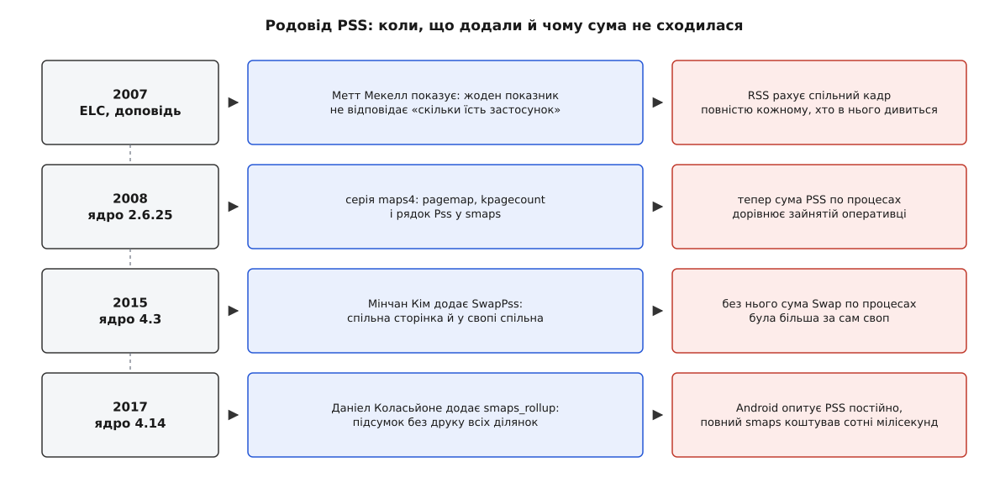

# 📜 Як народився PSS: облік, у якому сума нарешті зійшлася

До весни 2008 року в Linux не існувало жодного числа про пам'ять процесу, яке можна було б додати по всіх процесах і дістати щось осмислене. Історія PSS — це історія трьох окремих спроб полагодити саме цю ваду, і щоразу причина була однакова: підсумок по процесах не збігався з тим, скільки пам'яті насправді зайнято в машині.

## 2007: питання, на яке система не вміла відповісти

Проблема була не академічна. Настільна машина 2007 року мала гігабайт-два оперативної пам'яті й своп на диску, тож похибка в обліку коштувала трохи гальмування. А ось кишеньковий пристрій із 32 чи 64 мебібайтами й без свопу платив за ту саму похибку відразу: інженер мусив вирішити, чи влізе застосунок у бюджет, і не мав інструмента, щоб це порахувати. Саме тому Метт Мекелл (Matt Mackall; згодом Olivia Mackall — патчі тих років підписані попереднім іменем) поніс свою доповідь на Embedded Linux Conference навесні 2007 року, а не на якусь із загальних кернельних зустрічей. Джонатан Корбет переказав ту доповідь у LWN 18 квітня 2007 року, і його формулювання було безжальне: числа, які ядро тоді віддавало назовні, майже нічого не означають.

Розберімо, чому воно було саме таке безжальне. Питання «скільки пам'яті їсть цей застосунок» здається одним, а насправді розпадається на два різні, і жоден із наявних показників не відповідав ні на одне з них.

Перше питання — бюджетне: якщо запустити десять таких застосунків, скільки треба мікросхем? RSS на нього не відповідає, бо кожен процес зараховує собі спільний кадр повністю. Код `libc` присутній у пам'яті в одному примірнику, а в RSS двадцяти процесів він з'являється двадцять разів. Просумуйте RSS — і дістанете число, більше за фізичну пам'ять машини, іноді в півтора-два рази.

Друге питання — вивільнювальне: якщо цей процес убити, скільки пам'яті повернеться? RSS не відповідає й на нього, тепер уже помиляючись у протилежний бік: більшість зарахованих йому кадрів після смерті процесу нікуди не подінеться, бо в них дивляться інші.

Один показник, дві задачі, і в кожній він бреше в свій бік. Ось із чого все почалося.

## Чим обходилися до того

Практика тих років була не так вимірюванням, як ремеслом віднімання. Найпоширеніший спосіб: запустити систему без застосунку, подивитися вільну пам'ять, запустити із застосунком, подивитися ще раз, відняти. Спосіб чесний, але дає одне число на весь запуск, вимагає перезавантаження, не працює, коли застосунків треба порівняти двадцять, і повністю розсипається, щойно два з них ділять одну бібліотеку — бо другий «коштує» менше за перший тільки тому, що перший уже заплатив за спільне.

Другий шлях — читати `/proc/<pid>/maps` і рахувати руками, знаючи, яка ділянка звідки взялася: ця з `libc`, отже спільна, ця анонімна, отже своя. Знання про те, що коли спільне, лежало в голові інженера, а не в даних. Файл `smaps` на той час уже існував і давав розклад по ділянках, але й він мовчав про головне — скільки ще процесів дивиться в ті самі кадри.

Був і справжній інструмент: `exmap` — набір із модуля ядра й програми в просторі користувача, який власне й рахував розподілену частку спільних сторінок; в обговоренні статті LWN на нього одразу вказали, разом із консольним варіантом `exmap-console`, зробленим під вбудовані системи. Але модуль ядра, який треба зібрати під свою збірку й завантажити, — це не той інструмент, який просто беруть і застосовують на кожному пристрої. Проблема була визнана, розв'язок існував збоку, а в самому ядрі його не було.

## Ідея: ділити кадр між тими, хто в нього дивиться

Мекелл запропонував рахувати частками. Якщо в кадр дивляться `n` процесів, кожному з них зараховуємо не кадр, а `1/n` кадра. Сума таких часток по всіх процесах, що ділять кадр, дорівнює рівно одному кадру — хоч скільки їх буде. Показник назвали *proportional set size*, PSS.

```
PSS(процес) = Σ  розмір_сторінки / mapcount(кадр)
              по всіх сторінках процесу, що мають кадр

кадр 4 КіБ, у нього дивляться 3 процеси:
  RSS кожному:  4 КіБ  →  разом нарахували 12 КіБ (кадр один!)
  PSS кожному:  4/3 = 1.333 КіБ  →  разом 4 КіБ  ✓
```

Уся сила ідеї — в тому рядку з галочкою. PSS — єдиний із показників процесу, для якого справджується проста властивість: сума по всіх процесах системи дорівнює обсягу зайнятої ними фізичної пам'яті. Не приблизно, а точно, бо кожен кадр роздали цілим, тільки шматочками. Питання «чи влізе двадцять таких» нарешті дістало число, яке можна додавати.

Тут же, у тій самій доповіді, з'явився і другий показник — *unique set size*, USS: сума лише тих сторінок, у які не дивиться більше ніхто. Він відповідає на друге з двох питань: стільки пам'яті звільниться, якщо процес убити. Два питання — два числа, і кожне чесне у своїй ролі.

Мекелл показував це не на схемі, а на живому процесі — вебпереглядачі Galeon. Віртуальний розмір 105 МіБ, RSS 41 МіБ, PSS 26 МіБ, USS 20 МіБ. Чотири числа про один процес, і розкид між ними вп'ятеро. З них видно все: сорок мебібайтів «присутні», з них двадцять шість — справедлива частка цього процесу в машині, а звільниться після його смерті лише двадцять.

## Що довелося доробити в ядрі

Ідея проста, а її втілення впиралося в те, що процес не знає, скільки ще хто дивиться в його кадри. Цю відповідь має тільки ядро: лічильник відображень (`mapcount`) живе в описі фізичної сторінки, і дістатися до нього ззовні не було чим.

Тому серія Мекелла додавала не один рядок у `smaps`, а цілий поверх спостереження за пам'яттю в [псевдофайловій системі](topic:unix-linux/proc-filesystem) `/proc` — тій самій, де ядро віддає свій стан звичайними файлами:

- `/proc/<pid>/pagemap` — двійковий файл, у якому для кожної сторінки процесу лежить номер фізичного кадру. Маючи його для двох процесів, можна просто перетнути множини й побачити, що саме в них спільне;
- `/proc/kpagecount` і `/proc/kpageflags` — загальносистемні таблиці, у яких для кожного кадру записано, скільки на нього посилань і які в нього прапорці;
- і вже поверх цього — рядок `Pss` у `/proc/<pid>/smaps`, порахований ядром відразу, щоб типовий випадок не вимагав від програми обходити всю фізичну пам'ять.

Серія доходила до ядра не з першого заходу: злиті коміти підписані префіксом `maps4:` — тобто це щонайменше четверта редакція набору. Наприкінці, 5 лютого 2008 року, у дерево лягли одразу кілька комітів цієї серії: перегрупування `task_mmu.c`, перехід обходу таблиць сторінок на спільний «прохідник» сторінок, інтерфейс `pagemap` — і серед них комміт «maps4: add proportional set size accounting in smaps» за авторством Фенгуана Ву (Fengguang Wu). Тобто ідея та архітектура серії — Мекелла, а власне лічильник PSS у `smaps` дописала інша людина всередині тієї самої серії; це звичайний для ядра спосіб роботи, а не суперечка про авторство.

Усе це вийшло в ядрі 2.6.25 — 16 квітня 2008 року. Від доповіді до релізу минув рівно рік.

## Чому першими вхопилися мобільні платформи

Далі сталося те, що з ідеями трапляється рідко: показник підхопили не там, де його придумали, а там, де він був потрібен найдужче.

Android будується довкола [`fork` без `exec`](topic:unix-linux/fork-semantics): кожен застосунок народжується як копія прогрітого процесу-заготовки, і тому ділить із ним увесь код середовища виконання та бібліотеки. Після [копіювання при записі](topic:unix-linux/copy-on-write) спільними лишаються десятки мебібайтів на процес. RSS у такій системі не просто неточний — він систематично й сильно завищений для кожного застосунку, і сума по всіх дає число, у яке пристрій ніяк не влазить. Питання «чий застосунок з'їв телефон» без PSS не має відповіді взагалі.

Тож в AOSP з'явилася утиліта `procrank`, і її заголовок стовпчиків читається як пряма цитата з тієї доповіді:

```
printf("%8s %7s %7s %7s ", "Vss", "Rss", "Pss", "Uss");
```

Файли `procrank` позначені 2008 роком — тобто інструмент з'явився фактично одночасно з появою самого показника в ядрі. Та сама четвірка чисел згодом пішла в системний екран «Пам'ять» на телефоні: коли Android показує користувачеві, скільки їсть застосунок, він показує PSS.

На настільних системах показник теж дістав свою утиліту — `smem`, яка зводить RSS, PSS і USS в одну таблицю й потребує ядра приблизно від 2.6.27; лежить вона на `selenic.com`, тобто на сайті самого Мекелла (там-таки живе його `Mercurial`). Але масовим PSS зробили саме телефони.

## 2015: своп ламає ту саму суму знову

Через сім років виявилося, що властивість «сума сходиться» тримається лише доти, доки нічого не витіснено.

Коли ядро [витісняє](topic:unix-linux/swap-and-reclaim) сторінку у своп, вона зникає з таблиць сторінок і з RSS, зате з'являється в рядку `Swap` файлу `smaps`. Але анонімна сторінка теж буває спільною — після `fork` двоє процесів дивляться в один анонімний кадр, і у своп він поїде один. А в `Swap` він порахується обом повністю. Виходила та сама вада, від якої лікували RSS, тільки перенесена на своп: сума `Swap` по процесах більша за реально зайнятий своп.

Мінчан Кім (Minchan Kim) додав рядок `SwapPss` — пропорційну частку виштовхнутих сторінок, поділену так само, як `Pss` ділить присутні. Коміт ліг у дерево 8 вересня 2015 року й вийшов у ядрі 4.3 (1 листопада 2015). Мотивація в описі патча названа прямо: щоб рахувати робочу множину процесу для розумного керування пам'яттю з простору користувача — там, де своп не диск, а стиснена область в оперативці, і кожен мебібайт свопу коштує реальної пам'яті. За такого свопу похибка обліку перестає бути звітною дрібницею й перетворюється на неправильно ухвалене рішення.

## 2017: правильне число, за яке немає чим платити

Третій крок стосувався не правильности, а ціни.

Щоб дізнатися PSS процесу, треба прочитати `/proc/<pid>/smaps` — а це означає, що ядро для кожної ділянки карти обійде її таблиці сторінок і надрукує півтора десятка рядків тексту. У процесі з тисячами відображень друк починає коштувати більше, ніж сам обхід. Android же опитує PSS усіх процесів постійно — саме на цих числах він вирішує, кого тримати в пам'яті, а кого прибрати.

Даніел Коласьйоне (Daniel Colascione) додав `/proc/<pid>/smaps_rollup` — той самий обхід, але з одним підсумком на весь процес замість розкладу по ділянках. В описі патча наведений вимір на реальному процесі:

```
1000 читань /proc/<pid>/smaps          ≈ 29.46 с
1000 читань /proc/<pid>/smaps_rollup   ≈  4.39 с
                            приблизно  ≈  6.7 ×
```

Коміт ліг у дерево 7 вересня 2017 року й вийшов у ядрі 4.14 (12 листопада 2017). Мотивація в тексті патча названа без евфемізмів: Android регулярно опитує пам'ять процесів, і для великих процесів кожне таке опитування коштувало сотні мілісекунд.



*Три доробки за десять років — і під кожною те саме: сума по процесах не збігалася з фізичною реальністю.*

## Що з цієї історії насправді видно

Три кроки — 2008, 2015, 2017 — зроблені різними людьми з різних приводів, але з однієї причини. Показник пам'яті процесу вважають корисним доти, доки з нього можна скласти правду про машину; щойно сума перестає сходитися, показник доводиться лагодити. Спершу для присутніх сторінок, потім для витіснених, потім — щоб за правильну суму не доводилося платити відчутним часом.

Варто, однак, назвати й межу цієї ідеї, бо історія на ній не закінчується. PSS — домовленість, а не закон природи. Фізично кадр не ділиться на три; ділення `1/n` — це рішення розподілити спільну вартість порівну, і воно правильне рівно настільки, наскільки правильне припущення «всі співвласники рівні». Убийте два процеси з трьох — звільниться нуль, а не дві третини кадра, хоч PSS обіцяв кожному по третині. Тому PSS чудово відповідає на питання про бюджет («скільки коштує тримати цей набір процесів») і зовсім не відповідає на питання про звільнення («скільки дасть убивство ось цього») — там працює USS і приватна брудна частина.

Друга межа глибша: PSS ділить між процесами, а спільне в системі належить не тільки процесам. Кеш сторінок, буфери ядра, сторінкові таблиці самі по собі — усе це витрачена пам'ять, якої в сумі PSS немає взагалі. Саме звідси й виріс інший, ортогональний підхід — рахувати не процес, а [контрольну групу](topic:unix-linux/cgroups): кадр записують тій групі, чий процес торкнувся його першим, кожен кадр рівно один раз, разом із кешем і накладними витратами ядра. Це не покращений PSS, це відповідь на інше запитання — не «яка чия частка», а «скільки коштує ось це навантаження цілком».

Обидва підходи живі, обидва потрібні, і жоден не скасовує того, з чого все почалося: у 2007 році на питання «скільки їсть цей застосунок» система не вміла відповісти взагалі.

---

**Статус доказовости.** Доповідь на ELC 2007 і показники Galeon (105 / 41 / 26 / 20 МіБ), а також згадки `exmap` і `exmap-console` — за статтею Джонатана Корбета в LWN від 18 квітня 2007 року та обговоренням під нею. Авторство, дати й формулювання комітів (`maps4:` — 5 лютого 2008; `SwapPss` — 8 вересня 2015; `smaps_rollup` — 7 вересня 2017, з наведеними в патчі вимірами) звірені за історією дерева Linux; дати релізів 2.6.25, 4.3 і 4.14 — 16 квітня 2008, 1 листопада 2015 і 12 листопада 2017 відповідно. Рядок заголовків `procrank` і рік у шапці файлу — за джерелами AOSP. Те, що серія проходила редакції `maps2` і `maps3`, — обґрунтоване виведення з префікса `maps4:` у злитих комітах, а не окремо перевірений факт. `smem` розміщено на `selenic.com`, домені Мекелла, — авторство з цього випливає, але прямо на сторінці не підписане.
