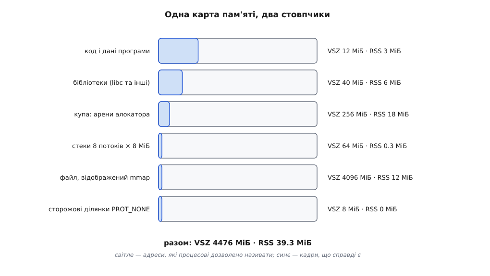
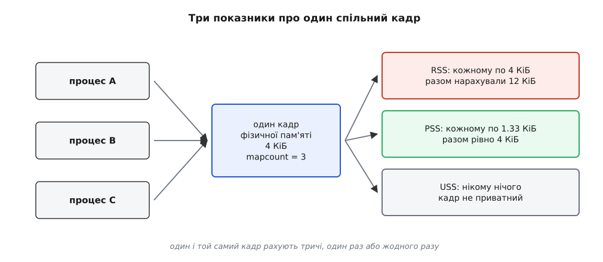
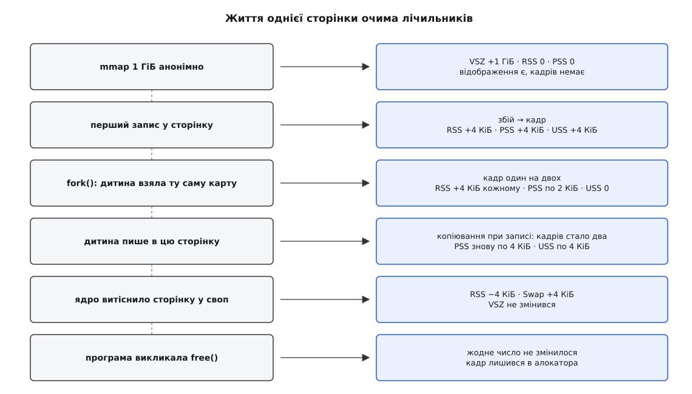

# Як міряти пам'ять процесу: VSZ, RSS, PSS

<preknowlist>
- [Віртуальний адресний простір процесу](topic:unix-linux/virtual-address-space) — процес бачить власний набір адрес, поділений на ділянки відображення; адреса в програмі не є номером комірки в мікросхемі.
- [Сторінки, таблиці сторінок і MMU](topic:unix-linux/paging-and-mmu) — переклад іде посторінково (типово по 4 КіБ), і сторінка простору процесу або вказує на кадр фізичної пам'яті, або ні на що.
- [Сторінковий збій](topic:unix-linux/page-fault) — кадр з'являється лише тоді, коли до сторінки вперше торкнулися: доти відображення є, а пам'яті немає.
- [Копіювання при записі](topic:unix-linux/copy-on-write) — після `fork` два процеси дивляться в один кадр, і лише запис розводить їх по різних.
- [mmap: файл і пам'ять як одне](topic:unix-linux/mmap-model) — сторінки бувають підперті файлом, і тоді один кадр обслуговує всіх, хто відобразив цей файл.
</preknowlist>

## Сума, що більша за машину

На ноутбуці з 16 ГіБ оперативної пам'яті спитаймо систему, скільки її забрали всі процеси разом:

```
$ ps -eo rss= | awk '{s += $1} END {printf "%.1f ГіБ\n", s/1024/1024}'
23.7 ГіБ
```

Двадцять чотири гігабайти на шістнадцятигігабайтній машині — при тому, що своп майже порожній і ніщо не гальмує. Той самий фокус з іншим стовпчиком виходить іще виразнішим:

```
$ ps -eo vsz= | awk '{s += $1} END {printf "%.1f ГіБ\n", s/1024/1024}'
412.9 ГіБ
```

Чотириста гігабайтів там, де фізично є шістнадцять. Система не помилилася й не збрехала: обидва числа вона порахувала чесно й за чіткими правилами. Просто питання, яке ми їй поставили — «скільки пам'яті займає процес» — звучить осмислено, а насправді не має єдиної відповіді.

Причина не в тому, що ядро погано міряє. Причина в тому, що між числом-адресою всередині програми й мікросхемою пам'яті лежить кілька незалежних шарів, і слово «займає» стосується різних шарів по-різному. Розберімо, що взагалі можна порахувати, — і кожен зі стовпчиків стане не загадкою, а відповіддю на конкретне вузьке питання.

## Чотири незалежні запитання про одну сторінку

Візьмімо один шматочок адресного простору завбільшки зі сторінку — скажімо, адреси від `0x7f2a4c001000` до `0x7f2a4c002000`. Що про нього взагалі можна дізнатися?

**Перше: чи є для цих адрес відображення?** Ядро тримає список ділянок (англ. *virtual memory area*, VMA) — діапазонів адрес, які процесові дозволено називати. Якщо адреса потрапляє в якусь ділянку, звернення до неї законне; якщо ні — процес дістане сигнал `SIGSEGV`. Це питання про **дозвіл**, а не про пам'ять: ділянка може існувати роками й не коштувати жодного байта оперативної пам'яті.

**Друге: чи стоїть за сторінкою кадр прямо зараз?** Ділянка є, дозвіл є — але запис у таблиці сторінок може бути порожній, бо до сторінки ще не торкалися або бо ядро забрало кадр назад. Це питання про **присутність в оперативці**, і воно зовсім не випливає з першого.

**Третє: скільки ще хто дивиться в цей самий кадр?** Той самий фізичний кадр буває вписаний у таблиці кількох процесів одразу — код `libc` виглядає саме так у кожному процесі системи. Це питання про **винятковість володіння**, і воно теж незалежне: кадр може бути присутнім і спільним, присутнім і приватним.

**Четверте: чи є в цього кадру запасна копія деінде?** Сторінка коду прочитана з файлу на диску, і той файл нікуди не подівся; сторінка щойно вирахуваних даних не існує ніде, крім цього кадру. Це питання про **вартість звільнення**: чисту файлову сторінку ядро викидає миттєво, брудну анонімну мусить спершу записати у своп.

Чотири факти, і жоден з них не виводиться з решти. Тому й не існує одного числа, яке описало б стан сторінки, — потрібні кілька проєкцій, кожна зі своєю логікою. Стовпчики `ps`, поля `top` і рядки в `/proc` — це і є ті проєкції; питання лише в тому, яку з них дивитися під конкретне завдання.

## VSZ: скільки адрес процесові дозволено називати

Найпростіший показник рахує лише перше з чотирьох запитань. Ядро проходить списком ділянок процесу, додає їхні довжини — і отримує розмір адресного простору. `ps` показує його в стовпчику `VSZ` (від англ. *virtual size*), `top` — як `VIRT`, `/proc/<pid>/status` — рядком `VmSize`, і всюди це одне й те саме число `mm->total_vm`, помножене на розмір сторінки.

Ключове тут просте, але його раз у раз ігнорують: **VSZ не міряє пам'ять**. Він міряє довжину карти. Ділянка, до якої жодного разу не торкнулися, входить у VSZ повністю й не коштує при цьому нічого, крім кількох десятків байтів на опис самої ділянки в ядрі.

Ось звідки в буденній програмі беруться гігабайти віртуального розміру:

- **Арени алокатора.** Багатопотокова програма на glibc отримує кілька незалежних арен, щоб потоки не билися за один замок; кожну арену алокатор бере в ядра шматком по 64 МіБ і заселяє поступово. Вісім арен — це 512 МіБ у VSZ і, можливо, 10 МіБ справжніх даних. Звідки алокатор бере ці шматки й чому саме такими, розібрано окремо: [brk і mmap як два джерела купи](topic:unix-linux/allocator-and-kernel).
- **Стеки потоків.** Кожному потокові за замовчуванням резервується 8 МіБ адрес, а торкається він зазвичай кількох кілобайтів. Сорок потоків — 320 МіБ VSZ і майже нуль реальної пам'яті. Про те, чому потік у Linux має власний стек, але спільну карту, — [потоки як задачі](topic:unix-linux/threads-as-tasks).
- **Відображені файли.** `mmap` чотиригігабайтного файлу додає до VSZ рівно чотири гігабайти, скільки б із них ми не прочитали.
- **Сторожові ділянки.** Між стеками й довкола арен ставлять сторінки з правами `PROT_NONE` — вони існують саме для того, щоб у них не можна було записати. У VSZ вони входять.
- **Тіньова пам'ять інструментів.** Програма, зібрана з `AddressSanitizer`, резервує під тіньову карту двадцять із гаком терабайтів адрес. VSZ такої програми — двадцять терабайтів; реальної пам'яті — стільки ж, скільки й без санітайзера, плюс тінь під ті сторінки, яких програма справді торкнулася.



*Одна й та сама карта пам'яті: світлим — увесь дозволений діапазон адрес, синім — та його частина, за якою справді стоять кадри. Сумарна різниця тут стократна.*

Отже, VSZ марний для питання «скільки в машині лишилося пам'яті». Але він не марний узагалі — просто відповідає на своє питання: **скільки адресного простору витрачено**. А адресний простір — теж ресурс, і подекуди дефіцитний.

На 32-бітній системі процесові доступні лише 3 ГіБ адрес, і `mmap` там повертає помилку задовго до того, як скінчиться фізична пам'ять — просто тому, що в карті не лишилося суцільної діри потрібного розміру. На 64-бітній таке трапляється рідше, зате VSZ обмежують навмисно: `RLIMIT_AS` ставить стелю саме на розмір адресного простору, і програма з витоком відображень (класика — `mmap` без парного `munmap`) упирається в цю стелю, поки ще не з'їла всю оперативку. Механіка лімітів — у темі про [обмеження ресурсів](topic:unix-linux/resource-limits).

> 🔧 **Навіщо це.** Різкий стрибок VSZ без стрибка RSS — майже завжди діагноз, а не шум: або відображення накопичуються й не звільняються, або алокатор наплодив арен під нові потоки. Обидва випадки видно в `/proc/<pid>/maps` за кількістю рядків, і обидва лікуються без здогадів. І навпаки: скарга «мій контейнер займає 20 ТіБ» від людини, що дивиться на VIRT у `top`, вимагає не розслідування, а перемикання стовпчика.

## RSS: скільки кадрів справді закріплено за процесом

Друге запитання — про присутність в оперативці — рахує показник, який `ps` називає `RSS` (від англ. *resident set size*, розмір заселеної множини), `top` — `RES`, а `/proc/<pid>/status` — `VmRSS`.

Механіка проста й через це надійна. Коли [сторінковий збій](topic:unix-linux/page-fault) закінчується тим, що ядро вписує кадр у таблицю сторінок процесу, воно збільшує лічильник у структурі `mm_struct` цього процесу. Коли сторінку відображають назад (`munmap`, витіснення у своп, скидання файлової сторінки) — зменшує. Тобто RSS — це буквально кількість записів у таблицях сторінок, що вказують кудись, помножена на розмір сторінки.

З 2016 року (ядро 4.5) ядро розкладає цю суму на три доданки в `/proc/<pid>/status`:

```
VmRSS:     412536 kB
RssAnon:   298112 kB     ← анонімні сторінки: купа, стеки, MAP_ANONYMOUS
RssFile:   106248 kB     ← сторінки, підперті файлом: код, дані, mmap файлів
RssShmem:    8176 kB     ← спільна пам'ять: tmpfs, SysV shm, MAP_SHARED|ANONYMOUS

VmRSS = RssAnon + RssFile + RssShmem
```

Розклад корисний одразу: `RssAnon` — це те, що при нестачі пам'яті може піти лише у своп; `RssFile` — те, що ядро викине без жодного запису, щойно знадобиться місце.

Ось програма, яка показує зв'язок VSZ і RSS у чотири рухи. Мова тут задана самим предметом: `mmap`, `madvise` і `/proc` — це системні виклики, і писати їх треба тією мовою, якою написаний їхній інтерфейс.

**Резервуємо гігабайт, заселяємо чверть, віддаємо назад:**

```c
#define _GNU_SOURCE
#include <stdio.h>
#include <stdlib.h>
#include <sys/mman.h>
#include <unistd.h>

#define GIB  (1024UL * 1024 * 1024)
#define PGSZ 4096UL

static void report(const char *label)
{
    unsigned long size, resident, shared;
    FILE *f = fopen("/proc/self/statm", "r");
    if (!f || fscanf(f, "%lu %lu %lu", &size, &resident, &shared) != 3) {
        perror("statm");
        exit(1);
    }
    fclose(f);
    printf("%-26s VSZ = %5lu МіБ   RSS = %4lu МіБ\n", label,
           size * PGSZ / (1024 * 1024), resident * PGSZ / (1024 * 1024));
}

int main(void)
{
    report("на старті");

    char *p = mmap(NULL, GIB, PROT_READ | PROT_WRITE,
                   MAP_PRIVATE | MAP_ANONYMOUS, -1, 0);
    if (p == MAP_FAILED) { perror("mmap"); return 1; }
    report("після mmap 1 ГіБ");

    for (unsigned long off = 0; off < GIB / 4; off += PGSZ)
        p[off] = 1;                          /* по одному байту на сторінку */
    report("після запису в 256 МіБ");

    madvise(p, GIB / 4, MADV_DONTNEED);      /* кадри — назад ядру */
    report("після madvise(DONTNEED)");

    munmap(p, GIB);
    report("після munmap");
    return 0;
}
```

```
на старті                  VSZ =     4 МіБ   RSS =    1 МіБ
після mmap 1 ГіБ           VSZ =  1028 МіБ   RSS =    1 МіБ
після запису в 256 МіБ     VSZ =  1028 МіБ   RSS =  257 МіБ
після madvise(DONTNEED)    VSZ =  1028 МіБ   RSS =    1 МіБ
після munmap               VSZ =     4 МіБ   RSS =    1 МіБ
```

Чотири рядки виводу показують чотири окремі речі. `mmap` рухає тільки VSZ. Запис по одному байту в кожну сторінку рухає тільки RSS — і рухає на всі 256 МіБ, хоч даних ми записали 64 кілобайти: одиниця обліку — сторінка, а не байт. `MADV_DONTNEED` віддає кадри, не чіпаючи карти. І лише `munmap` прибирає саму ділянку.

Тепер про те, чому сума RSS усіх процесів перевищила обсяг машини. RSS зовсім не питає, чи належить кадр процесові одноосібно. Кадр із кодом `libc` присутній у таблицях сторінок кожного процесу, тому кожен з них додає ці мегабайти до свого RSS повністю. Двісті процесів — двісті разів. Пам'ять при цьому витрачено один раз.

Помиляється RSS і в інший бік. Своп забирає сторінку з таблиць — RSS падає, хоча програмі ці дані так само потрібні й вона поверне їх першим же зверненням. Виклик `free()` у програмі найчастіше **не** знижує RSS узагалі: алокатор лише позначає блок вільним усередині своєї арени й тримає кадри про запас. І навпаки — RSS іноді падає сам собою, без жодної дії програми, бо ядро під тиском [витіснило](topic:unix-linux/swap-and-reclaim) її чисті файлові сторінки.

Є ще одна тонкість, про яку варто знати заздалегідь, щоб не полювати на привидів. Лічильник RSS оновлюють у гарячому шляху обробки збоїв, тому його зробили пакетним: до ядра 6.2 кожен потік накопичував зміни й зливав їх у спільний лічильник раз на 64 події, а відтоді той самий пакетний облік ведуть лічильники на кожен процесор. Наслідок — `VmRSS` може розходитися з правдою на кілька сотень кілобайтів на потік. Для роздумів «скільки ж воно їсть» це шум; для точного обліку треба брати `smaps`, який рахує проходом по таблицях сторінок і тому не бреше.

## Спільність — не виняток, а норма

Третє запитання — про те, скільки процесів дивляться в один кадр, — легко вважати за екзотику. Насправді спільні кадри становлять помітну частину заселеної пам'яті будь-якої живої системи, і на те є три різні причини, які працюють одночасно.

**Динамічне компонування.** Код `libc`, `libssl`, `libstdc++` завантажують у пам'ять один раз і відображають у кожен процес, що їх потребує. Механіка — у темі про [статичне й динамічне лінкування](topic:unix-linux/static-and-dynamic-linking); наслідок для обліку той, що ці мегабайти чесно присутні в RSS кожного процесу й фізично існують в одному примірнику.

**Розмноження процесів.** Після [`fork`](topic:unix-linux/fork-semantics) дитина й батько ділять **усі** кадри, доки не почнуть у них писати. Вебсервер із двадцятьма робочими процесами, що народилися з одного майстра, ділить між ними всю прогріту купу майстра, і кожен процес показує її у своєму RSS повністю.

**Кеш сторінок.** Виконуваний файл, конфігурація, база даних, відкрита через `mmap`, — усе це живе в [кеші сторінок](topic:unix-linux/page-cache-durability), спільному на всю систему. Двоє процесів, що відобразили той самий файл, дивляться в ті самі кадри, навіть не знаючи один про одного.

Отже, питання «скільки пам'яті займає цей процес» стикається зі справжньою, а не вигаданою двозначністю: частина його кадрів належить не тільки йому. Хтось мусив вирішити, як ділити спільне, — і рішень виявилося кілька.



*Той самий кадр, у який дивляться три процеси: RSS зараховує його кожному повністю, PSS ділить на трьох, USS не зараховує нікому.*

## PSS: поділити спільний кадр між тими, хто в нього дивиться

Ідея, до якої дійшли, проста настільки, що дивує, чому її не було з самого початку: якщо в кадр дивляться `n` відображень, кожному нарахувати `1/n` кадру. Це і є **пропорційна заселена множина** (англ. *proportional set size*, PSS). Приватний кадр дає повну сторінку, кадр на двох — половину, спільний код `libc` на двісті процесів — двохсоті частки.

Порахуймо на конкретному прикладі. Хай процес A запустив бінарник, потім зробив `fork` і породив B; окремо запустили третій примірник C.

**Що кому відображено (у кадрах по 4 КіБ):**

```
кадри коду libc      600, спільні для A, B, C  → n = 3
кадри коду бінарника 300, спільні для A, B, C  → n = 3
успадковані від fork 100, спільні для A і B    → n = 2
приватна купа A     1000, тільки A            → n = 1
приватна купа B      300, тільки B            → n = 1
приватна купа C      300, тільки C            → n = 1
```

**RSS кожного — просто сума всіх його кадрів:**

```
RSS(A) = 600 + 300 + 100 + 1000 = 2000 кадрів = 8000 КіБ
RSS(B) = 600 + 300 + 100 +  300 = 1300 кадрів = 5200 КіБ
RSS(C) = 600 + 300 +   0 +  300 = 1200 кадрів = 4800 КіБ
сума                            = 4500 кадрів = 18000 КіБ
```

**PSS — те саме, але спільні кадри поділені:**

```
PSS(A) = 600/3 + 300/3 + 100/2 + 1000 = 200 + 100 + 50 + 1000 = 1350 кадрів
PSS(B) = 600/3 + 300/3 + 100/2 +  300 = 200 + 100 + 50 +  300 =  650 кадрів
PSS(C) = 600/3 + 300/3 +     0 +  300 = 200 + 100 +  0 +  300 =  600 кадрів
сума                                                          = 2600 кадрів
```

**Скільки різних кадрів зайнято насправді:**

```
600 + 300 + 100 + 1000 + 300 + 300 = 2600 кадрів
```

Числа збіглися, і це не випадковість, а тотожність. Кожен кадр `f`, у який дивляться `n(f)` відображень, дає внесок `1/n(f)` рівно `n(f)` разів — по одному на кожне відображення. Перегрупуймо суму не за процесами, а за кадрами:

```
Σ PSS(процес)  =  Σ    Σ      1/n(f)          (за процесами, потім за їхніми кадрами)
  процеси         проц  кадри

               =  Σ    Σ      1/n(f)          (те саме, але спершу за кадрами)
                  кадри проц

               =  Σ    n(f) · 1/n(f)  =  Σ 1  =  кількість різних кадрів
                  кадри                  кадри
```

Ось за що PSS цінують: **сума PSS по всіх процесах дорівнює кількості реально зайнятих кадрів, кожен порахований рівно раз**. RSS такої властивості не має й мати не може. Тому в рейтингу «хто з'їв пам'ять» сортувати треба саме за PSS — тільки тоді доданки складаються в осмислене ціле.

Ідея належить Метту Мекеллу (Matt Mackall), який запропонував її на конференції Embedded Linux Conference 2007, розбираючи, чому на пристроях із малою пам'яттю жоден наявний показник не дає відповіді. Патчі дійшли до ядра 2.6.25 навесні 2008 року, і відтоді `Pss` — звичайний рядок у `/proc/<pid>/smaps`. Як саме виглядала суперечка й чому раніше обходилися без цього — у вставці [про народження PSS](topic:unix-linux/memory-accounting/hist-pss-birth.md): там і про те, звідки взявся споріднений показник USS, і чому першими за нього вхопилися саме мобільні платформи.

Тепер про межі чесності цього числа, бо їх варто знати одразу.

**PSS — угода про облік, а не фізичний факт.** Убивши процес A з PSS 1350 кадрів, ви не звільните 1350 кадрів. Звільниться його приватна тисяча плюс, можливо, ще щось — а спільні кадри лишаться, бо в них далі дивляться B і C. Зате PSS у B і C автоматично зросте: те, що ділили на трьох, тепер ділять на двох.

**Ділять не процеси, а відображення.** Ядро бере не «скільки процесів», а `mapcount` сторінки — лічильник записів у таблицях, що вказують на цей кадр. Якщо один процес відобразив той самий файл двічі, `mapcount` дорівнює двом, і його власний PSS для цих сторінок ділиться навпіл — при тому, що інших процесів поруч немає. Це не дефект, а прямий наслідок означення; просто не варто читати `Pss` як «мій чесний внесок» у випадках із подвійними відображеннями та зі сторінками, злитими механізмом KSM.

**Великі сторінки рахуються цілими.** Прозора велика сторінка на 2 МіБ — це один кадр, і в PSS вона дає 2 МіБ, поділені на `mapcount`, а не 512 окремих часток. Наслідки для обліку описані в темі про [великі сторінки](topic:unix-linux/huge-pages).

## USS: скільки звільниться, якщо процес убити просто зараз

PSS відповідає на питання «яка справедлива частка цього процесу в загальному споживанні». Але часто питають зовсім інше: «якщо я його вб'ю, скільки пам'яті повернеться». Відповідь на нього дає третій показник — **виняткова заселена множина** (англ. *unique set size*, USS): сума кадрів, у які не дивиться більше ніхто.

Ядро не друкує USS окремим рядком. Його складають із двох полів `smaps`:

```
$ awk '/^Private_(Clean|Dirty):/ {s += $2} END {printf "USS = %d кБ\n", s}' \
      /proc/self/smaps_rollup
USS = 1284 кБ
```

Розділення на `Private_Clean` і `Private_Dirty` тут не косметичне — це якраз четверте з наших початкових запитань, про вартість звільнення. Приватна **чиста** сторінка має копію у файлі, тож ядро викидає її миттєво, без жодного вводу-виводу. Приватну **брудну** сторінку викинути не можна: її вміст існує лише в цьому кадрі, тож або процес помирає й вона зникає разом із ним, або ядро мусить спершу записати її у своп. Тому в OOM-ситуації важить не просто USS, а насамперед `Private_Dirty` — саме він визначає, скільки пам'яті звільниться негайно, коли [OOM-killer](topic:unix-linux/overcommit-and-oom) обере жертву.

> 🔧 **Навіщо це.** Три показники відповідають на три різні виробничі питання, і плутанина між ними дорого коштує. «Скільки пам'яті виділити контейнерові» — це про RSS плюс своп, бо ліміт бере повний обсяг присутніх кадрів. «Хто найбільше винен у тому, що пам'ять скінчилася» — це про PSS, бо тільки він складається в ціле. «Кого вбити, щоб стало легше» — це про `Private_Dirty`, бо решта або не звільниться, або нічого не коштує.

## Своп додає ще один вимір

Витіснена сторінка зникає з RSS, але не зникає з потреб програми. Якщо міряти лише RSS, процес із двома гігабайтами у свопі виглядатиме скромним — рівно до тієї миті, коли він знову торкнеться своїх даних і затягне їх назад, витіснивши натомість чужі.

Тому `smaps` веде свій облік і для свопу:

```
Swap:      204800 kB     ← скільки сторінок цієї ділянки лежить у свопі
SwapPss:   102400 kB     ← та сама пропорційна частка, але для витісненого
```

Рядок `SwapPss` з'явився в ядрі 4.3 (2015) за пропозицією Мінчана Кіма (Minchan Kim) з рівно тієї самої причини, що й `Pss` сімома роками раніше: без ділення сума `Swap` по всіх процесах виходила більшою за розмір свопового розділу, бо витіснені анонімні сторінки теж бувають спільними — після `fork`, наприклад.

Практичний висновок звідси один: оцінка того, скільки пам'яті потрібно програмі, — це `RSS + Swap`, а не RSS. Наскільки вона стабільна й що з неї випливає для планування, розібрано в темі про [робочу множину](topic:programming/working-set).



*Одна сторінка проходить свій шлях від відображення до звільнення, і на кожному кроці змінюється не «пам'ять процесу», а конкретні лічильники — щоразу різні.*

## Де ядро це показує і скільки коштує спитати

Усі числа беруться з [псевдофайлової системи](topic:unix-linux/pseudo-filesystems) `/proc`, і чотири джерела різняться не так набором полів, як ціною.

**`/proc/<pid>/statm`** — сім чисел в один рядок, у сторінках. Найдешевше, що є: ядро просто друкує лічильники з `mm_struct`, не заглядаючи в таблиці сторінок. Звідси й обмеження — ті самі пакетні неточності RSS. Два поля з семи (`lib` і `dt`) стоять нулями ще з часів 2.6 і лишилися тільки заради сумісності, а поле `shared` попри назву означає кількість заселених сторінок, підпертих файлом, тобто `RssFile + RssShmem`. Саме його `top` показує як `SHR`, і саме тому `SHR` — це не «скільки пам'яті я ділю з іншими».

**`/proc/<pid>/status`** — ті самі величини, але іменовані й у кілобайтах: `VmSize`, `VmRSS`, `RssAnon`, `RssFile`, `RssShmem`, `VmSwap`, `VmPeak`, `VmHWM`. Останні два корисні окремо: це історичні максимуми VSZ і RSS за все життя процесу, які інакше довелося б ловити опитуванням.

**`/proc/<pid>/smaps`** — по блоку на кожну ділянку карти, і в кожному блоці десятки полів, зокрема `Pss`, `Private_Clean`, `Private_Dirty`, `Shared_Clean`, `Shared_Dirty`, `Swap`, `SwapPss`, `Referenced`, `Locked`. Це єдине джерело, з якого можна дістати PSS і USS, — і водночас найдорожче: щоб порахувати ці поля, ядро мусить пройти таблиці сторінок процесу цілком і надрукувати текстом кілька тисяч рядків.

**`/proc/<pid>/smaps_rollup`** — той самий обхід таблиць, але з одним підсумковим блоком замість тисяч. З'явився в ядрі 4.14 (2017) на прохання команди Android: система там регулярно опитує PSS усіх процесів, щоб розподіляти пам'ять між ними, і на великих процесах саме друк тексту, а не обхід, з'їдав сотні мілісекунд.

Різниця відчутна навіть на настільній машині:

```
$ time cat /proc/$(pgrep -n firefox)/smaps > /dev/null
real    0m0.213s

$ time cat /proc/$(pgrep -n firefox)/smaps_rollup > /dev/null
real    0m0.041s
```

Загальне правило звідси таке: для монітора, що опитує процеси щосекунди, `statm` або `status` — правильний вибір, бо вони не чіпають таблиць сторінок; `smaps_rollup` — коли потрібні PSS чи USS; повний `smaps` — лише коли треба знати, **яка саме ділянка** винна, і тоді разова ціна не має значення. Повний перелік полів, їхні одиниці й підводні камені зібрано у вставці [про поля обліку пам'яті в /proc](topic:unix-linux/memory-accounting/api-proc-memory-fields.md).

Утиліту, яка сама читає ці файли, зводить VSZ, RSS, PSS, USS і своп в одну таблицю й показує найдорожчі ділянки, зібрано у вставці [«лічильник пам'яті власноруч»](topic:unix-linux/memory-accounting/proj-pss-by-hand.md) — там же й вимірювання ціни кожного джерела.

## Питання, на яке жодне з цих чисел не відповідає

Лишилося зізнатися в головному. Питання «скільки пам'яті звільниться, якщо прибрати цю програму» не має відповіді в жодному зі стовпчиків — і не через недогляд, а тому, що відповідь залежить від того, хто ще лишиться жити.

Уявіть три процеси того самого сервера, що ділять 600 кадрів прогрітого кешу. Убити один — звільниться його USS. Убити два — звільниться їхній USS плюс те, що вони ділили між собою. Убити всі три — звільниться ще й спільна шістсотка. Жодне число, приписане одному процесу, цієї нелінійності виразити не може: витрата належить **множині** процесів, а не кожному окремо.

Крім того, за межами всієї цієї арифметики лишається кеш сторінок, у який не дивиться жоден процес: файли, прочитані колись і збережені ядром про запас. Ці кадри зайняті, у RSS не входять, у PSS не входять, звільняються миттєво під тиском — і саме через них рядок `free` у виводі `free -h` виглядає лячно малим на цілком здоровій машині.

Практичний вихід із глухого кута знайшовся не в новому показнику, а в зміні одиниці обліку. [Контрольні групи](topic:unix-linux/cgroups) рахують не процес, а групу — і рахують інакше: кадр записують тій групі, чий процес торкнувся його першим, кожен кадр рівно один раз, разом із кешем сторінок і пам'яттю самого ядра, витраченою на цю групу. Файл `memory.current` показує підсумок, `memory.stat` — розклад, а `memory.max` перетворює число з довідкового на обов'язкове: група, що перевищила стелю, спершу витісняє власні сторінки, а тоді дістає OOM усередині себе. Питання «скільки коштує це навантаження» має тут однозначну відповідь саме тому, що навантаження — це група, а не один процес.

Так замикається логіка всіх чотирьох початкових запитань. Карта сторінок — це граф: вершини з одного боку процеси, з іншого кадри, ребра — записи в таблицях сторінок. VSZ рахує дозволені адреси, ігноруючи ребра. RSS рахує ребра. PSS рахує кадри, розподіляючи кожен між його ребрами. USS рахує кадри рівно з одним ребром. Контрольна група рахує кадри, приписуючи кожен одній вершині за правилом першого дотику. Кожен показник — це спосіб згорнути той самий граф в одне число, і питання ніколи не в тому, який спосіб правильний, а лише в тому, яку саме величину ви збираєтеся з ним порівнювати.
