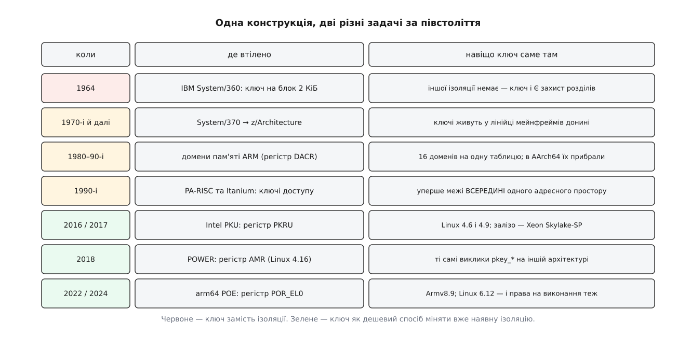

# 📜 Ключ на сторінці, права в регістрі: півстоліття однієї конструкції

Розділення «сталу прикмету тримаємо біля сторінки, а миттєве право — у регістрі» не вигадали для x86 у 2010-х. Воно старше за віртуальну пам'ять у масовому вжитку: перше втілення з'явилося 1964 року, коли ізолювати програми одну від одної не було ще чим взагалі. Цікаве не те, що ідея повернулася, а те, що за півстоліття вона повернулася **для протилежної задачі** — і через це вивернулася майже в кожній своїй деталі.

## 1964: ключ, бо більше нічого немає

IBM оголосила System/360 7 квітня 1964 року. Машина мала виконувати кілька завдань одночасно, а фізична пам'ять у неї одна й спільна: перекладу адрес у лінійці не було (він з'явився окремим рішенням у моделі 67, а масово — уже в System/370). Отже, друге завдання бачить перше просто за іншими адресами тієї самої пам'яті, і єдина перешкода мусить стояти на шляху самого звернення.

Зроблено це так. Кожен блок фізичної пам'яті у 2048 байтів має власний **чотирибітний ключ** — це документовано в архітектурній довідці System/360. Поточний ключ програми лежить у бітах 8…11 слова стану процесора (PSW). Запис дозволено, лише якщо ключ блоку збігається з ключем програми; ключ 0 вимикає перевірку взагалі — це ключ супервізора. На частині моделей була ще й додаткова опція **fetch protection**: тоді ключ забороняв не тільки запис, а й читання.

Ключів шістнадцять, і цього тоді вистачало: ключ — це не «група сторінок усередині програми», а **сама програма**. Розділ пам'яті, у який завантажили завдання, розмічають одним ключем, і завдання живе всередині своєї позначки.

Чому захист причепили до пам'яті, а не зробили в процесорі пару регістрів «від і до»? Бо процесор не єдиний, хто пише в пам'ять. Обмін із периферією на System/360 веде **канал** — окремий процесор вводу-виводу, що виконує власну програму й ходить у пам'ять повз центральний процесор. Ключ мав і канал: перевірка однакова для обох, бо вона живе біля блоку, а не біля того, хто звертається. Регістр меж у ЦП зупинив би тільки ЦП.

І головне для всієї подальшої історії: **свій ключ програма змінити не могла**. Ключ лежить у PSW, а завантаження PSW і команди роботи з ключами (SSK і ISK — «встановити» й «прочитати» ключ блоку) — привілейовані. Конструкція будувалася, щоб захистити систему **від** програми. Ключ був замком, а ключ від замка тримав хтось інший.

## Що з ключами зробила віртуальна пам'ять

Далі сталося те, що зазвичай убиває механізм: з'явився кращий спосіб робити те саме. Коли в кожного процесу є власна таблиця сторінок, ізоляція стає не перевіркою, а **структурою**: чужої пам'яті в таблиці просто немає, і звертатися до неї нічим. (Про переклад адрес по сторінках — [сторінки, таблиці сторінок і MMU](topic:unix-linux/paging-and-mmu): апаратура перекладає віртуальну адресу у фізичну за таблицею процесу, і що не описане в таблиці, того для процесу не існує.)

Ключі при цьому нікуди не поділися в самій лінійці мейнфреймів — вони живуть у System/370 і в сучасній z/Architecture дотепер, бо там багато підсистем свідомо ділять один адресний простір, і ключ лишається робочою межею між ними. Але в мікропроцесорному світі, який будувався навколо «один процес — одна таблиця сторінок», ключ виглядав як спадщина епохи без перекладу адрес.

## Межа переїжджає всередину процесу

Проте конструкція «номер біля сторінки, права в регістрі» надто зручна, щоб зникнути, і в 1980–90-х вона з'являється знову — уже з іншим призначенням.

**Домени пам'яті ARM.** У короткому форматі дескриптора кожна ділянка несе чотирибітний **номер домену**, а регістр DACR віддає кожному з шістнадцяти доменів по два біти: 00 — доступу немає зовсім, 01 (*client*) — перевіряти права так, як записано в дескрипторі, 11 (*manager*) — не перевіряти взагалі. Тобто регістр не додає прав до дескриптора, а **перекриває** його рішення — рівно та ідея, що згодом дістане назву overlay. Linux на ARM користувався доменами для власних потреб: у ядрі досі є розмітка на домени ядра, користувача, введення-виведення й векторів, а перемикання домену користувача між *no access* і *client* — це програмна реалізація заборони ядру ненароком чіпати пам'ять користувача. У 64-бітному ARM домени прибрали разом зі старим форматом дескрипторів.

**PA-RISC і Itanium.** Тут ключ уже виразно всередині одного простору. У PA-RISC кожен запис TLB несе ідентифікатор доступу завдовжки 15–18 бітів, який звіряють із невеликим набором регістрів захисту; Itanium має шістнадцять регістрів ключів захисту, а самі ключі — щонайменше 18 бітів. Порівняно з System/360 змінилася арифметика: чинних ключів тепер **кілька одночасно**, бо всередині однієї програми одночасно потрібні кілька відкритих груп — довідники описують це призначення прямо як домени бібліотек і модулів.

Ключ перестав бути посвідченням програми і став **позначкою на матеріалі**, з яким програма працює.

## Повернення на масове залізо

Intel описала Protection Keys for Userspace задовго до появи заліза: перші латки для Linux LWN розбирає ще 13 травня 2015 року, і в них права на ключі задавали прапорцями до звичайного `mprotect`. Остаточний вигляд інтерфейсу інший: підтримка регістра PKRU увійшла в ядро 4.6, а окремі виклики `pkey_alloc`, `pkey_free` і `pkey_mprotect` — у 4.9 (грудень 2016). Залізо наздогнало за півроку з гаком: серверні Xeon Scalable на Skylake-SP вийшли 11 липня 2017 року, і документація ядра донині описує PKU як «Skylake і новіші серверні», з клієнтськими процесорами від Tiger Lake.

І ось тут стара конструкція вивертається. Команди `RDPKRU` і `WRPKRU` — **непривілейовані**. 1964 року право змінити свій ключ належало виключно супервізору, бо в тому й був сенс замка. 2017 року право змінити свої права належить самій програмі, а ядро про це навіть не дізнається.

Це не недогляд, а точний наслідок нової задачі. Механізм більше не боронить систему від зловмисної програми — для цього є окрема таблиця сторінок у кожного процесу. Він боронить програму від її **власної помилки**: від здичавілого вказівника, від переповнення буфера в чужій бібліотеці, від запису в те, що зараз не мало бути відкрите. Проти нападника, який уже виконує довільний код, ключі не працюють — такий нападник просто виконає `WRPKRU` і відчинить собі все. Саме тому системи, що будують на PKU справжню межу, мусять окремо гарантувати, що в двійковому коді немає жодного стороннього `WRPKRU`: захист тримається не на привілеї, а на тому, що потрібної команди більше ніде немає.

Друга непомітна зміна — **у кого свій регістр**. PSW-ключ належав процесору, і на однопроцесорній машині це означало «поточному завданню». PKRU належить потоку: потоки одного процесу ділять таблицю сторінок і всі права в ній, але не регістри. (Про це — [потоки в Linux: задача як одиниця планування](topic:unix-linux/threads-as-tasks): потоки одного процесу — окремі задачі планувальника зі спільним адресним простором і власним набором регістрів у кожної.) Саме звідси береться нинішня цінність механізму: він дає різні права на ту саму сторінку двом потокам, чого таблиця сторінок не вміє в принципі.

## Ті самі виклики на інших архітектурах

Через рік ідею підхопив POWER: підтримка ключів на powerpc з'явилася в Linux 4.16 (1 квітня 2018) для Power7, Power8 і Power9, і спирається вона на власний регістр IBM — AMR. Архітектура інша, регістр інший, а системні виклики ті самі `pkey_*`.

Ще пізніше повернувся ARM — той самий, що колись домени прибрав. Armv8.9 і Armv9.4 оголошено у вересні 2022 року, і серед змін механізму віртуальної пам'яті там «permission indirection and overlays»; ключова для нас частина — Permission Overlay Extension (FEAT_S1POE) з регістром `POR_EL0`. Linux підтримує його від версії 6.12 (17 листопада 2024) і подає крізь ті самі `pkey_alloc` та `pkey_mprotect`. Ключів там вісім, а не шістнадцять, зате права включають **виконання** — те, чого x86-варіант не вміє. Ідея, яку ARM викинула разом із 32-бітним форматом дескрипторів, повернулася до неї ж через десятиліття, і повернулася повнішою.

*Верхня частина списку — епоха, коли ключ заміняв ізоляцію; нижня — коли ізоляція вже є, і ключ потрібен, щоб дешево її міняти.*

## Що насправді змінилося за півстоліття

Механізм зовні той самий: номер біля сторінки, права в регістрі, перевірка на кожному зверненні. Але задача під ним інша, і всі відмінності випливають з однієї підміни.

1964 року **ізоляції не існувало**, і ключ був її замінником — єдиною перешкодою між двома завданнями в спільній фізичній пам'яті. Тому він чіплявся до фізичного блоку (адреси ж не переклада́лися), тому був привілейованим (програма не сміє знімати з себе замок), тому був один на процесор (завдання в кожен момент одне) і тому мусив діяти й на канали.

Сьогодні ізоляція існує й доступна задарма — доки її не чіпають. Дорого коштує не сама межа, а її **зміна**: розсічення ділянок у ядрі, правка записів таблиці, узгоджене скидання TLB на всіх ядрах, а до того ж зміна б'є по всіх потоках одразу, бо таблиця в них спільна. Ключ повернувся саме як спосіб здешевити зміну: сталу частину («ця сторінка з групи 3») лишили в таблиці, а змінну («групі 3 зараз писати не можна») винесли в регістр, який кожен потік править собі сам однією командою.

Звідси й уся вивернутість. Ключ переїхав із фізичного блоку у віртуальну сторінку, з привілейованого регістра — у непривілейований, із межі між програмами — у межу всередині програми, з захисту системи від програми — у захист програми від себе самої. Незмінним лишилося тільки те, заради чого конструкцію взагалі придумали: **розліпити рідко змінну прикмету пам'яті й часто змінне право на неї**, щоб друге не тягло за собою переписування першого.

Статус наведеного: дати оголошень (System/360 — 7 квітня 1964, Armv8.9 — вересень 2022, Xeon Scalable — 11 липня 2017) і версії ядра (4.6, 4.9, 4.16, 6.12) взято з архітектурних довідок, документації ядра та журналів випусків — це підтверджені факти. Опис ролі ключів у PA-RISC та Itanium поданий на рівні довідкового узагальнення (розрядність ключів і кількість регістрів), без претензії на подробиці конкретних реалізацій. Твердження про мотиви — чому саме така конструкція, — це реконструкція з властивостей самих машин, а не цитата з чиїхось спогадів.
