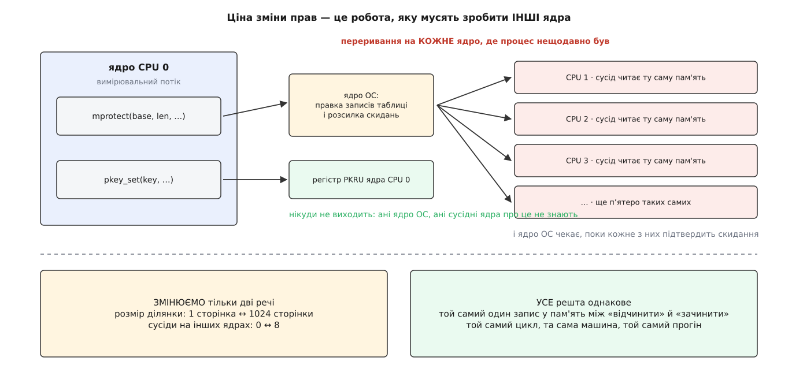
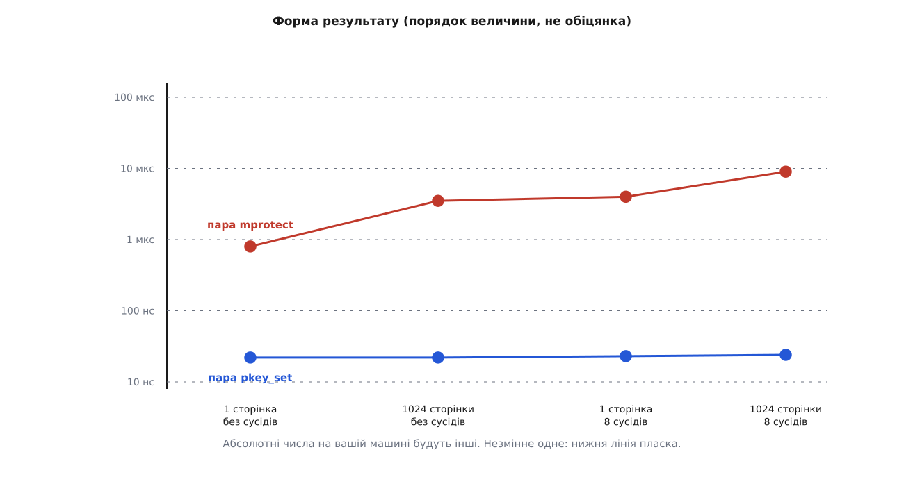

# ⚙️ Сторож над секретом: спіймати порушення ключа й поміряти ціну зачинених дверей

Одна програма на C кладе буфер із секретом під ключ захисту, ловить на забороненому зверненні `SIGSEGV` із номером ключа в `siginfo` — і тим самим кодом перетворює оцінку «різниця в два-три порядки» на число, зняте з вашої машини.

Обидві половини потрібні, і кожна з власної причини. Ключ, який мовчки не працює, виглядає точнісінько так само, як ключ, що працює: доти, доки хтось не звернеться до захищеної сторінки, різниці не видно. А оцінку виграшу переносити з чужої машини не можна взагалі — вона залежить від кількости ядер і від того, скільки сторінок ви захищаєте, тобто від двох речей, яких у чужому числі немає.

## Що саме тут міряють

Одиниця виміру — не окремий виклик, а **пара**: відчинити, зробити одну дію, зачинити. Саме так живе захищена пам'ять у справжній програмі: вікно доступу відкривають на мить і одразу закривають, і платить програма за вікно цілком.

Обидва способи мусять робити **однакову корисну роботу**, інакше порівнюємо не механізми, а те, що вони обгортають. Тому в обох варіантах усередині вікна стоїть один запис байта — не більше й не менше:

```
mprotect: mprotect(RW) → записати байт → mprotect(READ)
pkey:     pkey_set(0)   → записати байт → pkey_set(PKEY_DISABLE_WRITE)
```

Змінюємо рівно дві речі, і обидві обрано не навмання. **Кількість сторінок** — бо ядро ОС мусить переписати запис таблиці на кожну з них, а регістр про кількість сторінок не знає нічого. **Кількість сусідніх потоків, що крутяться на інших ядрах і торкаються тієї ж пам'яті** — бо саме вони перетворюють правку таблиці на розсилку [скидань TLB](book:unix-linux/tlb-shootdown) з очікуванням підтвердження від кожного ядра, тимчасом як зміна регістра нікуди за межі свого ядра не виходить.



*Ціна `mprotect` — це переважно робота, яку мусять зробити інші ядра. Тому стенд і будують навколо них.*

## Сторож

Перша половина програми нічого не міряє: вона доводить, що механізм увімкнено й що спрацьовує він саме там, де мусить.

```c
/* pkey-guard.c — сторож над секретом і вимір ціни двох способів
 *   cc -O2 -pthread -o pkey-guard pkey-guard.c
 */
#define _GNU_SOURCE
#include <errno.h>
#include <pthread.h>
#include <sched.h>
#include <setjmp.h>
#include <signal.h>
#include <stdatomic.h>
#include <stdio.h>
#include <stdlib.h>
#include <string.h>
#include <time.h>
#include <unistd.h>
#include <sys/mman.h>

static long page_size;
static sigjmp_buf escape;

/* друк з обробника: лише write(), лише власна лічба */
static void put(const char *s, size_t n) { if (write(2, s, n) < 0) _exit(2); }
#define PUT(s) put(s, sizeof(s) - 1)

static void putnum(long v)
{
    char b[24];
    int i = (int)sizeof b;
    unsigned long u = (v < 0) ? -(unsigned long)v : (unsigned long)v;
    if (!u) b[--i] = '0';
    while (u) { b[--i] = (char)('0' + u % 10); u /= 10; }
    if (v < 0) b[--i] = '-';
    put(b + i, (size_t)((int)sizeof b - i));
}

static void on_segv(int sig, siginfo_t *si, void *uc)
{
    (void)sig; (void)uc;
    if (si->si_code == SEGV_PKUERR) {
        PUT("  [обробник] заборонив КЛЮЧ: si_code = SEGV_PKUERR, si_pkey = ");
        putnum(si->si_pkey);
    } else {
        PUT("  [обробник] заборонили права ділянки: si_code = ");
        putnum(si->si_code);
    }
    PUT("\n");
    siglongjmp(escape, 1);
}

/* стек обробника — у .bss, тобто під ключем 0, і це навмисно */
static char altstack[64 * 1024];

static void install_handler(void)
{
    stack_t ss;
    struct sigaction sa;

    ss.ss_sp = altstack;
    ss.ss_size = sizeof altstack;
    ss.ss_flags = 0;
    if (sigaltstack(&ss, NULL) < 0) { perror("sigaltstack"); exit(1); }

    memset(&sa, 0, sizeof sa);
    sa.sa_sigaction = on_segv;
    sa.sa_flags = SA_SIGINFO | SA_ONSTACK;
    sigemptyset(&sa.sa_mask);
    if (sigaction(SIGSEGV, &sa, NULL) < 0) { perror("sigaction"); exit(1); }
}

static char *map_pages(size_t npages)
{
    size_t len = npages * (size_t)page_size;
    void *p = mmap(NULL, len, PROT_READ | PROT_WRITE,
                   MAP_PRIVATE | MAP_ANONYMOUS, -1, 0);
    if (p == MAP_FAILED) { perror("mmap"); exit(1); }
    memset(p, 0, len);              /* заселити сторінки: без цього нічого міряти */
    return p;
}

static void demo_guard(void)
{
    char *secret = map_pages(1);
    int key;

    strcpy(secret, "приватний ключ");

    key = pkey_alloc(0, PKEY_DISABLE_ACCESS);
    if (key < 0) {
        fprintf(stderr, "pkey_alloc: %s — або ключі скінчилися, "
                        "або машина чи ядро їх не підтримують\n", strerror(errno));
        exit(1);
    }
    if (pkey_mprotect(secret, (size_t)page_size, PROT_READ | PROT_WRITE, key) < 0) {
        perror("pkey_mprotect"); exit(1);
    }
    printf("ключ %d повішено на сторінку; права ключа зараз: %d\n",
           key, pkey_get(key));

    if (sigsetjmp(escape, 1) == 0) {
        volatile char c = secret[0];        /* сюди має вдарити SIGSEGV */
        (void)c;
        printf("ЗВЕРНЕННЯ ПРОЙШЛО — ключі на цій машині не діють\n");
    } else {
        printf("повернулися з обробника: сторож на місці\n");
    }

    /* після siglongjmp ми обійшли sigreturn, тож у PKRU лишилося типове
       значення, яке ядро поставило перед обробником; ставимо своє явно */
    pkey_set(key, PKEY_DISABLE_ACCESS);

    pkey_set(key, 0);                       /* відчинили — одна команда */
    printf("довжина секрету: %zu\n", strlen(secret));
    pkey_set(key, PKEY_DISABLE_ACCESS);     /* зачинили */

    signal(SIGSEGV, SIG_DFL);               /* далі escape вже недійсний */
    pkey_mprotect(secret, (size_t)page_size, PROT_READ | PROT_WRITE, 0);
    pkey_free(key);
    munmap(secret, (size_t)page_size);
}
```

Кілька рядків тут виглядають дрібницею, а насправді тримають усе.

**Пам'ять беремо в `mmap`, не в алокатора.** Спокуса взяти `aligned_alloc` є, і сторінку він поверне вирівняну. Але звільнити такий буфер, поки ключ зачинено, не вдасться: `free` кладе покажчик списку вільних блоків **у перші байти самого блоку** — і процес падає з `SIGSEGV` усередині libc. `mmap` дає ділянку, у якої немає чужих метаданих, і знімається вона `munmap`, не торкаючись вмісту.

**Стек обробника лежить у `.bss`.** На вході в обробник ядро підставляє потокові **типове** значення `PKRU` — те, що ставиться на `execve`, тобто «ключ 0 відчинено, ключі 1…15 зачинено». Права перерваного місця обробник не успадковує зовсім. Отже, стек, який ви віддали під `sigaltstack`, мусить бути під нульовим ключем; інакше перший же запис у ньому дасть вкладений `SIGSEGV`, а вкладений `SIGSEGV` в обробнику `SIGSEGV` — це тихе падіння без жодного повідомлення. Від ядра 6.13 (з бекпортом у 6.12.5) ядро само тимчасово відчиняє всі ключі, щоб покласти на цей стек кадр сигналу, — але тіло обробника все одно виконується з типовими правами, тож правило лишається.

**Другий аргумент `sigsetjmp` — одиниця.** Він каже зберегти маску сигналів. Поки обробник виконується, `SIGSEGV` заблоковано; вискочивши через `siglongjmp` з нулем у цьому аргументі, ви лишите його заблокованим назавжди — і друге порушення вб'є процес одразу, без обробника.

**Друкуємо через `write`, а не `printf`.** Обробник перериває програму в довільному місці, зокрема посеред роботи `printf` над тим самим потоком, — і повторний вхід у нього ламає буфер stdio. Що саме можна викликати в обробнику, розібрано в темі про [безпеку в обробнику сигналу](book:unix-linux/async-signal-safety); `write` можна, власна лічба цифр — теж.

> 🔧 **Навіщо це.** `SEGV_PKUERR` у першому ж рядку виводу коштує один рядок коду й економить години. `SEGV_ACCERR` означає «права ділянки не дозволяють» — шукати треба зайвий `mprotect`. `SEGV_PKUERR` означає «ділянка дозволяє, а регістр цього потоку в цю мить — ні» — шукати треба забутий `pkey_set` або потік, якому ключа не відчиняли. Без `SA_SIGINFO` обидва випадки виглядають однаково.

## Чому вимір легко зіпсувати

Перш ніж писати другу половину, варто перелічити способи дістати гарне й неправдиве число.

**Незаселені сторінки.** Свіжий анонімний `mmap` не має жодного запису в таблиці сторінок: вони з'являються лише [при першому дотику](book:unix-linux/page-fault). `mprotect` над такою ділянкою править лише опис самої ділянки й розходиться, тож 1024 «сторінки» коштують стільки ж, скільки одна. Звідси `memset` у `map_pages` — без нього стенд міряє порожнечу.

**Розсічення ділянки.** Якщо міняти права шматкові **всередині** ділянки, ядро щоразу розсікає одну ділянку на три, а потім зливає назад. Це справжня ціна, і в справжніх програмах її платять, — але вона не про TLB і не про сторінки, тож у чистому вимірі її прибирають: права міняють на ділянку цілком, від першої адреси до останньої.

**Сусіди, які насправді сплять.** Створити вісім потоків мало. Розсилку ядро шле лише на ті ядра, де цей процес нещодавно виконувався; потік, що чекає на м'ютексі, з цього списку швидко зникає. Тому сусіди в стенді крутяться в циклі й безперервно читають ту саму пам'ять, а щоб вони не збилися на одне ядро, кожного [прив'язують](book:unix-linux/cpu-affinity) до свого.

**Підлога виміру.** Пара `pkey_set` коштує десятки наносекунд, тобто одного порядку з накладними витратами самого циклу. Тому стенд окремо міряє порожній цикл із тим самим записом байта й друкує це число: усе, що менше за нього плюс кілька наносекунд, — шум, а не результат. Про решту способів збрехати собі виміром — у темі про [мікробенчмарк](book:programming/microbenchmarking).

## Вимірювальна частина

Далі — той самий файл. Кожен спосіб живе у власній функції, що робить одразу `n` пар: якби ці пари викликали через покажчик по одній, сам непрямий виклик коштував би стільки ж, скільки те, що ми міряємо.

```c
struct region { char *base; size_t len; int key; };

typedef void (*runner)(struct region *, long);

static double now_ns(void)
{
    struct timespec ts;
    clock_gettime(CLOCK_MONOTONIC, &ts);
    return (double)ts.tv_sec * 1e9 + (double)ts.tv_nsec;
}

static void run_bare(struct region *r, long n)          /* підлога виміру */
{
    for (long i = 0; i < n; i++)
        *(volatile char *)r->base = (char)i;
}

static void run_pkey(struct region *r, long n)
{
    for (long i = 0; i < n; i++) {
        pkey_set(r->key, 0);
        *(volatile char *)r->base = (char)i;
        pkey_set(r->key, PKEY_DISABLE_WRITE);
    }
}

static void run_mprotect(struct region *r, long n)
{
    for (long i = 0; i < n; i++) {
        if (mprotect(r->base, r->len, PROT_READ | PROT_WRITE) < 0) goto bad;
        *(volatile char *)r->base = (char)i;
        if (mprotect(r->base, r->len, PROT_READ) < 0) goto bad;
    }
    return;
bad:
    perror("mprotect"); exit(1);
}

/* Ітерацій беремо не порівну, а стільки, щоб набрати спільний бюджет часу:
   ціни різняться на два-три порядки, і мільйон пар mprotect тривав би десятки секунд. */
static double bench(runner f, struct region *r, double budget_ns, long cap)
{
    long n = 64;
    f(r, 64);                                   /* прогрів */
    for (;;) {
        double t0 = now_ns();
        f(r, n);
        double dt = now_ns() - t0;
        if (dt >= budget_ns || n >= cap)
            return dt / (double)n;
        n = (n * 4 > cap) ? cap : n * 4;
    }
}

struct neighbour { pthread_t tid; char *a, *b; size_t len; int key, cpu; };

static _Atomic int stop_flag;

static void *neighbour_main(void *arg)
{
    struct neighbour *w = arg;
    cpu_set_t set;
    volatile char *a = (volatile char *)w->a;
    volatile char *b = (volatile char *)w->b;
    unsigned long acc = 0;

    /* PKRU успадковано в мить clone — але покладатися на це не можна:
       кожен потік ставить собі права сам і першою ж дією */
    pkey_set(w->key, PKEY_DISABLE_WRITE);

    CPU_ZERO(&set);
    CPU_SET(w->cpu, &set);
    pthread_setaffinity_np(pthread_self(), sizeof set, &set);

    while (!atomic_load_explicit(&stop_flag, memory_order_relaxed))
        for (size_t off = 0; off < w->len; off += (size_t)page_size)
            acc += (unsigned char)a[off] + (unsigned char)b[off];

    return (void *)acc;
}

static void bench_one(size_t npages, int nthreads)
{
    size_t len = npages * (size_t)page_size;
    struct region plain = { map_pages(npages), len, -1 };
    struct region keyed = { map_pages(npages), len, -1 };
    long ncpu = sysconf(_SC_NPROCESSORS_ONLN);
    struct neighbour *ws = NULL;
    double bare, mp, pk;
    int key = pkey_alloc(0, PKEY_DISABLE_WRITE);

    if (key < 0) { perror("pkey_alloc"); exit(1); }
    keyed.key = key;
    if (pkey_mprotect(keyed.base, len, PROT_READ | PROT_WRITE, key) < 0) {
        perror("pkey_mprotect"); exit(1);
    }

    atomic_store(&stop_flag, 0);
    if (nthreads > 0) {
        struct timespec settle = { 0, 50 * 1000 * 1000 };
        ws = calloc((size_t)nthreads, sizeof *ws);
        for (int i = 0; i < nthreads; i++) {
            ws[i].a = plain.base; ws[i].b = keyed.base;
            ws[i].len = len; ws[i].key = key;
            ws[i].cpu = (int)(1 + i % (ncpu > 1 ? ncpu - 1 : 1));
            if (pthread_create(&ws[i].tid, NULL, neighbour_main, &ws[i]) != 0) {
                perror("pthread_create"); exit(1);
            }
        }
        nanosleep(&settle, NULL);               /* дати їм осісти на своїх ядрах */
    }

    bare = bench(run_bare,     &plain, 1e8, 1L << 22);
    mp   = bench(run_mprotect, &plain, 3e8, 200000);
    mprotect(plain.base, len, PROT_READ | PROT_WRITE);
    pk   = bench(run_pkey,     &keyed, 3e8, 1000000);

    if (ws) {
        atomic_store(&stop_flag, 1);
        for (int i = 0; i < nthreads; i++) pthread_join(ws[i].tid, NULL);
        free(ws);
    }

    printf("%9zu %9d %13.0f %13.1f %10.0f× %12.1f\n",
           npages, nthreads, mp, pk, mp / pk, bare);

    pkey_mprotect(keyed.base, len, PROT_READ | PROT_WRITE, 0);
    pkey_free(key);
    munmap(plain.base, len);
    munmap(keyed.base, len);
}

int main(void)
{
    cpu_set_t set;

    page_size = sysconf(_SC_PAGESIZE);
    CPU_ZERO(&set); CPU_SET(0, &set);
    sched_setaffinity(0, sizeof set, &set);

    install_handler();
    demo_guard();

    printf("\n%9s %9s %13s %13s %11s %12s\n",
           "сторінок", "сусідів", "mprotect, нс", "pkey_set, нс", "разів", "підлога, нс");
    bench_one(1,    0);
    bench_one(1024, 0);
    bench_one(1,    8);
    bench_one(1024, 8);
    return 0;
}
```

Один рядок тут вимагає застереження. `pkey_set` — не системний виклик: у glibc це кілька рядків, що читають `PKRU` командою `RDPKRU`, правлять два біти й записують назад `WRPKRU`. Але це все ж **виклик функції** через таблицю зв'язування, і на нього припадає кілька наносекунд із виміряних. Хто хоче побачити голу команду, ставить її в код прямо:

```c
static inline void wrpkru(unsigned int v)
{
    __asm__ volatile("wrpkru" :: "a"(v), "c"(0), "d"(0) : "memory");
}
```

Різниця буде помітна у відсотках і не помітна в порядках — на висновок вона не впливає. Тому в стенді стоїть звичайний `pkey_set`: міряти варто те, що ви справді напишете в робочому коді.

## Чого чекати



*Верхню лінію піднімають сторінки й сусіди, нижня їх не помічає: у регістрі немає нічого, що залежало б від того чи того.*

Порядки величини, яких варто чекати на серверній машині з десятком-другим ядер:

```
сторінок  сусідів   mprotect      pkey_set    разів
       1        0    ≈ 0.8 мкс      ≈ 22 нс     ≈ 40
    1024        0    ≈ 3.5 мкс      ≈ 22 нс     ≈ 160
       1        8    ≈ 4   мкс      ≈ 23 нс     ≈ 170
    1024        8    ≈ 9   мкс      ≈ 24 нс     ≈ 380
підлога виміру (порожній цикл із записом байта)  ≈ 1 нс
```

Дві речі в цій таблиці варті окремої уваги, бо саме на них найчастіше спотикається очікування.

**Тисяча сторінок коштує не в тисячу разів більше за одну.** Ядро не збирається робити тисячу окремих вилучень із TLB: у нього є поріг, і коли діапазон його перевищує, воно скидає TLB **цілком**, одним махом. Поріг видно й можна покрутити:

```sh
$ cat /sys/kernel/debug/x86/tlb_single_page_flush_ceiling
33
```

Тридцять три сторінки. Вибір пояснено просто: одне точкове вилучення коштує близько ста наносекунд, тож поріг обмежує ціну точкового шляху приблизно трьома мікросекундами. Вище — дешевше скинути весь кеш перекладів і змиритися з тим, що процес потім наново переучуватиме всі свої адреси. Цієї плати в стенді якраз і не видно: наступні ітерації циклу торкаються тієї самої однієї сторінки, а справжня програма після такого скидання ще довго добиратиме промахи.

**Вісім сусідів дорожчі за тисячу сторінок.** Правка тисячі записів — це робота одного ядра з пам'яттю, порядку мікросекунди. Розсилка на вісім ядер — це переривання на кожне, вихід кожного з його роботи й очікування підтвердження від найповільнішого. Тому реальна ціна `mprotect` росте не з розміром вашої ділянки, а з **тим, скільки роботи ви заважаєте робити іншим**, — і в профілі вона з'явиться не у вашій програмі, а в чужих.

## Перевірка з іншого боку

Числу з власного циклу потрібне незалежне підтвердження — інакше нема певности, що виміряно саме те. Розсилку видно ззовні, у лічильнику міжпроцесорних переривань виклику функції:

```sh
$ grep -E '^ *CAL' /proc/interrupts        # до й після прогону
$ perf stat -e 'tlb:tlb_flush' -e 'irq_vectors:call_function_single_entry' ./pkey-guard
```

Очікуваний вигляд результату: у прогоні без сусідів `CAL` майже не росте, з вісьмома сусідами приріст приблизно дорівнює кількості пар `mprotect`, помноженій на кількість зайнятих ядер. У частині з `pkey_set` не росте нічого — жодного переривання, жодного скидання, жодного входу в ядро. Про сам інструмент і його лічильники — у темі про [підсистему perf](book:unix-linux/perf-events).

## Пастки

**`ENOSPC` каже дві різні речі.** `pkey_alloc` повертає його і коли ключі скінчилися, і коли апаратура чи ядро їх не підтримують. Розрізняє їх лише прикмета процесора:

```sh
$ grep -o ' pku\| ospke' /proc/cpuinfo | sort -u
```

Ключів на x86 п'ятнадцять на весь процес, і вони спільні з бібліотеками: один може піти на ділянку «тільки виконувати», ще кілька — рушієві, що працює поруч. Бібліотека, яка мовчки бере ключ на все життя процесу, — цілком реальна причина `ENOSPC` у програмі, що взяла всього один.

**`pkey_set` — не системний виклик, і поводиться відповідно.** У glibc на x86 він одразу виконує `RDPKRU`, не питаючи, чи механізм увімкнено. На машині без `OSPKE` процесор такої команди не приймає: ви дістаєте не `ENOSYS`, а `SIGILL` посеред роботи. Тому єдина правильна перевірка підтримки — успішний `pkey_alloc` на старті; усе, що далі, робиться лише після нього.

**Права ділянки мусять бути ширші за те, що ви хочете дозволити.** Ключ уміє лише звужувати. `pkey_mprotect(…, PROT_NONE, key)` — це не «дуже надійно», а «ключ не додає нічого»: звернення заборонить сама ділянка, і в `siginfo` ви побачите `SEGV_ACCERR` замість `SEGV_PKUERR` та почнете шукати зовсім не там. Ділянка під ключем тримає **найширші** права, які їй колись знадобляться, а звужує їх регістр.

**Новий потік дістає `PKRU` творця — у мить `clone`.** Це небезпечно в один бік. Потік, народжений до того, як ви взяли ключ, має типове значення, тобто доступу не має, — і це саме те, чого треба. А от `pthread_create`, зроблений **усередині** відчиненого вікна, віддає дитині відчинені права назавжди: ніхто їй їх не зачинить. Правило вкладається в один рядок: кожна функція потоку першою ж дією ставить собі права явно, як `neighbour_main` вище.

**`pkey_set` в обробнику сигналу нічого не змінить після повернення.** Спокуса є: спіймати `SEGV_PKUERR`, відчинити ключ і повернутися з обробника, щоб команда виконалася вдруге й пройшла. Не працює. `PKRU` — частина розширеного стану процесора, який `sigreturn` відновлює з кадру сигналу; усе, що ви написали в регістр усередині обробника, при поверненні затирається старим значенням, і збій повторюється в нескінченному циклі. Вихід з обробника — або `siglongjmp`, як у стенді, або правка стану прямо в `ucontext`.

**`pkey_free` над ключем, що ще висить на ділянці, — невизначена поведінка.** Номер повертається в мапу вільних, і наступний `pkey_alloc` — ваш чи чужий — може дістати той самий номер разом із чужими сторінками під ним. Порядок прибирання лише один: спершу `pkey_mprotect(…, 0)` на всі ділянки, і тільки потім `pkey_free`.

**Ключ діє й на ядро ОС, коли те пише у ваш буфер на ваше прохання.** `read(fd, secret, n)` із зачиненим ключем поверне `EFAULT` — не тому, що адреса погана, а тому, що ядро копіює дані звичайним зверненням, і `PKRU` поточного потоку діє й на нього. Помилка при цьому виглядає рівно як помилка в аргументах, тож у коді, що приймає дані просто в захищений буфер, вікно доступу треба відчиняти навколо самого виклику.
