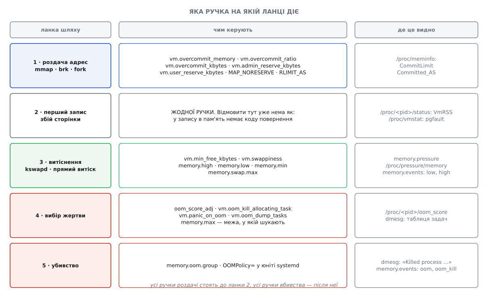

# 📋 Ручки overcommit і OOM: файли, значення, формули

Це контракт із ядром: усі перемикачі, поля й лічильники, якими Linux керує роздачею обіцянок пам'яті та вибором жертви — з точними іменами, одиницями, значеннями за замовчуванням і арифметикою, за якою ядро їх читає. Довідка потрібна у дві хвилини: коли пишеш конфігурацію й мусиш знати, що саме поставити, і коли розбираєш свіжий звіт із журналу й мусиш знати, у яких одиницях там числа.

Усе звірено з `Documentation/admin-guide/sysctl/vm.rst`, `Documentation/admin-guide/cgroup-v2.rst`, сторінками `proc_sys_vm(5)`, `proc_pid_oom_score_adj(5)`, `mmap(2)`, `systemd.resource-control(5)` — і з кодом (`mm/util.c`, `mm/mmap.c`, `mm/vma.c`, `mm/oom_kill.c`, `fs/proc/base.c`). Де довідка й код розходяться в дрібницях, тут стоїть те, що робить код.

## Карта: яка ручка на якій ланці



*Перемикачі не лежать однією купою: кожен чіпляється до своєї ланки, а найважливіша ланка — друга — не має жодного.*

Ця карта пояснює, чому перемикачів так багато й чому вони не взаємозамінні. Ручки першої ланки вирішують, **скільки взагалі можна пообіцяти**; ручки третьої — **як довго система бореться**, перш ніж визнати поразку; ручки четвертої й п'ятої — **кого і як убивають**. Ручка, поставлена не на ту ланку, не працює: `oom_score_adj` нічого не змінить, якщо машина заклякла в буксуванні й ядро OOM ще не оголосило.

## `vm.*` — перемикачі ядра

Файли лежать у `/proc/sys/vm/`; те саме доступне як `sysctl vm.<ім'я>`. Це [псевдофайли](topic:unix-linux/proc-filesystem) — читання й запис у них не йдуть на диск, а виконують код ядра, тож запис діє негайно, від наступної перевірки. Щоб значення пережило перезавантаження, його кладуть у `/etc/sysctl.d/99-<що>.conf`.

| файл | одиниця | типово | що робить |
|---|---|---|---|
| `overcommit_memory` | 0 / 1 / 2 | `0` | правило, за яким ворота обліку кажуть «ні» |
| `overcommit_ratio` | % фізичної пам'яті | `50` | частка RAM у `CommitLimit` (має силу лише в режимі 2) |
| `overcommit_kbytes` | КіБ | `0` | абсолютна заміна `ratio`; ненульове значення вимикає `ratio`, і той читається як `0` |
| `admin_reserve_kbytes` | КіБ | `8192` (8 МіБ) | резерв, недосяжний для тих, у кого нема `CAP_SYS_ADMIN` |
| `user_reserve_kbytes` | КіБ | `131072` (128 МіБ) | стеля резерву, який віднімають кожному процесові окремо |
| `min_free_kbytes` | КіБ | рахується при старті | нижній водяний знак: скільки пам'яті тримати вільною завжди |
| `panic_on_oom` | 0 / 1 / 2 | `0` | замість вибору жертви зупинити ядро |
| `oom_kill_allocating_task` | 0 / 1 | `0` | не шукати найбільшого, а вбити того, хто наткнувся |
| `oom_dump_tasks` | 0 / 1 | `1` | друкувати в журнал таблицю всіх задач при вбивстві |

Два резерви на малій машині ядро при старті опускає: обидва обмежені зверху ще й 1/32 вільної пам'яті (≈3 %). На системі з 512 МіБ вільної пам'яті це 16 МіБ — тож користувацький резерв стане 16 МіБ замість 128, а адміністраторський лишиться при своїх 8.

### Точне правило воріт

Перевірку робить `__vm_enough_memory()`. У ній є дрібниця, через яку люди помиляються на одиницю: ядро **спершу додає запит до лічильника**, а вже потім порівнює. Тобто в порівнянні бере участь `Committed_AS`, у якому новий запит уже враховано.

```
режим 0 — OVERCOMMIT_GUESS (типово)
    відмова  ⟺  запит > MemTotal + SwapTotal
    сума раніше виданих обіцянок не перевіряється взагалі

режим 1 — OVERCOMMIT_ALWAYS
    відмови немає ніколи

режим 2 — OVERCOMMIT_NEVER
    стеля = CommitLimit
    якщо нема CAP_SYS_ADMIN:   стеля −= admin_reserve_kbytes
    для будь-якого процесу:    стеля −= min(VmSize / 32, user_reserve_kbytes)
    дозволено  ⟺  Committed_AS (уже разом із запитом) < стеля
    інакше     →  ENOMEM
```

Друге відрахування пояснює формулювання довідки «min(3 % розміру процесу, 128 МіБ)»: `VmSize / 32` — це рівно 3.125 % власного адресного простору того, хто просить. Малому процесові такий резерв майже нічого не коштує, велетню коштує всі 128 МіБ — і це навмисно, щоб після найбільшого ненажери в системі лишалося чим запустити `kill`.

Права тут перевіряють через [здатності](topic:unix-linux/capabilities) — набір дрібних повноважень, на які розібрано колишню всесильність root: `CAP_SYS_ADMIN` знімає лише перше відрахування, друге лишається всім.

### CommitLimit

```
overcommit_kbytes = 0:
    CommitLimit = (MemTotal − великі сторінки) · overcommit_ratio/100 + SwapTotal

overcommit_kbytes ≠ 0:
    CommitLimit = overcommit_kbytes + SwapTotal
```

Великі сторінки віднімають, бо в них [власний облік і власний пул](topic:unix-linux/huge-pages): сторінки по 2 МіБ чи 1 ГіБ резервуються наперед і в загальну роздачу не входять.

**Умова: `MemTotal` 16 ГіБ, `SwapTotal` 8 ГіБ, великих сторінок нема, `overcommit_ratio` за замовчуванням.**

```
CommitLimit = 16 · 50/100 + 8 = 8 + 8 = 16 ГіБ
```

Звідси головний практичний висновок про `50`: це не «безпечне» число, а історичне. У суворому режимі на машині **без свопу** воно дозволяє пообіцяти лише половину пам'яті, і друга половина стає недосяжною для зобов'язань, хоч і придатною для сторінкового кеша. Для сервера в режимі 2 частку піднімають до 80–100; значення понад 100 теж дозволені й означають обмежений, але порахований overcommit.

### min_free_kbytes

Ручка не про OOM, а про ланку перед ним: це нижній водяний знак, з якого ядро починає [відбирати сторінки назад](topic:unix-linux/swap-and-reclaim) — будити `kswapd`, скидати кеш, виносити анонімні сторінки у своп. Значення за замовчуванням ядро обчислює при старті з обсягу пам'яті, і зростає воно приблизно як корінь із цього обсягу, а не пропорційно: на великій машині це десятки мегабайтів, а не відсотки.

Довідка ядра ставить дві межі здорового глузду. Нижче за 1024 КіБ система стає, за формулюванням документації, непомітно поламаною й схильною до заклякання під навантаженням: ядру не лишається запасу навіть на власні аварійні виділення. Надто велике значення, каже та сама довідка, викличе OOM миттєво — бо ядро вважатиме дефіцитом усе, що нижче за штучно піднятий знак.

### panic_on_oom, oom_kill_allocating_task, oom_dump_tasks

`panic_on_oom` перевіряється **до** вибору жертви й має перевагу над `oom_kill_allocating_task`.

| значення | поведінка |
|---|---|
| `0` | звичайний вибір жертви |
| `1` | паніка — окрім OOM, обмеженого `mempolicy` чи `cpuset`: там пам'ять може бути вільна в інших вузлах, і система загалом ще жива |
| `2` | паніка завжди, навіть коли пам'ять скінчилася лише в одній контрольній групі |

Текст паніки — `Out of memory: system-wide panic_on_oom is enabled`, а для значення `2` замість `system-wide` стоїть `compulsory`. Сенс режиму один: для машини в кластері перезапуск дешевший за розбирання, а `panic_on_oom=2` разом із `kdump` дає ще й [знімок пам'яті на момент падіння](topic:unix-linux/kernel-oops-panic).

`oom_kill_allocating_task=1` обмінює якість вибору на швидкість: обходу таблиці задач не буде, помре той, хто наткнувся на брак. На машині з десятками тисяч задач цей обхід сам по собі коштує помітно, але ціна відома — гине не найбільший, а випадковий, і звільнити його смерть може майже нічого.

`oom_dump_tasks=1` — те, завдяки чому звіт узагалі можна розбирати заднім числом; вимикають його лише там, де задач тисячі й друк таблиці в момент кризи затягує саму кризу.

## `/proc/meminfo`: два поля обліку

| поле | одиниця | що це |
|---|---|---|
| `CommitLimit` | kB (насправді КіБ) | стеля з формули вище; має силу лише в режимі 2, але друкується завжди |
| `Committed_AS` | kB (насправді КіБ) | сума обіцянок: усе, що ядро зобов'язалося дати, незалежно від того, чи торкалися цих сторінок |

Дві застороги до цих чисел. Перша: `Committed_AS` — розкиданий по ядрах лічильник, і читають його наближено, без зведення хвостів; на межі стелі різниця в кілька сторінок нормальна. Друга, важливіша: обидва поля рахують **лише користувацькі відображення**. Таблиці сторінок, стеки ядра, буфери мережевого стека, кеші inode й dentry не входять сюди взагалі — тому навіть режим 2 не дає повної гарантії, а лише стримує роздачу.

```sh
$ grep -E '^(MemTotal|SwapTotal|CommitLimit|Committed_AS)' /proc/meminfo
MemTotal:       16327680 kB
SwapTotal:       8388608 kB
CommitLimit:    16552448 kB
Committed_AS:   11982336 kB
```

## Правило обліку: що потрапляє в Committed_AS

Ділянці, яка рахується, ядро ставить прапорець `VM_ACCOUNT`. Предикат один і короткий:

```
рахується  ⟺  записуване  ∧  не спільне  ∧  без NORESERVE  ∧  не hugetlbfs
```

| відображення | у `Committed_AS` |
|---|---|
| приватне анонімне записуване (`MAP_PRIVATE\|MAP_ANONYMOUS`, `PROT_WRITE`) | так, на весь розмір |
| приватне файлове записуване | так — перший запис дасть приватну копію |
| будь-яке `MAP_SHARED` | ні |
| будь-яке без `PROT_WRITE` | ні |
| з `MAP_NORESERVE`, режими 0 і 1 | ні |
| з `MAP_NORESERVE`, режим 2 | **так** — прапорець ігнорується |
| `hugetlbfs` | ні — у великих сторінок окремий облік |
| стек потоку, купа через `brk` | так — це звичайні приватні анонімні ділянки |

Рядок про режим 2 — найчастіша несподіванка, і в коді вона виглядає буквально так: `MAP_NORESERVE` перетворюється на внутрішній `VM_NORESERVE` лише тоді, коли `overcommit_memory` не дорівнює `OVERCOMMIT_NEVER`. Прапорець — це прохання, чинне доти, доки система й так роздає в борг; у режимі суворого обліку прохань не слухають.

Лічильник рухають не самі лише `mmap` і `munmap`: `brk`, `mremap` і `mprotect` теж. Останній дає найнесподіванішу помилку в системі — `mprotect(addr, len, PROT_READ|PROT_WRITE)` на ділянці, яка була тільки для читання, робить її обліковою і **може повернути `ENOMEM`**, хоч зовні це просто зміна прав.

```c
#define _GNU_SOURCE
#include <sys/mman.h>

/* терабайт адрес під розріджений індекс: у режимах 0 і 1 стелі обліку не займає */
void *sparse = mmap(NULL, 1UL << 40, PROT_READ | PROT_WRITE,
                    MAP_PRIVATE | MAP_ANONYMOUS | MAP_NORESERVE, -1, 0);

/* заплатити зараз, а не при першому запису: сторінки підставляють одразу */
void *hot = mmap(NULL, 64UL << 20, PROT_READ | PROT_WRITE,
                 MAP_PRIVATE | MAP_ANONYMOUS | MAP_POPULATE, -1, 0);

if (sparse == MAP_FAILED || hot == MAP_FAILED) { /* errno == ENOMEM */ }
```

`MAP_POPULATE` лише заповнює таблиці сторінок наперед і **не є гарантією**: якщо заповнити не вдалося, `mmap` усе одно не провалюється. Тверду гарантію дає `mlockall(MCL_CURRENT|MCL_FUTURE)` — заборона витіснення, яка змушує ядро тримати сторінки резидентними. Повний перелік прапорців і їхніх поєднань — [довідка по mmap](topic:unix-linux/mmap-model/api-mmap-flags.md).

Окремо від усього цього стоїть `RLIMIT_AS` — [обмеження ресурсів на процес](topic:unix-linux/resource-limits), яке ріже розмір адресного простору незалежно від режиму overcommit. Це єдиний спосіб змусити конкретну програму **чесно провалитися замість того, щоб бути вбитою**: ліміт спрацьовує на воротах, де помилку ще є куди повернути.

## На процес: `/proc/<pid>/oom_*`

| файл | доступ | діапазон | типово |
|---|---|---|---|
| `oom_score_adj` | rw | −1000 … +1000 | `0` |
| `oom_score` | r | 0 … 2000 | — |
| `oom_adj` | — | −17 … +15 | вилучено в Linux 3.7 |

Бал жертви рахує `oom_badness()`, і одиниця в ньому — сторінка:

```
badness = RSS + сторінки_у_свопі + pgtables/PAGE_SIZE + oom_score_adj·(totalpages/1000)
totalpages = усі сторінки RAM + усі сторінки свопу
```

Поправку задано в проміле від усієї пам'яті машини, тому ядро перед додаванням переводить її в сторінки. На 16 ГіБ без свопу одна одиниця `oom_score_adj` важить `4 194 304 / 1000 = 4194` сторінки, тобто близько 16 МіБ.

Бал дорівнює `LONG_MIN`, тобто задача виходить із розгляду **повністю**, у чотирьох випадках:

- `oom_score_adj` = −1000 (константа `OOM_SCORE_ADJ_MIN`);
- задача невбивана в принципі — `init` з PID 1 і потоки ядра;
- на задачі стоїть `MMF_OOM_SKIP`: її вже обібрав жнець, брати більше нема чого;
- задача всередині `vfork`, тобто тимчасово позичила чужий адресний простір.

Файл `oom_score` показує той самий бал, переведений у сталу шкалу, яку зберігають заради сумісности:

```
oom_score = (1000 + badness·1000/totalpages) · 2 / 3     якщо badness ≠ LONG_MIN
oom_score = 0                                            якщо badness = LONG_MIN
```

**Умова: машина 16 ГіБ без свопу (`totalpages` = 4 194 304), у бази `badness` = 1 575 936, `oom_score_adj` = 0.**

```
badness·1000 / totalpages = 1 575 936 000 / 4 194 304 = 375   (цілочисельно)
oom_score = (1000 + 375) · 2 / 3 = 1375 · 2 / 3 = 916
```

Звідси пастка читання: **нуль у `oom_score` означає «поза розглядом», а не «найменш імовірна жертва»**. Задача з `oom_score_adj` = −999 матиме малий, але ненульовий бал і цілком може загинути; задача з −1000 показує рівно нуль і не загине ніколи.

Права на запис асиметричні: **підняти** значення (зробити задачу вбиванішою) може будь-хто, кому дозволено писати в цей файл, а **знизити** — лише процес зі здатністю `CAP_SYS_RESOURCE`, інакше `EACCES`. Значення живе в самому процесі: воно успадковується дитиною після `fork` і переживає `exec` — саме тому його ставить наглядач перед запуском служби, а не сама служба.

```sh
# базу — практично невбиваною, збірку — першою в черзі
$ echo -900 | sudo tee /proc/$(pidof postgres)/oom_score_adj
$ echo  800 > /proc/self/oom_score_adj      # для себе й усіх майбутніх дітей

# те саме через util-linux, разом із поточним балом
$ choom -p $(pidof postgres)
$ choom -n -900 -p $(pidof postgres)
```

Одну системну несправедливість жодна поправка не лікує: `RSS` у балі рахує спільні сторінки повністю кожному, хто їх відобразив, тому дві задачі зі спільним сегментом на 4 ГіБ обидві виглядають на 4 ГіБ, хоч сторінок фізично 4, а не 8. Звідки береться ця розбіжність і чим міряти чесно — [про VSZ, RSS і PSS](topic:unix-linux/memory-accounting).

## cgroup v2: локальні стелі

Файли лежать у каталозі самої групи, зазвичай `/sys/fs/cgroup/<шлях групи>/`. Загальні правила цієї файлової системи — типи файлів, слово `max`, увімкнення контролера в батька, делегування — окремо, у [довіднику по інтерфейсу cgroup v2](topic:unix-linux/cgroups/api-cgroup2-interface.md); тут лише те, що стосується браку пам'яті.

| файл | доступ | типово | одиниця | наслідок |
|---|---|---|---|---|
| `memory.current` | r | — | байти | скільки група вжила разом із піддеревом |
| `memory.min` | rw | `0` | байти | тверда охорона: у цих межах сторінки не відбирають за жодних умов |
| `memory.low` | rw | `0` | байти | м'яка охорона: відбирають лише коли в неохоронених брати нема чого |
| `memory.high` | rw | `max` | байти | стеля з гальмуванням: задачі притискають і женуть у прямий відбір, але **не вбивають** |
| `memory.max` | rw | `max` | байти | тверда стеля: відбір не витягнув → OOM у межах групи |
| `memory.swap.max` | rw | `max` | байти | після цієї межі анонімні сторінки групи у своп не йдуть |
| `memory.oom.group` | rw | `0` | 0 / 1 | `1` — убивати групу цілком, як неподільну одиницю роботи |
| `memory.events` | r | — | лічильники | скільки разів що сталося |
| `memory.pressure` | r | — | PSI | частка часу, простояного в чеканні на пам'ять |

Головна пара тут — `memory.high` і `memory.max`. Перша ніколи не вбиває: вона робить виділення дедалі повільнішим, змушуючи групу відбирати сторінки в самої себе, і саме нею гасять апетит служби, яку не хочеться перезапускати. Друга — межа, за якою починається вибір жертви, і шукають її **лише серед задач цієї групи**; решта машини події не помічає. Що таке контрольні групи взагалі й чому облік ведеться на групу, а не на процес — [окрема тема](topic:unix-linux/cgroups).

Ключі `memory.events` — рахунок неприємностей, а не байтів:

| ключ | що рахує |
|---|---|
| `low` | скільки разів у групи відбирали сторінки попри охорону `low` |
| `high` | скільки разів задачі групи пригальмували й пішли у прямий відбір через `high` |
| `max` | скільки разів група мала ось-ось перевищити `max` |
| `oom` | скільки разів група вперлася в межу так, що виділення мало провалитися |
| `oom_kill` | скільки задач групи вбито будь-яким OOM-killer'ом |
| `oom_group_kill` | скільки разів убито групу цілком |

Числа ієрархічні: у батька видно й події дітей. Лише свої — у `memory.events.local`.

Файл `memory.pressure` — та сама PSI, що й `/proc/pressure/memory`, але для однієї групи:

```
$ cat /sys/fs/cgroup/system.slice/build.service/memory.pressure
some avg10=12.43 avg60=8.02 avg300=2.31 total=9812345
full avg10=6.10 avg60=3.55 avg300=0.98 total=4120987
```

`some` — частка часу, коли на пам'ять чекала хоч одна задача; `full` — коли чекали **всі** незайняті задачі одночасно, тобто корисної роботи не робилося взагалі. `avg10`/`avg60`/`avg300` — відсотки за вікна в 10, 60 і 300 секунд, `total` — сумарний простій у мікросекундах від запуску. Саме `full` росте під час буксування задовго до того, як ядро оголосить OOM; [що таке тиск на ресурс і чим він кращий за середнє навантаження](topic:unix-linux/load-and-pressure).

У cgroup v1 ці ж речі звалися `memory.limit_in_bytes` і `memory.oom_control`; у v2 їх немає, і можливости взагалі вимкнути вбивство в групі друга версія свідомо не дає.

## systemd

| директива | куди лягає | типово |
|---|---|---|
| `OOMScoreAdjust=` | `/proc/<pid>/oom_score_adj` | значення самого менеджера, зазвичай `0` |
| `MemoryMin=` | `memory.min` | не задано |
| `MemoryLow=` | `memory.low` | не задано |
| `MemoryHigh=` | `memory.high` | не задано |
| `MemoryMax=` | `memory.max` | не задано |
| `MemorySwapMax=` | `memory.swap.max` | не задано |
| `OOMPolicy=` | при `kill` ставить `memory.oom.group=1` | `DefaultOOMPolicy=`; для юнітів із `Delegate=` — `continue` |
| `ManagedOOMSwap=` | правило для `systemd-oomd` | `auto` |
| `ManagedOOMMemoryPressure=` | правило для `systemd-oomd` | `auto` |
| `ManagedOOMMemoryPressureLimit=` | поріг тиску для цієї групи | `0 %` — брати з `oomd.conf` |
| `ManagedOOMPreference=` | `none` / `avoid` / `omit` | `none` |

Розміри приймають суфікси `K`, `M`, `G`, `T`, відсоток від фізичної пам'яті й слово `infinity`. `OOMScoreAdjust=` бере ціле від −1000 до 1000 — той самий діапазон, що й файл, у який воно лягає.

`OOMPolicy=` описує, що робити **після** вбивства: `continue` — записати в журнал і жити далі; `stop` — менеджер чисто спиняє решту юніта; `kill` — ядру наказують добити всі процеси юніта, і робиться це саме через `memory.oom.group=1`.

Родина `ManagedOOM*` — уже не ядро, а служба `systemd-oomd`, яка дивиться на `memory.pressure` і своп і вбиває раніше, ніж ядро дійде до своєї межі. `auto` означає «цю групу не чіпати», `kill` — «стежити й убивати, коли поріг тримається довше за дозволене».

```ini
# /etc/systemd/system/postgresql.service.d/oom.conf
[Service]
OOMScoreAdjust=-900
MemoryHigh=10G
MemoryMax=12G
OOMPolicy=stop
```

```sh
$ sudo systemctl daemon-reload && sudo systemctl restart postgresql
$ systemctl show postgresql -p OOMScoreAdjust -p MemoryHigh -p MemoryMax

# на живому юніті, без файлу й без перезапуску (без --runtime — назавжди)
$ sudo systemctl set-property build.service MemoryMax=4G ManagedOOMMemoryPressure=kill
```

Що таке юніт, звідки він бере ці властивості й чому кожна служба живе у власній групі — [про модель systemd](topic:unix-linux/systemd-model).

## Як читати звіт у dmesg

Звіт складають три частини, і кожну легко прочитати неправильно.

```
[ 8123.442110] cc1 invoked oom-killer: gfp_mask=0x140dca(GFP_HIGHUSER_MOVABLE|__GFP_COMP|__GFP_ZERO), order=0, oom_score_adj=0
[ 8123.442388] Tasks state (memory values in pages):
[ 8123.442389] [  pid  ]   uid  tgid total_vm      rss rss_anon rss_file rss_shmem pgtables_bytes swapents oom_score_adj name
[ 8123.442401] [   4711]    26  4711  1835008  1572864  1569792     3072         0       12779520        0             0 postgres
[ 8123.442410] [  20144]  1000 20144   112640    89600    88320     1280         0         266240        0             0 cc1
[ 8123.442532] oom-kill:constraint=CONSTRAINT_NONE,nodemask=(null),cpuset=/,mems_allowed=0,task=postgres,pid=4711,uid=26
[ 8123.442540] Out of memory: Killed process 4711 (postgres) total-vm:7340032kB, anon-rss:6279168kB, file-rss:12288kB, shmem-rss:0kB, UID:26 pgtables:12480kB oom_score_adj:0
[ 8123.443901] oom_reaper: reaped process 4711 (postgres), now anon-rss:0kB, file-rss:0kB, shmem-rss:0kB
```

**Перший рядок — хто наткнувся, а не хто винен.** `cc1` тут лише спричинив збій; загине не він. `order` — двійковий логарифм кількости суміжних сторінок, які знадобилися: `order=0` — одна сторінка, `order=3` — вісім поспіль, і другий випадок може провалитися навіть тоді, коли вільної пам'яті вдосталь, але вона роздроблена.

**Таблиця задач друкується лише при `oom_dump_tasks=1`, і одиниця в ній — сторінка.** Це головна пастка звіту: `rss 1572864` — це не кілобайти, а сторінки, тобто 6 ГіБ на звичайних 4 КіБ. Виняток один — `pgtables_bytes`, який, як і сказано в назві, у байтах. Колонки `rss_anon`, `rss_file`, `rss_shmem` разом дають `rss`, а `swapents` показує, скільки сторінок задачі вже лежить у свопі.

**Рядок `oom-kill:constraint=` каже, де саме шукали жертву.** Значень чотири: `CONSTRAINT_NONE` — уся машина; `CONSTRAINT_CPUSET` і `CONSTRAINT_MEMORY_POLICY` — задачу було прив'язано до підмножини вузлів пам'яті, і скінчилася вона саме там; `CONSTRAINT_MEMCG` — межа контрольної групи. У випадку групи сюди додаються поля `oom_memcg=` (де стався OOM) і `task_memcg=` (де жила жертва), а сам вирок починається словами `Memory cgroup out of memory:` замість `Out of memory:`.

**Останній рядок вироку — уже в кілобайтах, не в сторінках.** Порівнювати `total-vm` із `anon-rss` тут корисно: перше — сума обіцянок, друге — те, що справді звільниться. Якщо `anon-rss` жертви малий, ядро вбило не того, хто тримає пам'ять, і шукати треба вище, у таблиці задач.

Рядок `oom_reaper:` з'являється, коли пам'ять забрав окремий потік ядра, не чекаючи, доки процес фактично помре; `now anon-rss:0kB` означає, що сторінки вже повернулися у вільний список.

Читають усе це через `dmesg -T` або `journalctl -k --since -1h`; у групі ту саму подію видно й без журналу — лічильником `memory.events`, а зовні вона проявляється кодом виходу 137, тобто 128 + 9 ([як журнал збирає повідомлення ядра](topic:unix-linux/journald-logging)).

## Мінімальна перевірка стану

```sh
#!/bin/sh
# усе, що визначає поведінку overcommit і OOM на цій машині
sysctl vm.overcommit_memory vm.overcommit_ratio vm.overcommit_kbytes \
       vm.admin_reserve_kbytes vm.user_reserve_kbytes vm.min_free_kbytes \
       vm.panic_on_oom vm.oom_kill_allocating_task vm.oom_dump_tasks

grep -E '^(MemTotal|SwapTotal|CommitLimit|Committed_AS)' /proc/meminfo

# десятка найімовірніших жертв просто зараз
for p in /proc/[0-9]*; do
    [ -r "$p/oom_score" ] || continue
    printf '%s\t%s\t%s\n' "$(cat "$p/oom_score")" "${p#/proc/}" \
                          "$(tr -d '\0' < "$p/comm")"
done | sort -rn | head
```

Перший блок каже, скільки система готова пообіцяти; другий — скільки вже пообіцяла; третій — кого вона вб'є першим, якщо обіцянки почнуть забирати всі й одразу.
