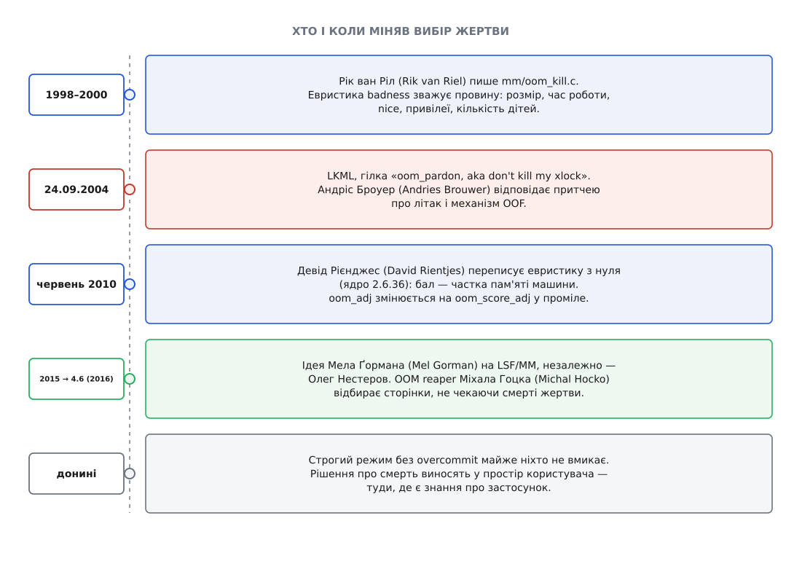

# 📜 Літак без пального: як народився OOM-killer

Механізм, який рятує систему, вбиваючи процес, з'явився не з чистого задуму, а як латка на латку — і найточніший його опис досі належить не документації ядра, а іронічній притчі з листування 2004 року. Ця розповідь — про те, звідки взявся вибір жертви, чому його двічі переписували з нуля і чому суперечка про сам принцип не закінчилася й сьогодні.



*П'ять поворотних точок у житті механізму, який мав би не існувати.*

## Гілка, з якої почалася притча

У вересні 2004-го в linux-kernel з'явився невеликий патч зі спокійною назвою «oom_pardon, aka don't kill my xlock» — «помилування для OOM, або не вбивай мій xlock». Автор, Томас Габетс (Thomas Habets), просив про річ, яка здавалася йому очевидною: дайте sysctl, яким можна оголосити кілька процесів недоторканними, а якщо більше нема кого вбити — хай ядро краще впаде в паніку. Мотив за цим проханням легко відновити з назви. `xlock` — програма, що блокує екран; коли ядро вбиває саме її, розблокована сесія лишається відкритою для будь-кого, хто пройде повз. Ядро вибрало жертву формально правильно і зробило рівно те, чого робити не можна.

Скарги такого штибу тоді сипалися регулярно, і всі мали однакову форму: механізм убив не те. У ядрі жодного поняття «не те» немає — воно бачить лише числа. Патч Габетса пропонував долити в ядро крихту людського знання: список того, що чіпати заборонено.

Відповідь Андріса Броуера (Andries Brouwer) — нідерландського математика й програміста, автора великої частини ранньої Linux-документації — надійшла 24 вересня 2004-го й обійшла технічну суть повністю. *(Статус доказу: перевірено за архівом гілки; лист є в публічному архіві linux-kernel і цитований у тогочасному огляді LWN.)*

## Притча про пальне

Броуер розповів історію про авіакомпанію, яка виявила, що літати з меншим запасом пального вигідніше: літак легший, витрата менша, гроші зекономлено. Зрідка пального все ж бракувало, і літак падав. Інженери розв'язали проблему винахідливо — розробили спеціальний механізм OOF (*out of fuel* — «пальне скінчилося»): у критичній ситуації обирається пасажир і викидається за борт. За потреби процедуру повторюють.

Далі йде найважливіше. Навколо вибору жертви виросла ціла теорія й безліч публікацій. Кого викидати — випадкового? найважчого? найстаршого? Чи дозволити платити за те, щоб тебе не викинули, — і тоді за бортом опиняється найбідніший? А якщо найважчим виявиться пілот, чи потрібен окремий виняток? Чи звільнити від жеребкування перший клас? І нарешті: тепер, коли механізм OOF існує, він час від часу спрацьовує й викидає пасажирів навіть тоді, коли пального цілком вистачає. Інженери досі вивчають, чим саме спричинений цей збій.

Сила притчі в тому, що вона б'є не по патчу Габетса, а по всій рамці розмови. Кожне питання зі списку — це реальна пропозиція, яка тоді або вже лунала, або мала прозвучати згодом: вбивати найбільшого, вбивати наймолодшого, щадити [привілейованих](topic:unix-linux/capabilities), дозволити адміністратору купити недоторканність поправкою в `/proc`. Броуер не сперечається з жодною окремо — він показує, що весь цей корпус теорії обслуговує наслідок, а не причину. Рішення недоливати пальне ніхто не переглядає; удосконалюють лише церемонію викидання. І останній абзац додає жало, яке пече найдужче: механізм, створений для рідкісного лиха, зрештою починає спрацьовувати сам собою.

Ця остання деталь — не риторика, а точний опис справжньої властивості системи. Overcommit і вбивство — не дві незалежні речі, а пара: щойно система звикає жити з роздачею необґрунтованих обіцянок, тиск на межу стає буденним станом, а не аварією. Аналогія, до речі, тримається лише до певної межі, і межу варто назвати. Літак з недоливом пального падає завжди в тому самому сенсі — фізика не залишає вибору. Ядро ж має справу з розподілом, у якому сума максимумів справді набагато більша за максимум суми, тож overcommit — не халтура, а раціональна ставка, яка виграє в переважній більшості випадків. Але саме тому вона й програє нечасто і несподівано, а притча описує не безглуздість ставки, а безглуздість того, як улаштована розплата за програш.

## badness: спроба зважити провину числом

Сам механізм на той час був уже старий. Файл `mm/oom_kill.c` написав Рік ван Ріл (Rik van Riel) — у шапці файла стоїть «Copyright (C) 1998, 2000 Rik van Riel» і подяка Клаусові Фішеру, який, за словами автора, підштовхнув його врешті сісти й це закодувати. *(Статус доказу: перевірено за вихідним кодом ядра.)*

Функція звалася `badness` — «поганість», і завдання її формулювалося як низка бажань, іноді суперечливих: втратити якнайменше вже зробленої роботи, звільнити якнайбільше пам'яті, не чіпати невинних, убити якнайменше процесів і — окремим пунктом — не дивувати користувача.

Основою балу був розмір адресного простору процесу. Далі йшли множники, кожен із яких кодував певне уявлення про справедливість:

```
база     = total_vm (сторінки адресного простору)
+ діти   = половина адресного простору кожної дитини з власним mm
÷ час    = поділ на корені з процесорного часу та часу життя процесу
× 2      = якщо nice > 0 (процес сам оголосив себе неважливим)
÷ 4      = якщо процес має CAP_SYS_ADMIN або CAP_SYS_RESOURCE
÷ 4      = якщо процес має CAP_SYS_RAWIO (прямий доступ до заліза)
÷ 8      = якщо процес не перетинається з вузлами, де скінчилася пам'ять
× 2^adj  = поправка oom_adj: зсув бітів, а не додавання
```

Логіка кожного рядка захищається окремо й звучить розумно. Породжувач із сотнею дітей мусить відповідати за їхню пам'ять, інакше сервер-форкер розплодиться й лишиться безкарним. Процес, що працює третю добу, накопичив більше незамінної роботи, ніж свіжозапущений, — тому час життя зменшує бал. [Знижений пріоритет](topic:unix-linux/priority-nice-realtime) — це заява самого процесу «я не терміновий», і механізм ловить його на слові. Привілейованому дають фору, бо смерть системного демона зазвичай коштує дорожче за смерть застосунку.

Проблема була не в окремих правилах, а в їхньому добутку. Наслідок множення шести коефіцієнтів неможливо утримати в голові; результат не виводиться зі стану системи, а лише вимірюється постфактум. Одна й та сама програма могла бути в безпеці о десятій ранку й першою кандидаткою о десятій вечора — не змінивши поведінки, а просто попрацювавши довше й наплодивши робітників. Саме про цю непередбачуваність питала притча: коли критеріїв стільки, вибір жертви перестає бути наслідком чогось і стає лотереєю з правилами.

## 2010: переписати з нуля

У червні 2010-го Девід Рієнджес (David Rientjes) з Google надіслав те, що сам назвав повним переписуванням евристики. Патч потрапив у ядро 2.6.36. *(Статус доказу: перевірено за комітом `oom: badness heuristic rewrite` у git-історії ядра та оглядом LWN від 7 червня 2010 року.)*

Ідея була рівно протилежна попередній. Замість зважувати провину — питати одну річ: **скільки пам'яті звільнить ця смерть**. Бал став часткою пам'яті, доступної процесові, вираженою так, що процес, який з'їв усе до останнього байта, отримує 1000. Основою стали фактично зайняті сторінки й своп, а не роздані адреси — тобто спожите, а не обіцяне. Від усього попереднього арсеналу лишилася одна поступка: процесам суперкористувача бал трохи зменшували.

Заперечення були серйозні й не зводилися до консерватизму. Переписати підсистему цілком — означає викинути разом із вадами й ті виправлення, що накопичувалися десять років під конкретні сценарії; нова проста формула може працювати гірше в ситуаціях, для яких старі множники й вигадувалися. Найкоротша репліка в тій дискусії складалася з одного слова — «nack», тобто «проти». Обеззброювало заперечників те, що жодна сторона не мала вимірів: ні прибічники, ні критики не показали чисел, на яких видно, чия евристика вбиває вдаліше. Ендрю Мортон урешті ухвалив рішення сам, оголосивши, що необґрунтовані заперечення просто проігнорує. *(Статус доказу: перебіг дискусії — за оглядом LWN; авторства репліки «nack» не називаю, бо в доступному огляді ім'я не наведено.)*

Разом із формулою мінявся й спосіб, яким адміністратор втручається у вибір. Старий `oom_adj` брав значення від −17 до +15 і діяв зсувом бітів: кожна одиниця подвоювала або ділила навпіл, а окреме значення −17 (`OOM_DISABLE`) виводило процес із розгляду взагалі. Шкала була логарифмічна, тобто «на два кроки» означало «вчетверо», і побічний ефект був неприємний — крайнє значення робило процес недоторканним ціною того, що середина шкали поводилася майже непередбачувано.

Новий `oom_score_adj` бере значення від −1000 до +1000 і просто додається до бала. Оскільки бал — це проміле від пам'яті машини, поправка вимірюється в тих самих одиницях: −100 означає «вважай, що цей процес тримає на десяту частину машини менше, ніж тримає насправді». Шкала стала лінійною й, головне, набула фізичного змісту — її можна вирахувати з розміру пам'яті, а не підібрати навпомацки. Старий інтерфейс лишили як сумісний із перерахунком і оголосили застарілим; позбутися його планували в серпні 2012 року, а вилучили в ядрі 3.7 наприкінці того самого року — рідкісний випадок, коли оголошене прибирання [інтерфейсу до простору користувача](topic:unix-linux/userspace-abi-stability) відбулося майже за розкладом.

## Жнець: коли жертва не може вмерти

Наступна велика зміна стосувалася не вибору, а виконання вироку, і виросла з прикрого відкриття: вбити процес — не те саме, що звільнити його пам'ять.

Убитий процес мусить сам розібрати свій адресний простір. Для цього йому треба виконуватися, а щоб виконуватися — треба отримати процесор і взяти блокування власної карти пам'яті. Але процеси вмирають саме тоді, коли пам'яті нема, і в цей момент жертва цілком може стояти в черзі за тим самим блокуванням, яке тримає інший процес, що теж чекає на пам'ять. Виходить глухий кут: система вбила когось і завмерла, чекаючи, поки покійник прибере за собою. Ззовні це виглядає найгірше з можливого — машина не відповідає, хоча ядро вже ухвалило рішення й «розв'язало» проблему.

Вихід запропонував Мел Ґорман (Mel Gorman) на семінарі LSF/MM 2015 року; незалежно ту саму думку висловив Олег Нестеров. Ідея проста до зухвалості: не чекати на жертву. Якщо процес однаково приречений, ядро може забрати його анонімні сторінки одразу — вони вже нікому не знадобляться. Реалізацію — окремий потік ядра `oom_reaper`, «жнець» — написав Міхал Гоцко (Michal Hocko); механізм потрапив у ядро 4.6 навесні 2016-го, а доопрацювання тяглися ще кілька випусків. Жнець не бере блокування наглухо, а пробує його взяти й відступає, повторюючи спробу; сторінки він відбирає, не чекаючи, поки жертва прокинеться. Окремим винятком лишили процеси, що пишуть дамп пам'яті: тут автори свідомо визнали, що здоров'я системи важливіше за можливість потім розібрати аварію. *(Статус доказу: авторство ідеї та реалізації перевірено за текстом коміта `mm, oom: introduce oom reaper`, де Гоцко сам посилається на Ґормана й Нестерова; огляд LWN від 16 грудня 2015-го описує механізм ще до злиття.)*

Знаменно, що жнець нічого не змінює у виборі жертви. Він виправляє те, що двадцять років ніхто не вважав за проблему: припущення, ніби вбитий процес завжди здатен умерти.

## Чому суперечка триває

Строгий режим, у якому ядро відмовляє в пам'яті чесно й ніколи нікого не вбиває, існує з початку 2000-х. Ним майже не користуються — і це найсильніший аргумент на користь overcommit'у. Увімкнувши його на звичайній системі, ви дуже швидко побачите, як програми падають на розгалуженні великого процесу, як [керовані середовища](topic:unix-linux/allocator-and-kernel) не стартують із заявленою межею купи, а тести пам'яті проходять лише на машині з утричі більшим свопом. Пасажири залишаються в літаку — але літак не злітає.

Тому напрям пошуку змістився. Якщо ядро принципово не знає, який процес важливий, знання треба брати там, де воно є, — у просторі користувача, де хтось таки розуміє, що на цій машині база даних цінніша за складальник. Звідси і сторожі, які стежать за тиском на пам'ять і вбивають раніше, ніж ядро дійде до краю, і механізми, що дозволяють ухвалювати рішення не про окремий процес, а про [цілу групу задач](topic:unix-linux/cgroups) — бо вбивство одного робітника з пулу зазвичай не рятує нічого, а лише робить збій незрозумілим. Окремою підпорою став облік [затримок від нестачі ресурсів](topic:unix-linux/load-and-pressure): він дає те, чого раніше не було, — раннє й вимірне «система задихається», замість двійкового «пам'ять скінчилася».

Але ядро все одно лишає у себе останній рубіж, бо мусить: коли пам'яті нема на саме звільнення пам'яті, ніякий демон у просторі користувача вже не встигне нічого зробити. Тому притча Броуера так і не втратила чинності. Механізм OOF нікуди не подівся, вибір жертви став передбачуванішим, виконання вироку — надійнішим, ухвалення рішення потроху переїхало туди, де більше знань. Не змінилося одне: пального в літак і далі заливають менше, ніж потрібно в найгіршому випадку. Це свідомий вибір, який щодня окуповується, — і саме тому інженери й досі студіюють, кого викидати за борт.
