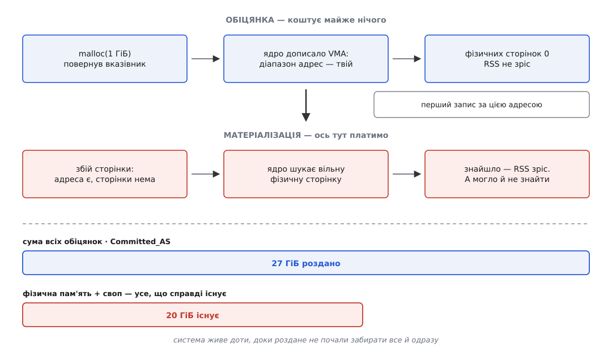
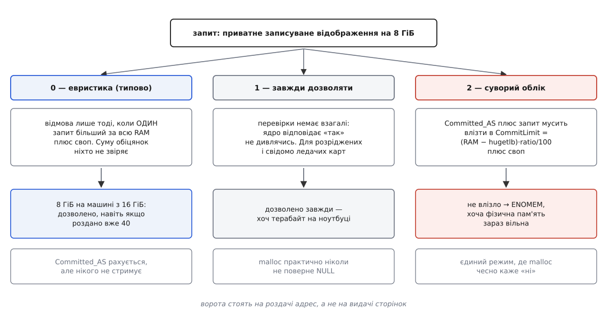
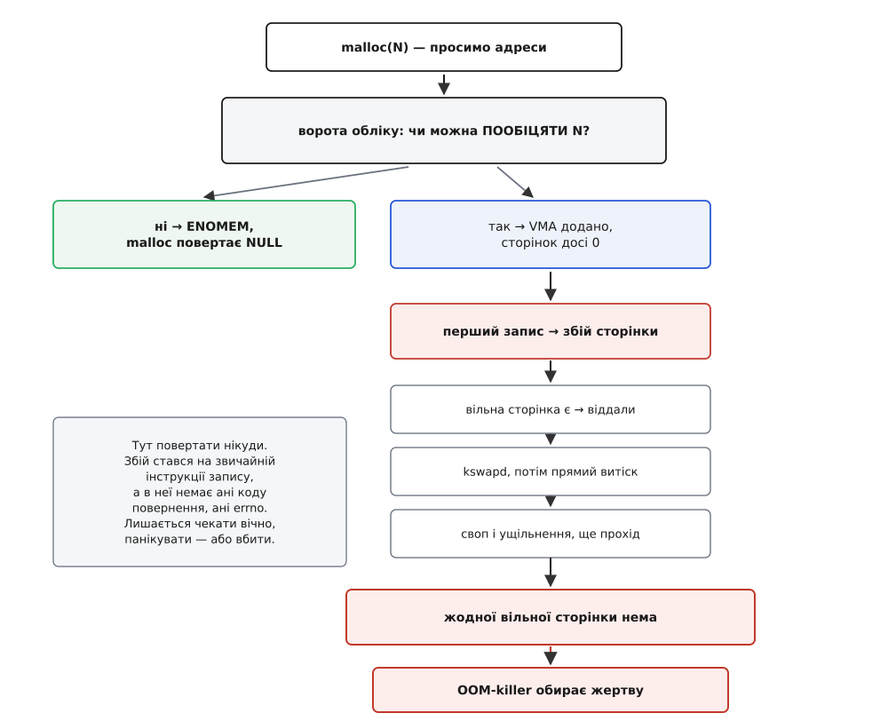
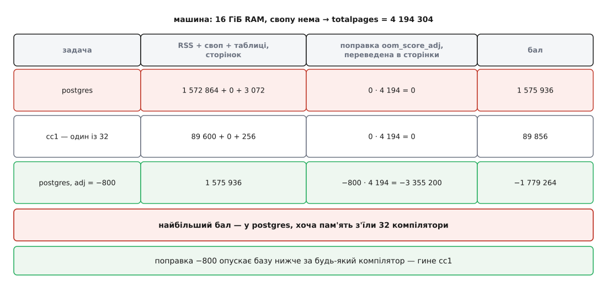

# Overcommit і OOM-killer

<preknowlist>
- [Віртуальний адресний простір процесу](topic:unix-linux/virtual-address-space) — процес бачить власні адреси, а не фізичну пам'ять; сама по собі адреса нічого не важить.
- [Сторінковий збій](topic:unix-linux/page-fault) — фізична сторінка з'являється лише тоді, коли до неї вперше торкнулися.
- [Сторінки, таблиці сторінок і MMU](topic:unix-linux/paging-and-mmu) — одиниця обліку пам'яті — сторінка, зазвичай 4 КіБ.
- [mmap: файл і пам'ять як одне](topic:unix-linux/mmap-model) — приватні й спільні відображення, анонімні й файлові.
- [Копіювання при записі](topic:unix-linux/copy-on-write) — `fork` не копіює пам'ять, а лише позначає сторінки як спільні до першого запису.
- [Свопінг і витіснення сторінок](topic:unix-linux/swap-and-reclaim) — як ядро відбирає вже роздані сторінки назад і що воно робить, коли їх бракує.
- [Звідки алокатор бере пам'ять](topic:unix-linux/allocator-and-kernel) — `malloc` не ходить у ядро на кожен запит, він бере великими шматками через `brk` і `mmap`.
- [Сигнал: асинхронне сповіщення](topic:unix-linux/signal-model) — `SIGKILL` не можна ні перехопити, ні заблокувати, ні відкласти.
- [cgroups: облік і обмеження ресурсів](topic:unix-linux/cgroups) — ядро вміє вести рахунок пам'яті не на процес, а на групу задач.
</preknowlist>

## Дві дивини, за якими стоїть один механізм

Програма попросила гігабайт, `malloc` повернув справний вказівник — не `NULL`, жодної помилки. Через хвилину, посеред спокійного циклу запису в цей самий буфер, процес зник без сліду. У журналі ядра рядок:

```
Out of memory: Killed process 4711 (postgres) total-vm:7340032kB, anon-rss:6279168kB
```

Дивин тут дві, і обидві неприємні. Перша: якщо пам'яті не було, чому `malloc` сказав, що є? Друга: до чого тут `postgres`, коли гігабайт просила зовсім інша програма?

Обидві ростуть з одного кореня. Ядро віддає програмі не пам'ять, а адреси, і видана адреса — це обіцянка, а не річ. Обіцянок роздають більше, ніж є чим їх покрити. Розплата відкладається з `malloc` на перший запис. А коли розплата настає, повертати помилку вже нема кому — і система замість помилки вбиває процес.

Розберімо цей ланцюг ланка за ланкою: спершу чому обіцянка дешева, потім що саме ядро рахує, потім у який момент воно ще здатне відмовити, і нарешті — що воно робить, коли відмовляти вже пізно.

## Чому обіцянка коштує дешево

Уявімо ядро, яке чесно резервує фізичну пам'ять на кожен запит адрес. Що буде на звичайній машині?

Візьмімо `postgres`, який тримає шість гігабайтів. Йому треба запустити маленький допоміжний процес — скажімо, архіватор журналу. Робить він це так само, як усі в Unix: [`fork`](topic:unix-linux/fork-semantics), а потім `exec`. `fork` створює дитину з тим самим адресним простором; сторінки не копіюються, вони [позначаються як спільні до першого запису](topic:unix-linux/copy-on-write). Але чесний резерв мусить припустити найгірше: раптом дитина торкнеться всіх шести гігабайтів, і кожен доведеться скопіювати. Отже, чесний резерв на цей `fork` — шість гігабайтів. На восьмигігабайтній машині другий такий `fork` уже не пройде. А дитина за мілісекунду зробить `exec` і викине весь той адресний простір, не торкнувшись і сотої його частки.

Це не окремий кривий випадок, а норма. Ось інші, з тієї самої породи.

Алокатор бере пам'ять у ядра великими шматками — так дешевше, ніж бігати в ядро за кожним `malloc`. У glibc кожен потік отримує свою арену, і на 64-бітній системі арена резервує 64 МіБ адрес наперед. Шістнадцять потоків — гігабайт адрес, з якого реально записано, може бути й десять мегабайтів.

Стек потоку за замовчуванням — 8 МіБ адрес на потік. Використано з них зазвичай кілька кілобайтів: стек росте ліниво, сторінка за сторінкою.

Розріджені структури просять простір «на максимум»: хеш-таблиця, розрахована на теоретичну межу; масив, індексований усім діапазоном ключів. Наукові розрахунки роблять так свідомо — саме заради них у ядрі є окремий режим, до якого ми дійдемо.

Керовані середовища оголошують межу купи наперед: JVM з `-Xmx8g` бере вісім гігабайтів адрес одразу, Go резервує собі великі діапазони під арени.

Спільне в усіх цих випадках одне. **Одиниця резервування — діапазон адрес, а одиниця споживання — зачеплена сторінка**, і між ними немає жодного обов'язкового зв'язку. Програма просить стільки, скільки може знадобитися; витрачає стільки, скільки знадобилося. А сума максимумів завжди набагато більша за максимум суми: усі мешканці будинку не відкривають крани одночасно, усі вкладники не приходять по гроші в один день, усі процеси не торкаються всіх своїх сторінок в одну хвилину.

Тому ядро й робить те саме, що банк і авіакомпанія: продає більше, ніж має. Механізм так і зветься — **overcommit** (англ. *over* — понад, *commit* — зобов'язатися): роздавати зобов'язань більше, ніж можеш покрити. Ціна відома наперед і теж та сама, що в банку: одного разу по гроші прийдуть усі. Ту неминучу розплату Unix-спільнота обговорила ще у 2004-му, і тодішня іронічна аналогія з літаком, у який заливають менше пального, ніж треба, лишилася найточнішим описом механізму — [про неї та про народження OOM-killer'а](topic:unix-linux/overcommit-and-oom/hist-out-of-fuel.md) є окрема розповідь.



*Адреса з'являється в одну мить, фізична сторінка — в іншу; саме ця щілина дозволяє роздати більше, ніж є.*

> 🔧 **Навіщо це.** Звідси випливає найпоширеніша практична помилка в читанні `top`: колонка `VIRT` показує суму обіцянок, а не спожите. Процес із `VIRT` у 40 ГіБ на 16-гігабайтній машині — не аномалія і не витік; дивитися треба на `RSS`, і навіть він бреше, коли пам'ять спільна. Як міряти чесно — окрема довга розмова про [VSZ, RSS і PSS](topic:unix-linux/memory-accounting).

## Що саме ядро рахує

Хоч overcommit і означає «роздаємо більше», рахунок роздачі ядро все одно веде. Лічильник зветься `Committed_AS` (від *committed address space* — зобов'язаний адресний простір) і видно його в `/proc/meminfo`:

```sh
$ grep -E 'CommitLimit|Committed_AS|MemTotal|SwapTotal' /proc/meminfo
MemTotal:       16327680 kB
SwapTotal:       8388608 kB
CommitLimit:    16552448 kB
Committed_AS:   11982336 kB
```

Важливо одразу зрозуміти, що потрапляє в цей рахунок, бо інтуїція тут підводить. Ядро додає до `Committed_AS` відображення, яке одночасно **записуване**, **приватне** й не позначене прапорцем «резерв не потрібен». Логіка проста: рахуємо те, під що колись доведеться знайти справжню анонімну сторінку.

Приватне записуване анонімне відображення — рахується: записати в нього можна, і кожен запис вимагатиме сторінки.

Приватне записуване відображення файлу — теж рахується: перший запис спрацює [копіюванням при записі](topic:unix-linux/copy-on-write), і на місці сторінки файлу з'явиться приватна анонімна.

Спільне відображення файлу — **не** рахується: за ним стоїть файл, сторінки живуть у сторінковому кеші, і в скруті їх можна просто [скинути на диск і забрати](topic:unix-linux/swap-and-reclaim).

Відображення тільки для читання — не рахується з тієї самої причини: приватної копії ніколи не з'явиться.

Відображення з прапорцем `MAP_NORESERVE` — не рахується за прямим проханням програми: «я знаю, що ця карта розріджена, не резервуй під неї нічого».

Звідси одразу видно межу самого механізму. `Committed_AS` — це облік **обіцянок користувацьких відображень**, і тільки їх. Ядро витрачає пам'ять і на власні потреби — таблиці сторінок, стеки ядра, буфери мережевого стека, кеші inode й dentry, — і жодна з цих витрат у `Committed_AS` не входить. Тому навіть найсуворіший облік не дає повної гарантії: він стримує роздачу обіцянок, але не всі шляхи, якими фізичні сторінки зникають.

## Троє воріт: режими overcommit

Тепер найголовніше питання: у який момент система взагалі здатна сказати «ні»?

Відповідь одна на всі режими. Сказати «ні» можна **тільки на роздачі адрес** — тоді, коли програма ще стоїть усередині виклику `mmap` чи `brk` і чекає на код повернення. Саме там і стоять ворота. Що вони перевіряють — задає перемикач `vm.overcommit_memory`, у якого три значення.



*Ворота стоять на роздачі адрес; після них жодного місця для відмови вже немає.*

**Режим 0 — евристика, стоїть за замовчуванням.** Назва обіцяє щось хитре, але в нинішніх ядрах перевірка гранично проста: відмова лише тоді, коли **один** запит більший за всю фізичну пам'ять плюс увесь своп. Ніякої суми раніше виданих обіцянок ця перевірка не бере до уваги. Тобто на машині з 16 ГіБ пам'яті й 8 ГіБ свопу запит на 20 ГіБ пройде — навіть якщо роздано вже сорок. А от `malloc(64ULL << 30)` на такій машині поверне `NULL`, і це весь захист, який дає типова конфігурація.

**Режим 1 — завжди дозволяти.** Перевірки немає взагалі: ядро повертає «так», не дивлячись. Це режим для тих, хто свідомо працює з величезними розрідженими картами й точно знає, що торкнеться лише малої їх частини. У такій конфігурації `malloc` не поверне `NULL` практично ніколи — принаймні доки не скінчаться самі адреси.

**Режим 2 — суворий облік.** Ось тут ворота справді щось стережуть. Ядро тримає стелю `CommitLimit` і не дає сумі обіцянок її перевищити:

```
CommitLimit = (RAM − hugetlb) · overcommit_ratio / 100 + swap
```

Тобто: уся фізична пам'ять, з якої відняли [великі сторінки](topic:unix-linux/huge-pages) (у них власний облік), помножена на налаштовану частку, плюс увесь своп. Замість частки можна задати абсолютне число через `vm.overcommit_kbytes` — тоді стеля рахується як це число плюс своп.

**Умова: 16 ГіБ пам'яті, 8 ГіБ свопу, великих сторінок нема, `overcommit_ratio` = 50 (типове значення), роздано вже 11 ГіБ. Просимо ще 6 ГіБ приватного анонімного відображення.**

```
CommitLimit   = 16 · 50/100 + 8   = 8 + 8   = 16 ГіБ
Committed_AS  = 11 ГіБ
запит         = 6 ГіБ
11 + 6 = 17 ГіБ  >  16 ГіБ        → ENOMEM
```

`mmap` повертає `MAP_FAILED`, `malloc` повертає `NULL` — попри те, що фізичної пам'яті просто зараз вільно, скажімо, дванадцять гігабайтів. Це і є ціна чесності: система відмовляє не тому, що пам'яті нема, а тому, що вона вже пообіцяна комусь іншому і не хоче обіцяти двічі.

Ціна ця відчутна. При `ratio` = 50 і без свопу машина з 16 ГіБ дозволить пообіцяти лише вісім — половина пам'яті стає недосяжною для зобов'язань, хоч і придатною для сторінкового кеша. Тому на серверах, що працюють у режимі 2, частку піднімають до 80–100 і вище; вона може перевищувати сто — тоді overcommit є, але обмежений і порахований. Окремо ядро віднімає від стелі невеликі резерви — щоб адміністратор міг зайти й полагодити систему (`admin_reserve_kbytes`) і щоб один процес не з'їв усе так, що користувач не встигне його вбити (`user_reserve_kbytes`).

І ще один тверезий висновок. Режим 2 істотно зменшує ймовірність катастрофи, але не скасовує її. Своп входить у стелю як повноцінна пам'ять, хоч працювати з нього — це на порядки повільніше; ядерні витрати в облік не входять узагалі. Тому вбивство процесу можливе й тут — просто набагато рідше.

Усі перемикачі, файли й точні значення зібрані окремо — [довідка по ручках overcommit і OOM](topic:unix-linux/overcommit-and-oom/api-oom-knobs.md); тут вони згадані лише настільки, наскільки потрібні для розуміння механізму.

## Момент істини: збій сторінки, у якого немає зворотного каналу

Ворота позаду, VMA додано, `malloc` віддав вказівник. Фізичних сторінок за ним досі нуль.

Тепер програма пише в цю пам'ять. Процесор іде в таблицю сторінок, не знаходить відображення й здіймає [збій сторінки](topic:unix-linux/page-fault). Ядро дивиться: адреса законна, VMA є, треба видати фізичну сторінку. І йде її шукати.

Пошук — це не одна дія, а сходинки. Спершу ядро бере сторінку з вільного списку. Якщо вільних менше за нижню позначку, прокидається `kswapd` і починає [витісняти](topic:unix-linux/swap-and-reclaim) у фоні. Якщо й це не встигає, потік, що спричинив збій, витісняє сам — скидає чистий сторінковий кеш, виносить анонімні сторінки у своп, ущільнює фрагментовану пам'ять і пробує знову.

І ось найцікавіше: припустімо, усе це вичерпано. Сторінки нема й узяти її нема звідки. **Куди повернути помилку?**

Нікуди. Збій стався не на системному виклику, а на звичайній інструкції запису — десь на кшталт `mov [rax], 1`. У цієї інструкції немає коду повернення. У мовах програмування немає способу написати «цей запис у пам'ять може не вдатися»: жодна мова не має конструкції для обробки невдалого присвоєння. Контракт, за яким програму писали, каже: якщо вказівник справний, запис за ним відбувається. Скасувати цей контракт ядро не може — воно може тільки не дожити до його порушення.



*Після воріт обліку зворотного каналу вже нема: збій сторінки не має способу сказати «не вдалося».*

Отже, у ядра є рівно три виходи, і кожен поганий.

Можна **зупинити процес назавжди** — хай чекає, доки пам'ять з'явиться. Але вона може не з'явитися ніколи, а процес, що заснув у ядрі, тримає замки; за ним зупиниться той, хто чекає на ці замки, і машина стане повністю, без жодного шансу на втручання ззовні.

Можна **впасти в паніку** — зупинити ядро цілком. Для машини, у якої є хто перезавантажить і підняти її дешевше, ніж розбиратися, це навіть розумно, і такий режим є (`vm.panic_on_oom`). Для сервера з базою — ні.

Можна **вбити когось із процесів**, щоб його сторінки повернулися у вільний список, і продовжити роботу. Це найменш поганий вихід, і саме його Linux обрав. Механізм зветься **OOM-killer** (англ. *out of memory* — пам'ять скінчилася).

Зверніть увагу на неочевидний наслідок: вбивати того, хто спричинив збій, здебільшого безглуздо. Збій міг здійняти крихітний `bash`, який просив одну сторінку, тоді як пам'ять тримає зовсім інша програма. Убити його — звільнити нічого й за секунду опинитися в тій самій ситуації. Треба звільнити **достатньо**, а це означає шукати не винного, а великого.

## Кого вбивати

Ядро обходить усі задачі й рахує кожній бал (у коді функція зветься `oom_badness`, буквально «поганість»). Бал — це, по суті, відповідь на питання «скільки сторінок звільнить смерть цієї задачі»:

```
бал = RSS + сторінки у свопі + сторінки таблиць сторінок
```

Три доданки, і кожен на своєму місці. `RSS` — резидентні сторінки, ті, що звільняться одразу. Сторінки у свопі — теж ресурс, який повернеться. Таблиці сторінок — власні витрати ядра на цю задачу, і в процесів з великим розрідженим простором вони бувають несподівано товсті.

До цієї суми додається поправка, яку виставляє людина: `oom_score_adj` у діапазоні від −1000 до +1000. Поправка задана в проміле від усієї пам'яті машини, тому ядро спершу переводить її в сторінки:

```
поправка_у_сторінках = oom_score_adj · (totalpages / 1000)
бал = RSS + своп + таблиці + поправка_у_сторінках
```

Значення −1000 — окремий випадок: воно не просто дає велике від'ємне число, а виводить задачу з розгляду взагалі. Убити її OOM-killer не може ні за яких обставин.

**Умова: машина 16 ГіБ, свопу нема (`totalpages` = 4 194 304 сторінки по 4 КіБ). Працює база на 6 ГіБ і збірка `make -j32`, кожен `cc1` тримає близько 350 МіБ.**

```
переведення поправки: totalpages / 1000 = 4 194 сторінки  (≈ 16.4 МіБ на одиницю adj)

postgres:  RSS 6 ГіБ = 1 572 864 стор.
           таблиці 12 МіБ =  3 072 стор.
           adj = 0        →     0
           бал = 1 572 864 + 3 072 + 0        = 1 575 936

cc1:       RSS 350 МіБ =  89 600 стор.
           таблиці 1 МіБ =    256 стор.
           adj = 0        →     0
           бал =    89 600 +   256 + 0        =    89 856

найбільший бал → жертва: postgres
```

Ось вона, друга дивина з початку. Пам'ять з'їли тридцять два компілятори — по окремості кожен скромний, разом одинадцять гігабайтів. Гине база, бо вона одна велика. OOM-killer не шукає винного; він шукає, кого вигідніше вбити, щоб одним ударом звільнити найбільше. Це раціонально й водночас майже завжди не те, чого хотів адміністратор.

Виправляють це поправкою:

```
postgres з adj = −800:
           поправка = −800 · 4 194 = −3 355 200
           бал = 1 575 936 − 3 355 200 = −1 779 264   → нижче за будь-який cc1
```

Тепер жертвою стане `cc1` — один із тридцяти двох, збірка це переживе.



*Бал — це кількість сторінок, яку звільнить смерть; поправка теж переводиться у сторінки й зсуває саме цю суму.*

Є й тонкість, через яку бал системно несправедливий до баз даних і серверів зі спільною пам'яттю: `RSS` рахує спільні сторінки повністю кожному, хто їх відобразив. Два процеси, що поділяють сегмент на 4 ГіБ, обидва покажуть 4 ГіБ, хоча фізично сторінок 4 ГіБ, а не вісім. Убивство одного з них звільнить набагато менше, ніж обіцяє бал. Про те, звідки береться ця розбіжність і як її обійти, — стаття [про VSZ, RSS і PSS](topic:unix-linux/memory-accounting).

Тому єдиний надійний спосіб керувати вибором — виставляти поправки самому. Для служб під systemd це робиться директивою `OOMScoreAdjust=` в юніті; для окремого процесу — записом у `/proc/<pid>/oom_score_adj`. Правило просте: **тому, чия смерть коштує найдорожче, дають найменше**, а тому, кого не шкода, — найбільше. Побачити ефект наочно, разом із тим, як `malloc` віддає гігабайти, які не існують, дозволяє [маленька програма для експериментів](topic:unix-linux/overcommit-and-oom/proj-touch-the-promise.md).

## Убити мало — треба ще й забрати

Жертву обрано, їй іде `SIGKILL`. Здавалося б, кінець історії: процес помре, ядро розбере його адресний простір, сторінки повернуться. Але між «послали сигнал» і «сторінки повернулися» є проміжок, і колись саме він був найбільшою бідою OOM-killer'а.

`SIGKILL` не можна проігнорувати, але його доставка потребує, щоб задача дійшла до точки, де ядро перевіряє сигнали. Якщо задача стоїть на замку — а в умовах вичерпаної пам'яті вона цілком може стояти саме на замку, пов'язаному з пам'яттю, — вона не дійде. Виходило замкнене коло: пам'яті нема, бо жертва її тримає; жертва не вмирає, бо чекає на пам'ять. Система заклякала намертво, іноді на годину, іноді назавжди, і другого OOM ядро не починало, бо перший ще не завершився.

Розв'язок з'явився у ядрі 4.6 (2016): окремий потік ядра, **OOM reaper** (англ. *reaper* — жнець). Ідея належить Мелові Ґорману й обговорювалася на LSF/MM 2015, незалежно її ж підняв Олег Нестеров; реалізував Міхал Гоцко. Жнець не чекає, доки жертва помре сама: він паралельно проходить її адресним простором і **знімає анонімні сторінки, не чекаючи на завершення процесу**. Робити це безпечно, бо процес уже приречений і побачити наслідки не встигне. Пам'ять повертається за мілісекунди, замкнене коло розривається, а сам процес доживає своє й зникає у власному темпі.

## Локальний OOM: коли пам'ять скінчилася не у всіх

Усе описане вище — глобальна катастрофа: пам'ять скінчилася у машини. Але сучасна система рідко ділить пам'ять «усі з усіма»: роботу розкладено по [контрольних групах](topic:unix-linux/cgroups), і в кожної своя стеля.

Тут механізм повторюється на менший масштаб — і від цього стає значно кориснішим. Група має `memory.max`; коли облік групи впирається в цю межу, ядро спершу витісняє **всередині групи**: скидає її сторінковий кеш, виносить її анонімні сторінки у своп. Якщо витіснити нічого, оголошується OOM **у межах групи** — і жертву шукають лише серед її задач. Решта машини цього навіть не помічає.

Наслідки для практики величезні. По-перше, збірка, що зжерла пам'ять, убиває себе, а не базу в сусідній групі — та сама проблема, що потребувала поправок `oom_score_adj`, зникає сама, бо змінилася область пошуку жертви. По-друге, подія стає **звичайною**, а не винятковою: контейнер, що вийшов за `memory.max`, гине щодня, і оркестратор просто піднімає його знову — саме звідси береться код виходу 137 (128 + 9, тобто `SIGKILL`) у журналах Kubernetes. По-третє, лічильники в `memory.events` дозволяють це бачити: `oom` — скільки разів група впиралася в стелю, `oom_kill` — скільки задач у ній убито.

Окремо варто знати про перемикач `memory.oom.group` (ядро 4.19, автор — Роман Гущин). Без нього ядро вбиває одну задачу з групи, і група лишається понівеченою: контейнер, у якого забрали один процес із п'яти, часто не працює, але й не помирає, тож наглядач не бачить приводу його перезапустити. З увімкненим прапорцем ядро вбиває **всю групу цілком** — і це чесніше: одиниця роботи або жива, або мертва, третього стану нема.

> 🔧 **Навіщо це.** Практичний висновок сильніший, ніж здається: правильний спосіб приборкати OOM — не крутити поправки, а **розкласти роботу по групах зі стелями**. Тоді питання «кого вбити» вирішується не евристикою над усією машиною, а межею тієї одиниці роботи, яка вийшла за домовленість. Поправки `oom_score_adj` після цього лишаються рідкісним інструментом для тих кількох служб, які групами не накриті.

## Ядерний OOM спрацьовує надто пізно

Є ще одна річ, яку варто зрозуміти про цей механізм: **на момент, коли він спрацював, машина вже давно непридатна до роботи**.

Простежмо, що відбувається перед вбивством. Пам'яті бракує → ядро витісняє сторінковий кеш → з кеша викидається виконуваний код програм → програма звертається до свого ж коду й отримує збій сторінки → код читається з диска → щоб звільнити місце, викидається щось інше. Система входить у **буксування**: майже весь час іде на переливання сторінок туди-сюди, корисної роботи не робиться майже ніякої. Формально пам'ять ще витісняється, тобто ядро вважає, що воно справляється, і OOM не оголошує. Фактично сервер уже не відповідає, і триває це десятки секунд, а бува й довше.

Ядерний OOM — це остання межа, запобіжник від повного заклякання, а не інструмент керування пам'яттю. Реагувати на біду треба раніше, і для цього потрібен показник, який ловить саме буксування, а не залишок вільної пам'яті.

Такий показник у ядрі є з версії 4.20 — **PSI** (англ. *pressure stall information* — відомості про простій під тиском), робота Йоганнеса Вайнера. PSI міряє не скільки пам'яті вільно, а який відсоток часу задачі **простояли, чекаючи на пам'ять**. Це саме те число, що росте під час буксування задовго до OOM. Докладніше — [про середнє навантаження й тиск на ресурси](topic:unix-linux/load-and-pressure).

На PSI спираються наглядачі з простору користувача, які вбивають раніше й розумніше за ядро: `systemd-oomd` (з systemd 247, 2020) стежить за тиском у контрольних групах і вбиває групу, коли тиск довго тримається вище за поріг; простіший `earlyoom` стежить за вільною пам'яттю й свопом. Обидва мають перед ядром одну вирішальну перевагу: вони працюють, доки система ще жива, і тому можуть вибирати жертву за правилами, а не за розміром.

## Що з цього робити

Зберімо практичні висновки — не як перелік порад, а як наслідки з механізму.

**Перевіряти `malloc` на `NULL` варто, але не заради OOM.** У типовому режимі 0 `NULL` майже не трапляється, і на нього не варто розраховувати як на захист. Але він цілком реальний у режимі 2, при вичерпанні адрес на 32-бітних системах і — найважливіше — коли на процес виставлено [ліміт `RLIMIT_AS`](topic:unix-linux/resource-limits). Останнє й дає єдиний спосіб змусити програму **чесно провалитися замість того, щоб бути вбитою**: ліміт обмежує адресний простір, тобто саме обіцянку, і спрацьовує на воротах, де помилку ще є куди повернути.

**`MAP_NORESERVE` — для карт, які свідомо розріджені.** Якщо ви відображаєте терабайт під індекс, з якого торкнетеся гігабайта, скажіть це прямо; тоді облік не витрачатиме на вас стелю. Але прохання чинне лише доти, доки система й так роздає в борг: у суворому режимі 2 ядро прапорець ігнорує і рахує ділянку повністю.

**Своп — не «додаткова пам'ять», а амортизатор.** Він не рятує від вичерпання, зате перетворює обрив на схил: холодні сторінки йдуть на диск, тиск наростає поступово, і в наглядача з'являється час зреагувати. Той самий сенс має `zram` — стиснений своп у самій пам'яті, який дає цю плавність без диска.

**Стеля на одиницю роботи важливіша за поправки.** Обмежена група перетворює глобальну катастрофу на локальну подію, яку видно в лічильниках і яку переживе решта машини.

**Проєктувати треба на перезапуск.** Обробити своє вбивство процес не може: `SIGKILL` не перехоплюється, обробника не буде, дані не збережуться. Значить, стійкість дає не обробка, а те, що робиться до неї — журнал, з якого можна відновитися, і наглядач, який підніме службу.

Загальна ж форма всієї цієї конструкції така. У Unix помилка зазвичай повертається тому, хто про неї попросив: викликав — отримав код повернення, вирішуй сам. Вичерпання пам'яті ламає цю схему, бо запит і платіж рознесені в часі: попросив один, а розплата настає в момент запису, у якого немає зворотного каналу. Тому помилку довелося перетворити з коду повернення на сигнал, а адресата — з того, хто просив, на того, хто найбільший. Overcommit і OOM-killer — не два окремі механізми, а дві половини однієї угоди: перша роздає обіцянки, друга покриває їх чужим життям.
