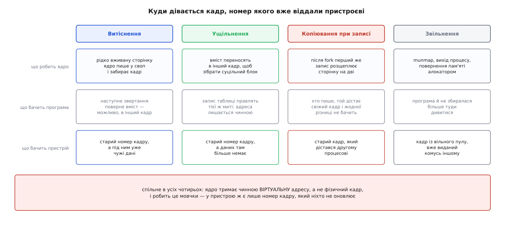
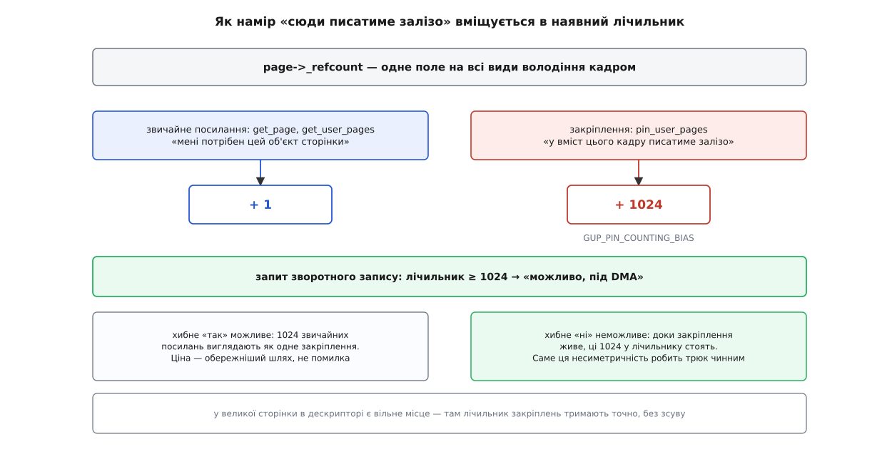
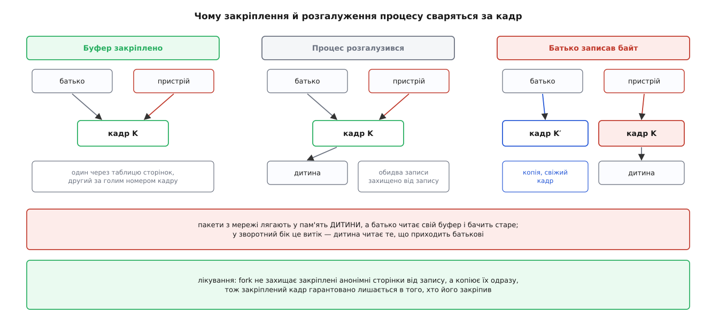

# Закріплення сторінок для пристрою: get_user_pages і pin_user_pages

<preknowlist>
- [Сторінки, таблиці сторінок і MMU](topic:unix-linux/paging-and-mmu) — відповідність «віртуальна сторінка → фізичний кадр» лежить у таблицях, і апаратура читає їх під час кожного звертання.
- [Віртуальний адресний простір процесу](topic:unix-linux/virtual-address-space) — простір складається з ділянок зі своїми межами, правами й походженням.
- [Сторінковий збій](topic:unix-linux/page-fault) — сторінки з'являються у фізичній пам'яті лише тоді, коли до них уперше звернулися.
- [Свопінг і витіснення сторінок](topic:unix-linux/swap-and-reclaim) — ядро будь-коли може забрати кадр, записавши його вміст деінде.
- [Фізичні сторінки в ядрі: зони, блоки за порядками й ущільнення](topic:unix-linux/physical-page-allocator) — пам'ять поділена на зони, і вміст сторінок переносять між кадрами, щоб зібрати суцільні блоки.
- [Копіювання при записі](topic:unix-linux/copy-on-write) — спільну сторінку розщеплюють на дві при першому ж записі.
- [fork: розмноження процесу](topic:unix-linux/fork-semantics) — нащадок дістає копію адресного простору того, хто його викликав.
- [Зворотне відображення сторінки](topic:unix-linux/reverse-mapping) — за фізичним кадром ядро вміє знайти всі записи таблиць, що на нього вказують.
- [Кеш сторінок, fsync і довговічність запису](topic:unix-linux/page-cache-durability) — змінені сторінки файлу ядро зводить на диск окремим проходом зворотного запису.
- [DMA і відображення буферів у ядрі](topic:unix-linux/dma-and-buffers) — пристрій працює з пам'яттю без процесора, і адреса в його регістрі — не та, якою користується програма.
</preknowlist>

Програма завела буфер і просить пристрій наповнити його самотужки: мережева карта покладе туди пакети, плата захоплення — кадр відео, дисковий контролер — прочитані блоки. Контролер ходить у пам'ять повз процесор, тож у його регістрі має стояти адреса, яку розуміє шина, а не та, якою послуговується програма. Хтось мусить перекласти одну в іншу — і сам переклад буденний: пройти таблицями зверху вниз і дістати номер кадру.

Незручність в іншому. Переклад дає відповідь, чинну **на мить**, коли його зробили. А скористається нею пристрій пізніше: дисковий контролер — за десятки мікросекунд, мережева карта із заздалегідь зареєстрованим буфером — може, за тиждень безперервної роботи. Між цими двома моментами ядро має цілковите право переставити пам'ять місцями, і ніхто його про цей номер кадру не попереджав.

## Кадр, що тікає з-під пристрою

Способів утратити кадр рівно чотири, і всі вони — не збої, а звичайна робота підсистеми пам'яті.

**Витіснення.** Сторінку, до якої давно не зверталися, ядро записує у своп і віддає кадр тому, кому він потрібніший. Наступне звертання програми відновить вміст — можливо, вже в іншому кадрі.

**Ущільнення.** Щоб зібрати суцільний блок під велику сторінку чи під пристрій, який не вміє збирати дані з розсипу, ядро переносить вміст окремих сторінок в інші кадри. Запис таблиці правлять тієї ж миті, тож віртуальна адреса лишається чинною.

**Копіювання при записі.** Після розгалуження процесу перший же запис у спільну сторінку розщеплює її: той, хто писав, дістає свіжий кадр із копією, старий лишається другому.

**Звільнення.** `munmap`, вихід процесу, повернення пам'яті алокатором — кадр іде у вільний пул і за мить може бути виданий комусь зовсім іншому.



*Спільне в усіх чотирьох одне: ядро тримає чинною віртуальну адресу, а не фізичний кадр — і робить це мовчки.*

Ось де корінь. Уся підсистема пам'яті побудована на обіцянці, даній **програмі**: твоя адреса завжди означатиме твої дані. Обіцянка не сказала нічого про те, у якому кадрі ці дані лежать, — саме ця свобода й дає змогу витісняти, ущільнювати й розщеплювати. Пристрій же тримає голий номер кадру: у нього немає ні таблиці, яку ядро могло б поправити, ні збою, який ядро могло б перехопити. Він просто напише за старою адресою — у пам'ять, яка тепер належить іншому процесові, іншому файлові або ще нікому.

Отже, перед тим як віддати номер кадру назовні, треба **заборонити всі чотири** дії саме для цього кадру. Не для всієї пам'яті, не назавжди — а рівно доти, доки пристрій із ним працює.

## Що означає «тримати сторінку»

Заборона вже майже існує. Кожен фізичний кадр описаний у ядрі невеликою структурою, і в ній є лічильник посилань — скільки місць у системі тримають цей кадр за живий. Кадр не потрапить у вільний пул, доки лічильник не впаде до нуля; це та сама арифметика, якою кеш сторінок і файлові дескриптори продовжують життя даних понад життям посилань на них.

Витіснення й ущільнення спираються на той самий лічильник, тільки суворіше. Щоб перенести вміст в інший кадр, ядро мусить знати **всіх** власників посилань і поправити всі місця, які на кадр указують. Тому перенесення починається з перевірки: чи дорівнює лічильник саме тому числу, яке очікується від відомих власників. Зайве посилання від когось невідомого означає, що поправити всі вказівники не вийде, — і перенесення чесно відмовляється. Так само відмовляється витіснення.

Звідси прийом: **узяти на сторінку посилання й не віддавати його, доки пристрій працює**. Одна дія закриває всі чотири дірки: кадр не звільнять, не витіснять, не перенесуть. З копіюванням при записі складніше — до нього ще повернемося.

Робить це один виклик, і робить одразу три речі:

1. **проходить таблицями сторінок** для заданого діапазону адрес у заданому адресному просторі — не обов'язково у своєму власному, драйвер часто ходить у простір процесу, який його покликав;
2. **змушує сторінки з'явитися** там, де їх іще немає: якщо запису в таблиці немає, викликається та сама обробка збою, що спрацювала б від звичайної машинної інструкції, — з перевіркою прав ділянки, підвантаженням із файлу, виділенням чистої сторінки під анонімну пам'ять;
3. **бере посилання** на кожну знайдену сторінку й повертає масив покажчиків на їхні описи, звідки драйвер уже дістає номери кадрів.

Виклик зветься `get_user_pages` — «дістати сторінки користувача», у розмові ядерників просто GUP. З цих трьох дій друга робить його тим, чим він є: він не питає про стан пам'яті, а **приводить її в потрібний стан**. Тому він може заснути (чекати на диск, чекати на вільний кадр) і не годиться для контексту переривання; є ще й швидкий різновид, що пробує пройти таблицями без узяття замків і відступає до повільного шляху, коли не вийшло.

> 🔧 **Навіщо це.** Драйвер, що приймає від програми покажчик на буфер через `ioctl`, не має права просто розіменувати цей покажчик після повернення з системного виклику: адреса чинна лише в контексті того процесу, а сторінка під нею — лише цієї миті. Закріплення — це рівно та дія, що перетворює «покажчик того, хто мене покликав» на «пам'ять, до якої може торкатися залізо».

## Дірка, якої лічильник не бачить

Лічильник каже, що кадр комусь потрібен. Він не каже, **навіщо**.

Різниця між намірами виявляється там, де на пам'ять дивиться ще один механізм — зворотний запис файлових сторінок. Коли ядро зводить змінену сторінку файлу на диск, воно спершу знімає з неї позначку «брудна» й забороняє запис у всіх записах таблиць, що на неї вказують. Логіка бездоганна: відтепер будь-яка спроба щось у ній змінити впаде в збій, і ядро знову позначить сторінку брудною. Тобто вміст на час запису на диск заморожено.

Заморожено — для процесора. Пристрій пише повз таблиці сторінок: жодного збою, жодної позначки. Він змінює вміст саме тоді, коли ядро вважає його непорушним. Наслідок буває двобічний: на диск лягає суміш старого й нового, а сторінка після цього має позначку «чиста», тож нові дані можуть не потрапити на диск ніколи.

Чому лічильник тут не рятує? Тому що його підвищують **усі**: обхід списків, кеш, тимчасове посилання на час однієї функції. Якби зворотний запис відступав щоразу, коли лічильник більший за очікуваний, він відступав би завжди. Потрібне не «хтось тримає», а конкретне питання: **чи пише в цю сторінку залізо просто зараз**. І відповідь має бути доступна з опису сторінки, дешево, посеред гарячого шляху.

## Куди записати намір

Найпростіше — додати в опис сторінки ще одне поле. Порахуймо, у що це стало б.

**Умова.** Машина з 64 ГіБ оперативної пам'яті, сторінка 4 КіБ; описи сторінок існують для всієї пам'яті одразу.

```
кадрів усього         = 64 ГіБ / 4 КіБ      = 16 777 216
+8 байтів на опис     = 16 777 216 · 8 Б    = 128 МіБ
```

Сто двадцять вісім мегабайтів, з'їдених назавжди заради ознаки, яка потрібна мізерній частці сторінок, — уже поганий обмін. Гірше інше: опис сторінки роками втискали в розмір, кратний рядку кеша, і кожне зайве поле в ньому псує щільність усім, хто ці описи перебирає.

Тому намір закодували в лічильнику, який уже є. Звичайне посилання додає до нього одиницю. Закріплення додає **1024**. Питання «чи під DMA ця сторінка» перетворюється на порівняння: лічильник не менший за 1024 — вважаємо, що так.



*Зсув робить відповідь наближеною лише в один бік — і саме тому нею можна користуватися.*

Наближеність тут не недогляд, а свідомо прийнята умова. Тисяча двадцять чотири одночасні звичайні посилання на одну сторінку виглядатимуть як одне закріплення — відповідь «так» буде хибною. Але помилка в цей бік нікого не ламає: зворотний запис просто обере обережніший шлях і трохи втратить у швидкості. А от помилка у зворотний бік неможлива за побудовою: доки закріплення живе, ці 1024 у лічильнику стоять, і відповіді «ні» на закріплену сторінку не буде ніколи. Механізм безпечний саме через цю несиметричність. Число 1024 у коді зветься `GUP_PIN_COUNTING_BIAS`; у великих сторінок в описі є вільне місце, тож там кількість закріплень тримають точно, без жодного зсуву.

Варто відразу сказати чесно, де межа. Закріплення саме собою нічого не забороняє зворотному записові — воно робить стан **видимим**. Порахувати закріплення виявилося простіше, ніж навчити кожен шлях кожної файлової системи ставити це питання й правильно поводитися з відповіддю; ця робота розтягнулася на роки після появи самого механізму.

## Дві сім'ї викликів

Оскільки намір тепер кодується по-різному, взяття посилання розділилося на дві сім'ї.

`get_user_pages` лишився там, де потрібен **сам об'єкт сторінки**: побудувати з нього структуру запиту, полічити щось, віддати іншій підсистемі ядра. Звільняється таке посилання звичайним `put_page`.

`pin_user_pages` з'явився там, де хтось **торкатиметься вмісту** кадру повз таблиці сторінок — тобто в кожного драйвера, що віддає буфер контролерові. Звільняється воно окремим `unpin_user_pages`, який зніме рівно 1024, а не одиницю.

Правило вибору формулюється одним питанням: чи буде змінено або прочитано **вміст** кадру в обхід процесора. Так — закріплюємо; ні — беремо звичайне посилання. Переплутати сім'ї при звільненні означає зіпсувати лічильник: кадр або застрягне назавжди, або звільниться під живим пристроєм. Перевірити це компілятором ніяк, тому в документації ядра випадки вживання перелічені явно й пронумеровані — від прямого вводу-виводу до драйверів, що працюють через сповіщення замість закріплення.

Сімейство `pin_user_pages` разом із внутрішнім прапорцем `FOLL_PIN` увійшло в ядро 5.6 (березень 2020) — це робота Джона Габбарда з NVIDIA, яку до того довго обговорювали на зустрічах розробників підсистеми пам'яті. Переведення всіх наявних місць виклику на нову сім'ю — окрема тривала праця, що йде дотепер. Повний перелік викликів, прапорців, домовленостей про часткову вдачу й лічильники в `/proc/vmstat` зібрано окремо: [сімейство викликів закріплення](topic:unix-linux/page-pinning-gup/api-gup-family.md).

## Коротке закріплення й довге

Тривалість закріплення важить не менше, ніж намір.

[Прямий ввід-вивід](topic:unix-linux/buffered-and-direct-io) закріплює буфер, віддає запит, чекає завершення й відпускає — мілісекунди. Підсистема пам'яті на цей час просто зачекає: ущільнення відкладеться, витіснення обере іншу сторінку.

Реєстрація буферів у мережевій карті з віддаленим доступом до пам'яті, передавання пристрою у віртуальну машину, [зареєстровані буфери io_uring](topic:unix-linux/io-uring) — це інша шкала. Закріплення живе, доки живе реєстрація: години, дні, увесь час роботи сервера.

Різниця в тривалості перетворюється на різницю в наслідках. Частина фізичної пам'яті виділена саме під те, щоб її вміст **можна було звідти прибрати**: рухома зона, з якої вивільняють плати пам'яті при гарячому вилученні, і [резерв суцільної пам'яті для пристроїв](topic:unix-linux/cma-contiguous-allocator), який стоїть порожнім рівно для того, щоб віддати суцільний блок на першу вимогу. Одна закріплена на добу сторінка посеред такої ділянки перекреслює її призначення: зібрати суцільний блок навколо неї вже не вийде.

Тому довге закріплення позначають окремо. Ядро спершу **переносить** такі сторінки геть із рухомих ділянок — у звичайну пам'ять, звідки їх ніхто й не збирався вивільняти, — і лише потім закріплює копії; заразом контекст виділення пам'яті для цього проходу позначають так, щоб нові сторінки й не бралися звідти. Коли перенести не вдається, закріплення чесно провалюється, і драйвер бачить помилку замість тихої біди через місяць.

Довге закріплення коштує й самому процесові. Закріплена сторінка не витісняється, тобто це фактично замкнена в пам'яті ділянка, і її обсяг упирається в [межу замкненої пам'яті](topic:unix-linux/memory-locking) з набору [лімітів ресурсів](topic:unix-linux/resource-limits). Ба більше, закріплення переживає процес: якщо драйвер не відпустив посилання, вихід процесу звільнить адресний простір, але не кадр — пам'ять зникне зі звітів про процес і не повернеться в пул. Такий витік видно лише за системними лічильниками закріплень.

## Закріплення проти розгалуження

Лишилася четверта дірка — копіювання при записі. Вона підступніша за решту, бо тут кадр забирають не в пристрою, а в **процесу**.

Хай процес закріпив анонімний буфер під мережеву карту, а потім розгалузився — сам чи через бібліотеку, яка робить це заради запуску сторонньої програми. Розгалуження робить сторінки буфера спільними й забороняє в них запис з обох боків. Далі батько кладе байт у свій буфер: спрацьовує збій, ядро дає батькові свіжий кадр із копією, а старий кадр лишається дитині. Тепер таблиця батька вказує на нову копію, а карта пише за старим номером — тобто в пам'ять дитини.



*Розщеплення відводить убік того, хто пише, — а закріплення тримає того, кого відвели від.*

Наслідки залежать від напрямку передавання. Пакети, що приходять із мережі, лягають у чужу пам'ять, а батько читає свій буфер і бачить старе. У зворотний бік це вже витік: дитина читає дані, призначені батькові. Роками користувацькі бібліотеки обходили це вручну — позначали зареєстровані ділянки так, щоб нащадок їх узагалі не успадковував.

Лікування в ядрі виявилося точним: розгалуження перестало захищати закріплені анонімні сторінки від запису, а натомість копіює їх одразу, на місці. Копію дістає дитина, а закріплений кадр гарантовано лишається в того, хто його закріплював, — і пристрій пише туди ж, куди дивиться батько. Довкола цього рішення довелося ще й закрити перегони: швидкий шлях закріплення міг устигнути між тим, як розгалуження захистило записи, і тим, як воно скопіювало сторінки. Як саме ця сутичка розгорталася — від обхідних шляхів у бібліотеках через уразливість 2020 року до остаточної позначки одноосібного володіння анонімною сторінкою — розказано окремо: [історія клопотів із закріпленням](topic:unix-linux/page-pinning-gup/hist-gup-troubles.md).

## Коли краще не закріплювати

Закріплення — не єдина відповідь на початкове питання. Є друга, протилежна за духом: не забороняти ядру рухати сторінку, а домовитися, щоб воно **попереджало**. Драйвер реєструє сповіщувача на діапазон адрес; перед тим як забрати чи перенести сторінку, ядро кличе його зворотний виклик, драйвер зупиняє передавання, а потім відновлює її за новою адресою. Так працюють графічні прискорювачі, які вміють самі обробляти збої сторінок. Ціна — складність: драйвер мусить уміти зупинятися будь-якої миті. Зате пам'ять лишається рухомою, і жодна з описаних вище неприємностей не виникає. Про цей шлях є окрема стаття: [сповіщувачі MMU](topic:unix-linux/mmu-notifiers).

Вибір між двома підходами і є справжнім змістом теми. Звичайна віртуальна пам'ять дає програмі обіцянку «твоя адреса вказуватиме на твої дані, а кадр я мінятиму, коли захочу». Закріплення перевертає її: «цей кадр стоятиме, доки я не відпущу». Кожен інструмент підсистеми пам'яті — витіснення, ущільнення, розщеплення, гаряче вилучення плат — побудований на першій обіцянці, і кожному з них довелося окремо навчитися впізнавати другу. Саме тому закріплення виглядає простою дією з двох рядків, а тягне за собою окремий прапорець, окремий лічильник, окреме правило для розгалуження й окремий шлях для довгих утримань.

Робочий приклад — модуль ядра, що приймає буфер користувача, закріплює його, обробляє часткову вдачу й коректно відпускає, — зібрано тут: [закріпити чужий буфер із модуля](topic:unix-linux/page-pinning-gup/proj-pin-user-buffer.md).
