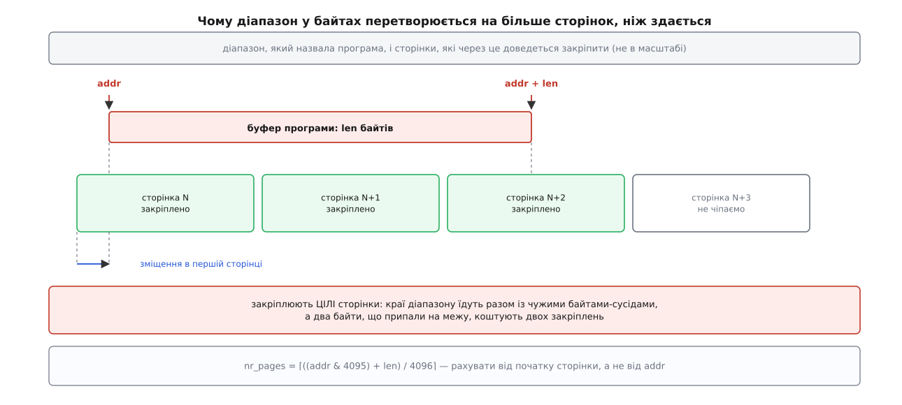
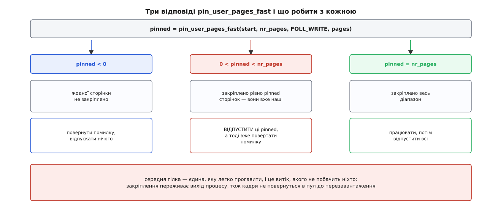

# ⚙️ Закріпити чужий буфер із модуля ядра

Зберемо модуль, який приймає від програми пару «адреса й довжина», закріплює цей діапазон, складає зі сторінок таблицю сегментів для пристрою й чесно все відпускає — разом із місцями, де такий код ламається насправді. Заліза за модулем немає навмисно: замість передавання він рахує суму байтів і міняє один байт у кожній сторінці, тож увесь шлях від покажчика програми до номера кадру видно наскрізь, без жодного рядка про конкретний контролер.

Інтерфейс — одна команда [ioctl](topic:unix-linux/ioctl-interface) і один заголовок, спільний для обох боків межі.

```c
/* pinbuf.h — цей файл читають і модуль, і програма */
#ifndef _UAPI_PINBUF_H
#define _UAPI_PINBUF_H

#include <linux/types.h>
#include <linux/ioctl.h>

struct pinbuf_req {
        __u64 addr;    /* → адреса буфера; вирівнювання не потрібне   */
        __u64 len;     /* → довжина, байтів                           */
        __u64 sum;     /* ← сума всіх байтів, яку побачило ядро       */
        __u32 pages;   /* ← скільки сторінок довелося закріпити       */
        __u32 segs;    /* ← на скільки суцільних сегментів вони лягли */
};

#define PINBUF_IOC_TYPE 'p'
#define PINBUF_XFER _IOWR(PINBUF_IOC_TYPE, 0x01, struct pinbuf_req)

#endif
```

Адреса їде числом `__u64`, а не покажчиком: розкладка структури мусить збігатися по обидва боки незалежно від розрядності програми, а покажчик на 32-бітному ABI має іншу ширину.

## Скільки сторінок насправді просить програма

Програма назвала байти — а закріплюють сторінки. Перший байт майже ніколи не лежить на початку сторінки, тож у роботу йде ще й той шматок першої сторінки, якого програма не називала.



*Рахувати треба від початку сторінки, у яку впав перший байт, — інакше на діапазоні, що перетинає межу, щоразу недорахуєш одну сторінку.*

```
addr      = 0x7f3a91c0d00d
len       = 8500 Б
PAGE_SIZE = 4096 Б

start     = addr & ~0xfff = 0x7f3a91c0d000
offset    = addr &  0xfff = 13 Б
span      = offset + len  = 8513 Б
nr_pages  = ⌈8513 / 4096⌉ = 3
```

Звідси два наслідки. Два байти, що припали рівно на межу, коштують двох закріплень. І кожне закріплення захоплює сусідів: усе, що програма поклала в ту саму сторінку поруч із буфером, теж застрягає в кадрі, поки триває передавання.

## Модуль

```c
/* pinbuf.c — модуль ядра */
#include <linux/module.h>
#include <linux/miscdevice.h>
#include <linux/fs.h>
#include <linux/mm.h>
#include <linux/highmem.h>
#include <linux/io.h>
#include <linux/slab.h>
#include <linux/uaccess.h>
#include <linux/overflow.h>
#include "pinbuf.h"

#define PINBUF_MAX_PAGES 256          /* 1 МіБ за виклик — стеля навмисна */

/* Сегмент — суцільний ланцюг кадрів, який пристрій узяв би одним махом. */
struct pinbuf_seg { phys_addr_t phys; size_t len; };

static long pinbuf_xfer(void __user *uarg)
{
        struct pinbuf_req r;
        struct page **pages;
        struct pinbuf_seg *segs;
        unsigned long start, offset, span;
        int nr_pages, pinned, nseg = 0, i;
        size_t left;
        u64 sum = 0;
        long ret;

        if (copy_from_user(&r, uarg, sizeof(r)))
                return -EFAULT;
        if (r.sum || r.pages || r.segs)   /* поля ядра мусять прийти нулями */
                return -EINVAL;
        if (r.len == 0)
                return -EINVAL;

        /* 1. Байти → сторінки, від початку першої сторінки, а не від addr. */
        start  = (unsigned long)r.addr & PAGE_MASK;
        offset = (unsigned long)r.addr & ~PAGE_MASK;
        if (check_add_overflow(offset, (unsigned long)r.len, &span))
                return -EINVAL;
        if (DIV_ROUND_UP(span, PAGE_SIZE) > PINBUF_MAX_PAGES)
                return -EINVAL;
        nr_pages = DIV_ROUND_UP(span, PAGE_SIZE);

        pages = kvmalloc_array(nr_pages, sizeof(*pages), GFP_KERNEL);
        if (!pages)
                return -ENOMEM;
        segs = kvmalloc_array(nr_pages, sizeof(*segs), GFP_KERNEL);
        if (!segs) {
                kvfree(pages);
                return -ENOMEM;
        }

        /* 2. Закріплення. Може заснути: сторінок під адресою може ще не бути. */
        pinned = pin_user_pages_fast(start, nr_pages, FOLL_WRITE, pages);
        if (pinned < 0) {
                ret = pinned;
                goto out_free;
        }
        if (pinned < nr_pages) {
                unpin_user_pages(pages, pinned);  /* не писали — не бруднимо */
                ret = -EFAULT;
                goto out_free;
        }

        /* 3. Таблиця сегментів: сусідні за номером кадру сторінки зливаються. */
        left = r.len;
        for (i = 0; i < pinned; i++) {
                size_t off = i ? 0 : offset;
                size_t n   = min_t(size_t, left, PAGE_SIZE - off);

                if (nseg && page_to_pfn(pages[i]) == page_to_pfn(pages[i - 1]) + 1)
                        segs[nseg - 1].len += n;
                else {
                        segs[nseg].phys = page_to_phys(pages[i]) + off;
                        segs[nseg].len  = n;
                        nseg++;
                }
                left -= n;
        }

        /* 4. Тут у справжньому драйвері були б dma_map_sgtable() і запуск
         *    передавання. Пристрою немає — робимо те саме процесором.     */
        left = r.len;
        for (i = 0; i < pinned; i++) {
                size_t off = i ? 0 : offset;
                size_t n   = min_t(size_t, left, PAGE_SIZE - off);
                u8 *va = kmap_local_page(pages[i]);
                size_t k;

                for (k = 0; k < n; k++)
                        sum += va[off + k];
                va[off] ^= 0xff;          /* видима зміна — задля FOLL_WRITE */
                kunmap_local(va);
                left -= n;
        }

        r.sum   = sum;
        r.pages = pinned;
        r.segs  = nseg;
        ret = copy_to_user(uarg, &r, sizeof(r)) ? -EFAULT : 0;

        /* 5. Скільки закріпили — стільки й відпустили; true, бо справді писали. */
        unpin_user_pages_dirty_lock(pages, pinned, true);
out_free:
        kvfree(segs);
        kvfree(pages);
        return ret;
}

static long pinbuf_ioctl(struct file *f, unsigned int cmd, unsigned long arg)
{
        if (cmd != PINBUF_XFER)
                return -ENOTTY;
        return pinbuf_xfer((void __user *)arg);
}

static const struct file_operations pinbuf_fops = {
        .owner          = THIS_MODULE,
        .unlocked_ioctl = pinbuf_ioctl,
        .compat_ioctl   = compat_ptr_ioctl,
};

static struct miscdevice pinbuf_misc = {
        .minor = MISC_DYNAMIC_MINOR,
        .name  = "pinbuf",
        .fops  = &pinbuf_fops,
        .mode  = 0600,
};
module_misc_device(pinbuf_misc);

MODULE_DESCRIPTION("Закріплення буфера користувача через pin_user_pages_fast");
MODULE_LICENSE("GPL");
```

Прапорець `FOLL_WRITE` каже не «я хочу право писати», а «пиши в цю пам'ять уже зараз». Різниця в наслідках. Ядро проганяє діапазон через ту саму обробку [збою сторінки](topic:unix-linux/page-fault), яку викликала б машинна інструкція запису: свіжовиділена анонімна сторінка справді виникне, а спільна після розгалуження одразу розщепиться, тож закріплений кадр належатиме тільки тому, хто його просив. На ділянці, відображеній лише для читання, той самий прапорець дає `−EFAULT` — і це правильна відповідь, а не прикрість.

Злиття сегментів у кроці 3 тримається на одному порівнянні номерів кадрів. Воно частіше істинне, ніж здається: коли під буфером лежить [велика сторінка](topic:unix-linux/huge-pages), у масиві стоять окремі покажчики на кожні 4 КіБ, але їхні номери йдуть поспіль — і сотні записів згортаються в один сегмент. Саме цю роботу в справжньому драйвері виконує `sg_alloc_table_from_pages_segment()`, а `dma_map_sgtable()` перекладає фізичні адреси на ті, що [розуміє шина](topic:unix-linux/dma-and-buffers).

До вмісту модуль дістається через `kmap_local_page()`, хоч на 64-бітній машині вся пам'ять і так відображена в ядрі, а `page_address()` дав би адресу задарма. Різниця не у швидкості: закріплення повертає **кадр**, а не адресу, і припущення «кадр десь відображений» справджується не на кожній архітектурі. Плата за чесність мала — відображення діє лише в поточному контексті й знімається у зворотному порядку, тому `kunmap_local()` стоїть у тому самому витку циклу, що й `kmap_local_page()`.

І ще одне, що ламає звичку: після закріплення в модуля є кадри, а не адреса програми. Хай програма зробить `munmap` над буфером — її покажчик перестане існувати, а кадри лишаться живими, і пристрій спокійно допише в пам'ять, якої власник уже не бачить. Тому після закріплення адресу зі структури більше не розіменовують: єдиний чинний шлях до вмісту — масив `pages`.

## Часткова вдача

Найважливіший рядок модуля — той, де `pinned` менший за `nr_pages`.



*Середня гілка виглядає як рідкісний крайній випадок, а насправді спрацьовує на першому ж діапазоні, що вийшов за межі ділянки.*

Виклик іде по діапазону зліва направо й зупиняється на першій сторінці, якої не змогло дати ядро: діапазон перетнув межу ділянки; далі починається відображення без права запису; процесові прийшов сигнал, що його вбиває. Усе, що встигло закріпитися до цієї миті, **уже закріплене** — лічильники підняті, і опустити їх тепер може лише той, хто підняв. Тому повернути помилку одразу, не відпустивши взяте, — не недбалість, а витік: кадри не звільняться навіть після виходу процесу, бо адресний простір помер, а посилання на кадр лишилося.

Звідси й форма функції. Виділення, закріплення та робота йдуть уперед одним шляхом, а всі помилки збігаються в єдиний вихід `out_free` — але відпускання стоїть **перед** міткою, а не за нею. Так воно спрацьовує рівно там, де закріплення справді відбулося: після невдалого `copy_to_user` сторінки відпустяться, після невдалого `kvmalloc_array` — ні, бо їх ще не брали. Ця дрібниця й є та сама симетрія: `pin` і `unpin` сходяться в кожній окремій гілці, а не в середньому по функції.

Різниця між двома викликами відпускання теж по суті. `unpin_user_pages_dirty_lock(..., true)` позначає сторінки брудними, щоб вміст, покладений повз таблиці сторінок, дійшов до диска, коли за буфером стоїть файл. У гілці часткової вдачі ми не написали жодного байта, тож бруднити нема чого — там простий `unpin_user_pages()`. І в жодній із гілок не можна вжити `put_page()`: він зніме одиницю замість тисячі двадцяти чотирьох, і кадр застрягне назавжди.

## Програма

```c
/* pinbufctl.c — простір користувача */
#include <errno.h>
#include <fcntl.h>
#include <stdint.h>
#include <stdio.h>
#include <stdlib.h>
#include <string.h>
#include <sys/ioctl.h>
#include <sys/mman.h>
#include <unistd.h>
#include "pinbuf.h"

static void show_pins(const char *when)
{
        FILE *f = fopen("/proc/vmstat", "r");
        char name[64];
        unsigned long long v;

        printf("%-16s", when);
        while (fscanf(f, "%63s %llu", name, &v) == 2)
                if (!strncmp(name, "nr_foll_pin_", 12))
                        printf(" %s=%llu", name, v);
        putchar('\n');
        fclose(f);
}

int main(void)
{
        int fd = open("/dev/pinbuf", O_RDWR);
        if (fd < 0) { perror("open /dev/pinbuf"); return 1; }

        void *base;
        if (posix_memalign(&base, 4096, 16384)) return 1;
        memset(base, 1, 16384);

        unsigned char *p = (unsigned char *)base + 13;   /* навмисно не з краю */
        struct pinbuf_req r = { .addr = (uintptr_t)p, .len = 8500 };

        show_pins("до");
        if (ioctl(fd, PINBUF_XFER, &r) < 0) { perror("XFER"); return 1; }
        printf("сума %llu, сторінок %u, сегментів %u, перший байт 0x%02x\n",
               (unsigned long long)r.sum, r.pages, r.segs, p[0]);
        show_pins("після");

        /* Ділянка лише для читання: FOLL_WRITE не має що з нею робити. */
        void *ro = mmap(NULL, 4096, PROT_READ, MAP_PRIVATE | MAP_ANONYMOUS, -1, 0);
        struct pinbuf_req r2 = { .addr = (uintptr_t)ro, .len = 4096 };
        if (ioctl(fd, PINBUF_XFER, &r2) < 0)
                printf("лише для читання: %s\n", strerror(errno));

        /* Часткова вдача: просимо дві сторінки, друга не відображена. */
        unsigned char *two = mmap(NULL, 8192, PROT_READ | PROT_WRITE,
                                  MAP_PRIVATE | MAP_ANONYMOUS, -1, 0);
        munmap(two + 4096, 4096);
        struct pinbuf_req r3 = { .addr = (uintptr_t)two, .len = 8192 };
        if (ioctl(fd, PINBUF_XFER, &r3) < 0)
                printf("часткова вдача: %s\n", strerror(errno));
        show_pins("після часткової");

        close(fd);
        return 0;
}
```

## Що видно на запуску

```sh
$ make -C /lib/modules/$(uname -r)/build M=$PWD modules   # obj-m := pinbuf.o
$ sudo insmod pinbuf.ko
$ cc -o pinbufctl pinbufctl.c && sudo ./pinbufctl
до               nr_foll_pin_acquired=1180416 nr_foll_pin_released=1180416
сума 8500, сторінок 3, сегментів 2, перший байт 0xfe
після            nr_foll_pin_acquired=1180419 nr_foll_pin_released=1180419
лише для читання: Bad address
часткова вдача: Bad address
після часткової  nr_foll_pin_acquired=1180420 nr_foll_pin_released=1180420
```

Читається цей стовпчик так. Сума 8500 — по одиниці з кожного названого байта, тобто ядро побачило рівно ті байти, які має програма, а не сусідні. `0xfe` замість `0x01` у першому байті — доказ, що запис із ядра осів у тій самій пам'яті. Сторінок три при довжині, яка ледве переросла дві, — та сама арифметика зміщення. Сегментів два, і це число стрибає від запуску до запуску: скільки суцільних шматків дасть фізична пам'ять, залежить від її стану, і саме заради цієї непередбачуваності пристроям і роздають таблиці сегментів замість однієї адреси.

Два лічильники з `/proc/vmstat` рахують сторінки, узяті й віддані сім'єю `pin_user_pages`. Абсолютні числа тут нічого не варті — важить різниця. Після першого виклику обидва підросли рівно на три: закріпили три сторінки, три й відпустили. Після часткової вдачі — на одну: другої сторінки не було, першу закріпили й відпустили в гілці помилки. Якби ту гілку забули, `acquired` пішов би вперед, а `released` лишився на місці, і ця щілина вже ніколи б не зійшлася — до самого перезавантаження. Це єдиний слід, який залишає такий витік: сторінка зникне зі звітів про процес, але й у вільний пул не повернеться.

> 🔧 **Навіщо це.** Розбіжність між цими двома числами — перше, на що варто дивитися, коли машина повільно втрачає пам'ять під навантаженням із прямим вводом-виводом чи мережевою картою із зареєстрованими буферами. Числа рухаються на всій системі одразу, тому міряти треба на тихій машині або порівнювати саме приріст до й після своєї операції.

## Три обмеження, про які ядро не нагадає

**Стеля на один виклик.** Довжину назвала програма, а платить ядро: під масив покажчиків іде `nr_pages · 8` байтів безперервно виділеної пам'яті.

```
запит на 4 ГіБ            len = 4 294 967 296 Б
сторінок у ньому          len / 4096 = 1 048 576
масив покажчиків у ядрі   1 048 576 · 8 Б = 8 МіБ
```

Це ще й не найгірше: закріплена пам'ять перестає витіснятися, тобто програма без стелі дістає спосіб замкнути стільки пам'яті, скільки захоче. Драйвери, яким справді потрібні великі буфери, ходять пачками по кілька сотень сторінок у циклі й ведуть власний облік проти [ліміту замкненої пам'яті](topic:unix-linux/resource-limits). Ще одна дрібниця з того ж боку: у швидкому різновиді `nr_pages` оголошено як `int`, а не `unsigned long`, — тож порахувавши сторінки з довжини без перевірки, туди легко передати від'ємне число.

**Тільки з контексту процесу.** `pin_user_pages_fast` має право заснути: він підвантажує сторінки, виділяє кадри, у повільній гілці бере замок адресного простору. З обробника переривання його кликати не можна — і жоден компілятор про це не попередить, зате ядро впаде на першій же спробі перемкнути задачу там, де перемикатися нікуди. Родич, який справді безпечний у перериванні, називається `get_user_pages_fast_only()`: він лише йде таблицями, нічого не підвантажує й повертає менше сторінок або нуль щоразу, коли чогось бракує. Драйвер, якому буфер потрібен у перериванні, мусить закріпити його заздалегідь, у контексті процесу.

**Закріплення живе довше за виклик.** Виклик працює з адресним простором `current`, і всередині `ioctl` це саме той процес, який назвав адресу. Але щойно закріплення переживає повернення з виклику — зареєстрований буфер, черга, кільце дескрипторів, — покладатися на `current` не можна: за годину в цьому контексті буде хтось інший. Тоді драйвер тримає власне посилання на адресний простір і кличе `pin_user_pages_remote()`, а до прапорців додає `FOLL_LONGTERM`, щоб ядро встигло прибрати сторінки з рухомих ділянок до, а не після того, як їх заморозять.
