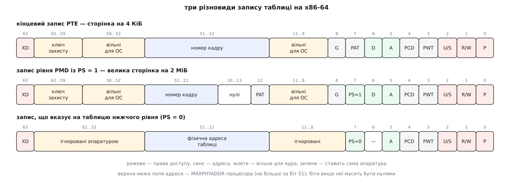
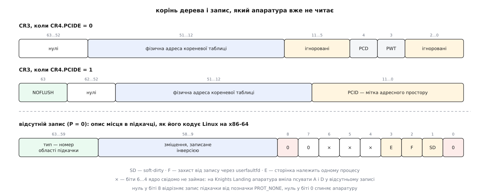

# 📋 Запис таблиці сторінок x86-64: точна розкладка бітів

Це побітова довідка на запис таблиці сторінок x86-64 — кінцевий запис про сторінку на 4 КіБ, запис проміжного рівня з великою сторінкою, запис-указівник на таблицю нижче, регістр `CR3` — разом із тим, як ті самі біти звуться в Linux і що лежить у записі, коли біт присутності скинуто. Позиція біта тут не подробиця, а контракт, за яким одне 64-бітне число читають троє: апаратура під час перекладу, ядро під час обробки збою й людина, яка розбирає шістнадцяткове значення з дампу.

## Умовності

- Біти нумеровано від молодшого, з нуля. Запис займає 8 байтів і лежить у пам'яті в порядку little-endian, тому в дампі байтів поля йдуть навиворіт — читати треба зібране 64-бітне число.
- **M** — розрядність фізичної адреси процесора (MAXPHYADDR), її повертає `CPUID.80000008h:EAX[7:0]`, і вона не буває більшою за 52. Поле адреси — біти (M−1)…12; біти 51…M мусять бути нулями, інакше збій матиме ознаку «зарезервований біт», а не «немає сторінки». Intel скрізь пише «51…12», маючи на увазі верхню теоретичну межу.
- Біти 63 (XD) і 62…59 (ключ захисту) не існують самі по собі: перший діє лише коли ввімкнено `IA32_EFER.NXE`, другі — лише коли `CR4.PKE` (для сторінок користувача) чи `CR4.PKS` (для ядерних). Доти це просто зарезервовані нулі, і запис із одиницею там дає збій.
- П'ятирівневий переклад формату запису не міняє: додається лише рівень PML5 з такою самою розкладкою, як в інших указівників.
- Права на сторінку — це **кон'юнкція по всіх рівнях**. Якщо на рівні PUD скинуто `R/W`, увесь гігабайт під цим записом стає незаписуваним, хоч би що стояло в кінцевих записах. Звідси й класична причина «неможливого» `SIGSEGV`: біт шукають у листку, а обмеження стоїть вище.



*Позиції молодших дев'яти бітів однакові в усіх трьох різновидах — різняться значення бітів 7 і 12 та межа поля адреси. Саме тому ядро вміє писати спільний код для всіх рівнів.*

## Кінцевий запис: сторінка на 4 КіБ

| Біти | Назва в Intel | Назва в Linux | Що це значить |
|---|---|---|---|
| 0 | P — present | `_PAGE_PRESENT` | запис чинний. Скинуто — переклад спиняється, решта 63 бітів апаратурі байдужа |
| 1 | R/W | `_PAGE_RW` | 1 — можна писати. Для коду ядра дію біта скасовує `CR0.WP = 0` |
| 2 | U/S — user/supervisor | `_PAGE_USER` | 1 — сторінку видно непривілейованому коду |
| 3 | PWT — write-through | `_PAGE_PWT` | молодший біт індексу типу кешування |
| 4 | PCD — cache disable | `_PAGE_PCD` | середній біт того самого індексу |
| 5 | A — accessed | `_PAGE_ACCESSED` | ставить апаратура на першому зверненні |
| 6 | D — dirty | `_PAGE_DIRTY` | ставить апаратура на першому записі; є лише в кінцевому записі |
| 7 | PAT | `_PAGE_PAT` | старший біт індексу типу кешування (для сторінки на 4 КіБ) |
| 8 | G — global | `_PAGE_GLOBAL` | переклад не викидається з TLB при записі в `CR3` |
| 9 | ігнорований | `_PAGE_SOFTW1`, він же `_PAGE_SPECIAL` | вільний для ядра |
| 10 | ігнорований | `_PAGE_SOFTW2`, він же `_PAGE_UFFD_WP` | вільний для ядра |
| 11 | ігнорований | `_PAGE_SOFTW3`, він же `_PAGE_SOFT_DIRTY` | вільний для ядра |
| (M−1)…12 | адреса кадру | — | фізична адреса, вирівняна на 4 КіБ; молодші 12 бітів у ній не зберігають, бо вони завжди нулі |
| 51…M | зарезервовані | — | мусять бути нулями |
| 57 | ігнорований | `_PAGE_SOFTW4` | вільний для ядра |
| 58 | ігнорований | `_PAGE_SOFTW5`, він же `_PAGE_SAVED_DIRTY` | вільний для ядра; в ядерних відображеннях той самий біт зветься `_PAGE_NOPTISHADOW` |
| 62…59 | ключ захисту | `_PAGE_PKEY_BIT0`…`_PAGE_PKEY_BIT3` | номер ключа від 0 до 15 |
| 63 | XD — execute disable | `_PAGE_NX` | 1 — з цієї сторінки не можна виконувати команди |

Кілька зауваг, які легко проґавити.

**Біти 2 і 63 працюють у парі із захистом самого ядра.** `SMEP` (`CR4.SMEP`) забороняє привілейованому коду виконувати команди зі сторінки, у якої стоїть `U/S`; `SMAP` (`CR4.SMAP`) забороняє йому навіть читати такі сторінки, поки ядро не підніме `EFLAGS.AC` командою `STAC`. Тому в Linux звернення до пам'яті користувача мусить іти через `copy_from_user()` та її родичів — вони й є місцем, де прапорець піднімають і опускають.

**Порожній запис і запис із нулями — різні речі.** `pte_none()` перевіряє, чи запис нульовий цілком; `pte_present()` перевіряє біти `_PAGE_PRESENT | _PAGE_PROTNONE`. Другий доданок потрібен тому, що Linux має чинні відображення, які апаратура мусить відкидати: так позначають ділянки `PROT_NONE` і сторінки, до яких навмисне під'єднали пастку для [балансування пам'яті між вузлами NUMA](book:programming/numa).

## Що апаратура пише сама: A і D

Це єдині поля, у які MMU пише, а не лише читає.

| Поле | Коли апаратура ставить одиницю | Хто скидає |
|---|---|---|
| A (біт 5) | будь-яке звернення за перекладом — читання, запис, вибірка команди; є й у записах проміжних рівнів | лише ядро |
| D (біт 6) | лише запис, лише в кінцевому записі | лише ядро |

Апаратура ставить їх атомарною операцією «прочитати-змінити-записати», тому запис таблиці не можна змінювати простим присвоєнням, коли переклад активний: між читанням і записом процесор устигне поставити `A`, і зміна її зітре. Ядро користується `cmpxchg`-обгортками (`ptep_get_and_clear`, `ptep_set_access_flags`).

Скидання `A` — основа механізму витіснення: обхід таблиць гасить біт, а через якийсь час дивиться, чи він знову з'явився, і так вирізняє сторінки, до яких ніхто не звертався ([витіснення й підкачка](book:unix-linux/swap-and-reclaim)). Скидання `D` — сигнал «вміст записано на диск, копія в пам'яті знову збігається з носієм».

Дві історичні пастки живуть у сусідніх бітах:

- **Errata Knights Landing.** Деякі процесори вміли самочинно ставити `A` і `D` у записі, де `P = 0`. Linux тримає маску `_PAGE_KNL_ERRATUM_MASK = _PAGE_DIRTY | _PAGE_ACCESSED` і не використовує біти 5 і 6 у відсутньому записі взагалі.
- **Тіньові стеки.** У процесорах із CET комбінація «`R/W` = 0 і `D` = 1» позначає сторінку тіньового стека. Через це Linux більше не може вільно тримати `D` у записі, з якого щойно зняли право запису, — програмний слід брудності переїхав у біт 58 (`_PAGE_SAVED_DIRTY`).

## Тип кешування: PWT, PCD і PAT

Три біти складають тризначний індекс у таблицю з восьми записів у регістрі `IA32_PAT`. Молодший — `PWT`, потім `PCD`, старший — `PAT`: біт 7 у записі про сторінку на 4 КіБ і біт **12** у записі про велику сторінку (`_PAGE_BIT_PAT_LARGE`). Ось як цю таблицю програмує Linux:

```
PAT PCD PWT   слот   режим кешування
 0   0   0     0     WB   — write-back, звичайна пам'ять
 0   0   1     1     WC   — write-combining, для кадрового буфера
 0   1   0     2     UC-  — некешовано, але MTRR може пом'якшити
 0   1   1     3     UC   — некешовано жорстко
 1   0   0     4     WB   — зарезервовано, дублює слот 0
 1   0   1     5     WP   — write-protect
 1   1   0     6     UC-  — зарезервовано, дублює слот 2
 1   1   1     7     WT   — write-through
```

Звідси видно, чому зміна типу кешування коштує дорого, а неузгодженість — небезпечна. Два записи, що вказують на **один кадр** із різними значеннями цих бітів, дають архітектурно невизначену поведінку, тож `ioremap()` і `set_memory_wc()` мусять пройти всі відображення кадру й змінити їх разом. Обгортки в ядрі — `pgprot_noncached()`, `pgprot_writecombine()`, `pgprot_writethrough()`, а облік того, який кадр яким типом уже відображено, веде підсистема PAT.

## Біт G і ізоляція таблиць ядра

Одиниця в біті 8 каже: цей переклад не викидати з TLB при звичайному записі в `CR3`. Задум прозорий — ядро в кожному процесі відображене однаково, тож перезаряджати його переклади на кожному перемиканні марно.

`KPTI` цю економію майже скасував: у користувацькій копії дерева глобальними лишилися тільки вхідні тамбури, решту ядро свідомо позначає неглобальною, бо інакше ізоляція нічого не варта.

Звичайний запис у `CR3` глобальні переклади не чіпає — на те вони й глобальні. Щоб позбутися саме їх, ядро на мить скидає й повертає `CR4.PGE`; прицільно одну сторінку прибирає `INVLPG` незалежно від біта G.

## Проміжні рівні й PS = 1

| Біт | Указівник на таблицю нижче | Кінцевий запис із PS = 1 |
|---|---|---|
| 0…5 | так само, як у кінцевому записі | так само |
| 6 (D) | ігнорований | брудність великої сторінки |
| 7 (PS) | мусить бути 0 | 1 — тут переклад закінчується |
| 8 (G) | ігнорований | глобальність великої сторінки |
| 11…9 | ігноровані, вільні для ядра | ігноровані, вільні для ядра |
| 12 | частина адреси таблиці | PAT — старший біт індексу кешування |
| 20…13 | частина адреси таблиці | мусять бути нулями (сторінка на 2 МіБ) |
| 29…13 | — | мусять бути нулями (сторінка на 1 ГіБ) |
| (M−1)…12 | фізична адреса таблиці нижчого рівня | — |
| (M−1)…21 | — | адреса кадру на 2 МіБ |
| (M−1)…30 | — | адреса кадру на 1 ГіБ |
| 62…52 | ігноровані | ключ захисту (62…59) плюс ігноровані |
| 63 (XD) | забороняє виконання в усьому піддереві | забороняє виконання на великій сторінці |

Біт 7 доступний як «кінець перекладу» лише на рівнях PDPTE й PDE — тобто дає сторінки на 1 ГіБ і 2 МіБ. У PML4E він мусить бути нулем: сторінок на 512 ГіБ архітектура не має. Це і є [великі сторінки](book:unix-linux/huge-pages) на рівні заліза; підтримку 1 ГіБ треба питати в `CPUID.80000001h:EDX[26]`, бо вона є не на всіх процесорах.

Наслідок для Linux: `pmd_t` і `pud_t` тримають або указівник, або кінцевий запис, і розрізняє їх той самий біт 7 — `pmd_leaf()` та `pud_leaf()` перевіряють саме `_PAGE_PSE`. Обхід таблиць мусить питати про це на кожному рівні, інакше піде читати «таблицю» за адресою, яка насправді є номером кадру.

## CR3: корінь дерева



*Верхні дві смуги — той самий регістр із увімкненим і вимкненим PCID: дванадцять молодших бітів або ігноруються, або стають міткою адресного простору. Нижня смуга — 64 біти, які апаратура вже не читає, і те, що в них пише Linux.*

| Біти | `CR4.PCIDE = 0` | `CR4.PCIDE = 1` |
|---|---|---|
| 2…0 | ігноровані | PCID |
| 3 | PWT для самого кореня | PCID |
| 4 | PCD для самого кореня | PCID |
| 11…5 | ігноровані | PCID |
| (M−1)…12 | фізична адреса кореневої таблиці | те саме |
| 62…52 | зарезервовані, нулі | зарезервовані, нулі |
| 63 | зарезервований, нуль | під час запису: 1 — **не** скидати TLB для цього PCID |

Тонкість, через яку біт 63 плутають: він не зберігається. `CR3[63]` завжди читається як нуль; одиниця в ньому має сенс **лише в момент** `MOV CR3`, і лише коли ввімкнено PCID. У Linux це три рядки:

```c
#define CR3_ADDR_MASK  __sme_clr(PHYSICAL_PAGE_MASK)
#define CR3_PCID_MASK  0xFFFull
#define CR3_NOFLUSH    BIT_ULL(63)
```

`read_cr3_pa()` бере лише поле адреси, бо решта бітів — не адреса. PCID має 12 бітів, тобто 4096 значень, але Linux роздає їх скупо, тримаючи невеликий набір на кожне ядро процесора. Один із бітів мітки зайнятий службою: при ввімкненому `KPTI` ядерна й користувацька копії дерева одного процесу різняться саме одиницею в біті 11 мітки (`X86_CR3_PTI_PCID_USER_BIT`), тож перехід у ядро й назад не змішує їхні переклади в TLB.

Прицільно скидати переклади за міткою вміє окрема команда:

```
INVPCID тип 0 — одна адреса в названому PCID
INVPCID тип 1 — увесь названий PCID
INVPCID тип 2 — усе, разом із глобальними записами
INVPCID тип 3 — усе, крім глобальних записів
```

Без PCID лишається `INVLPG` на одну адресу й перезапис `CR3` на все інше; докладніше про те, що саме кешує процесор і скільки коштує промах, — у статті про [TLB](book:programming/tlb).

## Ключі захисту: біти 62…59

Чотири біти зберігають номер ключа від 0 до 15 — і на цьому їхня роль у записі закінчується. Що ключ дозволяє, вирішує не таблиця, а регістр `PKRU`, у якому на кожен ключ по два біти: `AD` (заборонити доступ) і `WD` (заборонити запис). Практична цінність саме в цьому розділенні: змінити права на тисячі сторінок означає одну команду `WRPKRU` без входу в ядро й **без скидання TLB**, бо самі записи таблиці лишаються незмінними.

Ядро роздає ключі через `pkey_alloc()` і чіпляє їх до ділянок через `pkey_mprotect()`; для власних сторінок ядра є симетричний механізм `PKS` із регістром `IA32_PKRS`. Ключ звужує права, але не розширює: сторінку, у якої скинуто `R/W`, ключ записуваною не зробить. Докладний розбір моделі — у темі про [ключі захисту пам'яті](book:unix-linux/memory-protection-keys).

## Типи й прапорці в Linux

Linux загортає кожен рівень у власну структуру, щоб компілятор не дав переплутати запис одного рівня із записом іншого:

```c
typedef unsigned long   pteval_t;      /* і pmdval_t, pudval_t, p4dval_t, pgdval_t */
typedef unsigned long   pgprotval_t;

typedef struct { pteval_t pte; } pte_t;
typedef struct { pmdval_t pmd; } pmd_t;
typedef struct { pudval_t pud; } pud_t;
typedef struct { p4dval_t p4d; } p4d_t;
typedef struct { pgdval_t pgd; } pgd_t;
typedef struct pgprot { pgprotval_t pgprot; } pgprot_t;
```

Обгортка коштує нуль байтів і нуль команд, зате `pmd_t`, переданий туди, де чекають `pte_t`, не збереться. Дістати з неї число можна лише явно — `pte_val(pte)`, `pgprot_val(prot)`; зібрати назад — `__pte(v)`, `__pgprot(v)`.

`pgprot_t` — це той самий 64-бітний запис **без поля адреси**: самі прапорці, готові до накладання на будь-який кадр. Звідси головна пара функцій:

```c
pte_t         entry = mk_pte(page, prot);          /* кадр + права → запис */
pte_t         same  = pfn_pte(pfn, prot);          /* те саме, від номера кадру */
unsigned long back  = pte_pfn(entry);              /* назад: лише номер кадру */
pte_t         other = pte_modify(entry, newprot);  /* кадр той самий, права інші */
```

Готові набори прав звуться `PAGE_*` і збігаються з тим, що просить `mmap()`: `PAGE_NONE`, `PAGE_READONLY`, `PAGE_COPY`, `PAGE_SHARED` та їхні `_EXEC`-двійники для простору користувача, `PAGE_KERNEL`, `PAGE_KERNEL_RO`, `PAGE_KERNEL_ROX` — для ядерного. Вибір потрібного за прапорцями ділянки робить `vm_get_page_prot()`.

Читання й зміна окремих бітів іде через передбачувано названі функції:

| Питання | Зміна |
|---|---|
| `pte_present()`, `pte_none()` | `pte_clear()` |
| `pte_write()` | `pte_mkwrite()`, `pte_wrprotect()` |
| `pte_dirty()` | `pte_mkdirty()`, `pte_mkclean()` |
| `pte_young()` | `pte_mkyoung()`, `pte_mkold()` |
| `pte_exec()` | `pte_mkexec()` |
| `pte_special()` | `pte_mkspecial()` |
| `pte_huge()`, `pmd_leaf()` | `pte_mkhuge()` |

Той самий набір повторено для кожного рівня з відповідним префіксом (`pmd_write()`, `pud_present()` і так далі), і саме тому код обходу таблиць у Linux читається однаково незалежно від архітектури.

Окремо варто знати `_PAGE_SPECIAL` (біт 9). Він каже: за цим кадром **немає** структури-описувача `struct page`. Так позначають нульову сторінку, регістри пристроїв, вставлені через `vm_insert_pfn()`, і взагалі все, для чого лічильник посилань нема де тримати. Функції, що ходять таблицями в пошуках сторінок (`get_user_pages()`, `vm_normal_page()`), такі записи мусять пропускати — інакше візьмуть посилання на неіснуючий описувач.

## Відсутній запис: підкачка й інші «не-сторінки»

Коли біт 0 скинуто, апаратура спиняється й решта 63 бітів належить ядру повністю. Linux укладає в них ось що (діаграма з `arch/x86/include/asm/pgtable_64.h`):

```
|     ...            | 11| 10|  9|8|7|6|5| 4| 3|2| 1|0| <- номер біта
|     ...            |SW3|SW2|SW1|G|L|D|A|CD|WT|U| W|P| <- ім'я біта
| TYPE (59-63) | ~OFFSET (9-58)  |0|0|X|X| X| E|F|SD|0| <- запис підкачки
```

| Поле | Біти | Зміст |
|---|---|---|
| TYPE | 63…59 | номер області підкачки; 5 бітів, звідси й межа на кількість `swapon` |
| ~OFFSET | 58…9 | номер слоту в цій області, записаний **інверсією** — 50 бітів |
| — | 8 | завжди 0: одиниця тут означала б `_PAGE_PROTNONE`, а це геть інший стан |
| × | 6…4 | ядро свідомо не займає (errata Knights Landing на `A` і `D`) |
| E | 3 | `_PAGE_SWP_EXCLUSIVE` — сторінка належала одному процесу |
| F | 2 | `_PAGE_SWP_UFFD_WP` — ділянку захищено від запису через `userfaultfd` |
| SD | 1 | `_PAGE_SWP_SOFT_DIRTY` — програмний слід брудності пережив вивантаження |
| P | 0 | завжди 0 — саме це й спиняє апаратуру |

Три деталі тут варті окремого рядка.

**Чому зміщення інвертоване.** Це наслідок атаки L1TF: спекулятивне виконання встигає взяти відсутній запис, потрактувати його старші біти як номер кадру й підтягнути чужі дані в кеш першого рівня. Інверсія робить так, що мале зміщення дає **великий** номер, який не відповідає жодній наявній фізичній пам'яті, — спекуляція тягне порожнечу. Ціна — обмеження на розмір області підкачки: `arch_max_swapfile_size()` ріже його до половини фізичного простору, поки мітигація ввімкнена. Механіку самої спекуляції розібрано в темі про [атаки через спекулятивне виконання](book:programming/speculative-execution-attacks).

**Чому не всі 32 області.** П'ять бітів дають 32 значення типу, але кілька з них зарезервовано під записи, що взагалі не є підкачкою, тож `MAX_SWAPFILES` менший за 32 рівно на їхню кількість.

**Ті самі 63 біти під іншим змістом.** Формат «тип + зміщення» ядро використовує ширше, ніж для диска:

| Тип запису | Що позначає |
|---|---|
| `SWP_MIGRATION_READ`, `SWP_MIGRATION_READ_EXCLUSIVE`, `SWP_MIGRATION_WRITE` | сторінка зараз переїжджає між вузлами чи зонами; той, хто в неї влучив, чекає на завершення |
| `SWP_DEVICE_READ`, `SWP_DEVICE_WRITE`, `SWP_DEVICE_EXCLUSIVE` | пам'ять живе у прискорювачі, а не в оперативці |
| `SWP_HWPOISON` | кадр зіпсовано непоправною апаратною помилкою |
| `SWP_PTE_MARKER` | позначка без сторінки взагалі: `uffd-wp` на порожньому місці, отруєна сторінка файлу, сторінка-вартовий `MADV_GUARD_INSTALL` |

Розбирає їх усі один набір: `pte_to_swp_entry()` витягає `swp_entry_t`, далі `swp_type()` і `swp_offset()`, а предикати `is_migration_entry()`, `is_hwpoison_entry()`, `is_pte_marker_entry()` кажуть, з чим саме має справу обробник збою. Тому «запис відсутній» у Linux не означає «сторінка на диску» — це означає лише «спитайте ядро» ([що робить обробник збою](book:unix-linux/page-fault)).

## Мінімальний розбирач

Тридцять рядків, які перетворюють сире 64-бітне значення на людські слова. Апаратура тут ні до чого — це чиста арифметика над числом:

```c
#include <stdint.h>
#include <stdio.h>

#define BIT(n)   (1ULL << (n))
#define PFN_MASK 0x000FFFFFFFFFF000ULL   /* біти 51…12 */

static void decode_pte(uint64_t e)
{
    if (!(e & BIT(0))) {                       /* P = 0 */
        uint64_t type   = e >> 59;             /* біти 63…59 */
        uint64_t offset = (~e << 5) >> 14;     /* інверсія, біти 58…9 */

        printf("відсутній: тип=%llu зміщення=%llu%s%s%s\n",
               (unsigned long long)type, (unsigned long long)offset,
               (e & BIT(1)) ? " soft-dirty" : "",
               (e & BIT(2)) ? " uffd-wp"    : "",
               (e & BIT(3)) ? " exclusive"  : "");
        return;
    }

    printf("кадр=0x%llx %s %s %s %s%s%s ключ=%llu\n",
           (unsigned long long)((e & PFN_MASK) >> 12),
           (e & BIT(1))  ? "rw"   : "ro",
           (e & BIT(2))  ? "user" : "kernel",
           (e & BIT(63)) ? "nx"   : "x",
           (e & BIT(5))  ? "A" : "-",
           (e & BIT(6))  ? "D" : "-",
           (e & BIT(8))  ? "G" : "-",
           (unsigned long long)((e >> 59) & 0xF));
}
```

Зверніть увагу на симетрію першої й останньої дії: біти 63…59 в одному випадку читають як номер області підкачки, в іншому — як ключ захисту. Це не помилка, а точна модель того, як влаштований запис: тлумачення всіх інших бітів задає біт 0, і жодного іншого способу дізнатися, що це за число, немає.

Живі записи можна взяти двома шляхами. Про свої сторінки процес питає `/proc/<pid>/pagemap` — там кожній віртуальній сторінці відповідає 8 байтів **власного** формату ядра, не апаратного. Про ядерні відображення розповідає готовий дамп, якщо ядро зібрано з `CONFIG_PTDUMP_DEBUGFS`:

```sh
$ sudo head -20 /sys/kernel/debug/page_tables/kernel
```

Поряд лежать `current_kernel`, `current_user` (з'являється при ввімкненому `KPTI`) і `efi`. Дамп зводить сусідні однакові записи в один рядок і показує права словами — зручно, щоб побачити, що `.rodata` справді відображено без `RW`, а стек ядра — без `x`.

## Те саме на ARM64 — коротко

Ролі ті самі, розкладка інша, і кілька рішень зроблено навпаки.

| Біти | Назва в ARM | Назва в Linux | Роль |
|---|---|---|---|
| 1…0 | тип дескриптора | `PTE_VALID`, `PTE_TYPE_PAGE` (`0b11`) | нуль у біті 0 — дескриптор недійсний; `0b11` — таблиця (рівні 0…2) або сторінка (рівень 3); `0b01` — блок (лише рівні 1…2) |
| 4…2 | AttrIndx | `PTE_ATTRINDX(t)` | індекс у `MAIR_EL1` — аналог PAT |
| 6 | AP[1] | `PTE_USER` | доступ із EL0 |
| 7 | AP[2] | `PTE_RDONLY` | **одиниця = лише читання**, тобто логіка зворотна до `R/W` на x86 |
| 9…8 | SH | `PTE_SHARED` | область спільності для когерентності |
| 10 | AF | `PTE_AF` | прапорець звернення; нуль дає збій, а не тихе оновлення |
| 11 | nG | `PTE_NG` | «не глобальний» — знову навпаки до біта G на x86 |
| 47…12 | вихідна адреса | — | номер кадру |
| 50 | GP | `PTE_GP` | сторінка придатна як ціль непрямого стрибка (BTI) |
| 51 | DBM | `PTE_WRITE` | апаратне ведення брудності; Linux тримає тут власний біт «записувана» |
| 52 | Contiguous | `PTE_CONT` | 16 сусідніх записів описують суцільну ділянку — один запис TLB на всі |
| 53 | PXN | — | не виконувати з привілейованого рівня |
| 54 | UXN | — | не виконувати з EL0 |
| 55 | програмний | `PTE_DIRTY` | брудність, яку веде ядро |
| 56 | програмний | `PTE_SPECIAL` | немає `struct page` |
| 58…57, 63 | програмні | — | решта вільних бітів |

Права записано парою `AP[2:1]`, і таблиця виходить коротшою за x86-ву:

```
AP[2:1]   EL1 (ядро)   EL0 (програма)
  00         RW            —
  01         RW            RW
  10         RO            —
  11         RO            RO
```

Три відмінності, які найчастіше збивають з пантелику того, хто прийшов з x86.

**Немає одного біта «можна писати».** Є `AP[2]` зі зворотним змістом і є `DBM`. Поки процесор не має `FEAT_HAFDBS`, брудність веде програма: ядро тримає сторінку в стані «лише читання», ловить збій на першому записі, ставить свій біт 55 і знімає `AP[2]`. Коли апаратне ведення є, `DBM` дозволяє процесору самому скинути `AP[2]` при записі — і Linux акуратно вживає той самий біт 51 як свій прапорець «сторінка мала б бути записуваною».

**Прапорець звернення дає збій.** На x86 біт `A` виставляється мовчки; на ARM64 нуль в `AF` — це справжній виняток, і ядро ставить біт руками (або доручає апаратурі, знову ж за `FEAT_HAFDBS`). Для витіснення це навіть зручніше: перше звернення видно точно.

**Мітка простору не в корені дерева, а поряд із ним.** ARM64 має два кореневі регістри — `TTBR0_EL1` на нижню половину простору й `TTBR1_EL1` на верхню, тому ядерний корінь при перемиканні процесів не чіпають узагалі. `ASID` лежить у бітах 63…48 одного з них (котрого — вибирає `TCR_EL1.A1`), має 8 або 16 бітів залежно від `TCR_EL1.AS`, і Linux вмикає шістнадцятибітний варіант там, де він є. Адреса кореня — у бітах 47…1, а не 47…12: молодші біти потрібні під розширену фізичну адресацію.

Спільне ж у двох архітектур головніше за розбіжності: один біт чинності, одне поле адреси, дві-три ознаки прав, дві ознаки стану — звернення й брудність, — і жменя бітів, що їх залізо не читає й тому може вживати ядро. Усе, що системи вміють із пам'яттю — від [копіювання при записі](book:unix-linux/copy-on-write) до [відображення файлів](book:unix-linux/mmap-model), — записано саме в цих полях.
