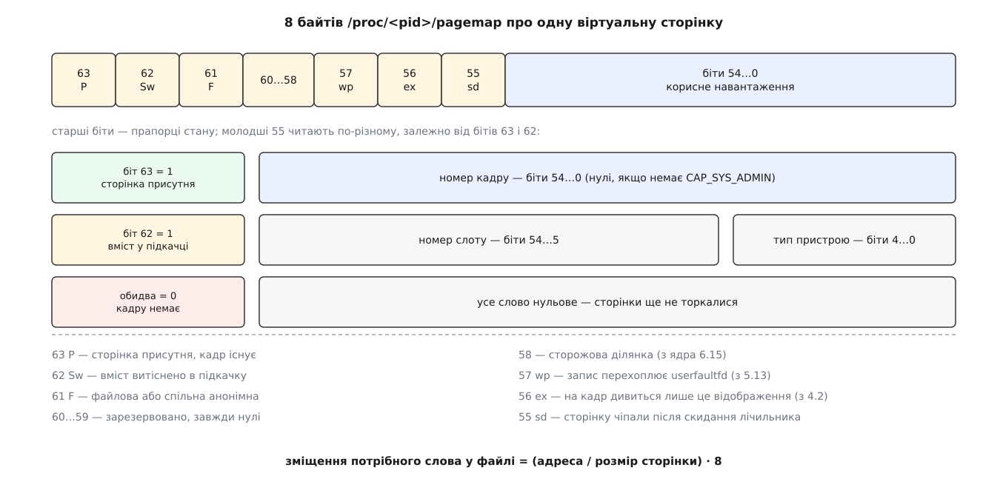
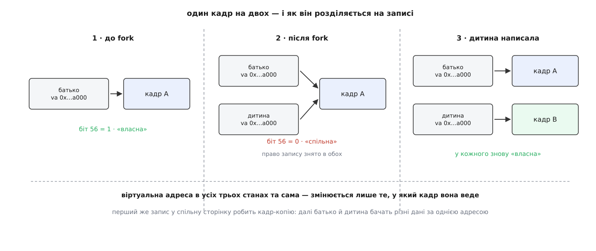

# ⚙️ Перекласти адресу власноруч: від змінної на C до номера кадру

Переклад адрес відбувається мільярди разів на секунду й не лишає програмі жодного сліду — команда бачить лише вигадане число, а справжній номер кадру знає тільки апаратура. Але ядро тримає файл, крізь який той самий шлях можна пройти пальцями: узяти адресу звичайної змінної, знайти в ньому потрібні вісім байтів і надрукувати фізичну адресу. Програма на це виходить менша за сотню рядків, і після неї переклад перестає бути схемою на папері. Другим дослідом ми змусимо дві різні віртуальні адреси показати той самий кадр, а тоді одним-єдиним записом розженемо їх у різні.

## Файл, який поводиться як масив

`/proc/<pid>/pagemap` — не текст. Це [псевдофайл](book:unix-linux/proc-filesystem): на диску його немає, ядро складає відповідь просто в мить читання. І складає воно її як **масив по вісім байтів на кожну віртуальну сторінку процесу**, у порядку зростання адрес. Слово номер нуль описує найпершу сторінку простору, слово номер один — наступну, і так до верхньої межі, яку ядро зве `task_size`.

Звідси вся навігація файлом. Позаяк розмір сторінки сталий, номер сторінки — це просто адреса, поділена на нього, а місце потрібного слова — цей номер, помножений на вісім:

```
номер_сторінки   = адреса / розмір_сторінки
зміщення_у_файлі = номер_сторінки · 8
```

Це та сама арифметика, якою користується апаратура: сталий розмір шматочка перетворює пошук на індексування. Різниця лише в тому, що MMU лізе в дерево таблиць, а ми лізимо у файл, який ядро вибудовує з того самого дерева.

Формат слова однаковий на всіх архітектурах. Ядро обходить своє справжнє дерево — чотири чи п'ять рівнів на x86-64, іншу глибину на ARM64 — і викладає підсумок в одне 64-бітне число з фіксованим розкладом бітів.



*Старші біти кажуть, у якому стані сторінка; молодші 55 читають по-різному залежно від того, які саме старші стоять.*

Найважливіша пара — біти 63 і 62. Перший означає «сторінка присутня, кадр існує», і тоді молодші 55 бітів — номер кадру. Другий означає «вміст витіснено в [підкачку](book:unix-linux/swap-and-reclaim)», і тоді ті самі біти читаються як номер області підкачки плюс номер слоту. Коли обидва нульові, сторінка не має ні кадру, ні місця в підкачці: її просто ще ніколи не чіпали.

Біт 56 варто запам'ятати окремо. Він каже, що на цей кадр дивиться **рівно одне** відображення в усій системі. Ядро не тримає цей факт у таблиці — воно рахує його на льоту, з лічильника відображень кадру, у мить, коли ви читаєте файл. Саме цей біт зробить другий дослід можливим навіть без особливих прав.

## Заготовка: прочитати одне слово

Читати будемо через `pread`: він бере зміщення прямо в аргументі, не рухає позицію у файлі й обходиться одним системним викликом замість двох. Ядро вимагає, щоб зміщення й довжина були кратні восьми, — інакше `pread` поверне `EINVAL`. А якщо адреса вища за `task_size`, читання не помилка, а **коротке**: ви отримаєте нуль байтів, як з кінця файлу.

Заведемо спільний заголовок для обох програм.

```c
/* pagemap.h — читання /proc/self/pagemap. Включати ПЕРШИМ:
   макроси нижче мусять з'явитися раніше за будь-який системний заголовок. */
#ifndef PAGEMAP_H
#define PAGEMAP_H

#define _GNU_SOURCE               /* fork, MAP_ANONYMOUS, pread */
#define _FILE_OFFSET_BITS 64      /* 64-бітний off_t і на 32-бітній машині */

#include <stdint.h>
#include <stdio.h>
#include <stdlib.h>
#include <unistd.h>
#include <fcntl.h>

#define PM_PRESENT    (1ULL << 63)
#define PM_SWAP       (1ULL << 62)
#define PM_FILE       (1ULL << 61)
#define PM_UFFD_WP    (1ULL << 57)
#define PM_EXCLUSIVE  (1ULL << 56)
#define PM_SOFT_DIRTY (1ULL << 55)
#define PM_PFN_MASK   ((1ULL << 55) - 1)

static inline long pm_page_size(void)
{
    static long ps;
    if (ps == 0) {
        ps = sysconf(_SC_PAGESIZE);      /* НЕ 4096: гранула буває й 16, і 64 КіБ */
        if (ps <= 0) { perror("sysconf(_SC_PAGESIZE)"); exit(1); }
    }
    return ps;
}

static inline int pm_open(void)
{
    int fd = open("/proc/self/pagemap", O_RDONLY);
    if (fd < 0) { perror("open /proc/self/pagemap"); exit(1); }
    return fd;
}

/* 0 — слово прочитано; -1 — адреса вища за межу простору (коротке читання) */
static inline int pm_read(int fd, const void *addr, uint64_t *word)
{
    uint64_t ps  = (uint64_t)pm_page_size();
    uint64_t vpn = (uint64_t)(uintptr_t)addr / ps;
    ssize_t  n   = pread(fd, word, sizeof *word, (off_t)(vpn * 8));

    if (n == (ssize_t)sizeof *word) return 0;
    if (n < 0) { perror("pread pagemap"); exit(1); }
    return -1;
}

static inline void pm_print(const char *what, const void *addr, uint64_t w)
{
    uint64_t ps = (uint64_t)pm_page_size();
    unsigned long long va = (unsigned long long)(uintptr_t)addr;

    printf("%s — va=0x%012llx  ", what, va);

    if (w & PM_PRESENT) {
        uint64_t pfn = w & PM_PFN_MASK;
        if (pfn != 0)
            printf("кадр=0x%llx  фіз=0x%012llx",
                   (unsigned long long)pfn,
                   (unsigned long long)(pfn * ps + va % ps));
        else
            printf("кадр прихований (немає CAP_SYS_ADMIN)");

        printf("  %s%s", (w & PM_EXCLUSIVE) ? "власна" : "СПІЛЬНА",
                         (w & PM_FILE)      ? ", файлова" : "");
    } else if (w & PM_SWAP) {
        printf("у підкачці: область %llu, слот 0x%llx",
               (unsigned long long)(w & 0x1f),
               (unsigned long long)((w >> 5) & ((1ULL << 50) - 1)));
    } else {
        printf("кадру немає — сторінки ще не торкалися");
    }
    putchar('\n');
}

#endif
```

Формула фізичної адреси в `pm_print` варта окремого погляду:

```
фізична = номер_кадру · розмір_сторінки + (віртуальна mod розмір_сторінки)
```

Залишок береться від **віртуальної** адреси, і це не описка. Молодші біти адреси крізь MMU проходять недоторканими — переклад міняє лише старшу частину. Тому зміщення всередині сторінки в обох адресах те саме, і взяти його можна з тієї адреси, яка в нас на руках.

## Перша програма: чотири адреси одного процесу

Візьмемо чотири адреси різного походження — глобальну змінну, змінну на стеку, код самої програми й свіжу сторінку від `mmap` — і подивимося, що ядро скаже про кожну.

```c
/* vtop.c — надрукувати фізичні адреси кількох змінних */
#include "pagemap.h"
#include <sys/mman.h>

static int global_var = 0xC0FFEE;

int main(void)
{
    long     ps  = pm_page_size();
    int      fd  = pm_open();
    int      local = 1;
    uint64_t w;

    printf("розмір сторінки: %ld байтів\n\n", ps);

    if (pm_read(fd, &global_var, &w) == 0)
        pm_print("глобальна (.data)", &global_var, w);
    if (pm_read(fd, &local, &w) == 0)
        pm_print("локальна (стек)", &local, w);
    if (pm_read(fd, (void *)(uintptr_t)&main, &w) == 0)
        pm_print("код (.text)", (void *)(uintptr_t)&main, w);

    /* свіжа приватна анонімна ділянка: жодної сторінки в ній ще не чіпали */
    char *area = mmap(NULL, 16 * ps, PROT_READ | PROT_WRITE,
                      MAP_PRIVATE | MAP_ANONYMOUS, -1, 0);
    if (area == MAP_FAILED) { perror("mmap"); exit(1); }

    char *page = area + 8 * ps;
    if (pm_read(fd, page, &w) == 0)
        pm_print("свіжий mmap до дотику", page, w);

    *page = 1;                       /* саме тут стається збій сторінки */

    if (pm_read(fd, page, &w) == 0)
        pm_print("свіжий mmap після дотику", page, w);

    close(fd);
    return 0;
}
```

Збираємо й запускаємо — обов'язково з правами, інакше поле кадру буде занулене:

```sh
$ cc -std=c11 -Wall -O2 vtop.c -o vtop
$ sudo ./vtop
розмір сторінки: 4096 байтів

глобальна (.data) — va=0x55e2c1f04010  кадр=0x11e4a7  фіз=0x00011e4a7010  власна
локальна (стек) — va=0x7ffd3b8c1a3c  кадр=0x2c5b91  фіз=0x0002c5b91a3c  власна
код (.text) — va=0x55e2c1d02189  кадр=0x9a3d2  фіз=0x00009a3d2189  власна, файлова
свіжий mmap до дотику — va=0x7f3c9a1b8000  кадру немає — сторінки ще не торкалися
свіжий mmap після дотику — va=0x7f3c9a1b8000  кадр=0x1b77c4  фіз=0x0001b77c4000  власна
```

Віртуальні адреси трьох перших рядків лежать далеко одна від одної — код і дані десь коло `0x55…`, стек коло `0x7ffd…`, — а їхні кадри жодного порядку не мають: `0x11e4a7`, `0x2c5b91`, `0x9a3d2`. Сусідство у віртуальному просторі не означає нічого фізичного, і саме заради цієї свободи існує весь механізм.

Рядок про код позначено як **файловий**: біт 61 стоїть, бо вміст цієї сторінки походить не з нізвідки, а з виконуваного файлу через сторінковий кеш. У рядках про дані й стек цього біта немає — там анонімна пам'ять, у якої немає джерела на диску.

Найкрасномовніші — два останні рядки. Одна й та сама адреса спершу не має кадру взагалі, а після запису єдиного байта кадр з'являється. `mmap` віддав ділянку на 64 КіБ, і жодного фізичного кадру під неї не витратилося: ядро лише записало в себе, що така ділянка є. Кадр видається на першому дотику, обробкою [збою сторінки](book:unix-linux/page-fault), і видається саме той, який трапиться під руку. Ззовні цю мить не спіймати: у числах `free` чи `top` вона нічим себе не виказує.

> 🔧 **Навіщо це.** Той самий прийом — прочитати слово pagemap до дотику й після — це найкоротший спосіб з'ясувати, чи справді ваш «попередньо виділений» буфер зайняв фізичну пам'ять. Програми, яким затримка важлива, зазвичай проходять по щойно виділеній ділянці записом, щоб зібрати всі збої заздалегідь, а не в гарячому циклі. `pagemap` показує, чи прогрів спрацював: якщо після прогріву частина сторінок далі без кадру, значить, компілятор викинув запис або ділянка не та.

## Другий дослід: один кадр на двох

Тепер найцікавіше. Після [`fork`](book:unix-linux/fork-semantics) дитина не отримує копії пам'яті — вона отримує копію **таблиці**, у якій ті самі номери кадрів, тільки з відібраним правом запису. Два незалежні дерева таблиць вказують в одні й ті самі кадри, і система живе так, доки хтось не спробує писати.

Перевіримо це числами. План простий: батько бере одну сторінку, торкається її, друкує кадр; після `fork` кадр друкують обоє; далі дитина пише в сторінку й друкує кадр ще раз; наостанок батько друкує свій. Аби рядки виходили в передбачуваному порядку, а обидва процеси в момент вимірювання були живі, синхронізуємо їх двома каналами.

Одна пастка тут чигає ще до першого рядка коду. Коли програма відкриває `/proc/self/pagemap`, ядро запам'ятовує в описувачі відкритого файлу вказівник на **адресний простір того, хто відкривав**. Дескриптор, успадкований дитиною через `fork`, і далі показує простір батька — дитина читатиме чужі сторінки й нічого не зрозуміє. Тому файл треба відкривати після розгалуження, у кожному процесі свій; тут це робить сама `report`.

```c
/* share.c — два процеси на одному кадрі й розхід кадрів на першому записі */
#include "pagemap.h"
#include <string.h>
#include <sys/mman.h>
#include <sys/wait.h>

/* Відкриваємо pagemap на кожен звіт: описувач прив'язаний до простору того,
   хто його відкрив, тож успадкований від батька дивився б у батьків простір. */
static void report(const char *who, const void *addr)
{
    int fd = pm_open();
    uint64_t w;
    if (pm_read(fd, addr, &w) == 0)
        pm_print(who, addr, w);
    close(fd);
}

/* Перед тим як пустити іншого, виливаємо свої рядки: інакше вивід перемішається,
   а після fork ще й загубиться — _exit не зливає буфери stdio. */
static void notify(int fd)
{
    fflush(stdout);
    if (write(fd, "x", 1) != 1) { perror("write"); exit(1); }
}

static void expect(int fd)
{
    char c;
    if (read(fd, &c, 1) != 1) { perror("read"); exit(1); }
}

int main(void)
{
    long ps = pm_page_size();
    int  c2p[2], p2c[2];

    char *p = mmap(NULL, ps, PROT_READ | PROT_WRITE,
                   MAP_PRIVATE | MAP_ANONYMOUS, -1, 0);
    if (p == MAP_FAILED) { perror("mmap"); exit(1); }
    strcpy(p, "спільний вміст");          /* дотик: кадр з'явився */

    if (pipe(c2p) < 0 || pipe(p2c) < 0) { perror("pipe"); exit(1); }

    report("батько до fork", p);
    fflush(stdout);      /* інакше дитина успадкує невилитий буфер і повторить рядок */

    pid_t pid = fork();
    if (pid < 0) { perror("fork"); exit(1); }

    if (pid == 0) {
        report("дитина одразу після fork", p);
        notify(c2p[1]);
        expect(p2c[0]);

        strcpy(p, "змінено дитиною");     /* ← ось тут кадр і копіюється */

        report("дитина після запису", p);
        printf("дитина бачить: «%s»\n", p);
        notify(c2p[1]);
        expect(p2c[0]);
        _exit(0);
    }

    expect(c2p[0]);
    report("батько одразу після fork", p);
    notify(p2c[1]);

    expect(c2p[0]);
    report("батько після запису дитини", p);
    printf("батько бачить: «%s»\n", p);
    notify(p2c[1]);

    wait(NULL);
    return 0;
}
```

```sh
$ cc -std=c11 -Wall -O2 share.c -o share
$ sudo ./share
батько до fork — va=0x7f2b41c9a000  кадр=0x18c3f2  фіз=0x00018c3f2000  власна
дитина одразу після fork — va=0x7f2b41c9a000  кадр=0x18c3f2  фіз=0x00018c3f2000  СПІЛЬНА
батько одразу після fork — va=0x7f2b41c9a000  кадр=0x18c3f2  фіз=0x00018c3f2000  СПІЛЬНА
дитина після запису — va=0x7f2b41c9a000  кадр=0x1f70b5  фіз=0x0001f70b5000  власна
дитина бачить: «змінено дитиною»
батько після запису дитини — va=0x7f2b41c9a000  кадр=0x18c3f2  фіз=0x00018c3f2000  власна
батько бачить: «спільний вміст»
```

Уся вага цього виводу — у першій колонці. Віртуальна адреса в усіх п'яти рядках та сама, до останньої цифри: `0x7f2b41c9a000`. Змінюється тільки те, у який кадр вона веде.



*Батько й дитина тримають однакову віртуальну адресу; після `fork` вона веде в один кадр на двох, а перший же запис дає дитині власну копію.*

Три спостереження, кожне вимірюване:

**Кадр справді один.** Після `fork` обидва процеси показують `0x18c3f2`. Це не «майже той самий» і не «схожий» — це один фізичний кадр, у який дивляться два незалежні дерева таблиць. Дитина не коштувала системі жодного байта даних — лише копії таблиць.

**Ядро знає, що кадр спільний.** Позначка змінилася з «власна» на «СПІЛЬНА» — це біт 56 упав, бо на кадр стали дивитися два відображення. Саме за цим лічильником ядро й вирішує, копіювати кадр на записі чи можна віддати його тому, хто пише, без копіювання.

**Розхід стається на записі, і тільки на записі.** Дитина написала — і її адреса повела в новий кадр `0x1f70b5`, а батькова лишилася на старому. Обидві позначки знову стали «власна»: у кожного кадру знову по одному відображенню. І текст, який бачить батько, лишився недоторканим — [копіювання при записі](book:unix-linux/copy-on-write) відпрацювало саме так, як обіцяє його назва.

Змініть у `share.c` прапорець `MAP_PRIVATE` на `MAP_SHARED` — і третій пункт зникне: кадр після запису лишиться один на двох, а батько побачить у своїй сторінці те, що написала дитина. Це та сама механіка, тільки ядро тепер не має підстав робити копію; так і працює [спільна пам'ять через `mmap`](book:unix-linux/mmap-model).

## Коли особливих прав немає

Номер кадру віддають не всім. Із версії ядра 4.0 його бачить лише той, хто має [можливість](book:unix-linux/capabilities) `CAP_SYS_ADMIN`: у 4.0 і 4.1 непривілейованим взагалі забороняли відкривати файл, а з 4.2 файл відкривається, але поле кадру приходить занулене. Причина названа в документації ядра прямо: знання фізичних номерів допомагало націлювати атаку Rowhammer, у якій багаторазове перечитування одного рядка мікросхеми пам'яті перекидає біти в сусідньому.

Але дослід із розходом кадрів працює й без прав. Усі прапорці — присутність, підкачка, файловість і, головне, біт 56 — кажуть правду будь-кому. Запустіть `share` без `sudo`, і замість номерів побачите «кадр прихований», зате колонка «власна / СПІЛЬНА» перекаже ту саму історію повністю: сторінка стала спільною після `fork` і знову стала власною після запису.

## Пастки

**Права перевіряються один раз — на відкритті.** Ядро дивиться на облікові дані, з якими файл **відкрили**, а не на ті, що чинні під час читання. Практично це означає дві речі: програма, яка відкрила `pagemap` під `sudo`, а потім скинула привілеї, і далі бачитиме кадри; а програма, яка спершу відкрила файл і лише потім дістала цю можливість, кадрів не побачить. Замість `sudo` можна повісити можливість на сам файл: `sudo setcap cap_sys_admin+ep ./vtop`.

**Розмір сторінки — питання до системи, а не константа.** Вписаний у код `4096` мовчки зіпсує геть усе: на ядрі ARM64 із гранулою 16 чи 64 КіБ ви читатимете слово чужої сторінки й друкуватимете правдоподібні, але хибні числа. `sysconf(_SC_PAGESIZE)` коштує один раз.

**Нуль у полі кадру двозначний.** Він означає або «поле приховано», або «кадр номер нуль». На x86-64 перший фізичний мегабайт ядро тримає за собою, тож користувацькій сторінці кадр 0 не дістанеться, і на практиці нуль — це завжди брак прав. Надійніше все ж перевіряти права окремо, а не вгадувати за значенням.

**Сторінки може не бути.** Найчастіша причина плутанини: адреса правильна, а слово нульове. Це не помилка програми — це [лінива видача](book:unix-linux/page-fault) в дії. Торкніться сторінки або попросіть ядро заповнити ділянку одразу — прапорцем `MAP_POPULATE` у `mmap`.

**Читання за верхньою межею — не помилка, а кінець файлу.** Дайте `pm_read` адресу з верхньої, ядерної половини простору — і `pread` поверне нуль байтів, `errno` при цьому не зміниться. Перевіряти треба саме кількість прочитаного, як у коді вище; програма, яка дивиться лише на `n < 0`, надрукує вміст неініціалізованої змінної.

**Зміщення й довжина мусять бути кратні восьми.** Ядро відкидає будь-яке інше читання з `EINVAL`. Пастка виникає, коли хтось замість `pread` бере буферизований `fread` на потоці, який читає порціями по 4096 з довільної позиції.

**Номер кадру — знімок, а не обіцянка.** Поки ви друкуєте число, ядро може перенести сторінку: ущільнення пам'яті рухає кадри, аби зібрати суцільні шматки під великі сторінки, а витіснення забирає їх зовсім. `mlock` рятує від витіснення, але не від переміщення. Тому фізична адреса з `pagemap` придатна для розуміння й вимірювань — і категорично непридатна для того, щоб її кудись віддати; драйвери закріплюють сторінки зовсім іншими засобами, усередині ядра.

**Великі сторінки виглядають як багато звичайних.** Якщо ділянку покрила [прозора велика сторінка](book:unix-linux/huge-pages), pagemap однаково віддає слово на кожні 4 КіБ, просто номери кадрів у сусідніх словах ідуть підряд. Це зручна прикмета, але не доказ: остаточну відповідь дає рядок `AnonHugePages` у `/proc/<pid>/smaps`.

## Куди це росте

Наступний крок майже безкоштовний, бо вся механіка вже написана. Прочитайте `/proc/self/maps`, візьміть звідти межі кожної ділянки й на кожну зробіть **одне** читання `pread` одразу на всі її слова — файл для того й влаштований масивом, щоб брати діапазони гуртом, а не по слову. Далі порахуйте дві величини: скільки сторінок присутні (це і є `RSS`) і скільки з них мають біт 56, тобто належать процесові одноосібно.

Різниця між цими числами — та сама, на якій тримається вся [бухгалтерія пам'яті](book:unix-linux/memory-accounting): доти, доки ви не поділили спільні кадри між тими, хто на них дивиться, сума «спожитої пам'яті» по всіх процесах системи буде більшою за обсяг установленої в машині пам'яті. Порахувавши це власноруч, ви побачите не колонку в `top`, а причину, чому вона така.
