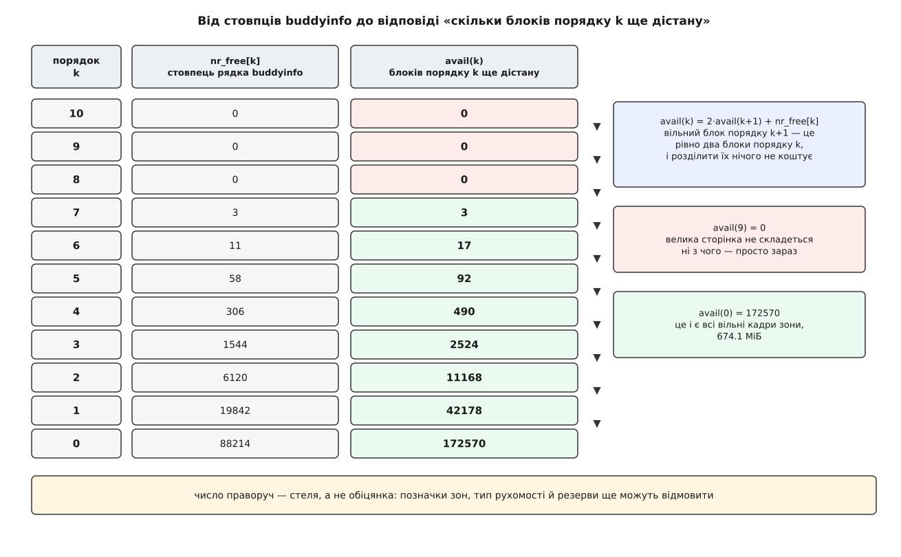
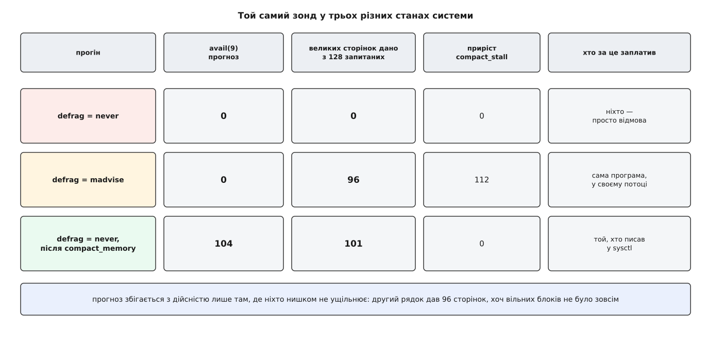

# ⚙️ Читач buddyinfo: прогноз найбільшого блоку і перевірка його дійсністю

Дві невеликі програми на C. Перша перетворює рядок `/proc/buddyinfo` на пряму відповідь: скільки вільно в кожній зоні, який найбільший суцільний блок є просто зараз і скільки блоків кожного порядку ще можна зібрати, не рухаючи жодної сторінки. Друга йде до системи й просить саме такі блоки — щоб побачити, де прогноз збігся, а де ні, і чим саме розбіжність пояснюється.

Порядок тут не декоративний. Прогноз без перевірки — вправа з арифметики: `buddyinfo` показує списки вільних блоків, а не те, що вам віддадуть. Між цими двома речами стоять рівневі позначки зон, типи рухомості й резерви, і жодна з цих перепон у файлі не видна. Тому корисна тільки пара: число, яке ми вивели, і число, яке ми зняли.

Домовимося про одне слово. **Порядок k** — це блок із 2ᵏ кадрів поспіль, вирівняний на власний розмір; на x86-64 з кадром у 4 КіБ порядок 9 — це рівно два мебібайти, тобто розмір великої сторінки.

## Питання, на яке файл не відповідає сам

Рядок `/proc/buddyinfo` — це `nr_free[k]`: скільки вільних блоків лежить у списку кожного порядку. Питання ж, яке ставлять насправді, звучить інакше: **скільки блоків порядку k я взагалі можу отримати**. Це не те саме число, бо великий вільний блок годиться і на менші запити.

Вільний блок порядку j — це, без жодного перенесення сторінок, два блоки порядку j−1, чотири блоки порядку j−2 і так далі вниз. Розділити його нічого не коштує: розподільник виймає блок зі свого списку, кладе половину в список нижчого порядку й віддає другу. Тому:

```
avail(k) = Σ (по j ≥ k) nr_free[j] · 2^(j−k)
```

Ця сума рахується одним проходом згори вниз, і в такому вигляді вона очевидніша:

```
avail(kmax) = nr_free[kmax]
avail(k)    = 2 · avail(k+1) + nr_free[k]
```

Усе, що є вище, дає вдвічі більше блоків тут — плюс те, що лежить у власному списку.



*Та сама пам'ять, два різні числа. Ліворуч — скільки блоків лежить у списку порядку; праворуч — скільки блоків цього порядку взагалі складеться з наявного.*

Два наслідки перевіряють правильність згортки. Перший: `avail(0)` — це всі вільні кадри зони, бо будь-який блок розпадається на одинарні кадри. Другий: найбільший порядок, у якого `nr_free` не нуль, і є найбільший суцільний шматок, доступний просто зараз, — вище нього нема чого ділити.

Та сама згортка живе в ядрі: функція `fill_contig_page_info()` у `mm/vmstat.c` рахує `free_blocks_suitable += blocks << (order − suitable_order)` — ті самі доданки, з яких ядро потім виводить свій показник фрагментації.

Головне застереження варто поставити одразу, а не в кінці. **`avail(k)` — це стеля, а не обіцянка.** Розподільник відмовить, навіть коли блок є, щонайменше з трьох причин: він не спускається нижче рівневої позначки `min` для звичайного запиту; він не віддасть блок із блоку сторінок чужого типу рухомості, якщо є куди відмовити; і він притримає низьку зону для тих, хто не має вибору. Розрив між `avail(k)` і тим, що видали, — це не похибка розбору, а якраз те, що вимірює друга програма.

## Що не можна зашивати в розбір

Файл виглядає простим, і саме тому його розбирають неправильно. Три речі в ньому — не сталі.

**Кількість стовпців.** Їх стільки, скільки в ядрі порядків: `NR_PAGE_ORDERS`, що дорівнює `MAX_PAGE_ORDER + 1`. На x86-64 це типово 11 (порядки 0…10), але `CONFIG_ARCH_FORCE_MAX_ORDER` межу міняє, і на arm64 чи на ядрі з увімкненим CMA число буде інше. Плутанини додає історія самої сталої, і її варто знати точно, бо старі поради з мережі досі спираються на попередній зміст. У ядрі 6.3 `MAX_ORDER` дорівнював 11 і означав *кількість* порядків, тож найбільший дозволений порядок був `MAX_ORDER - 1`. У 6.4 значення поміняли на 10, зробивши його включним. У 6.8 сталу перейменували на `MAX_PAGE_ORDER` — саме щоб код, написаний за старим змістом, не зібрався мовчки з новим; тоді ж з'явилося й `NR_PAGE_ORDERS`. Наслідок для нас простий: «одинадцять» ніде не пишемо, стовпці рахуємо.

**Розмір кадру.** Порядок 9 — це 2 МіБ на машині з кадром 4 КіБ і 32 МіБ на машині з кадром 64 КіБ. Береться з `sysconf(_SC_PAGESIZE)`.

**Набір рядків.** Рядок — це пара «вузол × заселена зона». `ZONE_DMA` може не існувати, `ZONE_DMA32` є лише на 64-бітних, `ZONE_MOVABLE` з'являється за налаштуванням, а вузлів на великій машині кілька — це [нерівномірний доступ до пам'яті](book:programming/numa). Ні кількості рядків, ні набору імен зон припускати не можна.

Звідси форма розбору: знайти номер вузла, взяти слово після `zone`, а далі — **усі числа, скільки їх є**.

## Читач

Файл читаємо одним `read()` у великий буфер. Причина не в швидкості. `/proc/buddyinfo` не існує на диску — його текст ядро складає в мить читання, обходячи зони ([як `/proc` віддає стан ядра текстом](book:unix-linux/proc-filesystem)). Один рядок ядро друкує, тримаючи `spin_lock_irqsave(&zone->lock)`, тож усередині рядка числа узгоджені між собою. А от між рядками замок відпускають — і чим меншими порціями ви тягнете файл, тим більше різних митей у ньому змішано. Великий буфер зводить це до мінімуму.

:::tabs
```c
/* budinfo.c — форма вільної пам'яті: зони, найбільший блок, avail(k).
   Збірка: cc -O2 -std=gnu11 -o budinfo budinfo.c
   Запуск: ./budinfo [--zone НАЗВА] [--need БАЙТІВ] [--hidden]

   без ключів  один підсумковий рядок на зону
   --zone      лише ця зона, але з повною таблицею за порядками
   --need      відповісти, чи є суцільний шматок такого розміру і в якій зоні
   --hidden    додати кадри з посторінкових запасів ядер (з /proc/zoneinfo)  */
#define _GNU_SOURCE
#include <fcntl.h>
#include <stdio.h>
#include <stdlib.h>
#include <string.h>
#include <unistd.h>

#define MAX_ORDERS 32
#define MAX_ZONES  64
#define BUFSZ      (1 << 17)      /* 128 КіБ — стане на будь-яку кількість вузлів */

static long pgsz;                 /* байтів у кадрі ЦІЄЇ машини */

struct zonerow {
    int  node;
    char name[16];
    int  norders;                 /* скільки стовпців дало ядро, а не скільки ми чекали */
    unsigned long nr_free[MAX_ORDERS];
    unsigned long avail[MAX_ORDERS];
    unsigned long free_pages;
    int  top;                     /* найбільший порядок із блоками; −1 — жодного */
};

/* Один read(): текст складається в мить читання, і дрібними порціями
   ви змішуєте кілька різних станів машини в одному «знімку». */
static ssize_t slurp(const char *path, char *buf, size_t cap)
{
    int fd = open(path, O_RDONLY | O_CLOEXEC);
    if (fd < 0) return -1;
    ssize_t n = read(fd, buf, cap - 1);
    close(fd);
    if (n < 0) return -1;
    buf[n] = '\0';
    return n;
}
```
```cpp
// budinfo.cpp — форма вільної пам'яті: зони, найбільший блок, avail(k).
// Збірка: c++ -O2 -std=c++20 -o budinfo budinfo.cpp
// Запуск: ./budinfo [--zone НАЗВА] [--need БАЙТІВ] [--hidden]
#include <charconv>
#include <fstream>
#include <iostream>
#include <string>
#include <string_view>
#include <vector>
#include <unistd.h>

struct ZoneRow {
    int node{};
    std::string name;
    int norders{};
    std::vector<unsigned long> nr_free;
    std::vector<unsigned long> avail;
    unsigned long free_pages{};
    int top{-1};
};

static std::string slurp(const std::string &path)
{
    std::ifstream f(path, std::ios::binary);
    if (!f) return {};
    return std::string((std::istreambuf_iterator<char>(f)), std::istreambuf_iterator<char>());
}
```
:::

Розбір одного рядка. Він працює з рядком, уже відрізаним по `'\n'`, — інакше `strtoul` радо перескочив би через перенос і затягнув числа наступної зони.

:::tabs

```c
/* «Node 0, zone   Normal   88214   19842   6120 …»
   Після назви зони — усі числа до кінця рядка, і скільки їх, вирішує ядро. */
static int parse_row(const char *s, struct zonerow *r)
{
    char *end;
    const char *p = strstr(s, "Node ");
    if (!p) return 0;
    r->node = (int) strtol(p + 5, &end, 10);
    p = end;

    p = strstr(p, "zone");
    if (!p) return 0;
    p += 4;
    while (*p == ' ' || *p == '\t') p++;
    size_t n = strcspn(p, " \t");
    if (n == 0 || n >= sizeof r->name) return 0;
    memcpy(r->name, p, n);
    r->name[n] = '\0';
    p += n;

    r->norders = 0;
    while (r->norders < MAX_ORDERS) {
        unsigned long v = strtoul(p, &end, 10);
        if (end == p) break;             /* чисел більше немає — рядок скінчився */
        r->nr_free[r->norders++] = v;
        p = end;
    }
    return r->norders > 0;
}

/* avail(k) = 2·avail(k+1) + nr_free[k] — одним проходом згори вниз. */
static void analyze(struct zonerow *r)
{
    unsigned long acc = 0;
    for (int k = r->norders - 1; k >= 0; k--) {
        acc = acc * 2 + r->nr_free[k];
        r->avail[k] = acc;
    }
    r->free_pages = r->avail[0];         /* блок будь-якого порядку — це кадри */
    r->top = -1;
    for (int k = 0; k < r->norders; k++)
        if (r->nr_free[k]) r->top = k;
}
```

```cpp
// Те саме серце мовою C++: розбір рядка й згортка avail(k).
// Збірка: c++ -O2 -std=c++20 -o budinfo budinfo.cpp
#include <charconv>
#include <string>
#include <string_view>
#include <vector>

struct ZoneRow {
    int node{};
    std::string name;
    std::vector<unsigned long> nr_free;   // довжину задає ядро, не ми
    std::vector<unsigned long> avail;
    unsigned long free_pages{};
    int top{-1};
};

static std::vector<unsigned long> numbers(std::string_view s)
{
    std::vector<unsigned long> v;
    while (!s.empty()) {
        while (!s.empty() && (s.front() == ' ' || s.front() == '\t'))
            s.remove_prefix(1);
        unsigned long x{};
        auto [p, ec] = std::from_chars(s.data(), s.data() + s.size(), x);
        if (ec != std::errc{}) break;     // чисел більше немає
        v.push_back(x);
        s.remove_prefix(static_cast<std::size_t>(p - s.data()));
    }
    return v;
}

static bool parse_row(std::string_view line, ZoneRow &r)
{
    auto n = line.find("Node ");
    if (n == std::string_view::npos) return false;
    line.remove_prefix(n + 5);

    unsigned long id{};
    auto [p, ec] = std::from_chars(line.data(), line.data() + line.size(), id);
    if (ec != std::errc{}) return false;
    r.node = static_cast<int>(id);
    line.remove_prefix(static_cast<std::size_t>(p - line.data()));

    auto z = line.find("zone");
    if (z == std::string_view::npos) return false;
    line.remove_prefix(z + 4);
    while (!line.empty() && line.front() == ' ') line.remove_prefix(1);
    auto end = line.find(' ');
    if (end == std::string_view::npos || end == 0) return false;
    r.name = line.substr(0, end);
    line.remove_prefix(end);

    r.nr_free = numbers(line);
    return !r.nr_free.empty();
}

// avail(k) = 2·avail(k+1) + nr_free[k] — одним проходом згори вниз.
static void analyze(ZoneRow &r)
{
    r.avail.assign(r.nr_free.size(), 0);
    unsigned long acc = 0;
    for (std::size_t i = r.nr_free.size(); i-- > 0; ) {
        acc = acc * 2 + r.nr_free[i];
        r.avail[i] = acc;
    }
    r.free_pages = r.avail.front();
    r.top = -1;
    for (std::size_t i = 0; i < r.nr_free.size(); ++i)
        if (r.nr_free[i]) r.top = static_cast<int>(i);
}
```

:::

Варіант на C++ тут виграє в одному конкретному місці: довжину масивів задає сам файл, а не наша стеля `MAX_ORDERS`, тож ядро з сорока порядками не мовчки обріжеться, а просто спрацює. Розбір теж коротший — `string_view` ріже рядок без копіювань, `from_chars` читає число без локалі й без `errno`. Решта програми далі йде на C: там самі системні виклики й `printf`, і вибір мови в них нічого не змінює.

Ще два помічники: людські одиниці й вилов посторінкових запасів, до яких ще повернемося.

:::tabs
```c
static void human(unsigned long bytes, char *out, size_t cap)
{
    static const char *u[] = { "Б", "КіБ", "МіБ", "ГіБ", "ТіБ" };
    int i = 0;
    double v = (double) bytes;
    while (v >= 1024.0 && i < 4) { v /= 1024.0; i++; }
    snprintf(out, cap, "%.1f %s", v, u[i]);
}

/* Скільки кадрів лежить у посторінкових запасах ядер цієї зони: у /proc/zoneinfo
   це рядки «count:» усередині блоку «pagesets». У buddyinfo їх нема — і в
   MemFree теж нема, бо кадр, виданий у запас процесора, уже знято з обліку. */
static unsigned long pcp_hidden(const char *zi, int node, const char *zone)
{
    char hdr[64];
    snprintf(hdr, sizeof hdr, "Node %d, zone %8s", node, zone);
    const char *p = strstr(zi, hdr);
    if (!p) return 0;
    const char *stop = strstr(p + 1, "\nNode ");      /* межа наступної зони */
    const char *q = strstr(p, "\n  pagesets");
    if (!q || (stop && q > stop)) return 0;

    unsigned long sum = 0;
    while ((q = strstr(q + 1, "count:")) != NULL) {
        if (stop && q > stop) break;
        sum += strtoul(q + 6, NULL, 10);
    }
    return sum;
}
```
```cpp
static std::string human(unsigned long bytes)
{
    static const char *u[] = { "Б", "КіБ", "МіБ", "ГіБ", "ТіБ" };
    int i = 0;
    double v = static_cast<double>(bytes);
    while (v >= 1024.0 && i < 4) { v /= 1024.0; i++; }
    char buf[64];
    snprintf(buf, sizeof buf, "%.1f %s", v, u[i]);
    return std::string(buf);
}

static unsigned long pcp_hidden(std::string_view zi, int node, std::string_view zone)
{
    char hdr[64];
    snprintf(hdr, sizeof hdr, "Node %d, zone %8s", node, std::string(zone).c_str());
    auto pos = zi.find(hdr);
    if (pos == std::string_view::npos) return 0;
    auto stop = zi.find("\nNode ", pos + 1);
    auto q = zi.find("\n  pagesets", pos);
    if (q == std::string_view::npos || (stop != std::string_view::npos && q > stop)) return 0;

    unsigned long sum = 0;
    while ((q = zi.find("count:", q + 1)) != std::string_view::npos) {
        if (stop != std::string_view::npos && q > stop) break;
        unsigned long val = 0;
        auto sub = zi.substr(q + 6);
        std::from_chars(sub.data(), sub.data() + sub.size(), val);
        sum += val;
    }
    return sum;
}
```
:::

Обв'язка: прочитати, розібрати, порахувати, надрукувати.

:::tabs
```c
int main(int argc, char **argv)
{
    pgsz = sysconf(_SC_PAGESIZE);
    unsigned long need = 0;
    const char *only = NULL;
    int want_hidden = 0;

    for (int i = 1; i < argc; i++) {
        if (!strcmp(argv[i], "--need") && i + 1 < argc)
            need = strtoul(argv[++i], NULL, 0);
        else if (!strcmp(argv[i], "--zone") && i + 1 < argc)
            only = argv[++i];
        else if (!strcmp(argv[i], "--hidden"))
            want_hidden = 1;
        else { fprintf(stderr, "не знаю опції %s\n", argv[i]); return 2; }
    }

    static char buf[BUFSZ], zi[BUFSZ];
    if (slurp("/proc/buddyinfo", buf, sizeof buf) < 0) { perror("buddyinfo"); return 1; }
    if (want_hidden && slurp("/proc/zoneinfo", zi, sizeof zi) < 0) zi[0] = '\0';

    static struct zonerow rows[MAX_ZONES];
    int nrows = 0;
    char *save = NULL;
    for (char *ln = strtok_r(buf, "\n", &save); ln && nrows < MAX_ZONES;
         ln = strtok_r(NULL, "\n", &save))
        if (parse_row(ln, &rows[nrows])) analyze(&rows[nrows++]);
    if (!nrows) { fprintf(stderr, "жодного рядка не розібрано\n"); return 1; }

    /* Порядок, потрібний під запит: найменший k, де 2ᵏ кадрів вистачає. */
    int wanted = -1;
    if (need) {
        wanted = 0;
        while ((unsigned long) pgsz << wanted < need && wanted < rows[0].norders - 1)
            wanted++;
    }

    char h1[32], h2[32];
    human((unsigned long) pgsz, h1, sizeof h1);
    human((unsigned long) pgsz << (rows[0].norders - 1), h2, sizeof h2);
    printf("кадр %s, порядків %d → MAX_PAGE_ORDER = %d, найбільший блок %s\n\n",
           h1, rows[0].norders, rows[0].norders - 1, h2);

    for (int i = 0; i < nrows; i++) {
        struct zonerow *r = &rows[i];
        if (only && strcmp(only, r->name)) continue;
        /* Ширину полів printf рівняє за БАЙТАМИ, а кирилична літера важить два,
           тож усі стовпці тут числові, а підписи — латиниця або кінець рядка. */
        printf("Node %d, zone %-8s  вільно %9.1f МіБ", r->node, r->name,
               r->free_pages * (double) pgsz / 1048576.0);
        if (r->top >= 0) {
            human((unsigned long) pgsz << r->top, h2, sizeof h2);
            printf("   найбільший блок: порядок %d = %s\n", r->top, h2);
        } else {
            printf("   вільних блоків немає зовсім\n");
        }

        if (want_hidden) {
            unsigned long hid = pcp_hidden(zi, r->node, r->name);
            human(hid * (unsigned long) pgsz, h1, sizeof h1);
            printf("    у запасах ядер, поза цим рядком: %lu кадрів (%s)\n", hid, h1);
        }

        if (need) {
            human(need, h1, sizeof h1);
            printf("    під %s треба порядок %d → таких блоків ще дістану: %lu\n",
                   h1, wanted, wanted < r->norders ? r->avail[wanted] : 0);
            continue;
        }

        if (!only) continue;                 /* таблиця за порядками — на прохання */
        puts("    порядок     кадрів     у списку   ще дістану   розмір");
        for (int k = 0; k < r->norders; k++) {
            human((unsigned long) pgsz << k, h1, sizeof h1);
            printf("    %7d %10lu %12lu %12lu   %s\n",
                   k, 1UL << k, r->nr_free[k], r->avail[k], h1);
        }
        putchar('\n');
    }
    return 0;
}
```
```cpp
int main(int argc, char **argv)
{
    long pgsz = sysconf(_SC_PAGESIZE);
    unsigned long need = 0;
    std::string only;
    bool want_hidden = false;

    for (int i = 1; i < argc; i++) {
        std::string_view arg(argv[i]);
        if (arg == "--need" && i + 1 < argc)
            need = std::stoul(argv[++i]);
        else if (arg == "--zone" && i + 1 < argc)
            only = argv[++i];
        else if (arg == "--hidden")
            want_hidden = true;
        else { std::cerr << "не знаю опції " << arg << "\n"; return 2; }
    }

    std::string buf = slurp("/proc/buddyinfo");
    if (buf.empty()) { std::perror("buddyinfo"); return 1; }
    std::string zi = want_hidden ? slurp("/proc/zoneinfo") : "";

    std::vector<ZoneRow> rows;
    std::string_view sv(buf);
    while (!sv.empty()) {
        auto pos = sv.find('\n');
        std::string_view line = (pos == std::string_view::npos) ? sv : sv.substr(0, pos);
        sv = (pos == std::string_view::npos) ? std::string_view{} : sv.substr(pos + 1);

        ZoneRow r;
        if (parse_row(line, r)) {
            analyze(r);
            rows.push_back(std::move(r));
        }
    }
    if (rows.empty()) { std::cerr << "жодного рядка не розібрано\n"; return 1; }

    int wanted = -1;
    if (need) {
        wanted = 0;
        while (static_cast<unsigned long>(pgsz) << wanted < need && wanted < static_cast<int>(rows[0].nr_free.size()) - 1)
            wanted++;
    }

    std::string h1 = human(static_cast<unsigned long>(pgsz));
    std::string h2 = human(static_cast<unsigned long>(pgsz) << (rows[0].nr_free.size() - 1));
    std::cout << "кадр " << h1 << ", порядків " << rows[0].nr_free.size()
              << " → MAX_PAGE_ORDER = " << (rows[0].nr_free.size() - 1)
              << ", найбільший блок " << h2 << "\n\n";

    for (const auto &r : rows) {
        if (!only.empty() && only != r.name) continue;
        std::cout << "Node " << r.node << ", zone " << r.name
                  << "  вільно " << (r.free_pages * static_cast<double>(pgsz) / 1048576.0) << " МіБ";
        if (r.top >= 0) {
            std::cout << "   найбільший блок: порядок " << r.top << " = " << human(static_cast<unsigned long>(pgsz) << r.top) << "\n";
        } else {
            std::cout << "   вільних блоків немає зовсім\n";
        }

        if (want_hidden) {
            unsigned long hid = pcp_hidden(zi, r.node, r.name);
            std::cout << "    у запасах ядер, поза цим рядком: " << hid << " кадрів (" << human(hid * static_cast<unsigned long>(pgsz)) << ")\n";
        }

        if (need) {
            std::cout << "    під " << human(need) << " треба порядок " << wanted
                      << " → таких блоків ще дістану: " << (wanted < static_cast<int>(r.avail.size()) ? r.avail[wanted] : 0) << "\n";
            continue;
        }

        if (only.empty()) continue;
        std::cout << "    порядок     кадрів     у списку   ще дістану   розмір\n";
        for (std::size_t k = 0; k < r.nr_free.size(); k++) {
            std::cout << "    " << k << " " << (1UL << k) << " " << r.nr_free[k]
                      << " " << r.avail[k] << "   " << human(static_cast<unsigned long>(pgsz) << k) << "\n";
        }
        std::cout << "\n";
    }
    return 0;
}
```
:::

## Що видно на живій машині

Прогін на робочому сервері з 16 ГіБ пам'яті та місяцем безперервної роботи:

```sh
$ ./budinfo
кадр 4.0 КіБ, порядків 11 → MAX_PAGE_ORDER = 10, найбільший блок 4.0 МіБ

Node 0, zone DMA       вільно      12.1 МіБ   найбільший блок: порядок 10 = 4.0 МіБ
Node 0, zone DMA32     вільно     158.7 МіБ   найбільший блок: порядок 8 = 1.0 МіБ
Node 0, zone Normal    вільно     674.1 МіБ   найбільший блок: порядок 7 = 512.0 КіБ
```

Три рядки, і в них уже видно головне. У головній зоні вільно шістсот сімдесят чотири мебібайти, а найбільший шматок, який з неї можна взяти, — 512 кілобайтів. А `ZONE_DMA`, у якій вільно всього дванадцять мебібайтів, спокійно віддасть блок на чотири — бо туди майже ніхто не ходить і псувати її форму нема кому.

Повна картина по зоні:

```sh
$ ./budinfo --zone Normal
кадр 4.0 КіБ, порядків 11 → MAX_PAGE_ORDER = 10, найбільший блок 4.0 МіБ

Node 0, zone Normal    вільно     674.1 МіБ   найбільший блок: порядок 7 = 512.0 КіБ
    порядок     кадрів     у списку   ще дістану   розмір
          0          1        88214       172570   4.0 КіБ
          1          2        19842        42178   8.0 КіБ
          2          4         6120        11168   16.0 КіБ
          3          8         1544         2524   32.0 КіБ
          4         16          306          490   64.0 КіБ
          5         32           58           92   128.0 КіБ
          6         64           11           17   256.0 КіБ
          7        128            3            3   512.0 КіБ
          8        256            0            0   1.0 МіБ
          9        512            0            0   2.0 МіБ
         10       1024            0            0   4.0 МіБ
```

Останні три рядки — вирок. Жодної великої сторінки в цій зоні не збереться: `avail(9)` дорівнює нулю, і жодне ділення цього не змінить, бо ділити нема чого.

Запит на конкретний розмір відповідає одним рядком на зону:

```sh
$ ./budinfo --need 262144
кадр 4.0 КіБ, порядків 11 → MAX_PAGE_ORDER = 10, найбільший блок 4.0 МіБ

Node 0, zone DMA       вільно      12.1 МіБ   найбільший блок: порядок 10 = 4.0 МіБ
    під 256.0 КіБ треба порядок 6 → таких блоків ще дістану: 47
Node 0, zone DMA32     вільно     158.7 МіБ   найбільший блок: порядок 8 = 1.0 МіБ
    під 256.0 КіБ треба порядок 6 → таких блоків ще дістану: 16
Node 0, zone Normal    вільно     674.1 МіБ   найбільший блок: порядок 7 = 512.0 КіБ
    під 256.0 КіБ треба порядок 6 → таких блоків ще дістану: 17
```

Драйвер, якому потрібна чверть мебібайта поспіль, на цій машині ще житиме — але сімнадцять спроб у головній зоні, і все.

> 🔧 **Навіщо це.** Число `avail(k)` варто знімати не тоді, коли щось уже впало, а періодично — раз на хвилину в ту саму систему збору показників, куди йдуть інші лічильники. Тоді відмова великого виділення перестає бути раптовою: на графіку видно, як `avail(9)` місяць повзе до нуля, і втручатися можна за тижні до аварії.

## Чим із простору користувача взагалі можна помацати порядок

Тепер друга половина: перевірка. І одразу неприємна правда — **з простору користувача не можна попросити суцільну фізичну пам'ять**. Ні `malloc`, ні `mmap`, ні `posix_memalign` про фізичні кадри нічого не кажуть: вони роздають діапазони віртуальних адрес, а те, як ті лягли на кадри, лишається справою ядра. Тому «перевірка прогнозу» вимагає обхідного шляху, і кандидатів рівно три — з них два оманливі.

**`posix_memalign` на межу 2 МіБ** вирівнює адресу *віртуально* ([звідки алокатор бере пам'ять](book:unix-linux/allocator-and-kernel)). Це необхідно — велику сторінку кладуть лише на вирівняний діапазон адрес, і без вирівнювання її не буде ніколи, скільки б вільних блоків не лежало. Але це не *достатньо* й нічого не міряє: сам виклик коштує однаково на свіжій і на вкрай пофрагментованій машині.

**`mmap` з `MAP_POPULATE`** просить ядро одразу заповнити всю ділянку, замість роздавати кадри по одному на дотик ([mmap як механізм](book:unix-linux/mmap-model), [чому кадр підставляють у мить першого дотику](book:unix-linux/page-fault)). Спокуса зрозуміла: узяти гігабайт, поміряти час, оголосити це вимірюванням фрагментації. Це неправда. `MAP_POPULATE` набирає кадри порядку 0 — а порядок 0 не закінчується доти, доки в системі взагалі є вільна пам'ять. Гальмує він від [витіснення](book:unix-linux/swap-and-reclaim), тобто від браку, а не від форми, і вимірює зовсім іншу стіну. Якщо все-таки треба саме заповнення, чесніший інструмент — `madvise(MADV_POPULATE_WRITE)` (з Linux 5.14): він повертає `ENOMEM`, замість того щоб довести до вбивства процесу.

**Велика сторінка** — єдиний із трьох, що справді впирається в порядок. Запис таблиці, який покриває два мебібайти одним номером кадру, вимагає рівно блоку порядку 9 ([великі сторінки: HugeTLB і прозорі](book:unix-linux/huge-pages)). І тут є два способи попросити.

Перший — `madvise(MADV_HUGEPAGE)` і дотик: ядро спробує велику сторінку, а не вийде — мовчки покладе звичайні кадри. Мовчки — це і є проблема: відмови не видно, її треба вираховувати з `AnonHugePages`.

Другий — `madvise(MADV_COLLAPSE)`, що з'явився в Linux 6.1. Він робить те саме синхронно й **повертає помилку**. Причому не абияку: у `madvise_collapse_errno()` випадок `SCAN_ALLOC_HUGE_PAGE_FAIL` перетворюється рівно на `ENOMEM`. Тобто `ENOMEM` від `MADV_COLLAPSE` означає буквально «блоку порядку 9 не склалося» — саме те число, яке передбачає `avail(9)`. Кращого зонда з простору користувача не існує.

## Зонд

:::tabs
```c
/* thpprobe.c — скільки блоків порядку 9 система дасть НАСПРАВДІ.
   Збірка: cc -O2 -std=gnu11 -o thpprobe thpprobe.c
   Запуск: ./thpprobe [--count 128] [--collapse]

   без ключів   MADV_HUGEPAGE + дотик: тиха спроба, відмову рахуємо самі
   --collapse   MADV_COLLAPSE на кожен шматок: синхронно, з errno            */
#define _GNU_SOURCE
#include <errno.h>
#include <stdint.h>
#include <stdio.h>
#include <stdlib.h>
#include <string.h>
#include <time.h>
#include <unistd.h>
#include <sys/mman.h>

#ifndef MADV_COLLAPSE
#define MADV_COLLAPSE 25          /* Linux 6.1; старі заголовки його не знають */
#endif

#define THP "/sys/kernel/mm/transparent_hugepage/"

static long sysfs_num(const char *path)
{
    FILE *f = fopen(path, "re");
    if (!f) return -1;
    long v;
    if (fscanf(f, "%ld", &v) != 1) v = -1;
    fclose(f);
    return v;
}

/* Лічильник із /proc/vmstat: рядки вигляду «ключ ЧИСЛО».
   Пробіл після ключа обов'язковий — інакше «thp_fault_fallback» злапає
   сусідній рядок «thp_fault_fallback_charge» і поверне зовсім інше число. */
static long vmstat(const char *key)
{
    FILE *f = fopen("/proc/vmstat", "re");
    if (!f) return -1;
    const size_t klen = strlen(key);
    char line[128];
    long v = -1;
    while (fgets(line, sizeof line, f))
        if (!strncmp(line, key, klen) && line[klen] == ' ') {
            v = strtol(line + klen + 1, NULL, 10);
            break;
        }
    fclose(f);
    return v;
}

/* AnonHugePages з /proc/self/smaps_rollup, у кілобайтах.
   У /proc/self/status цього поля немає — там лише RssAnon і RssFile. */
static long anon_thp_kb(void)
{
    FILE *f = fopen("/proc/self/smaps_rollup", "re");
    if (!f) return -1;
    char line[160];
    long v = -1;
    while (fgets(line, sizeof line, f))
        if (!strncmp(line, "AnonHugePages:", 14)) {
            v = strtol(line + 14, NULL, 10);
            break;
        }
    fclose(f);
    return v;
}

static double now_us(void)
{
    struct timespec ts;
    clock_gettime(CLOCK_MONOTONIC, &ts);
    return ts.tv_sec * 1e6 + ts.tv_nsec / 1e3;
}

static int cmp_d(const void *a, const void *b)
{
    double x = *(const double *) a, y = *(const double *) b;
    return (x > y) - (x < y);
}
```
```cpp
// thpprobe.cpp — скільки блоків порядку 9 система дасть НАСПРАВДІ.
// Збірка: c++ -O2 -std=c++20 -o thpprobe thpprobe.cpp
#include <algorithm>
#include <chrono>
#include <cstdint>
#include <fstream>
#include <iostream>
#include <string>
#include <string_view>
#include <vector>
#include <unistd.h>
#include <sys/mman.h>

#ifndef MADV_COLLAPSE
#define MADV_COLLAPSE 25
#endif

static long sysfs_num(const std::string &path)
{
    std::ifstream f(path);
    if (!f) return -1;
    long v = -1;
    f >> v;
    return f ? v : -1;
}

static long vmstat(std::string_view key)
{
    std::ifstream f("/proc/vmstat");
    if (!f) return -1;
    std::string line;
    while (std::getline(f, line)) {
        if (line.starts_with(key) && line.size() > key.size() && line[key.size()] == ' ') {
            return std::stol(line.substr(key.size() + 1));
        }
    }
    return -1;
}

static long anon_thp_kb()
{
    std::ifstream f("/proc/self/smaps_rollup");
    if (!f) return -1;
    std::string line;
    while (std::getline(f, line)) {
        if (line.starts_with("AnonHugePages:")) {
            return std::stol(line.substr(14));
        }
    }
    return -1;
}

static double now_us()
{
    auto now = std::chrono::steady_clock::now();
    return std::chrono::duration<double, std::micro>(now.time_since_epoch()).count();
}
```
:::

Серце зонда. Ділянку беремо з запасом і вирівнюємо руками — покладатися на те, що ядро саме віддасть вирівняну адресу, не варто: воно так робить лише коли великі сторінки ввімкнені, а нам потрібен той самий дослід і з вимкненими.

:::tabs
```c
int main(int argc, char **argv)
{
    long pg = sysconf(_SC_PAGESIZE);
    long hp = sysfs_num(THP "hpage_pmd_size");
    if (hp <= 0) {
        fprintf(stderr, "прозорих великих сторінок у цьому ядрі немає\n");
        return 1;
    }
    size_t hpsz = (size_t) hp;
    int pmd_order = 0;
    for (size_t s = (size_t) pg; s < hpsz; s <<= 1) pmd_order++;

    size_t count = 128;
    int collapse = 0;
    for (int i = 1; i < argc; i++) {
        if (!strcmp(argv[i], "--count") && i + 1 < argc) count = strtoul(argv[++i], NULL, 0);
        else if (!strcmp(argv[i], "--collapse")) collapse = 1;
        else { fprintf(stderr, "не знаю опції %s\n", argv[i]); return 2; }
    }

    size_t total = count * hpsz;
    printf("велика сторінка %zu Б = порядок %d; прошу %zu штук (%.1f МіБ)\n",
           hpsz, pmd_order, count, total / 1048576.0);

    void *raw = mmap(NULL, total + hpsz, PROT_READ | PROT_WRITE,
                     MAP_PRIVATE | MAP_ANONYMOUS, -1, 0);
    if (raw == MAP_FAILED) { perror("mmap"); return 1; }
    /* вирівнювання на межу великої сторінки — умова, а не оптимізація:
       без нього великого запису таблиці не буде за жодної форми пам'яті */
    volatile unsigned char *base =
        (volatile unsigned char *) (((uintptr_t) raw + hpsz - 1) & ~(uintptr_t)(hpsz - 1));

    long a0 = vmstat("thp_fault_alloc"), f0 = vmstat("thp_fault_fallback");
    long s0 = vmstat("compact_stall"),   c0 = vmstat("compact_success");
    long thp0 = anon_thp_kb();                  /* що в процесі вже було до нас */

    double *us = malloc(count * sizeof *us);
    size_t ok = 0, enomem = 0, other = 0;

    if (collapse) {
        /* Спершу набираємо звичайні кадри. Це має сенс, лише коли
           transparent_hugepage/enabled = madvise: при «always» ядро вже
           на дотику дасть велику сторінку, і збирати буде нічого. */
        for (size_t i = 0; i < count; i++)
            for (size_t off = 0; off < hpsz; off += (size_t) pg)
                base[i * hpsz + off] = 0xA5;
        for (size_t i = 0; i < count; i++) {
            double t = now_us();
            int rc = madvise((void *) (base + i * hpsz), hpsz, MADV_COLLAPSE);
            us[i] = now_us() - t;
            if (rc == 0) ok++;
            else if (errno == ENOMEM) enomem++;     /* блоку порядку 9 не склалося */
            else other++;
        }
    } else {
        madvise((void *) base, total, MADV_HUGEPAGE);
        for (size_t i = 0; i < count; i++) {
            double t = now_us();
            base[i * hpsz] = 0xA5;                  /* один дотик на шматок */
            us[i] = now_us() - t;
        }
        /* smaps_rollup підсумовує ВЕСЬ процес, тому рахуємо приріст, а не
           повне число: великі сторінки могла мати й арена алокатора. */
        long got = anon_thp_kb() - (thp0 > 0 ? thp0 : 0);
        ok = got > 0 ? (size_t) got / (hpsz / 1024) : 0;
        if (ok > count) ok = count;
        enomem = count - ok;                        /* тиха відмова — це просто решта */
    }

    qsort(us, count, sizeof *us, cmp_d);
    printf("дано великих сторінок: %zu з %zu   (відмов: %zu, інших помилок: %zu)\n",
           ok, count, enomem, other);
    printf("затримка на шматок, мкс: медіана %.1f, 90%% %.1f, найгірша %.1f\n",
           us[count / 2], us[count * 9 / 10], us[count - 1]);
    printf("приріст: thp_fault_alloc %+ld, thp_fault_fallback %+ld, "
           "compact_stall %+ld, compact_success %+ld\n",
           vmstat("thp_fault_alloc") - a0, vmstat("thp_fault_fallback") - f0,
           vmstat("compact_stall") - s0, vmstat("compact_success") - c0);

    free(us);
    munmap(raw, total + hpsz);
    return 0;
}
```
```cpp
int main(int argc, char **argv)
{
    long pg = sysconf(_SC_PAGESIZE);
    long hp = sysfs_num("/sys/kernel/mm/transparent_hugepage/hpage_pmd_size");
    if (hp <= 0) {
        std::cerr << "прозорих великих сторінок у цьому ядрі немає\n";
        return 1;
    }
    size_t hpsz = static_cast<size_t>(hp);
    int pmd_order = 0;
    for (size_t s = static_cast<size_t>(pg); s < hpsz; s <<= 1) pmd_order++;

    size_t count = 128;
    bool collapse = false;
    for (int i = 1; i < argc; i++) {
        std::string_view arg(argv[i]);
        if (arg == "--count" && i + 1 < argc) count = std::stoul(argv[++i]);
        else if (arg == "--collapse") collapse = true;
        else { std::cerr << "не знаю опції " << arg << "\n"; return 2; }
    }

    size_t total = count * hpsz;
    std::cout << "велика сторінка " << hpsz << " Б = порядок " << pmd_order
              << "; прошу " << count << " штук (" << (total / 1048576.0) << " МіБ)\n";

    void *raw = mmap(NULL, total + hpsz, PROT_READ | PROT_WRITE,
                     MAP_PRIVATE | MAP_ANONYMOUS, -1, 0);
    if (raw == MAP_FAILED) { std::perror("mmap"); return 1; }
    auto *base = reinterpret_cast<volatile unsigned char *>(
        (reinterpret_cast<uintptr_t>(raw) + hpsz - 1) & ~(uintptr_t)(hpsz - 1));

    long a0 = vmstat("thp_fault_alloc"), f0 = vmstat("thp_fault_fallback");
    long s0 = vmstat("compact_stall"),   c0 = vmstat("compact_success");
    long thp0 = anon_thp_kb();

    std::vector<double> us(count);
    size_t ok = 0, enomem = 0, other = 0;

    if (collapse) {
        for (size_t i = 0; i < count; i++)
            for (size_t off = 0; off < hpsz; off += static_cast<size_t>(pg))
                base[i * hpsz + off] = 0xA5;
        for (size_t i = 0; i < count; i++) {
            double t = now_us();
            int rc = madvise(const_cast<void *>(static_cast<volatile void *>(base + i * hpsz)), hpsz, MADV_COLLAPSE);
            us[i] = now_us() - t;
            if (rc == 0) ok++;
            else if (errno == ENOMEM) enomem++;
            else other++;
        }
    } else {
        madvise(const_cast<void *>(static_cast<volatile void *>(base)), total, MADV_HUGEPAGE);
        for (size_t i = 0; i < count; i++) {
            double t = now_us();
            base[i * hpsz] = 0xA5;
            us[i] = now_us() - t;
        }
        long got = anon_thp_kb() - (thp0 > 0 ? thp0 : 0);
        ok = got > 0 ? static_cast<size_t>(got) / (hpsz / 1024) : 0;
        if (ok > count) ok = count;
        enomem = count - ok;
    }

    std::sort(us.begin(), us.end());
    std::cout << "дано великих сторінок: " << ok << " з " << count
              << "   (відмов: " << enomem << ", інших помилок: " << other << ")\n";
    std::cout << "затримка на шматок, мкс: медіана " << us[count / 2]
              << ", 90% " << us[count * 9 / 10] << ", найгірша " << us[count - 1] << "\n";
    std::cout << "приріст: thp_fault_alloc " << (vmstat("thp_fault_alloc") - a0)
              << ", thp_fault_fallback " << (vmstat("thp_fault_fallback") - f0)
              << ", compact_stall " << (vmstat("compact_stall") - s0)
              << ", compact_success " << (vmstat("compact_success") - c0) << "\n";

    munmap(raw, total + hpsz);
    return 0;
}
```
:::

Ключове тут — не сам дотик, а те, що навколо нього. Затримка на шматок розділяє світ надвоє: узяти готовий блок зі списку — це одиниці мікросекунд, а ущільнити зону задля нього — сотні мікросекунд або мілісекунди. Приріст `compact_stall` каже, скільки разів наш власний потік пішов ущільнювати замість того, щоб отримати пам'ять.

Хто саме за це заплатить, вирішує не програма, а вимикач `defrag`:

```sh
$ cat /sys/kernel/mm/transparent_hugepage/defrag
always defer defer+madvise [madvise] never
```

Значень п'ять. `never` — не ущільнювати взагалі, а не вийшло, то дати звичайні кадри. `madvise` (типове) — ущільнювати просто в шляху збою, але тільки для ділянок, позначених `MADV_HUGEPAGE`. `defer` — не чекати самому, а розбудити `kswapd` і `kcompactd` і піти далі. `defer+madvise` — те саме, але для позначених ділянок усе-таки чекати. `always` — чекати завжди. Для нашого досліду це головний важіль: щоб поміряти **наявний** стан, треба `never`; щоб поміряти, **скільки ущільнення додає**, треба `madvise`.

Поруч живе другий вимикач, `enabled`, і без нього зонд не працює зовсім: він вирішує, чи ядро взагалі пробує велику сторінку. Значення `always` пробує на кожну відповідну ділянку, `madvise` — тільки на позначені `MADV_HUGEPAGE`, `never` вимикає механізм. Для наших прогонів потрібне `madvise`: воно лишає нам повний контроль над тим, які ділянки беруть участь у досліді.

## Три прогони, з яких усе складається

Порядок дій на тій самій машині, чий `buddyinfo` показано вище.

```sh
$ cat /sys/kernel/mm/transparent_hugepage/enabled
always [madvise] never

$ ./budinfo --need 2097152 | grep Normal -A1
Node 0, zone Normal    вільно     674.1 МіБ   найбільший блок: порядок 7 = 512.0 КіБ
    під 2.0 МіБ треба порядок 9 → таких блоків ще дістану: 0

$ echo never | sudo tee /sys/kernel/mm/transparent_hugepage/defrag > /dev/null
$ ./thpprobe --count 128
велика сторінка 2097152 Б = порядок 9; прошу 128 штук (256.0 МіБ)
дано великих сторінок: 0 з 128   (відмов: 128, інших помилок: 0)
затримка на шматок, мкс: медіана 1.8, 90% 2.4, найгірша 11.9
приріст: thp_fault_alloc +0, thp_fault_fallback +128, compact_stall +0, compact_success +0
```

Прогноз збігся точно: нуль означав нуль. Затримки крихітні, бо ніхто нічого не збирав — просто підставили звичайні кадри.

```sh
$ echo madvise | sudo tee /sys/kernel/mm/transparent_hugepage/defrag > /dev/null
$ ./thpprobe --count 128
велика сторінка 2097152 Б = порядок 9; прошу 128 штук (256.0 МіБ)
дано великих сторінок: 96 з 128   (відмов: 32, інших помилок: 0)
затримка на шматок, мкс: медіана 412.0, 90% 3180.5, найгірша 9944.2
приріст: thp_fault_alloc +96, thp_fault_fallback +32, compact_stall +112, compact_success +71
```

Дев'яносто шість великих сторінок там, де вільних блоків порядку 9 не було **жодного**. Ніякої суперечності: їх не було — їх зробили. Сто дванадцять зупинок на ущільнення, і ціна цих зупинок стоїть у тому ж рядку: медіана виросла з двох мікросекунд до чотирьохсот, а найгірший шматок обійшовся в десять мілісекунд. Заплатив за це наш власний потік, у своєму часі — і саме так виглядає збій великої сторінки на бойовій машині, коли хтось скаржиться на «випадкові підвисання».

```sh
$ sudo sh -c 'echo 1 > /proc/sys/vm/compact_memory'
$ ./budinfo --zone Normal | tail -n +3
Node 0, zone Normal    вільно     674.1 МіБ   найбільший блок: порядок 10 = 4.0 МіБ
    порядок     кадрів     у списку   ще дістану   розмір
          0          1        86850       172570   4.0 КіБ
          1          2         3860        42860   8.0 КіБ
          2          4         1120        19500   16.0 КіБ
          3          8          402         9190   32.0 КіБ
          4         16          180         4394   64.0 КіБ
          5         32           95         2107   128.0 КіБ
          6         64           48         1006   256.0 КіБ
          7        128           29          479   512.0 КіБ
          8        256           17          225   1.0 МіБ
          9        512           22          104   2.0 МіБ
         10       1024           41           41   4.0 МіБ

$ echo never | sudo tee /sys/kernel/mm/transparent_hugepage/defrag > /dev/null
$ ./thpprobe --count 128
велика сторінка 2097152 Б = порядок 9; прошу 128 штук (256.0 МіБ)
дано великих сторінок: 101 з 128   (відмов: 27, інших помилок: 0)
затримка на шматок, мкс: медіана 2.1, 90% 3.0, найгірша 15.6
приріст: thp_fault_alloc +101, thp_fault_fallback +27, compact_stall +0, compact_success +0
```



*Вільних кадрів у зоні весь час однаково — 674 мебібайти. Змінюється тільки те, як вони лежать і хто за перекладання платить.*

Вільної пам'яті після ущільнення стільки ж, до кадра: 674.1 МіБ. Найбільший блок піднявся з половини мебібайта до чотирьох. Прогноз `avail(9)` став 104 — і зонд дістав 101 замість 104, не заплативши жодної зупинки. Розрив у три сторінки й є те, чого з файла не видно: рівнева позначка `min` не дозволяє вигребти зону до дна, а частина блоків лежить у блоках сторінок такого типу рухомості, звідки їх нашому запитові не віддадуть.

Ще одне число варто прочитати уважно: у рядку після ущільнення `nr_free[0]` лишився величезним — 86850 замість 88214. Ущільнення пересуває **рухомі** сторінки — сторінки процесів і кеш файлів. Одинарні вільні кадри, розсипані серед структур ядра й закріплених буферів, воно не чіпає, і саме тому «полагодити геть усе» ним не вийде.

Найпряміша ж перевірка виглядає так, і саме її варто мати під рукою, коли треба відповісти «чи є зараз блок порядку 9» без жодних припущень:

```sh
$ ./thpprobe --count 128 --collapse
велика сторінка 2097152 Б = порядок 9; прошу 128 штук (256.0 МіБ)
дано великих сторінок: 99 з 128   (відмов: 29, інших помилок: 0)
затримка на шматок, мкс: медіана 268.4, 90% 1904.7, найгірша 8112.5
приріст: thp_fault_alloc +0, thp_fault_fallback +0, compact_stall +31, compact_success +4
```

Тут `MADV_COLLAPSE` двадцять дев'ять разів повернув `ENOMEM` — не «щось пішло не так», а точну заяву ядра: блоку порядку 9 зібрати не вдалося. І заява вагома, бо просить `MADV_COLLAPSE` не пошепки: у `alloc_charge_folio()` він іде з прапорцями `GFP_TRANSHUGE`, тобто з дозволом на пряме витіснення й ущільнення — звідси й тридцять одна зупинка в лічильнику. `ENOMEM` тут означає «блоку немає навіть після того, як ми спробували його зробити».

Лічильники `thp_fault_*` при цьому не ворухнулися: жодного збою сторінки не сталося, сторінки вже стояли, їх лише зводили в одну велику. Затримка теж іншої природи — це не пошук блоку, а копіювання двох мебібайтів і переписування всіх записів таблиць на кожен зібраний шматок. І пам'ятайте, що цей прогін перед вимірюванням сам зайняв 256 мебібайтів звичайними кадрами: він міряє не ту саму машину, яку бачив `budinfo` хвилиною раніше.

Про сам вимикач ущільнення варто знати три речі, і кожна колись обійдеться в загублений вечір. По-перше, `/proc/sys/vm/compact_memory` має права `0200` — його не можна прочитати навіть із-під root, лише записати; `cat` поверне помилку. По-друге, значення мусить бути рівно `1`: обробник `sysctl_compaction_handler()` на будь-яке інше повертає `EINVAL`, тож звичне «записати нуль, щоб вимкнути» тут просто не спрацює. По-третє, запис **синхронний**: ядро ущільнює всі зони всіх вузлів у контексті того, хто пише, і на великій машині `echo` повертається за секунди. Якщо потрібен один вузол, є вужчий шлях — `/sys/devices/system/node/node0/compact`.

## Складність і пастки

Обчислювальна складність тут не варта розмови: розбір — прохід по рядку, згортка — один прохід по одинадцяти числах. Уся ціна лежить на боці ядра, і саме тому перша пастка виглядає так, як виглядає.

**Опитування псує те, що міряє.** Друк одного рядка ядро робить, тримаючи `spin_lock_irqsave(&zone->lock)` — той самий замок, під яким усі процесори беруть і віддають кадри, ще й з вимкненими перериваннями. На машині з шістдесятьма чотирма ядрами читання `buddyinfo` у щільному циклі стає власним джерелом затримок. Раз на секунду — межа, за яку в бойовій системі краще не заходити.

**Рядок узгоджений сам із собою, файл — ні.** Кожну зону друкують під її замком, але між зонами замок відпускають. Тож числа сусідніх рядків узяті з різних митей, і сума по всьому файлу — величина приблизна за побудовою. Тому й читаємо одним `read()` у великий буфер: дрібними порціями розкид тільки більший.

**Посторінкові запаси не видно ніде.** Перед списками вільних блоків стоїть кеш: у кожного процесора свій невеликий запас одинарних кадрів, щоб не битися за замок зони на кожному сторінковому збої. Кадр, виданий у цей запас, знімають з обліку одразу — тому його немає ні в `buddyinfo`, ні в `MemFree`. Обидва числа однаково применшують справжню кількість вільної пам'яті:

```sh
$ ./budinfo --hidden | grep -A1 'zone Normal'
Node 0, zone Normal    вільно     674.1 МіБ   найбільший блок: порядок 7 = 512.0 КіБ
    у запасах ядер, поза цим рядком: 9412 кадрів (36.8 МіБ)
```

Майже тридцять сім мебібайтів, яких немає ні в `buddyinfo`, ні в `MemFree`. Наслідок глибший за арифметику: щойно звільнений кадр не одразу стає кандидатом на злиття з приятелем — спершу він осідає в запасі свого процесора. Механізм швидкості сам додає трохи тимчасової фрагментації, і тому перед серйозним ущільненням ядро ці запаси спорожняє.

**`MemFree` і сума по рядку можуть не збігтися — і це не помилка.** `nr_free[k]` у `buddyinfo` — звичайне поле зони, надруковане під замком. `MemFree` — статистика `NR_FREE_PAGES`, яку кожен процесор накопичує в себе й зливає в спільний лічильник лише коли набереться `stat_threshold`. Розбіжність у кілька тисяч кадрів на великій машині — норма. А ще під час гарячого вимкнення планки чи роботи CMA частина блоків має тип `MIGRATE_ISOLATE`: вони лежать у списках і рахуються в `nr_free`, але з `NR_FREE_PAGES` виключені — і тоді сума по рядку виявиться *більшою* за `MemFree`.

**`AnonHugePages` рахує не всі великі сторінки.** Від ядра 6.8 працюють великі сторінки проміжних розмірів (mTHP) — не лише порядок 9, а й менші, увімкнені окремо в `/sys/kernel/mm/transparent_hugepage/hugepages-*kB/enabled`. У `AnonHugePages` вони не потрапляють: там лише сторінки розміру PMD. Якщо схоже, що ваша пам'ять «не отримала великих сторінок», а лічильники не сходяться, дивіться в `hugepages-*kB/stats/anon_fault_alloc`.

**Велика сторінка — не завжди порядок 9.** Порядок міряє кадри, а розмір великої сторінки задає апаратура. На x86-64 з кадром 4 КіБ це 2 МіБ, тобто 512 кадрів, порядок 9. На arm64 з кадром 16 КіБ запис PMD покриває 32 МіБ — порядок 11; з кадром 64 КіБ — 512 МіБ, порядок 13. І там-таки видно, звідки береться `CONFIG_ARCH_FORCE_MAX_ORDER`: у `arch/arm64/Kconfig` він дорівнює 13 для 64-кілобайтних кадрів, 11 для шістнадцятикілобайтних і 10 в решті випадків — рівно стільки, щоб велика сторінка взагалі влізла в межу розподільника. Тому в зонді розмір читається з `hpage_pmd_size`, а порядок виводиться з нього діленням на розмір кадру.

**Сусідній рядок `pagetypeinfo` вимагає прав.** `/proc/buddyinfo` має режим `0444` і читається ким завгодно, а `/proc/pagetypeinfo` — `0400`, тільки root. Причина в ціні: щоб розписати блоки за типами рухомості, ядро обходить самі списки, а не читає готове число, і на великій машині це помітно довше під тим самим замком.

**Дотик можуть викинути.** Цикл, що пише в буфер, який ніхто не читає, нічого спостережуваного не змінює — а отже, оптимізатор має право його прибрати. У зонді `base` оголошено `volatile` саме тому; заберіть це слово, зберіть із `-O2` — і програма пролетить за мікросекунду, «не знайшовши» жодної проблеми.

**Один прогін не доводить нічого.** Стан пам'яті змінюється між двома читаннями `buddyinfo` — сусідні процеси беруть і віддають кадри весь час. Порівнювати треба медіани кількох прогонів у обидва боки, а не два поодинокі числа; звичайна дисципліна вимірювання [діє тут так само, як усюди](book:programming/microbenchmarking).
