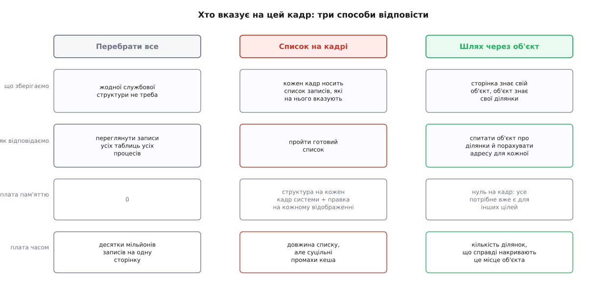
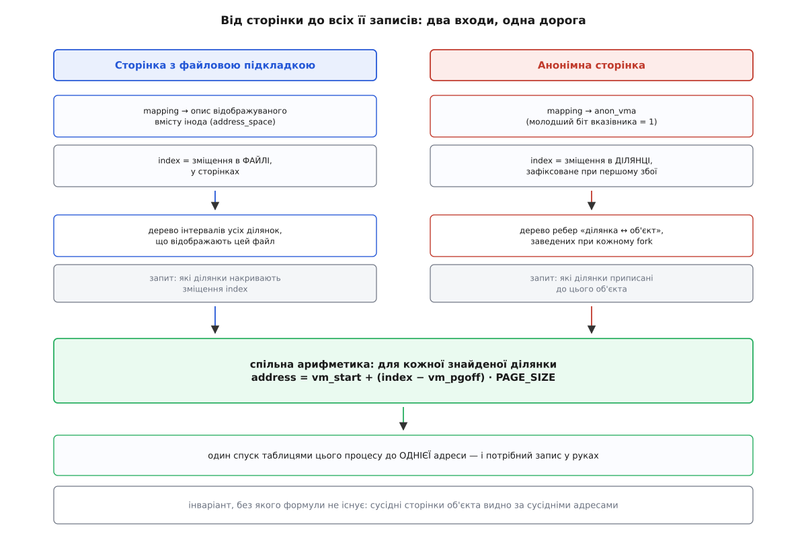
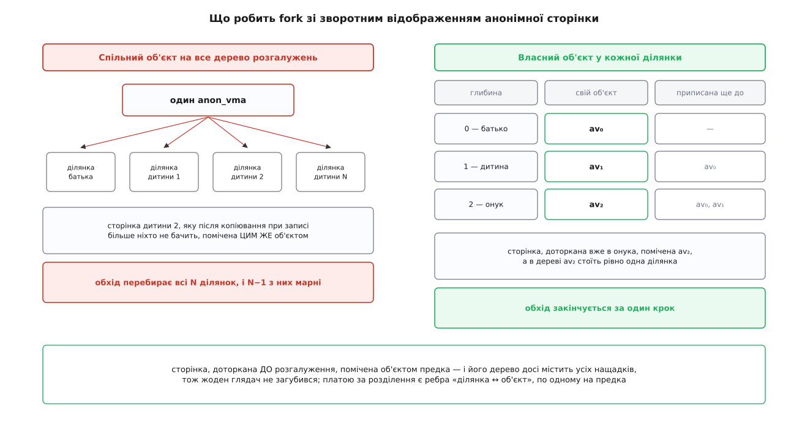

# Зворотне відображення сторінки (rmap): як знайти всіх, хто на неї вказує

<preknowlist>
- [Сторінки, таблиці сторінок і MMU](book:unix-linux/paging-and-mmu) — відповідність «віртуальна сторінка → фізичний кадр» лежить у таблицях, які читає апаратура, і читає вона їх лише в один бік.
- [Віртуальний адресний простір процесу](book:unix-linux/virtual-address-space) — простір складається з ділянок; кожна має свій початок, довжину, права й походження.
- [Сторінковий збій](book:unix-linux/page-fault) — коли чинного запису в таблиці немає, апаратура зупиняє інструкцію й віддає керування ядру.
- [mmap: файл і пам'ять як одне](book:unix-linux/mmap-model) — ділянка може відображати шматок файлу, починаючи з деякого зміщення в ньому.
- [Inode: файл без імені](book:unix-linux/inode-model) — вміст файлу належить іноду, а не імені; кеш сторінок висить саме на іноді.
- [fork](book:unix-linux/fork-semantics) — нащадок дістає копію адресного простору того, хто його викликав.
- [Копіювання при записі](book:unix-linux/copy-on-write) — після `fork` батько й дитина деякий час дивляться в **той самий** фізичний кадр.
- [Свопінг і витіснення сторінок](book:unix-linux/swap-and-reclaim) — щоб забрати кадр, ядро мусить спершу прибрати його з усіх таблиць, які на нього вказують.
</preknowlist>

Ядро обрало фізичний кадр — скажімо, щоб віддати його комусь іншому. У руках у ядра номер цього кадру й більш нічого. Просто взяти й записати кадр у вільний пул не можна: доки хоч один процес має чинний запис таблиці сторінок, що вказує сюди, він будь-якої миті може покласти в цей кадр байт звичайною машинною інструкцією — і байт ляже в пам'ять, яку вже віддали іншому. Отже, перед звільненням треба знайти **всіх, хто на цей кадр указує**, і прибрати їхні записи.

Питання виглядає симетричним до звичайного перекладу адрес, а насправді воно протилежне за напрямком — і саме тому дороге.

## Довідник, що гортається лише вперед

Таблиця сторінок — це відображення «номер віртуальної сторінки → номер фізичного кадру». Апаратура ходить нею згори вниз, розбираючи адресу на індекси рівнів; ключ — адреса, значення — кадр. Оберненого входу немає: за номером кадру таблиця не шукається, бо в ній немає ні впорядкування за кадрами, ні бодай списку, де які кадри трапляються.

Технічно відповідь здобути можна: перебрати всі записи всіх таблиць усіх процесів і подивитися, у котрих стоїть цей кадр. Порахуймо, скільки це коштує.

**Умова.** Двісті процесів, у кожного відображено по 1 ГіБ, сторінка 4 КіБ. Шукаємо всіх, хто вказує на один конкретний кадр.

```
записів на процес     =  1 ГіБ / 4 КіБ              =  262 144
записів усього        =  262 144 · 200              =  52 428 800
ціна перегляду запису ≈  2 нс   (це оптимістично: доступ здебільшого повз кеш)
час на ОДНУ сторінку  ≈  52 428 800 · 2 нс          ≈  0.105 с
щоб звільнити 100 МіБ =  25 600 сторінок · 0.105 с  ≈  45 хв
```

Сорок п'ять хвилин на сто мегабайтів — це не «повільно», це «не працює». А витіснення відбувається не раз на день, а тисячами сторінок на секунду під тиском пам'яті. Отже, обернене відображення мусить існувати як окремий, заздалегідь підготовлений механізм. Його й називають **зворотним відображенням** (англ. *reverse mapping*, у коді ядра — `rmap`).

## Не зберігати відповідь, а зберігати шлях до неї

Перше, що спадає на думку: якщо перебір дорогий, збережімо готову відповідь. Хай кожен фізичний кадр носить список усіх записів таблиць, які на нього вказують; при відображенні сторінки додаємо елемент, при знятті — прибираємо. Саме так зворотне відображення вперше й потрапило в Linux.

За це доводиться платити тричі. Пам'яттю: службова структура на **кожен** кадр системи, а кадрів на машині мільйони. Роботою на гарячому шляху: кожен `fork`, кожен збій сторінки, кожен `munmap` тепер ще й правлять списки. І найгірше — локальністю: список елементів, розкиданих по всій пам'яті, обходиться суцільними промахами кеша, тобто повільно навіть тоді, коли він короткий.

Вихід знайшовся в іншій постановці питання. Обернене відображення не обов'язково **зберігати** — його можна щоразу **обчислювати**, якщо є короткий шлях від сторінки до потрібних ділянок. А такий шлях є, і він уже й так лежить у системі, бо система й без rmap мусить знати, звідки береться вміст сторінки.

Сторінка завжди належить якомусь **об'єктові**: сторінка кешу — файлові, анонімна — тій сукупності ділянок, що ділять між собою одну купу чи один стек. Об'єкт знає всі ділянки, які його відображають, — бо в момент відображення ділянка сама до нього записалася. А ділянка знає, за якою адресою в ній лежить задане зміщення об'єкта, — бо відображення лінійне. Отже, ланцюжок «сторінка → об'єкт → ділянки → адреси → записи таблиць» дає ту саму відповідь, не тримаючи жодного списку на кадр.

Ця ідея зветься **об'єктним зворотним відображенням** (англ. *object-based rmap*, звідси `objrmap`), і запропонував її 2003 року Дейв Маккракен з IBM — спершу лише для сторінок із файловою підкладкою. Як механізм добудували для анонімної пам'яті — окрема історія, [з двома конкурентними реалізаціями й одним важким наслідком](book:unix-linux/reverse-mapping/hist-anon-vma-war.md). *(Доказовий статус: авторство objrmap і рік — за публікаціями LWN і доповіддю на Ottawa Linux Symposium 2004.)*



*Ціна першого способу — час на кожен запит, другого — пам'ять на кожен кадр і робота на кожному відображенні. Третій платить лише за обхід тих ділянок, які справді накривають потрібне місце об'єкта.*

## Формула, на якій усе тримається

Уся конструкція зводиться до одного обчислення. Ділянка `vma` починається з віртуальної адреси `vm_start` і відображає об'єкт із його зміщення `vm_pgoff` (у сторінках). Сторінка об'єкта має власне зміщення `index`. Тоді адреса, за якою ця сторінка видна в цій ділянці:

```
address = vm_start + (index − vm_pgoff) · PAGE_SIZE
```

**Умова.** Сторінка кешу файлу зі зміщенням `index = 500` (тобто 500 · 4 КіБ = 2 МіБ від початку файлу). Ділянка: `vm_start = 0x7f2a4c000000`, `vm_pgoff = 480`, довжина 64 сторінки.

```
index − vm_pgoff    =  500 − 480                    =  20 сторінок
зміщення в ділянці  =  20 · 4096                    =  81 920  =  0x14000
address             =  0x7f2a4c000000 + 0x14000     =  0x7f2a4c014000
перевірка меж       =  20 < 64                      →  адреса всередині ділянки
```

Далі лишається пройти таблицями цього процесу до **однієї** адреси й дістати потрібний запис. Замість перебору мільйонів записів — арифметика на два рядки й один прохід чотирма рівнями таблиць.

Формула працює, доки виконано мовчазний договір: відображення **лінійне**, тобто сусідні сторінки об'єкта видно за сусідніми адресами. Договір цей не самоочевидний, і в Linux колись існував системний виклик, який його ламав: `remap_file_pages` дозволяв усередині однієї ділянки поставити сторінки файлу в довільному порядку. Такі «нелінійні» відображення вимагали окремого біта в записі таблиці, окремої гілки коду в гарячих місцях, а зворотний обхід для них узагалі не мав формули — доводилося переглядати всю ділянку. У 3.16 справжню реалізацію викинули, замінивши виклик повільною емуляцією через окремі ділянки, а в 4.0 з ядра прибрали й решту коду нелінійних відображень: за нелінійність платили всі, а користувалися нею одиниці. Інваріант лінійності виявився ціннішим за можливість його порушувати.

## Файлова сторінка: об'єкт уже є

Для сторінки, за якою стоїть файл, вигадувати об'єкт не треба. Кожен інод має структуру опису відображуваного вмісту (`struct address_space`) — це і є той об'єкт: у ньому живе кеш сторінок файлу, і в ньому ж ядро тримає перелік усіх ділянок, які цей файл відображають. Сторінка вказує на свій об'єкт полем `mapping`, а своє місце в ньому знає полем `index` — зміщення в файлі, у сторінках.

Перелік ділянок — не список, а **дерево інтервалів** (поле `i_mmap`). Причина проста: ділянка накриває не точку, а відрізок зміщень файлу, а питання ставиться про точку — «які ділянки накривають зміщення 500?». Список довелося б перебирати цілком, а `libc.so` на живій системі відображено сотнями процесів, і кожен має по кілька ділянок під різні шматки файлу. Дерево інтервалів відповідає на таке питання за час, пропорційний глибині дерева плюс кількість справжніх відповідей: [структура, що зберігає відрізки й уміє швидко перелічити ті з них, які накривають задану точку](book:algorithms/interval-tree). До ядра 3.7 тут стояла інша структура — «дерево пріоритетів»; її замінили на червоно-чорне дерево з доповненням, бо звичайне збалансоване дерево виявилося і швидшим, і простішим.

Тому обхід файлової сторінки виглядає так: узяти `mapping`, узяти `index`, спитати дерево про всі ділянки, що накривають це зміщення, і для кожної порахувати адресу за формулою. Кожна знайдена ділянка знає свій процес, а процес — свій корінь таблиць сторінок; далі один спуск до конкретного запису.

## Анонімна сторінка: об'єкт довелося вигадати

З анонімною пам'яттю ця схема спершу не працює: файлу немає, інода немає, зачепитися нема за що. Але спільність є — після `fork` той самий кадр видно в батька й у всіх нащадків, і кожен бачить його за своєю адресою. Отже, об'єкт потрібен, а взяти його нізвідки.

Його й завели штучно: `struct anon_vma` — порожня всередині структура, чия єдина робота полягає в тому, щоб бути спільною точкою збору для ділянок, які ділять анонімні сторінки. Народжується вона ліниво, при першому збої в анонімній ділянці, і живе рівно доти, доки на неї хтось посилається.

Сторінка вказує на свій `anon_vma` тим самим полем `mapping`, що й файлова — на `address_space`. Розрізняють ці два випадки молодшим бітом вказівника: структури вирівняні, тож молодші біти в адресі однаково нульові, і ядро вживає їх як прапорці — `PAGE_MAPPING_ANON` = 1 означає «тут не інод, а `anon_vma`». Коли ввімкнено обидва молодші біти, це третій випадок: сторінка під керуванням [механізму злиття однакових сторінок](book:unix-linux/ksm-page-merging), і `mapping` веде до його власної структури зі своїм списком користувачів. Один і той самий байт відповіді — три різні світи за ним.

Поле `index` в анонімної сторінки теж є, тільки означає воно зміщення не в файлі, а в ділянці, зафіксоване в мить першого збою. Це зроблено рівно для того, щоб та сама формула працювала без винятків: об'єкт інший, координати ті самі.

*(Уточнення до термінології: у сучасних ядрах ці поля належать не окремій сторінці, а `folio` — набору з однієї чи кількох суміжних сторінок, який ядро веде як одне ціле. Для механізму зворотного відображення це нічого не міняє, тому далі кажемо просто «сторінка».)*



*Різниця лише в тому, звідки береться об'єкт і що означає index. Далі обидва шляхи сходяться в одну арифметику й один спуск таблицями.*

## Що ламає fork і чим це полагодили

Спільна точка збору мусить лишатися спільною після `fork`: сторінка, доторкана батьком до розгалуження, тепер видна ще й у дитини, і зворотний обхід зобов'язаний привести до обох. Найпростіше рішення — записати ділянку дитини в той самий `anon_vma`, що й у батька. Саме так і зробили спочатку.

Наслідок цього рішення виліз на серверних навантаженнях. Батько розгалужується тисячу разів; усі тисяча ділянок нащадків висять на одному `anon_vma`. Далі кожен нащадок пише у свої сторінки, копіювання при записі дає кожному власний кадр — і на цьому спільність фактично закінчується: мільйон свіжих кадрів, кожен відображений рівно в **одному** процесі. Але `anon_vma` в них спільний, бо його успадкували від батька. Обхід одного такого кадру перебирає тисячу ділянок, для кожної рахує адресу й лізе в таблиці сторінок — і в 999 випадках із 1000 не знаходить нічого. І весь цей марний перебір іде під замком об'єкта, за яким стоять черги інших процесорів.

Розв'язок Ріка ван Ріла, що ввійшов у ядро 2.6.34 (2010), тримається на розрізненні двох речей, які доти злилися в одну: **де сторінка народилася** й **хто на неї може дивитися зараз**. Кожна нова ділянка дістає **власний** `anon_vma` — туди підуть сторінки, доторкані після розгалуження. Але сама ділянка додатково приписується до `anon_vma` всіх своїх предків — через маленькі проміжні структури `struct anon_vma_chain`. Кожна така структура — це одне ребро «ділянка ↔ об'єкт»: вона стоїть у списку ділянки (`same_vma`) і водночас у дереві інтервалів того `anon_vma`, до якого причіпляє.

Тепер обидва питання мають дешеву відповідь. Сторінка, доторкана до `fork`, помічена батьковим `anon_vma` — а в його дереві є всі нащадки, тож обхід знайде кожного, хто справді може її бачити. Сторінка, що народилася в дитини після `fork`, помічена **її** `anon_vma`, у чиєму дереві стоїть одна ділянка, — обхід закінчується за один крок. Марний перебір зник не тому, що структуру пришвидшили, а тому, що питання розділили.

Ціна нової схеми — самі ребра. Ділянка глибини `d` у дереві розгалужень тримає `d + 1` структуру: по одній на кожного предка й одну на себе. Вироджений випадок — довгий ланцюжок, де кожен процес породжує наступного.

**Умова.** Ланцюжок із 1000 послідовних `fork`, одна анонімна ділянка, структура ребра ≈ 64 Б.

```
ребер у ділянки глибини d  =  d + 1
усього ребер               =  1 + 2 + … + 1000  =  1000 · 1001 / 2  =  500 500
пам'ять під ребра          ≈  500 500 · 64 Б    ≈  31 МіБ
```

Квадратичне зростання на порожньому місці — і воно свого часу спливало як звіт про необмежений ріст службових кешів ядра при повторних розгалуженнях. Тому в структуру `anon_vma` додали облік форми дерева — у чинних ядрах це два лічильники, скільки в неї нащадків і скільки живих ділянок; коли предків об'єкт лишився без власних ділянок і має менше двох нащадків, ядро віддає його нащадкові замість заводити новий. Вироджений ланцюжок від цього перестає рости, а розгалужене дерево процесів працює як раніше. *(Доказовий статус: поля `num_children` і `num_active_vmas` і саме правило повторного вжитку — з чинного коду `mm/rmap.c`; точний розмір структури залежить від конфігурації ядра, 64 Б — оцінка порядку.)*



*Ліворуч обхід сторінки, що живе в одному процесі, перебирає всі ділянки дерева розгалужень. Праворуч кожна ділянка має свій об'єкт, а ребра ведуть лише вниз від того місця, де сторінку доторкали.*

## Один обхід, багато справ

Знайти всіх — половина роботи; друга половина в тому, **що з кожним знайденим зробити**. І тут виявляється, що всі споживачі зворотного відображення різняться саме цим і більше нічим.

Тому в ядрі стоїть один загальний обхід, `rmap_walk`, а те, що робиться з кожним знайденим записом, передають йому зворотним викликом:

```c
struct rmap_walk_control {
    void *arg;
    bool (*rmap_one)(struct folio *folio, struct vm_area_struct *vma,
                     unsigned long addr, void *arg);
    int  (*done)(struct folio *folio);
    /* … службові поля: як брати замок, які ділянки пропускати … */
};

void rmap_walk(struct folio *folio, struct rmap_walk_control *rwc);
```

Обхід сам розбирає, який перед ним об'єкт — інод, `anon_vma` чи структура злитих сторінок, — бере потрібний замок і для кожної знайденої пари «ділянка, адреса» кличе `rmap_one`. Різні `rmap_one` дають різні механізми системи:

- **витіснення** прибирає записи й ставить на їхнє місце позначку свопу, щоб наступне звернення привело в обробник збою й повернуло вміст;
- **перенесення сторінки** — при [ущільненні пам'яті](book:unix-linux/physical-page-allocator), балансуванні між вузлами NUMA чи гарячому вилученні планки — ставить тимчасові позначки перенесення, копіює вміст у новий кадр і другим обходом переписує записи на нього; процес нічого не помічає, бо його віртуальні адреси не змінилися;
- **старіння** збирає з усіх записів апаратний біт звернення й скидає його: скільки різних відображень торкалися сторінки, стільки й свідчень, що вона потрібна;
- **підготовка до зворотного запису** знімає біт запису в **усіх** записах одразу, щоб наступний запис у будь-якому з процесів дав збій і сторінку знову позначили брудною — без цього [скидання вмісту на диск](book:unix-linux/page-cache-durability) не мало б способу дізнатися, що дані знову змінилися;
- **обробка апаратної помилки пам'яті** знаходить усіх, кому належить збійний кадр, і б'є сигналом саме по них, не чіпаючи решту системи.

Жоден із цих механізмів не має власного способу шукати — усі беруть той самий обхід. Це і є справжня віддача об'єктної схеми: спільна дорога, різний вантаж.

> 🔧 **Навіщо це.** Коли на бойовій машині під тиском пам'яті стрибає затримка, звична підозра падає на диск, а справжня причина часто інша: обхід зворотних відображень тримає замок об'єкта, поки перебирає його ділянки. Довгі обходи родяться в трьох місцях — тисячі процесів, що відображають один великий файл; глибокі дерева розгалужень; агресивне злиття однакових сторінок. Кожне з цього лікується по-своєму (менше ділянок на файл, [великі сторінки](book:unix-linux/huge-pages) замість мільйонів дрібних, стеля на кількість користувачів злитого кадру), але спершу треба впізнати сам симптом: час іде не в очікування вводу-виводу, а в системний час під замком.

## Замки, перегони й ціна довгого списку

Обхід ходить чужими структурами, які просто зараз можуть розвалюватися під руками. Найгостріший випадок — останній, хто відображав сторінку, знімає своє відображення саме тоді, коли ми йдемо за її `mapping`: об'єкт стає нікому не потрібним і звільняється, а ми тримаємо на нього вказівник.

Ядро закриває це трьома засобами. Сторінку на час обходу зазвичай тримають під її власним замком, тож нові відображення не з'являються. Об'єкт анонімної пам'яті має лічильник посилань, і обхід спершу піднімає його, а вже потім ходить деревом. А сама пам'ять під `anon_vma` береться з кеша, що звільняє об'єкти [з відстрочкою й без перевикористання типу](book:unix-linux/rcu-read-copy-update): навіть якщо ми прочитали вказівник на структуру, яку в цю мить звільнили, за адресою лежатиме структура **того самого типу**, і повторна перевірка після взяття замка чесно скаже, що об'єкт уже не наш.

Порядок замків тут жорсткий і однаковий для всієї підсистеми: замок адресного простору процесу → замок об'єкта зворотного відображення (дерева ділянок інода або `anon_vma`) → замок таблиці сторінок. Порушення цього порядку в будь-якому місці ядра дає взаємне блокування, тому обхід ніколи не бере замки в зворотний бік — він або дістає потрібний, або чесно відступає й повертає «не вдалося».

Звідси випливає найважливіший практичний наслідок усього механізму. Обхід іде **під замком об'єкта**, а довжина обходу дорівнює кількості ділянок, приписаних до цього об'єкта. Отже, будь-який прийом, що збільшує спільність сторінок, робить дорожчою кожну операцію з фізичною пам'яттю. Саме тому [злиття однакових сторінок](book:unix-linux/ksm-page-merging) ставить стелю на кількість користувачів одного кадру й свідомо тримає в пам'яті кілька копій однакових байтів: краще трохи більше пам'яті, ніж обхід на десять тисяч кроків під замком.

## Коли обхід не потрібен зовсім

Найдешевший обхід — той, якого не було. Тому поруч зі списками ядро тримає просте число: **лічильник відображень** сторінки. Він відповідає на питання «скільки», а не «хто», і оновлюється тими самими функціями, що додають і знімають відображення.

Різниця в ціні між цими двома питаннями величезна, і ядро її експлуатує на кожному кроці. Найяскравіший приклад — той самий збій запису в сторінку, спільну після розгалуження. Якщо лічильник каже, що відображення одне-єдине, копіювати нічого не треба: ніхто інший цю сторінку не бачить, тож достатньо повернути право запису в наявний запис таблиці. Класична пара «розгалужився й одразу викликав `exec`» саме тому й дешева: щойно дитина кинула успадкований простір, батькові збої запису знову бачать лічильник, що дорівнює одиниці, — і копіювання не відбувається. Той самий лічильник лежить в основі [чесного обліку спільної пам'яті](book:unix-linux/memory-accounting), де кожен кадр ділиться між своїми користувачами порівну.

Ще далі пішло старіння сторінок. Обхід зворотних відображень збирає біти звернення точно, але ходить по пам'яті стрибками — від сторінки до розкиданих ділянок і назад. Механізм старіння з поколіннями, що з'явився в ядрі 6.1, для збору звернень **сканує таблиці сторінок уперед**, послідовно, бо так локальність доступу незрівнянно краща. Обернений напрямок при цьому нікуди не зник: він потрібен у мить, коли конкретну сторінку треба справді зняти. Розділилися ролі — не «хто дивиться взагалі», а «хто дивиться саме на цю».

Побачити обидва боки можна й без ядерного коду: `/proc/<pid>/pagemap` перекладає віртуальну адресу процесу у фізичний кадр, а `/proc/kpagecount` каже, скільки відображень має кадр із заданим номером. Маючи обидва файли, зворотне відображення системи будується вручну, у просторі користувача — [програмою, що за номером фізичного кадру знаходить усі процеси й адреси, за якими він видний](book:unix-linux/reverse-mapping/proj-who-maps-this-page.md).

Пряме відображення в системі одне й належить апаратурі: процесор мусить за адресою знайти кадр, інакше програма не виконається. Обернене відображення апаратурі не потрібне взагалі — воно існує тільки тому, що ядро розпоряджається фізичною пам'яттю й мусить забирати назад те, що роздало. Тому воно й побудоване не як дзеркало таблиць, а як спосіб дійти до них із другого кінця; і кожен механізм, що дає одному кадру більше глядачів, — копіювання при записі, спільні бібліотеки, злиття однакових сторінок — платить за свою вигоду саме тут, на зворотному боці. Точний перелік структур, полів і функцій, з яких цей бік складено, — [окремою довідкою](book:unix-linux/reverse-mapping/api-rmap-interfaces.md).
