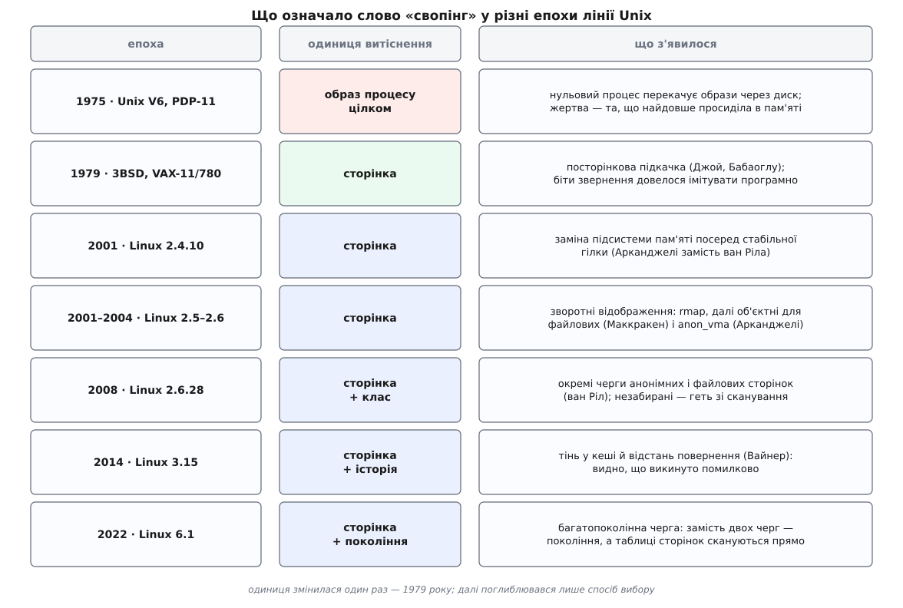

# 📜 Як своп у Unix перетворився з перекачування процесів на відбір сторінок

Слово «свопінг» у сучасному Linux означає геть не те, що воно означало в Unix, який його вжив першим. Спершу це справді був **обмін** — образ процесу цілком їхав на диск і цілком вертався назад. Сторінок у цьому механізмі не було взагалі. Нинішнє витіснення працює зовсім інакше: одиниця обміну — окрема сторінка, і жоден процес не буває «на диску» повністю. Назва пережила механізм, який її породив, — і разом із назвою пережили кілька структур, файлів і ручок, які зараз описують геть інші речі, ніж описували, коли їх називали. Ця історія — про те, як саме сталася підміна.

## Спадок, який Unix застав готовим

Ідея, що адреса в програмі не мусить бути адресою в пам'яті, а сторінку можна дотягти з диска в мить звернення, з'явилася задовго до Unix і поза його лінією: машина Atlas у Манчестері наприкінці 1950-х, теорема Беладі про недосяжний ідеальний вибір жертви, робочий набір Деннінга. Ці сюжети розказані окремо — [народження віртуальної пам'яті на машині Atlas](topic:programming/virtual-memory/hist-atlas.md) і [звідки взялися політики витіснення](topic:programming/cache-eviction-policies/hist-paging-origins.md); переказувати їх тут немає сенсу.

Важливо інше: коли Unix народжувався, усе це вже було відомим, опублікованим і навіть реалізованим у чужих системах — а Unix десять років ним не користався. Не з незнання. Просто заліза, на якому це має сенс, у нього під руками не було.

## Нульовий процес на PDP-11

Машина, на якій Unix виріс, давала процесові шістнадцятибітну адресу — шістдесят чотири кілобайти простору. Апаратура вміла переносити й захищати кілька великих суцільних шматків, тобто відповідати на питання «де в фізичній пам'яті лежить цей шматок і чи можна в нього писати». Питання «а що робити, коли шматка немає взагалі, і як після цього доробити перервану інструкцію» вона в зручному вигляді не ставила й не розв'язувала.

З цього випливає все. Якщо не можна впіймати звернення до відсутньої сторінки й спокійно продовжити з того самого місця, то підкачки на вимогу не буде. Лишається інший спосіб дати кільком процесам більше пам'яті, ніж у машині є: тримати в пам'яті не всіх одразу. Процес, який зараз не працює, виганяють на диск **повністю**, суцільним шматком, і повністю вертають, коли надійде його черга.

Займався цим окремий процес — нульовий, той самий, що й досі числиться в кожній Unix-подібній системі під номером 0 і зветься `swapper` або `sched`. У шостій редакції Unix його головний цикл описано в джерелах одним абзацом, який не потребує коментаря: подивитися, чи хтось хоче в'їхати; виганяти процеси, доки не звільниться місце; в'їхати; повторити (файл `slp.c`, функція `sched()` — первинне джерело, код доступний в архіві TUHS). Вибір жертви теж був простим і чесним: виганяли того, хто найдовше просидів у пам'яті, а вертали того, хто найдовше чекав надворі.

> 🔧 **Навіщо це.** Тут видно, звідки взялася сама назва. `swap` — це «обмін, підміна»: один процес виїжджає, інший на його місце в'їжджає, обмін відбувається цілими образами. У сучасному ядрі жодного обміну образами немає, а слово лишилося — і разом із ним нульовий процес, який нині взагалі нічого не перекачує, а просто нидіє, коли процесорові нема чого робити.

Ціна цієї схеми очевидна й нікого тоді не бентежила: щоб процес зробив один крок, треба перевезти через диск усе, що йому належить, разом із тим, чого він у цьому кроці не торкнеться. При розмірах програм у десятки кілобайт це було стерпно. Питання ставало гострим рівно тоді, коли адресний простір ставав великим.

## VAX, 1979: сторінка як одиниця — і біти, яких не було

Простір став великим 1978 року, коли Unix перенесли на VAX — тридцятидвобітну машину DEC зі справжньою сторінковою апаратурою. Порт назвали UNIX/32V, і головне про нього в цьому сюжеті таке: **можливостями віртуальної пам'яті VAX він не користався**. Тобто програма мала величезний простір адрес, а система поводилася з нею так само, як з програмою на PDP-11, — тримала образ у пам'яті цілком.

Виправили це в Берклі. Ядро 32V значною мірою переписали, вбудувавши реалізацію віртуальної пам'яті, яку зробив аспірант Озалп Бабаоглу (тур. *Özalp Babaoğlu*, народився 1955 року в Анкарі, турецько-американський науковець) разом із Біллом Джоєм (англ. *Bill Joy*). Готову систему — нове ядро плюс перенесені утиліти — випустили наприкінці 1979 року під назвою 3BSD; її ж називали Virtual VAX/UNIX або просто VMUNIX, «Unix із віртуальною пам'яттю». Ім'я файлу ядра `vmunix` дожило в BSD-системах до наших днів, і воно теж пам'ятка саме цієї події. *(Доказовий статус: підтверджено загальноприйнятими описами історії BSD; авторство пари Джой — Бабаоглу засвідчене і в біографічних джерелах.)*

Тут і сталася підміна, заради якої написано цю вставку. Одиниця витіснення перестала бути процесом і стала сторінкою. Механізм змінився цілком — а назва не змінилася зовсім. Область на диску, куди тепер відкладали окремі сторінки, лишилася «областю свопу», операцію лишили «свопінгом», і навіть старий перекачувач цілими образами нікуди не подівся: у BSD він працював далі, як крайній захід на випадок, коли посторінкового відбору вже не вистачає.

Цікава й технічна складність, яку довелося обійти. Щоб вибирати жертву не навмання, треба знати, до яких сторінок останнім часом зверталися. Апаратура зазвичай веде це сама — ставить біт звернення в записі таблиці сторінок. Апаратура VAX бітів звернення на сторінку **не мала**. Їх довелося імітувати програмно: періодично знімати чинність запису, ловити збій на першому ж дотику й на цьому збої відзначати, що сторінкою користуються. Тобто сама відсутність біта змусила побудувати перший у лінії Unix механізм «другої нагоди» — той самий, з якого виросли всі подальші черги активних і неактивних сторінок; про сімейство цих правил вибору — [політики витіснення: LRU, LFU, CLOCK](topic:programming/cache-eviction-policies).

*Одиниця витіснення змінилася один раз — 1979 року; усе подальше поглиблювало не одиницю, а спосіб вибору.*

## Linux: криза 2.4 і заміна двигуна посеред стабільної гілки

Далі лінія роздвоюється, і Linux іде своєю дорогою — не успадкувавши код BSD, але успадкувавши всю термінологію разом із самим словом.

Ядро 2.4 вийшло 4 січня 2001 року й мало бути стабільною гілкою: у моделі розробки тих часів [непарний номер означав розробку, парний — стабільність](topic:unix-linux/kernel-release-model), і в стабільній гілці правлять помилки, а не переробляють підсистеми. Підсистема віртуальної пам'яті, яку вів Рік ван Ріл (нідерл. *Rik van Riel*), у 2.4 працювала кепсько — під тиском пам'яті система вела себе непередбачувано.

Андреа Арканджелі (італ. *Andrea Arcangeli*) вирішив, що латками тут не обійтися, і написав заміну — простішу, без старіння сторінок і решти механіки попередньої версії. Лінус узяв її не в наступну гілку, а прямо в стабільну: 23 вересня 2001 року вийшло 2.4.10, і в ньому підсистема пам'яті була вже інша. Реакція розробників була відповідна. Ендрю Мортон (англ. *Andrew Morton*) зауважив, що кількість людей, які розуміють VM Linux, «упала з десятка до одного з невеликим»; ван Ріл висловився про спосіб ухвалення рішення набагато різкіше. Користувачі, втім, майже одностайно доповідали, що саме свопові біди попередніх 2.4 нарешті зникли. *(Доказовий статус: дата й зміст релізу підтверджені сучасними подіям звітами LWN; цитати наведено за тими самими звітами.)*

Цей епізод варто пам'ятати не заради драми. Він показує реальну вагу теми: витіснення — це та частина ядра, де правильна відповідь не виводиться з перших принципів, а вимірюється на живих навантаженнях, і де «просто полагодити» іноді виявляється дорожчим, ніж переписати.

## Хто дивиться на цю сторінку: зворотні відображення

У 2.4 була вада, спільна для обох суперників, і саме вона визначила наступні три роки. Щоб забрати сторінку, треба зняти **всі** записи в **усіх** таблицях, які на неї вказують. Таблиці ведуть у один бік — від віртуальної адреси до фрейму, — тож 2.4 йшло єдиним доступним шляхом: обходило таблиці процес за процесом і знімало записи для тих сторінок, які виглядали годящими жертвами. Якщо за один прохід щастило знайти всі записи — сторінку можна викидати. Якщо ні — праця пропала.

Розв'язок назвали зворотним відображенням (англ. *reverse mapping*, скорочено rmap) і влили в гілку розробки 2.5. Кожна фізична сторінка почала носити список записів таблиць, які на неї вказують; знайти всіх охочих стало миттєвою справою. Ідея належала гуртові навколо ван Ріла, який вів набір латок з цією назвою. *(Доказовий статус: факт злиття rmap у 2.5 саме заради витіснення підтверджено звітом LWN; персональне авторство першої реалізації в перевірених джерелах названо менш однозначно.)*

Ціна виявилася зависокою. Список на кожну сторінку — це пам'ять, яку треба десь узяти, і робота при кожному `fork`, коли сторінка миттю набуває десяток нових спостерігачів; про те, чому після `fork` сторінка одразу спільна, — [копіювання при записі](topic:unix-linux/copy-on-write).

Вихід знайшов Дейв Маккракен (англ. *Dave McCracken*): у лютому 2003 року він запропонував **об'єктне** зворотне відображення. Для файлової сторінки списки не потрібні взагалі — від сторінки є інший шлях до записів таблиць: файл знає всі ділянки, які його відображають, а ділянка знає свій процес і своє зміщення. Тобто зворотний зв'язок не зберігають, а щоразу обчислюють — дорожче на одну операцію, зате безкоштовно в спокої.

Анонімні сторінки файлу не мають, тож для них такого шляху не існувало — його довелося збудувати. У березні 2004 року Арканджелі, спираючись на задум Маккракена, вніс структуру `anon_vma`: список ділянок, які після розгалуження процесів разом покривають усі посилання на анонімну сторінку. Мотив був цілком практичний — дотягти 32-бітні системи до тридцяти двох гігабайтів пам'яті, де старі списки просто не вміщалися в нижню пам'ять. Обидві половини — файлова від Маккракена й анонімна від Арканджелі — і є та схема, за якою ядро шукає спостерігачів сторінки досі.

## Дві черги замість однієї: 2.6.28

Наступний крок стосувався не пошуку, а вибору. Доти всі сторінки лежали в спільних чергах, хоча ціна їх забрати різниться в рази: чиста файлова сторінка викидається задарма, анонімна вимагає запису у своп, а прибита `mlock` не забирається взагалі й лише марно траплялася сканеру знову й знову.

Набір латок, що розділив черги на анонімні й файлові та виніс незабирані сторінки геть зі сканування, вів Рік ван Ріл; улітку 2008 року LWN описував його як роботу в процесі, а 24 грудня 2008 року він приїхав у ядро 2.6.28. Відтоді питання «кого забрати» розпалося на два: спершу — скільки брати з якого класу, і аж тоді — кого саме всередині класу.

## Тінь у кеші: виявлення повернень, 3.15

Черги вміли відповідати, до чого не зверталися, і не вміли відповісти на важливіше питання: чи не викидаємо ми те, що знадобиться за мить. Ці дві ситуації зсередини черги виглядають однаково.

Йоганнес Вайнер (нім. *Johannes Weiner*) запропонував залишати слід. Коли сторінка йде з пам'яті, її місце в кеші сторінок не звільняють цілком — там лишається **тінь**, крихітна позначка з номером покоління. Повернулася сторінка — відняли, дістали **відстань повернення**: скільки витіснень сталося за час її відсутності, тобто наскільки довшою мала б бути черга, щоб цієї втрати не сталося. LWN описав задум у травні 2012 року як ранню роботу; у ядро він увійшов у версії 3.15, що вийшла 8 червня 2014 року.

Значення цього кроку більше, ніж здається з опису. Доти система знала, скільки сторінок вона викинула, і не знала, скільки з них викинула **помилково**. Відтоді вона вміє відрізнити здорове прибирання мотлоху від самопоїдання — і це та єдина пара чисел, за якою взагалі можна судити, чи шкодить своп на конкретній машині.

## Багатопоколінна черга: 6.1

Останній поки що поворот зробив коло. Ю Чжао (кит. *Yu Zhao*) з Google виклав 13 березня 2021 року набір латок, який замість двох черг заводить кілька поколінь сторінок за віком — і, головне, шукає звернення інакше: не йде від фізичної сторінки через зворотні відображення, а **сканує таблиці сторінок напряму**, бо так краща локальність доступу. У ядро 6.1, що вийшло 11 грудня 2022 року, це прийняли як окремий, увімкнений за вибором механізм, поруч зі старим.

Тобто обхід таблиць процесів, від якого 2.5 тікало як від головної вади 2.4, повернувся — на машинах із десятками й сотнями гігабайтів він знову виявився дешевшим за списки на кожну сторінку. Це не відкат: rmap лишився там, де без нього не обійтися, — коли треба зняти конкретну сторінку. Змінилося те, для чого його не варто вживати.

## Що з цього лишилося в іменах

Пройдімо назвами, які щодня трапляються під руками, і подивімося, що кожна означає насправді.

**Область свопу** — це вже не місце, куди складають образи процесів. Туди складають окремі анонімні сторінки, і жоден процес там не буває цілим. Розділ свопу як окремий пристрій — теж пам'ятка тих часів, коли перекачувати треба було суцільний образ і суцільне місце під нього мало бути готове заздалегідь.

**Нульовий процес** нічого не перекачує вже понад сорок років. Він лишився в системі як гілка, що виконується, коли процесорові нема чого робити, — і в Linux його потоки й досі звуться `swapper/0`, `swapper/1` і так далі.

**`swappiness`** — ручка, назва якої обіцяє керувати «схильністю свопити», — насправді задає початкову пропорцію тиску між анонімною й файловою чергами, тобто керує розділенням, якого не існувало до 2008 року.

І сам **свопінг** у розмові про сучасну систему майже завжди означає не обмін, а витіснення: одностороннє забирання окремих сторінок за їхньою вартістю повернення. Слово залишилося єдиною ниткою між механізмом, який виганяв процес цілком з машини на шістдесят чотири кілобайти, і механізмом, який зважує покоління сторінок на машині з терабайтом пам'яті. Спільного між ними — рівно стільки, скільки в слові.
