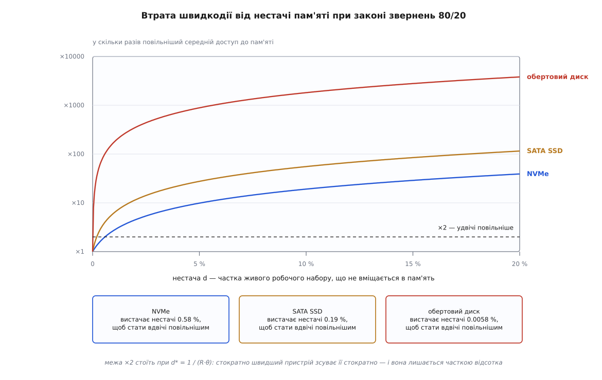
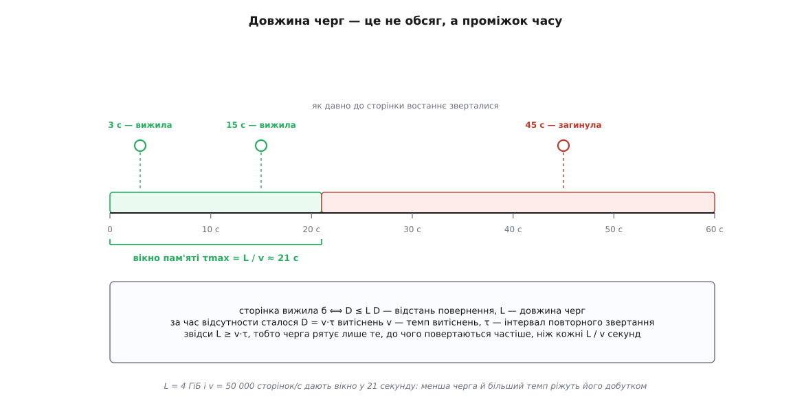
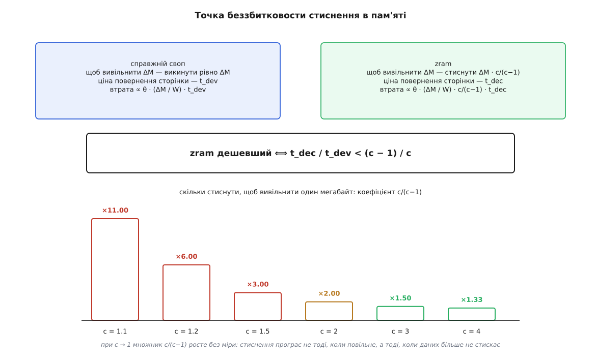

# 🧮 Арифметика обриву: скільки коштує кожен відсоток нестачі пам'яті

Тут пораховано чотири речі, які в розмовах про своп зазвичай називають на око: у скільки обходиться середній доступ до пам'яті при заданій частці збоїв, звідки в кривій втрат береться обрив замість плавного спуску, якої довжини має бути черга сторінок під заданий темп витіснень і за яких умов стиснення в пам'яті дешевше за справжній пристрій. Три з чотирьох відповідей упираються в те саме: обсяг пам'яті стоїть у показнику, а швидкість пристрою — у множнику або й під логарифмом, і саме тому пристроєм цю задачу не розв'язують.

## Пристрій увіходить одним числом

Хай частка `p` звернень до пам'яті закінчується великим збоєм — таким, що вимагає читання з пристрою. [Великий збій](book:unix-linux/page-fault) тим і відрізняється від дрібного, що дрібний ядро закриває сторінкою, яка вже є в пам'яті, а великий чекає на введення-виведення. Решта звернень, `1 − p`, обходиться самою пам'яттю. Середня ціна одного звернення:

```
T(p) = (1 − p)·t_ram + p·(t_ram + t_fault)
     = t_ram − p·t_ram + p·t_ram + p·t_fault   [розкриття дужок: (1 − p)·t_ram = t_ram − p·t_ram]
     = t_ram + p·t_fault                       [взаємне знищення доданків: −p·t_ram + p·t_ram = 0]
```

Доданок `p·t_ram` скоротився, і це не випадковість запису: збій не заміняє звернення до пам'яті, а додається до нього. Сторінку однаково доведеться прочитати з пам'яті після того, як її туди привезуть.

Поділивши на `t_ram`, дістаємо чисте сповільнення — у скільки разів середній доступ подорожчав:

```
S(p) = T(p) / t_ram                            [визначення відносного сповільнення]
     = (t_ram + p·t_fault) / t_ram            [підстановка T(p) = t_ram + p·t_fault]
     = 1 + p·(t_fault / t_ram)                 [ділення почленно: t_ram/t_ram + p·t_fault/t_ram]
     = 1 + p·R,     R = t_fault / t_ram        [позначення відношення затримок R = t_fault / t_ram]
```

Головне тут не сама формула, а те, що з неї видно: **пристрій увіходить у задачу рівно одним числом `R`** — у скільки разів збій дорожчий за звичайне звернення. Ні тип носія, ні ширина шини, ні глибина черги пристрою більше ніде не з'являються.

Одразу застереження про знаменник, без якого числа нижче нічого не важать. `t_ram ≈ 80 нс` — це затримка звернення, яке дійшло до мікросхем пам'яті, тобто промаху повз останній рівень кеша. Отже, `p` рахують не від усіх операцій програми — тих на порядки більше, і більшість закриває кеш, — а лише від звернень, що й так пішли по шину. Переплутати ці два знаменники означає помилитися в `p` у сотні разів.

```
                    t_fault        R = t_fault / t_ram
NVMe                100 мкс        100 000 нс / 80 нс = 1 250
SATA SSD            300 мкс        300 000 нс / 80 нс = 3 750
обертовий диск       10 мс      10 000 000 нс / 80 нс = 125 000
```

Тепер обернімо формулу: задамо втрату, яку згодні терпіти, і спитаймо, яка частка збоїв її дає. З `S = 1 + p·R` маємо `p = (S − 1)/R`.

```
допустима втрата     NVMe          SATA SSD      обертовий диск
                     R = 1250      R = 3750      R = 125000

+1 %  (S = 1.01)     8.0·10⁻⁶      2.7·10⁻⁶      8.0·10⁻⁸
+10 % (S = 1.1)      8.0·10⁻⁵      2.7·10⁻⁵      8.0·10⁻⁷
удвічі (S = 2)       8.0·10⁻⁴      2.7·10⁻⁴      8.0·10⁻⁶
у 10 разів           7.2·10⁻³      2.4·10⁻³      7.2·10⁻⁵
у 100 разів          7.9·10⁻²      2.6·10⁻²      7.9·10⁻⁴
```

Числа незвично малі, і саме тому їх варто прочитати навиворіт — не як частку, а як проміжок між збоями. На межі «удвічі повільніше» `p = 1/R`, тобто дозволено рівно один збій на `R` звернень. А сторінка на 4 КіБ — це 64 рядки кеша, тобто щонайбільше 64 звернення по шину, якщо пройти її наскрізь і жодного байта не взяти двічі:

```
межа «удвічі повільніше», перерахована в прочитані сторінки:

NVMe             1 250 / 64 ≈    20 сторінок (80 КіБ)   на один збій
SATA SSD         3 750 / 64 ≈    59 сторінок (236 КіБ)
обертовий диск 125 000 / 64 ≈ 1 950 сторінок (7.6 МіБ)
```

Ось справжній масштаб бюджету: на NVMe машина стає вдвічі повільнішою вже тоді, коли з пристрою доводиться підвозити одну сторінку на кожні двадцять прочитаних наскрізь. Бюджет мізерний — і тому наступне питання не про пристрій, а про те, як швидко `p` виростає до цих величин, коли пам'яті починає бракувати.

## Звідки береться обрив, а не плавний спуск

`S = 1 + p·R` — пряма, і сама по собі вона нічого різкого не обіцяє. Якби частка збоїв спадала з розміром пам'яті так само рівно, ніякого обриву не було б: забрали десять відсотків пам'яті — дістали на десять відсотків більше збоїв. Обрив береться з того, що програми ходять по своїй пам'яті вкрай нерівномірно, а нерівномірність треба записати числом.

Найпростіша модель, яка це вміє, — самоподібний закон 80/20. Хай `F(x)` буде часткою всіх звернень, що припадає на найгарячіші `x` сторінок (саме частку сторінок, не їх кількість). Умова «80 % звернень на 20 % сторінок» разом із вимогою, щоб той самий закон справджувався й усередині будь-якої гарячої частки, лишає єдину можливу форму — степеневу. Це той самий кістяк, що й у [законі Зіпфа](book:math/zipf-law), де частота спадає степенем рангу: мала частка об'єктів забирає більшість звернень, а хвіст лишається довгим і не порожнім.

```
F(x) = x^θ,   θ = ln 0.8 / ln 0.2 = (−0.22314) / (−1.60944) = 0.13865
```

Самоподібність тут не припущення, а наслідок форми, і його легко перевірити:

```
F(0.20)  = 0.20^0.13865  = 0.800     20 %   сторінок дають 80 % звернень
F(0.04)  = 0.04^0.13865  = 0.640      4 %   сторінок дають 64 %
F(0.008) = 0.008^0.13865 = 0.512      0.8 % сторінок дають 51 %
```

Показник `θ` і є мірою нерівномірності, причому в зручних межах. При `θ → 0` уся робота стискається в крихітне гаряче ядро; при `θ = 1` виходить `F(x) = x`, тобто звернення розкидані рівномірно й локальності немає взагалі. Наші 0.139 — це сильна, але цілком буденна нерівномірність.

Тепер хай у пам'яті вміщається частка `r` сторінок робочого набору, а решта, `d = 1 − r`, витіснена. Припустімо найкраще, на що взагалі можна сподіватися: у пам'яті лишилися саме найгарячіші `r` — до цього прагне будь-який відбір за давністю звернення, хоч ніколи цього й не досягає. Тоді частка збоїв — це просто те, що лишилося поза гарячою часткою:

```
p(r) = 1 − F(r) = 1 − r^θ
```

Розкладімо цей вираз біля повного вміщення, де й живуть здорові машини. При малому `d`:

```
r^θ = e^(θ·ln(1 − d)) ≈ e^(−θ·d) ≈ 1 − θ·d
p(d) ≈ θ·d
```

Частка збоїв росте з нестачею лінійно й із дуже малим нахилом — сама по собі вона нічого страшного не віщує. Але підставмо її в сповільнення:

```
S(d) ≈ 1 + R·θ·d
```

і нахил обриву виявляється добутком двох множників, `R·θ`:

```
NVMe            R·θ = 1 250 · 0.13865   ≈ 173
SATA SSD        R·θ = 3 750 · 0.13865   ≈ 520
обертовий диск  R·θ = 125 000 · 0.13865 ≈ 17 330
```

Читається це так: кожен відсоток нестачі додає до множника сповільнення 1.73 на NVMe, 5.2 на SATA SSD і 173 на обертовому диску. Звідси й межа «удвічі повільніше» — `d* = 1/(R·θ)`:

```
NVMe            d* = 1 / 173    = 0.0058    = 0.58 %
SATA SSD        d* = 1 / 520    = 0.0019    = 0.19 %
обертовий диск  d* = 1 / 17 330 = 0.000058  = 0.0058 %
```

Далі від нуля наближення вже завузьке, тож ось точні числа за `p = 1 − (1−d)^θ`:

```
нестача d   p               NVMe     SATA SSD   обертовий диск
0.1 %       1.39·10⁻⁴       ×1.17    ×1.5       ×18
1 %         1.39·10⁻³       ×2.7     ×6.2       ×175
5 %         7.09·10⁻³       ×9.9     ×28        ×887
10 %        1.45·10⁻²       ×19      ×55        ×1810
20 %        3.05·10⁻²       ×39      ×115       ×3810
```



*Криві виходять із однієї точки й одразу здіймаються майже вертикально: уся змістовна частина графіка вміщається в перші відсотки нестачі.*

> 🔧 **Навіщо це.** Нахил обриву — добуток `R·θ`, і множники в ньому нерівноправні. `θ` описує програму: наскільки нерівномірно вона ходить по власній пам'яті. `R` описує залізо. Замінити диск на NVMe означає поділити `R` на сто, і це справді зсуває межу з 0.0058 % на 0.58 % нестачі — але межа як була, так і лишається часткою відсотка. Єдиний множник, який можна змінити на порядки, — не `R` і не `θ`, а сама нестача `d`: додати пам'яті або зменшити робочий набір. Тому «поставмо швидший диск під своп» — відповідь на інше питання, ніж те, яке поставили.

Одна річ у цій моделі неправдива, і саме вона пояснює, чому машини взагалі працюють. Степеневий закон не має мертвих сторінок: у ньому навіть найхолодніша п'ята частина забирає `1 − 0.8^0.13865 = 3.0 %` усіх звернень — на порядки більше, ніж дозволяє перша таблиця. Справжні ж програми носять із собою чимало пам'яті, до якої не повернуться ніколи: код ініціалізації, що вже відпрацював; ділянки, звільнені купою, але не віддані ядру; дані, прочитані один раз.

Це змінює картину так. Поки відбір їсть мертвий хвіст, `d` у формулі дорівнює нулю: забирають те, чого в законі звернень немає взагалі, і `p` тримається на своєму найнижчому рівні — тому, який дають лише перші, неминучі звернення до кожної сторінки. Обрив стоїть не там, де скінчилася вільна пам'ять, а там, де скінчився мертвий хвіст. Звідси й висновок, що інакше виглядав би свавільним: скільки відкладено у своп — не говорить ні про що, бо це може бути саме мертвий хвіст. Говорить лише нестача проти **живої** частини набору, а її в жодному стовпчику не видно.

## Друга форма хвоста — і чому пристрій увіходить логарифмом

Степеневий закон не єдиний правдоподібний, тож варто перевірити висновок на протилежному за характером. Хай темп звернень до `k`-ї за гарячістю сторінки спадає показниково, `λ(k) ∝ e^(−k/K)`, де `K` — скільки сторінок «завширшки» локальність програми. Працює тут [показниковий розподіл](book:math/exponential-distribution) зі своєю головною властивістю — безпам'ятністю: те, як далеко ви вже зайшли у хвіст, на подальший спад не впливає.

Якщо в пам'яті лишаються найгарячіші `m` сторінок, а весь набір значно ширший за `K`:

```
p(m) = ∫ від m до ∞ e^(−k/K) dk  /  ∫ від 0 до ∞ e^(−k/K) dk  =  e^(−m/K)
```

Одна формула — і з неї одразу закон, який легко тримати в голові:

```
щоб опустити p удесятеро, треба додати K·ln 10 = 2.303·K сторінок пам'яті,
і ця ціна та сама, хоч би де ви стояли на кривій
```

Це та сама безпам'ятність, перекладена в гроші: порядок величини коштує сталу кількість мегабайтів — ні дешевшає, ні дорожчає.

Звідси зручна форма для питання «а що буде, якщо забрати частку `f` пам'яті». Хай при `m₀` сторінках було `p₀`:

```
p = e^(−(1 − f)·m₀/K) = (e^(−m₀/K))^(1−f) = p₀^(1−f)
```

Нова частка збоїв — це стара, піднесена до степеня `1 − f`, а втрачених порядків рівно `f · lg(1/p₀)`. Для здорової машини з `p₀ = 10⁻⁸`:

```
f = 5 %   →  p = 10^(−7.6) = 2.5·10⁻⁸    у 2.5 раза більше
f = 10 %  →  p = 10^(−7.2) = 6.3·10⁻⁸    у 6.3 раза
f = 20 %  →  p = 10^(−6.4) = 4.0·10⁻⁷    у 40 разів
f = 30 %  →  p = 10^(−5.6) = 2.5·10⁻⁶    у 250 разів
f = 50 %  →  p = 10^(−4.0) = 1.0·10⁻⁴    у 10 000 разів
```

Порядки летять — але значно м'якше, ніж у степеневій моделі: при 20 % нестачі `p = 4·10⁻⁷` дає на NVMe втрату у п'ять сотих відсотка, тобто нічого. Показниковий хвіст занадто добрий до нас, бо він стверджує, що робочий набір має різкий край, за яким справді порожньо. Правда лежить між двома моделями, і різняться вони рівно одним: чи є в наборі теплий прошарок — не гарячий, але й не мертвий.

Зате в цій моделі легко порахувати те, чого степенева наочно не показує, — **де саме стоїть обрив і якої він ширини**. Межа «удвічі повільніше» — це `p = 1/R`, тобто `m* = K·ln R`:

```
NVMe            m* = K · ln 1 250   =  7.13·K
SATA SSD        m* = K · ln 3 750   =  8.23·K
обертовий диск  m* = K · ln 125 000 = 11.74·K
```

А смуга, на якій машина проходить увесь шлях від «на відсоток повільніше» (`p = 0.01/R`) до «удесятеро повільніше» (`p = 9/R`), має ширину

```
Δm = K · ln(9 / 0.01) = K · ln 900 = 6.80·K
```

і від пристрою вона не залежить узагалі — `R` скоротилося. Візьмімо `K = 50 МіБ` і подивімося на все це в мегабайтах:

```
ширина обриву                    6.80 · 50 ≈ 340 МіБ
зсув від заміни диска на NVMe   ln(100) · 50 ≈ 230 МіБ
```

На машині з 16 ГіБ уся смуга від «непомітно» до «удесятеро повільніше» — це два відсотки пам'яті. А стократне прискорення пристрою, з десяти мілісекунд у сто мікросекунд, варте приблизно 230 МіБ додаткової пам'яті, тобто півтора відсотка. У цьому й уся влада пристрою над задачею: обсяг пам'яті стоїть у показнику, пристрій — під логарифмом. Обидві моделі розходяться в тому, якої форми крива, і сходяться в тому, хто на ній головний.

## Якої довжини має бути черга

Дотепер нестача була задана ззовні. Насправді ж її створює сам відбір, коли викидає сторінку, яка ще знадобиться, — і в цієї помилки є точна міра.

Коли сторінку виганяють, на її місці лишається позначка з номером покоління: скільки всього сторінок було витіснено на цьому вузлі до цієї миті. Прочитавши сторінку назад, ядро віднімає збережене від поточного й дістає `D` — скільки витіснень сталося за час її відсутності. Це число прямо відповідає на питання «якою мала б бути черга, щоб сторінка вціліла». Сторінка проходить чергу з голови в хвіст рівно тоді, коли повз неї пройде стільки витіснень, скільки в черзі місць, отже:

```
сторінка вижила б  ⟺  D ≤ L        L — сумарна довжина черг у сторінках
```

Нерівність поки що в сторінках, а питання ставлять у часі: як часто програма повертається до своїх даних. Переклад робиться одним множенням. Якщо витіснення йдуть із темпом `v` сторінок за секунду, то за проміжок `τ` між двома зверненнями до однієї сторінки їх станеться `D = v·τ`:

```
L ≥ v · τ
```

Ліворуч обсяг, праворуч добуток темпу на час. Обидва прочитання цієї нерівності корисні, і вони різні.

**Скільки пам'яті треба під заданий темп.** Хай `v = 50 000` сторінок за секунду — це близько 195 МіБ/с, буденна цифра для машини під тиском:

```
τ = 1 с   →  L ≥    50 000 сторінок  ≈  195 МіБ
τ = 10 с  →  L ≥   500 000           ≈ 1.91 ГіБ
τ = 60 с  →  L ≥ 3 000 000           ≈ 11.4 ГіБ
```

Дані, до яких повертаються раз на хвилину, під таким темпом коштують одинадцяти з половиною гігабайтів черги — і це не щоб їх швидко читати, а лише щоб їх не викидали.

**Наскільки далеко бачить наявна черга.** Обернімо: `τmax = L / v`. Хай черг набралося на 4 ГіБ, тобто 1 048 576 сторінок:

```
v =  12 500 /с  ( 49 МіБ/с)  →  τmax = 84 с
v =  50 000 /с  (195 МіБ/с)  →  τmax = 21 с
v = 200 000 /с  (781 МіБ/с)  →  τmax = 5.2 с
```

Ось звідки береться твердження, дивне на перший погляд: **довжина черги — це не обсяг, а проміжок часу**, і темп витіснень цей проміжок ділить. Один і той самий гігабайт пам'яті на спокійній машині тримає хвилинну історію звернень, а на навантаженій — п'ятисекундну.



*Сторінка вціліє не тому, що вона важлива, а тому, що її проміжок повторного звернення коротший за вікно — а вікно машина міряє собі сама.*

## Чому темп біжить угору сам

У нерівності `L ≥ v·τ` обидві частини рухаються назустріч одна одній. Коли пам'яті меншає, коротшає `L` — і водночас росте `v`, бо кожен збій треба чимось оплатити, а платять витісненням. Вікно `τmax = L/v` гине добутком: удвічі коротша черга при вдвічі більшому темпі лишає чверть вікна.

Щоб побачити, коли ця взаємність зривається, замкнімо її в рівняння. Хай `A` — темп звернень до пам'яті (тих самих, що йдуть по шину), а `G(τ)` — частка звернень, чий проміжок від попереднього звернення до тієї самої сторінки перевищує `τ`. Тоді збоїв за секунду буде `A·G(τmax)`, а в усталеному стані кожен збій вимагає рівно одного витіснення: вільної пам'яті немає, місце під привезену сторінку треба звільнити. Отже:

```
v = A · G(L / v)
```

`v` стоїть по обидва боки — це рівняння нерухомої точки. Візьмімо степеневий хвіст проміжків, `G(τ) = (τ/τ₀)^(−α)` при `τ ≥ τ₀`:

```
v = A · (v·τ₀ / L)^α
v^(1−α) = A · (τ₀ / L)^α
v = A^(1/(1−α)) · (τ₀ / L)^(α/(1−α))
```

Показник при `L` дорівнює `−α/(1−α)`, і він і є мірою небезпеки:

```
α = 0.3  →  L^(−0.43)   удвічі коротша черга — темп більший у 1.35 раза
α = 0.5  →  L^(−1)      удвічі коротша черга — темп удвічі більший
α = 0.8  →  L^(−4)      удвічі коротша черга — темп у 16 разів більший
α = 1.0  →  показника немає: розв'язку не існує
```

Чому межа проходить саме по одиниці — видно з умови стійкості [нерухомої точки](book:math/fixed-point-iteration): рівновага тримається, поки похідна правої частини по `v` за модулем менша за одиницю. Позначмо праву частину `Φ(v) = A·(v·τ₀/L)^α`; тоді

```
Φ′(v) = α · Φ(v) / v
```

а в самій нерухомій точці `Φ(v*) = v*`, тож `Φ′(v*) = α` — рівно показник хвоста, і більше нічого. Коефіцієнт підсилення петлі дорівнює `α`. Поки `α < 1`, поштовх згасає: більше витіснень дає трохи більше збоїв, ті дають ще трохи більше витіснень, і ряд збігається до скінченної величини. При `α ≥ 1` кожен оберт петлі більший за попередній, рівноваги в цій точці просто немає, і темп біжить угору, доки не впреться у стелю пристрою.

Для довільного `G` те саме виходить з локального нахилу хвоста: підсилення дорівнює `−d(ln G)/d(ln τ)`, обчисленому в поточній робочій точці `τmax`. Це і є найточніше формулювання обриву в динаміці. Машина сповзає по хвості проміжків, нахил хвоста в кожній наступній точці свій, і в якийсь момент він переходить одиницю — після чого зворотний зв'язок із гальма стає педаллю газу.

Ось точний зміст слів «система сама з цього не виходить». Річ не в тім, що пристрій повільний: ані `A`, ані `τ₀`, ані `L` в умову стійкості не входять узагалі. Річ у формі хвоста проміжків повторного звернення. Пристрій задає лише висоту стелі, у яку впреться темп, — але не те, побіжить він до неї чи ні.

## Точка беззбитковості стиснення

Стиснена сторінка лишається в пам'яті, і повернути її означає розпакувати, а не читати з пристрою. Затримка падає з сотні мікросекунд до одиниць — здається, сперечатися нема про що. Але порівняння нечесне доти, доки не врахувати другий бік: стиснення вивільняє менше, ніж забирає.

Хай `c` — коефіцієнт стиснення. Поклавши в стиснений сховок `X` байтів сторінок, ми звільнили не `X`, а лише різницю:

```
вивільнено = X − X/c = X·(1 − 1/c)
```

Отже, щоб вивільнити задані `ΔM`, стиснути треба більше:

```
X = ΔM · c/(c − 1)
```

А `X` — це не абстрактні байти, а сторінки, яких програма більше не бачить безпосередньо: по кожну з них доведеться йти в розпакувальник. Тобто стиснення платить не затримкою, а **ширшою нестачею**. Множник `c/(c−1)` показує, у скільки разів більший шматок робочого набору доводиться відібрати заради того самого вивільненого мегабайта:

```
c = 4.0  →  c/(c−1) = 1.33
c = 3.0  →              1.50
c = 2.0  →              2.00
c = 1.5  →              3.00
c = 1.2  →              6.00
c = 1.1  →             11.0
```

Тепер обидві сторони порівнянні в одних одиницях. Втрата за одиницю часу — це частка збоїв, помножена на ціну збою; частка збоїв у першому наближенні `θ·d`, а нестача `d` — це відібране, поділене на весь робочий набір `W`:

```
справжній своп:  втрата ∝ θ · (ΔM / W) · t_dev
zram:            втрата ∝ θ · (ΔM / W) · c/(c−1) · t_dec
```

Спільні множники скорочуються, і лишається чиста умова:

```
c/(c−1) · t_dec  <  t_dev
t_dec / t_dev  <  (c − 1)/c  =  1 − 1/c
```

Формула сама себе перевіряє на межі. При `c → 1` стиснення не вивільняє нічого, права частина йде в нуль — і жодна, хоч би яка швидка, розпаковка не рятує. Так і має бути.



*Швидкість розпакування стоїть в умові ліворуч і сама по собі нічого не вирішує: праворуч від знака стоїть тільки коефіцієнт стиснення.*

Підставмо числа. Розпакування сторінки на 4 КіБ швидким алгоритмом — одиниці мікросекунд; візьмімо 2 мкс:

```
                 t_dec / t_dev       поріг при c = 3     запас
NVMe             2/100    = 0.020    0.667               у 33 рази
SATA SSD         2/300    = 0.0067   0.667               у 100 разів
обертовий диск   2/10000  = 0.0002   0.667               у 3 300 разів
```

Цікавіше поставити питання навпаки: за якого коефіцієнта стиснення `zram` щойно перестає вигравати? З `t_dec/t_dev = 1 − 1/c` маємо `c = 1/(1 − t_dec/t_dev)`:

```
NVMe             c = 1/(1 − 0.020)   = 1.020
SATA SSD         c = 1/(1 − 0.0067)  = 1.007
обертовий диск   c = 1/(1 − 0.0002)  = 1.0002
```

Тобто навіть проти NVMe стиснення програє лише тоді, коли дані стискаються гірше, ніж 1.02 до 1 — тобто гірше, ніж на два відсотки. Практично це означає одне: сторінки, у яких уже нема чого стискати, — стиснене відео, готові архіви, зашифровані буфери.

Дві поправки, без яких висновок вийшов би завеликим. Перша — пропускна здатність замість затримки. Розпакування з'їдає процесор, і одне ядро при 2 мкс на сторінку витягує:

```
1 / (2·10⁻⁶) = 500 000 сторінок/с = 1.9 ГіБ/с
```

Це вже одного порядку зі стелею послідовного читання самого пристрою. Отже, за затримкою стиснення виграє з тридцятикратним запасом, а за потоком — ледве-ледве, і платить тим самим процесором, якого чекала програма. Під глибоким пробуксовуванням воно не прибирає стіну, а міняє її з дискової на процесорну.

Друга поправка — сама гіпербола `c/(c−1)`. Вона майже стала, поки `c` тримається біля трьох, і вибухає, щойно коефіцієнт сповзе до одиниці: при `c = 1.1` доводиться стискати одинадцять сторінок, щоб вивільнити одну. Тому стиснення в пам'яті — не пристрій із запасом міцності, а важіль, який тримається рівно доти, доки в даних лишається що стискати. Далі він не гальмує — він зникає, і машина опиняється на тій самій кривій, що й на початку цього рахунку, тільки без ще одного місця, звідки брати пам'ять.
