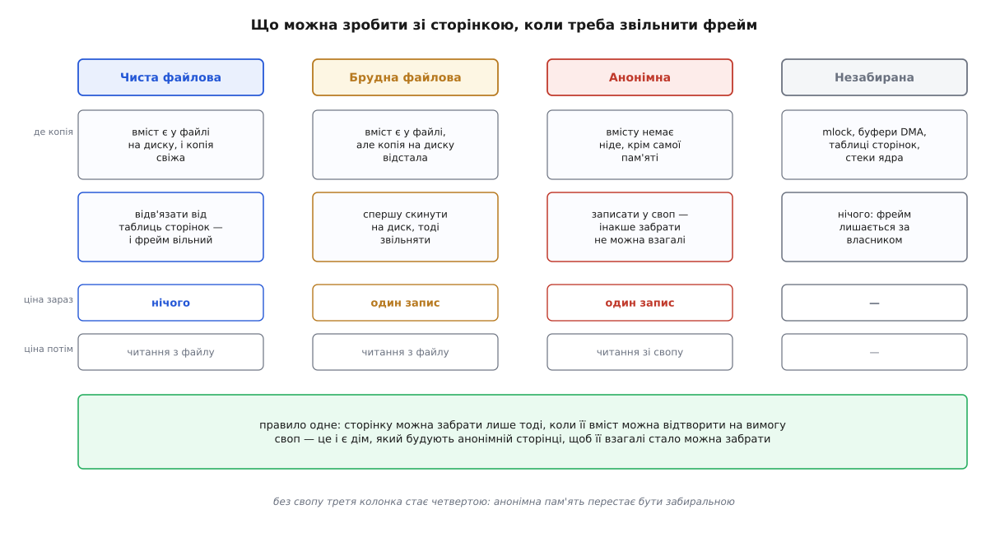
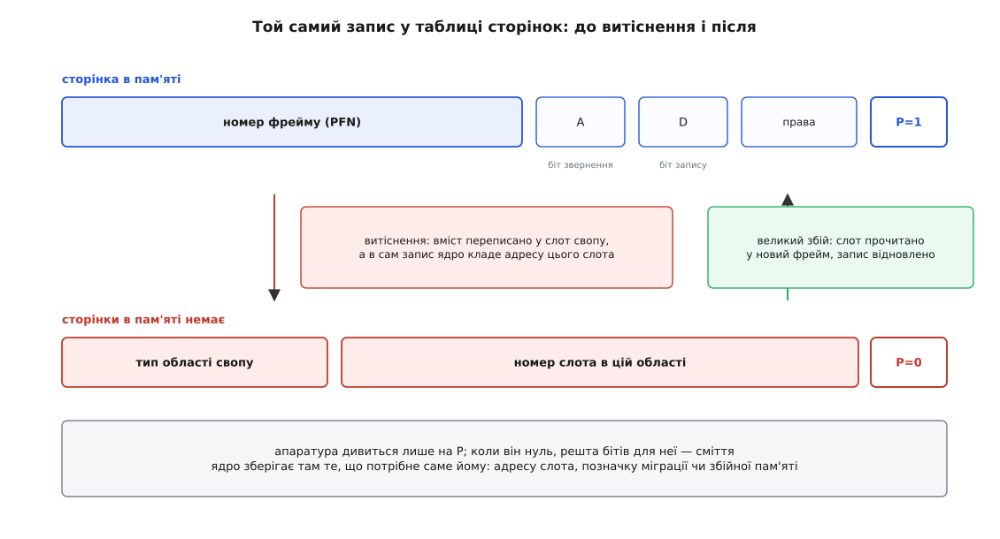
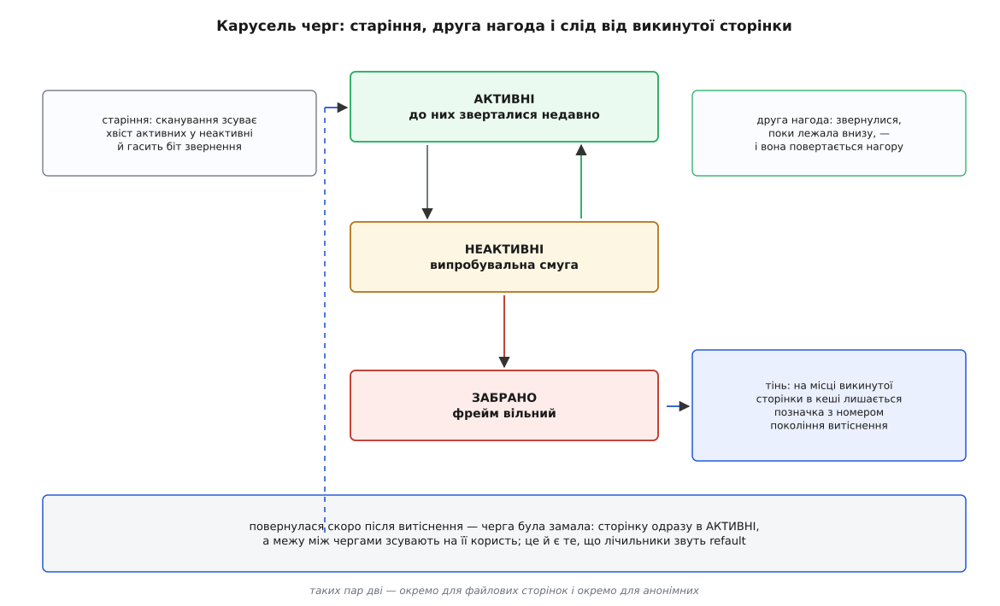
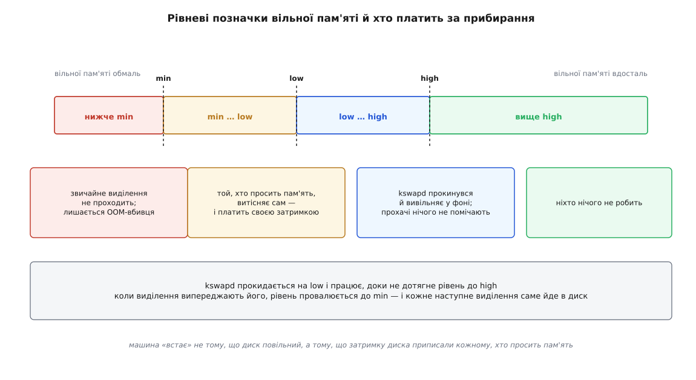

# Свопінг і витіснення сторінок

<preknowlist>
- [Віртуальний адресний простір процесу](book:unix-linux/virtual-address-space) — процес живе у власному просторі адрес, який не збігається з фізичною пам'яттю.
- [Сторінки, таблиці сторінок і MMU](book:unix-linux/paging-and-mmu) — пам'ять роздають однаковими шматками, а відповідність «віртуальна сторінка → фізичний фрейм» лежить у таблицях, які читає апаратура.
- [Сторінковий збій: чому все ліниве](book:unix-linux/page-fault) — звернення до адреси без чинного запису в таблиці зупиняє програму й передає керування ядру.
- [mmap: файл і пам'ять як одне](book:unix-linux/mmap-model) — файл можна відобразити в адресний простір, і тоді читання пам'яті є читанням файлу.
- [Кеш сторінок, fsync і довговічність запису](book:unix-linux/page-cache-durability) — вміст файлів живе в пам'яті сторінками, а щойно записана сторінка ще деякий час чекає скидання на диск.
- [Віртуальна пам'ять](book:programming/virtual-memory) — робочий набір і локальність: чому підкачка взагалі здатна працювати, а не просто перемелює диск.
- [Політики витіснення кешу: LRU, LFU, CLOCK](book:programming/cache-eviction-policies) — як обирають жертву, коли місця менше, ніж даних, і чому ідеальний вибір недосяжний у принципі.
</preknowlist>

## Роздано більше, ніж є

На машині з вісьмома гігабайтами пам'яті десяток служб, браузер і збірка легко напросять двадцять. Ніхто при цьому не бреше: `malloc` не видає пам'ять, він лише розширює адресний простір, а справжній фізичний фрейм процес дістає аж тоді, коли вперше торкнеться сторінки й отримає збій. Скільки обіцяно — питання бухгалтерії [надлишкових зобов'язань](book:unix-linux/overcommit-and-oom); скільки треба насправді — питання того, скільки сторінок реально доторкані.

Доти, доки сума доторканого менша за фізичну пам'ять, система працює й нічого цікавого не відбувається. Але одного разу обробник збою тягнеться по вільний фрейм — а вільних немає. Тут виборів рівно два: відмовити тому, хто просить, або забрати фрейм у того, кому його вже віддали. Відмова означає вбити процес — обіцянку вже дано, і взяти слово назад система вміє лише в один спосіб. Отже, залишається друге: **витіснення** — забрати вже роздане.

## Забрати можна лише те, що вмієш повернути

Забрати сторінку — не те саме, що звільнити ділянку в купі. Процес не знає, що в нього щось відібрали, і не мусить знати: наступного разу, коли він торкнеться цієї адреси, він має побачити рівно ті самі байти. Звідси один-єдиний закон, з якого виростає геть усе інше:

**сторінку можна забрати лише тоді, коли її вміст можна відтворити на вимогу.**

Тому питання «кого забрати» насправді починається з іншого: **де ще, крім цього фрейму, живе вміст**. Відповідей чотири, і кожна дає свою ціну.

**Чиста сторінка з файловою підкладкою.** Її вміст прийшов із файлу — це може бути код виконуваного файлу, сторінка спільної бібліотеки, шматок відображеного через `mmap` файлу, звичайний кеш прочитаного. Копія на диску свіжа, бо ніхто нічого не змінював. Таку сторінку забирають майже задарма: відв'язати від таблиць сторінок і повернути фрейм у вільний пул. Ціна відкладена на потім — коли сторінку попросять знову, її доведеться прочитати з диска.

**Брудна файлова сторінка.** Файл є, але копія в ньому відстала: хтось у сторінку писав. Забрати можна, але спершу треба виконати зворотний запис — скинути вміст у файл. Ціна платиться зараз і немалими грішми: це операція вводу-виводу, і поки вона триває, сторінку чіпати не можна.

**Анонімна сторінка.** Купа, стек, `MAP_ANONYMOUS` — усе, за чим не стоїть жоден файл. Її вміст не існує більше ніде у світі. Забрати таку сторінку не можна взагалі, доки їй не збудували дім — місце, куди її вміст можна відкласти. Це місце й називають **своп** (англ. *swap* — «обмін, підміна»), а операцію відкладання — свопінгом.

**Незабирана сторінка.** Ділянка, прибита `mlock`, буфер, у який просто зараз пише пристрій через DMA, самі таблиці сторінок, стеки ядра. Тут забирання неможливе не через ціну, а через те, що фрейм комусь потрібен саме цей і саме зараз.



*Стовпці різняться однією річчю — де живе копія вмісту; усе решта, разом із ціною, з цього випливає.*

Осторонь від цієї четвірки стоїть пам'ять, яку ядро тримає для себе: кеші імен файлів, кеші inode-ів, десятки внутрішніх пулів об'єктів. Вона не лежить у чергах сторінок і забирається окремим шляхом — ядро просить у кожної підсистеми зменшити свій кеш; про цей бік справи — [пам'ять ядра, slab і зменшувачі кешів](book:unix-linux/kernel-memory-slab). Далі мова тільки про сторінки процесів.

Є ще одна пастка, варта окремої згадки: сторінки `tmpfs` і спільної пам'яті. Формально вони живуть у кеші сторінок, як файлові, — але файлу за ними нема, і єдина їхня підкладка — своп. Тому вміст `/dev/shm` поводиться як анонімна пам'ять, хоч і виглядає як файл.

## Своп — не «повільна оперативна пам'ять»

Зі закону забирання випливає річ, яка суперечить найпоширенішому уявленню. Своп — це **не** розширення оперативної пам'яті на диск. Це підкладка, яка робить анонімну пам'ять забиральною. Машина зі свопом не «має більше пам'яті» — вона має **більше свободи вибору**, кого потіснити.

Вимкніть своп — і анонімні сторінки переїжджають до четвертого стовпця, до незабираних. Пам'ять від цього не зникає й не прискорюється: просто весь тиск лягає на єдиний клас, що лишився, — на файлові сторінки. А найдешевші серед них — чисті. Чистими ж завжди й напевно є сторінки коду: машинний код процесів і бібліотек, який ніхто ніколи не змінює.

Далі відбувається неприємне. Під тиском ядро викидає код програм, що просто зараз працюють, бо саме ці сторінки забирати найдешевше. Програма робить наступний крок — і дістає збій на власній інструкції, чекає читання з диска, працює мікросекунду, знову дістає збій. Машина без свопу під тиском пам'яті гальмує зазвичай **гірше**, ніж машина зі свопом, — просто в моніторингу це виглядає порядно, бо «своп не використовується».

> 🔧 **Навіщо це.** Порада «вимкни своп, щоб не гальмувало» плутає причину з наслідком: гальмує брак пам'яті, а своп лише робить видимим, куди пішли сторінки. Осмислені рішення інші: тримати невеликий своп, щоб у ядра був вибір, а межу «коли гасити» ставити не за фактом «своп зайнято», а за темпом повернень сторінок і за часом, який процеси втрачають в очікуванні пам'яті. Повне вимкнення виправдане лише там, де затримка кожної операції важливіша за виживання служби, — і там воно свідомо йде в парі з жорстким лімітом пам'яті.

## Ціна відв'язування

Розберімо, що технічно означає «забрати сторінку». Таблиці сторінок відображають віртуальну адресу у фізичний фрейм; ядро ж стоїть з протилежного боку — у нього в руках фізична сторінка, і йому треба знайти **всі** записи в **усіх** таблицях, які на неї вказують. Відображення треба пройти назад.

Само собою це не робиться: таблиці — односторонній довідник. Тому ядро веде окрему структуру зворотних відображень. Для файлових сторінок це дерево відрізків при кожному файлі: знаючи файл і зміщення, можна перелічити всі ділянки всіх процесів, що відображають це місце. Для анонімних — ланцюжок структур, який успадковується при [копіюванні при записі](book:unix-linux/copy-on-write): сторінка, спільна для батька й десяти нащадків після `fork`, знає про всіх десятьох.

Далі — послідовність, у якій жоден крок не можна пропустити. Знайти всіх, хто відображає сторінку. Зняти записи в їхніх таблицях, поставивши натомість позначку про те, куди сторінка поділася. Скинути кеш перекладу адрес на **всіх** процесорах, де ці записи могли осісти, — а це міжпроцесорні переривання й очікування підтвердження; докладніше про цю ціну — [TLB як кеш адресного перекладу](book:programming/tlb). Якщо сторінка брудна — дочекатися зворотного запису. І аж тоді повернути фрейм у вільний пул.

Звідси видно, що забирання не буває безкоштовним навіть для чистої сторінки: це обхід зворотних відображень плюс міжпроцесорна синхронізація. Тому ядро працює не поштучно, а партіями: вихоплює зі списку відразу пачку кандидатів, відв'язує їх, збирає брудні в один потік запису — і лише так ціна прибирання розмазується на десятки сторінок замість однієї.

## Слід, що лишається в таблиці

Позначка «куди поділася сторінка» заслуговує окремої уваги, бо в ній ховається найакуратніший хід усього механізму.

Запис у таблиці сторінок має біт присутності. Коли він одиниця, апаратура читає з решти бітів номер фрейму й прапорці. Коли нуль — апаратура на решту бітів **не дивиться взагалі**: вона просто збуджує збій і передає справу ядру. Ці біти простоюють. Ядро й забирає їх собі: у знятому записі воно зберігає адресу місця, куди відклало вміст, — номер області свопу й номер слота в ній.



*Той самий комірковий простір обслуговує два різні призначення, і перемикає їх один біт.*

Поле типу вузьке — областей свопу може бути щонайбільше десятки, і кілька номерів іще зарезервовано під службові різновиди тієї самої позначки: «сторінку зараз переносять між вузлами пам'яті», «фрейм визнано збійним». Механізм один: запис без біта присутності — це загальне «тут було, а тепер шукай ось де».

Процес про підміну не дізнається ніяк. Він просто одного разу торкається адреси, дістає збій, і обробник бачить у записі не порожнечу, а адресу слота. Далі — взяти вільний фрейм, прочитати в нього слот, відновити запис, повернути програму на ту саму інструкцію. Такий збій називають **великим** (англ. *major*) — на відміну від малого, який обходиться без вводу-виводу. Різниця в ціні — два порядки на NVMe й чотири на обертовому диску: малий збій коштує близько мікросекунди, великий на NVMe — сотню мікросекунд, а на обертовому диску — десять мілісекунд.

Між пам'яттю і свопом є ще один прошарок, без якого механізм ламався б на спільних сторінках, — **кеш свопу**. Він тримає відповідність «слот ↔ сторінка в пам'яті» для тих сторінок, що зараз у польоті або щойно прилетіли назад. Завдяки йому десять процесів, які після `fork` ділять одну відкладену сторінку й одночасно її торкнулися, дістають **один** фрейм, а не десять копій. І ще один зиск: сторінка, повернута зі свопу й відтоді не змінена, зберігає свій слот чинним, тож наступного разу її можна викинути **без запису** — вміст на диску й так актуальний.

## Кого забирати: вибір без знання майбутнього

Ідеальне правило відоме й доведене: викидати ту сторінку, до якої звернуться найпізніше з усіх. Виконати його не можна — воно потребує знання майбутнього; сама ця недосяжна мірка і сімейство наближень до неї розібрані в [політиках витіснення](book:programming/cache-eviction-policies). Лишається спиратися на минуле й на локальність: те, чого торкалися недавно, найімовірніше знадобиться знову.

Але навіть чесний облік «хто торкався давніше» ядру не по кишені. Апаратура дає рівно один біт на запис у таблиці — **біт звернення**, який MMU ставить сама при доступі. Порядку між сторінками цей біт не дає: він каже лише «відколи ти його востаннє гасив, сюди зазирали». Позначити час кожного доступу було б рівнозначно перехопленню кожного доступу, а це кінець продуктивності.

З одного біта будують ось що. Сторінки одного класу лежать у **двох** чергах: активній і неактивній. Неактивна — це випробувальна смуга. Прибирання забирає сторінки лише з її хвоста; активної воно не чіпає взагалі.

Механіка руху проста й уся тримається на тому єдиному біті. Коли неактивна черга худне, ядро переносить у неї хвіст активної, **гасячи** при цьому біт звернення. Сторінка потрапила на випробування чистою. Далі два результати. Якщо до неї звернулися, поки вона там лежала, апаратура сама поставить біт — і при наступному проході сторінка повернеться в активні, отримавши другу нагоду. Якщо ні — вона доїде до хвоста з погашеним бітом, і це та єдина інформація, яка ядру потрібна: «за цілий прохід черги ніхто не зазирнув».

Черг не дві, а дві пари: окремо для файлових сторінок, окремо для анонімних. Розділили їх не для краси. В одній спільній черзі дешеві файлові сторінки ховалися б за масою анонімних, і щоб дістатися до легкої здобичі, сканування мусило б перелопачувати тонни того, що забирати дорого. У Linux цей поділ з'явився у версії 2.6.28 і закрив цілий клас патологічної поведінки. Поряд живе третій, окремий список — незабираного: сторінки, прибиті `mlock`, тримають там, щоб сканування об них не спотикалося щоразу.

Сучасні ядра вміють і принципово інакший підхід — багатопоколінну чергу (англ. *multi-generational LRU*), яку розробив Ю Чжао з Google і яку прийняли в ядро 6.1 наприкінці 2022 року. Замість двох черг там кілька поколінь, а сканують не фізичні списки сторінок, а таблиці сторінок процесів — це дешевше там, де пам'яті багато. Ідея вибору при цьому та сама: один біт звернення й друга нагода.

## Сліпа пляма: те, чого черга не бачить

У цій конструкції є вада, і вона глибша за будь-яке налаштування. Черга ранжує **лише те, що є в пам'яті**. Про сторінку, яку щойно викинули, вона більше нічого не знає — та зникла зі списків разом зі своєю історією.

А тепер уявімо дві геть різні ситуації, які **зсередини черги виглядають однаково**. Перша: неактивна черга робить свою роботу, викидаючи мотлох, до якого ніхто не повернеться. Друга: неактивна черга закоротка, і в її хвіст доїжджають сторінки робочого набору, які знадобляться за мить, — їх викидають і за мить читають назад. У першому випадку все гаразд, у другому система себе жере. Але кількість викинутого, довжина черг і зайнятість пам'яті в обох випадках однакові.

Розв'язок — лишати слід. Коли файлова сторінка залишає пам'ять, її місце в кеші сторінок не звільняють цілком: там кладуть **тінь** — крихітну позначку, у якій записано, скільки сторінок було витіснено на цьому вузлі до цієї миті. Це щось на кшталт номера покоління.

Коли ту саму сторінку читають знову, ядро знаходить тінь і віднімає: скільки витіснень сталося за час її відсутності. Це число — **відстань повернення** — і є відповіддю на питання, яке інакше поставити не було як: *якою мала б бути черга, щоб ця сторінка в ній вижила*. Якщо відстань менша за довжину черг, висновок однозначний: сторінку викинули помилково, при трохи більшій черзі вона б лишилася. Тоді її не просто читають назад, а одразу ставлять в активні — і зсувають межу між чергами на її користь.



*Без тіні механізм замкнений на те, що бачить; тінь — єдиний канал, яким до нього доходять новини про наслідки власних рішень.*

Цей механізм — виявлення повернень (англ. *refault detection*) — розробив Йоганнес Вайнер; у ядро він увійшов 2014 року у версії 3.15, спершу лише для файлових сторінок, згодом і для анонімних. З нього ж походить пара чисел, важливіших за будь-які інші в цій темі: скільки сторінок повернулося після витіснення й скільки з них повернулося настільки швидко, що це визнано помилкою.

> 🔧 **Навіщо це.** Питання «чи шкодить своп на цій машині» не має відповіді у стовпчику зайнятого свопу: два гігабайти відкладеного мотлоху, до якого ніхто не повернеться, — це здоров'я, а не хвороба. Відповідь дають повернення: скільки сторінок за секунду прилітає назад і скільки з них система сама визнала помилково викинутими. Саме на цих числах будують сигналізацію, і саме вони, а не «swap used», корелюють із затримками, які бачить користувач.

## Хто платить за прибирання

Прибирати можна завчасно або в останню мить, і різниця тут не в ефективності, а в тому, **на кого лягає затримка**.

Для кожної зони пам'яті ядро тримає три рівневі позначки (англ. *watermarks*): `min`, `low`, `high`. Поки вільної пам'яті більше за `high`, не робиться нічого. Щойно рівень падає нижче `low`, будиться `kswapd` — фонова нитка (по одній на вузол пам'яті), яка витісняє сторінки, доки не підніме рівень назад до `high`. Той, хто в цей час просить пам'ять, нічого не помічає: він бере зі вільного пулу, а поповнює пул хтось інший.

Але якщо виділення йдуть швидше, ніж `kswapd` встигає вивільняти, рівень провалюється до `min`. І тоді той, хто просить сторінку, змушений витіснити її собі сам — прямо в шляху виділення, перш ніж дістане свій фрейм. Це називають **прямим відбором** (англ. *direct reclaim*), і саме він перетворює брак пам'яті на видиме гальмування: затримку диска приписують кожному, хто просто хотів пам'яті. Нижче `min` лишається невеликий резерв — його бережуть для самого ядра, бо витіснення теж потребує пам'яті: заголовків запиту вводу-виводу, буферів для стиснення. Виділення, яке не змогло дістати сторінку навіть після відбору, приводить до [вбивці за браком пам'яті](book:unix-linux/overcommit-and-oom).



*Одна й та сама робота — витіснення — виконується в трьох смугах по-різному; змінюється лише те, чий час на неї витрачають.*

Той самий поділ повторено на рівні [контрольних груп](book:unix-linux/cgroups), і саме там він найкорисніший. Кожна група має власні черги сторінок, тож витіснення можна вести всередині групи, не чіпаючи сусідів. Дві межі роблять різні речі: після `memory.high` група продовжує працювати, але кожне наступне виділення отримує штрафну затримку, пропорційну перевищенню, — це м'яке гальмо. Після `memory.max` виділення йде в прямий відбір усередині групи, а коли відбирати нічого — вбивця приходить у цю групу, а не по машині.

## Скільки брати з якої черги

Черг дві пари, і на кожному заході відбору треба вирішити, скільки сканувати анонімних, а скільки файлових. Це вибір між двома різними цінами: викинути файлову сторінку зазвичай дешевше зараз, зате читання її назад — теж диск.

Груба ручка називається `swappiness` і має значення від 0 до 200, типове — 60. Її трактують як пріоритет анонімної черги, а файловій дістається доповнення до двохсот. Стеля 200 — з ядра 5.8; до нього ручка приймала лише 0–100, і значення понад сотню ядро відкидало.

**Умова.** Типова машина, `vm.swappiness = 60`; відбір збирається переглянути за захід тисячу сторінок.

```
частка анонімних = swappiness / 200        = 60 / 200  = 0.30
частка файлових  = (200 − swappiness) / 200 = 140 / 200 = 0.70

анонімних до перегляду = 1000 · 0.30 = 300
файлових  до перегляду = 1000 · 0.70 = 700
```

Звідси зрозуміло, чого ця ручка **не** робить. `swappiness = 0` не вимикає своп: він лише ставить анонімній черзі нульовий пріоритет, тож її не чіпають доти, доки з файлової вдається вивільняти. Скінчилися файлові — анонімні підуть у своп однаково, бо альтернатива в цій точці одна, і вона з вбивцею.

Пропорція за формулою — лише відправна точка. Починаючи з версії 5.8 ядро підправляє її **за виміряною ціною**: якщо повернення частіше приходять з файлової черги, значить, ту чергу тиснуть надміру, і тиск зсувають на анонімну — і навпаки. Тобто та сама відстань повернення, що рятує окрему сторінку, керує ще й балансом між класами.

## Куди насправді йде анонімна сторінка

Область свопу — це або окремий розділ, або файл; для ядра різниці майже нема, бо воно наперед з'ясовує розташування блоків файлу й далі пише в них навпростець, обходячи файлову систему. Областей може бути кілька, у кожної є пріоритет: беруть спершу з найпріоритетнішої, а між рівними розподіляють по черзі, щоб навантажити кілька пристроїв паралельно.

Слоти в області ядро роздає не абияк, а намагаючись класти сусідні сторінки в сусідні слоти: тоді витіснення виливається в один довгий послідовний запис замість розсипу дрібних. Читання назад теж не поодиноке — разом зі слотом підтягують кількох сусідів, ставлячи на локальність.

Окремої розмови варта підміна пристрою обчисленням. Замість писати сторінку на диск, її можна **стиснути** й лишити в тій самій оперативній пам'яті. Так працює `zram` — блоковий пристрій, який зберігає записані в нього сторінки стисненими в пам'яті; своп на ньому означає своп «сам у себе». Виглядає як фокус, але арифметика чесна.

**Умова.** Чотири гігабайти анонімної пам'яті відкладено в `zram`; типовий коефіцієнт стиснення для змішаних даних — близько трьох.

```
відкладено анонімної пам'яті = 4.00 ГіБ
коефіцієнт стиснення         ≈ 3 : 1
займають стиснені дані       = 4.00 / 3 ≈ 1.33 ГіБ
фізично вивільнено           = 4.00 − 1.33 ≈ 2.67 ГіБ

ціна повернення сторінки: розпакування ≈ одиниці мкс
                          проти читання з NVMe ≈ 100 мкс
```

Виграш не в тому, що пам'яті стало більше, а в тому, що процесорний час нині дешевий, а очікування вводу-виводу — дороге. Тому на машинах без диска під своп (і в Android, і в ChromeOS, і в Fedora типово) `zram` — основна й часто єдина область свопу. Споріднений `zswap` розв'язує задачу з іншого боку: він стискає сторінки в пам'яті перед справжнім свопом і скидає на диск лише те, що не повернулося. Межа в обох одна й та сама, і про неї варто пам'ятати: стиснення не створює пам'яті. Коли стискати вже нічого, машина впирається в ту саму стіну, тільки пізніше.

## Коли рівновага ламається

Усе описане тримається на одному припущенні: те, що викидають, потрібне рідше, ніж те, що лишається. Коли робочий набір перестає вміщатися в пам'ять, припущення розсипається — і система входить у **пробуксовування**: викинута сторінка потрібна негайно, її читають назад, для цього викидають іншу, потрібну так само негайно.

Найгірше тут — не сама втрата швидкості, а її різкість. Ціна одного доступу до пам'яті лінійно залежить від частки звернень, що дають великий збій, — але сама ця частка залежить від нестачі пам'яті вкрай нелінійно, бо локальність доступів нерівномірна.

**Умова.** Доступ до пам'яті — 80 нс; великий збій на NVMe — 100 мкс, тобто 100 000 нс. Через `p` позначено частку звернень, які дають великий збій.

```
T(p) = (1 − p)·80 + p·(80 + 100000) ≈ 80 + p·100000

p = 0        → T =    80 нс     норма
p = 10⁻⁶     → T =    80.1 нс   непомітно
p = 10⁻⁴     → T =    90 нс     на 12.5 % повільніше
p = 10⁻³     → T =   180 нс     у 2.25 раза повільніше
p = 10⁻²     → T =  1080 нс     у 13.5 раза повільніше
```

Один збій на сто звернень — це ще дуже небагато збоїв, а машина вже стоїть. Той самий рахунок для обертового диска (10 мс замість 100 мкс) дає ті самі числа на два порядки раніше: `p = 10⁻⁴` вже коштує сповільнення в 13.5 раза. Швидкий носій не прибирає обрив, а лише пересуває його; звідки береться сама форма обриву й де він розташований — [арифметика пробуксовування](book:unix-linux/swap-and-reclaim/math-thrashing-cliff.md).

Самотужки система з цього стану не виходить, і причина в зворотному зв'язку з неправильним знаком. Прямий відбір сповільнює тих, хто просить пам'ять; сповільнені процеси не звільняють свою пам'ять швидше; запити накопичуються, кожен новий теж іде у відбір. Класичне середнє навантаження при цьому росте, але пояснити нічого не може: у ньому процеси, що чекають на пам'ять, невідрізнимі від тих, що рахують. Пряму відповідь дає облік [тиску на ресурси](book:unix-linux/load-and-pressure) — частка часу, яку робота втратила саме в очікуванні пам'яті. На ній тримаються сторожі на кшталт `systemd-oomd`, які втручаються, поки машина ще відповідає, а не тоді, коли остання сторінка вже не знайшлася.

## Що з цього видно приладами

Числа про своп поділені на два різні сорти, і плутати їх — найпоширеніша помилка при розгляді таких випадків.

**Рівень** — скільки зараз відкладено (загалом по машині й на кожен процес окремо). Він майже нічого не каже про здоров'я: відкладена й забута сторінка не коштує нічого. **Потік** — скільки сторінок за секунду йде у своп і скільки повертається звідти; скільки сторінок відбір переглянув на кожну звільнену. Ось потік і болить: сотні мегабайтів на секунду туди-сюди — це те саме пробуксовування, навіть якщо рівень свопу невеликий.

Третій, найточніший сорт — уже згадані повернення: не «скільки прочитано зі свопу», а «скільки з прочитаного система сама визнала передчасно викинутим». Що саме читати, у яких файлах ці числа лежать і як їх правильно складати для процесу, який ділить сторінки з іншими, зібрано окремо: [лічильники витіснення й свопу](book:unix-linux/swap-and-reclaim/api-reclaim-counters.md). Побачити ту саму механіку не по чужій машині, а на власній сторінці — попросити ядро витіснити конкретну ділянку й піймати її повернення — дає [дослід із витісненням власних сторінок](book:unix-linux/swap-and-reclaim/proj-observe-reclaim.md).

Варто знати й походження самого слова: у ранньому Unix свопінгом звалося перекачування **процесу цілком**, і лише 1979 року, з приходом Unix на VAX, витіснення стало посторінковим — [як своп у Unix перетворився з перекачування процесів на відбір сторінок](book:unix-linux/swap-and-reclaim/hist-from-swapping-to-reclaim.md). Назва пережила механізм, який її породив.

Урешті вся ця машинерія — один довгий заклад про майбутнє, зроблений з украй бідними доказами: один біт на сторінку й одна позначка на місці викинутого. Тому й діагностика тут інша, ніж звикли: питати треба не скільки пам'яті зайнято й не скільки свопу використано, а **як часто заклад програє** — скільки сторінок повертається назад і скільки часу на цьому втрачено. Це число система про себе знає й чесно повідомляє.
