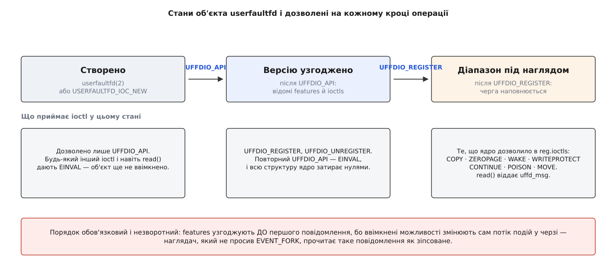
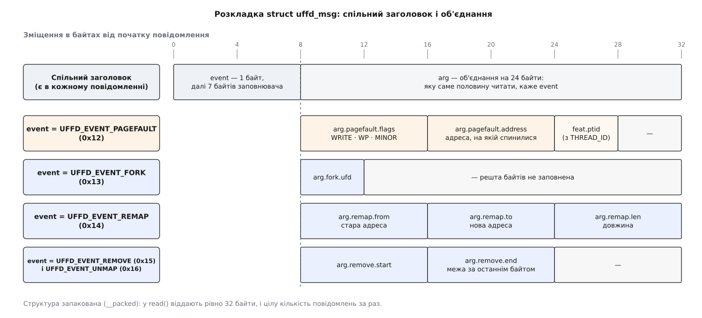

# 📋 Довідник userfaultfd: створення, рукостискання, операції, коди помилок

Точний контракт механізму складається з небагатьох частин: об'єкт створюють двома різними входами, з ядром домовляються про версію й можливості, режими реєстрації дозволені не над усякою пам'яттю, операцій над діапазоном сім — кожна зі своїми полями та прапорцями, повідомлення має сталу побайтову розкладку, а за кожним кодом помилки стоїть конкретна причина. Усе це потрібне в ту мить, коли код уже пишеться: що саме передати, у якому порядку, що ядро поверне назад і що зробити з невдачею.

Одна риса пронизує весь інтерфейс і пояснює його форму. Крім самого створення дескриптора, тут **немає жодного окремого системного виклику**: усе робиться через [`ioctl`](topic:unix-linux/ioctl-interface) — керувальний виклик, у якому число-команда каже, що робити, а структура за покажчиком несе аргументи. Тому кожна операція нижче — це пара «команда + структура», і майже кожна структура водночас і вхідна, і вихідна: ядро дописує в неї відповідь.

## Створення об'єкта: два входи

:::tabs
```c
#include <sys/syscall.h>
#include <linux/userfaultfd.h>
#include <fcntl.h>
#include <sys/ioctl.h>

int uffd = syscall(SYS_userfaultfd, flags);   /* обгортки в glibc немає */
```
```cpp
#include <sys/syscall.h>
#include <linux/userfaultfd.h>
#include <fcntl.h>
#include <sys/ioctl.h>

int uffd = ::syscall(SYS_userfaultfd, flags);  // обгортки в glibc немає
```
:::

| прапорець | з ядра | що робить |
|---|---|---|
| `O_CLOEXEC` | 4.3 | дескриптор закривається на [`exec`](topic:unix-linux/exec-semantics), а не тягнеться в нову програму |
| `O_NONBLOCK` | 4.3 | `read` на порожній черзі не [спить](topic:unix-linux/blocking-and-nonblocking), а дає `EAGAIN` |
| `UFFD_USER_MODE_ONLY` (значення 1) | 5.11 | у чергу йдуть **тільки** збої з простору користувача; збій, що стався в ядрі під час копіювання аргументів системного виклику, обробляється звичайним шляхом |

| помилка створення | причина |
|---|---|
| `EINVAL` | у `flags` біт, якого ядро не знає |
| `EMFILE` | вичерпано межу дескрипторів процесу |
| `ENFILE` | вичерпано загальносистемну межу відкритих файлів |
| `ENOMEM` | ядру бракує пам'яті |
| `EPERM` (з 5.2) | `/proc/sys/vm/unprivileged_userfaultfd` дорівнює 0, а в процесу немає [можливости](topic:unix-linux/capabilities) `CAP_SYS_PTRACE` — і при цьому не передано `UFFD_USER_MODE_ONLY` |

Другий вхід, доданий у 6.1, — [файл пристрою](topic:unix-linux/device-file-model):

:::tabs
```c
int dev = open("/dev/userfaultfd", O_RDWR | O_CLOEXEC);
int uffd = ioctl(dev, USERFAULTFD_IOC_NEW, (unsigned long)O_CLOEXEC);
close(dev);            /* пристрій більше не потрібен: об'єкт уже свій */

/* у заголовку:  USERFAULTFD_IOC     0xAA
                 USERFAULTFD_IOC_NEW _IO(USERFAULTFD_IOC, 0x00)  */
```
```cpp
int dev = ::open("/dev/userfaultfd", O_RDWR | O_CLOEXEC);
int uffd = ::ioctl(dev, USERFAULTFD_IOC_NEW, static_cast<unsigned long>(O_CLOEXEC));
::close(dev);          // пристрій більше не потрібен: об'єкт уже свій

// у заголовку:  USERFAULTFD_IOC     0xAA
//               USERFAULTFD_IOC_NEW _IO(USERFAULTFD_IOC, 0x00)
```
:::

Аргумент `USERFAULTFD_IOC_NEW` — той самий набір прапорців, що й у системного виклику. Різниця не в тому, що виходить, а в тому, **хто має право його дістати**: дозвіл на цей шлях роздають звичайними правами на файл (власник, група, режим), і `/proc/sys/vm/unprivileged_userfaultfd` на нього не поширюється взагалі. Хто зумів відкрити пристрій, дістає повноцінний об'єкт разом із перехопленням збоїв ядра; хто не зумів — не дістає нічого. Це той самий вибір, що й у решті системи: замість глобального вимикача — ім'я, власник і режим.

> 🔧 **Навіщо це.** Різниця між двома входами суто адміністративна, тому в коді її ховають за однією функцією: спершу пробують `/dev/userfaultfd`, а на `ENOENT` чи `EACCES` відкочуються до системного виклику. Так одна й та сама програма працює і на ядрі 5.4 без пристрою, і на 6.1 з роздачею прав через `udev`, і не потребує `CAP_SYS_PTRACE` там, де його вирішили не давати.

## Рукостискання: UFFDIO_API

Свіжий об'єкт не приймає нічого, крім однієї команди. Доти, доки версію не узгоджено, будь-який інший `ioctl` і навіть `read` дають `EINVAL`.

:::tabs
```c
struct uffdio_api {
    __u64 api;        /* вхід:  має бути UFFD_API == 0xAA          */
    __u64 features;   /* вхід:  що просимо; вихід: що вміє ядро    */
    __u64 ioctls;     /* вихід: загальні операції об'єкта          */
};
```
```cpp
struct uffdio_api {
    __u64 api;        // вхід:  має бути UFFD_API == 0xAA
    __u64 features;   // вхід:  що просимо; вихід: що вміє ядро
    __u64 ioctls;     // вихід: загальні операції об'єкта
};
```
:::

Поле `features` працює несиметрично, і саме тут ламаються перші спроби. На вході це **прохання ввімкнути**, на виході — **повний перелік усього, що ядро підтримує**, незалежно від того, скільки ви попросили. Тобто одним вдалим викликом ви і вмикаєте потрібне, і дізнаєтеся всю правду про можливості ядра. Але якщо попросити хоч один невідомий біт, виклик дає `EINVAL` і **обнуляє всю структуру** — з невдалої спроби не видно нічого.

Звідси єдиний надійний спосіб розвідки, прямо благословенний документацією: двічі викликати `UFFDIO_API`, першого разу з `features = 0`. Такий порожній виклик нічого не вмикає, тому другий виклик — уже з обраною підмножиною — дозволено.

:::tabs
```c
struct uffdio_api api = { .api = UFFD_API, .features = 0 };
if (ioctl(uffd, UFFDIO_API, &api) == -1) return -1;   /* api.features ← усе, що вміє ядро */

__u64 want = UFFD_FEATURE_EVENT_FORK | UFFD_FEATURE_EVENT_REMAP |
             UFFD_FEATURE_EVENT_REMOVE | UFFD_FEATURE_EVENT_UNMAP;
struct uffdio_api api2 = { .api = UFFD_API, .features = api.features & want };
if (ioctl(uffd, UFFDIO_API, &api2) == -1) return -1;  /* вмикаємо лише наявне */
```
```cpp
::uffdio_api api{.api = UFFD_API, .features = 0};
if (::ioctl(uffd, UFFDIO_API, &api) == -1) return -1;  // api.features ← усе, що вміє ядро

__u64 want = UFFD_FEATURE_EVENT_FORK | UFFD_FEATURE_EVENT_REMAP |
             UFFD_FEATURE_EVENT_REMOVE | UFFD_FEATURE_EVENT_UNMAP;
::uffdio_api api2{.api = UFFD_API, .features = api.features & want};
if (::ioctl(uffd, UFFDIO_API, &api2) == -1) return -1; // вмикаємо лише наявне
```
:::

Повний перелік можливостей із їхніми бітами. Версію ядра вказано там, де вона задокументована:

| можливість | біт | що дає |
|---|---|---|
| `UFFD_FEATURE_PAGEFAULT_FLAG_WP` | 1<<0 | 5.7 — вмикає режим `WP` і ознаку `UFFD_PAGEFAULT_FLAG_WP` у повідомленнях |
| `UFFD_FEATURE_EVENT_FORK` | 1<<1 | подія про [`fork`](topic:unix-linux/fork-semantics); ядро створює об'єкт для дитини й віддає його дескриптор просто в повідомленні |
| `UFFD_FEATURE_EVENT_REMAP` | 1<<2 | подія про `mremap` зі старою й новою адресою |
| `UFFD_FEATURE_EVENT_REMOVE` | 1<<3 | подія про `madvise(MADV_DONTNEED)` і `MADV_REMOVE` |
| `UFFD_FEATURE_EVENT_UNMAP` | 1<<6 | подія про `munmap` |
| `UFFD_FEATURE_MISSING_HUGETLBFS` | 1<<4 | режим `MISSING` над [великими сторінками](topic:unix-linux/huge-pages) |
| `UFFD_FEATURE_MISSING_SHMEM` | 1<<5 | режим `MISSING` над [спільною пам'яттю](topic:unix-linux/posix-shared-memory) |
| `UFFD_FEATURE_SIGBUS` | 1<<7 | 4.14 — замість вкладати винуватця спати, ядро надсилає йому [`SIGBUS`](topic:unix-linux/signal-model) |
| `UFFD_FEATURE_THREAD_ID` | 1<<8 | 4.14 — у повідомленні заповнюється `feat.ptid`: який саме [потік](topic:unix-linux/threads-as-tasks) спіткнувся |
| `UFFD_FEATURE_MINOR_HUGETLBFS` | 1<<9 | 5.13 — режим `MINOR` над великими сторінками |
| `UFFD_FEATURE_MINOR_SHMEM` | 1<<10 | 5.14 — режим `MINOR` над спільною пам'яттю |
| `UFFD_FEATURE_EXACT_ADDRESS` | 1<<11 | `address` у повідомленні — точна адреса звертання, а не початок сторінки |
| `UFFD_FEATURE_WP_HUGETLBFS_SHMEM` | 1<<12 | 5.19 — режим `WP` над великими сторінками й спільною пам'яттю |
| `UFFD_FEATURE_WP_UNPOPULATED` | 1<<13 | `WP` ловить і запис у ще не заселену анонімну сторінку |
| `UFFD_FEATURE_POISON` | 1<<14 | доступна операція `UFFDIO_POISON` |
| `UFFD_FEATURE_WP_ASYNC` | 1<<15 | `WP` знімається сам, без повідомлення: чистий облік забруднених сторінок, який читають із `/proc/PID/pagemap` |
| `UFFD_FEATURE_MOVE` | 1<<16 | доступна операція `UFFDIO_MOVE` |

Вихідне поле `ioctls` після вдалого рукостискання містить `UFFD_API_IOCTLS` — набір із `_UFFDIO_REGISTER`, `_UFFDIO_UNREGISTER` і `_UFFDIO_API`. Це операції **над самим об'єктом**; операції над пам'яттю з'являються не тут, а після реєстрації.

| помилка `UFFDIO_API` | причина |
|---|---|
| `EINVAL` | `api != UFFD_API`; або в `features` біт, якого ядро не знає; або попередній виклик уже ввімкнув хоч одну можливість |
| `EPERM` | попросили `UFFD_FEATURE_EVENT_FORK`, не маючи `CAP_SYS_PTRACE` |
| `EFAULT` | покажчик на структуру веде за межі доступної пам'яті процесу |



*Порядок незворотний, і кожен крок відмикає свій набір операцій. `EINVAL` на цілком правильному `UFFDIO_COPY` найчастіше означає саме те, що попередній крок пропущено.*

## Реєстрація діапазону

:::tabs
```c
struct uffdio_range {
    __u64 start;      /* кратна розміру сторінки */
    __u64 len;        /* кратна розміру сторінки, не нуль */
};

struct uffdio_register {
    struct uffdio_range range;
    __u64 mode;       /* вхід:  MISSING | WP | MINOR                       */
    __u64 ioctls;     /* вихід: які операції дозволено саме цьому діапазону */
};

#define UFFDIO_REGISTER_MODE_MISSING  (1<<0)
#define UFFDIO_REGISTER_MODE_WP       (1<<1)
#define UFFDIO_REGISTER_MODE_MINOR    (1<<2)
```
```cpp
struct uffdio_range {
    __u64 start;      // кратна розміру сторінки
    __u64 len;        // кратна розміру сторінки, не нуль
};

struct uffdio_register {
    struct uffdio_range range;
    __u64 mode;       // вхід:  MISSING | WP | MINOR
    __u64 ioctls;     // вихід: які операції дозволено саме цьому діапазону
};

#define UFFDIO_REGISTER_MODE_MISSING  (1<<0)
#define UFFDIO_REGISTER_MODE_WP       (1<<1)
#define UFFDIO_REGISTER_MODE_MINOR    (1<<2)
```
:::

Режими можна поєднувати в одному виклику — `MISSING | WP` над анонімною ділянкою є звичайною справою: спершу сторінку приносять, потім стежать за записами в неї. Порожній `mode` — помилка.

Яку пам'ять який режим приймає:

| режим | анонімна приватна | спільна пам'ять (`tmpfs`, `memfd`, System V) | великі сторінки | звичайний файл на диску |
|---|---|---|---|---|
| `MISSING` | з 4.3 | з 4.11, за `MISSING_SHMEM` | з 4.11, за `MISSING_HUGETLBFS` | **ніколи** |
| `WP` | з 5.7 | з 5.19, за `WP_HUGETLBFS_SHMEM` | з 5.19, за тією ж можливістю | **ніколи** |
| `MINOR` | **не буває** | з 5.14, за `MINOR_SHMEM` | з 5.13, за `MINOR_HUGETLBFS` | **ніколи** |

Дві порожні клітинки не є недоробкою. Відображення файлу з диска не реєструють у жодному режимі, бо ядро **саме знає**, звідки взяти байти, — програмі нема чого йому додати. А `MINOR` над приватною анонімною пам'яттю не має сенсу за означенням: цей режим ловить мить, коли вміст уже лежить у кеші сторінок, а анонімна приватна сторінка в кеші не живе.

Вихідне поле `ioctls` — це **дозвіл, а не побажання**: набір бітів `1 << _UFFDIO_*`, які ядро гарантує саме над цим діапазоном. У заголовку є два готові набори — повний `UFFD_API_RANGE_IOCTLS` і скорочений `UFFD_API_RANGE_IOCTLS_BASIC` без `_UFFDIO_ZEROPAGE` та `_UFFDIO_MOVE`; який із них ви дістанете, залежить від типу пам'яті й переліку режимів. Зокрема, над великими сторінками `UFFDIO_ZEROPAGE` не працює: нульового кадру потрібного розміру, який можна відобразити всім, там просто немає. Тому правило одне — **маску читають, а не вгадують**: набір операцій вибирають із `reg.ioctls`, а не з номера версії ядра.

Опкоди, з яких складається маска:

```
_UFFDIO_REGISTER   0x00      _UFFDIO_MOVE          0x05
_UFFDIO_UNREGISTER 0x01      _UFFDIO_WRITEPROTECT  0x06
_UFFDIO_WAKE       0x02      _UFFDIO_CONTINUE      0x07
_UFFDIO_COPY       0x03      _UFFDIO_POISON        0x08
_UFFDIO_ZEROPAGE   0x04      _UFFDIO_API           0x3F

перевірка:  if (!(reg.ioctls & ((__u64)1 << _UFFDIO_ZEROPAGE))) …
```

| помилка `UFFDIO_REGISTER` | причина |
|---|---|
| `EINVAL` | `mode` порожній або має невідомий біт; `range.start`/`range.len` не кратні сторінці; `len` дорівнює нулю; у діапазоні є діри без відображення; тип пам'яті не сумісний із режимом |
| `EBUSY` | діапазон уже обслуговує **інший** об'єкт `userfaultfd` |
| `ENOMEM` | ядру бракує пам'яті на облік |
| `EFAULT` | покажчик на структуру за межами доступної пам'яті |

Зняття реєстрації бере саму `struct uffdio_range` без обгортки:

:::tabs
```c
struct uffdio_range r = { .start = base, .len = length };
ioctl(uffd, UFFDIO_UNREGISTER, &r);
```
```cpp
::uffdio_range r{.start = base, .len = length};
::ioctl(uffd, UFFDIO_UNREGISTER, &r);
```
:::

Знімати можна частину зареєстрованого — межі мусять бути кратні сторінці. Усі, хто чекав у знятому діапазоні, прокидаються, і їхні інструкції йдуть уже звичайним шляхом ядра.

## Сім операцій над діапазоном

| операція | закриває збій у режимі | структура | що робить |
|---|---|---|---|
| `UFFDIO_COPY` | `MISSING` | `uffdio_copy` | неподільно кладе за адресою вміст із буфера наглядача |
| `UFFDIO_ZEROPAGE` | `MISSING` | `uffdio_zeropage` | те саме, але вмістом є нулі — без буфера й без копіювання |
| `UFFDIO_CONTINUE` | `MINOR` | `uffdio_continue` | відображає сторінку, яка вже лежить у кеші |
| `UFFDIO_WRITEPROTECT` | `WP` | `uffdio_writeprotect` | ставить або знімає захист від запису на діапазон |
| `UFFDIO_POISON` | `MISSING` | `uffdio_poison` | замість вмісту вписує «отруєний» запис: наступне звертання дає `SIGBUS` |
| `UFFDIO_MOVE` (6.8) | `MISSING` | `uffdio_move` | переносить уже наявні сторінки за нову адресу, не копіюючи їх |
| `UFFDIO_WAKE` | — | `uffdio_range` | будить тих, кого лишили спати прапорцем `DONTWAKE` |

:::tabs
```c
struct uffdio_copy {
    __u64 dst;        /* адреса в зареєстрованому діапазоні, кратна сторінці */
    __u64 src;        /* буфер наглядача — обов'язково ПОЗА діапазоном       */
    __u64 len;
    __u64 mode;       /* UFFDIO_COPY_MODE_DONTWAKE (1<<0) | _MODE_WP (1<<1)  */
    __s64 copy;       /* вихід: скільки байтів лягло, або −errno             */
};

struct uffdio_zeropage {
    struct uffdio_range range;
    __u64 mode;       /* UFFDIO_ZEROPAGE_MODE_DONTWAKE (1<<0)                */
    __s64 zeropage;   /* вихід: скільки байтів, або −errno                   */
};

struct uffdio_continue {
    struct uffdio_range range;
    __u64 mode;       /* _MODE_DONTWAKE (1<<0) | _MODE_WP (1<<1)             */
    __s64 mapped;     /* вихід: скільки байтів відображено, або −errno       */
};

struct uffdio_writeprotect {
    struct uffdio_range range;
    __u64 mode;       /* _MODE_WP (1<<0) — поставити; без нього — зняти
                         _MODE_DONTWAKE (1<<1)                               */
};

struct uffdio_poison {
    struct uffdio_range range;
    __u64 mode;       /* _MODE_DONTWAKE (1<<0)                               */
    __s64 updated;    /* вихід: скільки байтів отруєно, або −errno           */
};

struct uffdio_move {
    __u64 dst, src, len;
    __u64 mode;       /* _MODE_DONTWAKE (1<<0) | _MODE_ALLOW_SRC_HOLES (1<<1) */
    __s64 move;       /* вихід: скільки байтів перенесено, або −errno         */
};
```
```cpp
struct uffdio_copy {
    __u64 dst;        // адреса в зареєстрованому діапазоні, кратна сторінці
    __u64 src;        // буфер наглядача — обов'язково ПОЗА діапазоном
    __u64 len;
    __u64 mode;       // UFFDIO_COPY_MODE_DONTWAKE (1<<0) | _MODE_WP (1<<1)
    __s64 copy;       // вихід: скільки байтів лягло, або −errno
};

struct uffdio_zeropage {
    struct uffdio_range range;
    __u64 mode;       // UFFDIO_ZEROPAGE_MODE_DONTWAKE (1<<0)
    __s64 zeropage;   // вихід: скільки байтів, або −errno
};

struct uffdio_continue {
    struct uffdio_range range;
    __u64 mode;       // _MODE_DONTWAKE (1<<0) | _MODE_WP (1<<1)
    __s64 mapped;     // вихід: скільки байтів відображено, або −errno
};

struct uffdio_writeprotect {
    struct uffdio_range range;
    __u64 mode;       // _MODE_WP (1<<0) — поставити; без нього — зняти
                      // _MODE_DONTWAKE (1<<1)
};

struct uffdio_poison {
    struct uffdio_range range;
    __u64 mode;       // _MODE_DONTWAKE (1<<0)
    __s64 updated;    // вихід: скільки байтів отруєно, або −errno
};

struct uffdio_move {
    __u64 dst, src, len;
    __u64 mode;       // _MODE_DONTWAKE (1<<0) | _MODE_ALLOW_SRC_HOLES (1<<1)
    __s64 move;       // вихід: скільки байтів перенесено, або −errno
};
```
:::

Три речі варто прочитати з цих структур уважно.

**Прапорці режимів мають різні значення в різних структурах.** У `uffdio_writeprotect` біт 1<<0 — це `MODE_WP`, а `DONTWAKE` зсунуто на 1<<1; у решті структур навпаки. Числову константу тут писати не можна ніколи — тільки ім'я.

**`DONTWAKE` — це важіль проти вартости.** Кожне пробудження — це робота планувальника, тож коли наглядач одним махом закриває сотню сторінок, він ставить `DONTWAKE` на всі виклики, а потім будить усіх одним `UFFDIO_WAKE` на цілий діапазон. Тільки не переплутайте напрям: `DONTWAKE` без завершального `WAKE` лишає потоки спати назавжди.

**`MODE_WP` у `COPY` і `CONTINUE` — це поєднання двох режимів в одному кроці.** Сторінку кладуть одразу захищеною від запису, тож наступна спроба туди писати дасть окреме повідомлення. Так робить той, хто одночасно приносить пам'ять і веде облік змін у ній; працює це, звісно, лише коли діапазон зареєстровано і в `MISSING`, і в `WP`.

Останнє поле кожної структури — вихідне, і воно **не дублює повернене значення `ioctl`**. Ядро кладе туди або кількість байтів, які справді лягли, або **від'ємне значення `errno`**. Різниця жива: `UFFDIO_COPY` на десять сторінок може встигнути покласти три й спинитися, і тоді `ioctl` поверне −1 з `errno = EAGAIN`, а `copy` міститиме `3 · 4096`. Продовжувати треба саме звідти:

:::tabs
```c
struct uffdio_copy c = { .dst = page, .src = (unsigned long)buf,
                         .len = nbytes, .mode = 0 };
while (ioctl(uffd, UFFDIO_COPY, &c) == -1) {
    if (errno != EAGAIN || c.copy <= 0) return -1;   /* справжня невдача */
    c.dst += c.copy;                                  /* часткове копіювання: */
    c.src += c.copy;                                  /* зсуваємось і повторюємо */
    c.len -= c.copy;
}
```
```cpp
::uffdio_copy c{.dst = page, .src = reinterpret_cast<std::uintptr_t>(buf),
                .len = nbytes, .mode = 0};
while (::ioctl(uffd, UFFDIO_COPY, &c) == -1) {
    if (errno != EAGAIN || c.copy <= 0) return -1;   // справжня невдача
    c.dst += c.copy;                                  // часткове копіювання:
    c.src += c.copy;                                  // зсуваємось і повторюємо
    c.len -= c.copy;
}
```
:::

Найтвердіше правило всієї операції `COPY` не видно з підпису: **`src` мусить лежати поза зареєстрованим діапазоном**. Інакше ядро, читаючи буфер наглядача, спіткнеться об незаповнену сторінку, покладе опис цього збою в ту саму чергу, яку читає наглядач, і вкладе його спати — розбудити себе тепер може лише він сам.

Окремо про `UFFDIO_MOVE` (з 6.8, за можливістю `UFFD_FEATURE_MOVE`): вона переносить **уже наявні** анонімні сторінки з `src` у `dst`, переписуючи записи в таблицях сторінок замість копіювати вміст. Ціна не залежить від обсягу, тому саме так розподільники пам'яті повертають звільнені сторінки в обіг. Взамін вимоги суворі: сторінки мусять бути виключно вашими (`EBUSY`, якщо сторінку хтось закріпив або вона [ще спільна після копіювання при записі](topic:unix-linux/copy-on-write)), а діри в `src` дозволено лише з `MODE_ALLOW_SRC_HOLES` — без нього діра дає `ENOENT`.

| помилка операцій над діапазоном | що сталося насправді |
|---|---|
| `EINVAL` | адреса чи довжина не кратні сторінці; діапазон вийшов за межі зареєстрованого; невідомий біт у `mode`; операція не входить у `reg.ioctls` цього діапазону |
| `EAGAIN` | зроблено **частину**: `ioctl` дав −1, але у вихідному полі лежить кількість байтів; слід зсунутися й повторити |
| `EEXIST` | за адресою вже щось є — сторінку встиг заповнити хтось інший; для `MOVE` — зайнято ціль |
| `ENOENT` | простір під наглядом змінився під час операції: ділянку зняли або пересунули; для `MOVE` без `ALLOW_SRC_HOLES` — діра в джерелі |
| `ESRCH` (з 4.13) | обслуговуваний процес завершився просто посеред операції |
| `ENOSPC` (4.11–4.13) | те саме, що `ESRCH`, — старе ім'я тієї самої причини |
| `EBUSY` | лише `MOVE`: сторінки закріплено або вони ще не належать процесові одноосібно |
| `ENOMEM` | ядру бракує пам'яті на кадри або на таблиці |
| `EFAULT` | сама структура-аргумент лежить за недоступною адресою |

Практична різниця між трьома найчастішими: `EAGAIN` — не помилка, а «частину зроблено, продовжуй»; `EEXIST` — не помилка, а перегони двох потоків за одну сторінку, і правильна реакція на нього звичайно «нічого не роби, вже заповнено»; `ENOENT` — справжня зміна карти під ногами, і після нього мапу наглядача треба узгоджувати з подіями з черги.

## Повідомлення: struct uffd_msg

:::tabs
```c
struct uffd_msg {
    __u8  event;
    __u8  reserved1;
    __u16 reserved2;
    __u32 reserved3;
    union {
        struct { __u64 flags; __u64 address;
                 union { __u32 ptid; } feat; } pagefault;
        struct { __u32 ufd; }                  fork;
        struct { __u64 from, to, len; }        remap;
        struct { __u64 start, end; }           remove;
        struct { __u64 reserved1, reserved2, reserved3; } reserved;
    } arg;                 /* саме reserved тримає об'єднання на 24 байтах */
} __packed;
```
```cpp
struct uffd_msg {
    __u8  event;
    __u8  reserved1;
    __u16 reserved2;
    __u32 reserved3;
    union {
        struct { __u64 flags; __u64 address;
                 union { __u32 ptid; } feat; } pagefault;
        struct { __u32 ufd; }                  fork;
        struct { __u64 from, to, len; }        remap;
        struct { __u64 start, end; }           remove;
        struct { __u64 reserved1, reserved2, reserved3; } reserved;
    } arg;                 // саме reserved тримає об'єднання на 24 байтах
} __packed;
```
:::



*Розмір повідомлення сталий — 32 байти, — а зміст перших восьми байтів однаковий завжди. Решту читають тією половиною об'єднання, на яку вказує `event`.*

| `event` | значення | коли настає | що читати |
|---|---|---|---|
| `UFFD_EVENT_PAGEFAULT` | `0x12` | збій у зареєстрованому діапазоні | `arg.pagefault` |
| `UFFD_EVENT_FORK` | `0x13` | процес покликав `fork` (або `clone` без `CLONE_VM`) | `arg.fork.ufd` |
| `UFFD_EVENT_REMAP` | `0x14` | ділянку пересунуто через `mremap` | `arg.remap` |
| `UFFD_EVENT_REMOVE` | `0x15` | `madvise(MADV_DONTNEED)` або `MADV_REMOVE` | `arg.remove` |
| `UFFD_EVENT_UNMAP` | `0x16` | ділянку знято через `munmap` | `arg.remove` |

Ознаки в `arg.pagefault.flags`:

| ознака | біт | значення |
|---|---|---|
| `UFFD_PAGEFAULT_FLAG_WRITE` | 1<<0 | спіткнулися на записі; без цього біта — на читанні |
| `UFFD_PAGEFAULT_FLAG_WP` | 1<<1 | причина — захист від запису, тобто це подія режиму `WP`, а не відсутня сторінка |
| `UFFD_PAGEFAULT_FLAG_MINOR` | 1<<2 | причина — малий збій: вміст є, бракує відображення |

Ці три біти й вирішують, якою операцією збій закривати, тому розбір повідомлення починають саме з них, а не з адреси:

:::tabs
```c
struct uffd_msg m;
ssize_t n = read(uffd, &m, sizeof m);   /* після poll(POLLIN) на uffd */

if (m.event == UFFD_EVENT_PAGEFAULT) {
    if (m.arg.pagefault.flags & UFFD_PAGEFAULT_FLAG_WP)
        clear_write_protect(m.arg.pagefault.address);      /* UFFDIO_WRITEPROTECT */
    else if (m.arg.pagefault.flags & UFFD_PAGEFAULT_FLAG_MINOR)
        map_existing(m.arg.pagefault.address);             /* UFFDIO_CONTINUE     */
    else
        fill_missing(m.arg.pagefault.address);             /* UFFDIO_COPY         */
}
```
```cpp
::uffd_msg m{};
ssize_t n = ::read(uffd, &m, sizeof(m));  // після poll(POLLIN) на uffd

if (m.event == UFFD_EVENT_PAGEFAULT) {
    if (m.arg.pagefault.flags & UFFD_PAGEFAULT_FLAG_WP)
        clear_write_protect(m.arg.pagefault.address);      // UFFDIO_WRITEPROTECT
    else if (m.arg.pagefault.flags & UFFD_PAGEFAULT_FLAG_MINOR)
        map_existing(m.arg.pagefault.address);             // UFFDIO_CONTINUE
    else
        fill_missing(m.arg.pagefault.address);             // UFFDIO_COPY
}
```
:::

Про `read` треба знати три речі. Буфер, менший за `sizeof(struct uffd_msg)`, дає `EINVAL` — прочитати «заголовок, а потім решту» не можна, повідомлення віддають лише цілим. Більший буфер вигідний: ядро віддасть **цілу кількість повідомлень** за один виклик, і на щільному потоці збоїв це помітно дешевше, ніж системний виклик на кожен. А на дескрипторі з `O_NONBLOCK` порожня черга дає `EAGAIN` — тобто нормальна форма петлі наглядача це [`poll` чи `epoll`](topic:unix-linux/select-poll-epoll) на `uffd` разом із рештою джерел подій, а потім читання доти, доки не прийде `EAGAIN`.

Адреса в `arg.pagefault.address` типово вирівняна на початок сторінки — точне місце звертання ядро не повідомляє, бо для заповнення воно й не потрібне. Хто хоче саме точну адресу (зокрема, щоб знати, який байт цікавив програму), просить `UFFD_FEATURE_EXACT_ADDRESS`.

Одне поле в цій таблиці поводиться інакше за всі решта. `arg.fork.ufd` — це **не число з чужої програми, а справжній відкритий дескриптор у таблиці самого наглядача**: ядро вже створило окремий об'єкт `userfaultfd` для новоствореної дитини й поклало його наглядачеві просто в повідомлення. Наслідок практичний: наглядач мусить або взяти цей дескриптор в обіг (зареєструвати на ньому діапазони дитини й обслуговувати їх), або закрити його. Проігнорувати не вийде — це витік дескрипторів, і кожен наступний `fork` додає ще один.

## Найкоротша працездатна послідовність

:::tabs
```c
int uffd = syscall(SYS_userfaultfd, O_CLOEXEC | O_NONBLOCK);

struct uffdio_api api = { .api = UFFD_API, .features = 0 };
ioctl(uffd, UFFDIO_API, &api);

void *area = mmap(NULL, len, PROT_READ | PROT_WRITE,
                  MAP_PRIVATE | MAP_ANONYMOUS, -1, 0);

struct uffdio_register reg = {
    .range = { .start = (unsigned long)area, .len = len },
    .mode  = UFFDIO_REGISTER_MODE_MISSING,
};
ioctl(uffd, UFFDIO_REGISTER, &reg);
/* перевірити: reg.ioctls & ((__u64)1 << _UFFDIO_COPY) */

/* у потоці-наглядачі: */
struct pollfd pf = { .fd = uffd, .events = POLLIN };
poll(&pf, 1, -1);

struct uffd_msg m;
read(uffd, &m, sizeof m);

unsigned long page = m.arg.pagefault.address & ~(pagesize - 1);
fetch(page, buf);                                  /* буфер ПОЗА area */

struct uffdio_copy c = { .dst = page, .src = (unsigned long)buf,
                         .len = pagesize, .mode = 0 };
ioctl(uffd, UFFDIO_COPY, &c);
```
```cpp
int uffd = ::syscall(SYS_userfaultfd, O_CLOEXEC | O_NONBLOCK);

::uffdio_api api{.api = UFFD_API, .features = 0};
::ioctl(uffd, UFFDIO_API, &api);

void* area = ::mmap(nullptr, len, PROT_READ | PROT_WRITE,
                    MAP_PRIVATE | MAP_ANONYMOUS, -1, 0);

::uffdio_register reg{
    .range = {.start = reinterpret_cast<std::uintptr_t>(area), .len = len},
    .mode  = UFFDIO_REGISTER_MODE_MISSING,
};
::ioctl(uffd, UFFDIO_REGISTER, &reg);
// перевірити: reg.ioctls & ((__u64)1 << _UFFDIO_COPY)

// у потоці-наглядачі:
::pollfd pf{.fd = uffd, .events = POLLIN};
::poll(&pf, 1, -1);

::uffd_msg m{};
::read(uffd, &m, sizeof(m));

auto page = m.arg.pagefault.address & ~(pagesize - 1);
fetch(page, buf);                                  // буфер ПОЗА area

::uffdio_copy c{.dst = page, .src = reinterpret_cast<std::uintptr_t>(buf),
                .len = pagesize, .mode = 0};
::ioctl(uffd, UFFDIO_COPY, &c);
```
:::

Одна межа версій, без якої ця послідовність не оживе на сучасній системі: від 5.11 типове значення `vm.unprivileged_userfaultfd` — нуль, тож непривілейований процес мусить додати до прапорців `UFFD_USER_MODE_ONLY`, інакше дістане `EPERM`. На ядрах до 5.11 той самий прапорець дає `EINVAL`, бо ядро його не знає, — тому переносний код пробує спершу з ним, а на `EINVAL` повторює без нього.

Цих дванадцяти рядків досить, щоб механізм ожив, — але їх замало, щоб він пережив завершення програми, `fork` обслуговуваного процесу чи смерть самого наглядача. Повна програма з цими випадками розібрана окремо: [ділянка, яку заповнює сама програма](topic:unix-linux/userfaultfd/proj-uffd-lazy-region.md).
