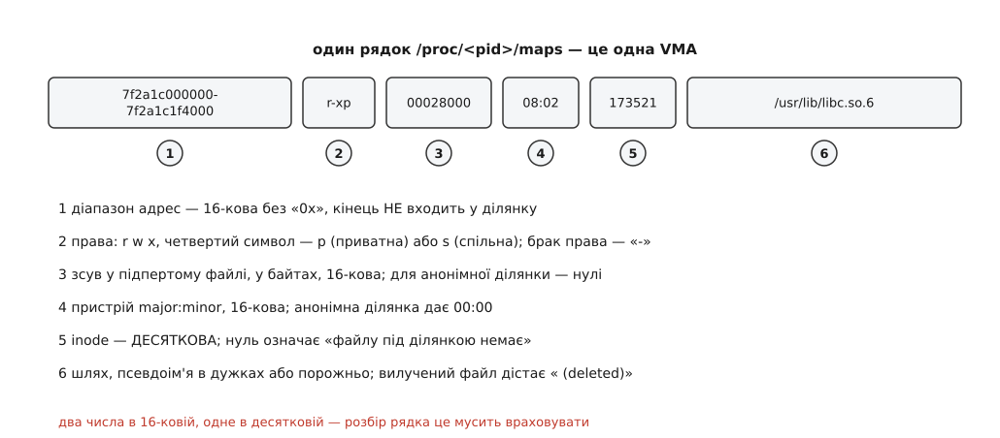
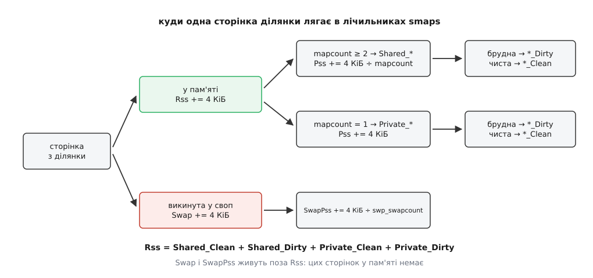

# 📋 Поля `/proc/<pid>/maps`, `smaps`, `statm` і `status`

Це довідка по байтах: що саме стоїть у кожному полі кожного з файлів, якими ядро віддає назовні адресний простір процесу, у яких одиницях, у якій системі числення і чого в цих числах немає. Потрібна вона в момент, коли треба не зрозуміти механізм, а прочитати конкретний рядок і не помилитися в тому, що він означає.

Файлів, які описують той самий предмет, п'ять, і різняться вони ціною й подробицею. Ціна тут не фігура мови: `maps` перелічує ділянки, а `smaps` на кожну ділянку обходить її таблицю сторінок, тож на процесі з тисячами відображень різниця в часі — два порядки.

| файл | що віддає | чого коштує | доступ |
|---|---|---|---|
| `/proc/<pid>/maps` | рядок на кожну VMA: межі, права, підпірка | обхід списку ділянок | `PTRACE_MODE_READ_FSCREDS` |
| `/proc/<pid>/smaps` | те саме плюс десятки лічильників сторінок на кожну ділянку | обхід **таблиці сторінок** кожної ділянки | так само |
| `/proc/<pid>/smaps_rollup` | ті самі лічильники, але одним блоком на весь процес | той самий обхід, лише без друку тисяч рядків | так само |
| `/proc/<pid>/statm` | сім чисел у сторінках | готові лічильники з `mm_struct` | читає будь-хто, кому видно процес |
| `/proc/<pid>/status` | іменовані рядки `Vm*` і `Rss*` у кілобайтах | ті самі готові лічильники | так само |
| `ioctl(fd, PROCMAP_QUERY, …)` | одну VMA у двійковій структурі | пошук по дереву ділянок, без тексту | так само |

Права доступу скрізь однакові й перевіряються режимом `PTRACE_MODE_READ_FSCREDS` — тим самим, що вирішує, чи можна причепитися до процесу зневаджувачем ([ptrace](book:unix-linux/ptrace-model) — підсистема, крізь яку один процес дістає контроль над іншим). Тобто чужий `maps` під звичайним користувачем не прочитається, навіть якщо файл видно в лістингу. `statm` і `status` цієї перевірки не вимагають узагалі — саме тому вони й лишаються єдиним джерелом чисел про чужі процеси для звичайних наглядачів.

## `/proc/<pid>/maps`: шість полів у рядку



*Дві шістнадцяткові величини поспіль, а потім десяткова — найчастіша причина, чому саморобний розбирач рядка дає нісенітницю на inode.*

| поле | приклад | формат | що означає |
|---|---|---|---|
| діапазон | `7f2a1c000000-7f2a1c1f4000` | 16-кова, **без** `0x`, ширина щонайменше 8 знаків | півінтервал: перший байт ділянки й перший байт **за** нею; довжина — різниця |
| права | `r-xp` | рівно 4 символи | `r`, `w`, `x` або `-`; четвертий — `p` чи `s` |
| зсув | `00028000` | 16-кова | зсув початку ділянки в підпертому файлі, у байтах; для анонімної — нулі |
| пристрій | `08:02` | 16-кова, `major:minor` | пристрій, на якому лежить файл; анонімна ділянка дає `00:00` |
| inode | `173521` | **десяткова** | номер вузла файлу; `0` означає «файлу під ділянкою немає» |
| шлях | `/usr/lib/libc.so.6` | текст або порожньо | файл, псевдоім'я в дужках або нічого |

Три речі в цьому рядку виглядають простішими, ніж вони є.

**Четвертий символ прав — не про поточний стан, а про природу ділянки.** Ядро друкує `s`, якщо у VMA стоїть прапорець `VM_MAYSHARE`, тобто якщо ділянку створено з `MAP_SHARED`. Приватне відображення файлу — це `p`, і саме `p` означає копіювання при записі: перший запис у сторінку віддасть процесові приватну копію ([копіювання при записі](book:unix-linux/copy-on-write) — сторінку віддають у спільне читання, а роздвоюють лише в мить першого запису). Тому `p` на відображеній бібліотеці не суперечить тому, що її код фізично спільний для всіх процесів: спільний він доти, доки ніхто в нього не пише.

**Порожній шлях означає анонімну ділянку**, але не навпаки: анонімна ділянка може мати ім'я в дужках. З ядра 5.17 працює `prctl(PR_SET_VMA, PR_SET_VMA_ANON_NAME, …)` — програма сама називає свою анонімну ділянку, і в `maps` з'являється `[anon:назва]`; з 6.2 те саме є для спільних анонімних відображень у вигляді `[anon_shmem:назва]`. Алокатори й рушії мов цим користуються, щоб у зведенні по пам'яті було видно, чия саме це купа.

**Суфікс ` (deleted)`** дописує не код `maps`, а спільний шар друку шляхів: файл, який уже вилучено з каталогу, поки процес тримає його відображеним, віддається саме так. На практиці це найшвидший спосіб побачити, що на машині оновили пакет, а служба досі виконує стару бібліотеку.

### Псевдоімена в дужках

| ім'я | звідки береться | що це |
|---|---|---|
| `[heap]` | загальний код `procfs` | ділянка, межу якої зсуває `brk`; велике виділення сучасний алокатор бере не тут ([звідки алокатор бере пам'ять](book:unix-linux/allocator-and-kernel) — чому `malloc` для великих запитів іде в `mmap`, а не в `brk`) |
| `[stack]` | загальний код `procfs` | стек **початкового** потоку; стеки решти потоків — звичайні безіменні анонімні ділянки |
| `[vdso]` | код архітектури | сторінка з кодом, яку ядро кладе в кожен процес ([vDSO](book:unix-linux/vdso) — частина «системних викликів», що виконується без переходу в ядро) |
| `[anon:назва]` | `prctl`, з 5.17 | приватна анонімна ділянка, названа самою програмою |
| `[anon_shmem:назва]` | `prctl`, з 6.2 | те саме для спільної анонімної |

Перші п'ять імен описано в документації ядра. Решта дужкових імен приходить із функції `arch_vma_name()`, тобто залежить від архітектури: на x86-64 це `[vvar]` для сторінок даних vDSO і `[vsyscall]` для реліктової сторінки старого механізму викликів. Покладатися на них у переносному коді не варто — на іншій архітектурі їх просто немає.

Окремо варто знати про ім'я, якого більше нема: до ядра 4.5 стеки потоків позначалися як `[stack:tid]`. Обчислення цього поля вимагало обходу всіх задач процесу на кожен рядок і робило читання `maps` квадратичним, тож його прибрали. Код, що шукає стек потоку за псевдоім'ям, на сучасних ядрах не знайде нічого.

## `/proc/<pid>/smaps`: блок лічильників на кожну ділянку

Той самий рядок `maps` плюс під ним блок «скільки цієї ділянки насправді існує». Одиниця скрізь — кілобайт, і винятків з цього рівно два: `THPeligible` (нуль або одиниця) і `VmFlags` (літери).

Щоб таблиця нижче читалася, треба знати одну величину — `mapcount` сторінки: скільки таблиць сторінок зараз посилаються на цей фізичний кадр. Ядро тримає її в описі кадру саме для такого обліку.



*Кожна резидентна сторінка потрапляє рівно в один із чотирьох кошиків Shared/Private × Clean/Dirty — тому їхня сума завжди дорівнює `Rss`.*

| рядок | що рахує | на що звернути увагу |
|---|---|---|
| `Size` | розмір **діапазону адрес** | те саме, що різниця меж у рядку `maps`; про пам'ять не каже нічого |
| `KernelPageSize` | розмір сторінки, якою ядро підпирає ділянку | 4 КіБ, крім hugetlb |
| `MMUPageSize` | розмір сторінки, якою її бачить апаратура | збігається з попереднім, крім рідкісних архітектур; обидва з 2.6.29 |
| `Rss` | скільки з ділянки зараз у пам'яті | сюди входять і сторінки, спільні з іншими процесами, повним розміром |
| `Pss` | частка процесу: кожна сторінка — розмір, поділений на `mapcount` | єдине число, яке можна складати по процесах без подвійного обліку |
| `Pss_Dirty` | та сама частка, але лише по брудних сторінках | скільки процес «винен» підсистемі витіснення |
| `Shared_Clean` | сторінки з `mapcount ≥ 2`, не змінені після завантаження | код бібліотек живе тут |
| `Shared_Dirty` | сторінки з `mapcount ≥ 2`, змінені | спільні відображення й ще не роздвоєні сторінки після `fork` |
| `Private_Clean` | `mapcount = 1`, не змінена | приватне відображення файлу, яке тільки читали |
| `Private_Dirty` | `mapcount = 1`, змінена | **справжня ціна процесу**: цю пам'ять ніхто, крім свопу, не забере |
| `Referenced` | до скількох сторінок зверталися після останнього скидання | скидається записом у `/proc/<pid>/clear_refs` |
| `Anonymous` | скільки резидентних сторінок не мають файлу за собою | приватне відображення файлу після запису теж стає анонімним |
| `KSM` | скільки сторінок злито механізмом злиття однакових сторінок | нуль, поки KSM не ввімкнено ([KSM](book:unix-linux/ksm-page-merging) — ядро знаходить фізично однакові сторінки різних процесів і лишає одну на всіх) |
| `LazyFree` | сторінки, помічені `madvise(MADV_FREE)` | ядро забере їх, коли схоче; поки не забрало — вони ще резидентні |
| `AnonHugePages` | скільки ділянки лежить у прозорих великих сторінках | ([великі сторінки](book:unix-linux/huge-pages) — сторінки на 2 МіБ і більше, які скорочують промахи буфера перекладів) |
| `ShmemPmdMapped`, `FilePmdMapped` | те саме для спільної пам'яті й файлів | |
| `Shared_Hugetlb`, `Private_Hugetlb` | сторінки з окремого пулу `hugetlb` | у `Rss` і `Pss` вони **не** входять |
| `Swap` | скільки анонімних сторінок ділянки викинуто у своп | ([своп і витіснення](book:unix-linux/swap-and-reclaim) — куди ядро діває сторінки, яким бракує місця в пам'яті) |
| `SwapPss` | частка процесу у свопі, поділена на `swp_swapcount` | той самий поділ, що й для `Pss`, але за лічильником посилань на слот свопу |
| `Locked` | скільки ділянки замкнено в пам'яті `mlock` | |
| `THPeligible` | `1`, якщо ділянка взагалі придатна для прозорих великих сторінок | не число в кілобайтах |
| `ProtectionKey` | ключ захисту пам'яті ділянки | лише x86, з 4.9, і лише коли ядро зібрано з підтримкою |
| `VmFlags` | прапорці VMA двома літерами | з 3.8; список нижче |

Порядок рядків у блоці сталий, але між версіями ядра до нього додавали нові поля посередині — `Pss_Dirty`, `KSM`, `LazyFree` з'явилися пізніше за сусідів. Тому розбирач мусить шукати рядок за іменем, а не за номером; і мусить спокійно переживати незнайомі імена.

### Як із чотирьох кошиків складається `Rss`

Кожну резидентну сторінку ядро кладе рівно в один кошик: спочатку вирішує «спільна чи приватна» за `mapcount ≥ 2`, потім «брудна чи чиста» за бітом брудності. Звідси інваріант, яким варто перевіряти свої обчислення:

```
Rss = Shared_Clean + Shared_Dirty + Private_Clean + Private_Dirty
```

`Pss` рахується інакше: для кожної сторінки береться її розмір, поділений на `mapcount`, і додається до суми. Щоб поділ не з'їдав точність, ядро накопичує суму не в байтах, а в зсунутих на 12 бітів одиницях — тобто в 4096-х частках байта, — і ділить на `mapcount` уже там, а назовні віддає округлений кілобайт.

**Умова: сторінка коду libc на 4 КіБ відображена в 40 процесах; сторінка даних програми на 4 КіБ — лише в неї.**

```
код libc:    Rss += 4 КіБ
             Pss += 4 КіБ ÷ 40 = 0.1 КіБ
             mapcount = 40 ≥ 2  →  Shared_Clean += 4 КіБ

дані:        Rss += 4 КіБ
             Pss += 4 КіБ ÷ 1 = 4 КіБ
             mapcount = 1       →  Private_Dirty += 4 КіБ

сума по процесу:  Rss = 8 КіБ,  Pss = 4.1 КіБ
```

> 🔧 **Навіщо це.** Складіть `Rss` сорока процесів, що ділять між собою libc, — і ту саму бібліотеку буде враховано сорок разів; сума перевищить обсяг мікросхем на машині. Складіть їхні `Pss` — і кожен фізичний кадр буде враховано рівно один раз, бо сорок часток по 1/40 дають одиницю. Саме тому будь-яке чесне «скільки пам'яті займає ця служба» на Linux починається з `Pss`, а не з `Rss` ([облік пам'яті](book:unix-linux/memory-accounting) — які саме числа складаються, а які ні).

Зворотний бік: `Pss` — величина **не власна**. Вона змінюється, коли інший, зовсім сторонній процес відображає той самий файл, хоча в цьому процесі не сталося нічого. Число, що не залежить від сусідів, у цій таблиці одне — `Private_Dirty`.

### Літери `VmFlags`

Рядок `VmFlags` — це прапорці VMA, кожен двома літерами через пробіл. Перші чотири дублюють права з рядка `maps`, решта показують те, чого в `maps` не видно взагалі: поради `madvise`, походження ділянки, поведінку при `fork`.

| код | що означає | код | що означає |
|---|---|---|---|
| `rd` | читання дозволено | `sr` | порада «читатиму послідовно» |
| `wr` | запис дозволено | `rr` | порада «читатиму випадково» |
| `ex` | виконання дозволено | `dc` | не копіювати ділянку при `fork` (`MADV_DONTFORK`) |
| `sh` | ділянка спільна | `de` | не розширювати при `mremap` |
| `mr` | читання можна буде дозволити через `mprotect` | `ac` | ділянка враховується в обмеженні надлишкових обіцянок |
| `mw` | те саме про запис | `nr` | місце у свопі під ділянку не зарезервовано |
| `me` | те саме про виконання | `ht` | ділянка на сторінках `hugetlb` |
| `ms` | ділянку можна зробити спільною | `sf` | синхронні сторінкові збої (з 4.15) |
| `gd` | стекова ділянка, росте вниз | `ar` | прапорець, специфічний для архітектури |
| `pf` | чистий діапазон номерів кадрів, без структур сторінок | `wf` | затерти вміст у нащадка після `fork` (`MADV_WIPEONFORK`, з 4.14) |
| `dw` | запис у підпертий файл заборонено (до 5.15) | `dd` | не включати ділянку в дамп пам'яті |
| `lo` | сторінки замкнені в пам'яті | `sd` | увімкнено відстеження «м'якої брудності» (з 3.13) |
| `io` | ділянка відображеного вводу-виводу | `mm` | змішана ділянка |
| `hg`, `nh` | поради «давай великі сторінки» / «не давай» | `mg` | ділянка дозволена до злиття механізмом KSM |
| `um` | ділянку стежить `userfaultfd` на брак сторінок (з 4.3) | `uw` | те саме на запис (з 4.3) |

Четвірка `rd wr ex sh` і четвірка `mr mw me ms` розрізняються тонко, зате важливо: перші — це права **зараз**, другі — це стеля, вище якої `mprotect` підняти права не зможе. Приватне відображення файлу, відкритого лише на читання, матиме `mw`, бо писати в приватну копію можна; спільне відображення того самого файлу `mw` не матиме, бо це означало б запис у файл без права на нього.

Дві літери з цієї таблиці — історичні. Код `nl` (нелінійне відображення) трапляється в старих статтях і старих ядрах; сам механізм прибрано в 4.0. Код `dw` зник разом із прапорцем `VM_DENYWRITE` у 5.15, коли заборону писати в підпертий файл переробили на виключне відкриття файлу. На сучасній системі жодної з цих двох літер у виводі не буде.

## `/proc/<pid>/smaps_rollup`

З'явився в ядрі 4.14 (патч Даніеля Колашоне, вересень 2017) з простої причини: наглядачі за пам'яттю читали весь `smaps` тільки для того, щоб додати числа й викинути рядки. Файл віддає ті самі лічильники, вже підсумовані по всіх ділянках процесу, — одним блоком.

```
00400000-7fff8d1c2000 ---p 00000000 00:00 0                  [rollup]
Rss:               84920 kB
Pss:               31204 kB
Pss_Anon:          22980 kB
Pss_File:           7128 kB
Pss_Shmem:          1096 kB
...
```

Перший рядок навмисно фальшивий: діапазон охоплює від першої ділянки до останньої, права стоять порожні, а замість шляху — маркер `[rollup]`. Трьох рядків `Pss_Anon`, `Pss_File`, `Pss_Shmem`, яких немає в самому `smaps`, тут вистачає, щоб одразу побачити, чого саме процес наїв: власних даних, відображених файлів чи спільної пам'яті.

Чого це **не** дає: обхід таблиць сторінок нікуди не подівся, тож на процесі з великою резидентною пам'яттю читання так само коштує часу й так само тримає блокування простору. Дешевшає лише друк і розбір.

## `/proc/<pid>/statm`

Сім чисел через пробіл, **у сторінках**, не в кілобайтах. Розмір сторінки беруть із `sysconf(_SC_PAGESIZE)`, а не припускають.

| № | ім'я | звідки | що це насправді |
|---|---|---|---|
| 1 | `size` | `mm->total_vm` | увесь **простір адрес**; збігається з `VmSize` |
| 2 | `resident` | файлові + спільні + анонімні резидентні | збігається з `VmRSS` |
| 3 | `shared` | `MM_FILEPAGES + MM_SHMEMPAGES` | ім'я бреше: це резидентні сторінки з файлів і спільної пам'яті, **байдуже, спільні вони чи ні** |
| 4 | `text` | вирівняний діапазон коду | **простір** під кодом, а не резидентна його частина |
| 5 | `lib` | завжди `0` | у коді ядра стоїть буквальна константа |
| 6 | `data` | `mm->data_vm + mm->stack_vm` | знову **простір**, а не пам'ять: `VmData + VmStk` |
| 7 | `dt` | завжди `0` | так само константа |

Отже, файл змішує одиниці сенсу: поля 1, 4 і 6 говорять про обіцяний простір, поле 2 — про справжню пам'ять, поле 3 — теж про пам'ять, але під назвою, що збиває з пантелику. Читати `statm` як «скільки пам'яті» можна лише в полі 2.

Приваба `statm` в іншому: жодного обходу таблиць сторінок тут немає, числа беруться з готових лічильників, тож читання коштує майже нічого. Наглядач, що опитує тисячу процесів щосекунди, живе саме на цьому файлі.

## `/proc/<pid>/status`: рядки `Vm*` і `Rss*`

Ті самі лічильники з іменами, у кілобайтах, у сталому порядку.

| рядок | що показує |
|---|---|
| `VmPeak` | найбільший розмір простору за все життя процесу |
| `VmSize` | розмір простору зараз |
| `VmLck` | скільки замкнено `mlock` |
| `VmPin` | скільки закріплено ядром і не може бути переміщено |
| `VmHWM` | **найбільший `VmRSS` за все життя** — те, чого не видно в жодному миттєвому вимірі |
| `VmRSS` | резидентна пам'ять зараз |
| `RssAnon` | з неї — анонімна |
| `RssFile` | з неї — відображені файли |
| `RssShmem` | з неї — спільна пам'ять: System V shm, tmpfs, спільні анонімні відображення |
| `VmData` | простір під приватними даними |
| `VmStk` | простір під стеками |
| `VmExe` | простір під кодом |
| `VmLib` | простір під кодом бібліотек |
| `VmPTE` | скільки пам'яті з'їли **самі таблиці сторінок** цього процесу |
| `VmSwap` | скільки анонімних сторінок процесу лежить у свопі; спільна пам'ять сюди не входить |

Два інваріанти, якими варто звірятися:

```
VmRSS  = RssAnon + RssFile + RssShmem
VmHWM ≥ VmRSS,  VmPeak ≥ VmSize        (обидва — водяні знаки, вниз не йдуть)
```

`VmHWM` заслуговує окремої уваги: це єдине в усьому наборі число, яке пам'ятає минуле. Процес, що на мить узяв два гігабайти й одразу віддав, у `VmRSS` виглядатиме скромно, а в `VmHWM` покаже ті два гігабайти — і саме вони пояснять, чому [винищувач при браку пам'яті](book:unix-linux/overcommit-and-oom) обрав його, а не сусіда. Скинути водяний знак можна записом `5` у `/proc/<pid>/clear_refs`.

`VmPTE` варте уваги з іншої причини: таблиці сторінок — теж пам'ять, і на процесі, що розкидав відображення по всьому простору, вони самі виростають у сотні мегабайтів. Це та витрата, якої немає в жодному `Rss`.

## Читання нестале за побудовою

Головне застереження до всіх текстових файлів вище: **знімка вони не дають**. Документація ядра каже про це прямо — читання `maps` чи `smaps` за самою природою вразливе до перегонів, і сталий вивід можливий лише в межах одного виклику `read()`.

Механізм простий. Файл віддається шаром `seq_file` порціями; на кожній порції ядро бере блокування простору, друкує кілька ділянок, відпускає блокування й запам'ятовує адресу, з якої продовжить. Між порціями процес живе своїм життям: викликає `mmap`, `munmap`, `mprotect` ([що саме роблять ці три виклики](book:unix-linux/mmap-model) — програма редагує список ділянок, і лише його). Тому читач може побачити ділянку двічі, не побачити зовсім або дістати два рядки, які ніколи не існували одночасно.

Дві гарантії, однак, ядро тримає:

- адреси у виводі ніколи не йдуть назад — послідовність монотонна;
- якщо ділянка існувала за своєю адресою **весь час** обходу, рядок про неї буде.

Коли цього замало, з ядра 6.11 є двійковий шлях: `ioctl` на дескрипторі `/proc/<pid>/maps` (реалізація Андрія Накрийка, липень 2024). Він віддає **одну** ділянку за один виклик, узгоджену саму з собою, без друку й розбору тексту.

:::tabs
```c
#define PROCMAP_QUERY   _IOWR(PROCFS_IOCTL_MAGIC, 17, struct procmap_query)
```
```cpp
#define PROCMAP_QUERY   _IOWR(PROCFS_IOCTL_MAGIC, 17, struct procmap_query)
```
:::

| прапорець `query_flags` | що робить |
|---|---|
| `PROCMAP_QUERY_VMA_READABLE` | брати лише ділянки, доступні на читання |
| `PROCMAP_QUERY_VMA_WRITABLE` | лише доступні на запис |
| `PROCMAP_QUERY_VMA_EXECUTABLE` | лише виконувані |
| `PROCMAP_QUERY_VMA_SHARED` | лише спільні |
| `PROCMAP_QUERY_COVERING_OR_NEXT_VMA` | якщо в `query_addr` ділянки немає — віддати наступну за адресою |
| `PROCMAP_QUERY_FILE_BACKED_VMA` | лише підперті файлом |

Ті самі перші чотири біти повертаються у полі `vma_flags` — тобто вхідний фільтр і вихідний опис говорять однією мовою.

| поле `struct procmap_query` | напрям | що це |
|---|---|---|
| `size` | вхід | `sizeof(struct procmap_query)` — так ядро розуміє, з якою версією структури має справу |
| `query_flags` | вхід | набір прапорців вище |
| `query_addr` | вхід | адреса, ділянку навколо якої шукаємо |
| `vma_start`, `vma_end` | вихід | межі знайденої ділянки |
| `vma_flags` | вихід | права й спільність |
| `vma_page_size` | вихід | розмір сторінки ділянки |
| `vma_offset` | вихід | зсув у підпертому файлі |
| `inode`, `dev_major`, `dev_minor` | вихід | ідентифікація файлу |
| `vma_name_addr`, `vma_name_size` | вхід/вихід | буфер під шлях або псевдоім'я; на виході — скільки байтів записано |
| `build_id_addr`, `build_id_size` | вхід/вихід | те саме для ідентифікатора збірки ELF ([ELF](book:unix-linux/elf-structure) — формат виконуваних файлів; ідентифікатор збірки лежить у ньому окремою нотаткою) |

Поле `size` — не формальність, а весь механізм сумісності: структура росте від версії до версії, і ядро за розміром вирішує, скільки полів заповнювати. Тому обнуляти всю структуру перед викликом обов'язково.

## Мінімальний робочий виклик

Знайти ділянку, що покриває задану адресу, — або першу за нею, якщо в самій адресі порожньо. Мова тут не вибирається: інтерфейс двійковий, структура описана в заголовку ядра, і будь-який інший шлях звівся б до ручного пакування байтів.

:::tabs
```c
#define _GNU_SOURCE
#include <fcntl.h>
#include <linux/fs.h>
#include <stdint.h>
#include <stdio.h>
#include <stdlib.h>
#include <string.h>
#include <sys/ioctl.h>
#include <unistd.h>

int main(int argc, char **argv)
{
    if (argc != 3) {
        fprintf(stderr, "вжиток: %s <pid> <адреса-16>\n", argv[0]);
        return 2;
    }

    char path[64];
    snprintf(path, sizeof path, "/proc/%s/maps", argv[1]);

    int fd = open(path, O_RDONLY | O_CLOEXEC);
    if (fd < 0) {
        perror(path);
        return 1;
    }

    char name[256] = "";
    struct procmap_query q;

    memset(&q, 0, sizeof q);          /* обнулити ОБОВ'ЯЗКОВО: структура росте */
    q.size          = sizeof q;       /* за цим числом ядро добирає набір полів */
    q.query_addr    = strtoull(argv[2], NULL, 16);
    q.query_flags   = PROCMAP_QUERY_COVERING_OR_NEXT_VMA;
    q.vma_name_addr = (uint64_t)(uintptr_t)name;
    q.vma_name_size = sizeof name;

    if (ioctl(fd, PROCMAP_QUERY, &q) < 0) {
        perror("PROCMAP_QUERY");      /* ENOENT — жодної ділянки за цією адресою */
        close(fd);
        return 1;
    }

    printf("%llx-%llx %c%c%c%c зсув %llx  %x:%x  inode %llu  %s\n",
           (unsigned long long)q.vma_start,
           (unsigned long long)q.vma_end,
           q.vma_flags & PROCMAP_QUERY_VMA_READABLE   ? 'r' : '-',
           q.vma_flags & PROCMAP_QUERY_VMA_WRITABLE   ? 'w' : '-',
           q.vma_flags & PROCMAP_QUERY_VMA_EXECUTABLE ? 'x' : '-',
           q.vma_flags & PROCMAP_QUERY_VMA_SHARED     ? 's' : 'p',
           (unsigned long long)q.vma_offset,
           q.dev_major, q.dev_minor,
           (unsigned long long)q.inode,
           q.vma_name_size ? name : "");   /* нуль на виході = імені немає */

    close(fd);
    return 0;
}
```
```cpp
#include <fcntl.h>
#include <linux/fs.h>
#include <cstdint>
#include <cstdio>
#include <cstdlib>
#include <cstring>
#include <iostream>
#include <string>
#include <sys/ioctl.h>
#include <unistd.h>

class FileDescriptor {
    int fd_{-1};
public:
    explicit FileDescriptor(int fd) : fd_{fd} {}
    ~FileDescriptor() { if (fd_ >= 0) ::close(fd_); }
    FileDescriptor(const FileDescriptor&) = delete;
    FileDescriptor& operator=(const FileDescriptor&) = delete;
    FileDescriptor(FileDescriptor&& o) noexcept : fd_{o.fd_} { o.fd_ = -1; }
    FileDescriptor& operator=(FileDescriptor&& o) noexcept {
        if (this != &o) {
            if (fd_ >= 0) ::close(fd_);
            fd_ = o.fd_;
            o.fd_ = -1;
        }
        return *this;
    }
    [[nodiscard]] int get() const { return fd_; }
    [[nodiscard]] bool valid() const { return fd_ >= 0; }
};

int main(int argc, char** argv) {
    if (argc != 3) {
        std::cerr << "вжиток: " << argv[0] << " <pid> <адреса-16>\n";
        return 2;
    }

    std::string path = std::string("/proc/") + argv[1] + "/maps";
    FileDescriptor fd{::open(path.c_str(), O_RDONLY | O_CLOEXEC)};
    if (!fd.valid()) {
        std::perror(path.c_str());
        return 1;
    }

    char name[256] = "";
    struct procmap_query q{};

    q.size          = sizeof(q);
    q.query_addr    = std::strtoull(argv[2], nullptr, 16);
    q.query_flags   = PROCMAP_QUERY_COVERING_OR_NEXT_VMA;
    q.vma_name_addr = static_cast<std::uint64_t>(reinterpret_cast<std::uintptr_t>(name));
    q.vma_name_size = sizeof(name);

    if (::ioctl(fd.get(), PROCMAP_QUERY, &q) < 0) {
        std::perror("PROCMAP_QUERY");
        return 1;
    }

    std::cout << std::hex << q.vma_start << '-' << q.vma_end << ' '
              << (q.vma_flags & PROCMAP_QUERY_VMA_READABLE   ? 'r' : '-')
              << (q.vma_flags & PROCMAP_QUERY_VMA_WRITABLE   ? 'w' : '-')
              << (q.vma_flags & PROCMAP_QUERY_VMA_EXECUTABLE ? 'x' : '-')
              << (q.vma_flags & PROCMAP_QUERY_VMA_SHARED     ? 's' : 'p')
              << " зсув " << q.vma_offset << "  "
              << q.dev_major << ':' << q.dev_minor << "  "
              << std::dec << "inode " << q.inode << "  "
              << (q.vma_name_size ? name : "") << '\n';

    return 0;
}
```
:::

Обхід усього простору робиться тим самим викликом у циклі: після кожної відповіді покласти `query_addr = q.vma_end` і повторити, доки `ioctl` не поверне `ENOENT`. Кожна відповідь узгоджена сама з собою, хоча картина в цілому так само може змінитися між кроками — сталого знімка адресного простору живого процесу ядро не дає жодним інтерфейсом.

Готові рецепти на текстових файлах, коли писати код зайве:

| що потрібно | команда |
|---|---|
| чесний розмір процесу однією цифрою | `awk '/^Pss:/{s+=$2} END{print s" kB"}' /proc/1234/smaps` |
| те саме, дешевше | `grep ^Pss: /proc/1234/smaps_rollup` |
| пам'ять, яку не забере ніхто, крім свопу | `awk '/^Private_Dirty:/{s+=$2} END{print s" kB"}' /proc/1234/smaps` |
| пік резидентної пам'яті за все життя | `grep VmHWM /proc/1234/status` |
| найбільші ділянки процесу (потрібен `gawk` — за 16-кову відповідає `strtonum`) | `gawk '{split($1,a,"-"); printf "%10d КіБ %s\n", (strtonum("0x"a[2])-strtonum("0x"a[1]))/1024, $6}' /proc/1234/maps \| sort -rn \| head` |
| чи виконує служба вилучену бібліотеку | `grep '(deleted)' /proc/1234/maps` |
| скільки з'їли самі таблиці сторінок | `grep VmPTE /proc/1234/status` |

Останній рядок таблиці найкоротший і найчастіше найкорисніший: там, де сума `Rss` усіх процесів не сходиться з тим, що показує система, різницю зазвичай пояснює саме те, чого в `Rss` немає, — таблиці сторінок, сторінковий кеш і пул великих сторінок.
