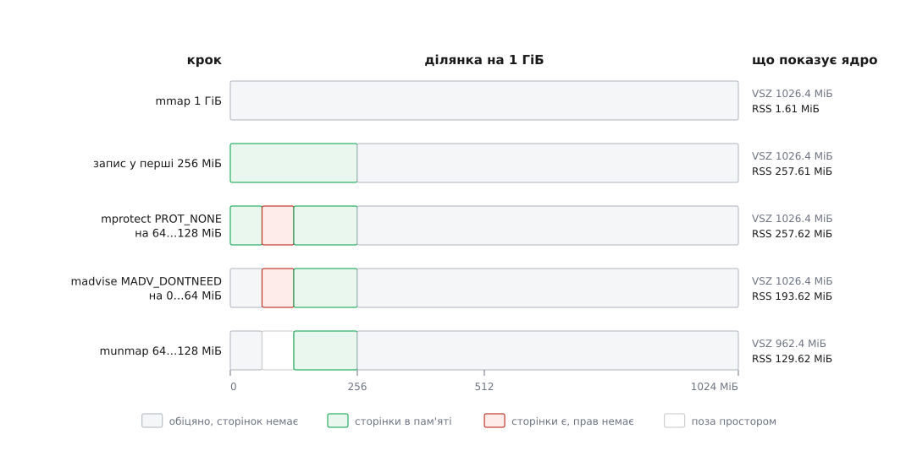

# ⚙️ Прогулянка власним адресним простором: гігабайт, який нічого не важить

Одна програма мовою C, яка бере в ядра гігабайт і показує, що він нічого не коштує, поки до нього не торкнешся; потім платить за нього сторінка за сторінкою; потім забирає в себе право доступу, не повернувши жодного байта; потім повертає байти, не втративши права; і двічі ловить `SIGSEGV` за однією й тією самою адресою — з двох різних причин, які ядро називає вголос.

<preknowlist>
- [mmap: файл і пам'ять як одне](topic:unix-linux/mmap-model) — системний виклик, яким процес просить у ядра діапазон адрес із заданими правами.
- [Сторінковий збій](topic:unix-linux/page-fault) — апаратна подія, коли звернення пішло за адресою, для якої готового відображення немає; далі вирішує ядро.
- [Сигнал](topic:unix-linux/signal-model) — спосіб, яким ядро повідомляє процес про подію, зокрема про його власну фатальну помилку.
- [/proc: процеси як файли](topic:unix-linux/proc-filesystem) — ядро віддає власний облік процесу у вигляді звичайних файлів, які можна просто прочитати.
- [Як міряти пам'ять процесу: VSZ, RSS, PSS](topic:unix-linux/memory-accounting) — що саме означає кожен зі стовпчиків, які показує `ps`.
</preknowlist>

Потрібні лише Linux, `gcc` і звичайний користувач. Збирається одним рядком `gcc -O2 -o aspace aspace.c`, нічого не псує, машині не шкодить: гігабайт, який програма бере, майже весь час лишається обіцянкою й не витісняє нічого справжнього.

## Задача

Взяти чотири системні виклики — `mmap`, `mprotect`, `madvise`, `munmap` — і для кожного відповісти на одне питання: **що саме він змінив**. Не «виділив пам'ять» чи «звільнив пам'ять», а котре з двох чисел зрушив і на скільки.

Питання не риторичне. Слова «виділити» й «звільнити» звучать так, ніби існує одна величина, яку виклик збільшує або зменшує. Насправді величин дві, вони незалежні, і кожен із чотирьох викликів чіпає рівно одну з них. Поки ці дві величини змішані в голові в одну, поведінка `mprotect` і `madvise` виглядає свавіллям; коли розділені — стає єдино можливою.

## Ідея

Ядро саме веде обидва рахунки й обидва віддає через `/proc`.

Перший — **сума довжин усіх ділянок**: скільки адрес процесові обіцяно. Це `VmSize`, той самий, що `ps` показує в стовпчику VSZ. Другий — **скільки сторінок під цими адресами справді лежить у пам'яті**: `VmRSS`, він же RSS. Обидва є в одному рядку файла `/proc/self/statm`, першим і другим числом, і обидва — **в сторінках**, не в байтах.

Поряд лежить `/proc/self/maps` — той самий перший рахунок, але не підсумком, а поіменно: рядок на ділянку, з межами й правами.

Отже, план такий: після кожного виклику друкувати обидва числа й, де це цікаво, ще й перелік ділянок. Передбачення виходить таке:

```
                                VSZ (обіцяне)   RSS (втілене)
mmap 1 ГіБ                          +1024 МіБ            0
читання незайманої сторінки                 0            0
запис у незайману сторінку                  0     +1 сторінка
mprotect PROT_NONE на 64 МіБ                0            0
madvise MADV_DONTNEED на 64 МіБ             0      −16384 стор.
munmap 64 МіБ                        −64 МіБ      −16384 стор.
```

Три з шести рядків тут виглядають дивно, і саме заради них варто писати програму. Читання незайманої сторінки нічого не коштує — не «майже нічого», а рівно нуль кадрів. `mprotect(PROT_NONE)` забирає всякий доступ і не звільняє ані сторінки. `madvise(MADV_DONTNEED)` звільняє всі сторінки й не забирає жодної адреси.

Лишається четверте питання, на яке числа не відповідають: що станеться, коли звернутися туди, куди тепер не можна. Тому програма ще й ловить `SIGSEGV` — і не просто ловить, а друкує адресу, яка його спричинила, разом із причиною.

## Вимір: два числа й перелік ділянок

Обидві допоміжні функції короткі, бо вся робота вже зроблена ядром — лишається прочитати.

:::tabs
```c
/* aspace.c — прогулянка власним адресним простором.
 * gcc -O2 -o aspace aspace.c        запуск: ./aspace
 */
#define _GNU_SOURCE
#include <stdio.h>
#include <string.h>
#include <unistd.h>
#include <fcntl.h>
#include <setjmp.h>
#include <signal.h>
#include <sys/mman.h>

#define MIB (1024UL * 1024)
static unsigned long PAGE;

/* Два перші числа з /proc/self/statm — VmSize і VmRSS, обидва в СТОРІНКАХ. */
static void show(const char *what)
{
    char buf[128];
    unsigned long vsz = 0, rss = 0;
    int fd = open("/proc/self/statm", O_RDONLY);
    if (fd >= 0) {
        ssize_t n = read(fd, buf, sizeof buf - 1);
        close(fd);
        if (n > 0) { buf[n] = '\0'; sscanf(buf, "%lu %lu", &vsz, &rss); }
    }
    /* мітку друкуємо ОСТАННЬОЮ: ширину поля лічать у байтах, а кирилиця
       в UTF-8 займає по два — вирівняти можна лише те, що ліворуч від неї */
    printf("VSZ %8.1f МіБ   RSS %8.2f МіБ (%6lu стор.)   %s\n",
           (double) vsz * PAGE / MIB, (double) rss * PAGE / MIB, rss, what);
}

/* Ті рядки /proc/self/maps, що описують саме нашу ділянку. */
static void maps(const char *what, char *lo, char *hi)
{
    printf("--- /proc/self/maps, %s\n", what);
    FILE *f = fopen("/proc/self/maps", "r");
    if (!f) return;
    char line[512];
    unsigned long a, b;
    while (fgets(line, sizeof line, f))
        if (sscanf(line, "%lx-%lx", &a, &b) == 2 &&
            a < (unsigned long) hi && b > (unsigned long) lo)
            fputs(line, stdout);
    fclose(f);
}
```
```cpp
/* aspace.cpp — прогулянка власним адресним простором (C++ версія).
 * g++ -O2 -std=c++20 -o aspace aspace.cpp    запуск: ./aspace
 */
#define _GNU_SOURCE
#include <fcntl.h>
#include <setjmp.h>
#include <signal.h>
#include <sys/mman.h>
#include <unistd.h>

#include <cstdint>
#include <cstdio>
#include <cstring>
#include <fstream>
#include <iomanip>
#include <iostream>
#include <string>
#include <string_view>

constexpr unsigned long MIB = 1024UL * 1024UL;
static unsigned long PAGE = 4096;

static void show(std::string_view what)
{
    unsigned long vsz = 0, rss = 0;
    if (std::ifstream statm{"/proc/self/statm"}) {
        statm >> vsz >> rss;
    }
    std::cout << "VSZ " << std::setw(8) << std::fixed << std::setprecision(1)
              << (static_cast<double>(vsz) * PAGE / MIB) << " МіБ   RSS "
              << std::setw(8) << std::setprecision(2)
              << (static_cast<double>(rss) * PAGE / MIB) << " МіБ ("
              << std::setw(6) << rss << " стор.)   " << what << '\n';
}

static void maps(std::string_view what, const char* lo, const char* hi)
{
    std::cout << "--- /proc/self/maps, " << what << '\n';
    std::ifstream f{"/proc/self/maps"};
    if (!f) return;
    std::string line;
    const auto lo_addr = reinterpret_cast<std::uintptr_t>(lo);
    const auto hi_addr = reinterpret_cast<std::uintptr_t>(hi);
    while (std::getline(f, line)) {
        std::uintptr_t a = 0, b = 0;
        if (std::sscanf(line.c_str(), "%lx-%lx", &a, &b) == 2 &&
            a < hi_addr && b > lo_addr) {
            std::cout << line << '\n';
        }
    }
}
```
:::

Одна дрібниця в `show` варта уваги, бо на ній ловляться: у `statm` сім чисел, і жодне з них не в байтах. Помножити на розмір сторінки треба обидва, і розмір сторінки треба брати в системи (`sysconf(_SC_PAGESIZE)`), а не вписувати 4096 — на aarch64 нерідко 16 КіБ, і вся арифметика поїде вчетверо.

## Обробник, якому дозволено майже нічого

Тепер найтонша частина. Ми хочемо, щоб програма пережила власний `SIGSEGV` і сказала, за якою адресою впала. Обидві вимоги тягнуть за собою наслідки.

Щоб дістати адресу, обробник має бути зареєстрований із прапорцем `SA_SIGINFO`: тоді ядро викликає не однопараметрову функцію, а тричленну, і другим параметром передає `siginfo_t`. Для `SIGSEGV` там є поле `si_addr` — адреса, за якою звернулися, — і поле `si_code`, яке називає **причину**: `SEGV_MAPERR`, коли за адресою немає жодної ділянки, і `SEGV_ACCERR`, коли ділянка є, а прав бракує.

Щоб пережити падіння, обробник не має права просто повернутися. Повернення з обробника означає, що апаратура повторить ту саму команду — з тим самим результатом, і так до кінця світу. Вихід один: вистрибнути з обробника в наперед позначену точку, тобто `siglongjmp` ([нелокальний перехід](topic:programming/nonlocal-jump)).

І, нарешті, обробник не має права друкувати через `printf`. Причина не в примхливості стандарту, і про неї — нижче в пастках; тут досить наслідку: рядок доводиться складати вручну й віддавати одним `write`.

:::tabs
```c
static sigjmp_buf back;
static volatile sig_atomic_t repair;   /* 1 — полагодити сторінку й повернутися */

static void on_segv(int sig, siginfo_t *si, void *uc)
{
    (void) sig; (void) uc;

    /* stdio тут заборонено — складаємо рядок самі й віддаємо одним write */
    const char *tag = si->si_code == SEGV_ACCERR ? "  ACCERR @ 0x" :
                      si->si_code == SEGV_MAPERR ? "  MAPERR @ 0x" :
                                                   "  ?????? @ 0x";
    char out[40];
    int n = 0;
    while (tag[n]) { out[n] = tag[n]; n++; }
    unsigned long a = (unsigned long) si->si_addr;
    for (int sh = 44; sh >= 0; sh -= 4)          /* 12 шістнадцяткових цифр */
        out[n++] = "0123456789abcdef"[(a >> sh) & 0xf];
    out[n++] = '\n';
    ssize_t w = write(1, out, n); (void) w;

    if (repair) {
        /* повернути права саме тій сторінці — і вийти з обробника звичайно:
           апаратура повторить ту саму команду, і цього разу вона пройде */
        mprotect((void *) (a & ~(PAGE - 1)), PAGE, PROT_READ | PROT_WRITE);
        return;
    }
    siglongjmp(back, 1);
}

/* Одна проба: звернутися за адресою й вижити, хоч би що там було. */
static void probe(char *addr)
{
    if (sigsetjmp(back, 1) == 0) {          /* 1 — зберегти маску сигналів */
        volatile char c = *addr;
        printf("  читання пройшло: %d\n", (int) c);
    }
}
```
```cpp
static sigjmp_buf back;
static volatile sig_atomic_t repair;   /* 1 — полагодити сторінку й повернутися */

static void on_segv(int sig, siginfo_t *si, void *uc)
{
    (void) sig; (void) uc;

    /* stdio тут заборонено — складаємо рядок самі й віддаємо одним write */
    const char *tag = si->si_code == SEGV_ACCERR ? "  ACCERR @ 0x" :
                      si->si_code == SEGV_MAPERR ? "  MAPERR @ 0x" :
                                                   "  ?????? @ 0x";
    char out[40];
    int n = 0;
    while (tag[n]) { out[n] = tag[n]; n++; }
    auto a = reinterpret_cast<std::uintptr_t>(si->si_addr);
    for (int sh = 44; sh >= 0; sh -= 4)          /* 12 шістнадцяткових цифр */
        out[n++] = "0123456789abcdef"[(a >> sh) & 0xf];
    out[n++] = '\n';
    [[maybe_unused]] auto w = ::write(1, out, n);

    if (repair) {
        /* повернути права саме тій сторінці — і вийти з обробника звичайно */
        ::mprotect(reinterpret_cast<void*>(a & ~(PAGE - 1)), PAGE, PROT_READ | PROT_WRITE);
        return;
    }
    siglongjmp(back, 1);
}

static void probe(char *addr)
{
    if (sigsetjmp(back, 1) == 0) {          /* 1 — зберегти маску сигналів */
        volatile char c = *addr;
        std::cout << "  читання пройшло: " << static_cast<int>(c) << '\n';
    }
}
```
:::

Гілка `repair` — не прикраса. Обробник, який **щось змінив** у відображенні, має повне право повернутися: команда виконається знову, але тепер уже успішно, і програма нічого не помітить. На цьому механізмі тримаються бар'єри запису в збирачах сміття, ліниве завантаження сторінок у віртуальних машинах і перевірка «до цієї сторінки ще ніхто не торкався». Різниця між нескінченним циклом і корисним прийомом — рівно в тому, чи змінив обробник причину збою.

## Сама прогулянка

:::tabs
```c
int main(void)
{
    PAGE = (unsigned long) sysconf(_SC_PAGESIZE);
    const unsigned long LEN = 1024 * MIB;

    struct sigaction sa;
    memset(&sa, 0, sizeof sa);
    sa.sa_sigaction = on_segv;
    sa.sa_flags = SA_SIGINFO;        /* хочемо siginfo_t, а не самий номер */
    sigemptyset(&sa.sa_mask);
    sigaction(SIGSEGV, &sa, NULL);

    show("старт");

    char *p = mmap(NULL, LEN, PROT_READ | PROT_WRITE,
                   MAP_PRIVATE | MAP_ANONYMOUS, -1, 0);
    if (p == MAP_FAILED) { perror("mmap"); return 1; }
    show("mmap 1 ГіБ");

    volatile unsigned long acc = 0;
    for (unsigned long i = 0; i < 256 * MIB; i += PAGE) acc += p[i];
    show("прочитано 65536 сторінок");

    for (unsigned long i = 0; i < 256 * MIB; i += PAGE) p[i] = 0x5a;
    show("записано в 65536 сторінок");

    memset(p + 300 * MIB, 0x5a, 1000);          /* 1000 байтів ПОСПІЛЬ */
    show("записано 1000 байтів поспіль");

    char *hole = p + 64 * MIB;
    maps("до mprotect", p, p + LEN);
    mprotect(hole, 64 * MIB, PROT_NONE);
    show("mprotect PROT_NONE на 64 МіБ");
    maps("після mprotect", p, p + LEN);
    probe(hole + 8);

    madvise(p, 64 * MIB, MADV_DONTNEED);
    show("madvise MADV_DONTNEED на 64 МіБ");
    printf("  p[0] = %d (записували 0x5a)\n", p[0]);
    show("після читання з відданої частини");

    munmap(hole, 64 * MIB);
    show("munmap 64 МіБ");
    maps("після munmap", p, p + LEN);
    probe(hole + 8);                            /* та сама адреса — інша причина */

    p[0] = 1;
    p[900 * MIB] = 1;
    show("торкнулися решти ділянки");

    mprotect(p + 700 * MIB, PAGE, PROT_NONE);
    repair = 1;
    p[700 * MIB] = 7;               /* впаде, полагодиться й виконається знову */
    printf("  p[700 МіБ] = %d\n", p[700 * MIB]);

    munmap(p, LEN);                 /* решта — одним махом, разом із дірою */
    show("munmap решти");
    return 0;
}
```
```cpp
int main()
{
    PAGE = static_cast<unsigned long>(::sysconf(_SC_PAGESIZE));
    const unsigned long LEN = 1024 * MIB;

    struct sigaction sa{};
    sa.sa_sigaction = on_segv;
    sa.sa_flags = SA_SIGINFO;        /* хочемо siginfo_t, а не самий номер */
    ::sigemptyset(&sa.sa_mask);
    ::sigaction(SIGSEGV, &sa, nullptr);

    show("старт");

    auto* p = static_cast<char*>(::mmap(nullptr, LEN, PROT_READ | PROT_WRITE,
                                        MAP_PRIVATE | MAP_ANONYMOUS, -1, 0));
    if (p == MAP_FAILED) { std::perror("mmap"); return 1; }
    show("mmap 1 ГіБ");

    volatile unsigned long acc = 0;
    for (unsigned long i = 0; i < 256 * MIB; i += PAGE) acc += p[i];
    show("прочитано 65536 сторінок");

    for (unsigned long i = 0; i < 256 * MIB; i += PAGE) p[i] = 0x5a;
    show("записано в 65536 сторінок");

    std::memset(p + 300 * MIB, 0x5a, 1000);          /* 1000 байтів ПОСПІЛЬ */
    show("записано 1000 байтів поспіль");

    char* hole = p + 64 * MIB;
    maps("до mprotect", p, p + LEN);
    ::mprotect(hole, 64 * MIB, PROT_NONE);
    show("mprotect PROT_NONE на 64 МіБ");
    maps("після mprotect", p, p + LEN);
    probe(hole + 8);

    ::madvise(p, 64 * MIB, MADV_DONTNEED);
    show("madvise MADV_DONTNEED на 64 МіБ");
    std::cout << "  p[0] = " << static_cast<int>(p[0]) << " (записували 0x5a)\n";
    show("після читання з відданої частини");

    ::munmap(hole, 64 * MIB);
    show("munmap 64 МіБ");
    maps("після munmap", p, p + LEN);
    probe(hole + 8);                            /* та сама адреса — інша причина */

    p[0] = 1;
    p[900 * MIB] = 1;
    show("торкнулися решти ділянки");

    ::mprotect(p + 700 * MIB, PAGE, PROT_NONE);
    repair = 1;
    p[700 * MIB] = 7;               /* впаде, полагодиться й виконається знову */
    std::cout << "  p[700 МіБ] = " << static_cast<int>(p[700 * MIB]) << '\n';

    ::munmap(p, LEN);                 /* решта — одним махом, разом із дірою */
    show("munmap решти");
    return 0;
}
```
:::

Вивід з однієї конкретної машини (x86-64, сторінка 4 КіБ, типові налаштування дистрибутива):

```
$ ./aspace
VSZ      2.4 МіБ   RSS     1.61 МіБ (   412 стор.)   старт
VSZ   1026.4 МіБ   RSS     1.61 МіБ (   412 стор.)   mmap 1 ГіБ
VSZ   1026.4 МіБ   RSS     1.61 МіБ (   412 стор.)   прочитано 65536 сторінок
VSZ   1026.4 МіБ   RSS   257.61 МіБ ( 65948 стор.)   записано в 65536 сторінок
VSZ   1026.4 МіБ   RSS   257.61 МіБ ( 65949 стор.)   записано 1000 байтів поспіль
--- /proc/self/maps, до mprotect
7f2a1c000000-7f2a5c000000 rw-p 00000000 00:00 0
VSZ   1026.4 МіБ   RSS   257.62 МіБ ( 65951 стор.)   mprotect PROT_NONE на 64 МіБ
--- /proc/self/maps, після mprotect
7f2a1c000000-7f2a20000000 rw-p 00000000 00:00 0
7f2a20000000-7f2a24000000 ---p 00000000 00:00 0
7f2a24000000-7f2a5c000000 rw-p 00000000 00:00 0
  ACCERR @ 0x7f2a20000008
VSZ   1026.4 МіБ   RSS   193.62 МіБ ( 49567 стор.)   madvise MADV_DONTNEED на 64 МіБ
  p[0] = 0 (записували 0x5a)
VSZ   1026.4 МіБ   RSS   193.62 МіБ ( 49567 стор.)   після читання з відданої частини
VSZ    962.4 МіБ   RSS   129.62 МіБ ( 33183 стор.)   munmap 64 МіБ
--- /proc/self/maps, після munmap
7f2a1c000000-7f2a20000000 rw-p 00000000 00:00 0
7f2a24000000-7f2a5c000000 rw-p 00000000 00:00 0
  MAPERR @ 0x7f2a20000008
VSZ    962.4 МіБ   RSS   129.63 МіБ ( 33185 стор.)   торкнулися решти ділянки
  ACCERR @ 0x7f2a47c00000
  p[700 МіБ] = 7
VSZ      2.4 МіБ   RSS     1.62 МіБ (   414 стор.)   munmap решти
```



*Кожен виклик рухає рівно одне з двох чисел — і саме те, яке рухає, і є його справжнім змістом.*

## Що надрукувалося

**Гігабайт з'явився й нічого не коштував.** VSZ підскочив рівно на 1024 МіБ, RSS не зрушив ані на сторінку. Одного цього рядка досить, щоб більше ніколи не читати VSZ як «скільки пам'яті бере програма». Гігабайт тут — це один рядок у списку ділянок ядра, і важить він приблизно двісті байтів.

**Читання не коштує кадрів.** Наступний рядок — 65536 звернень до пам'яті й нуль сторінок у RSS. Ядро не витрачає кадру на сторінку, з якої тільки читають: воно підставляє одну спільну сторінку нулів, ту саму для всіх охочих. Обіцянка «за цією адресою будуть нулі» виконується без єдиного байта пам'яті, поки хтось не спробує ті нулі змінити. Ця дрібниця пояснює, чому величезні розріджені масиви взагалі життєздатні: платить тільки той, хто пише.

**Запис коштує рівно по кадру на сторінку** — і жодного байта менше. Той самий цикл, змінений на запис, дає рівно +65536 сторінок. А наступний рядок — тонший: тисяча байтів поспіль додала **одну** сторінку. Отже, ціна вимірюється не обсягом даних, а кількістю різних сторінок, яких вони торкнулися. Тисяча байтів у тисячі різних сторінок коштувала б тисячу сторінок замість однієї — тобто в тисячу разів дорожче за ту саму тисячу байтів поспіль.

> 🔧 **Навіщо це.** Класична схема хеш-таблиці, де для мільйона ключів беруть мільйон комірок і розкидають записи по всьому діапазону, платить не за дані, а за сторінки: мільйон випадкових комірок по 8 байтів торкається майже мільйона різних сторінок, тобто вимагає близько 4 ГіБ, хоч самих даних 8 МіБ. Та сама таблиця, де записи згруповані по відрах, залишається у своїх 8 МіБ. Різниця в коді — одне множення; різниця в RSS — у п'ятсот разів.

**`mprotect(PROT_NONE)` не звільнив нічого.** RSS після нього той самий, що й до нього — з точністю до двох сторінок, які взяв собі буфер `fopen` у нашій же функції `maps`: 64 МіБ сторінок, до яких тепер не можна навіть доторкнутися, спокійно лежать у пам'яті. Забрати права й забрати пам'ять — це два різні дієслова, і `mprotect` уміє тільки перше.

Натомість `mprotect` зробив інше, і це видно в `maps`: **один рядок став трьома**. Ділянка — це діапазон адрес *з однаковими властивостями*; щойно в її середині властивості інші, ядро розрізає її на три. Символ `p` у правах — «приватна», а три прочерки в середньому рядку — це і є `PROT_NONE`: ані читати, ані писати, ані виконувати.

**`madvise(MADV_DONTNEED)` звільнив усе й не забрав нічого.** RSS упав на 16384 сторінки, VSZ не змінився, `maps` не змінився. Обіцянка ціла — сторінки під нею викинуто. Наступний рядок доводить, що обіцянка справді жива: читання `p[0]` не впало, а повернуло нуль — на місці колишнього `0x5a`. Ділянка приватна й анонімна, тож єдине, що ядро може за нею пообіцяти, — нулі; тому й повертає нулі, і знову ж таки без витрати кадру.

**`munmap` — єдиний із чотирьох, хто рухає обидва числа.** VSZ мінус 64 МіБ, RSS мінус ті самі 16384 сторінки, які `mprotect` лишив недоторканими. І в `maps` тепер два рядки з діркою між ними: `...20000000` більше не існує ні для кого.

**Найкрасивіше — дві проби за однією адресою.** Обидва рази це `0x7f2a20000008`, обидва рази це `SIGSEGV`, і обидва рази ядро назвало точну адресу. Але причина різна: після `mprotect` — `SEGV_ACCERR`, «ділянка є, прав немає»; після `munmap` — `SEGV_MAPERR`, «немає й ділянки». Одна апаратна подія, два різні діагнози — саме тому в `siginfo_t` окремо `si_addr` і окремо `si_code`.

**Решта гігабайта не постраждала.** Після того як із середини вирізали 64 МіБ, запис у `p[0]` і в `p + 900 МіБ` пройшов без єдиного слова. Це варто сказати вголос, бо звичка від `malloc`/`free` підказує протилежне: там покажчик або цілий, або мертвий цілком. Тут `munmap` працює з діапазоном адрес, а не з «виділенням», і сусідні сторінки про його існування не знають.

**І, нарешті, обробник, який полагодив і повернувся.** Останнє падіння за адресою `0x7f2a47c00000` не перервало нічого: обробник повернув права тій одній сторінці, вийшов звичайним `return`, апаратура повторила команду запису, і `p[700 МіБ]` став сімкою. Ззовні видно тільки те, що одне присвоєння виконувалося кілька мікросекунд замість наносекунд.

## Пастки

**MAP_NORESERVE, overcommit і гігабайт, якого можуть не дати.** На типовій машині `vm.overcommit_memory` дорівнює нулю — це м'яка евристика: ядро відмовляє лише в очевидно безглуздих проханнях, а гігабайт на восьмигігабайтній машині таким не є. Але значення 2 вмикає суворий облік: сума всіх обіцянок не має перевищувати `CommitLimit` із `/proc/meminfo` (типово своп плюс половина пам'яті), і наш `mmap` на такій машині цілком може повернути `ENOMEM`. Прапорець `MAP_NORESERVE` каже «цю ділянку в підсумок не рахуй» — але саме в суворому режимі ядро його **не** шанує: у `do_mmap` прапорець приймається лише тоді, коли `overcommit_memory` не дорівнює 2. Тобто при значенні 2 `ENOMEM` не обійти нічим, окрім меншого прохання; `MAP_NORESERVE` рятує в режимах 0 і 1, де рахунок і так м'який. Ціна його написана в довіднику `mmap(2)` прямо: коли резерву немає, «one might get SIGSEGV upon a write if no physical memory is available». На Linux ви радше зустрінете не той `SIGSEGV`, а [OOM-killer](topic:unix-linux/overcommit-and-oom), який вибере жертву за власними міркуваннями — і не обов'язково вас. Перевірити, у якому ви режимі: `cat /proc/sys/vm/overcommit_memory` та `grep Commit /proc/meminfo`.

**`printf` в обробнику сигналу — не «поганий стиль», а поламаний стан.** Функції `stdio` тримають на кожен потік буфер і кілька лічильників у статичній пам'яті. Якщо сигнал прилетів рівно посеред `printf`, коли лічильники вже оновлені, а буфер ще ні, і обробник викликає `printf` знову — другий виклик працює з напівоновленими даними. У glibc до цього додається ще й блокування потоку: повторний вхід у ту саму функцію може просто повиснути. Симптом тому нетиповий — не сміття у виводі, а зависання або друге падіння всередині самої `printf`. У списку POSIX, дозволеному в обробниках, `printf` немає; `write`, `_exit`, `raise` і `siglongjmp` — є. Що саме можна й чому список такий короткий — [окрема тема](topic:unix-linux/async-signal-safety).

**`setjmp` замість `sigsetjmp` вбиває програму на другій пробі.** Поки виконується обробник, ядро тримає `SIGSEGV` заблокованим — щоб обробник не перервав сам себе. Вистрибуючи, треба цю маску відновити, а зробити це вміє тільки пара `sigsetjmp(env, 1)` / `siglongjmp`: одиниця другим параметром і означає «зберегти маску». Із `setjmp`/`longjmp` маска лишається зі заблокованим `SIGSEGV`, і друга проба вже не дійде до обробника: заблокований апаратний збій ядро не має куди відкласти, тож воно примусово повертає типову дію й убиває процес. Симптом — програма, яка переживає перше падіння й гине на другому. Окремо варто знати статус самого прийому: `siglongjmp` з обробника апаратного збою — усталена практика на Linux (так роблять віртуальні машини й середовища виконання), але за буквою стандарту C це поза гарантіями.

**Обробник, який нічого не змінив, повертатися не може.** Це доведено вище від протилежного: команда виконається знову й упаде знову. Тож у обробника `SIGSEGV` є рівно три чесні виходи — вистрибнути, завершити процес, або **полагодити** причину збою й повернутися. Третій вимагає, щоб обробник викликав `mmap`/`mprotect`; у списку POSIX цих викликів немає, але на Linux вони безпечні за побудовою — це тонкі обгортки над системними викликами, які не чіпають жодного стану бібліотеки. Якщо не хочеться спиратися на цю вільність, той самий прийом роблять інакше: ядро вміє віддавати сторінкові збої ділянки не сигналом, а подіями в дескриптор, які читає окремий потік у звичайному циклі — [userfaultfd](topic:unix-linux/userfaultfd). Тоді обробник сигналу не потрібен узагалі, а разом із ним зникають і всі обмеження на те, що в ньому можна викликати.

**`munmap` — не пара до `mmap`.** Це не «звільнити те, що виділив цей `mmap`», а «прибрати зі списку оцей діапазон адрес». Звідси три наслідки, на яких ловляться регулярно. По-перше, діапазон може розрізати ділянку навпіл — тоді замість однієї стане дві. По-друге, він може накрити кілька ділянок одразу, і всі вони підуть. По-третє — найпідступніше — `munmap` на діапазоні, де нічого не відображено, **успішно повертає нуль**: у нашій програмі останній `munmap(p, LEN)` спокійно проходить крізь власноруч зроблену діру. Тобто нульовий результат `munmap` не означає, що там щось було. І початок діапазону мусить бути кратним сторінці, інакше `EINVAL`.

**Переповнення стека цим обробником не спіймати.** Обробник виконується на стеку процесу — а якщо `SIGSEGV` стався саме тому, що стек уперся в свою межу, то місця під кадр обробника вже немає, і другий збій усередині першого вбиває процес одразу. Лікується наперед: `sigaltstack` виділяє окремий клаптик пам'яті під стек обробників, а прапорець `SA_ONSTACK` у `sigaction` каже ядру ним скористатися. Для нашого досліду це зайве, для будь-якого справжнього обробника `SIGSEGV` — обов'язкове.

**Прозорі великі сторінки ламають усю арифметику.** Якщо `/sys/kernel/mm/transparent_hugepage/enabled` стоїть у `always`, ядро віддасть анонімну ділянку шматками по 2 МіБ, і перший же запис додасть до RSS не 4 КіБ, а 2 МіБ. Числа в таблиці перестануть сходитися, а кількість сторінкових збоїв упаде в п'ятсот разів. Це не поломка досліду, а [інша крупність перекладу](topic:unix-linux/huge-pages); просто читати лічильники треба разом із тим, як налаштована машина.

**RSS — це не «скільки пам'яті займає програма».** У нашому досліді всі сторінки приватні, тож RSS чесний. Щойно з'являються спільні сторінки — код бібліотек, пам'ять після [`fork`](topic:unix-linux/copy-on-write) — той самий кадр порахується повністю в кожному процесі, який його відобразив, і сума RSS по системі перевищить обсяг встановленої пам'яті. Чесний поділ спільного кадра між усіма співвласниками дає PSS із `/proc/self/smaps_rollup` — [про це окремо](topic:unix-linux/memory-accounting).

**Адреси у вашому запуску будуть інші.** Ядро щоразу розкидає ділянки випадково, тож `0x7f2a1c000000` — число одного конкретного прогону. Щоб адреси повторювалися від запуску до запуску (зручно, коли звіряєте два виводи), досліди запускають як `setarch -R ./aspace`; постійно так жити не варто — [випадковість тут захисна](topic:unix-linux/address-space-randomization).

## Джерела

- [proc_pid_statm(5), Linux manual page](https://man7.org/linux/man-pages/man5/proc_pid_statm.5.html) — сім полів, усі в сторінках; `lib` і `dt` не використовуються з Linux 2.6 і завжди нульові.
- [mmap(2), Linux manual page](https://man7.org/linux/man-pages/man2/mmap.2.html) — `MAP_NORESERVE` і його зв'язок з `overcommit_memory`; `munmap` посеред ділянки лишає дві менші.
- [madvise(2), Linux manual page](https://man7.org/linux/man-pages/man2/madvise.2.html) — після `MADV_DONTNEED` приватна анонімна ділянка віддає сторінки, що заповнюються нулями на першому зверненні.
- [sigaction(2), Linux manual page](https://man7.org/linux/man-pages/man2/sigaction.2.html) — `SA_SIGINFO`, `si_addr`, коди `SEGV_MAPERR` і `SEGV_ACCERR`, `SA_ONSTACK`.
- [signal-safety(7), Linux manual page](https://man7.org/linux/man-pages/man7/signal-safety.7.html) — перелік дозволеного в обробнику й пояснення, чому саме `stdio` з нього викинуто.
- [Overcommit Accounting, документація ядра](https://docs.kernel.org/mm/overcommit-accounting.html) — режими 0, 1, 2; `CommitLimit` і `Committed_AS`.
- [remove ZERO_PAGE (Nick Piggin)](https://github.com/torvalds/linux/commit/557ed1fa2620dc119adb86b34c614e152a629a80) і [mm: reinstate ZERO_PAGE (Hugh Dickins)](https://github.com/torvalds/linux/commit/a13ea5b759645a0779edc6dbfec9abfd83220844) — спільну сторінку нулів для читання з анонімної ділянки прибирали через облік посилань і повернули, позначивши запис особливим, щоб він не потрапляв до RSS. *Статус: підтверджено текстом обох комітів.*
