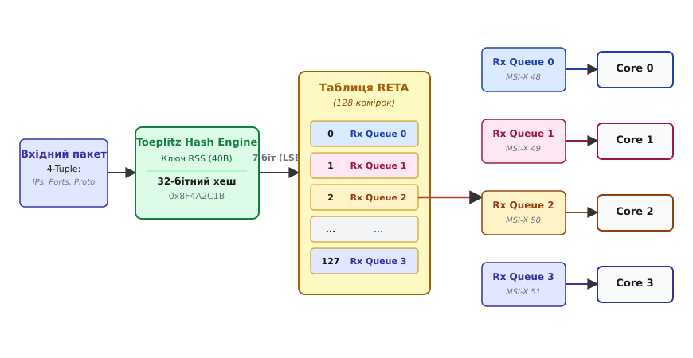

# Масштабування на боці прийому: RSS Indirection Tables та Flow Hashing

<preknowlist>
- [Мережевий стек ядра Linux](book:unix-linux/network-stack-architecture) — шлях пакета від кільцевого буфера NIC до сокета.
- [Інтерфейси, адреси й стан лінка](book:unix-linux/interfaces-and-addresses) — базові поняття налаштування мережевих інтерфейсів та iproute2.
</preknowlist>

Сучасні мережеві контролери (NIC) здатні обробляти мережевий трафік на швидкостях 10, 40, 100 та навіть 400 Гбіт/с. За таких швидкостей традиційна модель обробки мережевих пакетів, коли всі переривання від мережевої карти надходять на одне ядро центрального процесора (CPU), стає фундаментальним вузьким місцем. Одне ядро фізично не здатне впоратися з мільйонами пакетів на секунду (Mpps), що призводить до втрати даних у кільцевому буфері, високих затримок (latency) та неефективного використання багатоядерних серверних систем.

Для вирішення цієї проблеми було розроблено технологію **Receive Side Scaling (RSS)**. RSS дозволяє апаратно розподілити навантаження з обробки вхідного мережевого трафіку між кількома апаратними чергами прийому (Rx queues), кожна з яких прив'язується до окремого ядра процесора за допомогою вектора переривань MSI-X.

У цій статті ми детально розглянемо внутрішню архітектуру RSS, математичні алгоритми хешування потоків (Flow Hashing), структуру та призначення таблиць непрямої адресації (RSS Indirection Tables — RETA), прив'язку переривань через SMP Affinity, взаємодію з підсистемою NAPI, а також програмні альтернативи ядра Linux.

---

## 1. Проблема одного ядра та Interrupt Storms

У класичній архітектурі мережевий адаптер містив лише одну чергу прийому (Rx Queue) та одну чергу передачі (Tx Queue). Коли мережевий кадр надходив на фізичний порт NIC, адаптер копіював його в оперативну пам'ять за допомогою прямого доступу до пам'яті (DMA — Direct Memory Access) та генерував апаратне переривання (Hardware Interrupt, IRQ), щоб сповістити операційну систему.

Ядро CPU, яке приймало це переривання, призупиняло виконання поточних завдань користувача, переходило в контекст обробника переривань (Interrupt Service Routine, ISR) і планувало подальшу обробку пакета в контексті програмного переривання (SoftIRQ, у Linux це `NET_RX_SOFTIRQ`, що виконується демоном `ksoftirqd`).

При високій швидкості надходження пакетів (наприклад, 14.88 млн пакетів/с для 10GbE або 148.8 млн пакетів/с для 100GbE) ядро CPU 0 витрачає 100% свого часу виключно на обробку апаратних та програмних переривань. Цей стан називається **Interrupt Storm** (шторм переривань). Операційна система втрачає здатність виконувати корисне навантаження застосунків, а інші ядра CPU залишаються повністю вільними. Докладно про історію подолання цієї кризи див. у 📜 [Еволюції масштабування прийому: від єдиного IRQ до RSS](book:unix-linux/ethtool-rss-indirection-tables/hist-rss-evolution.md).


*Класична модель обробки з єдиною чергою прийому: всі апаратні переривання генеруються на ядро 0, що призводить до 100% завантаження SoftIRQ та перевантаження системи, залишаючи інші ядра повністю вільними.*

Накладення двох факторів — переходу обчислювальних систем на багатоядерні процесори та швидкісного стрибка мережевого обладнання — змусило розробників апаратури та операційних систем відмовитися від концепції єдиного обробника переривань і перейти до багаточергових архітектур В/В (Multi-queue I/O).

---

## 2. Архітектура Receive Side Scaling (RSS)

**Receive Side Scaling (RSS)** — це апаратна технологія, реалізована безпосередньо у кремнії мережевих контролерів (ASIC/FPGA). Вона дозволяє адаптеру мати кілька апаратних черг прийому (Rx queues) і класифікувати вхідні пакети, розподіляючи їх між цими чергами на "Line Rate" швидкості.

Оскільки кожна черга прийому має власний вектор переривань **MSI-X** (Message Signaled Interrupts-Extended), операційна система може прив'язати кожну чергу до окремого ядра процесора. Це забезпечує паралельну обробку трафіку на багатоядерних системах.

### Основні компоненти RSS:

1. **Багаточерговий мережевий адаптер (Multi-queue NIC)**: Фізичний контролер, що підтримує масив незалежних кільцевих буферів прийому та передачі.
2. **Парсер пакетів (Packet Parser)**: Апаратний блок у NIC, який розбирає заголовки вхідних пакетів (Ethernet, VLAN, IPv4/IPv6, TCP/UDP) та вилучає поля, що ідентифікують мережевий потік (Flow).
3. **Обчислювач хешу (Hash Engine)**: Апаратний блок, який обчислює 32-бітний хеш (найчастіше Toeplitz Hash) на основі вилученого кортежу полів та секретного ключа.
4. **Таблиця непрямої адресації (Indirection Table / RETA)**: Апаратна таблиця в пам'яті NIC, яка відображає молодші біти обчисленого хешу на конкретний індекс апаратної черги прийому (Rx queue).

---

## 3. Flow Hashing: Ідентифікація потоків та математика Toeplitz Hash

Ключова вимога до будь-якого механізму апаратного балансування мережевого трафіку — **збереження суворого порядку пакетів (In-Order Delivery)** у межах одного мережевого з'єднання.

Якщо пакети одного TCP-з'єднання оброблятимуться різними ядрами CPU, вони можуть дістатися сокета з порушенням послідовності (Out-of-Order). Стек TCP/IP у ядрі ОС буде змушений витрачати величезні ресурси на перевпорядкування пакетів у черзі `out_of_order_queue`. Крім того, це провокує генерацію дубльованих підтверджень (Duplicate ACK), хибне спрацьовування механізму Fast Retransmit та катастрофічне зменшення вікна перевантаження TCP (Congestion Window — `cwnd`).

Потрібно гарантувати, що **всі пакети одного потоку (Flow) завжди потрапляють у ту саму Rx-чергу** і обробляються тим самим ядром CPU.

### N-кортежі (N-tuples) для ідентифікації потоку

NIC розбирає заголовки вхідних пакетів і вилучає з них **n-кортеж (n-tuple)** полів:

- **2-tuple**: `(Source IP, Destination IP)` — використовується для фрагментованих IP-пакетів або протоколів без портів L4 (ICMP, GRE, ESP).
- **4-tuple**: `(Source IP, Destination IP, Source Port, Destination Port)` — стандартний варіант для протоколів TCP та UDP.

### Математичний алгоритм Toeplitz Hash

Стандартом де-факто для обчислення RSS-хешу є **Toeplitz Hash** (хеш Тепліца), стандартизований у специфікаціях Microsoft NDIS 6.0.

Математично хеш Тепліца являє собою лінійне перетворення над двійковим полем Galois Field GF(2). Двовимірна матриця Тепліца `M` має діагональну структуру, де всі елементи на кожній паралельній діагоналі є однаковими. Матриця будується з використанням секретного ключа (RSS Hash Key), розмір якого зазвичай становить 40 байтів (320 бітів) для IPv4 або 52 байти (416 бітів) для IPv6.

#### Переваги Toeplitz Hash:
1. **Висока рівномірність**: Забезпечує відмінне статистичне розподілення хешів навіть для близьких IP-адрес (наприклад, при з'єднанні з однієї підмережі).
2. **Простота апаратної реалізації**: Обчислення зводиться до послідовності операцій зсуву (shift) та виключного АБО (XOR), що ідеально підходить для реалізації в транзисторній логіці ASIC.
3. **Стійкість до атак HashDoS**: Використання секретного ключа унеможливлює підбір зловмисником таких IP-адрес та портів, які б потрапляли в один хеш і перевантажували одне ядро CPU.

#### Крок за кроком: Покрокове обчислення хешу

1. Вхідний n-кортеж (наприклад, 96 бітів для IPv4 4-tuple: 32 біти джерела IP + 32 біти призначення IP + 16 бітів порт джерела + 16 бітів порт призначення) представляється як послідовність бітів B₀, B₁, ..., B₉₅.
2. Початкове значення 32-бітного акумулятора хешу `Hash` встановлюється в `0`.
3. NIC ітерується по кожному біту вхідного кортежу від MSB (найстаршого біта) до LSB (наймолодшого біта):
   - Якщо біт Bᵢ == 1, поточне значення акумулятора оновлюється через `XOR` із 32-бітним зрізом секретного ключа, що починається з бітового зміщення `i`.
   - Якщо біт Bᵢ == 0, акумулятор залишається без змін.
4. Результатом є 32-бітне unsigned integer значення (наприклад, `0x8F4A2C1B`).

---

## 4. RSS Indirection Table (RETA)

Оскільки 32-бітне хеш-значення дає понад 4 мільярди можливих комбінацій, а мережева карта має значно менше апаратних черг (наприклад, 4, 8, 16 або 64), необхідний механізм проекції хешу на індекси черг.

Для цього використовується **RSS Indirection Table** (також відома як Redirection Table або RETA) — масив в апаратній пам'яті NIC, який містить номери Rx-черг.

### Механізм адресації RETA:

1. NIC обчислює 32-бітний Toeplitz Hash.
2. З 32-бітного хешу береться `N` наймолодших бітів (LSB — Least Significant Bits). Найчастіше використовуються 7 бітів (що відповідає розміру RETA у 128 комірок, 2⁷ = 128) або 8/9 бітів (256 або 512 комірок у сучасних NIC Mellanox/NVIDIA та Intel 100GbE).
3. Це `N`-бітне значення слугує індексом (від 0 до 127) для доступу до масиву RETA.
4. У комірці RETA за цим індексом записано номер апаратної черги прийому (Rx Queue ID).
5. Пакет через DMA поміщається у вибрану чергу, і генерується переривання MSI-X для цієї черги.


*Архітектура Receive Side Scaling: вхідний 4-tuple хешується алгоритмом Toeplitz із 40-байтним ключем, 7 молодших бітів хешу вибирають комірку в таблиці RETA, яка визначає конкретну чергу прийому та прив'язане ядро CPU через MSI-X переривання.*

### Чому RETA краща за просте ділення за модулем (`Hash % Queues`)

Дворівнева схема адресації (`Hash -> RETA Index -> Rx Queue`) має вирішальні переваги над прямим діленням `Hash % N`:

1. **Динамічна зміна кількості черг без перерозподілу всіх потоків**: При зміні кількості активних черг з 8 до 7 просте ділення за модулем `Hash % 7` змінить значення для 100% потоків, що спричинить масовий Out-of-Order для всіх активних TCP-сесій. При використанні RETA ядро лише переписує комірки RETA, які вказували на вимкнену чергу 7, перенаправляючи їх на інші черги. Потоки з комірок 0–6 залишаються повністю недоторканими.
2. **Зважене балансування (Weighted Balancing)**: Можливо, ядро CPU 0 додатково обробляє важкі системні завдання. За допомогою RETA ми можемо зробити так, що ядро 0 отримуватиме лише 10% трафіку, а інші ядра — по 30%. Для цього номер черги 0 записується у меншу кількість комірок RETA.
3. **Ізоляція та Failover**: Якщо певна черга або ядро зависає, операційна система може за мікросекунди переписати RETA в апаратурі NIC і зняти навантаження зі збійної черги.

---

## 5. Контексти RSS (RSS Contexts)

У сучасних високопродуктивних середовищах (віртуалізація SR-IOV, контейнерні мережі Kubernetes, підсистеми DPDK та eBPF/XDP) одного глобального списку RETA недостатньо. Різні віртуальні машини, контейнери або класи трафіку вимагають власних ізольованих правил балансування.

Для вирішення цього завдання сучасні мережеві контролери підтримують **множинні контексти RSS (RSS Contexts)**:

- **Context 0 (Default Context)**: Стандартний контекст RSS, який обробляє весь загальний трафік мережевого інтерфейсу.
- **Context 1..N (Additional Contexts)**: Додаткові ізольовані таблиці RETA та хеш-ключі.

За допомогою правил фільтрації Flow Director (`ethtool -N` або `tc flower`) системний адміністратор може вказати, що, наприклад, увесь UDP-трафік на порт 53 (DNS) повинен оброблятися через `RSS Context 1`, який використовує лише черги Rx 4–7, у той час як веб-трафік HTTP/HTTPS йде через `RSS Context 0` на черги Rx 0–3.

---

## 6. Керування RSS у Linux за допомогою утиліти `ethtool`

Операційна система Linux надає інтерфейси керування RSS через утиліту `ethtool`, яка взаємодіє з драйвером через системні виклики `ioctl()` або Generic Netlink. Повний список C-структур та Netlink-атрибутів див. у 📋 [Інтерфейсах ethtool RSS та Netlink](book:unix-linux/ethtool-rss-indirection-tables/api-ethtool-rss.md).

### Перевірка кількості черг (Channels)

```bash
$ ethtool -l eth0
Channel parameters for eth0:
Pre-set maximums:
RX:             0
TX:             0
Other:          1
Combined:       64
Current hardware settings:
RX:             0
TX:             0
Other:          1
Combined:       8
```

Параметр `Combined` показує кількість комбінованих черг прийому/передачі (Rx/Tx pair), які обробляються одним вектором переривань. 

Збільшити кількість активних черг до 16:
```bash
$ sudo ethtool -L eth0 combined 16
```

### Перегляд RETA та секретного ключа (`ethtool -x`)

```bash
$ ethtool -x eth0
RX flow hash indirection table for eth0 with 8 RX ring(s):
    0:      0     1     2     3     4     5     6     7
    8:      0     1     2     3     4     5     6     7
   16:      0     1     2     3     4     5     6     7
...
  120:      0     1     2     3     4     5     6     7
RSS hash key:
a2:c4:5b:6c:7d:8e:9f:0a:b1:c2:d3:e4:f5:1a:2b:3c:4d:5e:6f:70:81:92:a3:b4:c5:d6:e7:f8:09:1a:2b:3c:4d:5e:6f:70:81:92:a3:b4
RSS hash function:
    toeplitz: on
    xor: off
    crc32: off
```

### Модифікація RETA та ваг черг (`ethtool -X`)

Рівномірний розподіл комірок RETA між 8 чергами:
```bash
$ sudo ethtool -X eth0 equal 8
```

Налаштування зваженого розподілу ваг (Weight). Припустимо, ми маємо 4 черги (0, 1, 2, 3) і хочемо повністю виключити чергу 0, віддати черзі 1 удвічі більше трафіку, ніж чергам 2 і 3:
```bash
$ sudo ethtool -X eth0 weight 0 2 1 1
```

---

## 7. Прив'язка черг Rx до ядер CPU (SMP Affinity) та NUMA-вирівнювання

Налаштування RSS у NIC — це лише перша частина завдання. Друга частина — переконатися, що Linux правильно спрямовує апаратні переривання MSI-X від цих черг на відповідні ядра CPU.

Перегляд поточного розподілу переривань виконується через `/proc/interrupts`:

```bash
$ cat /proc/interrupts | grep eth0
 120:       5321          0          0          0  IR-PCI-MSI 123456-edge  eth0-TxRx-0
 121:          0       4812          0          0  IR-PCI-MSI 123457-edge  eth0-TxRx-1
 122:          0          0       7214          0  IR-PCI-MSI 123458-edge  eth0-TxRx-2
 123:          0          0          0       6190  IR-PCI-MSI 123459-edge  eth0-TxRx-3
```

За замовчуванням у багатьох дистрибутивах працює демон `irqbalance`, який динамічно змінює прив'язку переривань. Проте для високопродуктивних мереж `irqbalance` є шкідливим: постійне мігрування IRQ між ядрами руйнує локальність L1/L2 кешу CPU (Cache Misses).

Тому на продуктивних серверах `irqbalance` вимикають, а переривання прив'язують до ядер вручну через **SMP Affinity**.

Для кожного IRQ існує конфігураційний файл:
- `/proc/irq/<IRQ>/smp_affinity` (бітова маска Hex)
- `/proc/irq/<IRQ>/smp_affinity_list` (десяточний список ядер)

Прив'язка черг 0..3 до ядер CPU 0..3:
```bash
$ echo 0 > /proc/irq/120/smp_affinity_list
$ echo 1 > /proc/irq/121/smp_affinity_list
$ echo 2 > /proc/irq/122/smp_affinity_list
$ echo 3 > /proc/irq/123/smp_affinity_list
```

### Врахування архітектури NUMA (Non-Uniform Memory Access)

У двосокетних серверних системах мережевий адаптер PCIe підключений до конкретного процесорного сокета (NUMA Node 0 або NUMA Node 1).

Якщо мережева карта підключена до PCIe-шини сокета NUMA Node 0, а переривання черги Rx обробляються ядром CPU з сокета NUMA Node 1, кожен пакет під час DMA-копіювання передаватиметься через міжпроцесорну шину (Intel UPI або AMD Infinity Fabric). Це створює колосальні затримки та знижує пропускну здатність.

Правильна конфігурація вимагає прив'язувати переривання черг RSS виключно до тих ядер CPU, які належать до того самого NUMA-вузла, де встановлено мережеву карту (дізнатися вузол можна через `/sys/class/net/eth0/device/numa_node`).

---

## 8. Взаємодія RSS та підсистеми NAPI (New API)

Навіть при розподілі переривань між 16 ядрами, при надходженні мільйонів пакетів/с кількість апаратних переривань буде надмірною. Кожне переривання провокує збереження регістрів CPU та контекстний перемикач.

Для розвантаження процесора ядро Linux використовує підсистему **NAPI (New API)**, яка комбінує переривання та пакетне опитування (Polling):

1. **Інтервальне переривання**: Пакет надходить у Rx Queue `N` через RSS. NIC генерує MSI-X переривання, яке надходить на ядро `N`.
2. **Вимкнення переривань**: Драйвер NIC обробляє перше переривання і **відразу вимикає генерацію IRQ** для цієї черги `N`.
3. **Планування SoftIRQ**: Драйвер реєструє екземпляр NAPI у списку опитування ядра `N` і планує виконання `NET_RX_SOFTIRQ` (демон `ksoftirqd/N`).
4. **Пакетне опитування (Polling Loop)**: Ядро `N` вичищає пакети з DMA-кільця пакетами (Batches) за один заход, не витрачаючи ресурси на апаратні переривання. Кількість пакетів за один цикл обмежена бюджетом (`sysctl net.core.netdev_budget`, за замовчуванням 300).
5. **Ввімкнення переривань**: Якщо черга спорожніла до вичерпання бюджету, NAPI вмикає апаратні переривання для черги `N` знову. Якщо в черзі лишилися пакети, ядро планує наступний цикл опитування.

Комбінація **Hardware RSS** (розподіл по ядрах) та **Software NAPI** (пакетне вичищення без IRQ) є основою продуктивності мережевого стека Linux.

---

## 9. Симетричний RSS (Symmetric RSS)

Стандартний алгоритм Toeplitz Hash для 4-tuple `(SrcIP, DstIP, SrcPort, DstPort)` генерує **різні хеші для двох напрямків одного з'єднання**.

Наприклад:
- Прямий потік `Client (192.168.1.50:49152) -> Server (10.0.0.1:80)` дає `Hash1 = 0x8F4A2C1B` -> **Rx Queue 1 (CPU 1)**.
- Зворотний потік `Server (10.0.0.1:80) -> Client (192.168.1.50:49152)` дає `Hash2 = 0x3D19E4A0` -> **Rx Queue 3 (CPU 3)**.

Для звичайного веб-сервера це прийнятно. Але для мережевих пристроїв середньої ланки (**Middleboxes**: Stateful Firewalls, NAT, IDS/IPS, Connection Tracking / `conntrack`) це створює серйозні проблеми. Обидва напрямки сесії повинні оброблятися на одному ядрі CPU, інакше виникають між’ядерні блокування (Locks) при оновленні таблиць станів.

Щоб обидва напрямки завжди потрапляли в одну Rx-чергу, використовують **Symmetric RSS**:

1. **Програмна симетризація (XOR)**: Модифікація кортежу перед хешуванням: `(SrcIP XOR DstIP, SrcPort XOR DstPort)`.
2. **Спеціальний ключ Toeplitz (Symmetric Key)**: Завдяки лінійним властивостям матриці Тепліца можна підібрати секретний ключ (наприклад, `0x6D5A...`), який гарантує рівність `Toeplitz(A, B) == Toeplitz(B, A)` з точністю до перестановки індексів.

Практичну реалізацію обчислення Toeplitz Hash та моделювання RETA у C та C++20 див. у ⚙️ [Моделюванні RSS та Toeplitz Hash](book:unix-linux/ethtool-rss-indirection-tables/proj-toeplitz-reta-sim.md).

---

## 10. Програмні розширення ядра: RPS, RFS, aRFS та XDP

Якщо мережева карта не підтримує апаратний RSS або має занадто мало черг, ядро Linux надає програмні альтернативи:

- **RPS (Receive Packet Steering)**: Програмний аналог RSS, що розподіляє пакети по ядрах CPU за допомогою міжпроцесорних переривань (IPI).
- **RFS (Receive Flow Steering)**: Динамічне спрямування пакетів на те ядро CPU, де виконується процес користувача, що читає даний сокет.
- **aRFS / Intel Flow Director**: Апаратне програмування точних фільтрів у TCAM пам'ять NIC на основі сокетів RFS.
- **XDP (eBPF)**: Виконує eBPF-програми безпосередньо у контексті NAPI кожної Rx-черги RSS до виділення пам'яті під `sk_buff`.

---

## 11. Діагностика та усунення несправностей (Troubleshooting)

У практичній експлуатації мережевих інженерів та DevOps часто виникає дисбаланс RSS (котрісь черги отримують 90% трафіку, а інші мовчать).

Основою діагностики є аналіз лічильників черг у sysfs:
```bash
# Перегляд статистики пакетів та помилок по кожній Rx черзі
$ ethtool -S eth0 | grep -E "rx_queue_.*_packets|rx_.*_bytes"
```

Причиною дисбалансу RSS найчастіше є:
1. **Використання 2-tuple замість 4-tuple для UDP**: За замовчуванням у деяких драйверах хешування UDP враховує лише IP-адреси. Якщо весь трафік йде від одного розробницького проксі (одна IP джерела), всі пакети потраплять в один хеш. Виправлення: `sudo ethtool -N eth0 rx-flow-hash udp4 sdfn`.
2. **Невірний розмір RETA при зміні кількості черг**: Зміна кількості черг через `ethtool -L` не завжди автоматично скидає RETA. Виправлення: `sudo ethtool -X eth0 equal N`.

---

## 12. Підсумок

Технологія Receive Side Scaling (RSS) у поєднанні з таблицями непрямої адресації (RETA) та алгоритмом Toeplitz Hash є фундаментальною основою паралельної обробки мережевого трафіку у Linux. RSS перетворює мережевий адаптер з одного джерела переривань на багатоканальний розподільчий вузол, усуваючи "шторми переривань" та забезпечуючи лінійне масштабування продуктивності сервера.
