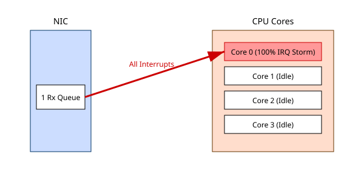
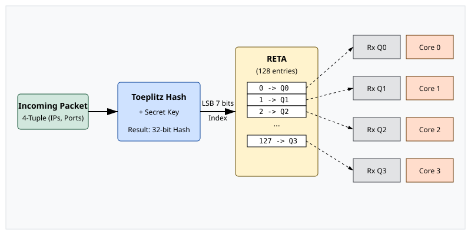

# Масштабування на боці прийому: RSS Indirection Tables та Flow Hashing

<preknowlist>
- [Концепції ядра Linux](book:unix-linux/kernel-and-userspace) — базові поняття системних викликів та VFS.
</preknowlist>

Сучасні мережеві адаптери (NIC) здатні обробляти трафік на швидкостях 10, 40, 100 та навіть 400 Гбіт/с. За таких швидкостей традиційна модель обробки мережевих пакетів, коли всі переривання від NIC обробляються одним ядром центрального процесора (CPU), стає вузьким місцем. Одне ядро просто не здатне впоратися з мільйонами пакетів на секунду (Mpps), що призводить до втрати пакетів, високих затримок та деградації пропускної здатності.

Для вирішення цієї проблеми було розроблено технологію **Receive Side Scaling (RSS)**. RSS дозволяє розподілити навантаження з обробки вхідного мережевого трафіку між кількома апаратними чергами прийому (Rx queues), кожна з яких може оброблятися окремим ядром процесора. 

У цій статті ми детально розглянемо архітектуру RSS, алгоритми хешування потоків (Flow Hashing), структуру таблиць непрямої адресації (RSS Indirection Tables - RETA), а також практичні аспекти керування цими механізмами в Linux за допомогою утиліти `ethtool` та налаштування NAPI.

## Проблема одного ядра та Interrupt Storms

У класичній архітектурі мережевий адаптер має одну чергу прийому (Rx) та одну чергу передачі (Tx). Коли пакет надходить на фізичний порт NIC, адаптер копіює його в оперативну пам'ять (використовуючи DMA) і генерує апаратне переривання (Hardware Interrupt, IRQ), щоб повідомити операційну систему про надходження нових даних.

Ядро CPU, яке обробляє це переривання, призупиняє виконання поточних завдань, переходить у контекст обробника переривань (Interrupt Service Routine, ISR) і планує подальшу обробку пакета в контексті програмного переривання (SoftIRQ, у Linux це часто `NET_RX_SOFTIRQ`).

Якщо швидкість надходження пакетів дуже висока, одне ядро процесора витрачатиме 100% свого часу лише на обробку переривань, не залишаючи ресурсів для користувацьких програм або навіть для самої обробки корисного навантаження пакетів (проходження стека TCP/IP). Цей стан називається **Interrupt Storm** (шторм переривань). Інші ядра при цьому можуть залишатися абсолютно вільними (idle).

Рис. 1.1 демонструє цю класичну проблему:



## Архітектура Receive Side Scaling (RSS)

**Receive Side Scaling (RSS)** — це апаратна технологія, реалізована безпосередньо в мережевих контролерах (NIC). Вона дозволяє адаптеру мати кілька апаратних черг прийому (Rx queues) і класифікувати вхідні пакети, розподіляючи їх між цими чергами.

Оскільки кожна черга прийому має власну лінію переривань (зазвичай через MSI-X — Message Signaled Interrupts), операційна система може прив'язати кожне переривання (і, відповідно, кожну чергу) до окремого ядра процесора. Це забезпечує паралельну обробку мережевого трафіку на багатоядерних системах.

Основні компоненти RSS:
1. **Багаточерговий мережевий адаптер (Multi-queue NIC)**: Адаптер, що підтримує кілька пар Rx/Tx черг.
2. **Парсер пакетів (Packet Parser)**: Апаратний блок у NIC, який розбирає заголовки пакетів (Ethernet, IP, TCP/UDP) для вилучення полів (кортежів), що ідентифікують потік.
3. **Хеш-функція (Hash Function)**: Математична функція (найчастіше Toeplitz Hash), яка обчислює хеш-значення на основі вилученого кортежу.
4. **Таблиця непрямої адресації (Indirection Table / RETA)**: Таблиця, що відображає (мапить) хеш-значення на конкретну апаратну чергу прийому (Rx queue).

### Flow Hashing: Ідентифікація потоків

Ключова вимога до будь-якої системи балансування мережевого навантаження — збереження порядку пакетів у межах одного мережевого з'єднання (потоку). Якщо пакети одного TCP-з'єднання будуть оброблятися різними ядрами процесора, вони можуть змінити свій порядок (Out-of-Order). Стек TCP/IP у ядрі ОС буде змушений витрачати величезні ресурси на перевпорядкування пакетів, що призведе до катастрофічного падіння продуктивності (через дублювання ACK, повторні передачі та зменшення TCP Congestion Window).

Тому RSS розподіляє пакети не "round-robin" (по черзі), а на основі **потоків (flows)**. Всі пакети, що належать до одного потоку, гарантовано потрапляють у ту саму Rx чергу і обробляються тим самим ядром CPU.

Потік зазвичай ідентифікується **n-кортежем (n-tuple)** полів із заголовків протоколів:
- **2-tuple**: Source IP, Destination IP (використовується для фрагментованих IP-пакетів або протоколів без портів, як ICMP, GRE).
- **4-tuple**: Source IP, Destination IP, Source Port, Destination Port (найпоширеніший варіант для TCP/UDP).

NIC зчитує ці поля з вхідного пакета і передає їх у хеш-функцію.

### Toeplitz Hash

У сучасних NIC стандартом де-факто для обчислення хешу є **Toeplitz hash** (хеш Тепліца), стандартизований компанією Microsoft у специфікаціях NDIS.

Toeplitz Hash має кілька важливих властивостей:
1. **Висока рівномірність**: Він дуже добре розподіляє значення навіть для схожих IP-адрес.
2. **Апаратна ефективність**: Обчислення зводиться до серії операцій зсуву (shift) та виключного АБО (XOR), що ідеально підходить для реалізації в кремнії (ASIC/FPGA).
3. **Підтримка секретного ключа**: Хеш використовує секретний ключ (RSS Key, зазвичай 40 або 52 байти), що робить його стійким до атак типу "Hash Collision Denial of Service" (коли зловмисник спеціально підбирає IP/порти, щоб усі пакети мали однаковий хеш і перевантажували одну чергу).

Процес обчислення виглядає так: NIC бере 4-tuple (наприклад, 96 біт для IPv4: 32+32+16+16) і секретний ключ. Ітерує по кожному біту кортежу. Якщо біт дорівнює 1, до поточного результату (початково 0) застосовується XOR із відповідним "вікном" (32 біти) секретного ключа. Потім вікно ключа зсувається на 1 біт.

Результатом є 32-бітне хеш-значення. Однак, у нас зазвичай не 4 мільярди Rx черг, а, скажімо, 4, 8, або 16. Тому 32-бітний хеш потрібно якось "спроектувати" на доступну кількість черг. І тут на сцену виходить **Indirection Table**.

## RSS Indirection Table (RETA)

**RSS Indirection Table** (також відома як Redirection Table або RETA) — це масив в апаратній пам'яті NIC, який задає відображення між частиною хеш-значення та індексом Rx черги.

Зазвичай використовується 7-бітний індекс таблиці (що дає таблицю на 128 записів, `2^7`), іноді 8-бітний (256 записів) або 9-бітний (512 записів, поширено в сучасних NIC Mellanox/NVIDIA).

Як це працює:
1. NIC обчислює 32-бітний Toeplitz Hash.
2. NIC бере N наймолодших (найменш значущих, LSB) бітів хешу (наприклад, 7 бітів).
3. Це 7-бітне значення (від 0 до 127) використовується як індекс (вказівник) для доступу до Indirection Table.
4. У відповідній комірці таблиці записано номер Rx черги (наприклад, від 0 до 7).
5. Пакет поміщається у вибрану Rx чергу (через DMA), і генерується переривання для цієї черги.

Такий дворівневий підхід (Хеш -> RETA -> Rx Queue) замість простого модульного ділення (Хеш % Кількість_черг) дає величезну гнучкість.



### Навіщо потрібна Indirection Table?

Наявність проміжної таблиці дозволяє операційній системі динамічно змінювати балансування навантаження **без зміни секретного ключа і без простого модульного ділення**:

1. **Динамічне масштабування (Dynamic Scaling)**: Якщо ми хочемо вимкнути одне ядро CPU (наприклад, для енергозбереження) і зменшити кількість активних Rx черг з 8 до 7, ми можемо просто переписати RETA. Усі записи в RETA, які вказували на чергу 7, ми можемо замінити на чергу 0 (або будь-яку іншу).
2. **Зважене балансування (Weighted Balancing)**: Можливо, одне з ядер працює на нижчій частоті або паралельно виконує важкі бази даних. За допомогою RETA ми можемо зробити так, що ядро 0 отримуватиме лише 5% трафіку, а інші ядра — по 15%. Для цього ми просто записуємо номер черги 0 у меншу кількість комірок RETA.
3. **Обхід збою (Failover)**: Якщо певна черга зависла або переривання не обробляються, ОС може швидко перенаправити трафік, оновивши RETA.

## Керування RSS в Linux за допомогою `ethtool`

Linux надає потужний інтерфейс для управління параметрами мережевих адаптерів через утиліту `ethtool` (та відповідні ioctl/netlink виклики в ядрі).

### 1. Перевірка кількості черг (Channels)

Перший крок в налаштуванні RSS — дізнатися, скільки апаратних черг підтримує NIC і скільки з них зараз активні. Для цього використовується команда `ethtool -l` (від слова "channels").

```bash
$ ethtool -l eth0
Channel parameters for eth0:
Pre-set maximums:
RX:             0
TX:             0
Other:          1
Combined:       63
Current hardware settings:
RX:             0
TX:             0
Other:          1
Combined:       8
```

У сучасних драйверах (як `ixgbe`, `i40e`, `mlx5_core`) черги прийому (RX) та передачі (TX) часто об'єднані (Combined), тобто одна пара Rx/Tx обробляється одним перериванням. У наведеному прикладі адаптер підтримує до 63 combined черг, але наразі активовано 8 (зазвичай це значення за замовчуванням дорівнює кількості логічних ядер процесора, але може бути обмежене драйвером).

Змінити кількість активних черг можна командою:
```bash
$ sudo ethtool -L eth0 combined 16
```

### 2. Перегляд поточної конфігурації RSS (Hash Key та RETA)

Команда `ethtool -x` (або `--show-rxfh-indir`) дозволяє побачити поточну таблицю RETA та секретний хеш-ключ.

```bash
$ ethtool -x eth0
RX flow hash indirection table for eth0 with 8 RX ring(s):
    0:      0     1     2     3     4     5     6     7
    8:      0     1     2     3     4     5     6     7
   16:      0     1     2     3     4     5     6     7
   24:      0     1     2     3     4     5     6     7
...
  120:      0     1     2     3     4     5     6     7
RSS hash key:
a2:c4:5b:6c:7d:8e:9f:0a:b1:c2:d3:e4:f5:1a:2b:3c:4d:5e:6f:70:81:92:a3:b4:c5:d6:e7:f8:09:1a:2b:3c:4d:5e:6f:70:81:92:a3:b4
RSS hash function:
    toeplitz: on
    xor: off
    crc32: off
```

У цьому виводі ми бачимо RETA розміром 128 записів (від 0 до 127). Значення рівномірно розподілені між чергами від 0 до 7 (0, 1, 2, 3, 4, 5, 6, 7). 

### 3. Налаштування ваг та RETA (`ethtool -X`)

Опція `ethtool -X` (або `--set-rxfh-indir`) дозволяє змінювати таблицю непрямої адресації (RETA).

**Рівномірний розподіл (Equal):**
Якщо ви змінили кількість черг (наприклад, збільшили до 16), RETA може автоматично не оновитися, або вам може знадобитися відновити рівномірний розподіл.

```bash
$ sudo ethtool -X eth0 equal 8
```
Ця команда рівномірно заповнить RETA чергами від 0 до 7. 

**Зважений розподіл (Weight):**
Це одна з найпотужніших можливостей. Припустимо, у вас 4 черги (0, 1, 2, 3). Ви хочете, щоб черга 0 не отримувала трафіку (наприклад, ядро 0 зайняте ОС), черга 1 отримувала половину трафіку, а черги 2 і 3 — по чверті.

Ви можете задати ваги (weight):
```bash
$ sudo ethtool -X eth0 weight 0 2 1 1
```
`ethtool` автоматично перерахує RETA так, щоб:
- Черга 0 з'явилася в таблиці 0 разів.
- Черга 1 з'явилася в 50% записів.
- Черги 2 і 3 з'явилися по 25% разів.

Перевіримо результат:
```bash
$ ethtool -x eth0 | head -n 5
RX flow hash indirection table for eth0 with 4 RX ring(s):
    0:      1     1     2     3     1     1     2     3
    8:      1     1     2     3     1     1     2     3
```
Як бачимо, черга 0 відсутня.

**Специфічний контекст (Context):**
Сучасні NIC підтримують кілька RSS контекстів (кожен зі своєю RETA та ключем), що часто використовується у віртуалізації (SR-IOV) або разом із правилами фільтрації (`ethtool -N` / `tc flower`), щоб направляти певні типи трафіку у власні пули черг.

## Прив'язка черг Rx до ядер CPU (SMP Affinity)

Налаштування RSS у мережевому адаптері — це лише половина справи. Друга половина — переконатися, що ОС (Linux) правильно розподіляє апаратні переривання від цих черг по ядрах CPU.

Сучасні NIC генерують переривання типу **MSI-X** (Message Signaled Interrupts). Кожна черга отримує свій унікальний вектор переривання (IRQ).

Щоб побачити розподіл переривань, потрібно заглянути у файл `/proc/interrupts`:

```bash
$ cat /proc/interrupts | grep eth0
 120:       5321          0          0          0  IR-PCI-MSI 123456-edge  eth0-TxRx-0
 121:          0       4812          0          0  IR-PCI-MSI 123457-edge  eth0-TxRx-1
 122:          0          0       7214          0  IR-PCI-MSI 123458-edge  eth0-TxRx-2
 123:          0          0          0       6190  IR-PCI-MSI 123459-edge  eth0-TxRx-3
```
Тут ми бачимо 4 черги (eth0-TxRx-0 ... eth0-TxRx-3), які мають номери IRQ 120, 121, 122 та 123. Також видно, що переривання обробляються різними ядрами (колонки CPU0, CPU1, CPU2, CPU3).

За розподіл переривань відповідає підсистема APIC та демони простору користувача (наприклад, `irqbalance`). Однак, `irqbalance` часто працює субоптимально для високопродуктивних мереж, постійно мігруючи переривання між ядрами, що руйнує кеш-пам'ять процесора (L1/L2/L3 cache misses).

Тому для досягнення максимальної продуктивності `irqbalance` рекомендується вимкнути, а переривання "прив'язати" (pin) до конкретних ядер вручну за допомогою механізму **SMP Affinity**.

Для кожного IRQ (наприклад, 120) існує файл:
`/proc/irq/120/smp_affinity` (бітова маска у шістнадцятковому форматі)
`/proc/irq/120/smp_affinity_list` (список ядер у десятковому форматі).

Щоб прив'язати чергу 0 (IRQ 120) до ядра 0:
```bash
$ echo 0 > /proc/irq/120/smp_affinity_list
```
Щоб прив'язати чергу 1 (IRQ 121) до ядра 1:
```bash
$ echo 1 > /proc/irq/121/smp_affinity_list
```

Правильна прив'язка (affinity) у поєднанні з RSS гарантує, що потік пакетів "закріплюється" за одним ядром від моменту генерації переривання на NIC до обробки додатком у просторі користувача, забезпечуючи **Data Locality** (локальність даних у кеші CPU).

## Взаємодія RSS та NAPI (New API)

Hardware RSS вирішує проблему розподілу переривань. Проте, при високому навантаженні (мільйони пакетів на секунду), навіть якщо переривання розподілені між 16 ядрами, їх загальна кількість буде занадто великою. Кожне переривання спричиняє контекстний перемикач (Context Switch), що є дуже дорогою операцією для CPU.

Для вирішення проблеми надмірної кількості переривань (Interrupt Mitigation) у Linux було впроваджено **NAPI (New API)**. NAPI комбінує переривання та опитування (polling).

Як взаємодіють RSS та NAPI:
1. NIC за допомогою RSS поміщає пакет у чергу `N` і генерує переривання (IRQ) для цієї черги (яке, завдяки smp_affinity, надходить на ядро `N`).
2. Драйвер NIC обробляє переривання. Замість того, щоб обробити один пакет і чекати наступного переривання, драйвер **вимикає переривання** для цієї конкретної черги (NIC більше не буде генерувати IRQ для черги `N`).
3. Драйвер планує опитування (NAPI Poll) в контексті програмного переривання (`NET_RX_SOFTIRQ`), часто представленого процесом `ksoftirqd/N`.
4. Ядро `N` входить у цикл опитування. Воно "витягує" (pull) пакети з Rx черги пакетами (batch) за допомогою DMA кільцевого буфера (Ring Buffer). 
5. Обробка триває (пакети передаються в мережевий стек) доки:
   - a) Черга порожня.
   - b) Вичерпано ліміт часу (time slice) або ліміт пакетів (budget, зазвичай `net.core.netdev_budget` = 300).
6. Якщо черга спорожніла, NAPI вмикає переривання для цієї черги знову. Якщо бюджет вичерпано, а пакети ще є, ядро планує наступний цикл опитування, залишаючи переривання вимкненими.

Завдяки NAPI, при максимальному навантаженні (flood), система працює виключно в режимі опитування (polling), повністю усуваючи накладні витрати на обробку апаратних переривань. Комбінація RSS (розподіл на багато ядер) та NAPI (обробка пакетами без переривань) є фундаментом сучасного високопродуктивного мережевого стека Linux.

## Симетричний RSS (Symmetric RSS)

Стандартний алгоритм Toeplitz Hash для 4-tuple (SrcIP, DstIP, SrcPort, DstPort) генерує різні хеші для різних напрямків одного і того ж з'єднання. 
Тобто пакет `Client -> Server` матиме Hash1, а пакет `Server -> Client` матиме Hash2. Це означає, що трафік в одному напрямку буде оброблятися ядром A, а зворотний трафік — ядром B.

Для багатьох серверних застосунків (веб-сервери, бази даних) це нормально. Але для мережевих пристроїв середньої ланки (Middleboxes: брандмауери, системи IDS/IPS, NAT, проксі-сервери) це є проблемою. Вони повинні підтримувати стан з'єднання (Connection Tracking, conntrack). Якщо два напрямки обробляються різними ядрами, виникають проблеми з блокуваннями (Locks) та доступом до кеш-пам'яті при оновленні стану з'єднання.

Щоб обидва напрямки потоку завжди потрапляли в одну Rx чергу (і на одне ядро), використовується **Symmetric RSS**.

Цього можна досягти двома шляхами:
1. **Програмно (XOR)**: Модифікувати хеш-функцію так, щоб перед Toeplitz вона застосовувала XOR до IP-адрес і портів: `(SrcIP XOR DstIP, SrcPort XOR DstPort)`. У такому випадку кортеж стає симетричним, але це вимагає апаратної підтримки специфічного XOR-хешу (який може не розподіляти пакети так само ефективно).
2. **Магічний ключ Toeplitz**: Завдяки лінійним властивостям матриці Тепліца (це лінійне відображення в полі Галуа GF(2)), можна підібрати такий секретний ключ (Symmetric RSS Key), для якого хеш від `(A, B)` завжди дорівнює хешу від `(B, A)`. 

Linux `ethtool` та багато сучасних NIC підтримують генерацію симетричного ключа автоматично.

## Альтернативи в ядрі: RPS та RFS

Іноді апаратний RSS недоступний (дешевий NIC з однією чергою, віртуальний інтерфейс `veth` або `tun/tap`). Або ж апаратний RSS не може заглянути глибоко в пакет (наприклад, інкапсуляція IP-in-IP, VxLAN, або фрагментовані пакети).

У таких випадках на допомогу приходять програмні механізми Linux:

- **RPS (Receive Packet Steering)**: Програмний аналог RSS. Ядро, яке отримало переривання від NIC, обчислює програмний хеш потоку і перенаправляє пакет (через міжпроцесорне переривання IPI або загальну пам'ять) в backlog чергу іншого ядра (Target CPU).
- **RFS (Receive Flow Steering)**: Більш "розумний" RPS. Він враховує не лише хеш, але й те, **на якому ядрі зараз виконується додаток (процес)**, що читає дані з відповідного сокета. RFS намагається направити пакет на те ядро, де працює програма (наприклад, Nginx), щоб максимізувати локальність даних у L1/L2 кешах. RFS підтримується також апаратно (Hardware Accelerated RFS, ARFS або aRFS), де ядро ОС програмує фільтри потоків (Flow Director, fdir) безпосередньо в NIC, вказуючи адаптеру, в яку чергу кидати певний потік.

## Висновок

Масштабування на боці прийому (RSS), у поєднанні з таблицями непрямої адресації (RETA) та ефективним алгоритмом Toeplitz Hash, є критично важливими компонентами для забезпечення продуктивності сучасних серверів. Завдяки RSS мережевий адаптер здатний рівномірно розподілити навантаження на десятки ядер процесора, усуваючи "шторми переривань" на одному ядрі.

Гнучкість RETA дозволяє адміністраторам тонко налаштовувати балансування за допомогою `ethtool`, встановлювати ваги для різних черг та ізолювати трафік. Разом із механізмами SMP Affinity (прив'язка черг до ядер) та NAPI (масова обробка пакетів без переривань), RSS дозволяє операційній системі Linux обробляти трафік на швидкостях 100 Гбіт/с та вище з мінімальними затримками і максимально ефективним використанням ресурсів процесора.
