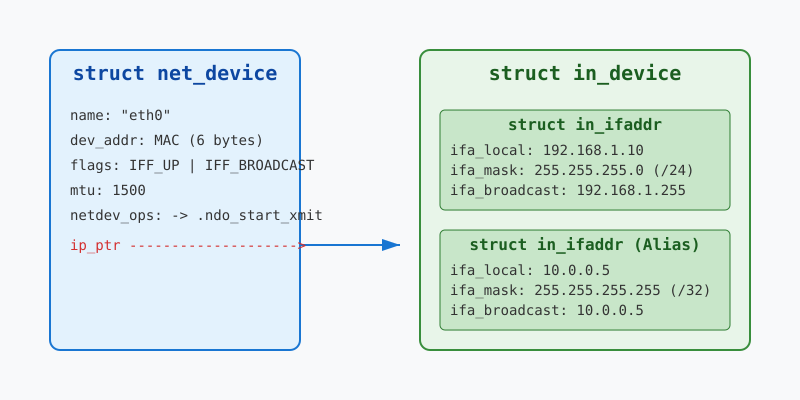

# Інтерфейси й адреси: loopback, Ethernet, IP-префікси та маски

<preknowlist>
- [Концепції ядра Linux](book:unix-linux/kernel-and-userspace) — базові поняття системних викликів та VFS.
</preknowlist>

Мережева підсистема — одна з найскладніших і найважливіших частин ядра операційної системи. Коли ми говоримо про роботу в мережі в середовищі Unix і Linux, ми неминуче стикаємося з поняттями мережевих інтерфейсів та їхніх адрес. Ці абстракції дозволяють операційній системі взаємодіяти з різноманітним апаратним забезпеченням та протоколами маршрутизації в єдиний стандартизований спосіб.

У цій статті ми глибоко зануримося у внутрішню будову мережевих інтерфейсів Linux, розглянемо ключові структури даних ядра (`struct net_device` та `struct in_ifaddr`), розберемося з адресацією (MAC, IPv4, CIDR) і детально проаналізуємо особливості роботи спеціального інтерфейсу зворотного зв'язку — `loopback`.

## Мережевий інтерфейс: абстракція апаратного забезпечення

У ядрі Linux кожен мережевий інтерфейс, будь то фізична мережева карта (Ethernet), бездротовий адаптер (Wi-Fi) чи віртуальний пристрій (наприклад, тунель або VLAN), представлений структурою `struct net_device`.

### struct net_device

Структура `net_device` (визначена у `include/linux/netdevice.h`) є фундаментальним будівельним блоком мережевого стеку. Вона містить сотні полів (у сучасних ядрах), які описують усі аспекти інтерфейсу: від апаратних характеристик до статистичних даних.

Ключові групи полів у `struct net_device`:

1.  **Ідентифікаційні дані**:
    *   `name`: Назва інтерфейсу, наприклад, `eth0`, `wlan0`, `enp3s0`. Рядок фіксованої довжини (`IFNAMSIZ`).
    *   `ifindex`: Унікальний числовий індекс інтерфейсу в системі. Застосунки часто використовують цей індекс для прив'язки сокетів до певного інтерфейсу за допомогою опції `SO_BINDTODEVICE`.

2.  **Апаратна інформація (L2 - Data Link Layer)**:
    *   `dev_addr`: MAC-адреса пристрою (Media Access Control address).
    *   `addr_len`: Довжина апаратної адреси (наприклад, 6 байтів для Ethernet).
    *   `type`: Тип апаратного забезпечення (наприклад, `ARPHRD_ETHER` для Ethernet, `ARPHRD_LOOPBACK` для loopback).
    *   `mtu`: Maximum Transmission Unit. Максимальний розмір кадру (payload L2), який інтерфейс може передати за один раз. Для Ethernet стандартний MTU дорівнює 1500 байтів.

3.  **Стан і прапорці**:
    *   `flags`: Набір бітових прапорців (наприклад, `IFF_UP` — інтерфейс увімкнено, `IFF_BROADCAST` — підтримує широкомовні повідомлення, `IFF_LOOPBACK` — є інтерфейсом зворотного зв'язку, `IFF_PROMISC` — нерозбірливий режим).
    *   `state`: Внутрішній стан пристрою (чи піднятий лінк, чи готова черга передачі).

4.  **Функції керування (Operations)**:
    *   `netdev_ops`: Вказівник на структуру `net_device_ops`, яка містить набір вказівників на функції драйвера. Це абстрагує ядро від конкретного апаратного забезпечення. Наприклад, функція `.ndo_start_xmit` викликається мережевим стеком для передачі пакета (sk_buff) апаратному забезпеченню.

5.  **Вказівники на структури вищого рівня**:
    *   `ip_ptr`: Вказівник на структуру конфігурації IPv4 (`struct in_device`), яка містить IP-адреси, прив'язані до цього інтерфейсу.
    *   `ip6_ptr`: Вказівник на структуру конфігурації IPv6 (`struct inet6_dev`).

Коли мережевий драйвер ініціалізує обладнання, він виділяє пам'ять під `net_device`, заповнює необхідні поля (особливо `netdev_ops` і MAC-адресу) і реєструє його в ядрі за допомогою функції `register_netdev()`.

### MAC-адреси (Media Access Control)

Для інтерфейсів сімейства Ethernet на канальному рівні (L2) використовується 48-бітна (6 байтів) MAC-адреса. Вона має бути унікальною в межах одного широкомовного домену (наприклад, в одному сегменті локальної мережі).

Структура MAC-адреси:
*   **OUI (Organizationally Unique Identifier)**: Перші 3 байти (24 біти) ідентифікують виробника мережевого обладнання. Видаються організацією IEEE.
*   **NIC Specific**: Наступні 3 байти (24 біти) призначаються самим виробником для конкретного пристрою, утворюючи серійний номер.

У ядрі Linux MAC-адреса зберігається у полі `dev_addr` структури `net_device`. Кадри Ethernet містять MAC-адресу призначення та MAC-адресу джерела. Коли мережева карта отримує кадр, вона перевіряє MAC-адресу призначення. Якщо вона збігається з MAC-адресою самої карти (або якщо це широкомовна адреса `FF:FF:FF:FF:FF:FF`, або якщо карта переведена у `promiscuous` режим), кадр приймається і передається вище по стеку через механізм переривань та NAPI, інакше — відкидається на апаратному рівні.

## IP-адресація та конфігурація інтерфейсу

Один мережевий інтерфейс (L2) може мати кілька IP-адрес (L3). Зв'язок між `net_device` та його IPv4-адресами здійснюється через структуру `struct in_device`, яка зберігається в полі `ip_ptr` (у сучасних ядрах доступ здійснюється через RCU).

### struct in_ifaddr

Специфічна конфігурація кожної окремої IPv4-адреси, призначеної інтерфейсу, зберігається у структурі `struct in_ifaddr`.

Ключові поля `struct in_ifaddr`:
*   `ifa_local`: Сама IP-адреса інтерфейсу.
*   `ifa_address`: IP-адреса. Для звичайних інтерфейсів вона збігається з `ifa_local`. Для point-to-point з'єднань (наприклад, тунелів) тут може зберігатися адреса іншого кінця тунелю.
*   `ifa_mask`: Маска підмережі. Визначає, яка частина IP-адреси ідентифікує мережу, а яка — вузол.
*   `ifa_broadcast`: Широкомовна адреса для цієї підмережі (отримується шляхом застосування побітового АБО інвертованої маски підмережі до IP-адреси).
*   `ifa_dev`: Зворотний вказівник на структуру `struct in_device`, якій належить ця адреса.

### IP-префікси, маски та CIDR нотація

IP-адреса версії 4 є 32-бітним числом (4 байти). Історично IP-адреси поділялися на класи (A, B, C), які жорстко задавали розмір мережі. Однак через неефективне використання адресного простору цю систему було замінено на безкласову маршрутизацію — **CIDR (Classless Inter-Domain Routing)**.

У CIDR нотації мережа записується у вигляді базової IP-адреси (часто адреси самої мережі) та довжини префікса через слеш: `IP-адреса/префікс`.

**Префікс** вказує на кількість бітів (починаючи зі старшого, зліва направо), які визначають мережеву частину адреси. Решта бітів (`32 - префікс`) утворюють частину, що ідентифікує конкретний хост (вузол) у цій мережі.

**Маска підмережі** — це 32-бітне число, в якому перші `N` бітів встановлені в `1` (де `N` — це префікс), а решта — в `0`.

**Приклад 1: Підмережа /24**
Розглянемо запис `192.168.1.0/24`.
*   IP: `192.168.1.0`
*   Префікс: `24`
*   Маска підмережі у двійковому вигляді: `11111111.11111111.11111111.00000000`
*   Маска підмережі у десятковому вигляді: `255.255.255.0`
*   Кількість бітів для хостів: `32 - 24 = 8` бітів.
*   Кількість адрес у мережі: `2^8 = 256`.
    *   `192.168.1.0` — адреса самої мережі.
    *   `192.168.1.1` ... `192.168.1.254` — адреси, які можна призначити вузлам.
    *   `192.168.1.255` — широкомовна адреса (`ifa_broadcast`).

Підмережа `/24` є однією з найпопулярніших у домашніх та малих офісних мережах.

**Приклад 2: Хост-маршрут /32**
Префікс `/32` означає, що всі 32 біти адреси відносяться до ідентифікації мережі. Тобто, кількість бітів для хоста дорівнює `0`.
Маска підмережі: `255.255.255.255`.
Запис типу `10.0.0.5/32` ідентифікує не підмережу, а **один конкретний вузол**. Такі маршрути називаються хост-маршрутами. Вони часто використовуються для маршрутизації до конкретного сервісу, для конфігурації loopback-адрес, або у складних схемах маршрутизації (наприклад, OSPF або BGP).

## Інтерфейс Loopback (lo)

Інтерфейс зворотного зв'язку (loopback, зазвичай позначається як `lo`) — це особливий віртуальний мережевий інтерфейс. Він використовується для мережевої комунікації застосунків у межах однієї операційної системи.

За стандартом для loopback виділено весь блок `127.0.0.0/8`, проте найчастіше інтерфейсу призначається адреса `127.0.0.1` з маскою `/8` (хоча іноді конфігурують і `/32` у специфічних сценаріях). Для IPv6 використовується адреса `::1/128`.

### Архітектура та оптимізації Loopback: Робота без DMA

Коли застосунок А надсилає дані застосунку Б через мережеву карту Ethernet (навіть якщо вони на одному комп'ютері, але дані йдуть через зовнішній інтерфейс, що буває рідко через локальну маршрутизацію, але технічно можливо), дані проходять повний шлях:
1. Застосунок робить системний виклик `send()`.
2. Ядро формує пакет (sk_buff), проходить TCP/IP стек.
3. Пакет передається драйверу мережевої карти (виклик `.ndo_start_xmit`).
4. Драйвер налаштовує **DMA (Direct Memory Access)** — механізм прямого доступу до пам'яті. Мережева карта сама читає дані з оперативної пам'яті без участі процесора.
5. Карта формує електричні сигнали на кабелі.

Інтерфейс **loopback** не має апаратного забезпечення. Це суто програмна абстракція ядра. Передача пакета через `lo` не передбачає роботи з кабелями, радіохвилями, перериваннями апаратури чи DMA.

Як працює `lo` в ядрі Linux:
1. Пакет формується мережевим стеком, як і для звичайного інтерфейсу. Маршрутизатор бачить, що адреса призначення належить системі (наприклад, `127.0.0.1` або будь-яка локальна IP-адреса, оскільки ядро оптимізує трафік між локальними IP-адресами, спрямовуючи його через loopback-шлях).
2. Викликається функція передачі драйвера loopback: `loopback_xmit()` (яка є реалізацією `.ndo_start_xmit` для `lo`).
3. Функція `loopback_xmit()` **не** налаштовує DMA і не спілкується з обладнанням. Замість цього вона робить дуже просту річ:
   - Відкидає MAC-заголовок (оскільки для локальної доставки він не має сенсу).
   - Оновлює статистику (лічильники переданих байтів).
   - Викликає `netif_rx()` (або `netif_receive_skb()`) **одразу ж**, передаючи той самий пакет (sk_buff) назад у чергу прийому мережевого стеку.

Таким чином, пакет "розвертається" на рівні драйвера віртуального інтерфейсу і починає свій шлях вгору по стеку так, ніби він щойно прийшов з мережі. Це повністю виключає оверхед на налаштування DMA, апаратні переривання (hardware interrupts) та передачу по шині PCIe. Завдяки цій оптимізації, пропускна здатність інтерфейсу loopback обмежена виключно швидкістю копіювання пам'яті та ефективністю роботи процесора з TCP/IP стеком (може сягати десятків і сотень гігабіт на секунду).

## Висновки

Мережева підсистема Linux побудована на потужних абстракціях. `struct net_device` інкапсулює апаратні особливості канального рівня, дозволяючи ядру взаємодіяти з будь-якими адаптерами. Мережевий рівень надбудовується над ним за допомогою структур `struct in_device` та `struct in_ifaddr`, забезпечуючи підтримку IP-маршрутизації та CIDR адресації (мережі /24, хости /32). Унікальне місце в цій архітектурі займає інтерфейс loopback, який оптимізує локальний IPC (Inter-Process Communication) через сокети, забезпечуючи передачу даних без апаратних переривань та DMA, використовуючи лише ресурси процесора та оперативної пам'яті.

