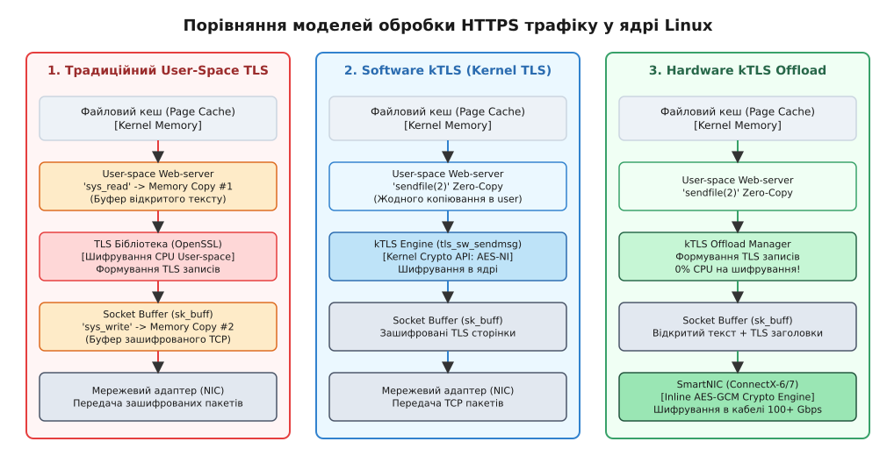
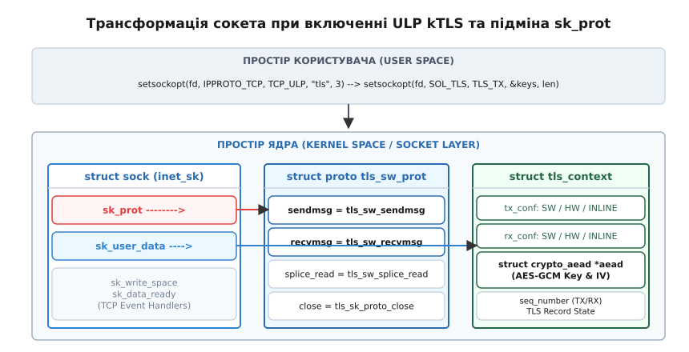
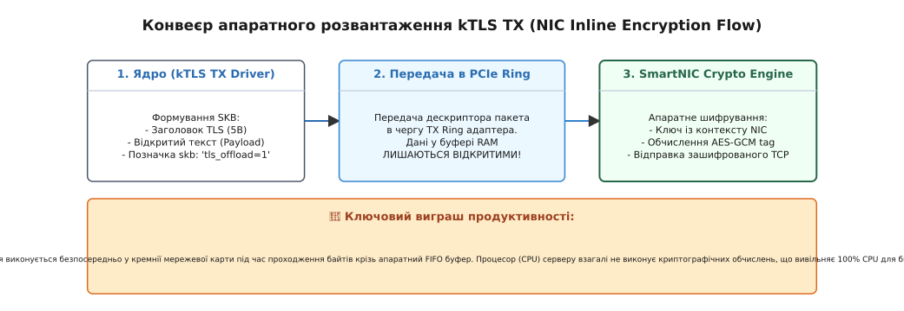

# TLS усередині ядра: шар записів на сокеті (kTLS)

<preknowlist>
- [Сокетний інтерфейс Linux](book:unix-linux/socket-api-linux) — створення сокетів, системні виклики send/recv та керування мережевими з'єднаннями.
- [Модель Netfilter](book:unix-linux/netfilter-model) — обробка пакетів та нашарування протокольних обробників у ядрі.
- [Копіювання даних та zero-copy у ядрі Linux](book:unix-linux/kernel-and-userspace) — системний виклик sendfile(2), сторінки файлового кешу та розмежування просторів пам'яті.
</preknowlist>

Високонавантажений вебсервер при відправці статичних відеофайлів чи медіапотоків через захищене HTTPS-з'єднання зі швидкістю 100 Гбіт/с вичерпує до 80% обчислювальної потужності центрального процесора лише на постійне копіювання байтів між файловим кешем ядра та буферами користувацького процесу для виконання симетричного шифрування. Класична обробка шифрованого протоколу TLS у просторі користувача унеможливлює використання системного виклику `sendfile(2)` та апаратних криптографічних прискорювачів мережевих карт, створюючи критичне «вузьке місце» у шині оперативної пам'яті сервера. Технологія Kernel TLS (kTLS) розв'язує цю проблему шляхом перенесення симетричного шару записів (TLS Record Layer) безпосередньо у мережевий стек ядра Linux.


*Архітектурне порівняння трьох моделей передачі HTTPS-трафіку: традиційний TLS у просторі користувача вимагає подвійного копіювання в RAM; SW kTLS усуває копіювання завдяки sendfile(2); HW kTLS Offload додатково знімає криптографічне навантаження з CPU.*

## 1. Проблема 100-гігабітної межі: чому TLS у просторі користувача вичерпує шину пам'яті

Класична модель обробки захищеного мережевого трафіку спирається на реалізацію криптографічних протоколів у просторі користувача за допомогою спеціалізованих бібліотек (OpenSSL, BoringSSL, GnuTLS, MbedTLS). При такій системній організації процес обслуговування HTTPS-запиту на відправку файлу з диска складається з чотирьох послідовних етапів переміщення байтів:

1. **Читання з диска в ядро**: операційна система зчитує незашифровані блоки файлу з накопичувача у сторінки файлового кешу (Page Cache) ядра.
2. **Копіювання з ядра в user-space**: користувацький процес вебсервера викликає системний виклик `read()`, змушуючи ядро скопіювати відкритий текст із Page Cache у буфер оперативної пам'яті процесу.
3. **Криптографічна обробка**: бібліотека OpenSSL у просторі користувача виконує симетричне шифрування (наприклад, AES-128-GCM), додає 5-байтовий заголовок запису TLS та 16-байтовий авторизаційний тег (Authentication Tag), формуючи готовий TLS-запис.
4. **Копіювання з user-space назад у ядро**: процес викликає системний виклик `write()` або `send()`, передаючи зашифрований блок назад у буфери сокета (`sk_buff`) у просторі ядра для подальшого формування TCP-пакетів.

При обслуговуванні високошвидкісних мережевих адаптерів стандарту 100 GbE або 400 GbE така схема призводить до катастрофічної деградації продуктивності. Щоб передавати 100 Гбіт/с (близько 12.5 Гбайт/с) зашифрованого трафіку в мережевий кабель, шина оперативної пам'яті (RAM / PCIe) повинна пропустити через себе щонайменше 400 Гбіт/с (50 Гбайт/с) сумарного трафіку лише за рахунок подвійного переміщення байтів туди й назад між просторами пам'яті. 

Центральний процесор при цьому витрачає переважну більшість обчислювальних тактів не на корисну бізнес-логіку додатка, а на виконання інструкцій `memcpy()`, перемикання контекстів системних викликів та перезавантаження таблиць сторінок пам'яті (`CR3`).

Крім того, на великих швидкостях мережі виникає серйозна проблема інтенсивності переривань (Interrupt Storm). Кожен системний виклик переходу між простором користувача та ядром вимагає виконання інструкцій `syscall`/`sysret`, вимивання черг конвеєра CPU та скидання L1/L2 кешів процесів. У результаті процесор витрачає до 40% часу лише на накладні витрати самого механізму системних викликів.

Головне обмеження традиційного підходу полягає у неможливості застосування оптимізацій Zero-Copy. Системний виклик `sendfile(2)` дозволяє відправляти сторінки з файлового кешу ядра безпосередньо у буфер мережевої карти без копіювання у простір користувача. Проте для HTTPS це виявлялося неможливим: ядро бачило лише відкритий текст, а шифрувати його вміла лише бібліотека у просторі користувача.

Детальний перебіг інженерних дискусій та еволюцію впровадження рішень цієї проблеми висвітлено у вставці [📜 Історія виникнення та еволюції kTLS в ядрі Linux](book:unix-linux/kernel-tls/hist-ktls-evolution.md).

## 2. Концепція розділення TLS: Handshake проти Record Layer

Протокол TLS (Transport Layer Security) чітко розпадається на дві фундаментально різні частини, що відрізняються рівнем складності та характером обчислювальних навантажень:

1. **Фаза встановлення з'єднання (Handshake Protocol)**: складна системна логіка, що відповідає за аутентифікацію сторін, перевірку ланцюжків цифрових сертифікатів X.509, виклик асиметричної криптографії (RSA, ECDHE), узгодження версій протоколу та генерацію спільних секретів.
2. **Шар записів (Record Layer Protocol)**: потокова симетрична криптографічна обробка. Отриманий відкритий текст розбивається на блоки розміром до 16 КБ (`TLS_MAX_PAYLOAD_SIZE = 16384`), огортається у 5-байтовий заголовок запису, шифрується симетричним алгоритмом (AES-GCM чи ChaCha20-Poly1305) і доповнюється автентифікаційним тегом.

Перенесення *всього* протоколу TLS у простір ядра було б критичною архітектурною помилкою. Парсинг складних структур ASN.1, розширень X.509 та обробка нестандартних сертифікатів у ядрі вимагали б розміщення десятків тисяч рядків коду в режимі привілейованого виконання (Ring 0), що створило б величезну поверхню для потенційних вразливостей (CVE) та витоків пам'яті.

Розробники kTLS запропонували елегантний компроміс: **Handshake залишається 100% у просторі користувача**, а в ядро переноситься **виключно Record Layer**.

```
+-------------------------------------------------------------------+
|                        USER SPACE PROCESS                         |
|  1. Виконує TLS Handshake через OpenSSL / BoringSSL.              |
|  2. Отримує симетричні ключі (AES Key, IV, Salt, SeqNum).         |
|  3. Передає ключі в ядро за допомогою setsockopt(SOL_TLS).        |
+-------------------------------------------------------------------+
                                  |
                                  v setsockopt(SOL_TLS, TLS_TX/RX)
+-------------------------------------------------------------------+
|                           KERNEL SPACE                            |
|  1. Перехоплює send()/sendfile() на рівні сокета (ULP/sk_prot).   |
|  2. Формує заголовок TLS Record (5 байт).                         |
|  3. Виконує симетричне шифрування (AES-GCM / Hardware Offload).   |
|  4. Передає зашифровані TCP-пакети у мережевий адаптер (NIC).     |
+-------------------------------------------------------------------+
```

Після того як користувацький процес (наприклад, Nginx або Envoy) завершує процедуру Handshake за допомогою стандартної бібліотеки OpenSSL, він вилучає узгоджені симетричні ключі сесії і за допомогою спеціалізованих системних викликів `setsockopt()` експортує їх у ядро Linux. З цього моменту ядро самостійно опікується розбиттям потоку байтів на TLS-записи, їх шифруванням та розшифруванням.

Вичерпний опис сокетних опцій, C-структур та параметрів передачі ключів сесії наведено у довіднику [📋 Довідник сокетних опцій, C-структур та контрольних повідомлень kTLS](book:unix-linux/kernel-tls/api-ktls-sockets.md).

## 3. Архітектура підсистеми kTLS та механізм ULP (Upper Layer Protocol)

Для прозорої вбудови підтримки kTLS у мережевий стек без порушення роботи існуючих програм та без переписування TCP-модуля у ядрі Linux використовується інфраструктура ULP (Upper Layer Protocol).

ULP дозволяє реєструвати спеціалізовані протокольні "нашарування" поверх стандартного TCP-сокета. Реєстрація модулів ULP у ядрі здійснюється через структуру `struct tcp_ulp_ops`. Коли додаток викликає сокетну опцію `setsockopt(fd, IPPROTO_TCP, TCP_ULP, "tls", 3)`, ядро знаходить зареєстрований модуль `"tls"` і викликає його функцію ініціалізації `.init()`.


*Трансформація внутрішніх структур сокета в ядрі Linux при активації ULP kTLS: вказівник sk_prot підміняється на tls_sw_prot, а у поле sk_user_data записується посилання на контекст struct tls_context.*

Під час активації kTLS у ядрі відбуваються наступні системні трансформації:

1. **Створення контексту kTLS**: ядро виділяє пам'ять під структуру `struct tls_context`, яка зберігає стан шифрування для TX та RX напрямків, поточні послідовні номери записів (sequence numbers) та криптографічні контексти. Вказівник на цю структуру зберігається у полі сокета `sk->sk_user_data`.
2. **Аналіз конфігурації напрямків (`tx_conf` та `rx_conf`)**: поле `tx_conf` вказує поточний режим роботи для відправки (`TLS_BASE` — виключено, `TLS_SW` — програмний, `TLS_HW` — апаратне розвантаження, `TLS_HW_RECORD` — розвантаження записів).
3. **Підміна таблиці функцій `sk_prot`**: стандартний вказівник сокета `sk->sk_prot`, який початково вказує на глобальну таблицю `tcp_prot`, замінюється на спеціалізовану таблицю `tls_sw_prot` (або `tls_device_prot` при апаратному розвантаженні).

У результаті цієї підміни системні виклики до сокета перехоплюються функціями kTLS:
- Виклик `sendmsg()` замість `tcp_sendmsg()` викликає функцію `tls_sw_sendmsg()`.
- Виклик `recvmsg()` замість `tcp_recvmsg()` викликає функцію `tls_sw_recvmsg()`.
- Виклик `splice_read()` перехоплюється функцією `tls_sw_splice_read()`.
- Виклик `close()` замість `tcp_close()` викликає `tls_sk_proto_close()`, що забезпечує коректне звільнення криптографічних контекстів та повернення сокета до початкового стану.

Активація kTLS та передача ключів виконуються за допомогою наступних системних викликів:

:::tabs
```c
#include <sys/socket.h>
#include <netinet/tcp.h>
#include <linux/tls.h>
#include <string.h>
#include <stdio.h>

int enable_ktls_example(int sockfd, const struct tls12_crypto_info_aes_gcm_128 *crypto_tx) {
    /* 1. Нашарування ULP модуля kTLS поверх TCP */
    const char *ulp_name = "tls";
    if (setsockopt(sockfd, IPPROTO_TCP, TCP_ULP, ulp_name, strlen(ulp_name)) < 0) {
        perror("setsockopt TCP_ULP");
        return -1;
    }

    /* 2. Передача симетричних ключів у ядро для передачі (TX) */
    if (setsockopt(sockfd, SOL_TLS, TLS_TX, crypto_tx, sizeof(*crypto_tx)) < 0) {
        perror("setsockopt SOL_TLS TLS_TX");
        return -1;
    }

    return 0;
}
```
```cpp
#include <sys/socket.h>
#include <netinet/tcp.h>
#include <linux/tls.h>
#include <string_view>
#include <system_error>
#include <cstring>

namespace ktls_utils {

[[nodiscard]] std::error_code enable_ktls(int sockfd, const struct tls12_crypto_info_aes_gcm_128& crypto_tx) noexcept {
    constexpr std::string_view ulp_name = "tls";
    
    // 1. Активація ULP модуля у ядрі
    if (::setsockopt(sockfd, IPPROTO_TCP, TCP_ULP, ulp_name.data(), ulp_name.size()) < 0) {
        return std::error_code(errno, std::generic_category());
    }

    // 2. Встановлення ключів TX
    if (::setsockopt(sockfd, SOL_TLS, TLS_TX, &crypto_tx, sizeof(crypto_tx)) < 0) {
        return std::error_code(errno, std::generic_category());
    }

    return {};
}

} // namespace ktls_utils
```
:::

## 4. Програмний режим (SW kTLS): шифрування та розшифрування у ядрі

Коли сокет переведено в режим Software kTLS (SW kTLS), шифрування виконується безпосередньо центральним процесором у просторі ядра за допомогою інфраструктури **Kernel Crypto API**.

### Конвеєр відправки даних (TX Flow)

Коли додаток виконує виклик `send()`, `write()` або `sendfile()` для сокета з kTLS, ядро спрямовує виконання у функцію `tls_sw_sendmsg()`:

1. **Буферизація та сегментація**: ядро зчитує відкритий текст із буферів додатка чи сторінок файлового кешу та розбиває його на фрагменти, що не перевищують `TLS_MAX_PAYLOAD_SIZE` (16384 байти).
2. **Формування заголовка TLS Record**: у сокетному буфері `sk_buff` створюється 5-байтовий заголовок:
   - `ContentType`: за замовчуванням `23` (`0x17`, Application Data).
   - `ProtocolVersion`: `0x0303` (TLS 1.2) або `0x0304` (TLS 1.3).
   - `Length`: довжина шифрованого корисного навантаження разом із тегом.
3. **Підготовка Scatterlist**: ядро формує список розсіяного читання/запису (`struct scatterlist`), який описує розташування незашифрованого тексту, заголовка запису та буфера під 16-байтовий автентифікаційний тег GCM у пам'яті.
4. **Розрахунок вектора Nonce**: 12-байтовий вектор nonce для алгоритму AES-GCM будується шляхом конкатенації 4 байт `salt` та 8 байт поточного послідовного номера `rec_seq`. Для кожного нового запису поле `rec_seq` автоматично інкрементується ядром.
5. **Особливості TLS 1.3 Padding та прихованого типу запису**: у версії TLS 1.3 тип запису приховується всередині шифрованого корисного навантаження (`InnerContentType`). Заголовок запису завжди вказує `ContentType = 23`, а справжній тип запису (наприклад, Handshake або Alert) додається у кінець незашифрованих даних разом із нульовим вирівнюванням (padding) перед запуском шифрування.
6. **Виклик Kernel Crypto API**: функція `crypto_aead_encrypt()` звертається до асинхронного криптографічного драйвера ядра. Якщо процесор підтримує векторні криптографічні інструкції (AES-NI, AVX-512, VAES), шифрування виконується "in-place" (записом поверх тих самих сторінок у сокетному буфері) на повній апаратній швидкості ядра CPU без переключення у user-space.
7. **Формування та передача TCP-пакета**: після додавання тегу GCM зашифрований буфер `sk_buff` передається у класичну функцію `tcp_sendmsg()` для подальшого формування TCP-сегментів та відправки в мережевий стек.

### Конвеєр прийому даних (RX Flow)

При отриманні даних із мережі функція `tls_sw_recvmsg()` перехоплює вхідні `sk_buff`:
1. Перевіряється цілісність та розмір вхідного TLS-запису.
2. Викликається `crypto_aead_decrypt()` для перевірки автентифікаційного тегу GCM.
3. Якщо автентифікація успішна, ядро знімає TLS-заголовок і копіює **відкритий розшифрований текст** у буфер користувацького процесу.
4. Якщо тег GCM не збігся (виявлено пошкодження чи підробку даних), ядро повертає додатку помилку `-EPROTO` (Protocol error) і негайно закриває TCP-з'єднання.

## 5. Безкопійний конвеєр: поєднання kTLS із `sendfile(2)`, `MSG_ZEROCOPY` та eBPF Sockmap

Найбільший практичний виграш у продуктивності kTLS забезпечує при поєднанні з системним викликом `sendfile(2)`.

Традиційний виклик `sendfile(out_fd, in_fd, &offset, count)` передає дані між файловим дескриптором та мережевим сокетом повністю у просторі ядра. З увімкненим kTLS цей конвеєр працює за повністю безкопійною схемою (Zero-Copy Pipeline):

```
+-------------------------------------------------------------------+
|                        PAGE CACHE (KERNEL)                        |
|  Незашифровані сторінки файлу (struct page), прочитані з диска    |
+-------------------------------------------------------------------+
                                  |
                                  | Zero-copy (передача вказівників)
                                  v
+-------------------------------------------------------------------+
|                       kTLS SW SENDMSG / SPLICE                    |
|  1. Формує TLS Record headers в окремих skb буферах.             |
|  2. Передає вказівники на struct page в Kernel Crypto API.        |
|  3. AES-NI шифрує дані "in-place" або в опубліковані сторінки.    |
+-------------------------------------------------------------------+
                                  |
                                  v
+-------------------------------------------------------------------+
|                         NETWORK INTERFACE                         |
|  Передає зашифровані TCP-пакети в мережевий кабель (DMA)           |
+-------------------------------------------------------------------+
```

При такому виконанні сторінки пам'яті `struct page` з файлового кешу ядра **жодного разу не копіюються у простір користувача**. Ядро бере сторінки з Page Cache, огортає їх у криптографічні описувачі `scatterlist`, виконує шифрування AES-GCM за допомогою інструкцій AES-NI безпосередньо під час формування сокетних буферів і передає їх мережевому адаптеру через DMA (Direct Memory Access).

Крім того, kTLS підтримує прапорець `MSG_ZEROCOPY` у виклику `sendmsg()`. Це дозволяє відправляти динамічно згенеровані в пам'яті процесу дані без копіювання в буфери ядра: ядро затискає сторінки користувацької пам'яті за допомогою `get_user_pages()`, виконує шифрування та передає їх мережевій карті, сповіщаючи додаток про звільнення буфера через чергу помилок сокета (`MSG_ERRQUEUE`).

### Інтеграція з eBPF Sockmap та bpf_sk_redirect_map

Сучасний мережевий стек Linux дозволяє поєднувати kTLS із високошвидкісною маршрутизацією на базі eBPF. За допомогою мапи `BPF_MAP_TYPE_SOCKMAP` та програм `BPF_SK_SKB_STREAM_VERDICT` інженери можуть реалізовувати шифровані L7-проксі (наприклад, Envoy або Cilium Service Mesh) без виходу в простір користувача. 

Коли трафік надходить на сокет з kTLS RX, ядро розшифровує його, після чого eBPF-програма викликає `bpf_sk_redirect_map()` і перенаправляє розшифрований потік прямо у вихідний сокет з kTLS TX. У цій схемі трафік між двома захищеними TLS-з'єднаннями проксується повністю всередині ядра на швидкості лінійного кабелю.

Практичну реалізацію повноцінного HTTPS-файлсервера на мовах C та C++ з використанням kTLS та `sendfile(2)` наведено у матеріалі [⚙️ Практикум: Налаштування kTLS та відправка файлів через sendfile(2)](book:unix-linux/kernel-tls/proj-ktls-file-server.md).

## 6. Апаратне розвантаження (NIC TLS Hardware Offload)

Програмний режим SW kTLS усуває накладні витрати на копіювання пам'яті, проте сам процес шифрування AES-GCM усе одно виконується центральним процесором. На швидкостях 100–400 Гбіт/с це може вимагати значної кількості ядер CPU.

Режим **NIC TLS Hardware Offload** (Hardware kTLS) вирішує цю проблему, повністю переносячи обчислення симетричної криптографії у спеціалізований кремній мережевого адаптера (SmartNIC, наприклад NVIDIA/Mellanox ConnectX-6/ConnectX-7 чи BlueField DPU).


*Конвеєр апаратного розвантаження kTLS TX (NIC Inline Encryption Flow): ядро передає в мережеву карту незашифровані дані з TLS-заголовками, а шифрування AES-GCM виконується в кремнії SmartNIC під час випромінювання пакету в кабель.*

### Принцип роботи Inline Hardware TX Offload

1. **Конфігурація NIC**: при виконанні `setsockopt(SOL_TLS, TLS_TX)` ядро перевіряє, чи підтримує мережева карта апаратне розвантаження kTLS (`netdev->tlsdev_ops`). Якщо підтримує, драйвер мережевої карти (наприклад, `mlx5_core`) реєструє новий сесійний контекст у Hardware Context Table мережевої карти.
2. **Формування незашифрованого `skb`**: при відправці даних ядро формує заголовки TLS-запису та TCP/IP заголовки, але **самі дані залишає незашифрованими**. У сокетному буфері `skb` виставляється прапорець апаратного розвантаження.
3. **Апаратне шифрування "на льоту" (Inline Crypto Engine)**: мережева карта зчитує незашифрований пакет із оперативної пам'яті через PCIe DMA. Коли байти проходять крізь вбудований FIFO-буфер криптографічного рушія мережевої карти, апаратний блок шифрує payload за допомогою AES-GCM, обчислює авторизаційний тег, вставляє його в пакет і відправляє в мережевий кабель.
4. **Механізм повторної синхронізації (Resync Protocol)**: якщо в мережі виникає втрата TCP-пакетів чи повторна відправка (Retransmission), послідовні номери записів у ядрі та на NIC можуть розсинхронізуватися. Драйвер адаптера реалізує протокол Resync, що дозволяє апаратному рушію NIC миттєво відновити поточний `rec_seq` за підказками з заголовків `skb`.

В результаті навантаження на процесор (CPU) для виконання шифрування знижується **абсолютно до 0%**, а пропускна здатність HTTPS-трафіку обмежується лише фізичною швидкістю мережевого кабелю та шини PCIe.

### Принцип роботи Hardware RX Offload

При отриманні зашифрованого трафіку з мережі мережева карта з вбудованим криптопроцесором розшифровує вхідні TLS-записи "на льоту" у своєму апаратному буфері, перевіряє автентифікаційний тег GCM і передає ядру Linux пакет із відкритим текстом. У заголовку пакета мережева карта встановлює метадані `decrypted = true`. Ядру залишається лише віддати відкритий текст додатку без жодних витрат CPU на розшифрування.

## 7. Обробка керуючих записів, TLS Alert та оновлення ключів (TLS 1.3 KeyUpdate)

Окрім звичайних даних додатка (`Application Data`, тип `23`), протокол TLS оперує іншими типами записів:
- `ChangeCipherSpec` (тип `20`)
- `Alert` (тип `21`)
- `Handshake` (тип `22`)

Оскільки процедура Handshake та обробка сесійних помилок залишаються у просторі користувача, користувацький процес повинен мати можливість надсилати та отримувати ці службові записи через той самий сокет kTLS.

### Передача та прийом службових записів через `cmsghdr`

Для відправки керуючого запису (наприклад, TLS Alert про закриття сесії) додаток використовує системний виклик `sendmsg()` із додаванням допоміжних даних (Ancillary Data) у структуру `cmsghdr`:

:::tabs
```c
#include <sys/socket.h>
#include <linux/tls.h>
#include <string.h>
#include <stdio.h>

/* Відправка керуючого запису TLS Alert (тип 21) через kTLS */
ssize_t send_tls_alert(int sockfd, uint8_t alert_code) {
    struct msghdr msg = {0};
    struct iovec iov;
    char cmsg_buf[CMSG_SPACE(sizeof(uint8_t))];

    /* Корисне навантаження Alert (1 байт коду) */
    iov.iov_base = &alert_code;
    iov.iov_len = sizeof(alert_code);

    msg.msg_iov = &iov;
    msg.msg_iovlen = 1;
    msg.msg_control = cmsg_buf;
    msg.msg_controllen = sizeof(cmsg_buf);

    /* Заповнення допоміжного заголовка cmsg */
    struct cmsghdr *cmsg = CMSG_FIRSTHDR(&msg);
    cmsg->cmsg_level = SOL_TLS;
    cmsg->cmsg_type = TLS_SET_RECORD_TYPE;
    cmsg->cmsg_len = CMSG_LEN(sizeof(uint8_t));
    
    /* Тип запису TLS Alert = 21 (0x15) */
    *((uint8_t *)CMSG_DATA(cmsg)) = 21;

    return sendmsg(sockfd, &msg, 0);
}
```
```cpp
#include <sys/socket.h>
#include <linux/tls.h>
#include <cstdint>
#include <cstring>
#include <system_error>

namespace ktls_utils {

[[nodiscard]] std::error_code send_tls_alert(int sockfd, uint8_t alert_code) noexcept {
    struct msghdr msg{};
    struct iovec iov{};
    alignas(struct cmsghdr) char cmsg_buf[CMSG_SPACE(sizeof(uint8_t))]{};

    iov.iov_base = &alert_code;
    iov.iov_len = sizeof(alert_code);

    msg.msg_iov = &iov;
    msg.msg_iovlen = 1;
    msg.msg_control = cmsg_buf;
    msg.msg_controllen = sizeof(cmsg_buf);

    struct cmsghdr *cmsg = CMSG_FIRSTHDR(&msg);
    cmsg->cmsg_level = SOL_TLS;
    cmsg->cmsg_type = TLS_SET_RECORD_TYPE;
    cmsg->cmsg_len = CMSG_LEN(sizeof(uint8_t));
    *reinterpret_cast<uint8_t*>(CMSG_DATA(cmsg)) = 21; // Alert

    if (::sendmsg(sockfd, &msg, 0) < 0) {
        return std::error_code(errno, std::generic_category());
    }
    return {};
}

} // namespace ktls_utils
```
:::

При отриманні вхідних даних через `recvmsg()`, якщо ядро зустрічає службовий запис (Alert або Handshake message), воно поміщає отриманий тип запису в `cmsg` із типом `TLS_GET_RECORD_TYPE`. Додаток зчитує цей прапорець і передає отримані байти у бібліотеку OpenSSL для належної реакції.

### Оновлення ключів у TLS 1.3 (KeyUpdate)

У протоколі TLS 1.3 під час довготривалого з'єднання будь-яка зі сторін може ініціювати процедуру оновлення симетричних ключів (`KeyUpdate`).

При використанні kTLS процес оновлення ключів відбувається наступним чином:
1. Користувацький процес генерує нові симетричні ключі за допомогою TLS-бібліотеки.
2. Процес викликає системний виклик `setsockopt(SOL_TLS, TLS_TX, &new_crypto_info)` із новими ключами та скинутим послідовним номером запису.
3. Ядро атомарно оновлює внутрішній контекст `struct tls_context` без розриву поточного TCP-з'єднання.

## 8. Діагностика, моніторинг та відлагодження kTLS у продакшені

Для контролю за роботою підсистеми kTLS та перевірки активного використання апаратного розвантаження в Linux використовуються системні утиліти `ss`, системні лічильники `/proc/net/tls_stat` та події eBPF/tracepoints.

### 1. Інспектування сокетів через `ss`

Стандартна утиліта `ss` з пакета `iproute2` дозволяє переглядати внутрішній стан сокетів kTLS:

```bash
ss -t -i -N
```

Приклад виводу для сокета з активним kTLS:

```text
ESTAB  0  0  192.168.1.10:443  192.168.1.50:54321
     tls-tx tls-rx tls-hw-tx tls-cipher-aes-gcm-128 send 11.8Gbps rtt:0.12ms
```

Прапорці у виводі означають:
- `tls-tx`: увімкнено програмне kTLS шифрування на відправку.
- `tls-rx`: увімкнено програмне kTLS розшифрування на прийом.
- `tls-hw-tx`: активувати апаратне розвантаження шифрування на мережевій карті (Hardware Offload).

### 2. Системні лічильники `/proc/net/tls_stat`

Ядро Linux веде глобальну статистику роботи підсистеми kTLS, яка доступна у файлі `/proc/net/tls_stat`:

```bash
cat /proc/net/tls_stat
```

Основоположні лічильники ядра:
- `TlsCurrTxSw`: поточна кількість сокетів з увімкненим Software kTLS TX.
- `TlsCurrRxSw`: поточна кількість сокетів з увімкненим Software kTLS RX.
- `TlsCurrTxDevice`: кількість сокетів, що використовують апаратне розвантаження Hardware TX Offload.
- `TlsCurrRxDevice`: кількість сокетів з апаратним розвантаженням Hardware RX Offload.
- `TlsTxSw`: сумарна кількість TLS-записів, зашифрованих програмно у ядрі.
- `TlsTxDevice`: сумарна кількість TLS-записів, переданих на апаратне шифрування в SmartNIC.
- `TlsTxError` / `TlsRxError`: кількість помилок шифрування чи некоректних тегів GCM.

### 3. Відлагодження через eBPF tracepoints

Ядро надає спеціалізовані точки трасування (tracepoints) для моніторингу подій kTLS:
- `tracepoint:tls:tls_device_change_ops` — відстежує переключення режимів між SW kTLS та HW Offload.
- `tracepoint:tls:tls_sw_sendmsg` — трасує виклики відправки даних через програмне шифрування kTLS.

За допомогою інструменту `bpftool` або `bcc-tools` системний адміністратор може аналізувати затримки шифрування та виявляти сокети, які не змогли переключитися в режим Hardware Offload.

## 9. Продуктивність, безпека та накладні витрати

Попри очевидні переваги продуктивності, впровадження kTLS вимагає врахування системних витрат пам'яті та аспектів кібербезпеки.

### Накладні витрати пам'яті у ядрі

Активація kTLS збільшує обсяг оперативної пам'яті, необхідної для обслуговування кожного TCP-сокета:
- Структура `struct tls_context` виділяє близько `512` - `1024` байтів додаткової пам'яті ядра на кожне захищене з'єднання.
- При використанні Software kTLS додатково виділяються криптографічні контексти Kernel Crypto API (`struct crypto_aead`), що додає ще близько `2` - `4` КБ на сокет.

Для серверів, що обслуговують 1 000 000 одночасних HTTPS-з'єднань (C10M problem), це означає додаткові 2–4 Гбайт накладних витрат RAM у просторі ядра.

### Зберігання ключів та безпека пам'яті

Перенесення симетричних ключів шифрування в ядро змінює модель загрози (Threat Model):
- **Переваги**: ключі сесії видаляються з пам'яті процесу у просторі користувача після виконання `setsockopt()`, що захищає їх від потенційних витоків через вразливості у вебсервері (наприклад, повторення помилок на кшталт Heartbleed у бібліотеці OpenSSL).
- **Ризики**: ключі зберігаються в оперативній пам'яті ядра. У разі виникнення критичних вразливостей ядра (наприклад, чутливості до спекулятивного виконання інструкцій CPU типу Spectre / Meltdown або загрози витоку пам'яті ядра через uaf-експлоїти) зловмисник з привілеями root може зчитати сесійні ключі всіх активних з'єднань системи.

### Енергоефективність та показники Performance-per-Watt

Перехід на Hardware kTLS Offload забезпечує винятковий приріст енергоефективності дата-центрів. Зняття криптографічного навантаження з CPU зменшує тепловиділення та споживання електроенергії серверними стійками до 45%, підвищуючи показник Perf-per-Watt у три рази порівняно з класичними TLS-проксі у просторі користувача.

### Порівняльна ефективність режимів

Вузол роздачі статичного контенту при каналі 100 GbE демонструє наступні показники ефективності залежно від обраної архітектури:

| Параметр | Традиційний User-space TLS | Software kTLS (SW) | Hardware kTLS Offload (HW) |
| :--- | :--- | :--- | :--- |
| **Копіювання даних в RAM** | 2 копіювання (`read` + `write`) | 0 копіювань (`sendfile`) | 0 копіювань (`sendfile`) |
| **Завантаження CPU на шифрування** | 70% – 85% CPU | 25% – 40% CPU (AES-NI) | **0% CPU** |
| **Пропускна здатність на 1 ядро** | 3.5 – 5.0 Гбіт/с | 12.0 – 18.0 Гбіт/с | **100.0 Гбіт/с (межа NIC)** |
| **Підтримка sendfile(2)** | Ні | Так | Так |
| **Затримка (Latency p99)** | Висока (syscall overhead) | Низька | Мінімальна (апаратна) |

Завдяки відокремленню складного Handshake у просторі користувача від високоефективного шару записів у ядрі, технологія Kernel TLS перетворила шифрування HTTPS з важкого обчислювального тягаря на природну, безапаратну властивість мережевого стеку Linux.
