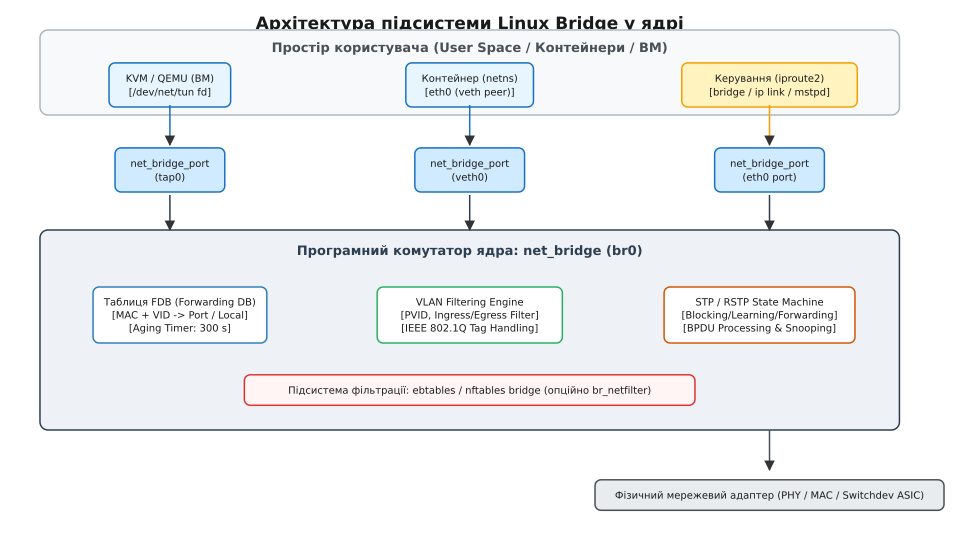
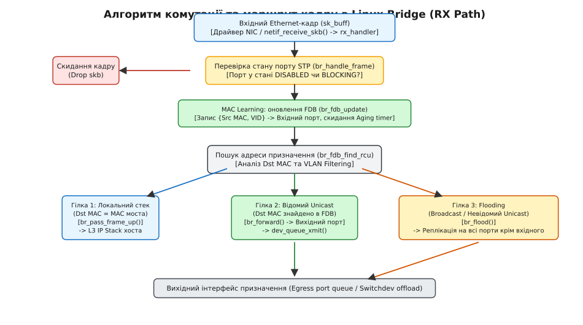
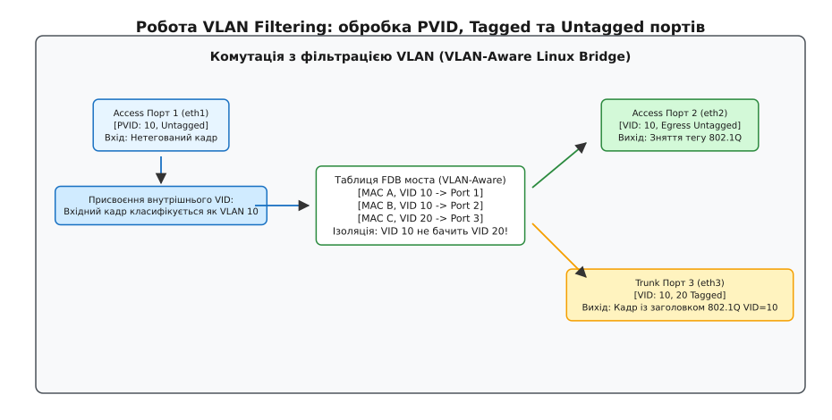
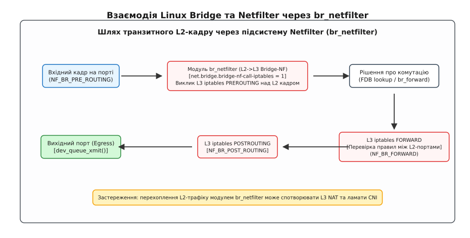

# Linux Bridge: програмний L2-комутатор у ядрі

<preknowlist>
- [Мережевий стек ядра Linux](book:unix-linux/network-stack-architecture) — буферизація кадрів у структурі `sk_buff`, життєвий цикл пакета від драйвера через NAPI до рівня L3.
- [Мережеві інтерфейси та IP-адресація](book:unix-linux/interfaces-and-addresses) — модель пристроїв `struct net_device`, адресація MAC/IP та конфігурація через `iproute2`.
- [Віртуальні тунельні інтерфейси TUN/TAP](book:unix-linux/tun-tap) — функціонування TAP-пристроїв канального рівня для емуляції мережевих карт у віртуалізації.
- [Мережеві простори імен](book:unix-linux/network-namespaces) — ізоляція мережевого стека, робота віртуальних кабелів `veth` між просторами.
- [Архітектура Netfilter](book:unix-linux/netfilter-model) — механізм пакетних хуків у ядрі, таблиці та ланцюги фільтрації.
- [Протокол Netlink та rtnetlink](book:unix-linux/netlink-protocol) — шина взаємодії між ядром та простором користувача для керування мережевою конфігурацією.
</preknowlist>

Коли на одному фізичному сервері одночасно запускаються десятки віртуальних машин або сотні контейнерів, кожен із них отримує власний віртуальний мережевий адаптер. Якщо цим вузлам потрібно взаємодіяти між собою так, ніби вони підключені мідними патч-кордами до спільного апаратного комутатора, маршрутизація на третьому рівні (L3) виявляється надлишковою або неприйнятною. Службові протоколи канального рівня (ARP-запити, DHCP-повідомлення, IPv6 Neighbor Discovery), міграція віртуальних машин зі збереженням їхніх IP-адрес без переналаштування шлюзів, а також ізоляція клієнтів у межах віртуальних локальних мереж (VLAN) вимагають повноцінного L2-сегмента.

Цю задачу в ядрі Linux вирішує підсистема **Linux Bridge** (міст Linux) — повнофункціональний програмний Ethernet-комутатор стандарту IEEE 802.1D/802.1Q. Він об'єднує фізичні мережеві контролери, віртуальні пари `veth` та TAP-інтерфейси у спільний канальний домен, динамічно вивчає MAC-адреси, запобігає петлям за допомогою протоколу Spanning Tree, фільтрує трафік за тегами VLAN і керує апаратними комутаційними чіпами через інтерфейс Switchdev.


*Архітектура підсистеми Linux Bridge у ядрі: взаємодія між простором користувача, структурами net_bridge, slave-портами та фізичним обладнанням.*

---

## 1. Архітектура підсистеми Bridge в ядрі Linux

Програмний міст у Linux реалізовано у модулі ядра `bridge` (вихідний код у каталозі `net/bridge/`). З погляду мережевого стека екземпляр моста є повноцінним мережевим інтерфейсом класу `struct net_device` (Master Device), який не має власного фізичного приймача чи передавача, а агрегує під собою інші мережеві інтерфейси (Slave Ports / Slave Devices).

### Ключові структури даних ядра

Внутрішній стан комутатора описується чотирма основними структурами, визначеними у заголовковому файлі `net/bridge/br_private.h`:

1. **`struct net_bridge`** — представляє сам комутатор (master-пристрій).
2. **`struct net_bridge_port`** — представляє порт комутатора, прив'язаний до конкретного інтерфейсу `net_device`.
3. **`struct net_bridge_fdb_entry`** — описує запис у таблиці комутації FDB (Forwarding Database).
4. **`struct net_bridge_vlan_group`** — містить інформацію про конфігурацію VLAN на рівні моста або окремого порту.

```c
struct net_bridge {
    spinlock_t              lock;
    spinlock_t              hash_lock;
    struct list_head        port_list;          /* Список підключених портів */
    struct net_device       *dev;               /* Власний net_device моста */
    struct rhashtable       fdb_hash_tbl;       /* Таблиця комутації FDB */
    
    /* Параметри STP (Spanning Tree Protocol) */
    bridge_id               bridge_id;          /* Пріоритет + MAC-адреса */
    unsigned long           ageing_time;        /* Час застарівання FDB (jiffies) */
    u8                      stp_enabled;        /* 0=OFF, 1=KERNEL, 2=USER */
    
    /* Фільтрація VLAN */
    u8                      vlan_filtering;     /* Прапорець vlan_filtering (0 або 1) */
    u16                     default_pvid;       /* PVID за замовчуванням (зазвичай 1) */
    struct net_bridge_vlan_group __rcu *vlgrp;  /* База конфігурацій VLAN */
    
    /* Багатоадресна розсилка (Multicast Snooping) */
    struct net_bridge_mdb_htable __rcu *mdb;    /* База даних Multicast (MDB) */
    u8                      multicast_snooping; /* 1 = увімкнено IGMP snooping */
};
```

Кожен порт, підключений до моста, описується структурою `net_bridge_port`:

```c
struct net_bridge_port {
    struct net_bridge       *br;                /* Вказівник на батьківський міст */
    struct net_device       *dev;               /* Підпорядкований інтерфейс (eth0, veth0) */
    struct list_head        list;               /* Елемент списку br->port_list */
    
    u8                      state;              /* Стан порту STP (BR_STATE_*) */
    u8                      priority;           /* Пріоритет порту STP */
    u32                     path_cost;          /* Вартість шляху STP */
    u16                     port_no;            /* Внутрішній індекс порту в мості */
    u32                     flags;              /* Прапорці (BR_LEARNING, BR_FLOOD, BR_ISOLATED) */
    
    struct net_bridge_vlan_group __rcu *vlgrp;  /* VLAN-конфігурація порту */
    struct rcu_head         rcu;
};
```

### Контекст пакета та структура `br_input_skb_cb`

Під час проходження крізь міст кожен буфер кадру `sk_buff` несе в собі специфічні службові метадані комутатора. Для цього використовується системне поле управління `skb->cb` (Control Buffer), яке ядро кастить до спеціальної структури `struct br_input_skb_cb`:

```c
struct br_input_skb_cb {
    struct net_device *brdev;                   /* Вказівник на пристрій моста */
    u16 frag_max_size;                          /* Максимальний розмір фрагмента */
    u16 vlan_tci;                               /* Тимчасовий тег VLAN (TCI) */
    struct net_bridge_vlan *vlan;               /* Вказівник на об'єкт VLAN */
    struct net_bridge_port *src_port;           /* Вхідний порт комутатора */
    u8 igmp;                                    /* Ознака пакета IGMP/MLD */
    u8 mcast_token;                             /* Токен черги мультикасту */
};
```

Макрос `BR_INPUT_SKB_CB(skb)` забезпечує швидкий доступ до вхідного порту та асоційованого VLAN без потреби повторного розбору канальних заголовків на кожному етапі обробки.

### Узгодження MTU на портах моста

Міст автоматично відстежує максимальний розмір корисного навантаження (MTU) усіх підпорядкованих інтерфейсів. За замовчуванням функція ядра `br_mtu_auto_adjust()` встановлює власний MTU моста рівним мінімальному значенню серед усіх підключених портів:

```
MTU(bridge) = min(MTU(port_1), MTU(port_2), ..., MTU(port_N))
```

Якщо до моста з портами 1500 байт підключити порт із Jumbo Frames (9000 байт), міст збереже розмір 1500 байт, щоб уникнути відкидання пакетів на менших інтерфейсах. Якщо адміністратор вручну призначає фіксований MTU на мості через `ip link set dev br0 mtu 9000`, ядро вимикає автоматичне підлаштування і вимагає від адміністратора ручного контролю розмірів кадрів на всіх портах.

### Модель блокувань та синхронізація

Підсистема моста розрахована на високу паралельність обробки на багатоядерних процесорах. Для цього застосовано багаторівневу модель синхронізації:
- **`br->lock`** (спінлок): захищає глобальні конфігураційні зміни моста — додавання та видалення портів, модифікацію станів STP, зміну таймерів. Утримується тільки під час виконання керуючих операцій із простору користувача;
- **`br->hash_lock`** (спінлок): захищає операції модифікації таблиці FDB при виявленні нових адрес або видаленні застарілих записів збирачем сміття;
- **RCU (Read-Copy Update)**: використовується на критичному шляху пересилання пакетів (Fast Path). Пошук адреси призначення у таблиці FDB (`br_fdb_find_rcu()`), перевірка правил VLAN (`br_vlan_group_rcu()`) та обхід списку портів здійснюються всередині секцій `rcu_read_lock()` абсолютно без використання блокувань, що усуває взаємне блокування процесорних ядер (Lock Contention).

### Реєстрація та механізм перехоплення `rx_handler`

Коли інтерфейс додається до моста (наприклад, командою `ip link set dev eth0 master br0`), ядро виконує функцію `br_add_if()`. У процесі приєднання викликається функція `netdev_rx_handler_register(dev, br_handle_frame, p)`.

Цей виклик встановлює вказівник `dev->rx_handler` на функцію `br_handle_frame`. Від цього моменту драйвер фізичної або віртуальної мережевої карти більше не передає пакети безпосередньо в протокольні стеки L3 хоста (IP/IPv6). Як тільки кадри зчитуються з кільцевого буфера приймача (RX Ring) у softirq через механізм NAPI, функція `netif_receive_skb()` виявляє встановлений `rx_handler` і передає управління комутаційному рушію моста.

> 🔧 **Навіщо це.** Встановлення `rx_handler` дозволяє мосту перехоплювати пакети на нульовій стадії обробки в ядрі. Інтерфейси-раби (slave interfaces) втрачають власну пряму L3-ідентичність: призначені їм IP-адреси стають неактивними для зовнішнього світу, а весь вхідний потік перенаправляється в логіку L2-комутації.

📜 Детальніше про те, як еволюціонував підхід до побудови програмних мостів — від перших патчів ядра 2.2 з утилітою `brctl` до сучасної архітектури, — можна дізнатися у вставці [Еволюція Linux Bridge: від brctl до VLAN-filtering та Switchdev](book:unix-linux/linux-bridge/hist-bridge-evolution.md).

---

## 2. Життєвий цикл вхідного кадру (RX Forwarding Path)

Обробка кожного вхідного кадру в Linux Bridge підпорядковується жорсткому детермінованому алгоритму. Функція `br_handle_frame()` у `net/bridge/br_input.c` є головною точкою входу канального комутатора.


*Алгоритм обробки вхідного Ethernet-кадру: перевірка STP, оновлення таблиці FDB та розгалуження на локальний стек, цільовий порт або широкомовну розсилку (Flooding).*

### Крок 1. Перевірка стану STP та link-local адрес

Насамперед перевіряється поточний стан порту:
- Якщо порт перебуває в стані `BR_STATE_DISABLED`, буфер кадру (`sk_buff`) негайно вивільняється (`kfree_skb`);
- Якщо порт перебуває в стані `BR_STATE_BLOCKING` або `BR_STATE_LISTENING`, міст перевіряє, чи не є пакет службовим кадром BPDU (Bridge Protocol Data Unit). Кадри BPDU надсилаються на зарезервовану групову MAC-адресу `01:80:C2:00:00:00`. Якщо це BPDU, кадр передається підсистемі STP (`br_handle_local_finish`), а всі інші користувацькі дані відкидаються.

Ядро також виконує фільтрацію зарезервованого діапазону адрес стандарту IEEE 802.1D (`01:80:C2:00:00:00` .. `01:80:C2:00:00:0F`). За замовчуванням ці кадри (наприклад, протокол виявлення сусідів LLDP `01:80:C2:00:00:0E` або LACP `01:80:C2:00:00:02`) не комутуються на інші порти, оскільки вони мають залишатися локальними для даного фізичного лінка.

Адміністратор може змінити цю поведінку за допомогою 16-бітної маски `group_fwd_mask`. Кожен біт у масці відповідає останньому ніблу MAC-адреси. Наприклад, встановлення значення `0x4000` (біт 14) дозволяє мосту прозоро пересилати кадри LLDP через свої порти:

```bash
# Дозвіл пропуску LLDP (01:80:c2:00:00:0e) через міст br0
echo 0x4000 > /sys/class/net/br0/bridge/group_fwd_mask
```

### Крок 2. Динамічне навчання MAC-адрес (MAC Learning)

Якщо порт перебуває в стані `BR_STATE_LEARNING` або `BR_STATE_FORWARDING`, і на порті не вимкнено прапорець `BR_LEARNING`, міст фіксує джерело трафіку.

Викликається функція `br_fdb_update(br, p, eth_hdr(skb)->h_source, vid, flags)`. Вона виконує пошук комбінації `{Source MAC, VLAN ID}` у хеш-таблиці FDB:
1. Якщо запис існує, ядро оновлює позначку часу останньої активності (`dst->updated = jiffies`);
2. Якщо MAC-адреса раніше асоціювалася з іншим портом (вузол мігрував або перепідключився), порт призначення у записі FDB перезаписується на поточний вхідний порт, що забезпечує миттєве оновлення топології;
3. Якщо запису немає, виділяється нова структура `struct net_bridge_fdb_entry` і додається в `fdb_hash_tbl`.

### Крок 3. Прийняття рішення про комутацію (Forwarding Decision)

Після оновлення FDB функція `br_handle_frame_finish()` викликає хук Netfilter `NF_BR_PRE_ROUTING`. Якщо правила фільтрації дозволяють проходження, аналізується MAC-адреса призначення (`eth_hdr(skb)->h_dest`):

1. **Гілка 1: Локальна доставка (Local Delivery)**  
   Якщо MAC-адреса призначення збігається з власною MAC-адресою моста (або адресою одного з його портів із прапорцем `is_local`), пакет призначений локальній операційній системі хоста. Викликається `br_pass_frame_up(skb)`. Пакет передається у вхідну чергу протоколів L3 (IPv4/IPv6) так, ніби він надійшов безпосередньо на інтерфейс `br0`.

2. **Гілка 2: Пряма комутація (Unicast Forwarding)**  
   Якщо MAC-адреса призначення є індивідуальною (Unicast) і знайдена в таблиці FDB (`dst = br_fdb_find_rcu(br, dest, vid)`), ядро перевіряє вихідний порт. Якщо порт призначення збігається з вхідним портом, кадр відкидається (щоб не повертати пакет відправнику), якщо тільки на порті не увімкнено режим `hairpin`. Якщо порти відрізняються, викликається `br_forward(dst->dst, skb, ...)`, який проганяє пакет через хук `NF_BR_FORWARD` та надсилає кадр у чергу передавача цільового інтерфейсу через `dev_queue_xmit()`.

3. **Гілка 3: Розсилка (Flooding)**  
   Якщо MAC-адреса є широкомовною (`FF:FF:FF:FF:FF:FF`), багатоадресною (Multicast) або невідомою для FDB (Unknown Unicast), комутатор змушений виконати лавинну розсилку через функцію `br_flood()`. Пакет клонується за допомогою `skb_clone()` і реплікується на всі активні порти моста у стані `FORWARDING`, які належать до того самого VLAN, за винятком вхідного порту.

```c
/* Спрощена схема вибору маршруту в br_handle_frame_finish */
if (is_multicast_ether_addr(dest)) {
    if (is_broadcast_ether_addr(dest)) {
        br_flood(br, skb, BR_PKT_BROADCAST, false);
    } else {
        /* Обробка через IGMP snooping / MDB або загальний multicast flood */
        br_multicast_forward(br, skb, false);
    }
} else if ((dst = br_fdb_find_rcu(br, dest, vid)) != NULL) {
    if (dst->is_local)
        return br_pass_frame_up(skb);
    br_forward(dst->dst, skb, false, true);
} else {
    /* Невідомий Unicast: розсилка на всі порти */
    br_flood(br, skb, BR_PKT_UNICAST, false);
}
```

---

## 3. Таблиця комутації FDB та механізм застарівання (Aging)

Таблиця FDB (Forwarding Database) є пам'яттю комутатора. У сучасних версіях ядра вона побудована на базі механізму `rhashtable` — динамічно масштабованої блокувально-безпечної хеш-таблиці з читанням без блокувань через RCU (Read-Copy Update).

### Структура запису FDB

```c
struct net_bridge_fdb_entry {
    struct rhash_head       rhlist;
    struct net_bridge_port  *dst;           /* Порт виходу */
    struct net_bridge_fdb_key key;          /* Ключ: { MAC-адреса, VLAN ID } */
    struct rcu_head         rcu;
    unsigned long           updated;        /* Час останньої активності (jiffies) */
    unsigned long           used;
    u16                     flags;          /* BR_FDB_LOCAL, BR_FDB_STATIC */
    u8                      is_local:1,     /* 1 = MAC належить самому хосту */
                            is_static:1,    /* 1 = статично заданий адміністратором */
                            is_dynamic:1,   /* 1 = вивчений автоматично */
                            added_by_user:1;
};
```

### Хешування та пошук у FDB

Пошук у таблиці FDB виконується за допомогою функції хешування ключа `struct net_bridge_fdb_key`. Ключ складається з 6 байтів MAC-адреси та 2 байтів VLAN ID.

У ядрі Linux використовується криптографічно стійка функція SipHash / Jenkins Hash:

```
hash = jhash_2words(mac_lower_32, (mac_upper_16 << 16) | vlan_id, salt)
```

Завдяки хешуванню складність пошуку та вставки становить `O(1)`. Якщо виникає колізія адрес, записи пов'язуються в однозв'язний список всередині кошика (bucket) `rhashtable`, а обхід ланцюжка колізій виконується безпечно під захистом `rcu_read_lock()`. При зростанні кількості записів таблиця автоматично розширює кількість кошиків у фоновому потоці ядра.

### Типи записів у FDB

Таблиця оперує трьома основними категоріями записів:

1. **`local` (локальні)**: створюються автоматично ядром для MAC-адреси самого моста `br0` та кожного приєднаного інтерфейсу `ethX`/`vethX`. Кадри з цими адресами призначення направляються вгору до L3-стека хоста. Локальні записи мають найвищий пріоритет, ніколи не видаляються таймером застарівання і не передаються назовні.
2. **`static` (статичні / permanent)**: вносяться вручну адміністратором або SDN-контролером через Netlink чи утиліту `bridge fdb add`. Вони не мають обмеження за часом життя і зберігаються до явного видалення.
3. **`dynamic` (динамічні)**: створюються автоматично під час аналізу вхідного трафіку механізмом MAC Learning. Вони підлягають процедурі застарівання (Aging).

### Збирач сміття та таймер застарівання

Для запобігання переповненню пам'яті та коректної реакції на зміну розташування мережевих пристроїв динамічні записи мають обмежений час життя — параметр `ageing_time` (за замовчуванням 300 секунд = 5 хвилин).

Ядро запускає періодичний таймер `br->gc_timer` (Garbage Collection Timer). Кожні декілька секунд функція `br_fdb_cleanup()` ітерує по таблиці FDB. Якщо для динамічного запису виконується умова:

```
time_before(fdb->updated + br->ageing_time, jiffies)
```

запис вважається мертвим, видаляється з хеш-таблиці та вивільняється через RCU callback `br_fdb_free()`.

```
Динамічний запис FDB:
[ Створення під час прийому пакета: updated = jiffies ]
                      |
                      | (Вхідні пакети оновлюють updated = jiffies)
                      v
      +-------------------------------+
      | Активний обмін трафіком       |
      +-------------------------------+
                      |
                      | (Відсутність пакетів протягом ageing_time = 300 с)
                      v
      +-------------------------------+
      | gc_timer виявляє застарівання |
      +-------------------------------+
                      |
                      v
      [ Видалення запису з FDB (RCU free) ]
```

Під час топологічних перебудов мережі STP таймер `ageing_time` тимчасово скорочується до значення `forward_delay` (зазвичай 15 секунд). Це змушує комутатор швидко скинути застарілі маршрути до хостів, які могли переключитися на інші фізичні сегменти.

---

## 4. Оптимізація багатоадресного трафіку: IGMP/MLD Snooping

Широкомовна розсилка багатоадресних пакетів (Multicast) створює надлишкове навантаження на кінцеві вузли, яким цей потік не потрібен. Для вирішення цієї проблеми у міст інтегровано механізм **IGMP/MLD Snooping** (підсистема `net/bridge/br_multicast.c`).

Коли функція `multicast_snooping` активна, міст підглядає (snooping) у службові пакети керування групами:
- **IGMP Membership Report** (IPv4) або **MLD Report** (IPv6), що надходять від клієнтів;
- **IGMP General Query**, що надсилаються мультикаст-маршрутизатором.

На основі цих повідомлень ядро будує спеціалізовану базу даних багатоадресної розсилки — **MDB (Multicast Database)**:

```c
struct net_bridge_mdb_entry {
    struct rhash_head       rhlist;
    struct net_bridge       *br;
    struct net_bridge_port_group __rcu *ports;  /* Список зацікавлених портів */
    struct net_bridge_mdb_key key;              /* Ключ: { Multicast IP, VID } */
    struct timer_list       timer;              /* Таймер членства в групі */
};
```

Коли через міст проходить багатоадресний потік (наприклад, IPTV-трансляція або трафік кластерної реплікації на адресу `239.255.0.1`), функція `br_multicast_forward()` виконує пошук у MDB:
- Якщо підписники знайдено, кадри копіюються **виключно на ті порти**, вузли яких надіслали звіт про підписку;
- Інші порти моста повністю звільняються від обробки небажаного трафіку;
- Якщо в сегменті немає апаратного мультикаст-маршрутизатора, міст може самостійно виконувати роль опитувача (Querier), генеруючи періодичні запити перевірки наявності підписників (`mcast_querier 1`).

---

## 5. Протоколи Spanning Tree (STP, RSTP) та стани портів

Якщо кілька комутаторів з'єднати між собою замкненим контуром для забезпечення відмовостійкості каналів, у мережі виникає петля комутації (Bridging Loop). Оскільки Ethernet-заголовок не має лічильника часу життя (як поле TTL в IP-пакетах), будь-який широкомовний або невідомий юнікаст-кадр буде нескінченно циркулювати по кільцю, реплікуючись на кожному вузлі. Це викликає **широкомовний шторм (Broadcast Storm)**, що за лічені мілісекунди повністю паралізує мережевий стек та утилізує 100% CPU.

Для запобігання петлям у Linux Bridge інтегровано протокол Spanning Tree (IEEE 802.1D).

### Стани портів комутатора

Кожен порт моста у будь-який момент часу перебуває в одному з п'яти станів:

| Стан порту | Обробка BPDU | Навчання MAC (FDB) | Пересилання даних (Forwarding) | Призначення стану |
| :--- | :---: | :---: | :---: | :--- |
| **`Disabled`** | Ні | Ні | Ні | Інтерфейс вимкнено адміністративно (`link down`). |
| **`Blocking`** | **Так** | Ні | Ні | Порт заблоковано STP для розриву петлі. Приймає лише BPDU. |
| **`Listening`** | **Так** | Ні | Ні | Тимчасовий стан (15 с). Очікування стабілізації топології. |
| **`Learning`** | **Так** | **Так** | Ні | Тимчасовий стан (15 с). Вивчає MAC-адреси у FDB, але не комутує. |
| **`Forwarding`** | **Так** | **Так** | **Так** | Нормальний робочий стан. Повна комутація та навчання. |

Перехід порту зі стану `Blocking` у стан `Forwarding` займає `2 · forward_delay = 30` секунд (15 с `Listening` + 15 с `Learning`). Ця затримка гарантує, що всі комутатори в мережі встигнуть узгодити кореневий міст (Root Bridge) і визначити заблоковані порти до того, як почнеться пересилання користувацького трафіку.

### Вбудований STP проти демонів простору користувача (RSTP/MSTP)

Ядро Linux підтримує три режими роботи STP (`/sys/class/net/<br>/bridge/stp_state`):

1. **`0` — STP вимкнено**: всі порти одразу переходять у стан `Forwarding`. Використовується за замовчуванням у віртуалізації та контейнерах, де топологія є строго деревом (зіркою) і петлі фізично неможливі.
2. **`1` — Вбудований ядровий STP (802.1D-1998)**: застарілий алгоритм Spanning Tree, реалізований всередині ядра. Має повільний час збіжності (30–50 секунд).
3. **`2` — Делегування демону простору користувача**: ядро перехоплює всі кадри BPDU і передає їх через сокети Netlink або TAP-дескриптор спеціалізованому демону (наприклад, `mstpd` або `systemd-networkd`). Демон обчислює швидке дерево RSTP (IEEE 802.1w, збіжність за < 1 с) або множинне дерево MSTP (IEEE 802.1s) і надсилає ядру команди на миттєву зміну станів портів (`RTM_SETLINK`).

```bash
# Увімкнення STP на мості br0
sudo ip link set dev br0 type bridge stp_state 1

# Перевірка стану STP портів моста
bridge link show dev eth0
```

---

## 6. VLAN Filtering: сучасна архітектура 802.1Q комутації

До ядра Linux 3.8 ізоляція трафіку між різними VLAN вимагала створення окремого екземпляра моста під кожен VLAN (`br10`, `br20`) та нарізання віртуальних саб-інтерфейсів (`eth0.10`, `eth0.20`). Цей підхід породжував тисячі віртуальних інтерфейсів, перевантажував пам'ять і створював високий оверхед на блокуваннях.

Механізм **VLAN Filtering** (`CONFIG_BRIDGE_VLAN_FILTERING`) перетворив Linux Bridge на повноцінний VLAN-aware комутатор корпоративного рівня.


*Механізм фільтрації VLAN у межах одного моста: робота PVID для нетегованого входу та правила модифікації заголовків 802.1Q на виході.*

### Концепція PVID, Tagged та Untagged

Коли на мості активовано `vlan_filtering 1`, кожен вхідний та вихідний кадр перевіряється на відповідність правилам порту:

1. **PVID (Port VLAN ID)**  
   Визначає VLAN за замовчуванням для нетегованих (Untagged) вхідних кадрів. Коли звичайний Ethernet-кадр без заголовка 802.1Q надходить на порт, міст автоматично асоціює його з внутрішнім номером VLAN, рівним PVID цього порту.
2. **Ingress Filtering (Вхідна фільтрація)**  
   Якщо кадр прийшов із тегом 802.1Q (наприклад, VID=10), міст перевіряє, чи дозволено VID 10 у списку конфігурації цього порту (`net_bridge_vlan_group`). Якщо VID 10 відсутній у дозволених, кадр негайно скидається.
3. **Egress Untagged vs Tagged (Вихідне тегування)**  
   Під час відправки кадру через вихідний порт міст перевіряє прапорці для даного VID:
   - Якщо активний прапорець **`untagged`** (Access Port), 4-байтний заголовок IEEE 802.1Q знімається перед передачею у фізичний кабель чи віртуальну машину;
   - Якщо прапорець `untagged` відсутній (Trunk Port), кадр залишається тегованим або тегується відповідним VID.

### Структура VLAN у FDB

Таблиця FDB при увімкненому VLAN filtering стає двовимірною: пошук порту призначення здійснюється не просто за MAC-адресою, а за парою `{MAC, VLAN ID}`. Це забезпечує повну ізоляцію: якщо хост A (VLAN 10) і хост B (VLAN 20) мають однакові MAC-адреси або надсилають широкомовні ARP-запити, вони ніколи не побачать трафік один одного всередині моста.

```bash
# Увімкнення VLAN Filtering на мості br0
sudo ip link set dev br0 type bridge vlan_filtering 1

# Налаштування порту eth1 як Access Port у VLAN 10 (PVID 10, вихід без тегу)
sudo bridge vlan del dev eth1 vid 1
sudo bridge vlan add dev eth1 vid 10 pvid untagged

# Налаштування порту eth2 як Trunk Port (пропускає теговані VLAN 10, 20 та 30)
sudo bridge vlan del dev eth2 vid 1
sudo bridge vlan add dev eth2 vid 10
sudo bridge vlan add dev eth2 vid 20
sudo bridge vlan add dev eth2 vid 30
```

---

## 7. Інтеграція з Netfilter: перетин L2 та L3 (`br_netfilter`)

Традиційна модель мережевого стека строго розділяє рівні: L2-комутація оперує Ethernet-кадрами, а L3-фільтрація (файрвол Netfilter / iptables) працює з IP-пакетами. Проте в Linux історично виникла потреба фільтрувати трафік між портами комутатора за допомогою правил IP-файрволу.

Для цього було створено модуль ядра **`br_netfilter`**.


*Проходження L2-кадрів через підсистему Netfilter під час увімкненого модуля br_netfilter та виклик правил iptables.*

### Механізм перехоплення `Bridge-NF`

Коли модуль `br_netfilter` завантажено в ядро, він реєструє власні обробники на L2-хуках комутатора (`NF_BR_PRE_ROUTING`, `NF_BR_FORWARD`, `NF_BR_POST_ROUTING`).

Коли Ethernet-кадр проходить через міст, `br_netfilter` перевіряє, чи містить він корисне навантаження IPv4 або IPv6. Якщо так, модуль **штучно викликає хуки L3 Netfilter** (`NF_INET_PRE_ROUTING`, `NF_INET_FORWARD`, `NF_INET_POST_ROUTING`) безпосередньо над транзитним L2-кадром, підміняючи вхідний та вихідний інтерфейси на підпорядковані порти моста.

Керування цією поведінкою здійснюється через змінні `sysctl`:

```bash
# Пропускати транзитний L2 трафік через правила iptables
sudo sysctl -w net.bridge.bridge-nf-call-iptables=1

# Пропускати транзитний L2 IPv6 трафік через ip6tables
sudo sysctl -w net.bridge.bridge-nf-call-ip6tables=1

# Пропускати ARP кадри через arptables
sudo sysctl -w net.bridge.bridge-nf-call-arptables=1
```

### Пастки та архітектурні конфлікти `br_netfilter`

Хоча `br_netfilter` дозволяє будувати прозорі фільтрувальні мости (Transparent Firewalls), у сучасній хмарній інфраструктурі він часто стає джерелом критичних проблем:

1. **Конфлікт із трансляцією адрес (L3 NAT vs L2 Bridge)**  
   Якщо на хості налаштовано L3 NAT (наприклад, Docker `MASQUERADE` або Kubernetes `kube-proxy`), транзитні L2-пакети віртуальних машин або подів, що проходять через міст, можуть помилково потрапити під дію правил `iptables -t nat -A POSTROUTING` і отримати підміну IP-адреси відправника на адресу хоста. Це руйнує симетричність маршрутизації та ламає з'єднання.
2. **Падіння продуктивності**  
   Прогін кожного L2-кадру через сотні правил `iptables` вимагає розбору L3/L4 заголовків, роботи системи відстеження з'єднань (`conntrack`) і створює колосальне навантаження на CPU. У середовищах із перекриттям приватних IP-адрес (наприклад, два клієнти з IP `10.0.0.1`) conntrack може помилково вважати сесії однаковими, якщо не налаштовано розділення через зони conntrack (`-j CT --zone X`).
3. **Сучасна чиста альтернатива**  
   У сучасних дистрибутивах Linux для фільтрації L2-трафіку рекомендується використовувати **`nftables` сімейства `bridge`** (`table bridge filter`) або утиліту `ebtables`. Вони працюють суто на канальному рівні безпосередньо у хуках `NF_BR_*` без завантаження модуля `br_netfilter` і без побічних ефектів для L3-стека хоста.

---

## 8. Віртуалізація та контейнеризація: veth, tap та оптимізація

Linux Bridge є фундаментальним будівельним блоком мережевої віртуалізації Linux.

```
+------------------------------------------------------------------------+
|                          Хост Linux (Host OS)                          |
|                                                                        |
|  +---------------------+   +--------------------+                      |
|  | QEMU / KVM (ВМ)     |   | Container (netns)  |                      |
|  | [ Guest eth0 ]      |   | [ Container eth0 ] |                      |
|  +----------+----------+   +---------+----------+                      |
|             | (/dev/net/tun)         | (veth peer)                     |
|             v                        v                                 |
|          [ tap0 ]                 [ veth0 ]     [ eth0 (Physical NIC) ]|
|             |                        |                     |           |
|             +------------------------+---------------------+           |
|                                      |                                 |
|                                      v                                 |
|                        +---------------------------+                   |
|                        |   Linux Bridge (br0)      |                   |
|                        |   [ FDB + VLAN Filtering] |                   |
|                        +---------------------------+                   |
+------------------------------------------------------------------------+
```

### Підключення віртуальних машин (KVM/QEMU через TAP)

Гіпервізор QEMU/KVM створює віртуальний мережевий адаптер для гостьової ОС через символьний пристрій `/dev/net/tun` у режимі `IFF_TAP`. З боку хоста з'являється мережевий інтерфейс `tap0`.
- Коли гостьова ОС відправляє L2-кадр, гіпервізор записує байти у файловий дескриптор TAP;
- Інтерфейс `tap0` генерує пакет у ядрі хоста, який негайно перехоплюється `rx_handler` моста;
- Зворотний трафік комутується мостом у чергу `tap0`, звідки QEMU зчитує його і передає віртуальній карті гостя.

### Підключення контейнерів (Docker, LXC, Kubernetes CNI)

Контейнери використовують технологію Network Namespaces (`netns`). Зв'язок між простором імен контейнера та хостом забезпечується парою віртуальних кабелів `veth` (Virtual Ethernet):
- Один кінець пари розміщується всередині простору імен контейнера і перейменовується на `eth0`;
- Другий кінець (`vethXXXX`) залишається в кореневому просторі хоста і підключається до моста (`docker0` або `cbr0`).

### Порівняння технологій L2-комутації у віртуалізації

| Технологія | Продуктивність (PPS) | Гнучкість фільтрації | Підтримка VLAN | Застосування |
| :--- | :---: | :---: | :---: | :--- |
| **Linux Bridge** | Середня / Висока | Висока (VLAN filtering, ebtables, nftables) | Так (802.1Q) | Стандартні віртуальні машини KVM, Docker `bridge`, базові CNI-плагіни Kubernetes. |
| **Open vSwitch (OVS)** | Висока (з DPDK / TC) | Максимальна (OpenFlow, GRE, Geneve, VXLAN) | Так (802.1Q) | Великі хмарні платформи (OpenStack), SDN-оркестрація. |
| **Macvlan / Macvtap** | Дуже висока | Низька (лише пряме демультиплексування за MAC) | Обмежена | Високонавантажені контейнери без потреби прямого зв'язку з хостом. |
| **SR-IOV** | Максимальна (Line Rate) | Апаратна в NIC | Апаратна | Телекомунікаційні застосунки (NFV), бази даних із прямим доступом до заліза. |

### Оптимізація та вузькі місця продуктивності

Для досягнення максимальної пропускної здатності та мінімізації затримок у високонавантажених середовищах застосовуються такі налаштування:

1. **Вимкнення зайвих хуків Netfilter**: якщо фільтрація L3 на мості не потрібна, вимкніть `br_netfilter`:
   ```bash
   sudo sysctl -w net.bridge.bridge-nf-call-iptables=0
   ```
2. **Активація Hairpin Mode**: за замовчуванням міст відкидає кадри, якщо порт призначення збігається з портом відправника. Для віртуальних машин, які використовують технологію VEPA (Virtual Ethernet Port Aggregator) або внутрішню маршрутизацію через один TAP-інтерфейс, необхідно увімкнути режим рефлексивної трансляції (Hairpin):
   ```bash
   sudo bridge link set dev tap0 hairpin on
   ```
3. **Ізоляція портів (Port Isolation / Private VLAN)**: запобігає прямому обміну L2-трафіком між клієнтами на одному мості без залучення зовнішнього маршрутизатора:
   ```bash
   sudo bridge link set dev veth-client1 isolated on
   sudo bridge link set dev veth-client2 isolated on
   ```
4. **Оптимізація Multicast Snooping**: якщо в мережі відсутній багатоадресний відеотрафік, вимкнення IGMP snooping економить процесорний час на парсингу заголовків IGMP/MLD:
   ```bash
   sudo ip link set dev br0 type bridge mcast_snooping 0
   ```

---

## 9. Апаратне розвантаження: Bridge FDB Offload та Switchdev

При роботі на фізичних комутаторах із портами 10G, 40G або 100G/400G центральний процесор хоста фізично не здатний обробити сотні мільйонів пакетів на секунду (Mpps) через програмний міст ядра.

Для таких задач у Linux реалізовано підсистему **Switchdev** — апаратне розвантаження функцій комутації в спеціалізовані мікросхеми ASIC (Application-Specific Integrated Circuit) або SmartNIC.

```
                                  +-----------------------------+
                                  |   Linux Bridge Control      |
                                  |   (iproute2 / bridge / mstp)|
                                  +--------------+--------------+
                                                 |
                                                 v
                                  +-----------------------------+
                                  |   Драйвер Switchdev         |
                                  |   (mlxsw, prestera, nfp)    |
                                  +--------------+--------------+
                                                 |
                     +---------------------------+---------------------------+
                     | Події SWITCHDEV_FDB_ADD / SWITCHDEV_PORT_ATTR_SET     |
                     v                                                       v
+------------------------------------------+    +------------------------------------------+
|  Slow Path (Програмне ядро Linux)        |    |  Fast Path (Апаратний ASIC комутатора)   |
|  - Обробка BPDU / LACP / IGMP Query      |    |  - Апаратна комутація на швидкості дроту |
|  - Невідомий трафік (Trap to CPU)        |    |  - Таблиця TCAM FDB (Line Rate 400 Gbps) |
+------------------------------------------+    +------------------------------------------+
```

### Принцип роботи Switchdev

У моделі Switchdev кожен фізичний порт комутаційного ASIC реєструється в ядрі Linux як звичайний `net_device` (наприклад, `swp1`, `swp2`). Адміністратор об'єднує їх у стандартний міст `br0` командою `ip link set dev swp1 master br0`.

При цьому комутація відбувається за дворівневою схемою:
1. **Control Plane (Рівень керування)** залишається в ядрі Linux: адміністратор використовує звичайні команди `ip link`, `bridge vlan`, `bridge fdb`, демони `mstpd` чи FRRouting.
2. **Data Plane (Рівень даних)** розвантажується в ASIC: коли ядро вивчає новий MAC або додає VLAN, підсистема Switchdev генерує подію ядра `SWITCHDEV_FDB_ADD_TO_DEVICE`. Драйвер чіпа записує цей маршрут в апаратну таблицю TCAM комутатора через двофазний коміт (Two-Phase Commit: підготовка `SWITCHDEV_TRANS_PREPARE` та фіксація `SWITCHDEV_TRANS_COMMIT`).

Транзитний трафік (Fast Path) комутується безпосередньо всередині мікросхеми на швидкості дроту з нульовим залученням CPU хоста. У центральний процесор (Slow Path) потрапляють лише керуючі кадри (BPDU, ARP, IGMP-запити), які ядро обробляє і відповідає стандартними мережевими протоколами.

---

## 10. Повний довідник інтерфейсів та практичні сценарії

Для розробників системного рівня та мережевих інженерів детальні довідники структур ядра та практичні лабораторії винесено у відповідні вставки:

- Повний перелік системних структур ядра, типів повідомлень RTNETLINK (`RTM_NEWLINK`, `RTM_NEWNEIGH`), бітових прапорців `IFLA_BR_*`, `IFLA_BRPORT_*` та вузлів `sysfs` зведено у довіднику 📋 [Довідник інтерфейсів Netlink та sysfs для Linux Bridge](book:unix-linux/linux-bridge/api-bridge-netlink.md).
- Покрокове розгортання багатоклієнтського стенду з ізоляцією VLAN, налаштуванням Access/Trunk портів та програмним керуванням FDB моста на C та C++ продемонстровано у практичному посібнику ⚙️ [Практикум: конфігурація VLAN Filtering та керування FDB у Linux Bridge](book:unix-linux/linux-bridge/proj-bridge-vlan-lab.md).

---

## Підсумковий синтез

Linux Bridge трансформувався з простого програмного емулятора концентратора в універсальне ядро канальної комутації сучасних операційних систем. Його архітектура поєднує детермінований шлях комутації через `rx_handler`, високоефективну блокувально-безпечну таблицю FDB на базі RCU, підтримку ізоляції IEEE 802.1Q через VLAN Filtering та можливість прозорого керування апаратними чіпами центрів обробки даних через Switchdev. Розуміння точок взаємодії моста зі стеками L3 та підсистемою Netfilter є критично необхідним для побудови надійних, масштабованих та безпечних мереж віртуалізації та контейнеризації.
