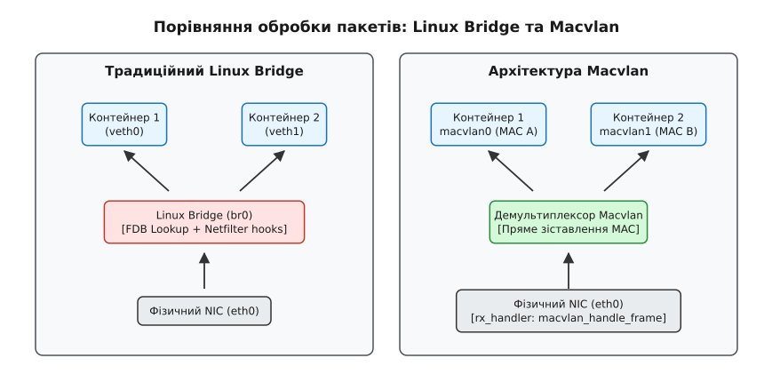
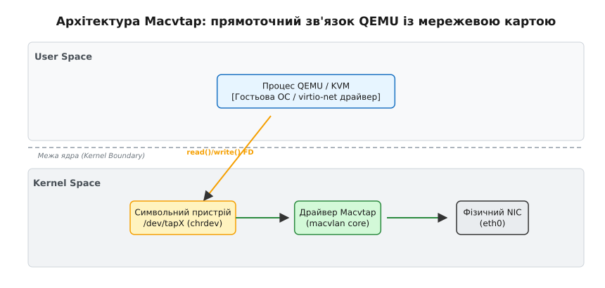

# Драйвери Macvlan та Macvtap

<preknowlist>
- [Мережеві простори імен, veth і мости](topic:unix-linux/network-namespaces) — механізми ізоляції L2-мереж та функціонування програмного мосту Linux Bridge.
- [TUN/TAP: віртуальні інтерфейси](topic:unix-linux/tun-tap) — віртуальні мережеві пристрої юзерспейсу для передачі пакетів у гіпервізори.
</preknowlist>

При використанні програмного мосту Linux Bridge для об'єднання віртуальних мережевих інтерфейсів контейнерів кожен мережевий пакет проходить через таблицю Forwarding Database (FDB), механізми Spanning Tree Protocol (STP), перевірки налаштувань фільтрації netfilter (`iptables` / `nftables`) та зазнає блокувань на внутрішніх замок списків пристроїв. У високонавантажених системах із тисячами пакетів на секунду ця багатошарова обробка створює помітні накладні витрати центрального процесора та збільшує затримку (latency). Драйвери **Macvlan** та **Macvtap** реалізують альтернативний, прямоточний підхід до віртуалізації канального рівня (L2), усуваючи з шляху пакета мостовий стек ядра і забезпечуючи безпосередню прив'язку віртуальних MAC-адрес до фізичного мережевого адаптера.

[Історія виникнення Macvlan та Macvtap](topic:unix-linux/macvlan-macvtap-drivers/hist-macvlan-genesis.md) демонструє, як ядро Linux еволюціонувало від важких програмних комутаторів до виділених демультиплексорів кадрів.


*Порівняння традиційної мостової архітектури Linux Bridge та прямоточного демультиплексування Macvlan.*

---

## Проблема продуктивності Linux Bridge у віртуалізованих середовищах

Традиційна віртуалізація мереж у Linux базувалася на викликах модуля `bridge`. Коли контейнер або віртуальна машина приєднується до мосту через віртуальну пару `veth` або `TAP`-пристрій, ядро розглядає цей міст як повноцінний програмний L2-комутатор. Поведінка мосту регулюється стандартом IEEE 802.1D.

Процес обробки кожного пакета всередині Linux Bridge включає наступні кроки:

1. **Динамічне навчання MAC-адрес (MAC Learning):** Для кожного вхідного кадру ядро витягує Source MAC-адресу і додає або оновлює відповідний запис у хеш-таблиці Forwarding Database (FDB). Це вимагає захоплення м'якого блокування (spinlock) або використання механізмів RCU з постійним оновленням лічильників часу (aging time).
2. **Пошук порту призначення (FDB Lookup):** Драйвер витягує Destination MAC-адресу і шукає відповідний порт у таблиці FDB. Якщо адреса невідома (Unicast flooding) або пакет є широкомовним (Broadcast), кадр дублюється і розсилається на всі активні порти мосту.
3. **Хуки Netfilter (`br_netfilter`):** Якщо у системі завантажено модуль `br_netfilter`, кожен L2-кадр мосту примусово передається на перевірку в ланцюжки `iptables` / `nftables` (наприклад `FORWARD` та `POSTROUTING`). Це призводить до розпакування мережевих заголовків L3/L4, розрахунку контрольних сум і виконання перевірок таблиці з'єднань (Connection Tracking / `nf_conntrack`), що додає значні затримки на обробку одного пакета.
4. **Контекстні перемикання:** При використанні `veth`-пари пакет мусить пройти два повних цикли NAPI-обробки та обробки переривань `softirq`: перший раз при виході з `veth0` у простір імен контейнера, а второй раз при вході через `veth1` у Linux Bridge.

При збільшенні кількості віртуальних машин або контейнерів до сотень на один фізичний хост Linux Bridge стає головним джерелом затримок та невиправданих витрат CPU.

---

## Внутрішня архітектура та механізм обробки кадрів у ядрі

Драйвер `macvlan` реалізований у ядрі Linux як модуль-надбудова над мережевими пристроями (`net_device`). На відміну від `veth`-пари, яка створює два зв'язаних віртуальних інтерфейси, Macvlan створює один дочірній мережевий пристрій, прив'язаний до існуючого фізичного або логічного батьківського інтерфейсу (Parent Device, наприклад `eth0`).

### Внутрішні структури даних ядра (`macvlan_port` та `macvlan_dev`)

Уся функціональність демультиплексора Macvlan тримається на двох ключових структурах даних у коді `drivers/net/macvlan.c`:

1. **`struct macvlan_port`:** Структура порту, яка створюється у єдиному екземплярі та прив'язується до батьківського фізичного мережевого пристрою `eth0` через вказівник `netdev->rx_handler_data`. Вона містить:
   - `struct net_device *dev`: вказівник на батьківський пристрій.
   - `struct hlist_head vlan_hash[MACVLAN_HASH_SIZE]`: хеш-таблиця розрішення MAC-адрес (розміром 256 осередків), де списки хешуються за останнім байтом MAC-адреси (`mac[5]`).
   - `struct list_head vlans`: загальний список усіх дочірніх Macvlan-пристроїв.
   - `struct sk_buff_head bc_queue`: кільцева черга обробки широкомовних та багатоадресних пакетів (Broadcast/Multicast).
   - `struct work_struct bc_work`: відкладена задача воркк'ю для розсилки широкомовних пакетів поза контекстом NAPI softirq.
2. **`struct macvlan_dev`:** Структура конкретного віртуального інтерфейсу Macvlan (наприклад `macvlan0`). Вона вкладена у загальну структуру `net_device` і містить вказівник на свій `macvlan_port`, власну MAC-адресу, режим роботи `enum macvlan_mode` та індивідуальну статистику прийому-передачі.

### Захист пам'яті через RCU (Read-Copy Update)

Пошук у хеш-таблиці `vlan_hash` під час обробки кожного вхідного кадру виконується повністю без блокувань (lockless) завдяки механізму **RCU (Read-Copy Update)**. 

Коли ядро отримує пакет у контексті `netif_receive_skb_core()`, воно входить у критичну секцію читача `rcu_read_lock()`. Функція `macvlan_hash_lookup()` зчитує вказівник на `macvlan_dev` з хеш-таблиці за O(1). Оскільки під час читання не захоплюються жодні м'які або важкі замки, сотні ядер центрального процесора можуть паралельно демультиплексувати пакети з різних RX-черг мережевої карти без жодної конкуренції за пам'ять (cache-line bouncing).

### Реєстрація `rx_handler` на батьківському пристрої

Під час створення першого інтерфейсу Macvlan поверх фізичної мережевої карти `eth0`, ядро виділяє внутрішню структуру `macvlan_port` і реєструє спеціальний обробник вхідних кадрів `macvlan_handle_frame` на батьківському пристрої за допомогою функції `netdev_rx_handler_register()`.

Функція `netdev_rx_handler_register()` атомарно записує вказівник на `macvlan_handle_frame` у поле `dev->rx_handler` батьківського пристрою. Якщо на цьому фізичному інтерфейсі вже зареєстровано інший обробник (наприклад `br_handle_frame` від Linux Bridge або `bond_handle_frame` від bonding), ядро повертає помилку `EBUSY`. Це означає, що один фізичний мережевий адаптер не може одночасно виступати і портом Linux Bridge, і батьком для Macvlan.

При видаленні останнього Macvlan-інтерфейсу ядро викликає `netdev_rx_handler_unregister()`, який скидає `dev->rx_handler` у `NULL` і викликає `synchronize_net()` для очікування завершення всіх поточних RCU-читачів у ядрі.

### Пропагація MAC-адрес у фізичну мережеву карту

Коли на хості створюється новий дочірній інтерфейс `macvlan0` із власною MAC-адресою, ядро повинно сповістити фізичний мережевий адаптер `eth0` про необхідність прийому кадрів для цієї додаткової MAC-адреси.

Для цього драйвер Macvlan викликає функцію ядра `dev_uc_add(lower_dev, mac_addr)` (Unicast Address Add):
1. Якщо мережевий адаптер підтримує апаратні фільтри Unicast MAC-адрес (наприклад мережеві карти Intel `e1000e`/`igb`/`ixgbe` або Mellanox `mlx5`), драйвер NIC записує нову MAC-адресу в один з вільних апаратних регістрів фільтрації.
2. Мережева карта починає приймати пакети для цієї MAC-адреси на апаратному рівні без переведення пристрою у Promiscuous Mode.
3. Якщо апаратні регістри NIC вичерпано (або адаптер не підтримує `dev_uc_add`), драйвер викликом `dev_set_promiscuity(lower_dev, 1)` примусово переводить фізичну мережеву карту у **Promiscuous Mode**.

### Шлях прийому пакета (RX Data Path)

Коли фізичний мережевий адаптер отримує Ethernet-кадр із мережі, переривання NIC та підсистема NAPI передають пакет у функцію `netif_receive_skb()`. Далі розгортається наступний ланцюжок дій:

1. **Перехоплення обробником:** Функція `netif_receive_skb_core()` перевіряє наявність зареєстрованого `rx_handler` у батьківського пристрою `eth0`. Оскільки Macvlan зареєстрував `macvlan_handle_frame`, управління негайно передається цій функції під захистом `rcu_read_lock()`.
2. **Пошук у хеш-таблиці:** Драйвер аналізує заголовок Ethernet (`eth_hdr(skb)->h_dest`) і шукає MAC-адресу призначення у хеш-таблиці `macvlan_port`.
3. **Заміна пристрою призначення:** Якщо MAC-адреса збігається з адресою одного з Macvlan-інтерфейсів (наприклад `macvlan0`), драйвер змінює вказівник пристрою в буфері пакета (`skb->dev = vlan->dev`).
4. **Передача у простір імен:** Пакет повторно повертається у `netif_receive_skb_core()`, але тепер його пристроєм призначення є `macvlan0`. Якщо `macvlan0` перенесено у мережевий простір імен (Network Namespace) контейнера, ядро передає пакет безпосередньо у стек сокетів цього простору імен.

Завдяки цьому шлях пакета оминає таблицю комутації FDB, перевірки STP та хуки `br_netfilter`. Обробка зводиться до одного швидкого пошуку в хеш-таблиці за O(1).

### Шлях передачі пакета (TX Data Path)

Коли процес у контейнері або віртуальній машині надсилає пакет через інтерфейс `macvlan0`, викликається функція передачі `macvlan_start_xmit()`:

1. **Перевірка режиму:** Драйвер аналізує режим роботи (Bridge, VEPA, Private, Passthrough).
2. **Локальна комутація або відправка:** У режимі Bridge драйвер перевіряє, чи не призначений пакет іншому Macvlan-інтерфейсу на цьому ж батьківському пристрої. Якщо так, пакет клонується і передається у внутрішню чергу прийому.
3. **Передача на фізичний NIC:** Якщо пакет призначений зовнішній мережі, `skb->dev` підміняється на батьківський `eth0`, і викликається функція `dev_queue_xmit(skb)`. Фізична мережева карта виштовхує кадр у дріт із MAC-адресою Macvlan у полі джерела (Source MAC).

### Обробка широкомовного трафіку (Broadcast / Multicast Queueing)

Широкомовні кадри (наприклад ARP-запити чи DHCP Discover з MAC-адресою `FF:FF:FF:FF:FF:FF`) та багатоадресні пакети (Multicast) повинні надходити усім дочірнім інтерфейсам Macvlan, прив'язаним до даного батька.

Щоб запобігти блокуванню переривань NAPI під час клонування одного кадру для десятків контейнерів, драйвер Macvlan використовує асинхронну чергу `bc_queue`:
1. При надходженні широкомовного кадру `macvlan_handle_frame()` копіює `skb` і поміщає його в чергу `port->bc_queue`.
2. Якщо черга переповнюється (перевищує ліміт `IFLA_MACVLAN_BC_QUEUE_LEN`, за замовчуванням 1000 пакетів), нові широкомовні кадри скидаються, а лічильник `rx_dropped` збільшується.
3. Системний потік воркк'ю `bc_work` асинхронно витягує кадри з черги, ітегрується по списку `port->vlans` і клонує пакет для кожного дочірнього інтерфейсу.

### Архітектурне обмеження: Ізоляція Host-to-Guest

Найчастішою проблемою під час впровадження Macvlan є **неможливість прямого мережевого зв'язку між хостом (батьківським `eth0`) та дочірнім Macvlan-інтерфейсом**.

Якщо процес на хості з IP-адресою `eth0` намагається надіслати пакет на IP-адресу `macvlan0`, ядро відкидає цей пакет. Причина криється в логіці захисту від мережевих петель (hairpin protection):
- Пакет, надісланий з `eth0`, надходить у TX-чергу батьківського пристрою.
- Драйвер Macvlan не перехоплює локальний вихідний трафік батьківського пристрою на етапі `dev_queue_xmit()`.
- Мережевий адаптер не повертає пакети, вислані в дріт, назад у свій приймач (RX).

Для обходу цього обмеження на хості створюють додатковий Macvlan-інтерфейс (наприклад `macvlan-host`), переносять IP-адресу з `eth0` на `macvlan-host`, і здійснюють комутацію між хостом та контейнерами через режим Bridge Macvlan.

---

## Режими обробки кадрів у драйвері Macvlan

Гнучкість Macvlan зумовлена підтримкою чотирьох режимів обробки кадрів. Режим задається під час створення інтерфейсу або змінюється через RTNetlink.


*Режими роботи Macvlan: Bridge, VEPA, Private та Passthrough.*

### 1. Режим Bridge (`MACVLAN_MODE_BRIDGE`)

У режимі **Bridge** драйвер Macvlan виступає в ролі локального безшумного L2-комутатора для всіх створених дочірніх інтерфейсів над одним батьківським пристроєм.

- **Механізм:** Під час передачі кадру з `macvlan0` драйвер аналізує Destination MAC. Якщо ця MAC-адреса належить `macvlan1`, пакет не виходить на фізичний адаптер `eth0`, а перенаправляється напряму в RX-чергу `macvlan1` у межах ядра.
- **Сфера застосування:** Використовується за замовчуванням у більшості контейнерних середовищ (Docker `macvlan` driver), де потрібна максимальна швидкість обміну даними між контейнерами на одному хості без залучення зовнішнього мережевого обладнання.

### 2. Режим VEPA (`MACVLAN_MODE_VEPA`)

Режим **VEPA (Virtual Ethernet Port Aggregator)** відповідає стандарту IEEE 802.1Qbg.

- **Механізм:** Драйвер забороняє пряму локальну комутацію між дочірніми інтерфейсами. Будь-який пакет, відправлений з `macvlan0` на адресу `macvlan1`, примусово виштовхується через батьківський `eth0` у зовнішню фізичну мережу. Для того щоб `macvlan1` отримав цей пакет, зовнішній апаратний комутатор повинен підтримувати функцію **Hairpin Mode** (або Reflective Relay) — можливість відправити пакет назад у той самий порт, з якого він надійшов.
- **Сфера застосування:** Застосовується в корпоративних дата-центрах, де всі правила безпеки, аналіз трафіку (IDS/IPS), моніторинг та лімітування швидкості повинні виконуватися на централізованих апаратних комутаторах, а не на ЦПУ локального хоста.

### 3. Режим Private (`MACVLAN_MODE_PRIVATE`)

Режим **Private** забезпечує строгу ізоляцію дочірніх інтерфейсів.

- **Механізм:** Дочірні інтерфейси не можуть спілкуватися між собою ані через локальну комутацію ядра, ані через зовнішній комутатор. Навіть якщо зовнішній комутатор працює в режимі Hairpin і повертає пакет назад на хост, обробник `macvlan_handle_frame()` відфільтрує і скине цей пакет (`DROP`), оскільки Source MAC належить сусідньому Macvlan-інтерфейсу того ж батька.
- **Сфера застосування:** Мультитентні хмарні інфраструктури (Multi-tenancy), де контейнери різних клієнтів розміщені на одному фізичному сервері і не повинні мати жодної можливості перехоплювати або надсилати L2-трафік один одному.

### 4. Режим Passthrough (`MACVLAN_MODE_PASSTHROUGH`)

У режимі **Passthrough** створюється ексклюзивне з'єднання між одним дочірнім інтерфейсом та батьківським пристроєм.

- **Механізм:** На одному батьківському `eth0` можна створити **лише один** Macvlan-інтерфейс у режимі Passthrough. Дочірній інтерфейс успадковує MAC-адресу батька, а батьківський пристрій переводиться в спеціальний стан, при якому весь вхідний трафік без фільтрації передається дочірньому інтерфейсу.
- **Сфера застосування:** Використовується у віртуалізації для передачі мережевого адаптера (або віртуальної функції SR-IOV VF) єдиній віртуальній машині з можливістю зміни MAC-адрес та налаштування VLAN безпосередньо з усередині гостьової ОС.

---

## Взаємодія Macvlan з VLAN-тегуванням (802.1Q)

Драйвер Macvlan може накладатися не лише на чисті фізичні інтерфейси `eth0`, але й на віртуальні VLAN-субінтерфейси (наприклад `eth0.10` або `eth0.20`), створені за допомогою 802.1Q vlan-драйвера.

Коли Macvlan-інтерфейс створюється поверх `eth0.10`:
1. **Вихідний трафік (TX):** Пакет із `macvlan0` передається на батьківський `eth0.10`. Драйвер 802.1Q додає 4-байтовий 802.1Q заголовок (VLAN Tag 10) і передає пакет на `eth0`. Фізична мережева карта надсилає тегований кадр у мережу.
2. **Вхідний трафік (RX):** Тегований кадр входить у `eth0`. Підсистема NAPI знімає VLAN-тег і передає кадр у `eth0.10`. Обробник `macvlan_handle_frame()`, прив'язаний до `eth0.10`, аналізує Destination MAC і передає пакет у відповідний `macvlan0`.

Це дозволяє будувати багатошарові віртуалізовані мережі, де контейнери або віртуальні машини ізолюються як на рівні L2 MAC-адрес (через Macvlan), так і на рівні L2 VLAN-сегментів.

---

## Драйвер Macvtap: прямоточна віртуалізація мережі для QEMU/KVM

Контейнери є звичайними процесами Linux, які працюють у власному просторі імен мережі (`netns`) і взаємодіють із ядром через звичайні сокети. Завдяки цьому Macvlan ідеально підходить для контейнеризації.

Однак віртуальні машини (QEMU/KVM) працюють інакше. Гіпервізор QEMU реалізований як процес у просторі користувача (userspace), а гостьова ОС виконує власне ядро з власнісними драйверами мережевих карт (наприклад, `virtio-net`). Для обміну пакетами між процесом QEMU та мережевим стеком ядра традиційно використовувалися TAP-пристрої (`/dev/net/tun`), які вимагали підключення до Linux Bridge.

Драйвер **Macvtap** усуває цю проміжну ланку.


*Архітектурна схема взаємодії QEMU, символьного пристрою /dev/tapX та драйвера Macvtap.*

### Поєднання Macvlan та TAP

Драйвер `macvtap` будується безпосередньо поверх ядра `macvlan`. Він виконує дві функції одночасно:
1. З боку ядра створює L2-мережевий пристрій Macvlan з власною MAC-адресою над батьківським `eth0`.
2. У файловій системі пристроїв створює **символьний пристрій (character device)** `/dev/tapX` (де `X` дорівнює системному індексу інтерфейсу `ifindex`).

### Внутрішня робота символьного пристрою

Процес QEMU відкриває файл пристрою `/dev/tapX` за допомогою системного виклику `open()` і отримує звичайний файловий дескриптор. 

- **Передача кадру гостем (TX):** Коли гостьова ОС надсилає пакет, QEMU виконує системний виклик `write()` або `writev()` у файловий дескриптор. Драйвер Macvtap приймає ці дані, перетворює їх у системний буфер `sk_buff` і викликає `macvlan_start_xmit()`, відправляючи пакет напряму у фізичну мережеву карту `eth0`.
- **Прийом кадру гостем (RX):** Коли фізичний NIC отримує пакет для MAC-адреси Macvtap, `macvlan_handle_frame()` перехоплює його і замість передачі в сокетний стек ядра поміщає `sk_buff` у внутрішню чергу символьного пристрою. Процес QEMU, що очікує подій через `select()`, `poll()` або `epoll()`, виконує `read()` з файлового дескриптора і передає кадр в емульований пристрій `virtio-net`.

### Прискорення через `vhost-net`

У зв'язці з модулем ядра `vhost-net` обробка Macvtap стає ще ефективнішою. `vhost-net` переносить виконання циклу `read/write` з процесу QEMU безпосередньо в потоки ядра (`kthread`). Копирование буферів між простором користувача та ядром повністю усувається: пакети передаються між кільцевими буферами Virtio в RAM віртуальної машини та `sk_buff` Macvtap з нульовим копіюванням (Zero-Copy).

---

## Взаємодія з eBPF, XDP та підсистемою Traffic Control (TC)

Сучасні високопродуктивні мережеві інфраструктури активно використовують **eBPF (Extended Berkeley Packet Filter)** та **XDP (eXpress Data Path)** для обробки пакетів на найнижчих рівнях стека ядра.

### Перехоплення пакетів на рівні XDP

Програми XDP завантажуються безпосередньо в драйвер фізичної мережевої карти (`eth0`) і виконуються у контексті NAPI до виділення системного буфера `sk_buff`:

- Якщо XDP-програма на батьківському пристрої `eth0` повертає вердикт `XDP_PASS`, кадр передається далі у мережевий стек ядра і надходить у `macvlan_handle_frame()`.
- Якщо XDP-програма повертає `XDP_DROP` або `XDP_TX`, пакет відкидається або відправляється назад у дріт до того, як Macvlan дізнається про його існування.
- За допомогою BPF-карти `BPF_MAP_TYPE_DEVMAP` XDP-програма може перенаправляти кадри у дочірній інтерфейс Macvlan через вердикт `XDP_REDIRECT`, оминаючи стандартний виклик `netif_receive_skb_core()`.

### Фільтрація трафіку у Traffic Control (TC)

Хуки TC (`clsact` / `egress` / `ingress`) можна приєднувати як до батьківського пристрою `eth0`, так і до окремих дочірніх пристроїв `macvlan0`:
- eBPF-програма, прив'язана до `tc ingress` на `macvlan0`, бачить трафік лише цього конкретного контейнера.
- eBPF-програма на `eth0` бачить сукупний трафік усіх Macvlan-інтерфейсів хоста.

---

## Оптимізація продуктивності, MTU та Hardware Offloading

Драйвер Macvlan успадковує прапорці функцій апаратного розвантаження (Hardware Offloading) від свого батьківського фізичного мережевого адаптера:

1. **TCP Segmentation Offload (TSO) та Generic Segmentation Offload (GSO):** Процес у контейнері може генерувати великі TCP-суперпакети розміром до 64 Кілобайт. Macvlan не нарізає ці кадри у ядрі, а передає їх у вихідному вигляді батьківському `eth0`, покладаючи на фізичний NIC завдання апаратної сегментації кадрів.
2. **Checksum Offloading:** Обчислення контрольних сум IP, TCP та UDP виконується мережевим адаптером при відправці.
3. **Узгодження MTU:** Розмір Maximum Transmission Unit (MTU) дочірнього Macvlan-інтерфейсу за замовчуванням дорівнює MTU батьківського `eth0`. Якщо адміністратор зменшує MTU на `eth0`, ядро автоматично коригує MTU на всіх дочірніх Macvlan-пристроях. Якщо спробувати встановити MTU на `macvlan0` більшим, ніж на батькові `eth0`, ядро відхилить операцію з помилкою `EINVAL`.

---

## Практична конфігурація: iproute2, Network Namespaces та Libvirt

[Специфікація RTNetlink ABI та sysfs-структур Macvlan/Macvtap](topic:unix-linux/macvlan-macvtap-drivers/api-macvlan-netlink-sysfs.md) містить повний перелік бінарних атрибутів, а нижче наведено практичні команди консольного керування.

### 1. Створення та налаштування Macvlan у консолі

Створення дочірнього інтерфейсу `macvlan0` поверх `eth0` у режимі `bridge`:

```bash
sudo ip link add link eth0 name macvlan0 type macvlan mode bridge
```

Перевірка створеного пристрою:

```bash
ip -d link show macvlan0
```

Приклад виводу:
```text
5: macvlan0@eth0: <BROADCAST,MULTICAST> mtu 1500 qdisc noop state DOWN mode DEFAULT group default qlen 1000
    link/ether 52:54:00:fa:b1:cd brd ff:ff:ff:ff:ff:ff promiscuity 0 minmtu 68 maxmtu 65535 
    macvlan mode bridge
```

### 2. Ізоляція у Network Namespace

Перенесення `macvlan0` у простір імен контейнера `ns-app`:

```bash
# Створення простору імен
sudo ip netns add ns-app

# Переміщення інтерфейсу
sudo ip link set macvlan0 netns ns-app

# Конфігурація IP-адреси всередині ns-app
sudo ip netns exec ns-app ip link set lo up
sudo ip netns exec ns-app ip link set macvlan0 up
sudo ip netns exec ns-app ip addr add 192.168.1.150/24 dev macvlan0
sudo ip netns exec ns-app ip route add default via 192.168.1.1
```

[Створення та керування Macvlan через RTNetlink](topic:unix-linux/macvlan-macvtap-drivers/proj-macvlan-creator.md) демонструє, як виконувати ці самі операції програмно мовами C та C++ без виклику зовнішньої утиліти `ip`.

### 3. Конфігурація Macvtap у Libvirt (KVM)

У віртуалізації під управлінням Libvirt/KVM інтерфейс Macvtap додається у декларативній XML-конфігурації віртуальної машини:

```xml
<interface type='direct'>
  <mac address='52:54:00:4a:88:99'/>
  <source dev='eth0' mode='bridge'/>
  <model type='virtio'/>
  <driver name='vhost'/>
</interface>
```

Під час запуску ВМ служба `libvirtd` автоматично створює інтерфейс `macvtap0`, відкриває `/dev/tapX` і передає файловий дескриптор процесу QEMU.

---

## Простеження обробки пакетів через sysfs, procfs та ftrace

Для діагностики та моніторингу роботи Macvlan/Macvtap ядро надає інформацію у файлових системах `sysfs` та `tracefs`.

### Інспектування sysfs та procfs

Перевірка поточного режиму роботи та підпорядкованості:

```bash
cat /sys/class/net/macvlan0/macvlan/mode
# Вивід: bridge

cat /sys/class/net/macvlan0/lower_eth0/ifindex
# Вивід індексу батьківського пристрою eth0
```

Перевірка статистики втрат пакетів через відсутність черги:

```bash
cat /sys/class/net/macvlan0/statistics/rx_dropped
cat /sys/class/net/macvlan0/statistics/tx_dropped
```

### Трасування через ftrace / tracefs

Для аналізу проходження пакетів через обробник Macvlan використовуються точки трасування (tracepoints) ядра в `/sys/kernel/tracing/`:

```bash
# Увімкнення трасування прийому пакетів
echo 1 | sudo tee /sys/kernel/tracing/events/net/netif_receive_skb/enable

# Фільтрація за іменем інтерфейсу Macvlan
echo "name == 'macvlan0'" | sudo tee /sys/kernel/tracing/events/net/netif_receive_skb/filter

# Перегляд журналу подій трасування
sudo cat /sys/kernel/tracing/trace_pipe
```

Під час виконання команди ви побачите точки входу `netif_receive_skb`, де `skb->dev` змінюється з `eth0` на `macvlan0`.

### Аналіз через bpftrace

За допомогою `bpftrace` можна відстежити виклики ядерної функції `macvlan_handle_frame` у реальному часі:

```bash
sudo bpftrace -e 'kprobe:macvlan_handle_frame { @[skb_->dev->name] = count(); }'
```

Цей скрипт підраховує кількість пакетів, оброблених демультиплексором Macvlan для кожного мережевого інтерфейсу.

---

## Порівняльний аналіз, обмеження та ціна використання

Вибір між Macvlan/Macvtap та іншими мережевими технологіями Linux вимагає чіткого розуміння архітектурних компромісів.

### Матриця порівняння технологій віртуалізації мережі

| Критерій | Linux Bridge | Macvlan / Macvtap | IPvlan (L2/L3) | SR-IOV (VFIO) |
| :--- | :--- | :--- | :--- | :--- |
| **Рівень ізоляції** | L2 комутація + Netfilter | L2 прямоточне демультиплексування | L2/L3 за MAC/IP | Повна апаратна ізоляція (PCIe) |
| **Накладні витрати CPU** | Високі (FDB, STP, iptables) | Мінімальні (O(1) lookup) | Мінімальні | Майже нульові (Hardware) |
| **MAC-адреси гостей** | Власні у кожного TAP/veth | Власні у кожного Macvlan | Спільна MAC батька (у L3) | Власні апаратні MAC |
| **Спілкування Host-to-Guest** | Працює за замовчуванням | Потребує додаткового Macvlan | Працює за замовчуванням | Потребує зовн. комутації |
| **Підтримка в Хмарах (AWS/GCP)** | Повна (через NAT) | Блокується (Port Security) | Повна (у режимі L3) | Обмежена тип екземпляра |
| **Пропускна здатність** | Середня | Дуже висока | Дуже висока | Максимальна (Line Rate) |

### Обмеження Promiscuous Mode та апаратні ліміти NIC

Сучасні фізичні мережеві карти (NIC) мають апаратні фільтри MAC-адрес (зазвичай на 16–128 унікальних MAC). 
- Якщо на хості створюється більше Macvlan-інтерфейсів, ніж може вмістити апаратний фільтр NIC, драйвер мережевої карти змушений перевести фізичний адаптер у **Promiscuous Mode** (режим прослуховування всіх пакетів сегмента).
- У Promiscuous Mode мережева карта передає на ЦПУ абсолютно всі кадри фізичної мережі, що спричиняє шторм переривань (Interrupt Flooding) і може знизити загальну продуктивність сервера.

### Проблеми з Port Security та хмарними провайдерами

У багатьох корпоративних мережах та хмарних платформах (AWS VPC, Google Cloud, Azure) на портах комутаторів увімкнено функцію **Port Security / Anti-MAC Spoofing**. Комутатор дозволяє передачу пакетів лише з однієї заздалегідь зареєстрованої MAC-адреси фізичного сервера. Спроба відправити пакет з MAC-адресою Macvlan призводить до миттєвого блокування порту комутатора. У таких середовищах замість Macvlan слід використовувати **IPvlan L3** або **Linux Bridge з NAT**.
