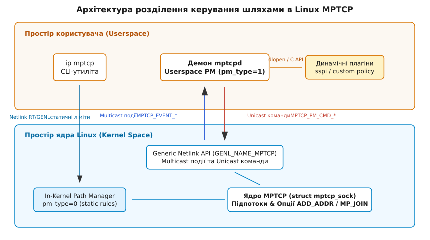
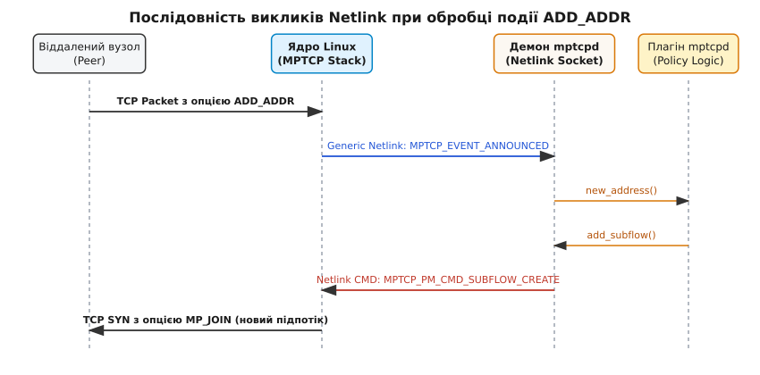

# Менеджери шляхів у MPTCP (mptcpd та in-kernel path manager)

<preknowlist>
- [Multipath TCP (MPTCP)](topic:unix-linux/multipath-tcp-mptcp) — базові принципи багатошляхового TCP, опції MP_CAPABLE, MP_JOIN та семантика підпотоків.
- [Протокол Netlink](topic:unix-linux/netlink-protocol) — бінарний IPC між ядром Linux і простором користувача, механізм Generic Netlink та атрибути NLA.
- [Мережеві інтерфейси та IP-адреси](topic:unix-linux/interfaces-and-addresses) — конфігурація інтерфейсів, маршрутів та підмереж у Linux.
</preknowlist>

Уявіть мобільний роутер або сучасний смартфон, що одночасно підключений до бездротової мережі Wi-Fi (`192.168.1.50`) та стільникового каналу 5G (`10.80.4.12`). При використанні класичного протоколу TCP будь-яка мережева сесія прив'язана до єдиного сокетного кортежу 4-tuple (IP-адреса джерела, порт джерела, IP-адреса призначення, порт призначення). Якщо користувач виходить із зони покриття Wi-Fi, ця IP-адреса зникає, TCP-сесія рветься, а передача даних зупиняється.

Протокол Multipath TCP (MPTCP), стандартизований у RFC 8684, вирішує цю проблему на транспортному рівні. Він об'єднує кілька незалежних TCP-підпотоків (subflows) у єдине логічне з'єднання MPTCP. Одне з'єднання може прозоро передавати дані через Wi-Fi та 5G одночасно, підтримувати безперервність сесії при зміні IP-адрес та агрегувати пропускну здатність обох каналів.

Однак наявність фізичної можливості передавати дані через кілька мережевих адаптерів одразу породжує фундаментальне архітектурне питання: **хто і на основі яких правил вирішує, коли саме потрібно створювати новий підпотік, яку IP-адресу оголошувати віддаленому вузлу, які шляхи вважати основними, а які резервними?**

Якщо закріпити ці рішення безпосередньо у коді транспортного стека ядра, операційна система втратить гнучкість: адміністратор не зможе налаштувати пріоритет безкоштовного Wi-Fi над платним 5G-трафіком. Якщо ж делегувати обробку кожного мережевого пакета у простір користувача, перемикання контексту процесора та затримки IPC миттєво знищать продуктивність мережі.

Для вирішення цієї суперечності ядро Linux реалізує суворе розділення **механізму** (передача пакетів, збірка байтового потоку, форматування TCP-опцій) та **політики** (прийняття рішень про топологію шляхів). За прийняття рішень відповідає окремий компонент — **Менеджер шляхів (Path Manager)**. 

У сучасному ядрі Linux (починаючи з версії 5.6) передбачено дві фундаментальні моделі керування шляхами: вбудований у ядро **In-Kernel Path Manager** (`pm_type=0`) та демон у просторі користувача **Userspace Path Manager** (`pm_type=1`), найвідомішою реалізацією якого є демон `mptcpd`.

---

## 1. Архітектура розділення механізму та політики у Linux MPTCP

Мережевий стек Linux розглядає сокет MPTCP (`struct mptcp_sock`) як керуючу обгортку над кількома звичайними сокетами TCP (`struct tcp_sock`), які називаються підпотоками (subflows). Кожен підпотік має власну чергу ретрансляції, власний алгоритм контролю перевантаження (наприклад, BBR або CUBIC) та власний мережевий інтерфейс.

Всередині структури `struct mptcp_sock` ядро підтримує окремий підконтрольний блок керування шляхами — `struct mptcp_pm_data`. Цей блок відстежує стан усіх відомих локальних та віддалених кінцевих точок (endpoints), ліміти на кількість підпотоків, а також поточний режим керування, визначений системною змінною `sysctl`:

```bash
sysctl net.mptcp.pm_type
```

Цей параметр визначає, яка саме підсистема буде обробляти події зміни мережевої топології.


*Розділення архітектури MPTCP на рівні ядра (механізми підпотоків та In-Kernel PM) та простору користувача (демон mptcpd, плагіни та Netlink API).*

Життєвий цикл керування шляхами складається з п'яти послідовних фаз:

1. **Виявлення кінцевих точок (Endpoint Discovery)**: локальне ядро або демон виявляє появу нового мережевого інтерфейсу або зміни IP-адреси на наявному адаптері.
2. **Оголошення адрес (Address Advertisement)**: надсилання віддаленому вузлу MPTCP-опції `ADD_ADDR` у заголовку TCP-пакета. Це повідомлення містить IP-адресу, номер порту (опціонально), унікальний локальний ідентифікатор адреси `Address ID` (від 1 до 255) та криптографічний HMAC для автентифікації.
3. **Ініціалізація підпотоків (Subflow Establishment)**: відкриття нового TCP-з'єднання з локальної IP-адреси на віддалену IP-адресу із задіянням опції `MP_JOIN` у рукостисканні SYN / SYN-ACK / ACK.
4. **Керування пріоритетами (Priority Change)**: відправка опції `MP_PRIO` або встановлення прапорця `BACKUP` у пакеті `MP_JOIN`, що вказує протилежній стороні використовувати цей шлях лише як резервний у разі повної деградації основного каналу.
5. **Видалення шляхів (Address Teardown)**: надсилання опції `REMOVE_ADDR` при відключенні мережевого інтерфейсу та примусове закриття відповідних сокетів підпотоків за допомогою процедури TCP FIN/RST.

Історично підходи до цієї процедури пройшли складний шлях від модулів ядра до сучасної двокомпонентної системи. Детальний опис цього розвитку наведено у вставці [Еволюція менеджерів шляхів у MPTCP](topic:unix-linux/mptcp-path-managers/hist-mptcp-evolution.md).

---

## 2. Вбудований менеджер ядра (In-Kernel Path Manager, pm_type=0)

Вбудований у ядро менеджер шляхів є режимом за замовчуванням у більшості дистрибутивів Linux (`sysctl net.mptcp.pm_type=0`). Його створено для забезпечення максимальної швидкості роботи, мінімальної затримки та відсутності накладних витрат на виклики IPC та перемикання контексту процесора.

### Внутрішні структури даних ядра

У режимі `pm_type=0` ядро Linux зберігає конфігурацію шляхів у глобальній (або прив'язаній до мережевого простору імен `netns`) базі даних кінцевих точок. Основною структурою є `struct mptcp_pm_addr_entry`:

:::tabs
```c
/* Kernel C Data Structure: struct mptcp_pm_addr_entry */
struct mptcp_pm_addr_entry {
    struct list_head    list;
    struct mptcp_addr_info addr;
    u8                  flags;
    u8                  if_idx;
    struct rcu_head     rcu;
};
```
```cpp
// C++ Idiomatic abstraction of MPTCP endpoint entry
#include <cstdint>
#include <netinet/in.h>

namespace mptcp {
    struct EndpointEntry {
        sockaddr_storage addr{};
        std::uint8_t flags{0};
        std::uint8_t if_index{0};
    };
}
```
:::

Поле `addr` містить IP-адресу (IPv4 або IPv6), порт та `Address ID`, а поле `flags` визначає дію, яку ядро має автоматично виконати при встановленні нового MPTCP-з'єднання.

Внутрішня обробка списку кінцевих точок виконується із застосуванням механізму RCU (Read-Copy Update), що дозволяє читати конфігурацію в контексті обробки мережевих пакетів без захоплення блокувань (Lockless Read).

### Прапорці кінцевих точок та їх детальна семантика

Конфігурація `In-Kernel Path Manager` виконується через адміністративну утиліту `ip mptcp endpoint`. Кожній кінцевій точці можна призначити один або кілька з чотирьох ключових прапорців:

#### 1. Прапорець `signal`
Вказує ядру, що при виникненні нового MPTCP-з'єднання ця локальна IP-адреса має бути оголошена віддаленому вузлу через TCP-опцію `ADD_ADDR`.

Коли сокет MPTCP надсилає черговий пакет даних або ACK, ядро виділяє додаткові байти у заголовку TCP для розширення `ADD_ADDR`. Це повідомлення кодується у форматі:
- Базовий тип опції: `Kind 30` (MPTCP).
- Підтип: `Subtype 3` (`ADD_ADDR`).
- `Address ID`: унікальний номери адреси.
- `IP Address`: 4 байти для IPv4 або 16 байтів для IPv6.
- `Truncated HMAC`: 64-бітний підпис для запобігання підробки IP-адреси зловмисниками.

Отримавши це повідомлення, віддалений вузол дізнається про існування альтернативної IP-адреси сервера і може за власною ініціативою відкрити до неї додатковий підпотік (`MP_JOIN`).

Прапорець `signal` ідеально підходить для серверів, які знаходяться за статичними IP-адресами і мають сповіщати клієнтів про свої додаткові інтерфейси.

#### 2. Прапорець `subflow`
Вказує ядру, що локальний вузол має **активно ініціювати** створення нових підпотоків з цієї адреси.

Як тільки основне MPTCP-з'єднання успішно встановлено, ядро сканує таблицю кінцевих точок з прапорцем `subflow`, створює новий внутрішній сокет `struct socket`, виконує виклик `kernel_connect()` та надсилає TCP SYN з опцією `MP_JOIN` до відомої адреси віддаленого вузла.

Формат опції `MP_JOIN` у пакеті SYN містить:
- `Subtype 1` (`MP_JOIN`).
- `Backup flag` (`B`): 1 біт прапорця резервного каналу.
- `Address ID`: локальний номери адреси.
- `Receiver's Token`: 32-бітний хеш ключа з'єднання протилежної сторони.
- `Sender's Random Nonce`: 32-бітне випадкове число для обміну ключами.

Цей прапорець використовується на клієнтських пристроях (наприклад, ноутбуках чи роутерах), які ініціюють з'єднання до зовнішніх серверів.

#### 3. Прапорець `backup`
Позначає створюваний або оголошуваний підпотік як резервний.

При створенні підпотоку з прапорцем `backup` ядро встановлює біт `B` (Backup) у TCP-опції `MP_JOIN` або надсилає опцію `MP_PRIO`. Планувальник пакетів MPTCP (MPTCP Scheduler) у ядрі спрямовуватиме трафік у резервний підпотік лише тоді, коли всі основні (non-backup) підпотоки стануть недоступними або зазнають критичної втрати пакетів.

#### 4. Прапорець `fullmesh`
Вимога створити повнозв'язну сітку підпотоків.

За замовчуванням, якщо віддалений вузол оголошує дві IP-адреси, а локальний вузол має дві локальні IP-адреси, ядро з прапорцем `subflow` створить лише один додатковий підпотік. Прапорець `fullmesh` змушує ядро перемножити локальні та віддалені адреси, створивши підпотоки для кожної можливої пари `(Local IP, Remote IP)`.

### Механізм захисних лімітів (Limits)

Абсолютна автоматизація In-Kernel менеджера створює ризик атаки на вичерпання ресурсів ядра (Resource Exhaustion Attack). Якщо зловмисник надішле тисячі фейкових опцій `ADD_ADDR`, ядро могло б бездумно витратити пам'ять на створення тисяч TCP-сокетів.

Щоб запобігти цьому, In-Kernel PM вимагає суворого обмеження лімітів через команду `ip mptcp limits`:

- **`subflows`**: максимальна кількість додаткових підпотоків, які дозволено створити для одного MPTCP-з'єднання (понад один основний). За замовчуванням дорівнює `2`.
- **`add_addr_accepted`**: максимальна кількість опцій `ADD_ADDR`, яку ядро згодні прийняти та опрацювати від віддаленого вузла для одного з'єднання. За замовчуванням дорівнює `0` або `2`.

При досягненні будь-якого з цих лімітів ядро мовчки ігнорує нові пропозиції `ADD_ADDR` та блокує ініціалізацію нових підпотоків `MP_JOIN`.

### Практичний приклад конфігурації In-Kernel PM

Розглянемо сценарій налаштування шлюзу з двома провайдерами: `eth0` (основний, IP `192.168.1.100`) та `wlan0` (резервний, IP `10.0.0.15`):

```bash
# 1. Переконатися, що увімкнено In-Kernel Path Manager
sysctl -w net.mptcp.pm_type=0

# 2. Встановити глобальні ліміти: до 3 підпотоків та 2 оголошень
ip mptcp limits set subflows 3 add_addr_accepted 2

# 3. Додати eth0 як локальну кінцеву точку для оголошення адреси
ip mptcp endpoint add 192.168.1.100 dev eth0 id 1 signal

# 4. Додати wlan0 як активний резервний підпотік
ip mptcp endpoint add 10.0.0.15 dev wlan0 id 2 subflow backup
```

Перевірити поточний стан бази даних ядра можна за допомогою команд:

```bash
ip mptcp endpoint show
ip mptcp limits show
```

---

## 3. Userspace Path Manager (pm_type=1) та протокол Generic Netlink

Незважаючи на високу швидкість, In-Kernel Path Manager має принципове обмеження: він оперує статичними правилами на рівні всієї системи або мережевого простору імен (`netns`). Він не може прийняти рішення видалити підпотік 5G, коли у смартфона залишилося 5% заряду батареї, або спрямувати HTTP-трафік через Wi-Fi, а відеострім — через обох провайдерів.

Для реалізації довільної програмної логіки ядро Linux надає **Userspace Path Manager**.

Щоб активувати цей режим, виконується команда:

```bash
sysctl -w net.mptcp.pm_type=1
```

Після перемикання `pm_type=1` ядро повністю вимикає автоматичну генерацію опцій `ADD_ADDR` та автоматичне відкриття `MP_JOIN`. Всі події мережевого стека відправляються у простір користувача через бінарний шинний протокол **Generic Netlink**.


*Часова діаграма обміну подіями та командами Generic Netlink при виявленні нової IP-адреси та створенні додаткового підпотоку.*

### Протокол Generic Netlink (`GENL_NAME_MPTCP`)

Взаємодія між ядром та користувацьким демоном відбувається через сімейство Generic Netlink з ім'ям `mptcp` (`GENL_NAME_MPTCP`). Протокол розділений на два канали:

1. **Мультикаст-канал подій (Multicast Event Channel)**: ядро транслює сповіщення про зміну стану сокетів у мультикаст-групу `subflow`.
2. **Юнікаст-канал команд (Unicast Command Channel)**: процес у просторі користувача надсилає точкові накази ядру.

#### Мультикаст-події ядра (`MPTCP_EVENT_*`)

Коли у системі відбуваються мережеві зміни, ядро формує пакет Generic Netlink, який містить токен з'єднання (`MPTCP_ATTR_TOKEN`), IP-адреси, порти та ідентифікатор події:

- `MPTCP_EVENT_CREATED`: створено нове MPTCP-з'єднання (отримано або відправлено `MP_CAPABLE` SYN).
- `MPTCP_EVENT_ESTABLISHED`: основний підпотік успішно завершив 3-way handshake.
- `MPTCP_EVENT_ANNOUNCED`: віддалений вузол надіслав TCP-опцію `ADD_ADDR`. Демон отримує нову IP-адресу віддаленого вузла.
- `MPTCP_EVENT_REMOVED`: віддалений вузол надіслав `REMOVE_ADDR`.
- `MPTCP_EVENT_SUB_ESTABLISHED`: додатковий підпотік `MP_JOIN` успішно підключено.
- `MPTCP_EVENT_SUB_CLOSED`: один із підпотоків закрився.
- `MPTCP_EVENT_CLOSED`: MPTCP-з'єднання повністю знищено.

#### Юнікаст-команди простору користувача (`MPTCP_PM_CMD_*`)

Отримавши подію, демон у просторі користувача виконує свою логіку і повертає ядру підписану команду:

- `MPTCP_PM_CMD_ADD_ADDR`: наказати ядру відправити `ADD_ADDR` для конкретного з'єднання (вказаного через `token`).
- `MPTCP_PM_CMD_DEL_ADDR`: наказати ядру відправити `REMOVE_ADDR`.
- `MPTCP_PM_CMD_SUBFLOW_CREATE`: наказати ядру відкрити новий підпотік `MP_JOIN` між конкретною пару локальна/віддалена адреса для вказаного `token`.
- `MPTCP_PM_CMD_SUBFLOW_DESTROY`: примусово закрити конкретний підпотік.
- `MPTCP_PM_CMD_SET_FLAGS`: змінити пріоритет (`backup`) підпотоку.

Вичерпні списки констант, атрибутів NLA та прикладів форматування Netlink-повідомлень наведено у вставці [Довідник Netlink API та інструментів управління MPTCP](topic:unix-linux/mptcp-path-managers/api-mptcp-netlink.md).

---

## 4. Демон mptcpd: Модульна архітектура та розробка плагінів

Найбільш зрілою, офіційною реалізацією Userspace Path Manager є системний демон **`mptcpd`** (Multipath TCP Daemon), що розробляється спільнотою open-source під егідою Intel та Linux Foundation.

### Внутрішня архітектура mptcpd

Демон `mptcpd` побудований за модульним принципом:

1. **Ядро демона (Core Manager)**: ініціалізує сокет Generic Netlink, підписується на мультикаст-групу `subflow`, виконує парсинг бінарних NLA-атрибутів ядра та транслює їх у високорівневі події C API.
2. **Система плагінів (Plugin Engine)**: при запуску `mptcpd` сканує каталог `/usr/lib/mptcpd/` (або `/usr/local/lib/mptcpd/`) і за допомогою системного виклику `dlopen()` завантажує динамічні бібліотеки плагінів (`.so`).
3. **Інтеграція із зовнішніми шинами**: плагіни `mptcpd` можуть підключатися до шини D-Bus, слухати події `systemd-networkd`, `NetworkManager` або `UPower`.

### Інтерфейс розробки плагінів (`mptcpd_plugin_ops`)

Кожен плагін реєструє таблицю функцій-обробників (callbacks) у структурі `mptcpd_plugin_ops`:

:::tabs
```c
/* Header C: struct mptcpd_plugin_ops */
struct mptcpd_plugin_ops {
    void (*new_connection)(struct mptcpd_pm *pm, uint32_t token, ...);
    void (*connection_established)(struct mptcpd_pm *pm, uint32_t token, ...);
    void (*connection_closed)(struct mptcpd_pm *pm, uint32_t token, ...);
    void (*new_address)(struct mptcpd_pm *pm, uint32_t token, mptcpd_aid_t id, ...);
    void (*address_removed)(struct mptcpd_pm *pm, uint32_t token, mptcpd_aid_t id, ...);
    void (*new_subflow)(struct mptcpd_pm *pm, uint32_t token, ...);
    void (*subflow_closed)(struct mptcpd_pm *pm, uint32_t token, ...);
};
```
```cpp
// C++ Interface Abstraction
#include <cstdint>
#include <sys/socket.h>

namespace mptcpd {
    class IPathPlugin {
    public:
        virtual ~IPathPlugin() = default;
        virtual void on_new_connection(uint32_t token) = 0;
        virtual void on_new_address(uint32_t token, uint8_t id, sockaddr const* addr) = 0;
        virtual void on_subflow_closed(uint32_t token) = 0;
    };
}
```
:::

#### Стандартний плагін SSPI (Single Subflow Per Interface)

Прикладом штатного плагіна, що поставляється разом із `mptcpd`, є **SSPI**. Його алгоритм працює наступним чином:

1. Коли приходить подія `new_address` (віддалений вузол оголосив нову IP-адресу), плагін `sspi` опитує список локальних мережевих інтерфейсів системи.
2. Для кожного локального інтерфейсу, що має діючу IP-адресу, плагін викликає функцію `mptcpd_pm_add_subflow()`.
3. Демон `mptcpd` кодує цей виклик у Netlink-команду `MPTCP_PM_CMD_SUBFLOW_CREATE` та надсилає її ядру.
4. Ядро відкриває новий підпотік `MP_JOIN`.

Повний вихідний код готових плагінів мовами C та C++ (з ідіоматичними RAII-обгортками) дивіться у вставці [Реалізація плагіна mptcpd та аналізатора подій Netlink](topic:unix-linux/mptcp-path-managers/proj-mptcpd-plugin.md).

---

## 5. Взаємодія з планувальниками пакетів та плаваючі стани підпотоків

Менеджер шляхів відповідає за побудову мережевої топології, але розподіл конкретних байтових пакетів по створених підпотоках виконується іншим компонентом ядра — **Планувальником MPTCP (MPTCP Scheduler)**, який оперує інтерфейсом `struct mptcp_sched_ops`.

### Автоматичний перехід підпотоків у стан Stale

Якщо один із мережевих інтерфейсів зазнає раптової деградації (наприклад, автомобіль в'їжджає у тунель, і рівень Wi-Fi сигналу падає до нуля без формального розриву `NETDEV_DOWN`), підпотік починає втрачати пакети.

Ядро відстежує кількість послідовних ретрансляцій на підпотоці. Якщо кількість втрачених пакетів перевищує поріг `sysctl net.mptcp.stale_loss_cnt` (за замовчуванням 4 пакети):
1. Ядро автоматично позначає цей підпотік прапорцем `MPTCP_SUBFLOW_STATE_STALE`.
2. Планувальник пакетів мовчки виключає цей підпотік з обробки і перенаправляє весь непідтверджений трафік у діючі підпотоки.
3. У режимі `pm_type=1` ядро надсилає сповіщення `MPTCP_EVENT_SUB_CLOSED` у простір користувача, дозволяючи `mptcpd` закрити цей сокет або ініціювати альтернативний шлях.

---

## 6. Глибокий технічний порівняльний аналіз та механізми продуктивності

Обираючи між In-Kernel (`pm_type=0`) та Userspace (`pm_type=1`) менеджерами шляхів, системний інженер робить вибір між продуктивністю обробки подій та гнучкістю прийняття рішень.

### Порівняльна матриця характеристик

| Критерій оцінки | In-Kernel Path Manager (`pm_type=0`) | Userspace Path Manager (`pm_type=1`, `mptcpd`) |
| :--- | :--- | :--- |
| **Місце виконання** | Простір ядра (Network SoftIRQ / Timer) | Простір користувача (System Daemon Process) |
| **Накладні витрати IPC** | Абсолютно відсутні (прямий виклик функцій) | Наявні (сокети Netlink, маршалінг NLA, перемикання контексту) |
| **Затримка реакції (Latency)**| Мікросекунди (негайний виклик у черзі пакетів) | Мілісекунди (асинхронне планування демона) |
| **Гранулярність політики** | Глобальна (однакові правила на netns) | Per-Connection (різні правила для кожного token) |
| **Зовнішні джерела даних** | Обмежено (лише IP-адреси та події `netdev`) | Безмежно (D-Bus, RSSI 5G/Wi-Fi, тарифні плани, UPower, GPS) |
| **Конфігурація** | CLI-утиліта `ip mptcp` | Конфігураційні файли, C/C++ плагіни `mptcpd` |
| **Сфера застосування** | Високонавантажені сервери, Data Center ECMP | Смартфони, SD-WAN роутери, Edge Computing |

### Накладні витрати та профілювання

У режимі `pm_type=0` обробка події `ADD_ADDR` виконується безпосередньо в обробнику м'якого переривання мережевої карти (SoftIRQ). Ядро виділяє заголовок `struct mptcp_out_options` і відразу додає його у чергу повторної передачі TCP.

У режимі `pm_type=1` шлях обробки включає наступні кроки:

1. Мережевий стек ядра генерує сокетний буфер `sk_buff` для Netlink.
2. Ядро виконує виклик `genlmsg_multicast()`, буферизуючи повідомлення у сокеті демона.
3. Планувальник задач Linux виконує перемикання контексту (Context Switch) на процес `mptcpd`.
4. Демон читає сокет, розпаковує NLA-структури, передає управління в `.so` плагін.
5. Плагін формує відповідь, демон викликає `send()` у Netlink-сокет.
6. Ядро у контексті системного виклику обробляє команда `MPTCP_PM_CMD_SUBFLOW_CREATE` та ініціює TCP SYN.

Для тисяч короткоживучих з'єднань (наприклад, високонавантажений Nginx / HAProxy веб-сервер) накладні витрати `pm_type=1` можуть призвести до підвищення споживання CPU. Тому на серверних вузлах однозначно рекомендується `pm_type=0`. 

Навпаки, для мобільних пристроїв, де кількість MPTCP-з'єднань невелика, але умови мережі змінюються динамічно, `pm_type=1` надає вирішальну перевагу.

---

## 7. Крайові випадки, траблшутинг та діагностика

При практичному розгортанні MPTCP інженери часто стикаються зі складними крайовими випадками (Edge Cases), які вимагають глибокої діагностики.

### 1. Проходження NAT (NAT Traversal) та зміна портів

Якщо один із вузлів знаходиться за NAT (Network Address Translation), оголошення внутрішньої IP-адреси (наприклад, `192.168.1.50`) через `ADD_ADDR` не дозволить віддаленому вузлу з інтернету відкрити підпотік до цього пристрою.

Для вирішення цієї проблеми специфікація RFC 8684 передбачає передачу опції `ADD_ADDR` із зазначенням зовнішнього порту (Port Attribute). Вбудований менеджер шляхів дозволяє вказати це через прапорець `port`:

```bash
ip mptcp endpoint add 192.168.1.50 port 54321 signal
```

### 2. Блокування опцій мережевими світчами та фаєрволами (Middlebox Interference)

Деякі корпоративні фаєрволи або застарілі пристрої DPI (Deep Packet Inspection) можуть вирізати невідомі TCP-опції (у тому числі `MP_CAPABLE` та `MP_JOIN`) або скидати пакети з невідомими розширеннями.

При втраті опції `MP_JOIN` під час рукостискання додаткового підпотоку ядро Linux автоматично перериває спробу створення цього підпотоку (надсилає TCP RST для цього конкретного підпотоку), але **основне MPTCP-з'єднання залишається працювати** через перший шлях. MPTCP прозоро деградує до звичайного одношляхового TCP.

### 3. Діагностичні інструменти

Діагностика стану менеджерів шляхів виконується трьома основними інструментами:

#### Утиліта `ss` (Socket Statistics)
Дозволяє детально оглянути топологію MPTCP-сокетів, список підпотоків, значення RTT та токени:

```bash
ss -M -i -t
```

Приклад виводу:

```text
ESTAB  0  0  192.168.1.50:45210  203.0.113.10:443  token:a1b2c3d4
   subflow backlogged rtt:12.4/2.1 ino:45821
   subflow src:10.0.0.15 backup rtt:45.1/5.8 ino:45822
```

#### Лічильники SNMP ядра (`nstat`)
Дозволяють відстежити системну статистику обробки MPTCP-подій та помилок:

```bash
nstat -z MPTCP*
```

Ключові метрики:
- `MPTcpExtAddAddr`: кількість отриманих опцій `ADD_ADDR`.
- `MPTcpExtSubflowEstablish`: кількість успішно створених підпотоків.
- `MPTcpExtSubflowFail`: кількість збоїв при спробі створити підпотік `MP_JOIN`.

#### Трасування через eBPF / `bpftrace`
Для спостереження за внутрішніми викликами ядра щодо керування шляхами можна підключитися до tracepoints MPTCP:

```bash
bpftrace -e 'tracepoint:mptcp:mptcp_subflow_connect { printf("New subflow connect to %s\n", args->daddr); }'
```

---

## 8. Практичний вибір та рекомендовані сценарії

Підсумовуючи архітектурний аналіз, вибір менеджера шляхів слід проводити за наступним інженерним правилом:

1. **Обирайте In-Kernel Path Manager (`pm_type=0`)**, якщо ви налаштовуєте **серверну інфраструктуру, базі даних, веб-вузли або статичні роутери**. Це дасть мінімальне навантаження на процесор, найвищу швидкість обробки пакетів та просту конфігурацію через `ip mptcp`.
2. **Обирайте Userspace Path Manager (`pm_type=1` та `mptcpd`)**, якщо ви розробляєте **мобільне ПЗ, клієнтські операційні системи, бортові системи автомобілів або SD-WAN обладнання**, де рішення про створення підпотоків залежать від зовнішніх бізнес-метрик (вартість трафіку, якість сигналу Wi-Fi/LTE, заряд акумулятора).

Обидва підходи демонструють зрілість мережевого стека Linux, де строгий розподіл механізмів та політик забезпечує як бескомпромісну продуктивність ядра, так і безмежну гнучкість у просторі користувача.
