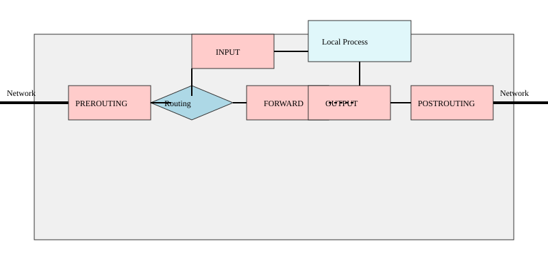

# Модель netfilter: хуки ядра, таблиці й відстеження станів (conntrack)

<preknowlist>
- [Концепції ядра Linux](book:unix-linux/kernel-and-userspace) — базові поняття системних викликів та VFS.
</preknowlist>

Ядро Linux володіє потужним і надзвичайно гнучким мережевим стеком. Однією з найважливіших його підсистем є **Netfilter** — фреймворк, який надає можливість перехоплювати й маніпулювати мережевими пакетами на різних етапах їхнього шляху через ядро. Netfilter є основою для побудови брандмауерів (firewalls), маршрутизаторів із трансляцією адрес (NAT) та інструментів обліку трафіку.

У цій статті ми детально розглянемо архітектуру Netfilter, його п’ять основних хуків, структуру таблиць і ланцюжків (iptables/nftables), а також механізм відстеження станів з'єднань — `nf_conntrack`.

## 1. Архітектура Netfilter: Хуки (Hooks)

У своїй основі Netfilter — це набір **хуків (зачіпок)**, розташованих у стратегічних місцях мережевого стека IPv4 та IPv6. Коли пакет проходить через ядро, мережевий стек періодично звертається до фреймворку Netfilter на цих хуках. Якщо будь-який модуль ядра (наприклад, модуль iptables або nftables) зареєстрував функцію зворотного виклику (callback) на цьому хуку, Netfilter передає пакет цій функції для перевірки або модифікації.

Існує п'ять основних хуків Netfilter для протоколів родини IP (IPv4/IPv6):

1. **NF_INET_PRE_ROUTING (`PREROUTING`)**  
   Це найперший хук, який спрацьовує одразу після того, як пакет прийнятий мережевим інтерфейсом і пройшов базові перевірки цілісності. На цьому етапі ядро ще не прийняло рішення про маршрутизацію (не знає, чи призначений пакет локальній системі, чи його слід переслати далі). Тут зазвичай виконується Destination NAT (DNAT), щоб змінити адресу призначення до ухвалення рішення про маршрутизацію.

2. **NF_INET_LOCAL_IN (`INPUT`)**  
   Якщо після проходження хука `PREROUTING` підсистема маршрутизації ядра визначає, що пакет призначений для локальної системи (тобто адреса призначення збігається з однією з IP-адрес хоста), пакет передається на хук `INPUT`. Після цього хука пакет доставляється локальному процесу (сокетам). Тут найчастіше розміщують правила фільтрації вхідного трафіку для захисту самого сервера.

3. **NF_INET_FORWARD (`FORWARD`)**  
   Якщо підсистема маршрутизації визначає, що пакет призначений не для локальної системи, а для іншого вузла (і при цьому в ядрі увімкнено IP-форвардинг), пакет направляється на хук `FORWARD`. Цей хук використовується маршрутизаторами для фільтрації транзитного трафіку, що проходить крізь них.

4. **NF_INET_LOCAL_OUT (`OUTPUT`)**  
   Цей хук є першим пунктом перехоплення для пакетів, згенерованих локальними процесами на самій машині. Перш ніж локальний пакет буде відправлений у мережу, він спочатку маршрутизується, а потім потрапляє на хук `OUTPUT`. Тут можна застосувати фільтрацію вихідного трафіку, маркування пакетів або локальний DNAT.

5. **NF_INET_POST_ROUTING (`POSTROUTING`)**  
   Останній хук перед тим, як пакет буде переданий драйверу мережевого пристрою для відправлення «в провід». Сюди потрапляють як локально згенеровані пакети (після хука `OUTPUT`), так і транзитні пакети (після хука `FORWARD`). На цьому етапі остаточний вихідний інтерфейс уже відомий. Хук `POSTROUTING` головним чином використовується для Source NAT (SNAT) та IP-маскарадингу (Masquerading).

Кожна функція, зареєстрована на хуку, повертає одне з кількох значень (вердиктів), що визначає подальшу долю пакета:
- `NF_ACCEPT`: дозволити пакету продовжити шлях мережевим стеком.
- `NF_DROP`: негайно знищити пакет.
- `NF_STOLEN`: модуль бере на себе подальшу обробку пакета (Netfilter більше не контролює його).
- `NF_QUEUE`: поставити пакет у чергу для обробки процесом у просторі користувача.
- `NF_REPEAT`: повернути пакет на початок того ж хука.

## 2. Таблиці та ланцюжки: від iptables до nftables

Історично для конфігурації Netfilter використовувався інструмент `iptables` (разом із `ip6tables`, `arptables`, `ebtables`). Починаючи з ядра 3.13, на зміну йому прийшов сучасніший фреймворк — **nftables**. Проте логіка організації правил у таблиці та ланцюжки багато в чому залишилася схожою, оскільки обидві системи спираються на ті самі хуки Netfilter.

У традиційній моделі `iptables` правила жорстко згруповані в заздалегідь визначені **таблиці** (Tables), кожна з яких має своє конкретне призначення, та **ланцюжки** (Chains), що відповідають хукам Netfilter.

### Класичні таблиці iptables

1. **Таблиця `raw`**  
   - *Призначення:* Втручання в пакет до того, як він буде оброблений підсистемою відстеження станів (`nf_conntrack`).  
   - *Використання:* Найчастіше тут застосовують ціль `NOTRACK`, щоб вимкнути відстеження станів для певного потоку пакетів (наприклад, для захисту від SYN-флуду або для DNS-трафіку, який не потребує відстеження).  
   - *Ланцюжки:* `PREROUTING`, `OUTPUT`.

2. **Таблиця `mangle`**  
   - *Призначення:* Модифікація заголовків IP-пакетів (маршрутизація на основі політик, зміна TTL, TOS тощо).  
   - *Використання:* Маркування пакетів (ціль `MARK`) для подальшої обробки в `iproute2` (Traffic Control або Policy Routing), зміна поля Time-To-Live.  
   - *Ланцюжки:* Доступна на всіх 5 хуках (`PREROUTING`, `INPUT`, `FORWARD`, `OUTPUT`, `POSTROUTING`).

3. **Таблиця `nat`**  
   - *Призначення:* Трансляція мережевих адрес (Network Address Translation).  
   - *Використання:*  
     - **DNAT** (Destination NAT): Зміна адреси призначення (прокидання портів). Виконується в `PREROUTING` або `OUTPUT`.  
     - **SNAT** / **MASQUERADE** (Source NAT): Зміна адреси джерела. Виконується в `POSTROUTING` або `INPUT`.  
   - *Особливість:* Через таблицю `nat` проходить лише **перший пакет** з кожного нового з'єднання (стан `NEW`). Після цього Netfilter запам'ятовує трансляцію і автоматично застосовує її до всіх наступних пакетів цього ж з'єднання, не пропускаючи їх знову через правила таблиці `nat`.

4. **Таблиця `filter`**  
   - *Призначення:* Головна таблиця для фільтрації пакетів (прийняття рішення `ACCEPT` або `DROP`).  
   - *Використання:* Побудова правил брандмауера.  
   - *Ланцюжки:* `INPUT`, `FORWARD`, `OUTPUT`.

5. **Таблиця `security`** (менш поширена)  
   - *Призначення:* Застосування мандатного контролю доступу (MAC) та мережевих міток SELinux/SMACK.  
   - *Ланцюжки:* `INPUT`, `FORWARD`, `OUTPUT`.

### Перехід до nftables

Фреймворк `nftables` пропонує більш елегантний і ефективний підхід:
- Немає наперед визначених таблиць і ланцюжків. Користувач сам створює таблиці та прив'язує ланцюжки до конкретних хуків ядра з визначеним пріоритетом.
- Усі протоколи (IPv4, IPv6, ARP, Bridge) можуть оброблятися в єдиній таблиці родини `inet`.
- Використовується віртуальна машина в ядрі (псевдокод), що дозволяє виконувати кілька перевірок за одну інструкцію і використовувати словники (sets/maps), що кардинально підвищує продуктивність порівняно з лінійним перебором правил в `iptables`.

Незважаючи на гнучкість `nftables`, під капотом пакети продовжують маршрутизуватися через ті самі 5 хуків ядра, а пріоритети ланцюжків `nftables` відповідають традиційному порядку таблиць `iptables` (наприклад, `raw` має пріоритет `-300`, `mangle` `-150`, `nat` `-100`, а `filter` `0`).

## 3. Відстеження станів: `nf_conntrack`

Однією з найпотужніших можливостей Netfilter є **stateful inspection** (відстеження стану). За це відповідає модуль `nf_conntrack` (Netfilter Connection Tracking). Замість того, щоб аналізувати кожен пакет ізольовано (stateless), Netfilter запам'ятовує інформацію про встановлені з'єднання. Це дозволяє легко дозволяти зворотний трафік для ініційованих запитів.

### Як працює conntrack?

Модуль `nf_conntrack` перехоплює пакети на хуках `PREROUTING` (для вхідного трафіку) і `OUTPUT` (для вихідного) — безпосередньо після таблиці `raw`, але перед `mangle` і `nat`.

Для кожного пакета система відстеження намагається знайти відповідний запис у таблиці з'єднань (у пам'яті). Якщо запис не знайдено, пакет вважається новим.

### Стани з'єднання

У контексті Netfilter, з'єднання може перебувати в одному з чотирьох основних станів (незалежно від протоколу, тобто conntrack працює і для UDP або ICMP, створюючи "псевдо-з'єднання" на основі IP-адрес, портів і таймаутів):

1. **NEW**  
   Це пакет, який намагається ініціювати нове з'єднання (наприклад, TCP SYN-пакет), або це пакет, який раніше не бачила система відстеження (перший UDP-пакет у потоці).

2. **ESTABLISHED**  
   З'єднання переходить у цей стан, коли модуль conntrack фіксує двосторонній обмін трафіком. Для TCP це відбувається після SYN/ACK, для UDP — коли на відправлений пакет приходить відповідь із реверсивними IP-адресами та портами.

3. **RELATED**  
   Це пакет, який не належить до існуючого з'єднання, але **асоційований** з ним. Класичний приклад — ICMP повідомлення про помилку (Destination Unreachable), яке стосується існуючого UDP-потоку, або додаткові з'єднання в складних протоколах, таких як FTP (передача даних) або SIP (RTP-потоки). Для коректної роботи `RELATED` із протоколами типу FTP або SIP потрібні спеціальні модулі-помічники (conntrack helpers, наприклад `nf_conntrack_ftp`).

4. **INVALID**  
   Пакет, який не можна ідентифікувати або він має некоректні прапорці (наприклад, TCP-пакет поза вікном послідовності, або з хибною комбінацією TCP-прапорців, як-от одночасно SYN і RST). Зазвичай такі пакети просто відкидаються правилом:  
   `iptables -A INPUT -m conntrack --ctstate INVALID -j DROP`

Також є псевдо-стан **UNTRACKED** — пакет, який був явно позначений ціллю `NOTRACK` у таблиці `raw`.

### Переваги та ресурсоємність

Використання `nf_conntrack` значно спрощує написання правил брандмауера. Замість того, щоб явно дозволяти порти для зворотного трафіку, достатньо додати одне правило на початку ланцюжка:
`iptables -A INPUT -m conntrack --ctstate ESTABLISHED,RELATED -j ACCEPT`

Однак таблиця станів розміщується в оперативній пам'яті ядра. Кожен запис займає приблизно 300-400 байт. Під час інтенсивних DDoS-атак (наприклад, SYN-флуд) зловмисник може переповнити цю таблицю, що призведе до знаменитої помилки ядра:
`nf_conntrack: table full, dropping packet`

Для протидії цьому системні адміністратори можуть збільшити розмір таблиці через параметри `sysctl` (`net.nf_conntrack_max` та розмір хеш-таблиці), зменшити таймаути очікування (наприклад, `net.netfilter.nf_conntrack_tcp_timeout_established`), або повністю вимикати відстеження для певних видів трафіку через таблицю `raw`.

## Висновок

Модель Netfilter є фундаментом для роботи з мережею в Linux. Її архітектура на основі хуків `PREROUTING`, `INPUT`, `FORWARD`, `OUTPUT` і `POSTROUTING` дозволяє інтегруватися на будь-якому етапі обробки пакета. Традиційні таблиці `iptables` та сучасні ланцюжки `nftables` використовують цю модель для фільтрації, маршрутизації й трансляції адрес. Водночас механізм `nf_conntrack` забезпечує "розумну" фільтрацію, засновану на відстеженні станів з'єднань, що робить Linux-системи надійними та безпечними інструментами для управління мережами будь-якої складності.
