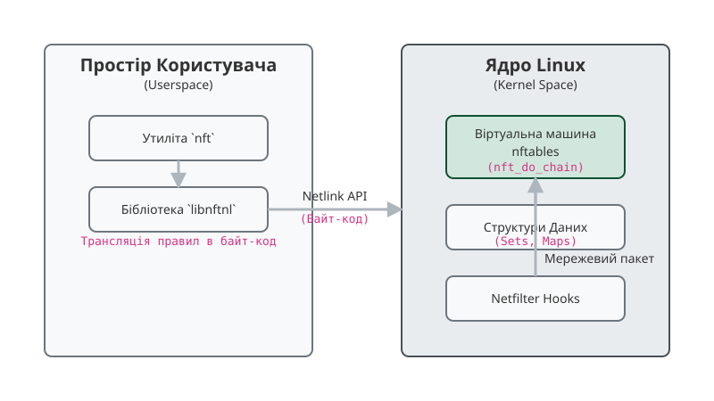

# Рушій виразів nftables у ядрах Linux (nftables vs iptables)

<preknowlist>
- [Модель Netfilter та хуки ядра Linux](book:unix-linux/netfilter-model) — базові п'ять хуків Netfilter (PRE_ROUTING, LOCAL_IN, FORWARD, LOCAL_OUT, POST_ROUTING) та техніка проходження пакета `sk_buff`.
- [Протокол Netlink](book:unix-linux/netlink-protocol) — асинхронний бінарний протокол зв'язку між ядром та простором користувача через підсистему `nfnetlink`.
</preknowlist>

При обробці мережевого трафіку на швидкостях 10, 40 та 100 Гбіт/с кожен додатковий виклик функції у ядрі Linux коштує дорогоцінних тактів процесора. Протягом двох десятиліть стандартним засобом фільтрації пакетів залишався `iptables`. Проте його монолітна архітектура, де кожне правило описувалося статичними модулями ядра, а перевірка здійснювалася лінійним перебором за `O(N)`, стала головним пляшковим горлом мережевого стеку. Підсистема `nftables` вирішує цю проблему принципово іншим чином: замість набору жорстко закодованих у ядрі перевірок вона впроваджує в ядрі Linux програмовану віртуальну машину (Virtual Machine, VM), яка виконує компактний байт-код виразів.

Винесення всієї логіки розбору протоколів у простір користувача та реалізація регістрової віртуальної машини у ядрі перетворили `nftables` на гнучкий і високопродуктивний інструмент. Ядро більше не потребує знань про специфіку мережевих заголовків конкретних протоколів — воно виконує універсальні базісні інструкції витягування даних, порівняння та пошуку в хеш-структурах зі складністю `O(1)`.

## 1. Чому монолітний iptables вичерпав свій ресурс

Щоб зрозуміти причини появи `nftables`, необхідно проаналізувати архітектурні обмеження `iptables`, які унеможливлювали подальше масштабування брандмауера в сучасних високонавантажених системах. Для детальнішого занурення у передісторію див. [історію еволюції Netfilter від ipfwadm до nftables](book:unix-linux/netfilter-nftables-expression-engine/hist-iptables-to-nftables.md).

### 1.1. Дублювання коду та фрагментація сімейства uapi

У традиційній архітектурі Netfilter сімейство `iptables` вимагало створення та підтримки чотирьох повністю незалежних підсистем ядра та утиліт простору користувача:
- `iptables` — для пакетів IPv4;
- `ip6tables` — для пакетів IPv6;
- `arptables` — для обробки кадрів ARP;
- `ebtables` — для фільтрації на рівні L2 (Ethernet bridge).

Кожна з цих утиліт мала свій власний парсер правил, власні бінарні структури в просторі користувача та власні обробники в ядрі. Якщо системному адміністратору потрібно було заблокувати порт для IPv4 та IPv6, ядро змушене було виконувати дві паралельні, практично ідентичні перевірки у двох різних таблицях. Це призводило до колосального дублювання коду (code bloat) у системному стеку та марнувало кеш інструкцій процесора (L1i cache).

### 1.2. Жорстко закодовані модулі перевірок (The Hardcoded Matches Paradox)

У `iptables` кожна умова порівняння (match) та кожна дія (target) реалізовувалися як окремий розширювальний модуль ядра (`xt_tcp.ko`, `xt_udp.ko`, `xt_limit.ko`, `xt_state.ko`).

При додаванні правила видалити трафік TCP на порт 80 ядро завантажувало модуль `xt_tcp` і передавало йому структуру `struct xt_entry_match`. При надходженні кожного пакета ядро здійснювало непрямий виклик функції (indirect function call) через вказівник у цій структурі.

Це породжувало фундаментальну залежність: ядро повинно було «знати» структуру кожного мережевого протоколу. Поява нового протоколу (наприклад, SCTP, QUIC чи розширень IPv6) або необхідність перевірити нове поле у заголовоку вимагали написання нового модуля ядра, його компіляції та суворої синхронізації версій між ядром та утилітою простору користувача.

### 1.3. Лінійна складність пошуку O(N) та обмеження ipset

Правила у `iptables` групувалися у лінійні списки (ланцюжки). Коли пакет проходив через хук Netfilter, ядро послідовно перевіряло кожне правило у списку `struct list_head`, поки не знадило першу дію `ACCEPT` або `DROP`.

```
Пакет sk_buff ──► [Правило 1] ──(Hi)──► [Правило 2] ──(Hi)──► ... ──► [Правило N] ──► Збіг (DROP)
```

Якщо брандмауер містив 20 000 правил для блокування небажаних IP-адрес, пакет, що прямував до 20 000-го правила, мусив пройти 19 999 успішних перевірок. Складність алгоритму `O(N)` призводила до катастрофічного падіння пропускної здатності під час DDoS-атак.

Створення зовнішнього модуля `ipset` частково пом'якшило цю проблему шляхом впровадження хеш-таблиць, проте `ipset` залишався додатковою підсистемою, з'єднаною з `iptables` через негнучкий костильний модуль `xt_set`.

### 1.4. Неатомарне перезавантаження правил (Rule Blobs)

Таблиця правил у `iptables` зберігалася в ядрі як один неперервний бінарний блок пам'яті (blob). Для внесення мінімальної зміни (наприклад, додавання однієї IP-адреси) утиліта простору користувача виконувала такі кроки:
1. Зчитувала весь поточний blob правил з ядра у пам'ять процесів користувача через `getsockopt(SO_GET_ENTRIES)`.
2. Модифікувала масив у пам'яті простору користувача.
3. Передавала новий повний blob назад у ядро через системний виклик `setsockopt(SO_SET_REPLACE)`.
4. Ядро повністю виділяло нову ділянку пам'яті, копіювало туди новий blob і атомарно замінювало вказівник.

На серверах із сотнями тисяч правил цей процес тривав кілька секунд, споживав сотні мегабайтів оперативної пам'яті та призупиняв обробку нових з'єднань через необхідність захоплення внутрішніх блокувань Netfilter.

---

## 2. Архітектура nftables: програмована віртуальна машина у ядрі

`nftables` змінює концепцію підсистеми фільтрації: замість монолітних перевірок у ядрі створюється проста, компактна, високооптимізована регістрова віртуальна машина (VM).

У цій парадигмі ядро Linux виконує роль **інтерпретатора байт-коду**, а утиліта `nft` та бібліотека `libnftnl` у просторі користувача виступають **компілятором**.


*Архітектура підсистеми nftables: від компіляції правил у просторі користувача до виконання байт-коду у хуках Netfilter ядра.*

Коли користувач вводить правило брандмауера, утиліта `nft` розбирає синтаксис, обчислює зміщення заголовків і генерує послідовність атомарних інструкцій (виразів/expressions). Цей байт-код надсилається в ядро через бінарний протокол Netlink. Ядро не перевіряє, який саме протокол описує правило — воно сліпо й послідовно виконує інструкції віртуальної машини над пакетом `sk_buff`.

Переваги цього підходу:
- **Уніфікація:** Єдиний рушій обробляє трафік IPv4, IPv6, ARP та Ethernet-мостів.
- **Відсутність оновлень ядра для нових протоколів:** Підтримка нового поля заголовка додається оновленням утиліти в просторі користувача.
- **Мінімальний обсяг коду у ядрі:** Ядерна частина містить лише цикл інтерпретатора та базові вирази оперування пам'яттю.

---

## 3. Анатомія рушія виразів (Expression Engine)

Одиницею виконання у віртуальній машині `nftables` є **вираз** (`nft_expr`). Послідовність виразів формує правило (`nft_rule`), а послідовність правил — ланцюжок (`nft_chain`).

Для ознайомлення з повним бінарним API та структурами даних див. [повну специфікацію виразів, регістрів та Netlink-інтерфейсу nftables](book:unix-linux/netfilter-nftables-expression-engine/api-nftables-expressions.md).

### 3.1. Ядерна структура struct nft_expr

Кожен вираз у ядрі описується структурою `struct nft_expr`, що містить вказівник на таблицю операцій `ops` та довільні внутрішні дані виразу `data`:

```c
struct nft_expr {
	const struct nft_expr_ops	*ops;
	unsigned char			data[] __attribute__((aligned(__alignof__(u64))));
};
```

Серцем виразу є функція `eval()`, яка входить до складу структури `struct nft_expr_ops`:

```c
struct nft_expr_ops {
	void				(*eval)(const struct nft_expr *expr,
						struct nft_regs *regs,
						const struct nft_pktinfo *pkt);
	int				(*init)(const struct nft_ctx *ctx,
						const struct nft_expr *expr,
						const struct nlattr * const tb[]);
	void				(*destroy)(const struct nft_ctx *ctx,
						  const struct nft_expr *expr);
	int				(*dump)(struct sk_buff *skb,
						const struct nft_expr *expr,
						bool reset);
	const struct nft_expr_type	*type;
};
```

Коли віртуальна машина виконує вираз, вона викликає метод `ops->eval(expr, regs, pkt)`. Функція зчитує дані з пакета `pkt`, виконує обчислення та змінює стан регістрів `regs`.

### 3.2. Регістрова модель (enum nft_registers)

На відміну від стек-машин (на кшталт JVM або застарілого класичного cBPF), `nftables` реалізує **регістрову віртуальну машину**. Це дозволяє уникнути частих операцій `push`/`pop` у стек і забезпечує прямий доступ до обчислених значень за допомогою індексів масиву.

Пам'ять для регістрів виділяється безпосередньо на стеку ядра у вигляді структури `struct nft_regs`:

```c
struct nft_regs {
	union {
		u32		data[20];
		struct nft_verdict	verdict;
	};
};
```

До версії ядра Linux 4.9 використовувалося чотири 128-бітні регістри. Починаючи з ядра 4.9 (комміти Пабло Нейра Аюсо), простір регістрів було оптимізовано і розбито на 16 окремих 32-бітних регістрів загального призначення (`NFT_REG32_00` .. `NFT_REG32_15`), що суттєво зменшило витрати пам'яті на стеку ядра.

```c
enum nft_registers {
	NFT_REG_VERDICT		= 0,  /* Регістр керування виконанням */
	NFT_REG_1		= 1,  /* Сумісність зі старими 128-бітними регістрами */
	NFT_REG_2		= 2,
	NFT_REG_3		= 3,
	NFT_REG_4		= 4,
	__NFT_REG_MAX,

	NFT_REG32_00		= 8,  /* 32-бітний регістр 0 */
	NFT_REG32_01		= 9,  /* 32-бітний регістр 1 */
	NFT_REG32_02		= 10,
	...
	NFT_REG32_15		= 23, /* 32-бітний регістр 15 */
};
```

Запис у регістри 32-бітних значень (наприклад, IPv4-адреси чи TCP-порту) здійснюється в один елемент масиву. Якщо необхідно зберегти 128-бітне значення (наприклад, IPv6-адресу), ВМ записує дані у чотири послідовні 32-бітні регістри (наприклад, `NFT_REG32_00` .. `NFT_REG32_03`).

### 3.3. Спеціальний регістр Verdict (NFT_REG_VERDICT / REG 0)

Регістр 0 зарезервований під **вердикт** (`struct nft_verdict`). Він контролює потік виконання правил і визначає подальшу долю пакета у мережевому стеку.

Регістр вердикту може містити базові дії Netfilter:
- `NF_ACCEPT`: Прийняти пакет і передати його наступним підсистемам стеку;
- `NF_DROP`: Відкинути пакет і звільнити пам'ять `sk_buff`;
- `NF_QUEUE`: Передати пакет у простір користувача для аналізу;
- `NF_STOLEN`: Припинити обробку у Netfilter (пакет перехоплено іншим модулем).

Або внутрішні вердикти керування потоком (Control Flow):
- `NFT_CONTINUE`: Умова поточного виразу виконана; перейти до наступного виразу в правилі.
- `NFT_BREAK`: Умова виразу не виконилася; скасувати виконання поточного правила і перейти до наступного правила у ланцюжку.
- `NFT_JUMP`: Перестрибнути у вказаний користувацький ланцюжок з можливістю повернення.
- `NFT_GOTO`: Перестрибнути у вказаний ланцюжок без повернення.
- `NFT_RETURN`: Повернутися з викликаного ланцюжка до батьківського.

---

## 4. Цикл виконання у ядрі (The Evaluation Loop: nft_do_chain)

Головний цикл обробки правил знаходиться у файлі `net/netfilter/nf_tables_core.c` і реалізований у функції `nft_do_chain()`.

### 4.1. Алгоритм роботи nft_do_chain()

Коли пакет трапляє на хук Netfilter, ядро передає його у `nft_do_chain()`. Алгоритм виконується за наступними кроками:

```
[Старт: nft_do_chain]
        │
        ▼
   Ініціалізація struct nft_regs
   (regs.verdict.code = NFT_CONTINUE)
        │
        ▼
┌───► [Взяти наступне правило rule у ланцюжку]
│       │
│       ▼
│  ┌──► [Взяти наступний вираз expr у правилі]
│  │    │
│  │    ▼
│  │  Виклик expr->ops->eval(expr, &regs, &pkt)
│  │    │
│  │    ▼
│  │  Перевірити regs.verdict.code:
│  │    ├── NFT_CONTINUE ──► [Перейти до наступного expr] ───┐
│  │    │                                                    │
│  │    ├── NFT_BREAK ─────► [Перервати правило,              │
│  │    │                     regs.verdict = NFT_CONTINUE] ──┼─┐
│  │    │                                                    │ │
│  │    └── NF_ACCEPT / NF_DROP / JUMP / GOTO ───────────────┼─┼─┐
│  └─────────────────────────────────────────────────────────┘ │ │
└──────────────────────────────────────────────────────────────┘ │
                                                                 │
                                                                 ▼
                                                  Повернути остаточний вердикт
```

Ключова оптимізація полягає у обробці вердикту `NFT_BREAK`. Якщо вираз порівняння (наприклад, `nft_cmp`) виявляє, що TCP-порт пакета не відповідає заданому в правилі, він записує в регістр 0 код `NFT_BREAK`. Перевірка `verdict == NFT_BREAK` негайно припиняє обробку решти виразів у цьому правилі, уникаючи зайвих викликів `eval()`, скидає вердикт на `NFT_CONTINUE` і переходить до першого виразу наступного правила.

### 4.2. Практична розшифровка: від CLI до байт-коду

Розглянемо стандартне правило брандмауера:

```bash
nft add rule filter input tcp dport 22 drop
```

Утиліта `nft` у просторі користувача компілює це правило у послідовність із п'яти виразів, які надсилаються в ядро. Стан ВМ при виконанні кожного виразу описується так:

```
+---+---------------------------------------------------------+-----------------------------------+
| # | Байт-код виразу nftables                               | Вплив на регістри ВМ              |
+---+---------------------------------------------------------+-----------------------------------+
| 1 | [ meta load l4proto => reg 1 ]                          | reg 1 = skb->tprot (напр. 6/TCP)  |
| 2 | [ cmp eq reg 1 0x00000006 ]                             |Якщо reg 1 != 6 -> verdict=BREAK   |
| 3 | [ payload load 2b @ transport header + 2 => reg 1 ]     | reg 1 = dport (напр. 0x0016 / 22) |
| 4 | [ cmp eq reg 1 0x00001600 ]                             |Якщо reg 1 != 22 -> verdict=BREAK  |
| 5 | [ immediate reg 0 drop ]                                | verdict = NF_DROP                 |
+---+---------------------------------------------------------+-----------------------------------+
```

Для ознайомлення з повною реалізацією емулятора цього циклу мовами C та C++ див. [практичну реалізацію інтерпретатора байт-коду nftables](book:unix-linux/netfilter-nftables-expression-engine/proj-nftables-bytecode-emulator.md).

---

## 5. Набори (Sets), Карти (Maps) та Конкатенація

Найпотужнішою архітектурною перевагою `nftables` є інтеграція високооптимізованих структур даних прямо в рушій виразів.

### 5.1. Першокласні Набори (Sets) зі складністю O(1) та O(log N)

Набір (set) у `nftables` — це колекція елементів (IP-адрес, портів, MAC-адрес), оптимізована для миттєвого пошуку за допомогою виразу `nft_lookup`.

Залежно від типів даних, ядро автоматично вибирає один із чотирьох бекендів:
- **`nft_set_rhash` (Resizable Hashtable):** Реалізований на базі ядерної підсистеми `rhashtable`. Забезпечує складність пошуку `O(1)`. Використовується для точних значень (наприклад, списки зі 100 000 окремих IP-адрес).
- **`nft_set_rbtree` (Red-Black Tree):** Забезпечує складність `O(log N)`. Використовується, коли елементами набору є *діапазони* (наприклад, CIDR підмережі `10.0.0.0/8` або інтервали портів `1024-2048`).
- **`nft_set_bitmap`:** Пряма бітова матриця зі складністю `O(1)`. Застосовується для щільних числових масивів (наприклад, порти від 1 до 1024).
- **`nft_set_pipapo` (PIPI trie):** Оптимізований під мульти-конкатенації з використанням векторних інструкцій процесора (AVX2/SSE).

### 5.2. Карти (Maps) та Словники Вердиктів (Verdict Maps / vmap)

Карта (map) асоціює ключ із певним значенням або дією. Зокрема, **Verdict Map (`vmap`)** дозволяє приймати рішення про перехід між ланцюжками за один пошук у хеш-таблиці.

Приклад правила `nftables`:

```bash
nft add rule filter input ip protocol vmap { tcp : jump chain-tcp, udp : jump chain-udp, icmp : drop }
```

Замість трьох окремих послідовних перевірок у `iptables`, віртуальна машина `nftables` виконує лише три кроки:
1. Вираз `nft_meta` витягує код протоколу в регістр 1.
2. Вираз `nft_lookup` здійснює пошук значення регістра 1 у карті `vmap`.
3. Бекенд карти негайно повертає потрібний вердикт (`NFT_JUMP chain-tcp` або `NF_DROP`) і записує його безпосередньо у регістр 0 (`NFT_REG_VERDICT`).

Це дозволяє зменшити обсяг правил брандмауера в сотні разів і забезпечує однаково високу швидкість обробки незалежно від кількості розгалужень.

### 5.3. Конкатенація (Concatenations / Tuple Keys)

`nftables` підтримує об'єднання кількох полів пакету у єдиний складний ключ (tuple key) безпосередньо у регістрах пам'яті.

```bash
nft add rule filter input ip saddr . tcp dport @black_list drop
```

Під капотом ВМ послідовно виконує два вирази `nft_payload`:
- Перший вираз копіює 4 байти IPv4-адреси джерела у регістр 1 (`NFT_REG32_00`).
- Другий вираз копіює 2 байти TCP-порту призначення у регістр 2 (`NFT_REG32_01`).

Оскільки регістри у пам'яті розташовані послідовно, ВМ передає у вираз `nft_lookup` один безперервний блок пам'яті довжиною 6 байтів (48 біт) як єдиний ключ для хеш-таблиці. Це дозволяє виконувати перевірку комбінації «IP джерела + Порт призначення + Протокол» за один пошук зі складністю `O(1)`.

---

## 6. Стан моніторингу, conntrack та динамічні вирази

Окрім статичних інструкцій порівняння, `nftables` підтримує станні (stateful) вирази, які модифікують стан ядра безпосередньо у ході виконання правила.

### 6.1. Інтеграція з підсистемою conntrack (nft_ct)

Вираз `nft_ct` забезпечує прямий доступ до інформації підсистеми відстеження з'єднань (Connection Tracking). Він зчитує стан сесії (`ct state`), мітки (`ct mark`), підсистеми NAT чи пріоритет трафіку з об'єкта `struct nf_conn`, зв'язаного з поточним пакетом `sk_buff`:

```bash
nft add rule filter input ct state established,related accept
```

Вираз `nft_ct` зчитує стан із `skb->_nfct` і записує бітову маску стану у призначений регістр. Наступний вираз `nft_bitwise` та `nft_cmp` перевіряє збіг із прапорцями `ESTABLISHED` чи `RELATED`.

### 6.2. Динамічні лічильники та обмеження швидкості (nft_counter, nft_limit)

У `nftables` лічильники пакетів та байтів є **опціональними виразами** (`nft_counter`). На відміну від `iptables`, де кожне правило примусово оновлювало лічильники в ядрі (створюючи атомарні колізії кеш-ліній процесора на багатиядерних системах), у `nftables` лічильник додається лише тоді, коли системний адміністратор явно вказав ключове слово `counter`.

Вираз `nft_limit` реалізує алгоритм «дірявого відра» (token bucket algorithm) безпосередньо у регістровій ВМ, оновлюючи залишок токенів та повертаючи `NFT_BREAK`, коли ліміт перевищено.

---

## 7. Транзакційна модель Netlink та RCU (Lockless execution)

Усі операції модифікації правил у `nftables` виконуються атомарно через бінарний протокол `nfnetlink`.

### 7.1. Двофазний коміт (Two-Phase Commit)

Коли користувач надсилає пакет оновлень, ядро застосовує транзакційну модель:
1. **Фаза підготовки (Prepare Phase):** Ядро виділяє пам'ять під нові вирази, ініціалізує їх через виклики `ops->init()` та перевіряє коректність усіх параметрів. Якщо виникає помилка (нестача пам'яті, невірний синтаксис), транзакція скасовується, а поточні правила залишаються недоторканими.
2. **Фаза фіксації (Commit Phase):** Якщо всі перевірки пройшли успішно, ядро атомарно оновлює вказівники на списки правил.

### 7.2. Виконання без блокувань (RCU Read-Side Critical Section)

Під час виконання транзакції обробка мережевих пакетів у ядрі **не зупиняється ні на мікросекунду**.

Ядро Linux використовує механізм **RCU (Read-Copy-Update)**. Функція `nft_do_chain()` виконується всередині критичної секції читача RCU (`rcu_read_lock()`). Коли простір користувача оновлює правило, ядро створює нову структуру правил у пам'яті та атомарно замінює вказівник `rcu_assign_pointer()`. Пакети, що проходять крізь ядро в цей момент, або повністю бачать старий набір правил, або повністю новий, не викликаючи жодних стану гонки (race conditions) чи затримок на блокуваннях пам'яті.

> 🔧 **Навіщо це у реальному розробленні.**
> У високонавантажених хмарних інфраструктурах (наприклад, у кластерах Kubernetes із мережевими плагінами Cilium або Calico) набори правил брандмауера оновлюються тисячі разів на хвилину при запуску або переміщенні контейнерів. Використання `iptables` у таких умовах призводило до блокування обробки трафіку та різкого зростання затримок (latency spikes). Перехід на `nftables` із двофазним комітом та RCU дозволив здійснювати інкрементальні атомарні оновлення правил на льоту без втрати продуктивності.

---

## 8. Простеження та діагностика виконань у ядрі (Tracing & Debugging)

Діагностика виконань байт-коду `nftables` у ядрі здійснюється через механізми tracepoints та трасування Netlink.

### 8.1. Команда nft monitor trace

Для відбудування логіки виконання виразів утиліта `nft` підтримує режим моніторингу трасування:

```bash
nft add rule filter input meta nftrace set 1
nft monitor trace
```

При активації прапорця `nftrace` ядро при проходженні кожного виразу генерує подійне Netlink-повідомлення, де вказує:
- Ідентифікатор пакета (`packet id`);
- Назву ланцюжка та номер правила (`rule handle`);
- Стан регістрів та проміжні результати `eval()`.

### 8.2. Ядерні Tracepoints підсистеми Netfilter

У підсистемі ядра `net/netfilter/` визначено трасувальні точки (tracepoints), до яких можна підключитися за допомогою утиліт `bpftrace` або `trace-cmd`:
- `netfilter:nft_eval_rule` — викликається при старті виконання правила;
- `netfilter:nft_expr_eval` — викликається перед виконанням кожного окремого виразу.

Приклад команди `bpftrace` для відстеження затримок обробки виразів:

```bash
bpftrace -e 'tracepoint:netfilter:nft_eval_rule { @start[tid] = nsecs; } tracepoint:netfilter:nft_eval_rule_end /@start[tid]/ { @dur = hist(nsecs - @start[tid]); delete(@start[tid]); }'
```

Це дозволяє точно виміряти час виконання конкретних виразів та бекендів наборів на робочих серверах під реальним навантаженням.

---

## 9. Порівняльний аналіз: iptables vs nftables vs eBPF (tc/XDP)

Сучасний мережевий стек Linux надає три основні технології для маніпуляції пакетами: `iptables`, `nftables` та `eBPF` (через хуки Traffic Control `tc` або Express Data Path `XDP`).

| Архітектурний параметр | iptables | nftables | eBPF (tc / XDP) |
| :--- | :--- | :--- | :--- |
| **Базова парадигма** | Монолітні модулі ядра + blobs | Регістрова ВМ байт-коду у ядрі | Універсальний JIT-компільований байт-код |
| **Складність пошуку** | `O(N)` (лінійні списки) | `O(1)` (Hash) / `O(log N)` (RBTrees) | `O(1)` (eBPF Maps) |
| **Оновлення правил** | Перезавантаження всієї таблиці | Атомарний двофазний коміт Netlink | Динамічне оновлення eBPF Maps |
| **Безпека виконання** | Обмежена модулями ядра | Строго обмежена вердиктами ВМ | Верифікатор eBPF (Kernel Verifier) |
| **Сфера застосування** | Застарілі системи | Брандмауери, NAT, Stateful фільтрація | Ultra-low latency, XDP ddos drop, CNI |

`nftables` є оптимальним вибором для більшості задач фільтрації та маршрутизації, оскільки він поєднує високу швидкість обробки із вбудованою інтеграцією з підсистемою `conntrack` та простим декларативним синтаксисом. `eBPF/XDP` застосовується на нижчому рівні (драйвер мережевої карти), коли необхідно відкидати пакети ще до виділення структури `sk_buff`.

---

## Висновок

Перехід від `iptables` до `nftables` — це фундаментальний архітектурний зсув мережевого стеку Linux. Винесення логіки розбору протоколів у простір користувача та реалізація гнучкої регістрової віртуальної машини у ядрі забезпечили високу продуктивність, уніфікованість та атомарність оновлень правил. Використання першокласних структур даних (наборів та карт) дозволило зменшити складність обробки пакетів від `O(N)` до `O(1)`, зробивши `nftables` сучасним стандартом для побудови захищених та високонавантажених мережевих систем.
