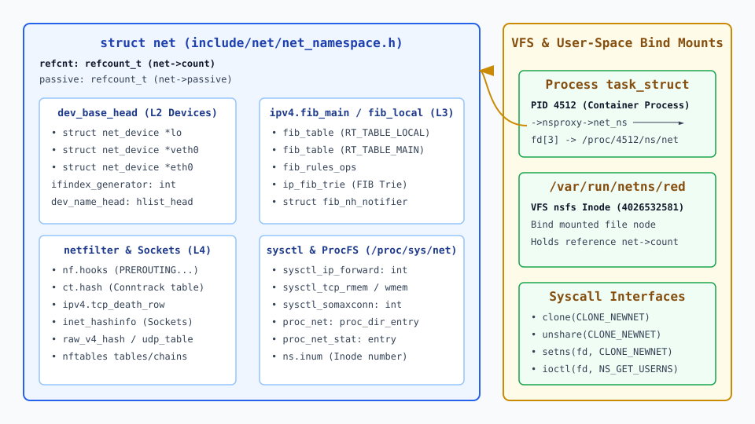
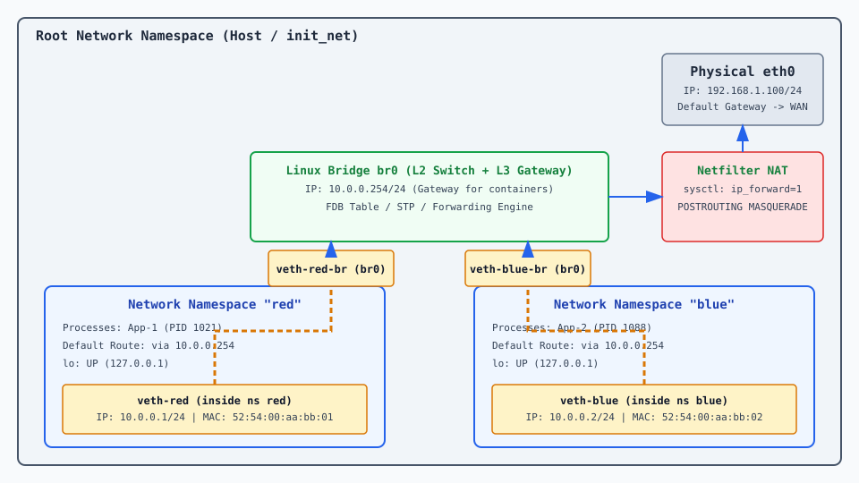
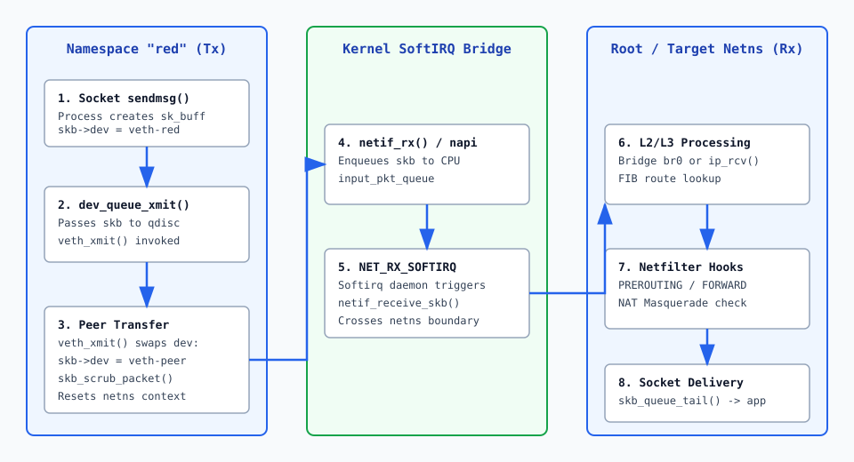

# Мережеві простори імен, veth і мости

<preknowlist>
- [Мережеві інтерфейси та IP-адреси](book:unix-linux/interfaces-and-addresses) — базові поняття `struct net_device`, IP-адресації та rtnetlink.
- [Системні виклики у Linux](book:unix-linux/kernel-and-userspace) — механізм викликів `clone`, `unshare` та `setns`.
</preknowlist>

Коли сотні ізольованих сервісів або контейнерних запусків працюють на єдиному фізичному сервері під керуванням Linux, спроба прив'язати кілька процесів до стандартного порту TCP 80 або надати їм незалежні IP-адреси на єдиному мережевому інтерфейсі натикається на монолітність системного мережевого стека. Якщо сокет слухає порт `0.0.0.0:80`, жоден інший процес у цій самій операційній системі не зможе виконати системний виклик `bind()` на цей порт. Для розв'язання цієї фундаментальної суперечності ядро Linux розщеплює єдиний мережевий стек на довільну кількість незалежних екземплярів — мережевих просторів імен (Network Namespaces, `netns`).

Кожен мережевий простір імен надає процесам, що працюють усередині нього, повністю ізольований віртуальний стек: власні мережеві пристрої (включно з незалежним `lo`), власні таблиці маршрутизації FIB, власні таблиці ARP/NDP сусідування, ізольовані правила Netfilter/nftables та свій набір портів сокетів TCP і UDP.

> 🔧 **Навіщо це.**
> Мережеві простори імен є базовим фундаментом для всієї сучасної контейнеризації: Docker, Podman, Kubernetes (через плагіни CNI Calico, Cilium, Flannel), ізольованих середовищ `systemd-nspawn` та пісочниць (sandboxes) у веб-браузерах. Вони дозволяють запускати тисячі контейнерів із дубльованими IP-адресами та порт-мапінгом без створення важких віртуальних машин та без накладних витрат на гіпервізор.

Детальний аналіз того, як ядро Linux пройшло шлях від глобального списку пристроїв до віртуалізації стека, викладено в історичному матеріалі [📜 Еволюція мережевих просторів імен: від OpenVZ до канонічного netns](book:unix-linux/network-namespaces/hist-netns-evolution.md).

---

## 1. Архітектура `struct net`: Як ядро зберігає ізольований стек

У вихідному коді ядра Linux (файл `include/net/net_namespace.h`) кожен мережевий простір імен представлений структурою `struct net`. До впровадження цієї підсистеми всі компоненти мережі (пристрої, сокети, маршрути) зберігалися у глобальних змінних ядра. Під час масштабного рефакторингу всі ці змінні були зібрані в поля структури `struct net`.

```
                  ┌──────────────────────────────────────────────┐
                  │                 struct net                   │
                  ├──────────────────────────────────────────────┤
                  │ refcount_t count (Лічильник посилань)        │
                  │ refcount_t passive                           │
                  │                                              │
                  │ struct list_head dev_base_head ────────────┐ │
                  │ struct net_device *loopback_dev            │ │
                  │                                            │ │
                  │ struct fib_table *fib_main ──────────────┐ │ │
                  │ struct fib_table *fib_local              │ │ │
                  │                                          │ │ │
                  │ struct netns_ipv4 ipv4 ────────────────┐ │ │ │
                  │ struct netns_ct ct (Conntrack)         │ │ │ │
                  │ struct netns_nftables nft              │ │ │ │
                  │ struct netns_xfrm xfrm (IPsec SAs)     │ │ │ │
                  └────────────────────────────────────────┼─┼─┼─┘
                                                           │ │ │
         ┌─────────────────────────────────────────────────┘ │ │
         │                                                   │ │
         ▼                                                   │ │
┌─────────────────┐    ┌─────────────────┐                   │ │
│ struct          │--->│ struct          │                   │ │
│ net_device (lo) │    │ net_device(veth)│                   │ │
└─────────────────┘    └─────────────────┘                   │ │
                                                             ▼ │
                                                    ┌──────────┴──────┐
                                                    │ FIB Trie (L3)   │
                                                    │ Main & Local    │
                                                    └─────────────────┘
```


*Малюнок 1. Архітектура структури struct net у ядрі Linux, її внутрішні підсистеми та зв'язок із VFS nsfs через /proc/PID/ns/net.*

### 1.1. Детальний аналіз підсистем всередині `struct net`

Структура `struct net` містить вказівники на такі повністю ізольовані підсистеми ядра:

1. **Список мережевих пристроїв (`struct list_head dev_base_head`):** Кожен мережевий пристрій (`struct net_device`) належить рівно одному екземпляру `struct net`. Фізичний інтерфейс `eth0` або віртуальний `veth0` не може перебувати у двох просторах одночасно. Усі імена інтерфейсів є унікальними виключно у межах одного простору, що дозволяє мати пристрої `eth0` у кожному контейнері.
2. **Таблиці маршрутизації (FIB — Forwarding Information Base):** Для IPv4 та IPv6 підтримуються окремі таблиці `RT_TABLE_LOCAL` (локальні адреси) та `RT_TABLE_MAIN` (зовнішні маршрути). Пошук у дерев'яній структурі FIB Trie виконується в контексті `net->ipv4.fib_main`. Маршрути, додані у просторі `netns1`, повністю невидимі для `netns2`.
3. **Кеш сусідування (ARP/NDP caches):** Таблиці відповідності IP-адрес та MAC-адрес (`struct neigh_table`) розділені. Це дозволяє просторам мати однакові IP-адреси в ізольованих сегментах без конфліктів ARP-відповідей.
4. **Хеш-таблиці сокетів (`inet_hashinfo`):** Усі сокети (TCP, UDP, RAW) прив'язані до конкретного `struct net`, і вказівник на простір входить у ключ хешування (`net_hash_mix()`). Тому перевірка унікальності комбінації `(Local IP, Local Port, Remote IP, Remote Port)` бачить лише сокети того самого простору, навіть якщо сама хеш-таблиця фізично спільна для всієї системи.
5. **Правила Netfilter (iptables / nftables / conntrack):** Кожен простір підтримує власний набір ланцюжків правил фільтрації, таблиць маскування (NAT) та таблицю відстеження з'єднань Conntrack (`net->ct.hash`).
6. **Параметри sysctl (`/proc/sys/net/`):** Налаштування ядра типу `net.ipv4.ip_forward` або `net.ipv4.tcp_rmem` зберігаються всередині структури простору і конфігуруються незалежно для кожного контейнера.
7. **Інтерфейс `loopback` (`lo`):** При створенні нового `struct net` ядро ініціалізує для нього власну локальну петлю `lo`.
8. **Підсистеми IPv6 та IPSec (XFRM):** Структури `struct netns_ipv6` та `struct netns_xfrm` ізолюють політики шифрування IPsec SA/SP, таблиці маршрутизації IPv6 та параметри сусідського виявлення NDP.

### 1.2. Розподіл пам'яті та кешування у ядрі

Структура `struct net` є досить масивною об'єктною сутністю. Пам'ять для неї виділяється зі спеціалізованого SLAB-кешу ядра `net_cachep`.

Під час створення простору ядро виконує послідовну реєстрацію підсистем (pernet operations), зареєстрованих у списку `pernet_list`. Кожен мережевий модуль ядра (IPv4, IPv6, Netfilter, Unix sockets, 802.1Q VLAN) має власні функції ініціалізації (`.init`) та очищення (`.exit`).

Завдяки такій модульності ядро забезпечує чітку послідовність виділення ресурсів:
* Спочатку виділяються базові структури `procfs` та `sysctl`.
* Потім ініціалізуються сокетні хеш-таблиці та правила фільтрації.
* Наприкінці створюється пристрій `loopback`.

Якщо під час ініціалізації бодай одного модуля виникає помилка (наприклад, брак пам'яті при створенні Conntrack-хешу), ядро виконує відкат (rollback), викликаючи функції `.exit` для всіх вже ініціалізованих модулів, та безпечно вивільняє пам'ять.

### 1.3. Управління життєвим циклом: VFS та nsfs

Ядро Linux виділяє пам'ять під `struct net` у підсистемі SLAB/SLUB. Об'єкт `struct net` існує доти, доки його лічильник посилань `net->count` більший за нуль.

Посилання на мережевий простір утримують:
* Усі працюючі процеси, чий вказівник `task_struct->nsproxy->net_ns` дивиться на цей `struct net`.
* Усі мережеві пристрої (`struct net_device`), прив'язані до цього простору.
* Відкриті файлові дескриптори псевдофайлів `/proc/[pid]/ns/net`.
* Закріплені точки монтування (bind mounts) у файловій системі (наприклад, файли у каталозі `/var/run/netns/`).

Коли останній процес у просторі завершується і закріплені файли видаляються, лічильник `net->count` досягає нуля й спрацьовує `__put_net()`. Сама робота відкладається: простір ставиться у список `cleanup_list`, а на черзі `netns_wq` планується `cleanup_net()`, яка вже в процесному контексті знищує пристрої, викликає `.exit`-функції всіх pernet-підсистем, очищає таблиці маршрутизації та повертає пам'ять ядру. Через це реальне звільнення ресурсів простору відбувається не миттєво, а з невеликою затримкою після закриття останнього посилання.

---

## 2. Механіка системних викликів: clone, unshare та setns

Управління просторами імен із програмного коду або системних утиліт забезпечується трьома системними викликами з використанням прапорця `CLONE_NEWNET`.

```
                    ┌─────────────────────────┐
                    │     Виклики ядра        │
                    └────────────┬────────────┘
                                 │
         ┌───────────────────────┼───────────────────────┐
         │                       │                       │
         ▼                       ▼                       ▼
┌──────────────────┐    ┌──────────────────┐    ┌──────────────────┐
│     clone()      │    │    unshare()     │    │     setns()      │
│  (CLONE_NEWNET)  │    │  (CLONE_NEWNET)  │    │  (CLONE_NEWNET)  │
└────────┬─────────┘    └────────┬─────────┘    └────────┬─────────┘
         │                       │                       │
         │ Створює процес        │ Відокремлює           │ Переміщує
         │ у новому netns        │ поточний процес       │ у наданий fd
         ▼                       ▼                       ▼
 ┌─────────────────────────────────────────────────────────────────┐
 │               Виділення нової struct net у ядрі                │
 │       Створення порожнього lo (стан DOWN), нової FIB trie       │
 └─────────────────────────────────────────────────────────────────┘
```

Повний перелік параметрів системних викликів, структуру Netlink-атрибутів та sysctl-параметри зібрано у довіднику [📋 Інтерфейси керування netns: системні виклики, Netlink та sysfs](book:unix-linux/network-namespaces/api-netns-syscalls.md).

### 2.1. Послідовність виконання `unshare(CLONE_NEWNET)` у ядрі

Коли процес викликає `unshare(CLONE_NEWNET)`, ядро здійснює таку чітку послідовність дій:
1. Перевіряє привілеї: створення простору вимагає `CAP_SYS_ADMIN` у тому User Namespace, якому належить поточний процес (саме `CAP_SYS_ADMIN`, а не `CAP_NET_ADMIN` — останній потрібен уже для налаштування пристроїв усередині створеного простору).
2. Викликає внутрішню функцію `copy_net_ns()`, яка виділяє пам'ять під новий `struct net`.
3. Викликає підсистему реєстрації `setup_net()`, що ініціалізує порожню таблицю маршрутів FIB, таблиці Conntrack та створює новий інтерфейс `lo`.
4. Зауважте: новий `lo` за замовчуванням перебуває у стані `DOWN`. Його необхідно явно перевести у стан `UP` (`ip link set lo up`), інакше процес всередині простору не зможе звертатися навіть за адресою `127.0.0.1`.
5. Замінює вказівник `current->nsproxy->net_ns` на нову структуру.

### 2.2. Утиліта `ip netns`: Закріплення просторів у VFS

За замовчуванням, якщо процес створює простір через `unshare()` і завершується, цей простір негайно знищується ядром. Щоб створити "постійний" мережевий простір, утиліта `iproute2` виконує алгоритм:

```bash
# 1. Створення нового простору імен
ip netns add red
```

Під капотом `ip netns add red` робить наступне:
1. Створює порожній файл у каталозі призначення: `touch /var/run/netns/red`.
2. Запам'ятовує свій поточний простір (відкритий `/proc/self/ns/net`) і викликом `unshare(CLONE_NEWNET)` сам переходить у новий простір.
3. Виконує bind mount псевдофайла `/proc/self/ns/net` на створений файл `/var/run/netns/red`, після чого через `setns()` повертається у свій попередній простір.
4. Оскільки монтування зберігається у файловій системі, лічильник посилань `struct net` збільшується, і простір залишається живим навіть після завершення роботи команди `ip`.

### 2.3. Перехід у простір: `ip netns exec` та `setns()`

Для запуску команди всередині наявного простору використовується:

```bash
ip netns exec red ip a
```

Послідовність виконання в ядрі:
1. Процес `ip` відкриває файл `/var/run/netns/red`, отримуючи файловий дескриптор `fd`.
2. Викликає системний виклик `setns(fd, CLONE_NEWNET)`. Ядро перемикає мережевий контекст поточного процесу на `struct net`, пов'язаний із цим файлом.
3. Викликає `execvp()`, замінюючи поточний процес цільовою програмою (наприклад, `ip a` або `bash`).

---

## 3. З'єднання просторів: Virtual Ethernet (`veth`)

Створений мережевий простір є повністю ізольованим острівцем. Для встановлення мережевого зв'язку між хостом та просторами імен (або між двома просторами) використовується спеціальний тип віртуальних пристроїв — `veth` (Virtual Ethernet).

`veth` — це віртуальний тунельний кабель, який завжди створюється у вигляді нерозривної пари інтерфейсів. Усе, що передається (Tx) на один кінець пари, негайно приймається (Rx) на іншому кінці.

```
+------------------------------------+       +------------------------------------+
| Root Network Namespace (Host)      |       | Network Namespace "red"            |
|                                    |       |                                    |
|   +----------------------------+   |       |   +----------------------------+   |
|   | veth-host                  |   |       |   | veth-red                   |   |
|   | IP: 10.0.0.1/24            |   |       |   | IP: 10.0.0.2/24            |   |
|   +--------------+-------------+   |       |   +--------------+-------------+   |
|                  |                 |       |                  |                 |
+------------------|-----------------+       +------------------|-----------------+
                   |                                            |
                   +============================================+
                              Virtual Ethernet Pair
                             (Передавання пакета skb)
```

### 3.1. Драйвер `veth.c` та механіка очищення `skb_scrub_packet()`

Драйвер віртуального кабелю `drivers/net/veth.c` працює на рівні кадрів L2. Коли пакет `sk_buff` надсилається у пристрій `veth-host`, драйвер виконує такі ключові дії у функції `veth_xmit()`:

1. Перевіряє стан парного інтерфейсу (`veth-red`). Якщо той вимкнений (`DOWN`) або кадр не проходить за розміром, пакет знищується, а лічильник скинутих на передачі кадрів (`tx_dropped`) зростає — саме тому `tx_bytes` одного кінця пари й `rx_bytes` другого розходяться при негараздах.
2. Встановлює вказівник пристрою прийому: `skb->dev = peer_dev`.
3. Викликає функцію `skb_scrub_packet(skb, xnet)`. Прапорець `xnet = true` вказує на те, що пакет перетинає межу мережевих просторів імен.

Функція `skb_scrub_packet()` очищає метадані пакета, прив'язані до старого простору:
* Скидає прив'язку до запису Conntrack (`nf_reset_ct()`) і трасувальні позначки Netfilter: у новому просторі своя таблиця з'єднань, і старий запис там не має сенсу.
* Викидає кешований маршрут (`skb_dst_drop()`) — маршрут із FIB попереднього простору у новому недійсний.
* Обнуляє мітку маршрутизації `skb->mark` та пріоритет `skb->priority` (їх виставляли правила старого простору).
* Скидає індекс вхідного інтерфейсу `skb->skb_iif` і повертає тип пакета до `PACKET_HOST`.

Саме через це очищення правила фаєрвола, позначки та conntrack-стан не «протікають» із контейнера на хост і навпаки: за межу простору переходить лише сам кадр із даними.

### 3.2. Переміщення пристроїв та системні події Netlink

Переміщення пристрою між просторами здійснюється командою `ip link set veth-red netns red`. 

На рівні ядра функція `dev_change_net_namespace()` реалізує таку послідовність кроків:
1. Переводить пристрій у стан `DOWN` та очищає всі прив'язані IP-адреси та маршрути.
2. Генерує системне сповіщення `NETDEV_UNREGISTER` у початковому просторі імен. Усі системні демони дізнаються про видалення пристрою.
3. Змінює вказівник `dev->nd_net` на нову структуру `struct net`.
4. Генерує системне сповіщення `NETDEV_REGISTER` у цільовому просторі імен.
5. Оновлює символьні посилання у файловій системі `/sys/class/net/`.

Практичний приклад створення та налаштування `veth`-пари мовами C та C++ розібрано у матеріалі [⚙️ Програмне створення мережевих просторів та veth-пар](book:unix-linux/network-namespaces/proj-netns-veth-setup.md).

---

## 4. Побудова складних топологій: Linux Bridge, NAT та L3 Routing

Для з'єднання трьох і більше просторів імен прямого точкового з'єднання (point-to-point) veth-парою недостатньо. Існує два основні підходи до побудови топології: L2-комутація (Linux Bridge) та L3-маршрутизація.


*Малюнок 2. Топологія з'єднання ізольованих мережевих просторів red та blue через Linux Bridge br0 та налаштування NAT на хості.*

### 4.1. Топологія L2: Використання Linux Bridge

Linux Bridge (`br0`) працює як віртуальний Ethernet-світч L2-рівня. Окремі простори імен підключаються до моста своїми `veth`-парами.

Створимо простір `blue` поруч із `red` та об'єднаємо їх через міст `br0`:

```bash
# 1. Створення моста на хості
ip link add br0 type bridge
ip link set br0 up
ip addr add 10.0.0.254/24 dev br0

# 2. Створення просторів red та blue
ip netns add red
ip netns add blue

# 3. Створення veth-пар для кожного простору
ip link add veth-red type veth peer name veth-red-br
ip link add veth-blue type veth peer name veth-blue-br

# 4. Приєднання хостових кінців до моста br0
ip link set veth-red-br master br0
ip link set veth-blue-br master br0
ip link set veth-red-br up
ip link set veth-blue-br up

# 5. Переміщення кінців у простори та конфігурація IP
ip link set veth-red netns red
ip netns exec red ip addr add 10.0.0.1/24 dev veth-red
ip netns exec red ip link set veth-red up
ip netns exec red ip link set lo up

ip link set veth-blue netns blue
ip netns exec blue ip addr add 10.0.0.2/24 dev veth-blue
ip netns exec blue ip link set veth-blue up
ip netns exec blue ip link set lo up
```

Тепер простори `red` (`10.0.0.1`) та `blue` (`10.0.0.2`) перебувають у єдиному L2 broadcast-домені. Вони можуть спілкуватися між собою напряму через міст `br0`.

### 4.2. Механіка функціонування Linux Bridge у ядрі

Коли мостовий пристрій `br0` приймає кадр від `veth-red-br`, функція ядра `br_handle_frame()` реалізує повноцінну логіку навчання L2-комутатора:

1. **Навчання FDB (Forwarding Database):** Драйвер читає MAC-адресу джерела (`eth_hdr(skb)->h_source`) та оновлює таблицю FDB моста, запам'ятовуючи, за яким портом закріплена дана MAC-адреса.
2. **Пошук порту призначення:** Драйвер шукає MAC-адресу призначення (`eth_hdr(skb)->h_dest`) у таблиці FDB:
   - Якщо адреса відома і це порт `veth-blue-br`, кадр перенаправляється тільки у цей порт.
   - Якщо адреса широкомовна (`FF:FF:FF:FF:FF:FF`) або невідома, кадр дублюється на всі активні порти моста (Flooding).

### 4.3. Налаштування виходу в Інтернет (NAT Masquerade)

Щоб процеси з просторів `red` та `blue` мали доступ до зовнішньої мережі (Інтернету), необхідно налаштувати L3-маршрутизацію та трансляцію мережевих адрес (NAT).

Крок 1: Вказуємо мостову адресу хоста `10.0.0.254` як шлюз за замовчуванням (default gateway) всередині просторів:

```bash
ip netns exec red ip route add default via 10.0.0.254
ip netns exec blue ip route add default via 10.0.0.254
```

Крок 2: Вмикаємо перенаправлення IP-пакетів (IP forwarding) у ядрі хоста:

```bash
sysctl -w net.ipv4.ip_forward=1
```

Крок 3: Налаштовуємо маскування джерела (MASQUERADE) у Netfilter для вихідного інтерфейсу хоста (`eth0`):

```bash
# Через nftables (сучасний підхід)
nft add table ip nat
nft add chain ip nat postrouting '{ type nat hook postrouting priority 100; }'
nft add rule ip nat postrouting oifname "eth0" masquerade

# Або через iptables (класичний підхід)
iptables -t nat -A POSTROUTING -o eth0 -j MASQUERADE
```

Тепер пакет із простору `red`, спрямований до `8.8.8.8`, проходить через `veth-red`, потрапляє на міст `br0`, маршрутизується ядром хоста у вихідний інтерфейс `eth0`, піддається трансляції SNAT, і виходить у зовнішню мережу.

### 4.4. Топологія L3 Routed (Point-to-Point без моста)

У масштабних інфраструктурах (наприклад, у Kubernetes CNI Calico) від використання L2-мостів часто відмовляються на користь чистої L3-маршрутизації.

Замість об'єднання кінців у міст, хостові кінці `veth`-пар залишаються в глобальному просторі як точкові інтерфейси. На кожен контейнер виділяється маска `/32`:

```bash
# На хості
ip link add veth-c1 type veth peer name veth-guest
ip link set veth-guest netns guest

# Всередині контейнера guest
ip netns exec guest ip addr add 10.1.1.2/32 dev veth-guest
ip netns exec guest ip link set veth-guest up
ip netns exec guest ip route add 169.254.1.1 dev veth-guest
ip netns exec guest ip route add default via 169.254.1.1

# На хості
ip link set veth-c1 up
ip route add 10.1.1.2 dev veth-c1
```

**Переваги L3-маршрутизованого підходу:**
1. Відсутність широкомовного L2-трафіку (ARP broadcasts не штормлять мережу).
2. Економія IP-адрес (не витрачаються адреси на network, broadcast та gateway у кожній підмережі `/24`).
3. Можливість застосування політик фаєрвола та BGP-маршрутизації безпосередньо на хості.

---

## 5. Проходження пакета між просторами та профіль продуктивності

Передавання даних між мережевими просторами через `veth`-пари створює додаткові накладні витрати на обробку в ядрі порівняно з прямим викликом socket-to-NIC.


*Малюнок 3. Послідовність проходження буфера sk_buff між просторами імен крізь veth-пару та обробку в softirq.*

### 5.1. Крок за кроком: Життєвий цикл `sk_buff`

1. Процес у просторі `red` викликає `sendmsg()`. Ядро сформує буфер сокета `struct sk_buff` (`skb`), встановлює `skb->dev = veth-red` та викликає `dev_queue_xmit()`.
2. Драйвер `veth` викликає функцію `veth_xmit()`. Вона підміняє пристрій призначення на парний інтерфейс: `skb->dev = veth-host`.
3. Викликається функція `skb_scrub_packet()`, яка очищає мітки з'єднання Conntrack та контекст попереднього мережевого простору з буфера `skb`.
4. Драйвер викликає `netif_rx()` (у сучасних ядрах — `__netif_rx()`), поміщаючи `skb` у backlog-чергу прийому поточного ядра ЦП (`input_pkt_queue`).
5. Планується м'яке програмне переривання `NET_RX_SOFTIRQ`.
6. Обробник переривання у контексті нового мережевого простору (хоста) витягує `skb` і передає його на обробку у стек IPv4 (`ip_rcv()`) або міст (`br_handle_frame()`).

### 5.2. Профіль продуктивності та альтернативи `veth`

Основні джерела накладних витрат під час використання `veth`:
* **Подвійна обробка у softirq:** Пакет проходить через мережевий стек ядра двічі (один раз на передачу у `netns`, один раз на прийом у `root netns`).
* **Кеш-промахи ЦП (CPU Cache Invalidation):** Якщо програмне переривання `NET_RX_SOFTIRQ` виконується на іншому ядрі ЦП, виникає потреба у перезавантаженні структур даних `skb` між кешами L1/L2/L3.

При високих навантаженнях (понад 1–2 мільйони пакетів за секунду) `veth`-пари можуть ставати вузьким місцем. 

**Альтернативні технології для підвищення швидкодії:**

| Технологія | Механізм роботи | Переваги | Обмеження |
| :--- | :--- | :--- | :--- |
| **`macvlan`** | Створює віртуальні мережеві інтерфейси з власними MAC-адресами поверх фізичного `eth0`. | Обходить L2-міст `br0`, пакети відправляються напряму у фізичний інтерфейс. | Контейнери не можуть зв'язуватися з самим хостом без спеціальних хаків. |
| **`ipvlan` (L2/L3)** | Віртуальні інтерфейси ділять одну MAC-адресу фізичного `eth0`, але мають власні IP. | Менше навантаження на таблиці MAC-адрес комутатора. | Не підтримується DHCP у L3-режимі. |
| **`eBPF / XDP`** | Програма на `tc`/XDP перекидає `skb` одразу в парний пристрій іншого простору (`bpf_redirect_peer()`), а локальні TCP-з'єднання `sockmap` зшиває просто між сокетами. | Пакет минає Netfilter, пошук у FIB і другий прохід стеком. | `sockmap` — від ядра 4.14, `bpf_redirect_peer()` — від 5.10; складне конфігурування. |
| **`SR-IOV`** | Апаратна віртуалізація мережевої карти (PCIe Virtual Functions). | Нульові накладні витрати ядра, прямий доступ до заліза. | Вимагає спеціальної підтримки з боку мережевої карти. |

---

## 6. Глибока взаємодія з іншими просторами імен ядра

Мережевий простір імен рідко функціонує у відриві від інших підсистем ізоляції Linux. Під час створення контейнера ядро комбінує кілька просторів імен одночасно.

### 6.1. Взаємодія з User Namespaces (`CLONE_NEWUSER`)

Починаючи з ядра Linux 3.8, непривілейовані користувачі отримали можливість створювати мережеві простори імен за умови комбінування із прапорцем `CLONE_NEWUSER`.

Механіка взаємодії:
1. Процес створює новий User Namespace, у якому його локальний UID `1000` мапується на root (`UID 0`).
2. Всередині цього нового User Namespace процес отримує повний набір привілеїв (capabilities) щодо об'єктів, які цьому просторові належать, — зокрема `CAP_SYS_ADMIN` і `CAP_NET_ADMIN`.
3. Тепер процес викликає `unshare(CLONE_NEWNET)`. Ядро перевіряє `CAP_SYS_ADMIN` у контексті нового User Namespace і дозволяє створення `struct net`. На хості жодних реальних прав root процес при цьому не має.
4. Створена структура `struct net` зберігає вказівник на `user_ns`, який її створив. Усі мережеві пристрої, додані у цей простір, підпорядковуються привілеям даного User Namespace.

Це фундаментальний механізм, який дозволяє запускати Rootless Docker, Rootless Podman та непривілейовані LXC контейнери без надання реальних root-прав на хості.

### 6.2. Взаємодія з Mount Namespaces (`CLONE_NEWNS`) та procfs

Може здатися, що після `unshare(CLONE_NEWNET)` без перемонтування `/proc` процес і далі бачитиме мережеву статистику хоста. Це не так: `/proc/net` — символьне посилання на `/proc/self/net`, а вміст `/proc/<pid>/net` ядро формує за простором того процесу, чий каталог читають. Так само влаштований і `/proc/sys/net`: набір sysctl-таблиць вибирається за `current->nsproxy->net_ns`.

Тому контейнер, який створив новий мережевий простір, але лишився у старому Mount Namespace, однаково побачить у `/proc/net/dev` і `/proc/net/tcp` дані **нового** простору — тут `ip a` (rtnetlink) і `ifconfig` (`/proc/net/dev`) не розійдуться.

Перемонтувати `procfs` у новому Mount Namespace (`mount -t proc proc /proc`) контейнеризатори змушені з іншої причини — щоб приховати каталоги `/proc/<pid>` чужих процесів у новому PID-просторі; для мережевих файлів це не обов'язково.

---

## 7. Архітектурне порівняння CNI-плагінів у Kubernetes

У Kubernetes кожен Pod отримує власний ізольований мережевий простір імен; утримує його службовий pause-контейнер, який живе стільки ж, скільки Pod, і не дає простору зникнути під час перезапуску окремих контейнерів. За налаштування зв'язку між мережевими просторами Pod-ів відповідає плагін CNI (Container Network Interface).

### 7.1. Flannel (Overlay network у режимі VXLAN)

Flannel створює класичну L2 overlay мережу.
* Кожен Pod має свій мережевий простір, з'єднаний `veth`-парою з мостом `cni0` на вузлі.
* Для зв'язку між вузлами використовується віртуальний інтерфейс `flannel.1` типу VXLAN.
* Пакет із простору Pod-а запаковується в UDP-датаграму і відправляється через фізичну мережу хоста. Flannel історично слухає порт 8472 (реалізація випередила стандарт), тоді як призначений IANA порт VXLAN — 4789; при налаштуванні фаєрвола між вузлами це найчастіша причина «мовчазної» мережі.
* **Накладні витрати:** Додаткові 50 байтів на заголовок VXLAN та зменшення MTU до 1450 байтів.

### 7.2. Calico (Чиста L3-маршрутизація через BGP)

Calico відмовляється від L2-мостів та VXLAN на користь прямої L3-маршрутизації.
* Кожен Pod з'єднується точковою `veth`-парою безпосередньо з хостом.
* Агент `Felix` налаштовує маршрути на хості, вказуючи, що IP-адреса Pod-а доступна через відповідний пристрій `veth`.
* Демон `BIRD` поширює ці маршрути між вузлами кластера за допомогою протоколу BGP.
* **Переваги:** Висока швидкодія, відсутність overlay-заголовків, збереження стандартного MTU 1500.

### 7.3. Cilium (eBPF Direct Routing)

Cilium використовує eBPF замість класичного мережевого стека ядра та `iptables`.
* eBPF-програми приєднуються до точок `tc` (traffic control) на `veth`-інтерфейсах просторів.
* За допомогою eBPF-карти `sockmap` пакети перенаправляються безпосередньо між сокетами різних просторів (`bpf_redirect_peer`).
* **Переваги:** пакет минає ланцюжки `iptables` і другий прохід стеком, підтримка мікросегментації на L7 рівні (HTTP/gRPC) без додаткових проксі.

---

## 8. Моделі віртуалізації портів та повторна прив'язка (SO_REUSEPORT)

Управління сокетами у межах мережевих просторів імен має свої специфічні відмінності щодо перевірки унікальності портів.

Коли процес викликає `bind()` на сокет із прапорцем `SO_REUSEPORT`, ядро групує такі сокети у списку `sk_reuseport_cb`. 

Проте така група утворюється виключно в межах **одного мережевого простору імен**. Два процеси у різних мережевих просторах можуть виконувати `bind()` на той самий порт (наприклад, `0.0.0.0:80`) без використання `SO_REUSEPORT`, оскільки пошук сокета у хеш-таблиці `inet_hashinfo` містить унікальний вказівник на `struct net` у складі ключа хешування.

### Виснаження ефемерних портів (Ephemeral Port Exhaustion)

Під час створення великої кількості вихідних TCP-з'єднань з одного контейнера процес споживає ефемерні порти з діапазону `net.ipv4.ip_local_port_range` (типово 32768–60999, тобто рівно 28 232 порти).

Якщо всі порти з даного діапазону вичерпано у контексті одного мережевого простору, виклики `connect()` повертатимуть помилку `EADDRNOTAVAIL`. Кожен простір рахує ці порти окремо, тож сусідні контейнери одне одного не обмежують — але лише доти, доки їхній трафік не виходить назовні через спільний MASQUERADE на хості: там SNAT знову добирає вихідний порт зі спільного пулу адреси хоста, і стеля повертається вже на рівні conntrack-таблиці кореневого простору.

---

## 9. Пряма передача трафіку між просторами без veth (eBPF sockmap)

Технологія eBPF `sockmap` дозволяє повністю оминути подвійну обробку пакетів у `veth`-драйвері та Netfilter.

```
+-------------------+                          +-------------------+
| Container Netns 1 |                          | Container Netns 2 |
|   Socket App 1    |                          |   Socket App 2    |
+---------+---------+                          +---------^---------+
          |                                              |
          |  [tcp_bpf_sendmsg()]                         |
          +----------------------------------------------+
                      eBPF sockmap redirect
                      (Обхід L2/L3 ядра та SOFTIRQ)
```

Механіка роботи eBPF `sockmap`:
1. Мапа типу `BPF_MAP_TYPE_SOCKMAP` зберігає посилання на відкриті сокети обох контейнерів.
2. Програма типу `BPF_PROG_TYPE_SK_MSG` (точка приєднання `BPF_SK_MSG_VERDICT`) перехоплює дані `sendmsg()` на рівні шару сокетів.
3. Замість формування кадру `sk_buff`, пошуку маршруту та відправки у `veth` вона викликом `bpf_msg_redirect_map()` перекладає дані одразу в приймальну чергу цільового сокета в іншому мережевому просторі.

Для локального міжконтейнерного зв'язку це прибирає з дороги весь L2/L3-шлях і зводить затримку до порядку, характерного для UNIX domain sockets. Застереження: обхід стека означає й обхід Netfilter — правила фільтрації, написані для `veth`, до такого трафіку вже не застосовуються.

---

## 10. Оптимізація MTU та пастки фрагментації у veth та тунелях

Під час проектування мережевих топологій із використанням просторів імен важливе значення має налаштування максимального розміру блоку передачі (MTU — Maximum Transmission Unit).

Стандартний розмір MTU для фізичного інтерфейсу Ethernet становить 1500 байтів. Проте при використанні overlay-мереж (VXLAN, Geneve, GRE) або шифрованих тунелів (WireGuard, IPsec) до кожного пакета додається зовнішній заголовок тунелю (від 20 до 50 байтів).

### Пастка некоректного MTU у veth-парах

Якщо інтерфейс `veth-red` усередині контейнера має MTU 1500, а тунельний пристрій хоста `flannel.1` має MTU 1450:
1. Процес у контейнері відправляє TCP-пакет розміром 1500 байтів з установленим прапорцем DF (Don't Fragment).
2. Пакет проходить крізь `veth`-пару без перешкод, але при спробі виходу у VXLAN тунель ядро змушене скинути пакет, оскільки його розмір перевищує 1450 байтів.
3. Якщо правила Netfilter блокують відправку зворотного ICMP-повідомлення `Destination Unreachable (Fragmentation Needed)`, техніка виявлення MTU шляху (PMTUD) ламається, і TCP-з'єднання зависає (так звана "чорна діра PMTUD").

Щоб не доводити до цього, у мережевих просторах контейнерів застосовують TCP MSS Clamping. Ціль `TCPMSS` дозволена лише в таблиці `mangle`, тож `-t mangle` тут обов'язковий:

```bash
iptables -t mangle -A FORWARD -p tcp --tcp-flags SYN,RST SYN -j TCPMSS --clamp-mss-to-pmtu
```

Це правило автоматично зменшує значення MSS у SYN-пакетах TCP-з'єднань до розміру, який гарантовано вміщається у найвужче місце мережевого тунелю.

---

## 11. Системний менеджер systemd та мережеві простори імен

Системний менеджер `systemd` надає можливість ізолювати мережу будь-якої фонової служби без запуску повноцінних контейнерних рушіїв.

У юніт-файлі служби достатньо вказати директиву:

```ini
[Service]
PrivateNetwork=yes
```

Коли `systemd` запускає цю службу, він здійснює такі дії:
1. Викликає системний виклик `unshare(CLONE_NEWNET)` для створюваного процесу.
2. Автоматично піднімає інтерфейс `loopback` (`lo`), але не створює жодних `veth`-пар чи зовнішніх маршрутів.
3. Процес служби опиняється у повністю замкненому мережевому просторі, позбавленому доступу до фізичних мережевих карт, сокетів хоста чи зовнішнього Інтернету.

Це ключовий механізм безпеки (security hardening), який захищає системні демони від мережевих атак та витоку даних. Для об'єднання кількох служб у спільний простір `systemd` надає директиву `JoinsNamespaceOf=service-name.service`.

---

## 12. Трасування, відлагодження та крайові випадки

Під час експлуатації мережевих просторів виникають типові проблеми, пов'язані з невидимістю трафіку або конфліктами конфігурації.

### 12.1. Діагностика за допомогою `tcpdump` та `iproute2`

Перевірити наявність пристроїв та IP-адрес у конкретному просторі:

```bash
ip netns exec red ip -details link show
ip netns exec red ip route show
```

Захоплення трафіку всередині простору:

```bash
# Даний підхід працює, навіть якщо всередині контейнера немає встановленої утиліти tcpdump
ip netns exec red tcpdump -nn -i veth-red
```

Захоплення трафіку з боку хоста (на відповідному кінці `veth`-пари або моста):

```bash
tcpdump -nn -i veth-red-br
```

### 12.2. Ідентифікатори просторів `nsid`

Ядро призначає кожному мережевому простору внутрішній унікальний ідентифікатор `nsid` (Namespace ID), який використовується підсистемою Netlink під час відображення зв'язків між просторами:

```bash
# Перегляд переліку просторів із їхніми nsid
ip netns list-id
```

Якщо пристрій переміщено в інший простір, команда `ip link` на хості покаже атрибут `link-netnsid`:

```bash
ip link show veth-host
# 5: veth-host@if4: <BROADCAST,MULTICAST,UP,LOWER_UP> mtu 1500 ... link-netnsid 0
```

Це дозволяє точно визначити, у який саме простір спрямовано парний кінець віртуального кабелю.

### 12.3. Типові пастки та крайові випадки

1. **Вимкнений `lo` у новому просторі:** При створенні нового `netns` інтерфейс `lo` завжди перебуває у стані `DOWN`. Поки він не піднятий, маршруту до `127.0.0.1` не існує взагалі, і `connect()` падає з `ENETUNREACH` («Network is unreachable»), а не з `ECONNREFUSED` — типова пастка, бо в логах це виглядає як проблема віддаленої сторони. Завжди виконуйте `ip link set lo up`. (UNIX-сокети у файловій системі від стану `lo` не залежать зовсім — вони не проходять крізь IP-стек.)
2. **Висячі простори імен (Dangling Namespaces):** Якщо файл простору видалено з `/var/run/netns/`, але всередині цього простору продовжує працювати фоновий процес, простір залишається в пам'яті ядра. Його не видно у списку `ip netns list`, але він споживає ресурси. Знайти такі процеси можна через перевірку `/proc/[pid]/ns/net`.
3. **Конфлікти sysctl-параметрів:** Зміна параметра `sysctl net.ipv4.ip_forward=1` усередині простору контейнера не змінює цей параметр на хості. Переконайтеся, що L3-маршрутизація ввімкнена на обох рівнях, якщо трафік має перетинати кордон простору.

---

## Висновок

Мережеві простори імен у поєднанні з `veth`-парами та мостами є фундаментом програмно-визначених мереж (SDN) у Linux. Завдяки розділенню структури `struct net` ядро забезпечує повну ізоляцію L2-L4 рівнів мережевого стека без повноцінної емуляції апаратного забезпечення. Розуміння механіки `unshare`, `setns`, роботи `veth`-пар та накладних витрат обробки пакетів у `SOFTIRQ` дозволяє ефективно проектувати, оптимізувати та діагностувати мережеві інфраструктури сучасних контейнерних платформ.
