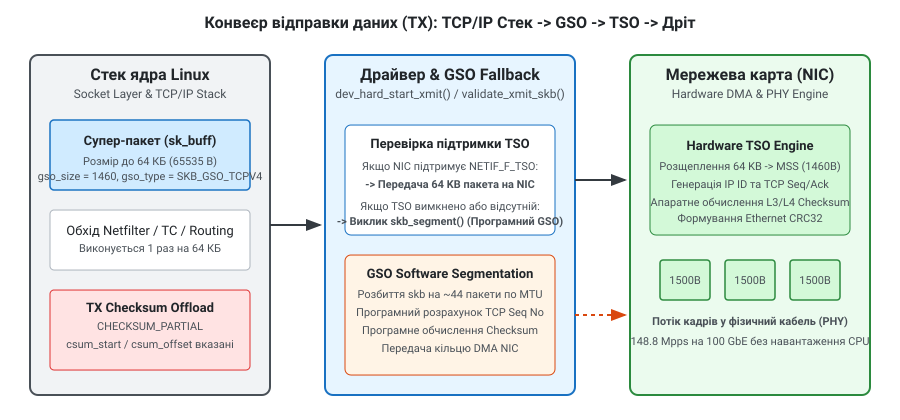
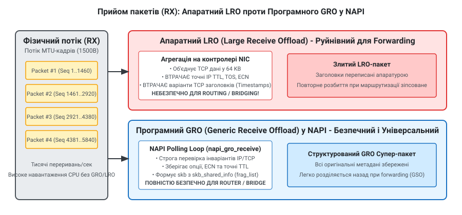

# Розвантаження мережевої карти: контрольні суми, збирання й сегментація

<preknowlist>
- [Архітектура мережевого стека Linux](topic:unix-linux/network-stack-architecture) — концепції `sk_buff`, NAPI polling loop та розмежування шарів L2–L4 у ядрі.
- [Інтерфейси та мережеві адреси](topic:unix-linux/interfaces-and-addresses) — пристрій `net_device`, прапорці інтерфейсів та системний виклик `ioctl`.
</preknowlist>

При швидкості мережевого інтерфейсу 100 Gbit/s через фізичний канал проходить до 148.8 мільйона 64-байтних кадрів Ethernet за секунду. Навіть при використанні максимального розміру блоку передачі MTU (1500 байт) сервер змушений обробляти 8.15 мільйона пакетів щосекунди. На один процесорний клок центрального процесора з частотою 3.0 GHz припадає менше ніж 20–30 тактів для обробки кожного пакета. Одне некешоване читання з оперативної пам'яті (L3 cache miss) триває близько 50–70 нс, що перевищує увесь часовий бюджет, виділений на пакет.

Якщо ядро операційної системи обробляє кожен кадр індивідуально — виділяє оперативну пам'ять під об'єкт `struct sk_buff`, виконує побайтовий розрахунок інверсної контрольної суми, проводить кадр через таблиці брандмауера netfilter, обчислює маршрутизацію та обробляє апаратні переривання — процесор витрачає 100% обчислювальної потужності виключно на накладні витрати мережевого стека.

Для подолання цього фізичного бар'єру в Linux застосовується **апаратне та програмне розвантаження мережевої карти (NIC Offloading)**. Основна ідея полягає у зміні одиниці обробки трафіку всередині ядра: замість тисяч дрібних пакетів по 1500 байт мережевий стек оперує великими "супер-пакетами" розміром до 64 КБ (65 535 байт), відкладаючи їх розбиття або агрегацію до найнижчого шару — апаратури мережевого адаптера (Network Interface Card, NIC) або драйвера NAPI.

---

## 1. Фундаментальні обмеження CPU та концепція розвантаження

Щоб зрозуміти, звідки береться виграш від розвантажень, необхідно розглянути структуру витрат CPU при проходженні пакета через ядро Linux без offloading:

1. **Алокація пам'яті**: Створення та ініціалізація структури `struct sk_buff` разом із дескрипторами DMA вимагає викликів ядерного аллокатора SLUB/SLAB.
2. **Переривання та context switch**: Кожен прибулий пакет генерує апаратне переривання (IRQ), яке змушує CPU скидати конвеєр інструкцій та виконувати перехід у контекст обробника переривань.
3. **Обчислення контрольних сум (Checksum)**: Проходження по кожному байту пакета в пам'яті для розрахунку 16-бітної суми створює колосальне навантаження на шину пам'яті (Memory Bus Bandwidth).
4. **Трасування та фільтрація**: Проходження кадрів через підсистеми `iptables`/`nftables` (Netfilter), підсистему якості обслуговування `traffic control` (tc) та таблиці маршрутизації (FIB lookup).

Якщо замінити 44 пакети розміром 1500 байт одним великим блоком даних 64 КБ, то алокація `sk_buff`, обхід таблиць netfilter, пошук у таблиці маршрутизації та обчислення заголовків виконуються **один раз замість 44 разів**.

Мережеві розвантаження поділяються на три основні категорії:
- **Контрольні суми (Checksum Offloading)**: Делегування розрахунку та перевірки L3/L4 контрольних сум апаратурі NIC.
- **Сегментація на передачу (TX Offloads)**: Формування великих супер-пакетів у ядрі з подальшим їх розбиттям апаратурою (TSO) або драйвером перед DMA (GSO).
- **Збирання на прийом (RX Offloads)**: Агрегація дрібних вхідних кадрів у великі блоки апаратурою (LRO) або в циклі опитування NAPI (GRO).

Детальний огляд хронології впровадження цих технологій від перших 10-мегабітних адаптерів до сучасних DPU наведено в матеріалі [Історія еволюції розвантажень NIC](topic:unix-linux/nic-offloads/hist-nic-offloads.md).

---

## 2. Розвантаження обчислення контрольних сум (Checksum Offloading)

Протоколи IP, TCP та UDP містять у своїх заголовках поля контрольних сум (Checksum) для виявлення пошкоджень даних під час передачі через мережеве середовище. Обчислення цієї суми вимагає складання 16-бітних слів у зворотному коді (One's Complement Addition) по всій довжині пакета.

### 2.1 Передача: TX Checksum Offload (`CHECKSUM_PARTIAL`)

При відправці даних із застосунку ядро Linux може повністю пропустити обчислення контрольної суми TCP або UDP. Замість цього ядро заповнює в структурі `sk_buff` метадані, які вказують апаратурі, де починається заголовок L4 і куди саме записати результат.

Ключові поля `sk_buff` для TX Checksum Offload:
- `skb->ip_summed = CHECKSUM_PARTIAL`: Прапорець, який сигналізує драйверу та NIC, що контрольна сума обчислена лише для псевдо-заголовка (Pseudo Header), а основне тіло пакета потребує апаратного обчислення.
- `skb->csum_start`: Зсув у байтах від початку пакета до початку заголовка транспортного протоколу (наприклад, TCP).
- `skb->csum_offset`: Зсув у байтах від `csum_start` до точного розташування 16-бітного поля контрольної суми у заголовку.

Коли DMA-контролер мережевої карти зчитує `sk_buff` із системної пам'яті RAM, апаратний блок обчислення контрольних сум (Checksum Engine) на чипі NIC прораховує суму байтів "на льоту" під час передачі кадру у фізичний трансивер (PHY) та вставляє підраховане значення у відповідне поле.

Прапорці драйвера в `net_device->features`:
- `NETIF_F_IP_CSUM`: Апарат підтримує TX Checksum для IPv4/TCP та IPv4/UDP.
- `NETIF_F_IPV6_CSUM`: Підтримка TX Checksum для IPv6.
- `NETIF_F_HW_CSUM`: Універсальний апаратний суматор, який може обчислювати суму для будь-якого протоколу за вказаними `csum_start` та `csum_offset`.

### 2.2 Прийом: RX Checksum Offload (`CHECKSUM_UNNECESSARY` та `CHECKSUM_COMPLETE`)

Під час прийому кадру мережевий адаптер обчислює контрольну суму вхідних байтів паралельно з записом даних у DMA-буфер RAM. Якщо результат перевірки успішний, драйвер позначає отриманий `sk_buff` відповідним прапорцем у `skb->ip_summed`:

1. `CHECKSUM_UNNECESSARY`: NIC апаратно перевірив контрольні суми L3 та L4 і підтвердив їх коректність. Мережевий стек ядра повністю пропускає програмну перевірку суми, заощаджуючи десятки тактів CPU на кожен пакет.
2. `CHECKSUM_COMPLETE`: NIC обчислив 16-бітну суму всього кадру і зберіг її у полі `skb->csum`. Ядру залишається лише відняти суму заголовків, що виконується за кілька простих арифметичних операцій без повторного читання всього тіла пакета з RAM.
3. `CHECKSUM_NONE`: Апарат не перевірив суму (або вона виявилася помилковою). Ядро змушене виконати повний програмний перерахунок `csum`. Якщо сума не збігається, ядро збільшує лічильник помилок `/proc/net/snmp` (`InErrs`) і відкидає пакет.

### 2.3 Аномалія `tcpdump` та хибні помилки контрольних сум

Системні адміністратори та розробники часто стикаються зі дивною поведінкою утиліти `tcpdump`: під час аналізу вихідного трафіку `tcpdump` рапортує про пошкоджені контрольні суми:

```text
12:34:56.789012 IP 192.168.1.10.80 > 192.168.1.20.54321: Flags [P.], cksum 0x1a2b (incorrect -> 0x9e8f)
```

Це **не є мережевим збоєм**. Модуль підхоплення пакетів `packet socket` (на якому базується `libpcap` та `tcpdump`) перехоплює `sk_buff` на виході з мережевого стека ядра **до того**, як пакет потрапляє у DMA-кільце мережевої карти. Оскільки увімкнено TX Checksum Offload, поле контрольної суми в `sk_buff` містить фіктивне значення або суму лише псевдо-заголовка. Справжня контрольна сума буде записана апаратурою NIC пізніше, безпосередньо в момент випромінювання сигналу в кабель.

---

## 3. Сегментація на передачу (Transmit Segmentation Offloads): TSO, GSO та UDP-GSO

Один із найефективніших способів підвищення продуктивності передачі — це делегування сегментації потокових даних.

### 3.1 TCP Segmentation Offload (TSO) та заголовок `skb_shared_info`

**TSO (TCP Segmentation Offload)** дозволяє TCP-стеку ядра формувати один великий TCP-сегмент розміром до 64 КБ (65 535 байт) замість розбиття його на десятки пакетів Ethernet MTU (зазвичай 1500 байт, з яких корисне навантаження TCP MSS становить 1460 байт).


*Схема 1. Передача даних через мережевий стек: від формування 64-кілобайтного супер-пакета до програмного розбиття GSO або апаратного TSO на мережевому адаптері.*

Внутрішня організація пам'яті супер-пакета спирається на структуру `skb_shared_info`, розташовану у кінці буфера пам'яті `sk_buff->head`:

```
struct skb_shared_info {
    __u8        flags;
    __u8        meta_len;
    __u16       gso_size;       // Target MSS (наприклад, 1460 байт)
    __u16       gso_segs;       // Кількість сегментів (наприклад, 44)
    __u16       gso_type;       // SKB_GSO_TCPV4, SKB_GSO_UDP_TUNNEL тощо
    struct sk_buff  *frag_list; // Список об'єднаних кадрів при GRO
    skb_frag_t  frags[MAX_SKB_FRAGS]; // Сторінки пам'яті Zerocopy
};
```

Поля `gso_size` та `gso_type` служать інструкцією для чипа NIC. Апаратний TSO Engine зчитує дескриптор, розбиває 64 КБ даних на окремі кадри по `gso_size` байт payload, копіює заголовки, інкрементує `IP ID` та оновлює `TCP Sequence Number` (`seq_no += gso_size`) для кожного сегмента.

### 3.2 Generic Segmentation Offload (GSO)

Апаратний TSO працює лише для TCP-трафіку і вимагає підтримки з боку конкретного чипа NIC. Для забезпечення універсальності в ядрі Linux реалізовано **GSO (Generic Segmentation Offload)**.

GSO — це програмна абстракція, яка дозволяє всьому мережевому стеку ядра працювати з 64-кілобайтними супер-пакетами незалежно від того, чи підтримує мережева карта апаратний TSO.

Алгоритм GSO у ядрі:
1. Ядро формує супер-пакет і проганяє його через усі внутрішні підсистеми (маршрутизація, netfilter, tc qdisc).
2. Безпосередньо перед передачею кадру в драйвер пристрою у функції `dev_hard_start_xmit()` ядро викликає `validate_xmit_skb()`.
3. Перевіряються прапорці пристрою `net_device->features`.
4. Якщо пристрій підтримує `NETIF_F_TSO`, супер-пакет передається драйверу без змін.
5. Якщо TSO вимкнено або пристрій його не підтримує, ядро викликає поліморфну функцію **`skb_segment()`**.
6. `skb_segment()` виконує програмне розбиття великого `sk_buff` на масив дрібних `sk_buff` розміром з MTU, генерує відповідні заголовки та обчислює контрольні суми у ПЗ.

Незважаючи на те, що розбиття виконується програмно силами CPU, GSO забезпечує величезний приріст швидкості, оскільки складні операції перевірки правил брандмауера та вибору маршруту виконуються один раз на 64 КБ даних, а не 44 рази.

### 3.3 UDP Segmentation Offload (UDP-GSO) та занепад UFO

У минулому для протоколу UDP існував апаратний механізм **UFO (UDP Fragmentation Offload)**, який виконував IP-фрагментацію великих UDP datagrams на рівні NIC. Однак IP-фрагментація вважається шкідливою у сучасних мережах через високу чутливість до втрати окремих фрагментів (втрата одного фрагмента призводить до відкидання всієї датаграми). У Linux 4.14 підтримку UFO було повністю вилучено з ядра.

На заміну прийшов **UDP-GSO** (інтерфейс `UDP_SEGMENT`). При використанні UDP-GSO додаток передає через сокет великий масив даних разом із супутнім повідомленням `cmsg`, яке вказує розмір сегмента. Ядро не фрагментує пакет на рівні IP, а формує серію повноцінних UDP-пакетів із власними UDP-заголовками для кожного сегмента.

Детальний приклад C та C++ коду для відправки UDP-GSO пакетів через сокетний API наведено в матеріалі [Программні інтерфейси керування розвантаженнями](topic:unix-linux/nic-offloads/api-ethtool-netlink.md).

---

## 4. Збирання на прийом (Receive Offloads): LRO проти GRO

Обробка вхідного мережевого потоку є значно складнішим завданням для CPU, ніж передача, оскільки прийом трафіку має асинхронний характер i керується зовнішнім джерелом.

### 4.1 Large Receive Offload (LRO) та його фундаментальні вади

**LRO (Large Receive Offload)** — це апаратний механізм, реалізований на чипі мережевого адаптера. Коли NIC отримує послідовність TCP-сегментів, що належать до одного TCP-з'єднання (однакова 4-кортеж адресація: Source IP, Destination IP, Source Port, Destination Port), апаратний контролер об'єднує їх у єдиний буфер розміром до 64 КБ до того, як згенерувати DMA-переривання для CPU.

Незважаючи на зниження навантаження на CPU, LRO містить фатальні недоліки, які роблять його непридатним для використання в сучасній мережевій інфраструктурі:

1. **Втрата TCP-опцій та часових міток**: Апаратний LRO відкидає або усереднює варіанти заголовків TCP (зокрема TCP Timestamps, SACK, ECN — Explicit Congestion Notification). Це порушує роботу алгоритмів затора TCP (BBR, CUBIC).
2. **Несумісність із IP Forwarding (Маршрутизацією)**: LRO модифікує оригінальні заголовки IP. Якщо комп'ютер функціонує як роутер, шлюз або мережевий міст (bridge), злитий LRO-пакет не може бути коректно переправлений на інший мережевий інтерфейс. Спроба відправити LRO-пакет надалі призведе до генерації невалідного кадрів або падіння продуктивності.

З цієї причини LRO дозволено вмикати **виключно на кінцевих хостах** (End-hosts), які є безпосередньо точкою призначення TCP-трафіку, і категорично заборонено на маршрутизаторах та гіпервізорах.

### 4.2 Generic Receive Offload (GRO) та підсистема NAPI

Для усунення обмежень LRO розробники ядра Linux створили **GRO (Generic Receive Offload)**. GRO — це інноваційний, переважно програмний механізм, інтегрований у підсистему NAPI (New API) на рівні драйвера мережевої карти.


*Схема 2. Прийом пакетів: агресивний апаратний LRO зі спотворенням заголовків проти програмного GRO на рівні NAPI, який зберігає метадані для безпечного IP forwarding.*

Механіка NAPI GRO та внутрішні структури:
1. Драйвер мережевої карти отримує партію пакетів (budget) із RX DMA-кільця в циклі NAPI-поллінгу.
2. Для кожного кадру викликається функція `napi_gro_receive()`, яка ініціалізує структуру метаданих `NAPI_GRO_CB(skb)` (Control Block).
3. GRO проходить по списку вже накопичених пакетів у напі-контексті `napi_struct->gro_hash` та перевіряє суворі **інваріанти об'єднання**:
   - Пакети мусять належати до одного масиву/потоку.
   - Поля IP TTL, TOS, ECN та прапорці IP повинні бути тотожними.
   - Послідовності TCP Sequence Numbers повинні йти строго без пропусків.
   - Опції TCP (Timestamps) повинні бути сумісними.
4. Якщо перевірки пройшли успішно, GRO **не переписує заголовки**, а приєднує нові кадри до списку `skb_shared_info(skb)->frag_list`, зберігаючи всі оригінальні метадані окремих пакетів.
5. Сформований GRO супер-пакет передається далі у мережевий стек ядра через виклик `napi_skb_finish()`.

Переваги GRO:
- **Повна безпека для IP Forwarding**: Якщо ядро визначає, що пакет потрібно переправити на інший інтерфейс, шар GSO миттєво розщеплює GRO супер-пакет назад на оригінальні MTU-кадри з повним збереженням первинних заголовків.
- **Підтримка багатьох протоколів**: GRO підтримує IPv4, IPv6, TCP, UDP, VXLAN, GENEVE та GRE.
- **Універсальність**: Працює на будь-якому мережевому адаптері, не вимагаючи спеціалізованого чипа.

---

## 5. Взаємодія розвантажень із eBPF, XDP та Latency Trade-offs

Розуміння роботи GRO/GSO вимагає врахування їх взаємодії з сучасними програмами **XDP (eBPF)** та вимогами до затримки.

### 5.1 XDP (eXpress Data Path) та розвантаження

Програми XDP виконуються на найнижчому рівні драйвера мережевої карти — безпосередньо при отриманні DMA-буфера від заліза, **до алокації `sk_buff` та до виконання GRO**.

Це створює важливі наслідки:
- Якщо XDP програма повертає `XDP_DROP` або `XDP_TX`, пакет обробляється до того, як GRO встигне його об'єднати.
- Якщо XDP повертає `XDP_PASS`, пакет передається вище у NAPI-цикл, де викликається `napi_gro_receive()`.
- Сучасні SmartNIC дозволяють завантажувати eBPF/XDP коди безпосередньо у фізичний чип мережевої карти (XDP Offload / HW Offload).

### 5.2 Компліс затримка проти пропускної здатності (Latency vs Throughput)

Використання GRO/TSO максимізує пропускну здатність (Throughput), проте може створювати мікроскопічні затримки (Latency) для окремих пакетів. Якщо сервіс вимагає наднизької затримки (наприклад, високочастотний фінансовий трейдинг HFT або голосовий зв'язок реального часу):
- Таймер GRO `gro_flush_timeout` може бути зменшений до 0.
- Вимикання TSO/GRO за допомогою `ethtool -K eth0 tso off gro off` дозволяє передавати пакети негайно у DMA-кільце без очікування накопичення батчу.

---

## 6. Взаємодія з дисциплінами черг (qdisc) та механізмом Pacing

У мережевому стеку Linux розвантаження TSO/GSO тісно інтегровані з дисциплінами черг (qdisc — Queueing Disciplines), зокрема з **`fq` (Fair Queueing)** та **`fq_codel`**.

Коли TCP-стек генерує 64-кілобайтний TSO супер-пакет, передача всього блоку у фізичний дріт на повній швидкості мережевої карти може створити короткочасний сплеск трафіку (burst), який викликає переповнення буферів (bufferbloat) на проміжних роутерах.

Щоб запобігти цьому, дисципліна черг `fq` застосовує механізм **Pacing (Розстрочення відправки)**:
1. Дисципліна `fq` аналізує параметр `skb->tstamp` та розраховує бажаний інтервал між окремими сегментами на основі виміряної швидкості з'єднання (RTT та Congestion Window).
2. Замість передачі всіх 64 КБ негайно, `fq` затримує TSO пакет у таймері ядра `hrtimer` i видає сегменти у DMA-кільце з точними часовими інтервалами.
3. Це забезпечує ідеально плавний потік даних без втрати переваг TSO для обробки в CPU.

---

## 7. Розвантаження для тунелювання та оверлейних мереж (VXLAN, GENEVE, GRE)

У сучасних дата-центрах та хмарних середовищах (Kubernetes, OpenStack, VMware ESXi) мережевий трафік масово інкапсулюється в оверлейні тунелі **VXLAN**, **GENEVE** або **GRE**.

При інкапсуляції оригінальний кадр (Inner Header) загортається у додатковий зовнішній заголовок (Outer Header):
`[Outer MAC] [Outer IP] [Outer UDP/VXLAN] [Inner MAC] [Inner IP] [Inner TCP] [Payload]`

Ззвичайні модулі TSO та Checksum Offload не можуть обробляти такі пакети, оскільки апаратна частина NIC бачить лише зовнішній UDP-заголовок i вважає весь внутрішній пакет звичайним корисним навантаженням.

Для вирішення цієї проблеми розробники мережевих чипів та ядра Linux розробили **Encapsulation Offloads**:

1. **Outer/Inner Checksum Offload**: Апаратура NIC вміє обчислювати дві контрольні суми одночасно — зовнішню контрольну суму Outer IP/UDP та внутрішню Inner IP/TCP.
2. **Encapsulation TSO (`SKB_GSO_UDP_TUNNEL`)**: Контролер NIC розпізнає заголовок VXLAN, розбирає внутрішній TCP-пакет і виконує сегментацію TSO над внутрішніми даними, повторюючи як зовнішні, так і внутрішні заголовки для кожного згенерованого кадру.

Для активування тунельних розвантажень драйвер пристрою реєструє фічі `NETIF_F_GSO_ENCAP_ALL` та `NETIF_F_GSO_UDP_TUNNEL`.

---

## 8. Взаємодія розвантажень із багатоядерним розподілом навантаження (RSS, RPS, RFS, XPS)

Мережеві розвантаження (TSO, GRO) працюють у тісній кооперації з підсистемами масштабування трафіку по ядрах CPU:

- **RSS (Receive Side Scaling)**: Апаратний розрозділ вхідних пакетів по апаратних RX-чергах NIC на основі Toeplitz-хешування 4-кортежу (IP/Ports). Кожна черга обслуговується власним ядром CPU через окремий вектор переривань MSI-X. GRO виконується незалежно всередині NAPI-контексту кожного ядра, що дозволяє паралельно агрегувати трафік з тисяч сокетів.
- **RPS (Receive Packet Steering)**: Програмний аналог RSS, який розподіляє обробку вхідних `sk_buff` по ядрах CPU, якщо NIC має лише одну апаратну чергу.
- **RFS (Receive Flow Steering)**: Направляє обробку мережевих пакетів саме на те ядро CPU, де в даний момент виконується застосунок, який володіє відповідним сокетом (підвищує L1/L2 cache locality).
- **XPS (Transmit Packet Steering)**: Призначає конкретні вихідні TX-черги мережевої карти за окремими ядрами CPU через бітові маски у `/sys/class/net/<iface>/queues/tx-<N>/xps_cpus`, усуваючи меж'ядерну контенцію (lock contention) при передачі TSO супер-пакетів.

---

## 9. Спостережуваність, діагностика та керування

Головним інструментом системного адміністратора для аналізу та тюнінгу параметрів розвантаження є утиліта `ethtool`.

### 9.1 Інспекція та зміна стан фіч через `ethtool`

Перегляд усіх поточних розвантажень мережевого інтерфейсу `eth0`:

```bash
ethtool -k eth0
```

Типовий вивід команди:

```text
Features for eth0:
rx-checksumming: on
tx-checksumming: on
    tx-checksum-ipv4: on
    tx-checksum-ip-generic: off [fixed]
    tx-checksum-ipv6: on
tcp-segmentation-offload: on
    tx-tcp-segmentation: on
    tx-tcp-ecn-segmentation: on
    tx-tcp-mangleid-segmentation: off
    tx-tcp6-segmentation: on
generic-segmentation-offload: on
generic-receive-offload: on
large-receive-offload: off [fixed]
rx-vlan-offload: on
tx-vlan-offload: on
```

Примітка `[fixed]` означає, що параметр не можна змінити програмно, оскільки він жорстко обмежений апаратурою або драйвером.

Динамічне вимкнення TSO та GSO (корисне під час діагностики дивних падінь швидкості або багів драйвера):

```bash
sudo ethtool -K eth0 tso off gso off
```

Зворотне ввімкнення:

```bash
sudo ethtool -K eth0 tso on gso on
```

### 9.2 Тюнінг GRO таймера через sysfs

На рівні `sysfs` існує можливість керувати інтервалом затримки скидання GRO буферів для кожної RX-черги. Значення задається в наносекундах у файлі `/sys/class/net/<iface>/queues/rx-<N>/gro_flush_timeout`:

```bash
# Встановити затримку GRO у 20 000 нс (20 мкс) для збільшення агрегації пакетів
echo 20000 | sudo tee /sys/class/net/eth0/queues/rx-0/gro_flush_timeout
```

Збільшення `gro_flush_timeout` дозволяє GRO об'єднувати більшу кількість пакетів у один супер-пакет за умов високого навантаження, проте дещо збільшує затримку (latency) для подекуди поодиноких пакетів.

Практичні приклади тестування продуктивності зі зміною цих параметрів та описом методології наведено у файлі [Практичний проєкт вимірювання продуктивності та відправки UDP-GSO](topic:unix-linux/nic-offloads/proj-offload-bench.md).

---

## 10. Програмне керування offload-фічами в C та C++

Нижче наведено ідіоматичні приклади програмного зчитування стану прапорців розвантаження через системний інтерфейс `ioctl()` з командою `SIOCETHTOOL`.

:::tabs
@tab C
```c
#include <stdio.h>
#include <stdlib.h>
#include <string.h>
#include <unistd.h>
#include <sys/ioctl.h>
#include <sys/socket.h>
#include <net/if.h>
#include <linux/sockios.h>
#include <linux/ethtool.h>

int query_offloads_c(const char *ifname) {
    int fd = socket(AF_INET, SOCK_DGRAM, 0);
    if (fd < 0) {
        perror("socket");
        return -1;
    }

    struct ethtool_value eval;
    memset(&eval, 0, sizeof(eval));
    eval.cmd = ETHTOOL_GFLAGS;

    struct ifreq ifr;
    memset(&ifr, 0, sizeof(ifr));
    strncpy(ifr.ifr_name, ifname, IFNAMSIZ - 1);
    ifr.ifr_data = (caddr_t)&eval;

    if (ioctl(fd, SIOCETHTOOL, &ifr) < 0) {
        perror("ioctl SIOCETHTOOL");
        close(fd);
        return -1;
    }

    printf("Стан розвантажень для %s:\n", ifname);
    printf("  RX Checksum: %s\n", (eval.data & ETH_FLAG_RXCSUM) ? "Увімкнено" : "Вимкнено");
    printf("  TX Checksum: %s\n", (eval.data & ETH_FLAG_TXCSUM) ? "Увімкнено" : "Вимкнено");
    printf("  TSO:         %s\n", (eval.data & ETH_FLAG_TSO)    ? "Увімкнено" : "Вимкнено");

    close(fd);
    return 0;
}
```
@tab C++
```cpp
#include <iostream>
#include <string_view>
#include <system_error>
#include <expected>
#include <cstring>
#include <unistd.h>
#include <sys/ioctl.h>
#include <sys/socket.h>
#include <net/if.h>
#include <linux/sockios.h>
#include <linux/ethtool.h>

class SocketHandle {
    int fd_{-1};
public:
    explicit SocketHandle(int fd) : fd_(fd) {}
    ~SocketHandle() { if (fd_ >= 0) ::close(fd_); }
    SocketHandle(const SocketHandle&) = delete;
    SocketHandle& operator=(const SocketHandle&) = delete;
    SocketHandle(SocketHandle&& o) noexcept : fd_(o.fd_) { o.fd_ = -1; }
    SocketHandle& operator=(SocketHandle&& o) noexcept {
        if (this != &o) {
            if (fd_ >= 0) ::close(fd_);
            fd_ = o.fd_;
            o.fd_ = -1;
        }
        return *this;
    }
    [[nodiscard]] int get() const noexcept { return fd_; }
};

struct OffloadStatus {
    bool rx_csum{false};
    bool tx_csum{false};
    bool tso{false};
};

std::expected<OffloadStatus, std::error_code> get_nic_offloads(std::string_view ifname) {
    SocketHandle sock{::socket(AF_INET, SOCK_DGRAM, 0)};
    if (sock.get() < 0) {
        return std::unexpected(std::error_code(errno, std::generic_category()));
    }

    ::ethtool_value eval{};
    eval.cmd = ETHTOOL_GFLAGS;

    ::ifreq ifr{};
    std::strncpy(ifr.ifr_name, ifname.data(), std::min(ifname.size(), sizeof(ifr.ifr_name) - 1));
    ifr.ifr_data = reinterpret_cast<caddr_t>(&eval);

    if (::ioctl(sock.get(), SIOCETHTOOL, &ifr) < 0) {
        return std::unexpected(std::error_code(errno, std::generic_category()));
    }

    OffloadStatus st;
    st.rx_csum = (eval.data & ETH_FLAG_RXCSUM) != 0;
    st.tx_csum = (eval.data & ETH_FLAG_TXCSUM) != 0;
    st.tso     = (eval.data & ETH_FLAG_TSO) != 0;

    return st;
}
```
:::

---

## 11. Матриця порівняння розвантажень NIC

| Технологія | Напрямок | Рівень виконання | Безпечність для Routing/Bridge | Основна вигода |
| :--- | :--- | :--- | :--- | :--- |
| **TX Checksum** | Transmit (TX) | Hardware (NIC) | Так | Звільняє CPU від побайтового розрахунку 16-бітної суми |
| **RX Checksum** | Receive (RX) | Hardware (NIC) | Так | Пропускає програмний перерахунок `csum` для вхідних кадрів |
| **TSO** | Transmit (TX) | Hardware (NIC) | Так | Зменшує кількість переданих кадрів через DMA в 44 рази |
| **GSO** | Transmit (TX) | Software (Kernel) | Так | Дозволяє обходити Netfilter/TC один раз на 64 КБ |
| **UDP-GSO** | Transmit (TX) | SW Kernel / HW | Так | Зменшує системні виклики `sendmsg` у десятки разів для UDP |
| **LRO** | Receive (RX) | Hardware (NIC) | **НІ (Руйнує заголовки)** | Максимальне агрегування TCP на кінцевих хостах |
| **GRO** | Receive (RX) | Software (NAPI) | Так | Безпечна агрегація вхідних кадрів із збереженням заголовков |

---

## 12. Підсумок

Мережеві розвантаження є фундаментом продуктивності сучасного ядра Linux на високошвидкісних каналах 10–400 Gbps. Делегування математичних обчислень (контрольні суми) та обробки послідовностей кадрів (TSO/GRO) дозволяє підтримувати лінійну пропускну здатність каналу при збереженні мінімального навантаження на процесор. Розуміння механізмів GRO/GSO та вміння діагностувати їх за допомогою `ethtool` є необхідною навичкою для побудови надійних та високонавантажених мережевих систем.
