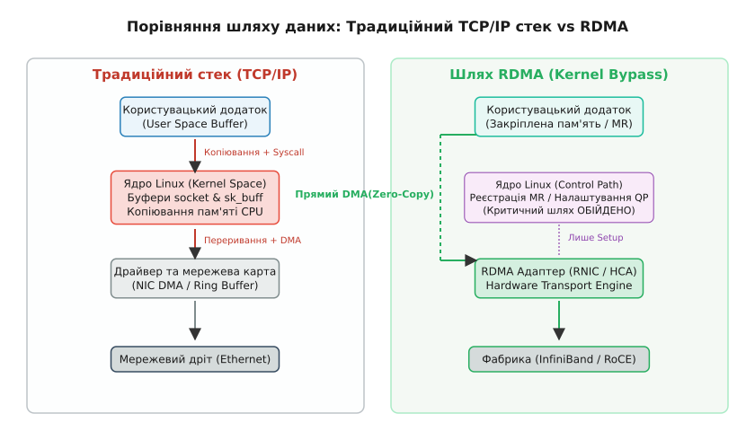
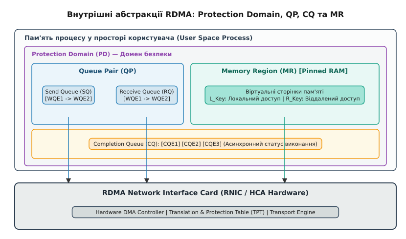

# RDMA: віддалений прямий доступ до пам'яті

<preknowlist>
- [Мережевий стек Linux](book:unix-linux/network-stack-architecture) — проходження пакета через драйвер, NAPI та буфери sk_buff.
- [Підсистема DMA та IOMMU](book:unix-linux/dma-mapping-subsystem-and-iommu) — трансляція віртуальних адрес у фізичні, закріплення сторінок та механізм DMA.
</preknowlist>

Коли швидкість фізичних ліній зв'язку у сучасних кластерах та центрах обробки даних зросла до 100, 200 та 400 Гбіт/с, традиційний мережевий стек операційної системи потрапив у бар'єр продуктивності. На швидкості 100 Гбіт/с мережева карта приймає близько 14.8 мільйона стандартних Ethernet-кадрів щосекунди (а при малих кадрах розміром 64 байти — до 148 мільйонів пакетів щосекунди). Якщо обробка кожного пакета вимагає генерування апаратного переривання, перемикання контексту процесора між режимами ядра та користувача (user/kernel context switch), а також послідовного копіювання байтів із системних буферів `sk_buff` у віртуальну пам'ять застосунку, центральний процесор витрачає понад 80% своїх обчислювальних тактів виключно на накладні витрати транспортного стека.

З точки зору архітектури оперативної пам'яті, передача потоку 100 Гбіт/с (це приблизно 12.5 ГБ/с) через традиційний стек із двома копіюваннями на приймальній і передавальній стороні генерує сумарний трафік на шині RAM обсягом до 50 ГБ/с. А на швидкості 400 Гбіт/с (50 ГБ/с прямого потоку) копіювання даних вимагало б 200 ГБ/с смуги оперативної пам'яті. У двоканальних або чотириканальних системах DDR4/DDR5 це повністю вичерпує доступний смуговий ресурс шини пам'яті лише на транзит мережевих даних, не залишаючи смуги для виконання корисних обчислень застосунку.

Віддалений прямий доступ до пам'яті (Remote Direct Memory Access, RDMA) фундаментально змінює цю модель. Замість використання операційної системи як посередника у передачі кожного пакета, RDMA дозволяє мережевим адаптерам двох віддалених вузлів обмінюватися даними безпосередньо між їхніми оперативними пам'ятями (RAM) за допомогою механізму DMA (Direct Memory Access). Після початкової фази налаштування з'єднання передача даних відбувається повністю в обхід ядра (Kernel Bypass) та без жодного проміжного копіювання в операційній системі (Zero-Copy).

---

## 1. Анатомія обмежень TCP/IP та два стовпи RDMA

Щоб зрозуміти, чому RDMA забезпечує мікросекундні затримки (latency) та нульове навантаження на CPU при передачі гігабайтних потоків даних, необхідно зіставити внутрішні механізми традиційного сокетного стека Linux та архітектури RDMA.

### Проблема традиційного стека: «Податок на ядро»

У класичній системі POSIX-сокетів при виклику `send()` або `recv()` процес здійснює системний виклик (system call). Шлях даних складається з кількох критичних ланок:
1. **Копіювання пам'яті (Memory Copies):** При відправці процесор копіює байти з буфера користувацького простору в системний буфер ядра. Під час прийому ядро виділяє структуру `struct sk_buff`, драйвер заповнює її через DMA, а потім CPU знову копіює вміст у буфер користувача при виклику `read()`. Це вичерпує пропускну здатність шини пам'яті (RAM Memory Bandwidth).
2. **Перемикання контексту (Context Switches):** Перехід процесора з Ring 3 (User Mode) у Ring 0 (Kernel Mode) і назад скидає кеш інструкцій та таблицю трансляції адрес (TLB flush), що створює затримку у кілька мікросекунд на кожен виклик.
3. **Обробка переривань та софт-ірків (Interrupts & SoftIRQs):** Надходження кадрів викликає апаратне переривання MSI-X, яке змушує ядро зупиняти поточні обчислювальні завдання та запускати підсистему NAPI для вигрібання пакетів із кільцевого буфера Rx.
4. **Програмний транспортний стек:** Обчислення контрольних сум (checksum validation), збирання сегментів TCP, підтримка вікон ковзання (sliding window) та контроль перевантажень виконуються програмно на центральному процесорі.

### Двоє стовпів RDMA: Kernel Bypass та Zero-Copy

RDMA усуває ці накладні витрати за допомогою двох ключових апаратних механізмів:

- **Zero-Copy (Нульове копіювання):** Програма заздалегідь реєструє власні буфери пам'яті в мережевому адаптері. Мережевий адаптер (HCA — Host Channel Adapter) зчитує дані прямо з RAM ініціатора за допомогою шини PCIe DMA і записує їх безпосередньо в RAM прийомопередавача, оминаючи системні буфери ОС.
- **Kernel Bypass (Обхід ядра):** Застосунок користувацького простору взаємодіє з мережевою картою напряму. Запити на передачу записуються безпосередньо в апаратні черги адаптера через відображені в пам'яті регістри (Memory-Mapped I/O, MMIO Doorbell registers). Під час передачі даних критичний шлях (Data Path) взагалі не містить системних викликів ядра Linux.


*Рис. 1. Порівняння шляху даних у традиційному мережевому стеку Linux та RDMA з обходом ядра (Kernel Bypass) та нульовим копіюванням (Zero-Copy).*

---

## 2. Фізичні фабрики та протоколи: InfiniBand, RoCE та iWARP

Семантика RDMA визначає набір абстракцій та команд програмування, які можуть бути реалізовані поверх різних фізичних та мережевих протоколів. На сьогодні в індустрії існує три основні стандарти реалізації RDMA.

### 2.1 InfiniBand (IB)

InfiniBand — це спеціалізована мережева архітектура, розроблена консорціумом IBTA з нуля для досягнення мінімально можливих затримок (субмікросекундні значення) та високої щільності пропускної здатності.

- **Стек:** Визначає власний фізичний шар (кабелі, QSFP-модулі), канальний шар та мережевий/транспортний шар.
- **Гарантія безвтратності (Lossless Fabric):** На канальному рівні InfiniBand використовує механізм керування потоком на основі кредитів (credit-based flow control). Приймач видає передавачу «кредити» на право відправки кадрів відповідно до наявності вільних буферів. Це повністю унеможливлює скидання пакетів через переповнення буферів комутаторів.
- **Недоліки:** Вимагає окремої інфраструктури спеціалізованих комутаторів InfiniBand (наприклад NVIDIA Quantum) та HCA-карт, що збільшує вартість розгортання.

### 2.2 RoCE (RDMA over Converged Ethernet)

Стандарт RoCE дозволяє виконувати транспортні протоколи RDMA поверх стандартної фізичної інфраструктури Ethernet. Докладніше про передумови конфлікту та історію створення цих стандартів — у [історичному огляді виникнення RDMA](book:unix-linux/rdma-in-linux/hist-rdma-origins.md).

Існує дві версії протоколу:
- **RoCE v1:** Кадр InfiniBand інкапсулюється безпосередньо у кадр Ethernet (Ethertype `0x8915`). Оскільки пакети не містять IP-заголовка, RoCE v1 не може маршрутизуватися і обмежений єдиним L2-доменом (одним VLAN).
- **RoCE v2 (Routable RoCE):** Заголовок InfiniBand Base Transport Header (BTH) обгортається у стандартні заголовки UDP (порт за замовчуванням 4791) та IP (IPv4/IPv6). Наявність IP-заголовка дозволяє пакетам RoCE v2 маршрутизуватися між різними підмережами через звичайні L3-комутатори дата-центрів, а використання UDP забезпечує рівномірне балансування трафіку за допомогою механізму ECMP.

```text
[ Стандартний Ethernet Header ] [ IP Header (v4/v6) ] [ UDP Header (Port 4791) ] [ IB BTH Header ] [ Payload ] [ ICRC ] [ FCS ]
```

**Вимога Lossless Ethernet та контроль перевантажень для RoCE v2:**
Оскільки транспортний рівень RDMA передбачає мережу без втрат, для RoCE v2 на Ethernet-комутаторах необхідно активувати розширення Data Center Bridging (DCB):
1. **PFC (Priority-based Flow Control, IEEE 802.1Qbb):** Забезпечує паузу передачі кадрів для окремого пріоритетного класу трафіку (наприклад CoS 3 або CoS 5) при заповненні буфера комутатора. Комутатор надсилає PAUSE-кадр, зупиняючи передавач. Для запобігання тупиковим ситуаціям (PFC Deadlock / Pause Storms) у ядрі Linux реалізовано механізм PFC Watchdog.
2. **ECN (Explicit Congestion Notification):** Дозволяє комутаторам маркувати пакети прапорцем CE (Congestion Encountered) у заголовку IP при виникненні заторів. Отримувач генерує спеціальний пакет сповіщення про перевантаження (CNP — Congestion Notification Packet), змушуючи апаратну карту джерела знизити швидкість передачі.

### 2.3 iWARP (Internet Wide Area RDMA Protocol)

На відміну від RoCE, який розміщує заголовки InfiniBand поверх UDP, iWARP вибудовує семантику RDMA поверх стандартного стека TCP/IP (протоколи RDMAP, DDP та MPA).

- **Переваги:** Завдяки використанню TCP протокол iWARP стійкий до втрат пакетів (lossy networks) і не вимагає спеціального налаштування PFC/ECN на комутаторах. Враховуючи прохідність TCP, iWARP може працювати у глобальних мережах (WAN).
- **Недоліки:** Складність апаратної реалізації обробки TCP у силіконі мережевої карти (RNIC) призводить до вищих затримок порівняно з RoCE v2 та InfiniBand.

---

## 3. Фундаментальні абстракції специфікації InfiniBand (IBA)

Програмування RDMA спирається на набір чітких об'єктів та абстракцій, визначених специфікацією InfiniBand Architecture (IBA). Ці об'єкти створюються у ядрі Linux під час ініціалізації, після чого програма користувача оперує ними напряму.


*Рис. 2. Архітектура абстракцій RDMA: Protection Domain (PD), Queue Pair (QP), Completion Queue (CQ) та Memory Region (MR).*

### 3.1 Protection Domain (PD)

Домен безпеки (Protection Domain) слугує контейнером ізоляції ресурсів. Він пов'язує між собою черги пар (Queue Pairs), зареєстровані регіони пам'яті (Memory Regions) та хендли адрес (Address Handles). Мережева карта дозволяє об'єкту QP звертатися лише до тих регіонів пам'яті, які належать до того самого Protection Domain. Це унеможливлює витік даних між незалежними процесами чи з'єднаннями.

### 3.2 Memory Region (MR) та закріплення пам'яті

Щоб апаратний адаптер міг виконувати DMA-транзакції у віртуальну пам'ять користувацького процесу, ця пам'ять повинна пройти процедуру **зареєстрування (Memory Registration)**.

Під час реєстрації MR відбуваються три операції:
1. **Page Pinning (Закріплення сторінок):** Ядро Linux закликає функцію `pin_user_pages()`, яка вимикає механізм вивантаження сторінок на диск (swap-out) та гарантує, що фізичні адреси цих сторінок не зміняться протягом всього життя MR.
2. **Побудова таблиці трансляції (TPT):** Драйвер будує таблицю відповідності віртуальних адрес процесу фізичним адресам RAM і завантажує її в апаратну пам'ять адаптера HCA (Translation and Protection Table).
3. **Генерація ключів:** Адаптер повертає програмі два ключі доступу:
   - **`L_Key` (Local Key):** Використовується локальним процесом у Work Request для підтвердження прав локального DMA-читання/запису.
   - **`R_Key` (Remote Key):** Передається віддаленому вузлу по мережі. Віддалений вузол вказує `R_Key` при односторонніх операціях RDMA Read/Write для підтвердження прав прямого доступу до цієї пам'яті.

### 3.3 Queue Pair (QP)

Замість традиційного дескриптора сокета RDMA використовує абстракцію **Queue Pair (Пара Черг)**. QP складається з двох черг:
- **Send Queue (SQ — Черга відправки):** Містить запити на виконання операцій (Work Requests), які ініціює локальний вузол (надсилання даних, читання/запис у віддалену пам'ять).
- **Receive Queue (RQ — Черга прийому):** Містить запити з вказівниками на локальні буфери, куди апаратура має покласти вхідні дані при використанні двосторонньої семантики (Send/Receive).

Типи з'єднань QP:
- **RC (Reliable Connection):** Гарантоване з'єднання точка-точка. Пакети доставляються послідовно та без втрат (апаратура надсилає ACK/NAK). Підтримує всі операції (Send, Receive, RDMA Read, RDMA Write, Atomics).
- **UC (Unreliable Connection):** З'єднання точка-точка без гарантії доставки та повторних спроб. Підтримує Send, Receive та RDMA Write.
- **UD (Unreliable Datagram):** Безконтекстний обмін датаграмами (аналог UDP). Один QP може відправляти пакети багатьом адресатам. Підтримує лише операцію Send/Receive; розмір пакета обмежений значенням MTU.

**Масштабування у великих кластерах (SRQ та XRC):**
При побудові кластерів на тисячі вузлів схема створення окремої черги прийому (RQ) для кожного з'єднання RC вимагає гігабайт пам'яті лише під апаратні буфери. Для вирішення цієї проблеми специфікація IBA ввела:
- **SRQ (Shared Receive Queue):** Спільна черга прийому, яка обслуговує одразу безліч різних QP на одному вузлі.
- **XRC (Extended Reliable Connected):** Розширений тип з'єднання, який дозволяє кільком процесам на одному сервері спільно використовувати єдине апаратне з'єднання QP до віддаленого вузла.

### 3.4 Completion Queue (CQ)

**Черга завершення (Completion Queue)** зберігає елементи завершення (Work Completions, `WC`). Коли HCA фінішує обробку запиту із Send Queue або Receive Queue, він записує в CQ структуру `ibv_wc`, яка містить статус виконання (`IBV_WC_SUCCESS` або код помилки), розмір переданих байтів та ідентифікатор запиту `wr_id`.

Програма може отримувати сповіщення про нові CQE двома шляхами:
- **Polling (Опитування у циклі):** Виклик `ibv_poll_cq()` зчитує елементи безпосередньо з пам'яті CQ. Це не вимагає системних викликів і забезпечує мінімальну затримку, але завантажує ядро CPU на 100%.
- **Event-driven (Повідомлення через переривання):** Програма засинає через `ibv_req_notify_cq()` та чекає на подію в каналі комплішна (`comp_channel`). Це звільняє CPU, але додає затримку на обробку переривання ядра.

---

## 4. Семантика операцій: Двосторонні (Two-Sided) vs Односторонні (One-Sided)

RDMA надає дві концептуально різні моделі передачі даних по мережі.

### 4.1 Двосторонні операції: Send / Receive

Ця модель нагадує обмін повідомленнями (messaging paradigm).

1. Цільовий вузол (Target) заздалегідь публікує запит прийому `ibv_post_recv()` у свою Receive Queue (RQ), вказуючи локальний буфер для збереження даних.
2. Вузол-ініціатор (Initiator) виконує `ibv_post_send()` з описом джерела даних.
3. Мережева карта ініціатора передає пакет, а карта приймача записує його вміст у перший доступний буфер із черги RQ і створює `WC` в існуючій CQ приймача.

**Особливість:** Процесор цільового вузла мусить брати участь у керуванні чергою прийому (постійно підкидати нові `Receive WR`) та обробляти події завершення.

### 4.2 Односторонні операції: RDMA Write та RDMA Read

Це класичний "Remote Direct Memory Access". Ініціатор здійснює маніпуляції з пам'яттю віддаленого вузла без жодної участі його програмованого потоку або CPU.

- **RDMA Write:** Ініціатор надсилає запит, вказуючи свій локальний буфер, а також віддалену віртуальну адресу (`remote_addr`) та ключ `R_Key`. HCA віддаленого вузла приймає пакети, перевіряє `R_Key` у своїй TPT-таблиці та здійснює прямий DMA-запис у RAM. Цільовий CPU не отримує жодних сповіщень і навіть не знає, що в його пам'ять були записані дані.
- **RDMA Write with Immediate (`IBV_WR_RDMA_WRITE_WITH_IMM`):** Варіант одностороннього запису, під час якого разом із даними передається 32-бітне число (Immediate Data). Ця операція генерує CQE у черзі прийому target-вузла, сповіщаючи його процесор про те, що нові дані прибули.
- **RDMA Read:** Ініціатор надсилає запит на читання віддаленої пам'яті. HCA цільового вузла апаратно зчитує дані з власної RAM через DMA та відсилає їх ініціатору.
- **Атомарні операції (Atomics):** Апаратна підтримка атомарних команд над 64-бітними словами у пам'яті віддаленого вузла:
  - `IBV_WR_ATOMIC_CMP_AND_SWP`: Compare-and-Swap.
  - `IBV_WR_ATOMIC_FETCH_AND_ADD`: Fetch-and-Add.

---

## 5. Архітектура підсистеми RDMA у ядрі Linux та `rdma-core`

Підсистема RDMA у ядрі Linux побудована за модульним принципом і тісно інтегрована з користувацькою бібліотекою `rdma-core`.

```text
┌────────────────────────────────────────────────────────────────────────┐
│                        USER SPACE (Застосунок)                         │
│                                                                        │
│   [ Високорівневі бібліотеки: librdmacm, UCX, NCCL, MPI, NVMe-oF ]      │
│                                  │                                     │
│   [ Низькорівневе API: libibverbs (ibv_post_send / ibv_poll_cq) ]      │
│                                  │ (Прямий MMIO / Kernel Bypass)       │
└──────────────────────────────────┼─────────────────────────────────────┘
                                   │
┌──────────────────────────────────┼─────────────────────────────────────┐
│                        KERNEL SPACE (Ядро Linux)                       │
│                                  ▼                                     │
│   [ Символьні пристрої: /dev/infiniband/uverbsX, /dev/infiniband/rdma_cm ]
│                                  │                                     │
│   [ Головний модуль ядра: ib_core (Управління MR, QP, GID, Netlink) ]   │
│                                  │                                     │
│   [ Драйвери обладнання: mlx5_ib, iw_cxgb4, irdma, rdma_rxe (Soft-RoCE)]│
└──────────────────────────────────┼─────────────────────────────────────┘
                                   │ (PCIe Bus / DMA Engine)             │
┌──────────────────────────────────▼─────────────────────────────────────┐
│                          HARDWARE / FABRIC                             │
│       [ RDMA Network Interface Card (RNIC / Mellanox ConnectX HCA) ]   │
└────────────────────────────────────────────────────────────────────────┘
```

Повний системний довідник структур, функцій API та прапорців доступу наведено у [довіднику libibverbs та librdmacm](book:unix-linux/rdma-in-linux/api-ibverbs.md).

### Двофазний розділ обов'язків

1. **Фаза керування (Control Path — через ядро):** Створення Protection Domain, виділення Queue Pairs та реєстрація Memory Region вимагають перевірки привілеїв, виділення фізичних сторінок пам'яті та взаємодії з PCI-пристроєм. Ці операції виконуються через системні виклики до символьних пристроїв `/dev/infiniband/uverbsN`.
   Модуль `ib_uverbs` обробляє команди користувача через файл `drivers/infiniband/core/uverbs_cmd.c`, де системні виклики `write()` та `ioctl()` транслюються у внутрішні виклики відповідних драйверів обладнання (наприклад `mlx5_ib_alloc_pd` або `mlx5_ib_reg_mr`).
2. **Фаза передачі даних (Data Path — Kernel Bypass):** Після того як об'єкти створені, `libibverbs` відображає (за допомогою `mmap()`) регістри дверного дзвінка (Doorbell Registers) HCA безпосередньо у віртуальний простір процесів. Виклики `ibv_post_send()` та `ibv_poll_cq()` виконують прямий 64-бітний запис у ці регістри (MMIO write), сповіщаючи мікроконтролер HCA про нові елементи WQE у RAM без залучення системних викликів ядра.

### Простеження підсистеми через `sysfs` та `tracepoints`

Ядро Linux експонує детальний стан підсистеми RDMA через файлову систему `sysfs`:
- `/sys/class/infiniband/`: Перелік усіх активних адаптерів RDMA у системі.
- `/sys/class/infiniband/mlx5_0/ports/1/counters/`: Лічильники лінка (передані байти, пакети, збої CRC).
- `/sys/class/infiniband/mlx5_0/ports/1/hw_counters/`: Апаратні лічильники RoCE v2 (кількість отриманих CNP-пакетів, скидання через PFC).

Для глибокого налагодження ядра Linux містить вбудовані точки трасування `tracepoints`:
```bash
# Трасування подій створення з'єднань RDMA CM
sudo trace-cmd record -e rdma_cm:rdma_create_id -e rdma_cm:rdma_bind_addr

# Перегляд подій у реальному часі за допомогою bpftrace
sudo bpftrace -e 'tracepoint:ib_core:ib_poll_cq { @[args->status]++; }'
```

---

## 6. Конфігурація та діагностика RDMA в Linux

У сучасних диструбутивах Linux адміністрування підсистеми RDMA здійснюється за допомогою інструментів із пакета `iproute2` та спеціалізованого набору `perftest`.

### Керування через утиліту `rdma`

Перегляд наявних пристроїв RDMA та стану їх портів:
```bash
# Перелік усіх апаратних та програмних адаптерів RDMA
rdma dev show

# Детальна інформація про фізичні порти, стан лінка та тип (InfiniBand / RoCEv2)
rdma link show

# Перегляд зареєстрованих Memory Regions та активних QP у системі
rdma resource show qp
```

### Налаштування програмного емулятора Soft-RoCE (`rdma_rxe`)

Для розробки та налагодження RDMA-застосунків на комп'ютерах без спеціалізованих мережевих карт Linux надає драйвер `rdma_rxe` (Soft-RoCE), який емулює семантику RoCE v2 поверх будь-якого звичайного Ethernet-інтерфейсу (наприклад, `eth0` або `veth` тунелю):

```bash
# Завантаження модуля ядра
sudo modprobe rdma_rxe

# Прив'язка віртуального пристрою rxe0 до фізичного мережевого інтерфейсу eth0
sudo rdma link add rxe0 type rxe netdev eth0

# Перевірка створення пристрою
rdma dev show rxe0
```

### Вимірювання продуктивності за допомогою `perftest`

Пакет `perftest` є індустріальним стандартом для перевірки корректності роботи RDMA та вимірювання затримок:
- `ib_write_lat` / `ib_write_bw`: Вимірювання затримки та пропускної здатності для одностороннього **RDMA Write**.
- `ib_read_lat` / `ib_read_bw`: Вимірювання затримки та пропускної здатності для **RDMA Read**.
- `ib_send_lat` / `ib_send_bw`: Вимірювання затримки для двостороннього **Send/Receive**.

**Приклад вимірювання затримки RDMA Write між двома вузлами:**

На сервері (IP `192.168.1.10`):
```bash
ib_write_lat -d mlx5_0 --iters=100000
```

На клієнті:
```bash
ib_write_lat -d mlx5_0 --iters=100000 192.168.1.10
```

У правильній конфігурації апаратного RoCE v2 на адаптерах 100 Gbps (наприклад NVIDIA ConnectX-6) затримка передачі за один кінець (half-round trip latency) становить близько **1.1 – 1.8 мікросекунди**.

---

## 7. Сфера застосування: Від NVMe-oF до AI-кластерів

Завдяки мікросекундним затримкам та нульовому навантаженню на CPU технологія RDMA стала фундаментом сучасних розподілених систем. Готовий до збірки та запуску приклад коду з обробкою помилок і підтримкою RAII на C++ розміщено у [практичному проєкті RDMA Ping-Pong](book:unix-linux/rdma-in-linux/proj-rdma-pingpong.md).

1. **NVMe-oF (NVMe over Fabrics):** Протокол доступу до віддалених SSD-накопичувачів по мережі. Драйвер ядра `nvme-rdma` використовує транспортування RDMA для передачі команд NVMe безпосередньо з пам'яті сховища у RAM ініціатора. Віддалений диск монтується у Linux із затримками, майже тотожними локальному підключенню по шині PCIe (~10-15 мікросекунд доданої затримки).
2. **Розподілене навчання AI (GPUDirect RDMA & NCCL):** Фреймворки PyTorch та TensorFlow виконують синхронізацію мільярдів параметрів нейромереж через бібліотеку NCCL. Механізм GPUDirect RDMA дозволяє мережевій карті читати байти безпосередньо з пам'яті відеокарти (GPU HBM) через PCIe Peer-to-Peer і передавати їх по RoCE v2 на сусідній сервер, оминаючи як CPU, так і системну оперативну пам'ять (RAM).
3. **SMB Direct (Microsoft Enterprise Storage):** Протокол доступу до файлових серверів, який автоматично виявляє наявність адаптерів RDMA і переводить обмін файлами у режим Zero-Copy Write/Read.
4. **Високочастотний трейдинг (HFT):** Торгові платформи використовують `libibverbs` на C/C++ для обробки біржових заявок із субмікросекундним відгуком.
