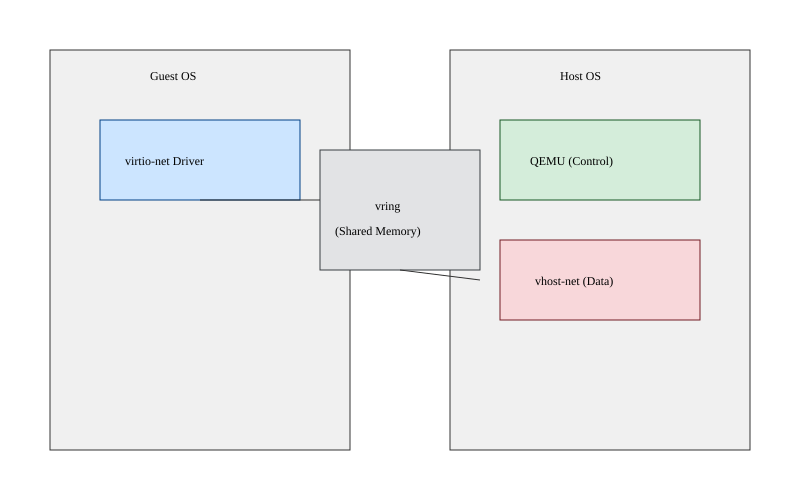

# Прискорення мережі у віртуалізації: Глибоке занурення у vhost-net та vhost-user

<preknowlist>
- [Концепції ядра Linux](book:unix-linux/kernel-and-userspace) — базові поняття системних викликів та VFS.
</preknowlist>

Віртуалізація мережі є одним із найскладніших компонентів у сучасних хмарних інфраструктурах. Для забезпечення максимальної продуктивності та мінімізації затримок інженери розробили низку технологій, що еволюціонували від повної емуляції апаратного забезпечення до параавіртуалізованих драйверів, а згодом — до винесення обробки пакетів у простір ядра та спеціалізовані user-space додатки. У цій статті ми детально розглянемо архітектуру `vhost-net`, її взаємодію з `virtio`, а також еволюцію до `vhost-user` із використанням DPDK (Data Plane Development Kit).

## 1. Проблема традиційної емуляції та поява virtio

У ранніх системах віртуалізації (наприклад, старі версії QEMU без KVM) віртуальна машина «бачила» емульовану мережеву карту, таку як Realtek RTL8139 або Intel E1000. Щоразу, коли гостьова операційна система (Guest OS) хотіла відправити мережевий пакет, вона виконувала запис у пам'ять або порти вводу-виводу (MMIO/PIO), що викликало апаратне переривання. Гіпервізор (Host OS) перехоплював цей запит, перемикав контекст із гостьової ОС у гіпервізор, аналізував регістри емульованої карти, витягував пакет і відправляв його у фізичну мережу.

Цей процес був надзвичайно повільним. Перемикання контексту (VM Exit) є дорогою операцією. Для високошвидкісних мереж (10 Gbps і більше) повна емуляція стала "вузьким місцем".

Щоб вирішити цю проблему, був створений стандарт **virtio**. Це параавіртуалізований інтерфейс, який свідомо порушує ілюзію повного апаратного забезпечення. Гостьова ОС "знає", що вона працює у віртуальному середовищі, і використовує спеціальний драйвер (`virtio-net`), який взаємодіє з бекендом (`virtio` backend) на хості через спільну пам'ять (shared memory).

### Будова virtio: vring (Ring Buffers)
Основою `virtio` є віртуальні кільця, або **vrings**. Це структури даних у спільній пам'яті, які дозволяють гостю та хосту обмінюватися вказівниками на буфери даних без необхідності копіювати самі дані (zero-copy). 
- **Available Ring:** Гість розміщує сюди дескриптори буферів, які готові для обробки хостом (наприклад, пакети для відправки).
- **Used Ring:** Хост розміщує сюди дескриптори буферів, які він уже обробив, щоб гість міг звільнити пам'ять або використати її повторно.

Незважаючи на ефективність vring, у класичній моделі QEMU бекенд `virtio-net` працював у просторі користувача (user-space) QEMU.

## 2. Обмеження virtio-net у просторі користувача (QEMU)

Коли QEMU обробляє мережеві пакети для `virtio-net`, архітектура виглядає так:

1. Гостьова ОС формує пакет, кладе його у vring і надсилає повідомлення гіпервізору (через спеціальний гіпервиклик, наприклад, запис у MMIO регістр `virtio`, що викликає `KVM_EXIT`).
2. Ядро хоста (KVM) перехоплює подію і сигналізує процесу QEMU (через `eventfd`), що гість готовий відправити дані.
3. Потік QEMU прокидається, читає vring, копіює пакет із гостьової пам'яті і передає його ядру хоста через системний виклик (наприклад, запис у TAP інтерфейс `write()`).
4. Ядро хоста обробляє пакет у мережевому стеку (bridge, iptables тощо) і відправляє його через фізичну мережеву карту.

**Проблема:** Цей шлях вимагає безлічі перемикань контексту:
- З гостьового простору (Guest User) до гостьового ядра (Guest Kernel).
- З гостьового ядра до ядра хоста (Host Kernel - KVM).
- З ядра хоста до простору користувача хоста (QEMU).
- З QEMU знову до ядра хоста (через TAP інтерфейс).

Кожне перемикання додає затримки та споживає процесорний час, що обмежує пропускну здатність мережі.

## 3. Архітектура vhost-net: In-kernel virtio backend

Щоб уникнути перемикань контексту між простором користувача та ядром на хості (кроки QEMU <-> Host Kernel), інженери розробили **vhost-net**.

`vhost-net` — це модуль ядра Linux, який бере на себе роль `virtio` бекенда (Data Plane), тоді як QEMU продовжує виконувати роль менеджера пристроїв (Control Plane).



### Як працює vhost-net?
Коли ви запускаєте віртуальну машину з увімкненим `vhost-net`, процес ініціалізації виглядає так:

1. **Control Plane (QEMU):** QEMU налаштовує віртуальну машину, створює пристрій `virtio-net` для гостя та відкриває файл `/dev/vhost-net`.
2. QEMU через `ioctl()` повідомляє модулю ядра `vhost-net` про конфігурацію vring, мапу гостьової фізичної пам'яті та файлові дескриптори.
3. QEMU налаштовує **ioeventfd** та **irqfd** — спеціальні механізми KVM, які дозволяють передавати події безпосередньо між KVM та іншим модулем ядра (`vhost-net`) в обхід простору користувача (QEMU).
4. **Data Plane (vhost-net):** У ядрі хоста створюється спеціальний потік (`vhost-$PID`, або vhost kernel thread). Цей потік має прямий доступ до гостьової пам'яті (через надану мапу пам'яті) і безпосередньо обмінюється даними з TAP інтерфейсом.

### Життєвий цикл пакету (Tx - Transmit)
Розглянемо процес відправки пакету з `vhost-net`:
1. Гість (virtio-net драйвер) записує пакет у vring і робить запис у регістр `kick`.
2. KVM перехоплює запис і сигналізує `ioeventfd`.
3. Потік ядра `vhost-net` отримує сигнал через `ioeventfd`, читає дескриптор із vring (прямо з гостьової пам'яті) і безпосередньо передає пакет у мережевий стек хоста (до TAP інтерфейсу) без виклику QEMU.
4. Після успішної відправки `vhost-net` сигналізує гостю про завершення (через `irqfd`), викликаючи переривання в гостьовій ОС.

Ця архітектура усуває необхідність "будити" QEMU для кожного пакету, що значно знижує затримки та підвищує пропускну здатність. Пропускна здатність мережі зазвичай подвоюється порівняно з класичним `virtio-net` у просторі користувача.

## 4. Глибоке занурення: ioeventfd, irqfd та Zero-Copy

Ефективність `vhost-net` значною мірою спирається на технології `eventfd`. 
- **eventfd** — це легковажний механізм міжпроцесної комунікації в Linux, який працює як лічильник на основі файлового дескриптора. 
- **ioeventfd** — розширення KVM. Воно пов'язує певну адресу гостьової пам'яті (MMIO або PIO) з `eventfd`. Коли гість записує за цією адресою, KVM не перемикається в QEMU, а сигналізує `eventfd`. `vhost-net` якраз слухає цей `eventfd`.
- **irqfd** — механізм для ін'єкції віртуальних переривань. `vhost-net` сигналізує `eventfd`, а KVM автоматично транслює це у віртуальне переривання для гостя (MSI-X).

### Zero-copy в vhost-net
У пізніших версіях ядра Linux до `vhost-net` була додана підтримка **zero-copy transmit**. Це означає, що коли гість відправляє пакет, `vhost-net` не копіює дані пакета з гостьової пам'яті в структуру `sk_buff` ядра хоста. Замість цього `sk_buff` просто містить вказівники на сторінки гостьової фізичної пам'яті. Це досягається за допомогою `get_user_pages()`.

Дані копіюються лише апаратним забезпеченням (DMA контролером фізичної мережевої карти) безпосередньо з пам'яті гостя, що суттєво розвантажує процесор хоста.

## 5. Еволюція та обхід ядра: vhost-user та DPDK

Хоча `vhost-net` був величезним стрибком уперед, у високопродуктивних середовищах (наприклад, NFV - Network Function Virtualization, або 5G ядра) мережевий стек ядра Linux все ще був вузьким місцем. Роутинг, фільтрація (iptables) та обробка `sk_buff` у ядрі хоста не могли впоратися з потоком дрібних пакетів на швидкості 10, 40 або 100 Gbps.

Тоді з'явився **DPDK (Data Plane Development Kit)** — набір бібліотек, що дозволяють додаткам у просторі користувача безпосередньо працювати з мережевими картами (обхід ядра, kernel bypass), постійно опитуючи черги (polling) замість використання переривань.

Щоб віртуальні машини могли ефективно спілкуватися з віртуальними комутаторами на базі DPDK (такими як **Open vSwitch (OVS) з DPDK**), був розроблений протокол **vhost-user**.

### Як працює vhost-user
`vhost-user` реалізує ту саму концепцію розподілу обов'язків, що й `vhost-net`, але виносить Data Plane не в ядро Linux, а в інший процес у просторі користувача (наприклад, процес OVS-DPDK).

1. **Control Plane:** QEMU та OVS-DPDK з'єднуються через UNIX domain socket.
2. QEMU відправляє повідомлення `vhost-user` через цей сокет. Ці повідомлення містять конфігурацію vring та файлові дескриптори спільної пам'яті. 
3. **Shared Memory:** Гостьова пам'ять мапиться у пам'ять процесу OVS-DPDK.
4. **Data Plane:** OVS-DPDK використовує драйвер опитування (Poll Mode Driver - PMD). Він постійно сканує vring віртуальної машини.
5. Коли гість кладе пакет у vring, процес OVS-DPDK (без переривань і контекстних перемикань) відразу читає його з пам'яті і пересилає на фізичну карту через DPDK PMD.

Завдяки vhost-user та DPDK вдалося досягти пропускної здатності в десятки мільйонів пакетів на секунду (Mpps) для однієї віртуальної машини, повністю оминаючи мережевий стек ядра Linux.

## 6. Налаштування та конфігурація

Для використання `vhost-net` зазвичай потрібно мінімум дій, оскільки в сучасних дистрибутивах Linux і QEMU/libvirt він увімкнений за замовчуванням. Однак корисно знати, як його налаштувати явно.

### Перевірка підтримки vhost-net
Переконайтеся, що модуль ядра завантажено:
```bash
lsmod | grep vhost_net
```
Якщо ні, завантажте його:
```bash
modprobe vhost_net
```

### Конфігурація в libvirt (XML)
У конфігурації віртуальної машини (через `virsh edit`) секція інтерфейсу повинна виглядати приблизно так:
```xml
<interface type='network'>
  <mac address='52:54:00:a1:b2:c3'/>
  <source network='default'/>
  <model type='virtio'/>
  <!-- Вказуємо vhost як backend -->
  <driver name='vhost' txmode='iothread' ioeventfd='on'/>
</interface>
```
Параметри `driver name='vhost'` гарантує використання `/dev/vhost-net`.

### QEMU Command Line
Якщо ви запускаєте QEMU вручну, параметри виглядають так:
```bash
qemu-system-x86_64 \
  -netdev tap,id=net0,vhost=on \
  -device virtio-net-pci,netdev=net0,mac=52:54:00:12:34:56 \
  ...
```
Параметр `vhost=on` вказує QEMU відкрити `/dev/vhost-net` та налаштувати in-kernel бекенд.

### Конфігурація vhost-user (з Open vSwitch DPDK)
Для `vhost-user` конфігурація QEMU стає складнішою. Спочатку в OVS створюється порт `dpdkvhostuser`:
```bash
ovs-vsctl add-port br0 vhost-user1 -- set Interface vhost-user1 type=dpdkvhostuserclient options:vhost-server-path=/var/run/openvswitch/vhost-user1
```
А потім QEMU підключається до цього сокета, вказуючи, що пам'ять ВМ повинна бути спільною (shared):
```bash
qemu-system-x86_64 \
  -m 2048 -object memory-backend-file,id=mem,size=2048M,mem-path=/dev/hugepages,share=on -numa node,memdev=mem \
  -chardev socket,id=char0,path=/var/run/openvswitch/vhost-user1 \
  -netdev vhost-user,id=net0,chardev=char0,vhostforce=on \
  -device virtio-net-pci,netdev=net0,mac=52:54:00:11:22:33 \
  ...
```

## Висновок
Розвиток від емульованих пристроїв до `virtio-net`, потім до `vhost-net` у ядрі, і, зрештою, до `vhost-user` у просторі користувача, ілюструє постійну боротьбу інженерів за продуктивність віртуальних мереж. Сьогодні `vhost-net` є стандартом де-факто для звичайних серверів і робочих станцій, пропонуючи відмінний баланс між продуктивністю та простотою налаштування. У той же час, для телекомунікаційних хмар, дата-центрів і високочастотного трейдингу використовується `vhost-user` з DPDK, що розкриває справжній потенціал мережевих адаптерів без втручання повільного ядра операційної системи.
