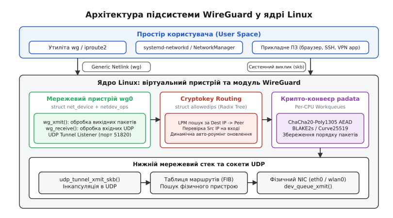
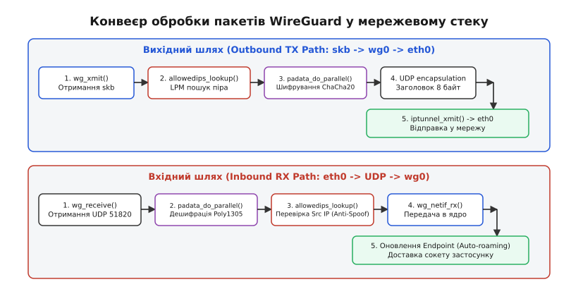
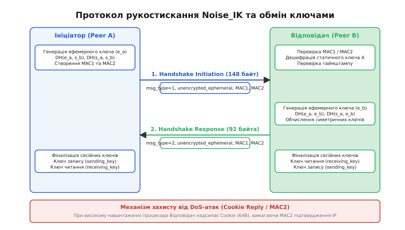

# Ядерний тунель WireGuard

<preknowlist>
- [Протокол Netlink](book:unix-linux/netlink-protocol) — міжпроцесна взаємодія між простором користувача та підсистемами ядра Linux для налаштування мережевих інтерфейсів.
- [Прийняття рішень про маршрутизацію](book:unix-linux/routing-decision) — проходження sk_buff через FIB, перевірка таблиць маршрутизації та вибір вихідного мережевого пристрою.
- [IPsec XFRM в ядрі Linux](book:unix-linux/ipsec-xfrm) — традиційна модель інкапсуляції, політик безпеки (SP) та асоціацій (SA) для порівняння з WireGuard.
- [Віртуальні інтерфейси TUN/TAP](book:unix-linux/tun-tap) — механізм передачі мережевих пакетів між простором ядра та демонами простору користувача.
</preknowlist>

Коли зашифрований тунельний трафік проходитиме крізь мережевий стек операційної системи на швидкості 10 Гбіт/с, традиційні VPN-архітектури вичерпують обчислювальний ресурс процесора не через складність самих криптографічних алгоритмів, а через витрати на перемикання контексту й синхронізацію станів між ядром та простором користувача. Передача кожного мережевого пакета через символьний пристрій `/dev/net/tun` вимагає копіювання буферів сокетів `sk_buff` крізь межу ядра, перепланування потоків виконання та скидання кешів інструкцій процесора. Навіть традиційний IPsec, інтегрований у ядро Linux через підсистему XFRM, вимушений звертатися до демонів обміну ключами в просторі користувача за допомогою складних механізмів асинхронних сповіщень Netlink, тримаючи в пам'яті тисячі динамічних політик (SPD) та асоціацій безпеки (SAD).

WireGuard усуває цей системний оверхед шляхом повної переносності тунельного пристрою у простір ядра Linux (`kernel space`) у вигляді віртуального мережевого адаптера `net_device`. Він замінює зовнішні демони керування ключами внутрішнім автоматом станів на основі протоколу Noise IK, а складну дворинкову маршрутизацію — прямою прив'язкою публічних криптографічних ключів до IP-адрес через префіксні дерева.

За детальнішим хронологічним розбором еволюції від складних 100-тисячних баз коду IPsec до мінімалістичного тунелю зверніться до статті про [історію розробки WireGuard](book:unix-linux/wireguard-kernel-architecture/hist-wireguard-genesis.md), де описано архітектурні рішення автора протоколу та оцінку Лінуса Торвальдса.


*Взаємодія віртуального пристрою wg0, таблиці Cryptokey Routing, криптографічного конвеєра padata та UDP-сокета ядра.*

---

## 1. Віртуальний пристрій `net_device` та інтеграція в мережевий стек

З точки зору ядра Linux тунельний інтерфейс WireGuard (за замовчуванням `wg0`) є повноцінним мережевим пристроєм, який описується базовою структурою `struct net_device`. Проте, на відміну від драйверів фізичних мережевих карт (наприклад, `e1000e` чи `ixgbe`), які взаємодіють з апаратними кільцевими буферами DMA, WireGuard є програмним адаптером інкапсуляції.

При створенні інтерфейсу команда `ip link add dev wg0 type wireguard` ініціалізує екземпляр структури `struct wg_device`. Усередині цієї структури реєструється вектор операцій `struct netdev_ops`, головним входом якого є функція відправки пакетів `wg_xmit()`.

```c
static const struct netdev_ops wg_netdev_ops = {
    .ndo_init           = wg_netdev_init,
    .ndo_uninit         = wg_netdev_uninit,
    .ndo_start_xmit     = wg_xmit,
    .ndo_get_stats64    = wg_get_stats64,
    .ndo_has_offload_stats = wg_has_offload_stats,
};
```

### 1.1. Виділення пам'яті та ініціалізація `alloc_netdev()`

Виділення пам'яті під екземпляр пристрою виконується викликом ядра `alloc_netdev()` з приватним розміром структури `sizeof(struct wg_device)`:

```c
struct net_device *dev = alloc_netdev(sizeof(struct wg_device), "wg%d", NET_NAME_UNKNOWN, wg_setup);
```

Функція `wg_setup()` встановлює базові властивості пристрою:
- `dev->tye = ARPHRD_NONE` — пристрій працює без L2-кадрів Ethernet (point-to-point IP тунель).
- `dev->flags = IFF_POINTOPOINT | IFF_NOARP` — відключення протоколу резолюції адрес ARP.
- `dev->features |= NETIF_F_HW_CSUM | NETIF_F_RXCSUM` — підтримка апаратного розрахунку контрольних сум.

### 1.2. Розрахунок MTU та запасу заголовків (Headroom)

Коли підсистема маршрутизації спрямовує пакет `sk_buff` у пристрій `wg0`, WireGuard повинен заздалегідь гарантувати, що у буфері пакета є достатньо вільного місця перед початком даних (`skb_headroom`) для додавання нових заголовків:
- Заголовок IPv4 (20 байт) або IPv6 (40 байт).
- Заголовок UDP (8 байт).
- Заголовок пакета WireGuard (16 байт для транспортного пакета даних або 28–60 байт для повідомлень рукостискання).
- Аутентифікаційний тег Poly1305 (16 байт наприкінці пакета).

Розрахунок додаткового заголовкового оверхеду виконується за схемою:

```
Header_Overhead_IPv4
= 20 + 8 + 16 + 16    [IPv4 (20B) + UDP (8B) + WireGuard (16B) + Poly1305 (16B)]
= 60 байт             [загальний оверхед для IPv4]

Header_Overhead_IPv6
= 40 + 8 + 16 + 16    [IPv6 (40B) + UDP (8B) + WireGuard (16B) + Poly1305 (16B)]
= 80 байт             [загальний оверхед для IPv6]
```

Тому за замовчуванням максимальний розмір блоку передачі (MTU — від англ. *Maximum Transmission Unit*) для інтерфейсу WireGuard встановлюється у значення:

```
MTU_wg0
= MTU_physical - Header_Overhead
= 1500 - 60
= 1440 байт           [ефективне MTU для IPv4 тунелю]
```

Якщо вихідний пакет перевищує цей розмір, ядро фрагментує його ще до потрапляння в `wg_xmit()` на рівні IP-стеку, запобігаючи виконанню повторної фрагментації зашифрованих дейтаграм. Для запобігання проблемам із фрагментацією у стеку TCP застосовується автоматична підгонка розміру максимального сегмента (MSS Clamping — від англ. *Maximum Segment Size Clamping*), яка коригує поле MSS у заголовках TCP SYN під час встановлення з'єднання.

### 1.3. Прив'язка до сокетів ядра та запобігання рекурсії

При активації пристрою WireGuard викликом `ip link set dev wg0 up` модуль ядра створює власні сокети UDP у просторі ядра через внутрішньоядерний API `udp_tunnel_sock_create()`. Ці сокети зв'язуються з локальним портом (за замовчуванням UDP 51820) для сімейств `AF_INET` та `AF_INET6`.

При створенні сокета реєструється зворотний виклик `udp_tunnel_sock_cfg`:

```c
struct udp_tunnel_sock_cfg cfg = {
    .sk_user_data = wg,
    .encap_type = 1,
    .encap_rcv = wg_receive,
};
```

Функція `wg_receive()` реєструється безпосередньо у сокетному обробнику UDP ядра, завдяки чому вхідні тунельні пакети обробляються прямо у контексті переривання мережевої карти без перемикання на прикладні сокети простору користувача.

Для уникнення нескінченної рекурсії (коли зашифрований пакет, відправлений WireGuard через UDP-сокет, знову маршрутизується у той самий пристрій `wg0`), WireGuard позначає згенеровані сокети спеціальними прапорцями сокетів ядра `sk_allocation` та встановлює мітку `fwmark` для оминання тунельних таблиць у FIB (від англ. *Forwarding Information Base*).

---

## 2. Cryptokey Routing (Криптографічна маршрутизація)

Фундаментальною архітектурною концепцією WireGuard є Cryptokey Routing (криптографічна маршрутизація від англ. *cryptographic key routing*). У класичних VPN-протоколах існує чіткий розрив між IP-маршрутизацією та криптографічними ключами: маршрутизатор обирає інтерфейс, а шифратор шукає правила у таблиці політик. У WireGuard публічний ключ вузла безпосередньо слугує мережевою адресою у внутрішній таблиці підмереж.


*Шлях вихідного (TX) та вхідного (RX) пакетів sk_buff крізь перевірки AllowedIPs, черги padata та сокет UDP.*

### 2.1. Префіксні дерева Radix Trie (`struct allowedips`)

Кожен пристрій `struct wg_device` містить таблицю `allowedips`, яка складається з двох бінарних дерев Radix Tree (від лат. *radix* — корінь) для IPv4 та IPv6:

```c
struct allowedips_node {
    struct wg_peer __rcu *peer;
    struct allowedips_node __rcu *bit[2];
    u8 cidr;
    u8 bit_at;
    u8 ip[16];
};
```

Дерево організоване так, що кожен внутрішній вузол перевіряє конкретний біт IP-адреси, починаючи з найстаршого біта (MSB — від англ. *Most Significant Bit*). Напрямок спуску вибирається за значенням біта: `0` відповідає лівій гілці `bit[0]`, `1` — правій гілці `bit[1]`.

Пошук здійснюється за алгоритмом найдовшого співпадіння префікса (LPM — від англ. *Longest Prefix Match*). Для IPv4 спусковий шлях обмежений масимально 32 ітераціями, для IPv6 — 128 ітераціями. Завдяки використанню списків змагання читання-оновлення (RCU — від англ. *Read-Copy Update*) пошук піра в таблиці `allowedips` під час передачі пакетів виконується без блокувань (lock-free), що забезпечує лінійне масштабування на багатоядерних системах.

### 2.2. Покрокова обробка вихідного трафіку у `wg_xmit()`

Повний алгоритм обробки пакета у функції `wg_xmit()` містить наступні етапи:

1. **Перевірка заголовка IP:** Ядро зчитує версію IP з першого півбайта пакета (`skb->data`).
2. **Пошук піра в Radix Tree:** Адреса призначення (`daddr`) передається у `allowedips_lookup_dst()`. Якщо адреса не належить жодному піру, пакет скидається: `kfree_skb(skb)`.
3. **Перевірка наявності активної сесії:** Ядро перевіряє стан `peer->keypairs`. Якщо сесійний ключ застарів або відсутній, пакет додається у чергу очікування рукостискання, і WireGuard надсилає пакет `Handshake Initiation`.
4. **Перевірка headroom:** Якщо `skb_headroom(skb)` є меншим за 60 байт, ядро реалокує буфер через `pskb_expand_head()`.
5. **Паралельне шифрування:** Пакет передається у криптографічний конвеєр `padata_do_parallel()`.

### 2.3. Механізм вхідної перевірки (Ingress Anti-Spoofing)

Коли на UDP-порт ядра приходить зашифрований пакет, WireGuard дешифрує його за допомогою симетричного ключа сесії. Оскільки сесійний ключ прив'язаний до конкретного статичного публічного ключа, ядро достеменно знає, від якого піра `struct wg_peer` надійшов пакет.

Після дешифрації WireGuard витягує розшифровану IP-адресу джерела (`ip_hdr(skb)->saddr`) і знову виконує пошук у префіксному дереві `allowedips`:

```
Decrypted skb -> ip_hdr(skb)->saddr
    ↓
allowedips_lookup_src(&wg->allowedips, skb)
    ↓
struct wg_peer *authed_peer
    ↓
Перевірка: (authed_peer == decrypting_peer) ? OK : DROP
```

Якщо пір, повернутий таблицею `allowedips`, не збігається з піром, чиїм ключем було розшифровано пакет, цей пакет **негайно відкидається**. Це повністю виключає можливість IP-спуфінгу (spoofing) всередині тунелю: жоден вузол не може надіслати пакет з чужою IP-адресою, навіть якщо він володіє дійсними ключами шифрування для своєї власної адреси.

### 2.4. Автоматичний роумінг кінцевих точок (Endpoint Auto-Roaming)

Якщо розшифрований вхідний пакет успішно пройшов перевірку Ingress Anti-Spoofing, WireGuard перевіряє зовнішню IP-адресу та UDP-порт відправника у заголовку UDP-пакета.

Якщо зовнішня адреса піра змінилася (наприклад, мобільний клієнт переключився з Wi-Fi на 5G-мережу), WireGuard атомарно оновлює поле `peer->endpoint` новою адресою та портом. Наступні вихідні пакети до цього піра негайно надсилатимуться на нову адресу без переривання сесії та без потреби повторного виконання рукостискання.

---

## 3. Паралельний криптографічний конвеєр `padata`

Шифрування за допомогою ChaCha20-Poly1305 вимагає виконання обчислень над кожним байтом корисного навантаження. На процесорі з 64 ядрами послідовна обробка пакетів в одном потоці перервала б масштабованість тунелю на рівні 1.5–2 Гбіт/с. Для вирішення цієї проблеми WireGuard використовує підсистему ядра `padata` (від англ. *parallel execution engine*).

```
[Вихідні sk_buff]
       │
       ▼
 ┌───────────┐     ┌─────────────────────────────────────────┐
 ├─ CPU 0 ───┼────►│ Parallel Queue: ChaCha20-Poly1305 (CPU0)│
 ├─ CPU 1 ───┼────►│ Parallel Queue: ChaCha20-Poly1305 (CPU1)│
 ├─ CPU 2 ───┼────►│ Parallel Queue: ChaCha20-Poly1305 (CPU2)│
 ├─ CPU 3 ───┼────►│ Parallel Queue: ChaCha20-Poly1305 (CPU3)│
 └───────────┘     └────────────────────┬────────────────────┘
                                        │
                                        ▼
                   ┌─────────────────────────────────────────┐
                   │ Serial Queue (Reorder): Порядок пакетів │
                   └────────────────────┬────────────────────┘
                                        │
                                        ▼
                         [Відправка в UDP-сокет]
```

### 3.1. Структура паралельних черг (`struct crypt_queue`)

Кожен пристрій `struct wg_device` ініціалізує дві черги: `encrypt_queue` та `decrypt_queue`. Черга описується внутрішньою структурою:

```c
struct crypt_queue {
    struct padata_instance *padata;
    struct crypt_queue_page *pages;
    atomic_t inflight;
    unsigned int max_cnt;
};
```

Коли пакет потрапляє у `wg_xmit()`, йому призначається послідовний 64-бітний номер залишку (`nonce`). Потім WireGuard викликає `padata_do_parallel()`, яка перенаправляє обчислення шифрування на поточне CPU або розподіляє завдання між вільними ядрами через черги `workqueue`.

### 3.2. Гарантія збереження порядку пакетів (Reordering)

Паралельна обробка на різних ядрах процесора створює ризик порушення порядку пакетів (out-of-order execution), оскільки пакет великого розміру на ядрі 1 може шифруватися довше, ніж короткий пакет на ядрі 2. Порушення порядку пакетів є згубним для протоколу TCP, оскільки викликає хибні спрацьовування механізму швидкого повторного відправлення (TCP Fast Retransmit) та різке падіння вікна керування перевантаженням (congestion control).

Підсистема `padata` гарантує збереження суворого порядку пакетів за допомогою двохфазної схеми:
1. **Паралельна фаза (`parallel`):** Обчислення ChaCha20-Poly1305 виконуються паралельно на багатьох ядрах без взаємних блокувань.
2. **Послідовна фаза (`serial`):** Результати обчислень складаються у кільцевий буфер перевпорядкування. Пакет відправляється у мережеву карту тільки тоді, коли попередній пакет за порядковим номером `nonce` вже залишив чергу.

---

## 4. Протокол рукостискання Noise IK

Для захисту даних та аутентифікації WireGuard реалізує криптографічний протокол рукостискання Noise IK (від англ. *Initiator-Known*). Протокол забезпечує властивість Perfect Forward Secrecy (PFS — від англ. *досконала пряма таємність*): компрометація статичного закритого ключа пристрою у майбутньому не дозволяє розшифрувати минулі сесії, перехоплені в мережі.

### 4.1. Формат повідомлень рукостискання

Рукостискання складається з двох основних пакетів: `Handshake Initiation` та `Handshake Response`.

#### Повідомлення 1: Ініціація рукостискання (`Handshake Initiation`)

Розмір пакета дорівнює строго 148 байтам:

```
 0                   1                   2                   3
 0 1 2 3 4 5 6 7 8 9 0 1 2 3 4 5 6 7 8 9 0 1 2 3 4 5 6 7 8 9 0 1
+-+-+-+-+-+-+-+-+-+-+-+-+-+-+-+-+-+-+-+-+-+-+-+-+-+-+-+-+-+-+-+-+
|  Type = 0x01  |                  Reserved (3B)                |
+-+-+-+-+-+-+-+-+-+-+-+-+-+-+-+-+-+-+-+-+-+-+-+-+-+-+-+-+-+-+-+-+
|                  Sender Index (4B)                            |
+-+-+-+-+-+-+-+-+-+-+-+-+-+-+-+-+-+-+-+-+-+-+-+-+-+-+-+-+-+-+-+-+
|                                                               |
+                Unencrypted Ephemeral (32B)                    +
|                                                               |
+-+-+-+-+-+-+-+-+-+-+-+-+-+-+-+-+-+-+-+-+-+-+-+-+-+-+-+-+-+-+-+-+
|                                                               |
+                Encrypted Static Key (48B)                     +
|                                                               |
+-+-+-+-+-+-+-+-+-+-+-+-+-+-+-+-+-+-+-+-+-+-+-+-+-+-+-+-+-+-+-+-+
|                                                               |
+                Encrypted Timestamp (28B)                      +
|                                                               |
+-+-+-+-+-+-+-+-+-+-+-+-+-+-+-+-+-+-+-+-+-+-+-+-+-+-+-+-+-+-+-+-+
|                        MAC1 (16B)                             |
+-+-+-+-+-+-+-+-+-+-+-+-+-+-+-+-+-+-+-+-+-+-+-+-+-+-+-+-+-+-+-+-+
|                        MAC2 (16B)                             |
+-+-+-+-+-+-+-+-+-+-+-+-+-+-+-+-+-+-+-+-+-+-+-+-+-+-+-+-+-+-+-+-+
```

1. `Type` (1 байт) — значення `0x01` (Initiation).
2. `Sender Index` (4 байти) — локальний ідентифікатор сесії у хеш-таблиці відправника.
3. `Unencrypted Ephemeral` (32 байти) — тимчасовий публічний ключ Curve25519, згенерований ініціатором для цієї сесії.
4. `Encrypted Static Key` (48 байт) — статичний публічний ключ ініціатора, зашифрований симетричним ключем, отриманим з ECDH-операції над ефемерним ключем ініціатора та статичним ключем відповідача.
5. `Encrypted Timestamp` (28 байт) — поточний час TAI64N, зашифрований для захисту від атак повторення (replay attacks).
6. `MAC1` (16 байт) — хеш BLAKE2s від вмісту пакета з використанням публічного ключа відповідача.
7. `MAC2` (16 байт) — хеш BLAKE2s для підтвердження IP-адреси при захисті від DoS-атак.

#### Повідомлення 2: Відповідь на рукостискання (`Handshake Response`)

Розмір пакета дорівнює строго 92 байтам:

```
 0                   1                   2                   3
 0 1 2 3 4 5 6 7 8 9 0 1 2 3 4 5 6 7 8 9 0 1 2 3 4 5 6 7 8 9 0 1
+-+-+-+-+-+-+-+-+-+-+-+-+-+-+-+-+-+-+-+-+-+-+-+-+-+-+-+-+-+-+-+-+
|  Type = 0x02  |                  Reserved (3B)                |
+-+-+-+-+-+-+-+-+-+-+-+-+-+-+-+-+-+-+-+-+-+-+-+-+-+-+-+-+-+-+-+-+
|                  Sender Index (4B)                            |
+-+-+-+-+-+-+-+-+-+-+-+-+-+-+-+-+-+-+-+-+-+-+-+-+-+-+-+-+-+-+-+-+
|                  Receiver Index (4B)                          |
+-+-+-+-+-+-+-+-+-+-+-+-+-+-+-+-+-+-+-+-+-+-+-+-+-+-+-+-+-+-+-+-+
|                                                               |
+                Unencrypted Ephemeral (32B)                    +
|                                                               |
+-+-+-+-+-+-+-+-+-+-+-+-+-+-+-+-+-+-+-+-+-+-+-+-+-+-+-+-+-+-+-+-+
|                Encrypted Empty Payload (16B)                  |
+-+-+-+-+-+-+-+-+-+-+-+-+-+-+-+-+-+-+-+-+-+-+-+-+-+-+-+-+-+-+-+-+
|                        MAC1 (16B)                             |
+-+-+-+-+-+-+-+-+-+-+-+-+-+-+-+-+-+-+-+-+-+-+-+-+-+-+-+-+-+-+-+-+
|                        MAC2 (16B)                             |
+-+-+-+-+-+-+-+-+-+-+-+-+-+-+-+-+-+-+-+-+-+-+-+-+-+-+-+-+-+-+-+-+
```

### 4.2. Вивідна схема ключів (Key Derivation Tree)

Усі симетричні ключі шифрування виводяться за допомогою ланцюжка хешування HKDF на основі BLAKE2s. 

Позначимо статичні пари ключів як `(si, Si)` для Ініціатора та `(sr, Sr)` для Відповідача, а ефемерні пари — як `(ei, Ei)` та `(er, Er)`.

Схема крок за кроком:

```
H0 = BLAKE2s("Noise_IKpsk2_25519_ChaChaPoly_BLAKE2s") [початковий контекстний хеш]
C0 = H0                                              [початковий ланцюговий ключ]
H1 = BLAKE2s(H0 || Sr)                               [включення статичного ключа відповідача]

DH1 = X25519(ei, Sr)                                 [ефемерний ключ ініціатора x статичний ключ відповідача]
(C1, K1) = HKDF-Extract-and-Expand(C0, DH1)          [перший проміжний сесійний ключ]

DH2 = X25519(si, Sr)                                 [статичний ключ ініціатора x статичний ключ відповідача]
(C2, K2) = HKDF-Extract-and-Expand(C1, DH2)          [другий проміжний сесійний ключ]

DH3 = X25519(ei, Er)                                 [ефемерний ключ ініціатора x ефемерний ключ відповідача]
DH4 = X25519(si, Er)                                 [статичний ключ ініціатора x ефемерний ключ відповідача]
```

Фінальний ланцюговий ключ розділяється на два симетричні ключі шифрування ChaCha20-Poly1305:
- `sending_key` — для шифрування вихідних пакетів.
- `receiving_key` — для розшифрування вхідних пакетів.

### 4.3. Автомат таймерів керування ключами

Вузол WireGuard не зберігає сесійні ключі невизначено довго. У кожному екземплярі `struct wg_peer` функціонує таймерне колесо (Timer Wheel) з наступними жорсткими часовими межами:

```
[Початок сесії] ────────► [Пакет передається]
       │                          │
       ▼                          ▼
  T = 120 с (REKEY_AFTER_TIME) ───┼──► Запит нових ключів (New Handshake)
       │                          │
       ▼                          ▼
  T = 180 с (REJECT_AFTER_TIME) ──┼──► Відкидання пакетів старих ключів
       │                          │
       ▼                          ▼
  N = 2^64 - 256 (REJECT_AFTER_MESSAGES) ──► Термінова зміна ключів
```

- `REKEY_AFTER_TIME` = 120 секунд. Якщо протягом 2 хвилин активна сесія передає дані, WireGuard ініціює нове рукостискання у фоновому режимі.
- `REKEY_AFTER_BYTES` = 1 Гібібайт (`2^30` байт). Якщо за допомогою одного ключа зашифровано понад 1 ГіБ даних, автоматично запускається оновлення сесії.
- `REJECT_AFTER_TIME` = 180 секунд. Старий сесійний ключ знищується через 3 хвилини після створення, навіть якщо нове рукостискання не завершилося.
- `REJECT_AFTER_MESSAGES` = `2^64 - 256` пакетів. Автоматичне відкидання подальших пакетів для запобігання вичерпанню простору залишків (`nonce`) ChaCha20.

Для беззворотного вилучення ключового матеріалу з оперативної пам'яті ядро Linux застосовує функцію `memzero_explicit()`, що запобігає оптимізації та видаленню очищення пам'яті компілятором C.

---

## 5. Захист від відмови в обслуговуванні: механізм Cookie та MAC2

Традиційні VPN-протоколи є вразливими до атак на відмову в обслуговуванні (DoS — від англ. *Denial of Service*), оскільки обчислення операцій на асиметричних кривих (ECDH) вимагає значних ресурсів CPU. Атакуючий може надіслати мільйони підроблених пакетів ініціації з фальшивими IP-адресами, змусивши сервер вичерпати ресурс обчислення процесора.


*Послідовність обміну повідомленнями рукостискання між Ініціатором і Відповідачем та активація механізму Cookie Reply при DoS-атаках.*

### 5.1. Принцип "невидимого порту" (Stealth Mode)

За замовчуванням WireGuard працює в режимі абсолютної тиші. Якщо на UDP-порт приходить пакет із невірним `MAC1` або незареєстрованим публічним ключем, ядро **мовчки відкидає** його без надсилання жодних відповідних пакетів (на відміну від TCP RST чи ICMP Port Unreachable).

Для зовнішнього сканера портів (наприклад, `nmap`) UDP-порт WireGuard виглядає повністю закритим або відсутнім.

### 5.2. Двохрівнева аутентифікація MAC1 та MAC2

Кожне повідомлення WireGuard містить два 16-байтних поля аутентифікації наприкінці пакета:

1. **Поле `MAC1`:**
   Обчислюється як хеш BLAKE2s від вмісту пакета з ключем, отриманим з статичного публічного ключа Відповідача:
   
   ```
   MAC1 = BLAKE2s-128(Packet_Content || Sr)  [аутентифікація публічного ключа сервера]
   ```
   
   Якщо `MAC1` є коректним, це підтверджує, що відправник знає публічний ключ даного сервера.

2. **Поле `MAC2`:**
   У нормальному стані системного навантаження поле `MAC2` заповнюється нулями. Якщо ж кількість вхідних запитів рукостискання перевищує поріг обчислювальної потужності ядра, сервер починає вимагати підтвердження володіння IP-адресою.

   Сервер надсилає у відповідь пакет `Cookie Reply` (розміром 64 байти), що містить зашифрований файл Cookie:
   
   ```
   Cookie = BLAKE2s-128(Secret_server || IP_client)  [генерація cookie підтвердження IP]
   ```

   Отримавши `Cookie Reply`, клієнт обчислює значення `MAC2`:
   
   ```
   MAC2 = BLAKE2s-128(Packet_Content || Cookie)      [аутентифікація cookie при DoS-атаці]
   ```

   Сервер перевіряє `MAC2` за допомогою власного таємного ключа `Secret_server`, який періодично змінюється кожні 2 хвилини за допомогою SipHash24. Це гарантує, що сервер витрачатиме ресурси на виконання дорогої операції ECDH **тільки для пакетів від клієнтів, які дійсно контролюють свою IP-адресу**.

---

## 6. Контрольний простір та Generic Netlink

Усі налаштування пристроїв WireGuard у ядрі виконуються через інтерфейс Generic Netlink (`NETLINK_GENERIC`). Підсистема ядра реєструє сімейство з ім'ям `"wireguard"`.

Зверніться до довідника [інтерфейсу Netlink та внутрішніх структур WireGuard](book:unix-linux/wireguard-kernel-architecture/api-wireguard-netlink.md) для детального розбору полів `struct wg_device`, `struct wg_peer`, `struct allowedips` та специфікації вкладених атрибутів Netlink (`WGDEVICE_A_*`, `WGPEER_A_*`).

Для розробників, які створюють власні системні сервіси керування VPN-тунелями, підготовлено повністю робочий [приклад керування через Generic Netlink у C та C++](book:unix-linux/wireguard-kernel-architecture/proj-wireguard-netlink-control.md), що показує створення й налаштування тунельних пірів без залучення зовнішніх утиліт.

---

## 7. Простеження та діагностика в ядрі Linux

Аналіз функціонування та діагностика продуктивності тунелю WireGuard у ядрі здійснюються через стандартні механізми `ftrace` та `sysfs`.

### 7.1. Моніторинг через sysfs та procfs

Інформація про стан віртуального пристрою доступна у віртуальній файловій системі `sysfs`:

```bash
# Перегляд статусу операційної готовності тунелю
cat /sys/class/net/wg0/operstate

# Перегляд MTU інтерфейсу
cat /sys/class/net/wg0/mtu
```

Статистика переданих і отриманих пакетів та байтів виводиться через стандартний інтерфейс `/proc/net/dev`.

### 7.2. Трасування викликів ядра за допомогою `bpftrace`

Для трасування часу виконання функції пошуку в префіксному дереві `allowedips_lookup_dst()` можна використовувати наступний eBPF-скрипт:

```bash
sudo bpftrace -e '
kprobe:wg_xmit {
    @start[tid] = nsecs;
}
kretprobe:wg_xmit /@start[tid]/ {
    @latency_us = hist((nsecs - @start[tid]) / 1000);
    delete(@start[tid]);
}'
```

Цей скрипт будує гістограму затримок обробки вихідних пакетів у функції `wg_xmit()`, дозволяючи виявити вузькі місця у налаштуваннях криптографічного конвеєра або затримки при обробці вхідних пакетів.

---

## 8. Порівняльна аналітика системних витрат

Нижче наведено зведений порівняльний аналіз архітектурних характеристик та витрат ресурсів операційної системи для трьох основних VPN-технологій у Linux:

| Системний параметр | WireGuard | IPsec (XFRM) | OpenVPN (TUN/TAP) |
| :--- | :--- | :--- | :--- |
| **Місце обробки пакетів** | Ядро (`kernel space`) | Ядро (`kernel space`) | Простір користувача (`user space`) |
| **Контекстні перемикання (на пакет)** | 0 | 0 | 4 (User ↔ Kernel) |
| **Керування ключами** | Вбудовано в ядро (Noise IK) | Зовнішній демон (strongSwan / IKEv2) | Зовнішній демон (OpenSSL) |
| **Модель маршрутизації** | Cryptokey Routing (Radix Tree) | База політик SPD / SAD | Таблиця маршрутизації ОС + TUN |
| **Основний симетричний шифр** | ChaCha20-Poly1305 (AEAD) | AES-GCM / AES-CBC | AES-GCM / ChaCha20-Poly1305 |
| **База коду в ядрі** | ~4 000 рядків C | ~100 000 рядків C | 0 (використовує TUN driver ~3 000) |
| **Підтримка роумінгу IP** | Вбудована (Endpoint Auto-Roaming) | Потрібен протокол MOBIKE | Потрібне перевизначення сесії |
| **Апаратно-незалежна швидкість** | Висока (ChaCha20 на усіх CPU) | Низька без AES-NI | Низька (обмежена VFS & syscalls) |

Завдяки відсутності системного оверхеду на перемикання контексту, лінійній паралелізації криптографічного конвеєра `padata` та нульовим витратам на пошук політик у префіксних двійкових деревах, WireGuard забезпечує пропускну здатність, наближену до фізичної границі мережевого адаптера, встановлюючи сучасний архітектурний стандарт для мережевих тунелів ядра Linux.
