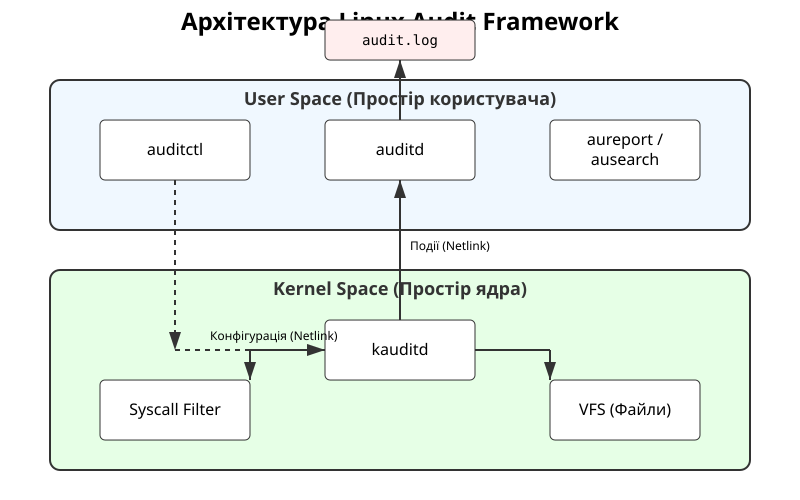

# Підсистема аудиту ядра (Linux Audit Framework)

<preknowlist>
- [Концепції ядра Linux](topic:unix-linux/kernel-and-userspace) — базові поняття системних викликів та VFS.
</preknowlist>

У сучасних системах Linux безпека та спостережність (observability) є критичними для надійності. **Linux Audit Framework** — це підсистема ядра, що фіксує події доступу до системи. Вона перехоплює системні виклики (syscalls), доступ до файлів та зміни конфігурації безпосередньо в ядрі.

На відміну від `syslog`, який залежить від бажання програм писати логи, Audit Framework працює на рівні ядра, тому жоден процес не може приховати свої звернення до операційної системи.

## Архітектура Audit Framework

Підсистема складається з ядерної та користувацької частин, що взаємодіють через Netlink-сокет.

1. **Ядро (kauditd):** Перехоплює системні виклики (syscalls) та звернення до віртуальної файлової системи (VFS). Перевіряє їх за правилами, завантаженими з простору користувача. Якщо є збіг — формує запис (audit record) і відправляє його через сокет.
2. **Простір користувача:**
   - **`auditd`:** Демон, що слухає сокет, приймає події та записує їх на диск (зазвичай у `/var/log/audit/audit.log`).
   - **`auditctl`:** Утиліта для динамічного завантаження та управління правилами.
   - **`ausearch` та `aureport`:** Інструменти для пошуку подій та генерації звітів.

*(Див. Рис. 1: Архітектура Linux Audit Framework)*


## Управління правилами: auditctl

Правила аудиту бувають двох основних типів: стеження за файлами (`-w`) та системними викликами (`-a`).

```bash
# Відстеження запису або зміни атрибутів у /etc/passwd
sudo auditctl -w /etc/passwd -p wa -k passwd_changes
```

Ключ `-k` додає мітку (key) до події, що критично важливо для подальшого пошуку.

## Аналіз логів

Логи `auditd` є детальними, але важкими для читання без інструментів. Кожна подія може складатися з кількох записів, об'єднаних спільним ID (наприклад, `SYSCALL`, `PATH`, `PROCTITLE`).

Для пошуку використовується `ausearch`:

```bash
sudo ausearch -k passwd_changes -i
```

Опція `-i` автоматично декодує ідентифікатори та HEX-рядки у зрозумілий текст. 

Linux Audit Framework надає адміністраторам безкомпромісний механізм стеження, гарантуючи, що всі спроби доступу до критичних ресурсів будуть зафіксовані незалежно від привілеїв чи намірів користувача.
