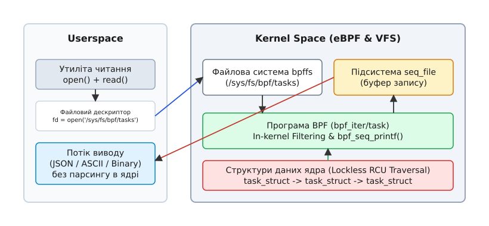
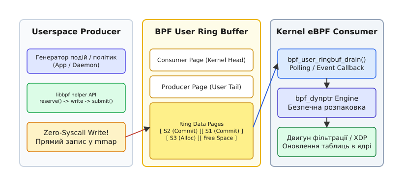

# Ітератори BPF (bpf_iter) та User Ring Buffer

<preknowlist>
- [Розширений фільтр пакетів Берклі (eBPF)](topic:unix-linux/ebpf-extended-berkeley-packet-filter) — базові поняття байт-коду, верифікатора та мап BPF.
- [Порівняльний аналіз BPF Ring Buffer vs Perf Event Array](topic:unix-linux/bpf-ringbuf-vs-perfbuf) — механізми передачі подій з ядра у користувацький простір.
- [Символьна таблиця ядра kallsyms](topic:unix-linux/kallsyms-and-system-map) — механізми розділення символів та структур даних ядра.
</preknowlist>

Сучасне високонавантажене середовище ОС Linux — з тисячами ізольованих контейнерів, десятками тисяч процесів та сотнями тисяч відкритих сокетів — створює критичне навантаження на класичні інструменти моніторингу. Коли утиліти на кшталт `ps`, `top`, `netstat` чи `ss` намагаються зібрати метрики стану системи, вони спираються на послідовне зчитування віртуальних текстових файлів у підсистемах `/proc` або `/sys`.

Отримання інформації про 100 000 активних TCP-з'єднань через файл `/proc/net/tcp` вимагає від ядра Linux послідовного обходу величезної хеш-таблиці сокетів. Під час цього обходу ядро захоплює блокування (read locks або RCU-критичні секції), форматує бінарні структури `struct sock` у текстові рядки ASCII за допомогою системного виклику `snprintf()`, передає мегабайти тексту через межу ядра та простору користувача за допомогою системних викликів `read()`, після чого демон у просторі користувача розбирає цей текст зворотним викликом `sscanf()` чи регулярними виразами. У момент навантажувальних піків цей підхід призводить до марнотратства тактів процесора, перевитрати смуги шини пам'яті та сплесків затримок (latency spikes) у робочих потоках сервера через боротьбу за блокування структур даних ядра.

Для фундаментального розв'язання цієї проблеми накладних витрат підсистем `/proc` та `/sys` при масованій інспекції об'єктів ядра технологія eBPF пропонує дует двох спеціалізованих інструментів: **BPF Iterators** (`bpf_iter`) та **User Ring Buffer** (`BPF_MAP_TYPE_USER_RINGBUF`). Механізм `bpf_iter` усуває накладні витрати на текстове форматування і парсинг, виконуючи програмований обхід та фільтрацію ядерних колекцій даних безпосередньо у контексті ядра, а `User Ring Buffer` розв'язує задачу зворотного асинхронного передавання команд і політик із користувацького простору в ядро без системних викликів.

---

## 1. Внутрішня архітектура BPF Iterators (`bpf_iter`)

Механізм **BPF Iterators** (`bpf_iter`) фундаментально змінює модель збору системної інформації: замість форматування всіх об'єктів ядра в текст та їх відправки у користувацький простір, ядро виконує програмовану BPF-програму безпосередньо в контексті обходу ядерної колекції даних.

### 1.1 Поєднання підсистеми seq_file та eBPF

Історично для створення послідовних текстових файлів у `/proc` ядро використовувало підсистему `seq_file`. Вона спирається на структуру операцій `struct seq_operations`, що включає чотири обов'язкові виклики:

1. **`start()`** — ініціалізує обхід колекції, знаходить перший елемент та захоплює необхідні синхронізатори ядра (мутекси або читацькі секції RCU).
2. **`next()`** — здійснює перехід до наступного елемента списку, хеш-таблиці чи дерева об'єктів.
3. **`show()`** — форматує поточний елемент у текстовий буфер підсистеми `seq_file`.
4. **`stop()`** — завершує обхід колекції та вивільняє тимчасові ресурси й блокування.

При використанні BPF-ітератора ядро підміняє стандартну ядерну функцію `show()` на виклик спеціалізованої BPF-програми типу `BPF_PROG_TYPE_TRACING` із типом прикріплення `BPF_LINK_TYPE_ITER`. 


*Взаємодія файлової системи bpffs, ядра Linux та програми bpf_iter при зчитуванні стану об'єктів ядра.*

Коли користувацька програма відкриває закріплений у файловій системі `bpffs` (зазвичай монтується у `/sys/fs/bpf`) об'єкт ітератора за допомогою системного виклику `open()`, а потім виконує `read()`, ядро ініціалізує стандартний цикл `seq_file`.

Для кожного елемента колекції (наприклад, для кожного процесу `struct task_struct`) ядро готує структуру контексту `bpf_iter__task` і викликає BPF-програму. BPF-програма отримує прямий прочитальний доступ до внутрішніх полів об'єкта ядра через механізм BTF (BPF Type Format) та CO-RE (Compile Once – Run Everywhere).

### 1.2 Безблокувальний обхід RCU та фільтрація в ядрі

Найголовнішою перевагою BPF-ітератора є **фільтрація та агрегація безпосередньо в ядрі (in-kernel filtering)**. Якщо системному монітору потрібно відстежити лише процеси з розміром пам'яті понад 1 ГБ, BPF-програма виконує перевірку полів `task->mm->total_vm` в ядрі. 

Якщо процес не відповідає критеріям, програма просто повертає значення `0`, не записуючи жодного байта в буфер `seq_file`. У результаті крізь межу ядра та простору користувача передаються лише релевантні дані, а кількість системних викликів `read()` та обсяг парсингу зменшується на кілька порядків.

При обході об'єктів ядро Linux застосовує безблокувальний механізм RCU (Read-Copy-Update). Це гарантує, що виконання BPF-ітератора не блокує пишучі потоки (writer threads), які створюють або знищують процеси чи сокети у цей самий момент. Під час обходу списку `task_struct` (функції ядра `next_task()`) ядро утримує читацьку секцію `rcu_read_lock()`. Якщо паралельний потік завершує процес викликом `do_exit()`, сам об'єкт `task_struct` не вивільняється фізично з оперативної пам'яті доки не завершиться поточний крок RCU-ітератора. Це ліквідує небезпеку звернення до звільненої пам'яті (use-after-free) без використання важких мутексів.

```c
/* Приклад BPF-ітератора процесів (Kernel Space, C) */
#include "vmlinux.h"
#include <bpf/bpf_helpers.h>
#include <bpf/bpf_tracing.h>

SEC("iter/task")
int count_high_memory_tasks(struct bpf_iter__task *ctx)
{
    struct seq_file *seq = ctx->meta->seq;
    struct task_struct *task = ctx->task;

    /* task == NULL означає завершення ітерації */
    if (!task)
        return 0;

    struct mm_struct *mm = task->mm;
    if (!mm)
        return 0;

    unsigned long total_vm = 0;
    bpf_probe_read_kernel(&total_vm, sizeof(total_vm), &mm->total_vm);

    /* Фільтрація в ядрі: пропускаємо процеси, що споживають менше 256 МБ */
    if (total_vm < 65536)
        return 0;

    /* Форматуємо лише відібрані об'єкти */
    bpf_seq_printf(seq, "TGID:%d PID:%d COMM:%s PAGES:%lu\n",
                   task->tgid, task->pid, task->comm, total_vm);

    return 0;
}

char _license[] SEC("license") = "GPL";
```

### 1.3 Специфікація режимів виводу: bpf_seq_printf проти bpf_seq_write

BPF-ітератори надають розробнику два канали виводу зібраних даних у буфер `seq_file`:

- **Текстовий режим (`bpf_seq_printf`):** Використовується для формування людсько-читабельних рядків ASCII або формату JSON. Хоча `bpf_seq_printf()` працює в ядрі, вона все одно витрачає процесорний час на форматування специфікаторів. Якщо згенерований текст не вміщується у поточний буфер `seq_file`, функція повертає від'ємний код `-EOVERFLOW`. У відповідь підсистема VFS подвоює розмір буфера (з 4 КБ до 8 КБ) і повторно викликає BPF-програму для того самого елемента.
- **Бінарний режим (`bpf_seq_write`):** Дозволяє копіювати сирі бінарні C-структури прямо у буфер `seq_file`. Користувацький процес отримує суцільний потік структурованих бінарних даних і відображає їх через вказівники на прикладні структури без жодного текстового форматування. Це забезпечує максимальну продуктивність.

### 1.4 Портативність CO-RE та релокація BTF

Важливою складовою BPF-ітераторів є технологія **Compile Once – Run Everywhere (CO-RE)**. Оскільки BPF-ітератор має доступ до внутрішніх полів структур ядра (`task_struct`, `tcp_sock`, `file`), у різних версіях ядра Linux зміщення (offsets) цих полів можуть змінюватися.

Завдяки інформації про типи BTF (BPF Type Format), завантаженій у ядро у файлі `/sys/kernel/btf/vmlinux`, верифікатор BPF під час завантаження програми виконує автоматичну релокацію зміщень полів. Виклик макроса `BPF_CORE_READ(task, mm, total_vm)` розгортається у серію безпечних прочитань `bpf_probe_read_kernel()`, які гарантовано зчитують правильні поля незалежно від того, як була скомпільована конкретна збірка ядра на серваку.

### 1.5 Спектр типів BPF-ітераторів

У сучасних версіях ядра Linux розробникам доступні наступні типи BPF-ітераторів:

- **`iter/task`** — обхід усіх процесів та потоків системи (`struct task_struct`). Дозволяє фільтрувати процеси за станом, привілеями, використання пам'яті та лімітами.
- **`iter/task_file`** — обхід усіх відкритих файлових дескрипторів процесів (`struct file`). Дозволяє виявляти витоки дескрипторів, аналізувати відкриті сокети та моніторити файлові виклики.
- **`iter/task_vma`** — обхід регіонів віртуальної пам'яті процесів (`struct vm_area_struct`). Забезпечує аналіз розподілу пам'яті, відображених бібліотек (.so) та прапорців захисту сторінок (PROT_READ, PROT_WRITE, PROT_EXEC).
- **`iter/tcp` та `iter/udp`** — обхід хеш-таблиць мережевих сокетів (`struct sock`, `struct tcp_sock`). Замінює повільний `/proc/net/tcp` і надає доступ до внутрішніх показників RTT, конгестії та ретрансмісій.
- **`iter/bpf_map_elem`** — обхід елементів будь-якої мапи BPF. Дозволяє інспектувати вміст великих BPF-мап без потреби робити тисячі викликів `bpf_map_get_next_key()`.
- **`iter/cgroup`** — обхід ієрархії контрольних груп контролера cgroupv2.

Для читання результатів ітератора з користувацького простору використовується закріплення (pinning) об'єкта `bpf_link` у `bpffs`.

:::tabs
```c
/* Зчитування BPF-ітератора з користувацького простору (Userspace C) */
#include <stdio.h>
#include <fcntl.h>
#include <unistd.h>

int main(void)
{
    int fd = open("/sys/fs/bpf/my_task_iter", O_RDONLY);
    if (fd < 0) {
        perror("Помилка відкриття BPF-ітератора");
        return 1;
    }

    char buffer[1024];
    ssize_t n;
    while ((n = read(fd, buffer, sizeof(buffer) - 1)) > 0) {
        buffer[n] = '\0';
        printf("%s", buffer);
    }

    close(fd);
    return 0;
}
```
```cpp
// Зчитування BPF-ітератора з користувацького простору (Userspace C++20)
#include <iostream>
#include <fstream>
#include <string>
#include <system_error>

int main()
{
    std::ifstream iter_stream("/sys/fs/bpf/my_task_iter");
    if (!iter_stream.is_open()) {
        std::cerr << "Не вдалося відкрити закріплений BPF-ітератор\n";
        return 1;
    }

    std::string line;
    while (std::getline(iter_stream, line)) {
        std::cout << "[Kernel Iter] " << line << '\n';
    }

    return 0;
}
```
:::

Детальніше про історичні передумови створення цих інтерфейсів можна прочитати у вставці [Історична еволюція інтерфейсів спостережливості ядра Linux](topic:unix-linux/bpf-iterators-and-user-ringbuf/hist-bpf-iter-and-user-ringbuf.md).

---

## 2. Механізм BPF User Ring Buffer (`BPF_MAP_TYPE_USER_RINGBUF`)

Якщо BPF Iterators оптимізували напрямок **Kernel -> Userspace** для читання стану системи, то передача потоку подій або оновлень політик у зворотному напрямку — **Userspace -> Kernel** — довгий час залишалася неідеальною.

### 2.1 Асиметрія комунікації та проблема системних викликів

Для передачі даних у BPF з користувацького простору стандартно використовувалися системні виклики `bpf(BPF_MAP_UPDATE_ELEM)`. Традиційна мапа BPF Hash або Array вимагає виконання системного виклику для кожного окремого елемента. 

Після впровадження захистів від апаратних вразливостей процесорів (Spectre, Meltdown) кожен системний виклик коштує від 200 до 500 наносекунд через ізоляцію таблиць сторінок ядра (KPTI — Kernel Page Table Isolation) та скидання конвеєра спекулятивного виконання інструкцій. Якщо користувацький демон повинен передати в ядро 1 000 000 оновлень на секунду (наприклад, сигнатури атак або динамічні IP-адреси для блокування в XDP), процес витрачає до 50% часу процесора виключно на накладні витрати перемикання контексту (context switch overhead).

У ядрі Linux 5.8 з'явився `BPF_MAP_TYPE_RINGBUF` (BPF Ring Buffer), який дозволив ядру передавати події в userspace без системних викликів через відображення пам'яті `mmap()`. Однак він працював лише в один бік (Kernel Producer -> User Consumer).

Представлена в ядрі Linux 6.1 мапа `BPF_MAP_TYPE_USER_RINGBUF` вирішила цю асиметрію, надавши дзеркальний механізм: **Single Producer (Userspace) -> Single Consumer (Kernel eBPF)**.


*Схема передачі даних з простору користувача в ядро через BPF User Ring Buffer без системних викликів.*

### 2.2 Структура пам'яті та безсистемні виклики (Zero-Syscall Protocol)

Після створення мапи `BPF_MAP_TYPE_USER_RINGBUF` користувацький процес викликає `mmap()` на її файловому дескрипторі. Ядро відображає у віртуальний адресний простір процесу спеціальну структуру пам'яті:

1. **Сторінка споживача (Consumer Page):** Містить вказівник `consumer_pos` (Head), який оновлюється ядром при зчитуванні подій BPF-програмою.
2. **Сторінка виробника (Producer Page):** Містить вказівник `producer_pos` (Tail), який оновлюється користувацьким процесом при записі нових подій.
3. **Кільцевий регіон даних (Data Pages):** Сторінки пам'яті, розбиті на кільцеві слоти для збереження корисного навантаження (payload).

Протокол запису з користувацького простору працює за три кроки **без жодного системного виклику**:

- **Крок 1 (Reserve):** Виробник обчислює доступне місце в буфері як різницю між `producer_pos` та `consumer_pos`. Якщо місця достатньо, користувацький процес атомарно резервує необхідний обсяг байтів і отримує вказівник на пам'ять.
- **Крок 2 (Write):** Процес копіює дані повідомлення безпосередньо у виділений регіон пам'яті.
- **Крок 3 (Submit):** Процес оновлює вказівник `producer_pos`, використовуючи атомарну інструкцію із забар'єрною синхронізацією пам'яті (`smp_store_release`). З цього моменту подія стає видимою для ядра.

### 2.3 Апаратні бар'єри пам'яті та кеш-лінії

Щоб запобігти спотворенню даних при паралельному виконанні на багатоядерних процесорах (SMP), підсистема User Ring Buffer використовує ретельну оптимізацію кеш-ліній (Cache Line Isolation):

- Вказівник `consumer_pos` та вказівник `producer_pos` розташовані на **окремих сторінках пам'яті** (або вирівняні на 64/128 байтів), що повністю ліквідує ефект хибного розділення кешу (False Sharing). Вхідні записи користувача не інвалідують кеш L1/L2 ядра при кожному кроці запису.
- При публікації запису користувацька бібліотека `libbpf` виконує бар'єр пам'яті Release (`smp_store_release` у C або `std::memory_order_release` у C++). Це гарантує, що всі атомарні інструкції копіювання байтів у тіло запису завершаться до того, як новий `producer_pos` стане видимим для процесорного ядра, що виконує BPF-програму.

### 2.4 Зчитування в ядрі через bpf_user_ringbuf_drain та bpf_dynptr

У ядрі BPF-програма зчитує накопичені повідомлення за допомогою помічника `bpf_user_ringbuf_drain()`. Ця функція приймає вказівник на мапу, callback-функцію та контекст. 

Оскільки розмір подій у буфері може бути змінним, верифікатор BPF не може статично перевірити межі пам'яті під час завантаження програми. Для забезпечення безпеки ядро загортає кожне повідомлення у структуру **Dynamic Pointer (`struct bpf_dynptr`)**. 

```c
/* Обробка команд із User Ring Buffer у ядрі (Kernel Space, C) */
#include "vmlinux.h"
#include <bpf/bpf_helpers.h>

struct ip_policy {
    __u32 ip_address;
    __u8  action; /* 1 = DROP, 0 = PASS */
};

struct {
    __uint(type, BPF_MAP_TYPE_USER_RINGBUF);
    __uint(max_entries, 512 * 1024);
} user_ringbuf SEC(".maps");

struct {
    __uint(type, BPF_MAP_TYPE_HASH);
    __uint(max_entries, 10000);
    __type(key, __u32);
    __type(value, __u8);
} drop_list SEC(".maps");

/* Callback для кожної події з User Ringbuf */
static long handle_policy_update(struct bpf_dynptr *dynptr, void *context)
{
    struct ip_policy policy;

    /* Безпечне зчитування з dynptr з перевіркою меж у runtime */
    if (bpf_dynptr_read(&policy, sizeof(policy), dynptr, 0, 0) < 0)
        return 0;

    if (policy.action == 1) {
        __u8 flag = 1;
        bpf_map_update_elem(&drop_list, &policy.ip_address, &flag, BPF_ANY);
    } else {
        bpf_map_delete_elem(&drop_list, &policy.ip_address);
    }

    return 0;
}

SEC("xdp")
int xdp_firewall(struct xdp_md *ctx)
{
    /* Вичищаємо буфер подій без пробудження userspace */
    bpf_user_ringbuf_drain(&user_ringbuf, handle_policy_update, NULL, BPF_RB_NO_WAKEUP);

    /* Далі виконується звичайна логіка XDP фільтрації */
    return XDP_PASS;
}

char _license[] SEC("license") = "GPL";
```

Для керування роботою буфера з користувацького простору бібліотека `libbpf` надає високорівневий API (`user_ring_buffer__new`, `user_ring_buffer__reserve`, `user_ring_buffer__submit`).

:::tabs
```c
/* Передача подій у ядро без системних викликів (Userspace C) */
#include <stdio.h>
#include <bpf/libbpf.h>
#include <bpf/bpf.h>

struct ip_policy {
    uint32_t ip_address;
    uint8_t  action;
};

int main(void)
{
    int map_fd = bpf_obj_get("/sys/fs/bpf/user_ringbuf_map");
    if (map_fd < 0) {
        perror("Не вдалося відкрити мапу User Ringbuf");
        return 1;
    }

    struct user_ring_buffer *urb = user_ring_buffer__new(map_fd, NULL);
    if (!urb) {
        fprintf(stderr, "Помилка створення user_ring_buffer\n");
        return 1;
    }

    /* Запис 100 000 команд у ядро БЕЗ ЖОДНОГО SYSCALL */
    for (uint32_t i = 0; i < 100000; i++) {
        struct ip_policy *policy = user_ring_buffer__reserve(urb, sizeof(*policy));
        if (policy) {
            policy->ip_address = 0x0A000001 + i; /* 10.0.0.1 + i */
            policy->action = 1;                  /* DROP */
            user_ring_buffer__submit(urb, policy);
        }
    }

    printf("100,000 політик надіслано в ядро без системних викликів!\n");
    user_ring_buffer__free(urb);
    return 0;
}
```
```cpp
// Передача подій у ядро без системних викликів (Userspace C++20)
#include <iostream>
#include <memory>
#include <system_error>
#include <bpf/libbpf.h>
#include <bpf/bpf.h>

struct IpPolicy {
    std::uint32_t ip_address;
    std::uint8_t  action;
};

class UserRingBufferWrapper {
    struct user_ring_buffer* rb_{nullptr};
public:
    explicit UserRingBufferWrapper(int map_fd) {
        rb_ = user_ring_buffer__new(map_fd, nullptr);
        if (!rb_) throw std::runtime_error("Помилка ініціалізації user_ring_buffer");
    }
    ~UserRingBufferWrapper() {
        if (rb_) user_ring_buffer__free(rb_);
    }

    template <typename T>
    bool submit(const T& data) {
        auto* slot = static_cast<T*>(user_ring_buffer__reserve(rb_, sizeof(T)));
        if (!slot) return false;
        *slot = data;
        user_ring_buffer__submit(rb_, slot);
        return true;
    }
};

int main()
{
    int map_fd = bpf_obj_get("/sys/fs/bpf/user_ringbuf_map");
    if (map_fd < 0) {
        std::cerr << "Не вдалося відкрити мапу User Ringbuf\n";
        return 1;
    }

    try {
        UserRingBufferWrapper ringbuf(map_fd);
        for (std::uint32_t i = 0; i < 100000; ++i) {
            IpPolicy policy{.ip_address = 0x0A000001 + i, .action = 1};
            if (!ringbuf.submit(policy)) {
                std::cerr << "Буфер переповнено на ітерації " << i << '\n';
                break;
            }
        }
        std::cout << "Успішно передано 100 000 політик у ядро за нуль системних викликів!\n";
    } catch (const std::exception& ex) {
        std::cerr << "Помилка: " << ex.what() << '\n';
        return 1;
    }

    return 0;
}
```
:::

Повний довідник по всіх структурах даних та прапорцях доступний у вставці [Довідник API BPF Iterators та User Ring Buffer](topic:unix-linux/bpf-iterators-and-user-ringbuf/api-bpf-iter-and-user-ringbuf.md).

---

## 3. Синергия BPF Iterators та User Ringbuf: Побудова замкнених систем спостереження

Поєднання `bpf_iter` та `BPF_MAP_TYPE_USER_RINGBUF` дає змогу будувати **замкнені контури спостереження та динамічного адаптивного управління (Closed-Loop Autonomous Control Systems)** з мінімальними накладними витратами.

```
+-------------------------------------------------------------------+
|                        Userspace Daemon                           |
|                                                                   |
|   1. Читає стан через         2. Приймає        3. Відправляє     |
|      open/read()                 рішення           політики       |
|          |                          |                  |          |
+----------|--------------------------|------------------|----------+
           |                          v                  |
   BPF Iter (bpf_seq_write)   [Аналітичний модуль]   User Ringbuf (mmap)
           |                                             |
           v                                             v
+-------------------------------------------------------------------+
|                       Kernel Space (eBPF)                         |
|                                                                   |
|   - Lockless RCU traversal                    - Zero-Syscall      |
|   - In-kernel filtering                         policy apply      |
|   - High-density telemetry                    - Fast XDP / TC     |
+-------------------------------------------------------------------+
```

### 3.1 Патерн робочого циклу замкненої системи

1. **Безблокувальне зчитування стану (`bpf_iter`):** Користувацький процес періодично відкриває BPF-ітератор. В ядрі BPF-програма виконує обхід системних об'єктів (наприклад, усіх сокетів або процесів), фільтрує нормальну поведінку і повертає у userspace лише аномальні агреговані дані.
2. **Аналіз та прийняття рішень (Userspace):** Аналітичний модуль розбирає згенеровані ядром дані, визначає необхідність коригування правил (наприклад, виявляє процес, що вичерпує ліміти bandwidth або генерує шторм запитів).
3. **Миттєве застосування правил (`USER_RINGBUF`):** Демон записує нові керуючі структури у `USER_RINGBUF` без системних викликів. Загальна затримка реакції системи на аномалії знижується з сотень мілісекунд до мікросекундного рівня.

Практичний приклад побудови такої замкненої системи наведено у вставці [Практичний проєкт: Замкнений контур моніторингу та керування](topic:unix-linux/bpf-iterators-and-user-ringbuf/proj-bpf-iter-and-user-ringbuf.md).

---

## 4. Порівняльний аналіз та межі застосування

Розумне використання нових механізмів eBPF вимагає розуміння їхніх обмежень та компромісів продуктивності.

| Критерій | Традиційний `/proc` + `seq_file` | BPF Iterators (`bpf_iter`) | BPF Map Update (`bpf_map_update`) | User Ring Buffer (`USER_RINGBUF`) |
| :--- | :--- | :--- | :--- | :--- |
| **Напрямок даних** | Kernel -> Userspace | Kernel -> Userspace | Userspace -> Kernel | Userspace -> Kernel |
| **Накладні витрати** | Високі (ASCII parsing + sys call) | Мінімальні (In-kernel filter) | Високі (200–500 ns/syscall) | Майже нульові (Zero-syscall mmap) |
| **Синхронізація** | Мутекси / Spinlocks | Lockless RCU | Spinlocks / Map Locks | Lockless Single-Producer Ring |
| **Гнучкість виводу** | Жорстко задана в ядрі | Програмована BPF | Статична структура | Потік подій змінного розміру |
| **Мінімальне ядро** | Linux 2.4.15 | Linux 5.8 | Linux 3.18 | Linux 6.1 |

### 4.1 Обмеження та компроміси

1. **Вимога до версії ядра:** BPF Iterators вимагають ядра Linux 5.8+, а User Ring Buffer — 6.1+. На застарілих дистрибутивах (наприклад, RHEL 8) ці механізми недоступні.
2. **Обмеження пам'яті (Locking limits):** Мапа `USER_RINGBUF` вимагає виділення заблокованої в оперативній пам'яті фізичної сторінки (`RLIMIT_MEMLOCK`), що може вимагати підвищених привілеїв (`CAP_BPF` або `CAP_SYS_ADMIN`).
3. **Модель Single-Producer:** На відміну від стандартного `BPF_MAP_TYPE_RINGBUF` (де багато ядер можуть виступати про inline-виробників), `USER_RINGBUF` підтримує лише **одного користувацького виробника (single-producer)** у кожен момент часу. Якщо кілька користувацьких потоків намагаються писати у буфер одночасно, вони мусять використовувати зовнішній м'ютекс у користувацькому просторі.

## Підсумок

Впровадження BPF Iterators (`bpf_iter`) та BPF User Ring Buffer (`BPF_MAP_TYPE_USER_RINGBUF`) завершило формування повністю програмованої двонаправленої шини обміну даними між ядром Linux та простором користувача. 

BPF-ітератори усунули колосальні накладні витрати на форматування та парсинг тексту в `/proc`, надавши можливість виконувати обхід і фільтрацію об'єктів ядра безблокувальним способом безпосередньо в контексті RCU. У свою чергу, User Ring Buffer закрив прогалину продуктивності в зворотному напрямку, дозволивши передавати мільйони оновлень політик та подій у ядро за нуль системних викликів за допомогою mmap та атомарних інструкцій.

Разом ці механізми утворюють технічний фундамент для сучасних хмарних систем спостережливості (Observability), мережевих екранних фільтрів (XDP Firewall) та автоадаптивних комплексів безпеки нового покоління.
